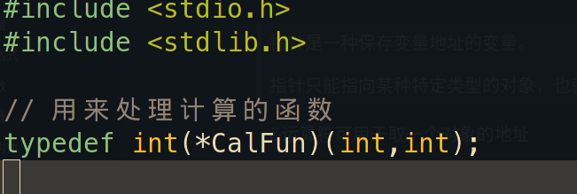
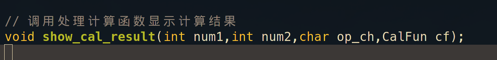

# C 语言笔记

---

## 变量

### 声明和定义

**声明**(Declaration) 和 **定义**(Definition) 关系:

一个声明同时也要求分配存储空间，则称为 **定义**。反之，则只是 **声明**。

#### typedef 关键字

关键字 **typedef** 用于给已有的数据类型指定一个新的名称。

### 局部变量与全局变量

1. **局部变量** 可以用任意类型相符的表达式来初始化。**全局变量** 只能用 **常量表达式** 来初始化。
> [!tip]
> 
> 原因：全局变量的初始值要求保存在编译生成的目标代码中，所以必须在编译时计算出来。

2. 全局变量定义时不初始化，则初始值为 0。而局部变量定义时不初始化，则初始值不确定。
> [!tip]
> 
> 局部变量在使用前一定要先赋值，防止引入 bug。

---

## 数据类型

### 数组

---

## 表达式

表达式是由 <a href="#exp_primary">初等表达式</a>与运算符构成的一个合乎 C 语言语法的序列组合。

表达式核心功能:**求值**。求值之外的所有功能都称为 **副作用**/**副效应**(Side Effect)。

> [!exampl]
> 
>如 printf() 函数为例，以下是 printf 函数的<a href="#func_prototype">声明</a>
>
>```c
>int printf(const char *format, ...);
>```
>
>从 printf 函数的声明可以得到以下结论:
>
>* printf 函数的返回值为 printf 函数中字符的数量
>* printf 函数将内容显示到屏幕上，这就叫 printf 函数的「副作用 」(Side Effect)

### <a id="exp_primary">初等表达式</a>

Primary Expressions **初等表达式**，也译为「主表达式」、「 元表达式」

初等表达式有以下几种:

* 变量名或函数名

* 常量

* 文字串字面量

---

## 语句

### 选择语句

#### if 语句

if 语句语法格式：`if(表达式) 语句`

> [!info]
> 
> 一样为了结构更清晰和美观，一般使用加空格及换行：
> 
> ```c
> if (表达式)
> 	语句
> ```

#### if-else 语句

最原始的语句形式：`if(表达式) 语句1 else 语句2 `

> [!info]
> 
> `else` 与语句 2 之间的空白符是必须的（至少要有一个），否则编译器无法识别 `else` 关键字。
> 
> 一般来说，使用换行来写，语句结构更明晰：
> 
> ```c
> if(表达式)
> 	语句1
> else
> 	语句2
> ```

### 循环语句

#### for 语句

语法：`for([表达式1]；[表达式2]；[表达式3]) 语句`

for 语句 `()` 中，只有**2**个 `;` 是必须的。所以 for 语句最简形式是这样的：`for(;;)`

---

## 函数

> ​函数 (function) 是用于完成特定任务的一段独立的代码单元，是构成 C 语言源程序的基本单位。

每次函数调用时，分配参数和局部变量的存储空间，称为一个 **栈帧**(Stack Frame)。

系统为每个程序的运行预留了栈空间，函数调用时就在这个栈空间里分配栈帧，函数返回时就释放栈帧。

### <a id="func_prototype">函数声明</a>

函数声明也叫做「函数原型」（prototype）。

函数原型语法格式:

```c
函数类型 函数名(参数列表);
```

函数原型的功能是将有关函数的信息告知编译器。

没有函数体的函数声明，它为编译器提供了生成指令的模板。

函数原型必须出现在函数调用之前，这是遵循 "**先声明后使用**" 的原则，所以函数原型应放在第一个函数之前，最好将所有的函数原型放在一起。

> [!info]
> 
> 函数原型与函数声明中参数名不要求相同。事实上,函数原型中的参数名是可选的：
>
> ```c
> int cal(int,int);
> ```
>
> 但参数名能够直到很好的说明作用。

### 函数定义

函数定义 (Function Definition) 是指在代码中具体写出函数完成任务的步骤和方法。编译器只有见到函数定义才会生成指令。

函数定义包括两个部分：

* <a href="#func_head">函数头</a>
* <a href="#func_body">函数体</a>

#### <a id="func_head">函数头</a>

函数头由三部分组成:

1. 返回值类型

2. 函数名

3. 参数列表

函数头部分和函数声明非常类似，区别函数声明是以**;**结束。

[函数原型](C_Note.md#函数声明) 并不必与 **函数头** 完全相同。参数的名称可以不同，只要参数的类型、数目、顺序相同既可。也就是说函数原型除了参数名称外，函数原型必须也与函数头一致。

##### 返回值类型

从 [表达式](C_Note.md#表达式) 角度，其核心功能是「求值」，而函数调用也是一种表达式，函数调用中那对小括号「()」，就是函数调用运算符。

所以称 "**返回值类型**"，是从表达式角度看函数。

如果从数据角度看函数，将函数当成数据的一种，可以认为函数是一种相对动态的数据，这数据的确定有时需要外部参数参与，需要一条或多条语句共同完成。而从数据定义角度观察函数头，就会发现以下语法现象:

​			变量定义: **类型** **变量名**

​			函数头定义: **返回值类型** **函数名**

可以看到函数头的定义，与普通变量的定义是类似的，返回值就相当于变量的数据类型。

所以从数据角度，可以认为函数返回值类型，就是函数这种 **特殊** 数据的数据类型。

#### <a id="func_body">函数体</a>

### Return 语句

return 语句的主要作用是推荐整个函数的 [返回值](C_Note.md#返回值类型)，并结束当前函数的执行。

在没有返回值函数中使用 return 语句，相当于结束当前函数的执行。

函数的返回值不是左值，所以无法对其赋值。

函数的返回值 也是按值传递。

```c
return x; //返回的是变量x的值，而非变量x本身
```

### 递归

函数自己直接或间接调用自己，称其为 **递归函数**(Recursive)。

---

## 指针

指针是 C 语言的一种数据类型。

定义该类型的变量，称为 **指针变量**。

> [!tip]
> 
>指针是一种保存变量地址的变量。
>
>指针只能指向某种特定类型的对象，也就是说，每个指针都必须指向某种特定的数据类型。

指针变量定义一般格式:

```c
类型说明符 *变量名
```

例子：

```c
int *pStu		
```

`*` 表示 pStu 是一个指针变量，int 是指针变量 pStu 指向的变量的数据类型。

`&` 运算符只能获取内存中变量的地址 -- 变量、数组。不能获取常量、表达式之类的地址。

`*` 运算符是间接寻址或间接引用运算符。当它作用于指针时，将访问指针所指向的对象。

### 指针操作

1. 赋值

   指针的赋值操作，其实就是指针的初始化，指针变量初始化要用到地址运算符 `&`。

   指针在使用前，不仅要定义，而且还要赋值初始化，赋值后才能使用。

   指针赋值时，只能赋兼容类型的值。

   ```c
   int num = 6;
   int *p = &num;
   ```

   `*p = &num`，这种赋值语法只能用在初始化中。

   如果已经初始化后的指针变量，如果再对其赋新的地址值，则不应加 * 运算符，因为这时 *p 是指向地址的内容。如果二次地址赋值，将在编译时报 「赋值类型也变量类型不一致 」的错误。所以应该将初始化当成一种 **特殊** 的赋值，所以语法上也有点 **特殊**。

1. 取值

   通过指针取值，便是通过 `*` 这个「取值运算符」和指针变量的结合使用，间接访问指针指向的变量。

   如果通过指针变量获取了数组的地址，那可以不带 `*` 访问数组各元素，跟使用**数组名 [下标]**这种方式完全等效。
   
	```c
	int arr1[5] = {52,23,132,78,65};
   
	int *ap = arr1;
   
	for (int i = 0; i < 5; i++) {
   	
		printf("*ap[%d]: %d\n",i,ap[i]);
		printf("*ap: %d\n",*(ap+i));
	
		printf("ap[%d]: %p\n",i,&(ap[i]));
		printf("arr1[%d]: %p\n",i,&arr1[i]);

	}
	```

	> [!tip]
	> 
	> `&(ap[i])` 得到的地址值与 `&arr1[i]` 完全一样。`ap[i]` 跟 `arr1[i]` 完全等效。也就是说，获取了数组的地址的指针变量，操作数组跟使用数组变量一样
	> 
	> 数组的变量名保存的是数组的首地址，即数组第一个元素的地址。数组的索引值，实质是这个首地址的偏移量，通过偏移量可得到数组其他元素的地址值
	> 
	> 另外 `ap[i]` 也完全等价于 `*(ap+i)`
	> 
	> 扩展来，传统的数组元素访问的写法,如例子 arr1[i],也可改写成通过数组指针操作的形式：*(arr1+i)
	> 
	> 事实上，在计算数组元素 arr1[i] 的值时，C 语言实际上是先将其转换成 *(arr1+i) 的形式，再进行求值的
	> 
	> 如果对于数组元素访问的两种等价表示形式分别施加地址运算符&，那&arr1[i] 和 arr1+i 也是相同的
	> 
	> 数组名和指针有一个不同点：数组名不是变量,所以 arr1=arr1 或 arr1++ 是非法的

> [!tip] `*` 及 `&`
> 
> `*` 操作符**只能**用在指针变量上，因为它是取的是些变量存储的「地址值」所指向的内存空间中的值，这最终的结果值，有可能也是个地址，也有可能是别的类型的值。
> 
> `&` 操作符可用于任何变量，取的是此变量的「自身的地址值」，这个操作符取到的值只能是「地址」。

1. 指针与整数加法
2. 指针与整数减法

### 函数指针

函数指针的声明语法格式:

```c
typedef 返回类型 (*函数指针类型名)(参数列表)
```

例子:



上面例子定义一个返回值为 int，参数列表有两个参数，两个都为 int 型，函数指针的名称叫 CalFun 的函数指针。

在其他函数声明中将上面的函数指针当成参数传入：



可以看到在之前的函数指针声明的类型名，就是参数的类型。


函数指针作为实参传入其他函数内，其调用跟普通函数调用相同。

---

## 结构体

---

## 相关书籍

* 《C 程序设计语言 第 2 版》 Brain W. Kernighan & Dennis M. Ritchie 徐宝文 李志 译
* 《狂人 C 程序员入门必备》 键盘农夫 著
* 《21 天学通 C 语言》 第 6/7 版 Bradley L. Jones & Peter Aitken 著 信达工作室 译
* 《C Primer Plus》第 6 版 Stephen Prata 著 姜佑 译
* 《Linux C 编程一站式学习》 宋劲杉 著
* 《C 语言程序设计现代方法》 第 2 版 K. N. King 著 吕秀锋 黄倩 译
* 《C 语言编程魔法书》 陈轶 著
* 《C 指针编程之道》 孔浩 张华杰 陈猛 编著

---

## 视频

[C语言视频清单](C_Videos.md)

