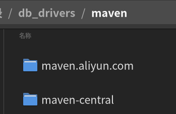

# 数据库笔记

---

## 目录

* [数据库原理](#数据库原理)
* [各数据库笔记](#各数据库笔记)
	* [MySQL](#MySQL)
	* [Oracle](#Oracle)
	* [SQLSERVER](#SQLSERVER)
	* [POSTgreSQL](#POSTgreSQL)
	* [SQLite](#SQLite)
* [数据库客户端](#database_client)
	* [NaviCat](#NaviCat)
	* [DBeaver](#DBeaver)

---

## 数据库原理

### 概念

#### 信息

> [!quote] 
> 
> 信息是物质存在的一种方式、形式或运动状态，也是事物的一种普遍属性，一般指 [数据](#数据) 数据、消息中所包含的意义，可以使消息所描述事件的不确定性减少。

信息是一种已经被加工为特定形式的 [数据](#数据)。

#### 数据

数据是描述事物的**符号**记录，即用来记录 [信息](#信息) 的可识别符号，是**信息的具体表现形式**。描述事物的符号可以是数字，也可以是文字、图形、图像、音频、视频等。多种不同的数据形式表示同一信息。

> [!tip] 
> 
> 数据是信息的载体；信息是数据的含义。只有有价值的数据才是信息。

##### 数据处理

**数据处理**是指将 [数据](#数据) 转换成 [信息](#信息) 的过程。经过处理，信息被加工成特定形式的数据。所以数据处理也称为**信息处理**。

数据处理的内容主要包括数据的收集、组织、整理、存储、加工、维护、查询和传播等一系列活动。

#### 数据模型

#### 数据库

数据库，简单讲是存放数的仓库。

> [!quote] 
> 
> 「数据库是长期储存在计算机内、有组织的、可共享的大量数据的集合。数据库中的 [数据](#数据) 按一定的 [数据模型](#数据模型) 组织、描述和储存，具有 较小的冗余度（redundancy）、较高的数据独立性（data indpendency）和易扩展性（scalability），并可为各种用户共享。」

##### 数据库管理系统

数据库管理系统（Database Managemanet System，DBMS）是位于用户与操作系统之音的一层**数据管理软件**，它为用户或应用程序提供访问数据库的方法，包括数据库的创建、查询、更新和各种数据控制，它是 [数据库系统](#数据库系统) 的核心。

##### 数据库应用系统

凡使用数据库技术管理其数据的系统都称为「数据库应用系统」（Database Application System，DBAS）。

##### 数据库系统

数据库系统（Database System，DBS）是由 [数据库](#数据库)、[数据库管理系统](#数据库管理系统)、[数据库应用系统](#数据库应用系统) 和数据库管理员（Database administrator DBA）组成的存储、管理、处理和维护数据的系统。

### 范式

构造数据库必须遵循一定的规则，在关系型数据库中，这种规则就称为「**范式**」。

按规范化程度从低到高可分为 5 级范式。一般来说，数据库只需要东路第三范式。

> [!quote] 
> 
> 规范化的基本思想是逐步消除数据依赖中不合适的部分，使模式中的各关系模式达到栽种程序的「分离」，即「一事一地」的模式设计原则。-- 《数据库系统概论》第 5 版。

#### 第一范式

#### 第二范式

#### 第三范式

---

## 各数据库笔记

### MySQL

* [MySQL 笔记](mysql/MySQL_Note.md)
* [MySQL资料](mysql/MySQL_Material.md)
* [MySQL常用操作](mysql/MySQL常用操作.md)

### Oracle

### SQLSERVER

### PostgreSQL

* [PostgreSQL 笔记](PostgrSQL/PostgreSQL_Note.md)
* [PostgreSQL 视频清单](PostgrSQL/PostgreSQL_Videos.md)

### SQLite

[SQLite 笔记](SQLite/SQLite_Note.md)

--- 

## 数据库客户端

### NaviCat

---

### DBeaver

[DBeaver](https://dbeaver.io/)  是一个强大的数据库客户端。它比收费的 [NaviCat](#NaviCat) 强大多了。

它支持 MySQL, PostgreSQL, SQLite, Oracle, DB2, SQL Server 等主流数据库。

它有分「社区版」（Community）和「Pro 专业版」。免费的社区版完全够用了。

DBeaver 除了独立安装版还有 [Eclipse 插件版](Java_Note.md#DBeaver) 。

#### 驱动设置及换源

##### 驱动设置

###### 本地文件夹

「本地文件夹」是用来设置驱动保存的目标目录。

设置方式：

设置驱动存储目录：`首选项` -> `连接` -> `驱动`，其中「本地文件夹」就是驱动保存的目录。

DBeaver 使用 [Maven_Note](../Java/Maven/Maven_Note.md) 下载驱动。要知道 maven 国内下载速度可能慢，所以最好添加国内的源。

阿里公共库：[https://maven.aliyun.com/repository/public](https://maven.aliyun.com/repository/public)

「首选项」-「连接」-「驱动」-「Maven」，点「添加」，输入地址，并将新建的源项移到最顶。

> [!info]
> 
> 不同源下载的驱动，不会共同同文件。因为在 [本地文件夹](#本地文件夹) 下按不同源分别存储。
>
> 
> 
> 如上图中，「本地文件夹」设置的路径下，`maven` 下有两目录，一个是 maven 的 [中央仓库](../Java/Maven/Maven_Note.md#中央仓库)，而另一个是自行添加的阿里的源。

#### 链接设置

有一些比较常用的连接设置：

* `allowMultiQueries`：允许执行多条查询语句
> [!tip] 
> 
> 这个设置默认是 `false`，所以会出现「执行 SQL 脚本」没错，但选择多条 SQL 语句点「执行 SQL 语句」时，就会出现 `1064` 的错误，提示是语法错误，但事实语法是没错的，就是这个设置禁止了多条 SQL 语句的执行才造成的。

---

## 相关笔记

* [SQL笔记](SQL_Note.md)
* [数据库资料](mysql/DataBase_Material.md)

