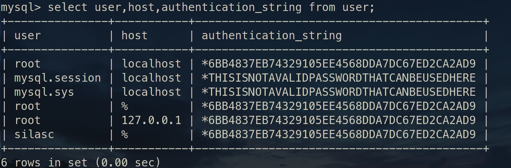

# Linux 下安装 MySQL5.7

### 创建用户组及用户

```shell
groupadd mysql
useradd -r -g mysql -s /bin/false mysql
```

### 将压缩包解压到要安装的目录

```shell
cd /usr/local
tar zxvf /path/to/mysql-VERSION-OS.tar.gz
ln -s full-path-to-mysql-VERSION-OS mysql
```

#### 在 mysql 安装目录下新建 mysql-files 目录并分配权限

```shell
mkdir mysql-files
chmod 750 mysql-files
```

> **data** 目录不能提前建，它是由 **mysqld** 初始化时通过**--datadir**来指定生成的

### 初始化

``` shell
./bin/mysqld --initialize --user=mysql --basedir=/usr/local/mysql-5.7/ --datadir=/usr/local/mysql-5.7/data/ --pid-file=/usr/local/mysql-5.7/data/mysql.pid
```

> [!info] 
> 
> **--datadir** 选项是必需的，并且数据目录必须不存在。
>
> 用**--initialize**会给 root 生成一个默认密码，**--initialize-insecure**不生成密码

**--user** **--basedir** **--datadir** **--pid-file** 本来这几个选项是 **mysql_install_db** 的。

> [!tip] 
> 
> 从 MySQL 5.7.6 开始不推荐使用 **mysql_install_db**，因为它的功能已集成到 MySQL 服务器 **mysqld** 中。要初始化 MySQL 安装，请使用**--initialize**或**--initialize-insecure**选项调用**mysqld**。

#### mysqld 的选项

```shell

--initialize        	Create the default database and exit. Create a super user 
						with a random expired password and store it into the log.
						
--initialize-insecure 	Create the default database and exit. Create a super user with empty password.
                    
-u, --user=name     	Run mysqld daemon as user.
    
-b, --basedir=name  	Path to installation directory. All paths are usually resolved relative to this
  
-h, --datadir=name  	Path to the database root directory
  
--pid-file=name     	Pid file used by safe_mysqld

```

使用 `mysqld --verbose --help` 查询 **mysqld** 的选项和参数，发现原来 **mysql_install_db** 中的选项，在 **mysqld** 中都存在了，这也印证了 "**mysql_install_db** 将在将来的 MySQL 版本中删除 " 的说法。

默认情况,执行 **mysqld** 可能缺少 **libnuma** 库,安装 **numactl** 就可以解决这个问题：

```shell
sudo pacman -S numactl
```

> [!info] 
> 
>**data**、**mysql-files** 目录的用户必须是 **mysql**
>
>所以在将 **mysql 安装目录** 改回 root 或其他用户后，单独再次修改 **data** 和 **mysql-files** 目录的用户为 **mysql**

```shell
chown mysql data mysql-files
```

###### 开启 ssl

```shell
bin/mysql_ssl_rsa_setup --datadir=/usr/local/mysql-5.7/data
```

### 启动

#### 启动方式 1

mysqld_safe         

```shell
bin/mysqld_safe --user=mysql &
```

如果使用 mysqld_safe 方式登录，出现错误，往往是少了依赖。


那就装依赖包：

```shell
sudo apt install libncurses5
```

> [!info]
>
> 缺少 libncurses.so.5，在 arch 里是 ncurses5-compat-libs，同样进行安装：

```shell
sudo pacman -S ncurses5-compat-libs　
```

> [!tip] 
> 
> 使用初始化生成的临时密码使用 root 登录

#### 启动方式 2

使用 `mysql.server` 来启动

```shell
support-files/mysql.server start
```

> [!info]
>
> 如果启动出现以下错误：
> 
>```shell
> error while loading shared libraries: libncurses.so.5: cannot open shared object file: No such file or directory
>```
>
> 明显就是缺少相应的库了。
>
> 缺少 **libncurses.so.5**，在 arch 里是 **ncurses5-compat-libs**，同样进行安装：
>
>```shell
> sudo pacman -S ncurses5-compat-libs
>```

###### 为了方便将 mysql.server 添加为启动服务 (旧)

```shell
cp support-files/mysql.server /etc/init.d/mysql.server
```

###### suppor-files/mysql.server 会找/etc/下的 my.cnf 配置文件，如果/etc/下没有，将会到默认地址/usr/local/mysql/路径下找 mysql_safe


> **添加服务后重启，不然容易出现找不到服务**
>
> 如果报 PID 文件找不到就得重新初始化 mysql 了~

###### manjaro 下不使用以上方式添加启动服务

>可以为 **mysql.server** 添加有个软链接
>
>```shell
>sudo ln -s /usr/local/mysql-5.7/support-files/mysql.server /usr/local/bin/mysql_server-5.7
>```
>
>这样就直接调软链接就能启动和关闭 mysql 服务
>
>```shell
>sudo mysql_server-5.7 start
>```
>
>```shell
>sudo mysql_server-5.7 stop
>```

### 修改密码及权限

> [!tip]
>
> 使用初始化给的 root 帐号及随机密码登录 mysql 成功后，要修改密码

```mysql
alter user 'root'@'localhost' identified by 'youpassword'; 
```

###### 记得刷新下

```mysql
flush privileges;
```

###### 以下的修改密码不能在临时密码状态下使用，只能在上面修改后重新登录后才能使用

```mysql
grant all privileges on *.* to 'energy_pf'@'192.168.2.65' identified by 'energy_pf' with grant option;
```

> [!important] 
> 
> **每次对用户权限修改、增加都得 `flush` 下**

MySQL 8.0+ 版本，创建用户和授权应分开。
所以上面那个 `grant ... identified by ...` 创建和授权一句搞掂的方式，在 MySQL8 下是无效的。

在 MySQL8 下应分「两步走」，使用以下方式：

> [!tip] 
> 
> 创建用户和授权都应先切换到 mysql 数据库（`use mysql;`）。

1. 创建用户
```sql
create user '用户名'@'访问主机' identified by '密码';
```

2. 授权
```sql
grant 权限列表 on 数据库 to '用户名'@'访问主机' with grant option;

-- 例子:
-- 为账号授以对于所有数据库拥有所有权限
GRANT ALL PRIVILEGES ON *.* TO 'remote'@'%'; 
-- 为账号授以对于所有数据库拥有所有权限，并将权限分发出去
GRANT ALL PRIVILEGES ON *.* TO 'remote'@'%' WITH GRANT OPTION;

```

> [!info] 添加用户完整示例
> 
> ```sql
> create user 'silasc'@'%' identified by '123456';
>
> grant all privileges on *.* to 'silasc'@'%' with grant option; 
>
> flush privileges;
>```
>
> `'用户名'@'%'` 这是授权用户所有连接地址都连上 MySQL，但除了 `localhost`。要使用 localhost，得再单独对 `localhost` 连接地址授权一次。可以查看 `mysql.user` 表，`%` 和 `localhost` 是分别存放在两行的。
>

##### 查看 user 表

> [!info] 
> 
> user 表是放在 mysql 数据库中
>
> 所以先选择库再查询表
>
>```sql
> use mysql;
>
> select user,host,authentication_string from user;
>
>```
>
> mysql5.7 的 user 的密码是加密后放在 **authentication_string** 这个字段中。
>
> 

##### 其他账号操作

添加新账号：

```sql
create user zhangsan identified by 'zhangsan';
```

删除账号：

```shell
DROP USER '用户名'@'连接地址';
```

> [!tip] 
> 
> `DROP USER 'root'@'%';`

#### Misc

```shell

----启动MySQL
mysqld --defaults-file=/etc/my.cnf &
mysqld_safe --defaults-file=/etc/my.cnf --user=mysql &
service mysql start
/etc/init.d/mysql start
mysqld_multi start #多实例

----关闭MySQL
mysqladmin -uroot -plhr -S /tmp/mysql3306.sock shutdown
service mysql stop
/etc/init.d/mysql stop
mysqld_multi stop #多实例

--杀死mysql
killall mysqld
killall -9 mysqld
```

如果原来使用 mysqld_safe 启动，可以使用 **killall mysqld** 关闭

> Unix 和类似 Unix 的系统上的 MySQL 发行版包含一个名为 **mysql.server** 的脚本，该脚本使用 **mysqld_safe** 启动 MySQL 服务器。它可以在使用 System V 样式的运行目录来启动和停止系统服务的系统 (例如 Linux 和 Solaris) 上使用。
>
> **mysql.server** 是在 MySQL 源代码树中使用的脚本名称。安装的名称可能不同 (例如 **mysqld** 或 **mysql**)。

使用 **mysql.server** 启动和停止 mysql

```shell
mysql.server start
mysql.server stop
```

---

## 相关笔记

* [MySQL笔记](MySQL_Note.md)
* [MySQL常用操作](MySQL常用操作.md)
* [Docker 安装 MySQL](../../Docker/Docker_Note.md#dk_softc_demo_mysql)
* [MySQL 配置笔记](MySQL_Config_Note.md)
* [Linux 笔记](../../Linux/Linux_Note.md)

