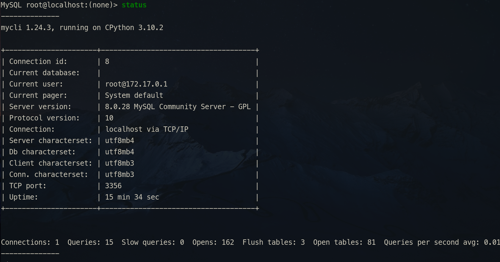

# MySQL 常用操作

---

## 目录

* [客户端命令](#客户端命令)
* [数据库相关命令](#mysql_database_command )

---

## 客户端命令

### 登录

```
mysql -h localhst -P 3356 -u silascript -p 123456
```

* `-h`：连接地址
* `-P`：端口号
* `-u`：帐号
* `-p`：密码。
> [!tip] 
>
> 可以不直接输入，因为这样输入会直接把密码以明文的方式显示在屏幕上。最好是直回车，之后会有提示让你输入密码，这时输入的密码是用 `*` 替代的，安全性更高。

---

## <span id="mysql_database_command">数据库相关命令</span> 

1. 显示数据库
```shell
show databases;
```

2. 显示当前数据库 
```shell
select database();
```

3. 查看数据库使用端口
```shell
show variables like 'port';
```

4. 查看数据库编码
```shell
show variables like 'character%';

show variables like 'collation%';

status;
```

5. 查看当前数据库所有表
```shell
show tables;
```

6. 查看数据文件存放路径
```shell
show variables like '%datadir%';
```
7. 查看 MySQL 状态
```shell
status
```


8. 查看 MySQL 版本号
	* `select version();`
	> 还有上面的 `status` 命令也能看到 MySQL 的版本号信息


---

## DML


## 创建数据库

创建库并设置字符集：

```sql
CREATE DATABASE 库名
  CHARACTER SET utf8mb4
  COLLATE utf8mb4_general_ci;
```


---

## 相关笔记

* [MySQL笔记](MySQL_Note.md)
* [MySQL 配置笔记](MySQL_Config_Note.md)
