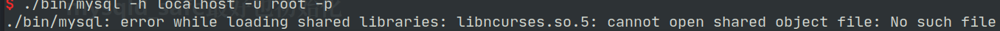
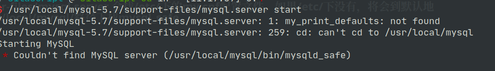
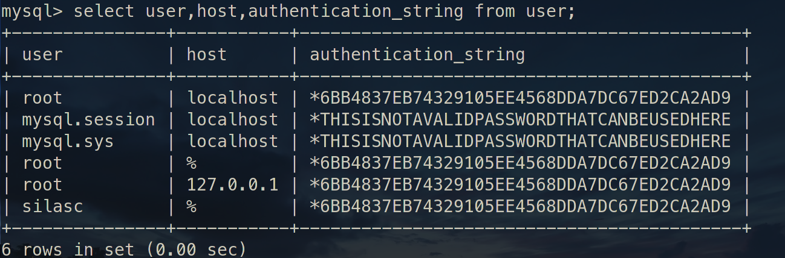

# Linux 下安装 MySQL5.7

### 创建用户组及用户

```shell
groupadd mysql
useradd -r -g mysql -s /bin/false mysql
```

### 将压缩包解压到要安装的目录

```shell
cd /usr/local
tar zxvf /path/to/mysql-VERSION-OS.tar.gz
ln -s full-path-to-mysql-VERSION-OS mysql
```

#### 在 mysql 安装目录下新建 mysql-files 目录并分配权限

```shell
mkdir mysql-files
chmod 750 mysql-files
```

> **data** 目录不能提前建，它是由 **mysqld** 初始化时通过**--datadir**来指定生成的

### 初始化

``` shell
./bin/mysqld --initialize --user=mysql --basedir=/usr/local/mysql-5.7/ --datadir=/usr/local/mysql-5.7/data/ --pid-file=/usr/local/mysql-5.7/data/mysql.pid
```

> [!info] 
> 
> **--datadir** 选项是必需的，并且数据目录必须不存在。
>
> 用**--initialize**会给 root 生成一个默认密码，**--initialize-insecure**不生成密码

**--user** **--basedir** **--datadir** **--pid-file** 本来这几个选项是 **mysql_install_db** 的。

> [!tip] 
> 
> 从 MySQL 5.7.6 开始不推荐使用 **mysql_install_db**，因为它的功能已集成到 MySQL 服务器 **mysqld** 中。要初始化 MySQL 安装，请使用**--initialize**或**--initialize-insecure**选项调用**mysqld**。

#### mysqld 的选项

```shell

--initialize        	Create the default database and exit. Create a super user 
						with a random expired password and store it into the log.
						
--initialize-insecure 	Create the default database and exit. Create a super user with empty password.
                    
-u, --user=name     	Run mysqld daemon as user.
    
-b, --basedir=name  	Path to installation directory. All paths are usually resolved relative to this
  
-h, --datadir=name  	Path to the database root directory
  
--pid-file=name     	Pid file used by safe_mysqld

```

使用 **mysqld --verbose --help** 查询 **mysqld** 的选项和参数，发现原来 **mysql_install_db** 中的选项，在 **mysqld** 中都存在了，这也印证了 "**mysql_install_db** 将在将来的 MySQL 版本中删除 " 的说法。

默认情况,执行 **mysqld** 可能缺少 **libnuma** 库,安装 **numactl** 就可以解决这个问题：

```shell
sudo pacman -S numactl
```

> [!info] 
> 
>**data**、**mysql-files** 目录的用户必须是 **mysql**
>
>所以在将 **mysql 安装目录** 改回 root 或其他用户后，单独再次修改 **data** 和 **mysql-files** 目录的用户为 **mysql**

```shell
chown mysql data mysql-files
```

###### 开启 ssl

```shell
bin/mysql_ssl_rsa_setup --datadir=/usr/local/mysql-5.7/data
```

### 启动

#### 启动方式 1

mysqld_safe         

```shell
bin/mysqld_safe --user=mysql &
```

如果使用 mysqld_safe 方式登录，出现错误，往往是少了依赖。



那就装依赖包：

```shell
sudo apt install libncurses5
```

> [!info]
>
> 缺少 libncurses.so.5，在 arch 里是 ncurses5-compat-libs，同样进行安装：

```shell
sudo pacman -S ncurses5-compat-libs　
```

> [!tip] 
> 
> 使用初始化生成的临时密码使用 root 登录

#### 启动方式 2

使用 mysql.server 来启动

```shell
support-files/mysql.server start
```

> [!info]
>
>```shell
> 如果启动出现以下错误:
> error while loading shared libraries: libncurses.so.5: cannot open shared object file: No such file or directory
>```
>
> 明显就是缺少相应的库了。
>
> 缺少 **libncurses.so.5**，在 arch 里是 **ncurses5-compat-libs**，同样进行安装：
>
>```shell
> sudo pacman -S ncurses5-compat-libs
>```

###### 为了方便将 mysql.server 添加为启动服务 (旧)

```shell
cp support-files/mysql.server /etc/init.d/mysql.server
```

###### suppor-files/mysql.server 会找/etc/下的 my.cnf 配置文件，如果/etc/下没有，将会到默认地址/usr/local/mysql/路径下找 mysql_safe



> **添加服务后重启，不然容易出现找不到服务**
>
> 如果报 PID 文件找不到就得重新初始化 mysql 了~

###### manjaro 下不使用以上方式添加启动服务

>可以为 **mysql.server** 添加有个软链接
>
>```shell
>sudo ln -s /usr/local/mysql-5.7/support-files/mysql.server /usr/local/bin/mysql_server-5.7
>```
>
>这样就直接调软链接就能启动和关闭 mysql 服务
>
>```shell
>sudo mysql_server-5.7 start
>```
>
>```shell
>sudo mysql_server-5.7 stop
>```

#### my.cnf 配置

my.cnf 示例：
```cnf
[mysqld]
basedir=/usr/local/mysql-5.7
datadir=/usr/local/mysql-5.7/data

port=3356

character-set-server=utf8
collation-server=utf8_general_ci

explicit_defaults_for_timestamp=true


log-error=/usr/local/mysql-5.7/data/mysqld.log
pid-file=/usr/local/mysql-5.7/data/mysql.pid


```

mysql5.6.6+ 版本，推荐加上 **explicit_defaults_for_timestamp=true**

utf8mb4 cnf 配置示例：
```cnf
[client]
default-character-set = utf8mb4

[mysql]
default-character-set = utf8mb4

[mysqld]
basedir=/opt/mysql_5.7/
datadir=/opt/mysql_5.7/data
port=3356

character-set-client-handshake = FALSE
character-set-server=utf8mb4
collation-server=utf8mb4_unicode_ci
init_connect='SET NAMES utf8mb4'


```

> **mysql_install_db** 不创建默认的 `my.cnf` 文件
>
> 从 MySQL 5.7.18 开始，`my-default.cnf` 不再包含在分发包中或由分发包安装

#### 各配置文件路径及优先级

|      File Name      |                    Purpose                    |
| :-----------------: | :-------------------------------------------: |
|     /etc/my.cnf     |                Global options                 |
|  /etc/mysql/my.cnf  |                Global options                 |
|  SYSCONFDIR/my.cnf  |                Global options                 |
| $MYSQL_HOME/my.cnf  |     Server-specific options(server only)      |
| defaults-extra-file |                                               |
|      ~/.my.cnf      |             User-specific options             |
|   ~/.mylogin.cnf    | User-specific login path options(client only) |

> [!info]
>
> MySQL 实例启动需要依赖 **my.cnf** 配置文件，而配置文件可以存在于多个操作系统目录下。
>
> **my.cnf** 的默认查找路径，从上往下找到的文件先读，但优先级逐级提升。

MySQL 8.0 开始，客户端的配置放在 `conf.d` 目录下的 `mysql.cnf` 文件。

#### 字符集设置

默认情况下，MySQL 只对服务端的字符集作了设置，默认设置为 「utf8mb4」。而客户端是没有设置的，需要用户自行设置。

```
[mysql]
default_character_set=utf8mb4

[client]
default_character_set=utf8mb4

```

> [!info] 
> 
> **[client]** 是客户端设置，而 **[mysql]** 其实也是客户端之一，是 MySQL 自带的客户端。
> `default_character_set` 这行代码就是设置默认字符编码。`utf8mb4` 对应 UTF-8，这才是「完整体」的 UTF-8。
> 原来的「阉割版」MySQL 的 `utf8` 被重命名为 `utf8mb3`，原因是它的码长度最多只有三个字符。 

设置完后，重启 MySQL。进入 MySQL 后，使用 `status` 命令，可以查看相关信息，看配置是否成功。
其中 `Client characterset` 和 `Conn.  characterset` 就是客户端的字符编码。

```shell
mysql  Ver 8.0.38 for Linux on x86_64 (MySQL Community Server - GPL)

Connection id:		8
Current database:	
Current user:		silascript@localhost
SSL:			Not in use
Current pager:		stdout
Using outfile:		''
Using delimiter:	;
Server version:		8.0.38 MySQL Community Server - GPL
Protocol version:	10
Connection:		Localhost via UNIX socket
Server characterset:	utf8mb4
Db     characterset:	utf8mb4
Client characterset:	utf8mb4
Conn.  characterset:	utf8mb4
UNIX socket:		/var/run/mysqld/mysqld.sock
Binary data as:		Hexadecimal
Uptime:			54 sec

Threads: 2  Questions: 5  Slow queries: 0  Opens: 119  Flush tables: 3  Open tables: 38  Queries per second avg: 0.092

```

### 修改密码及权限

> [!tip]
>
> 使用初始化给的 root 帐号及随机密码登录 mysql 成功后，要修改密码

```mysql
alter user 'root'@'localhost' identified by 'youpassword'; 
```

###### 记得刷新下

```mysql
flush privileges;
```

###### 以下的修改密码不能在临时密码状态下使用，只能在上面修改后重新登录后才能使用

```mysql
grant all privileges on *.* to 'energy_pf'@'192.168.2.65' identified by 'energy_pf' with grant option;
```

> [!important] 
> 
> **每次对用户权限修改、增加都得 `flush` 下**

MySQL 8.0+ 版本，创建用户和授权应分开。
所以上面那个 `grant ... identified by ...` 创建和授权一句搞掂的方式，在 MySQL8 下是无效的。

在 MySQL8 下应分「两步走」，使用以下方式：

> [!tip] 
> 
> 创建用户和授权都应先切换到 mysql 数据库（`use mysql;`）。

1. 创建用户
```mysql
create user '用户名'@'访问主机' identified by '密码';
```

2. 授权
```mysql
grant 权限列表 on 数据库 to '用户名'@'访问主机' with grant option;

-- 例子:
-- 为账号授以对于所有数据库拥有所有权限
GRANT ALL PRIVILEGES ON *.* TO 'remote'@'%'; 
-- 为账号授以对于所有数据库拥有所有权限，并将权限分发出去
GRANT ALL PRIVILEGES ON *.* TO 'remote'@'%' WITH GRANT OPTION;

```

> [!info] 添加用户完整示例
> 
> ```mysql
> create user 'silasc'@'%' identified by '123456';
>
> grant all privileges on *.* to 'silasc'@'%' with grant option; 
>
> flush privileges;
>```

##### 查看 user 表

> [!info] 
> 
> user 表是放在 mysql 数据库中
>
> 所以先选择库再查询表
>
>```shell
> use mysql;
>
> select user,host,authentication_string from user;
>
>```
>
> mysql5.7 的 user 的密码是加密后放在 **authentication_string** 这个字段中。
>
> 

##### 其他账号操作：

添加新账号:
```shell
create user zhangsan identified by 'zhangsan';

```
删除账号：
```shell
DROP USER '用户名'@'连接地址';
```
> `DROP USER 'root'@'%';`

#### Misc

```shell

----启动MySQL
mysqld --defaults-file=/etc/my.cnf &
mysqld_safe --defaults-file=/etc/my.cnf --user=mysql &
service mysql start
/etc/init.d/mysql start
mysqld_multi start #多实例

----关闭MySQL
mysqladmin -uroot -plhr -S /tmp/mysql3306.sock shutdown
service mysql stop
/etc/init.d/mysql stop
mysqld_multi stop #多实例

--杀死mysql
killall mysqld
killall -9 mysqld
```

如果原来使用 mysqld_safe 启动，可以使用 **killall mysqld** 关闭

> Unix 和类似 Unix 的系统上的 MySQL 发行版包含一个名为 **mysql.server** 的脚本，该脚本使用 **mysqld_safe** 启动 MySQL 服务器。它可以在使用 System V 样式的运行目录来启动和停止系统服务的系统 (例如 Linux 和 Solaris) 上使用。
>
> **mysql.server** 是在 MySQL 源代码树中使用的脚本名称。安装的名称可能不同 (例如 **mysqld** 或 **mysql**)。

使用 **mysql.server** 启动和停止 mysql

```shell
mysql.server start
mysql.server stop
```

---

MySQL 具体使用请参考：
* [MySQL笔记](MySQL_Note.md)
* [MySQL常用操作](MySQL常用操作.md)
* [Docker 安装 MySQL](../../Docker/Docker_Note.md#dk_softc_demo_mysql)

