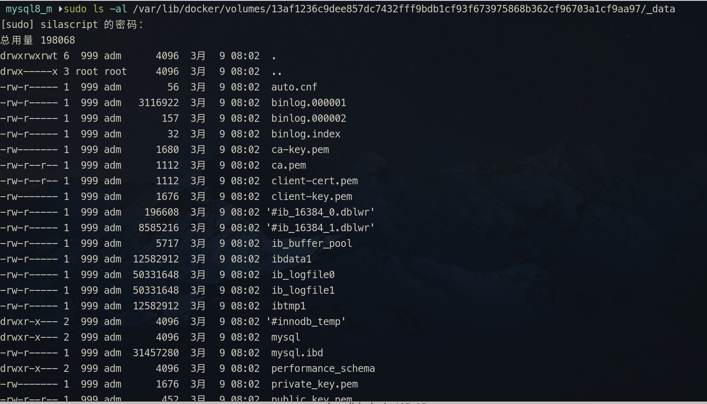

# Docker 示例

---

## 示例 1：安装及运行 Nginx

```sh
docker run -d --name d_nginx -p 8899:80 nginx:stable
```

将宿主机的目录挂载到容器内：

> [!info]
> 
> 在执行以下操作前，应先 run 一个没有挂载目录的 nginx，然后将 default.conf 和 nginx.conf 这两个配置文件复制到宿主机目录中。  
> 复制容器中的文件使用 `docker cp` 命令，语法：`docker cp 容器名称: 容器中文件路径 宿主机存放路径`  。
> 
>> [!Example] 
>> 
>> 复制配置目录及文件：
>> 
>> ```shell
>> docker cp d_nginx:/etc/nginx/conf.d Docker_Mount/nginx_m/etc/conf.d/
>> docker cp d_nginx:/etc/nginx/nginx.conf Docker_Mount/nginx_m/etc
>>```
>>
>>复制配置成功后，就可以 [停止容器](Docker_Note.md#停止容器)，然后 [删除容器](Docker_Note.md#删除容器)。
>>
>> 重新 run 个容器：
>> 
>> ```shell
>> docker run --name d_nginx -d -p 8899:80 -v /home/silascript/Docker_Mount/nginx_m/etc/conf.d:/etc/nginx/conf.d -v /home/silascript/Docker_Mount/nginx_m/html:/usr/share/nginx/html -v /home/silascript/Docker_Mount/nginx_m/log:/var/log/ngixn nginx:stable
>> ```
>
> `/etc/nginx/conf.d` 这是个目录，这个目录下有一个 `default.conf`。

### <span id="dke_nginx_config">nginx 配置文件</span>  

`/etc/nginx` 目录下的 `nginx.conf` 为主配置文件。

在 `http` 节点中的 `server` 节点：

```conf

server {
    	listen       80;
    	listen  [::]:80;
    	server_name  localhost;

    	#access_log  /var/log/nginx/host.access.log  main;

		location / {
		    root   /usr/share/nginx/html;
		    index  index.html index.htm;
		}
		
		location ~ \.php$ {
		   # root           html;
		   
		   fastcgi_pass   172.21.0.8:9000;
		   fastcgi_index  index.php;
		   # fastcgi_param  SCRIPT_FILENAME  $document_root$fastcgi_script_name;
		   fastcgi_param  SCRIPT_FILENAME  /var/www/html/$fastcgi_script_name;
		   include        fastcgi_params;
		}

		
		
    }
```

而如果是导入到 `nginx.conf` 的方式，即导入 `conf.d` 目录中的配置，在 `nginx.conf` 文件的 `server` 节点中使用 `include /etc/nginx/conf.d/*.conf;`。

而在 ` /etc/nginx/conf.d​` 目录下，众多配置文件中，那个 `default.conf`​ 文件，可以看成是一个「模板文件」， ​这个配置文件，如果不用的话，应该将其「备份」成另外的后缀名文件，防止干扰正常的配置。

如我个人配置与 [PHP容器 ](#示例%202%20：PHP) 通信时，会在 `confi.d` 目录单独开一份配置，而 `default.conf` 这个文件就将其后缀名更改为 `backup`，防止对其他配置干扰 -- 因为在上一级目录那个 `nginx.conf` 核心配置文件中 `include` 这个目录下所有子配置文件时，`default.conf` 的配置可能与自定义的其他配置产生冲突，最典型的就是解析 php 文件时，没有解析 php 文件，而是「下载 php 文件」的错误。

```shell
# silascript @ (base) in ~/Docker_Mount/nginx_m/etc/conf.d [4:34:38] 
$ ll
Permissions Size User       Group      Date Modified    Name
drwxr-xr-x     - silascript silascript 2025-02-22 04:34 .
drwxr-xr-x     - silascript silascript 2025-02-22 04:28 ..
.rw-r--r--  1.1k silascript silascript 2025-02-22 04:28 default.conf.backup
.rw-r--r--  1.4k silascript silascript 2025-02-22 04:34 php.conf

```

指定自定义网桥和 ip 生成容器：

```shell
docker run -itd --name d_nginx --network 网桥名 --ip 172.20.0.9 -p 8899:80 -v /home/silascript/Docker_Mount/nginx_m/etc/conf.d:/etc/nginx/conf.d -v /home/silascript/DevWorkSpace/PHPExercise:/usr/share/nginx/html -v /home/silascript/Docker_Mount/nginx_m/log:/var/log/ngixn nginx:stable
```

多挂载个 log 目录，容器中的路径为：`/var/log/nginx`：

```shell
docker run -itd --name d_nginx --network mybridge --ip 172.21.0.31 -p 8899:80 -v /home/silascript/Docker_Mount/nginx_m/etc/nginx.conf:/etc/nginx/nginx.conf -v /home/silascript/Docker_Mount/nginx_m/etc/conf.d:/etc/nginx/conf.d -v /home/silascript/Docker_Mount/nginx_m/log:/var/nginx -v /home/silascript/DevWorkSpace/PHPExercise:/usr/share/nginx/html nginx:1.27.4
```

> [!info] 
> 
> `-v /home/silascript/Docker_Mount/nginx_m/log:/var/nginx` log 目录挂载，可以宿主目录可以不用预先创建 `log` 目录，[Docker](Docker_Note.md) 挂载时，如果要挂载的宿主目录不存在，会自动创建相应目录再挂载。

---

## <span id="dke_php">示例 2 ：PHP </span>

```shell
docker run --name php81 -p 9000:9000 -v /home/silascript/Docker_Mount/nginx_m/html:/var/www/html -d php:8.1.5-fpm-bullseye
```

检测某容器的 IP:
语法：**docker inspect 窗口名/id |grep '"IPAddress"'**
示例：
```shell
docker inspect php81 |grep '"IPAddress"'
```

检测 PHP-FPM 是否开启， 使用 `docker exec` 命令进入 PHP 容器，执行以下命令：

```shell
ps -ef|grep php
```

> 如果没有 `ps` 命令，请安装 **procps**（以 Debian 系为例：`apt install procps`）

指定自定义网桥和指定 ip 生成容器：

```shell
docker run --name php81 --network 网桥名 --ip x.x.x.x  -p 9000:9000 -v /home/silascript/DevWorkSpace/PHPExercise:/var/www/html -d php:8.1.5-fpm-bullseye

```

示例：

```shell
docker run -d --name d_php81 --network vbridge01 --ip 172.20.0.8 -p 9000:9000 -p 2223:22 -v /home/silascript/DevWorkSpace/PHPExercise:/var/www/html php:8.1.5-fpm-bullseye
```
> [!info] 
> 
> 映射两个端口，**9000** 是 fpm，映射 **22** 是为了开启 ssh 用的。

`docker exec -it 容器ID php`：这样可以在容器外调用 php，但不适合以下的案例，即在 [VSCode](../Editors/VSCode_Note.md) 中调用 php。

### 特殊需求案例 

要将 php 执行文件映射到宿主机，让诸如 VSCode 等宿主机上的软件能调用（VSCode 有个配置项 `php.validate.executablePath` 需要调用 php 的可执行文件，这是 [VSCode](../Editors/VSCode_Note.md) 与 PHP 相关的内置语言服务）。

另外，像 [php intellisense](https://marketplace.visualstudio.com/items?itemName=zobo.php-intellisense) 插件也需要指定 php 可执行程序的路径（php intellisense 中指定 php 可执行程序路径比 vscode 内置的那个 `executablePath` 选项灵活一点，不过 php intellisense 这个插件名声好像不太好，听说容易卡）。

> [!tip] PHP Intelephense 插件
> 
> [PHP Intelephense](https://marketplace.visualstudio.com/items?itemName=bmewburn.vscode-intelephense-client) [](https://github.com/bmewburn/vscode-intelephense) 这个插件不需要指定 php 的可执行程序路径，它用的是 VSCode 内置的 php 语言服务。

这种需要，就需要将 容器中 php 可执行文件所在的目录挂载出去，但 Docker 的特性，直接挂载如果宿主机目录本为空，那这空目录就会「覆盖」掉容器目录，所以还是按惯例，先「run」一个将 php 可执行文件所在目录「托管」给 Docker，然后复制这托管目录中所有文件到未来要挂载的指定目录，再进行第二次「run」，这一次就可以指定挂载目录了。

> [!info]
> 
> 网上也有同仁跟我一样的处理方式：[vscode php executable path docker-掘金](https://juejin.cn/s/vscode%20php%20executable%20path%20docker)

具体操作如下：

1. 先 run 一个容器：
```shell
docker run -d --name d_php81 --network vbridge01 --ip 172.20.0.8 -p 9000:9000 -p 2223:22 -v /home/silascript/DevWorkSpace/PHPExercise:/var/www/html -v php_bin:/usr/local/bin/ php:8.1.5-fpm-bullseye
```
> [!info]
> 
> 其中 `-v php_bin:/usr/local/bin/` 这个设置，就是将容器中 `/usr/local/bin` 目录「托管」给 Docker。  
> 其实 连 **php_bin** 这个名字都可以不用，不过给个名字方便查询存放数据目录信息。详情请查看 [具名挂载](#docker_volume_namedvolume) 和 [匿名挂载](#docker_volume_anonvolume)。  
> 当然，更懒的，连 `-v php_bin:/usr/local/bin/` 这个选项都可以省。那到复制时，就使用 `docker cp` 命令来复制。

2. 复制 php 可执行文件所在的目录
如上面使用「具名挂载」方式，先使用 `docker volume ls` 命令查询刚挂载的 volume 是否存在。然后使用 `docker volume inspect volume名称` 来查询挂载信息，查出 volume 真实存放的路径，一般是 `/usr/lib/docker/volumes/voluem名称/_data` （如果是「匿名挂载」，volume 名称那个目录就是一串 docker 生成的字符串，所以由此可以认为「匿名挂载」是一种特殊的「具名挂载」），查到路径了，那就将路径目录中所有文件复制到未来要挂载的自定义目录中。
> [!info] 复制 php 可执行文件
> 
> 如果是未挂载目录，那就只能使用 `docker cp` 命令来复制了。
> 
> 将整个目录都复制过来：`docker cp d_php81:/usr/local/bin Docker_Mount/php81_m/php_bin`，因为有可能用到的不仅仅是 `php` 一个可执行文件，还有相关的其他程序，而 php 容器中 `/usr/local/bin` 目录下都是 php 相关的程序，所以整个目录复制过来；同时，也是为了防止「覆盖」。
>
>> [!tip] 
>> 
>> 如果想在宿主机方便配置 php，也应该把 php 相应的配置文件或目录都复制过来。
>>
>> 主要有以下配置文件： 
>> * `/usr/local/etc/php-fpm.d/www.conf`
>> * `/usr/local/etc/php/php.ini`
>>   
>>  `/usr/local/etc/` 配置目录下就这么几个配置文件：
>>   
>>   ```shell
>> root@5e780c968edf:~# ls -al /usr/local/etc/
>> drwxr-xr-x 1 root root 4096 Jul  6 00:46 .
>> drwxr-xr-x 1 root root 4096 Jul  6 00:46 ..
>> -rw-r--r-- 1 root root 1195 Jul  6 00:46 pear.conf
>> drwxr-xr-x 1 root root 4096 Jul  6 00:46 php
>> -rw-r--r-- 1 root root 5345 Jul  6 00:46 php-fpm.conf
>> -rw-r--r-- 1 root root 5350 Jul  6 00:46 php-fpm.conf.default
>> drwxr-xr-x 1 root root 4096 Jul  6 00:46 php-fpm.d
>>   
>> ```
>>   
> 

3. 再 run 一个容器：
```shell
docker run -itd --name d_php81 --network vbridge01 --ip 172.20.0.8 -p 9000:9000 -p 2223:22 -v /home/silascript/DevWorkSpace/PHPExercise:/var/www/html -v /home/silascript/Docker_Mount/php81_m/php_bin:/usr/local/bin/ php:8.1.5-fpm-bullseye
```
> [!info]
> 
> 经过上一步复制操作，`-v /home/silascript/Docker_Mount/php81_m/php_bin:/usr/local/bin/` 这个选项中 `php_bin` 这个目录中已经有了 `/usr/local/bin/` 目录所有文件，所以挂载上，就不会因为宿主目录空而出错了。

经过这三步操作，就把 php 可执行文件所在的目录挂载到宿主目录了。

如果为了方便，可以把 宿主目录中的 php 可执行文件，作软连接到 `/usr/local/bin` 目录下，这样，方便调用，如下：

```shell
ln -s ~/Docker_Mount/php81_m/php_bin/php /usr/local/bin/d_php81 
```

或者在当前用户目录下作链接：

```shell
ln -s ~/Docker_Mount/php81_m/php_bin/php ~/.local/bin/d_php81 
```

这种方式，避免了，「托管式」挂载权限问题。因为「托管」给 Docker，实际存放的路径是在 `/usr/lib/docker/volumes/` 这个目录下的，放在这里，访问调用是需要 root 权限的。而挂载到用户指定目录中，就避免了权限的问题 -- 因为权限问题，即使把 `/usr/lib/docker/volumes/...` 这个具体路径配置给 [PHP Intelephense](https://marketplace.visualstudio.com/items?itemName=bmewburn.vscode-intelephense-client) [](https://github.com/bmewburn/vscode-intelephense) 插件，这插件照样调用不了 php 可执行程序，原因就是权限问题。 

> [!info] 关于这个需求想要再谈谈的
> 
> 这种将 php 可执行程序「外挂」到宿主机上，实际上是破坏了 Docker 的隔离性的 -- 实际 [volume](#volume%20使用) 本身就是在「破坏」Docker 的隔离性，只不过破坏的程序有轻有重，如果只有将 `/var/www/html`「挂载」出来，算是比较轻的破坏；而像将 `/usr/local/bin` 这个目录「挂载」出来，算是比较严重的「破坏」了。但这种破坏是基于这个 php 的容器不是将发布项目的容器，而且只是开发容器，所以这种「破坏」应该是允许的，虽然它看起来非常不「优雅」。

### 调用时出现的小问题

按照上面几步，应该能在宿主机成功调用 php 的，但有可能会出现：`error while loading shared libraries: libonig.so.5: cannot open shared object file: No such file or directory` 错误。这是由于宿主机少了一些包，如 `libonig.so.5` 是少了 `oniguruma`，装上就可以调用 php 可执行程序了。

### 另外更优雅的实现

其实要想让 vscode 及其 php 插件调 php，不必真把 php 容器中的 `/usr/local/bin` 目录「挂载」出来这种非常具有「破坏性」的方式，可以使用一个 shell 脚本对 `docker exec` 命令进行「封装」，然后再做为这个脚本做个软连接，就非常方便地让像 vscode 亦或别的编辑器调用这个容器的 php 了。 ^docker-php-exec-shell

脚本如下：

```shell
docker exec -it d_php81 sh -c "php $*"
```
> [!info]
> 
> `sh -c`：里有 `sh` 是 [sh 命令](../Linux/Linux_Note.md#sh%20命令)，`-c` 参数是让 `sh` 命令接收一个**字符串**作为参数。
> 
> `php $*` 就是一个参数的实参。其中 `$*` 同样也也是个 [Shell](../Linux/Shell/Shell_Note.md) 语法元素，表示接收一个 [参数](../Linux/Shell/Shell_Note.md#参数) 列表。在这里的意思就是，让脚本能接收各种参数，以完成 php 各种调用需求。
> 
> 

如果想更「自由」执行容器中 `/usr/local/bin` 下所有可执行程序，可以将脚本改成这样：

```shell
cmd_str="/usr/local/bin"
docker exec -it d_php83 sh -c "$cmd_str/$*"
```

这样，不但能在宿主机通过这个脚本调用执行 `php`，还能执行如 `composer` 等程序（如果安装了）。

VSCode [intelephense](https://marketplace.visualstudio.com/items?itemName=bmewburn.vscode-intelephense-client) 插件关于 [PHP](../PHP/PHP_Note.md) 可执行文件设置：

```json
"php.validate.executablePath": "/home/silascript/docker_cmds/docker_php.sh"
```

设置成功，那 VSCode 的代码提示等语言功能就能用了。
> [!important] 
> 
> `php.validate.executablePath` 这个属性值必须是使用绝对路径，不能用 `~/xxx/xxx` 这种形式。

### 测试 PHP 引擎是否能正常工作

1. 进入 PHP 容器中 `docker exec -it d_php83 /bin/bash​`
2. 开启 [PHP内置服务器](../PHP/PHP_Note.md#内置服务器)：`php -S 172.21.0.30:8088 -t /var/www/html/​`
> [!tip] 
> 
> ​`php -S`​ 这是指定 ip 及端口，注意示例中的 **172.21.0.30**​ 为当前容器的 ip，不能使用 **localhost**​ 来替代，不然宿主环境下是访问不了的。
>
>> [!tip] 
>> 这个 IP 地址，可以通过 [查询容器 IP](Docker_Note.md#查询容器%20IP) 得到。
>> 
> 
> `-t`​ 是指定 PHP 发布页面的目录路径，如果不指定，访问时是找不到相应页面的。
> 
> 如果编写了 [宿主机调容器中PHP可执行程序的小脚本](#^docker-php-exec-shell)，就可以在宿主机环境下开启 php 的内置服务器：
> 
> ```shell
> ./docker_cmds/docker_php.sh -S 172.21.0.30:8088 -t /var/www/html/​
> ```
> 
> 
4. 在浏览器页面访问 `http://172.21.0.30:8088/xxx.php​`。如果访问成功，php 页面能正常解析，那 PHP 容器就是 `run` 成功了。

### 安装模块及扩展

安装模块或扩展，就会在 `/usr/local/etc/php/conf.d/​` ​目录下生成相应的配置文件：

```shell
root@c05f9bedea7f:~# ls -al /usr/local/etc/php/conf.d/
total 40
drwxr-xr-x 1 root root 4096 Sep  8 19:47 .
drwxr-xr-x 1 root root 4096 Sep  5 00:05 ..
-rw-r--r-- 1 root root   96 Sep  5 00:05 docker-fpm.ini
-rw-r--r-- 1 root root   20 Sep  8 19:47 docker-php-ext-bcmath.ini
-rw-r--r-- 1 root root   18 Sep  8 19:45 docker-php-ext-exif.ini
-rw-r--r-- 1 root root   16 Sep  8 19:35 docker-php-ext-gd.ini
-rw-r--r-- 1 root root   20 Sep  8 19:40 docker-php-ext-mysqli.ini
-rw-r--r-- 1 root root   23 Sep  8 19:43 docker-php-ext-pdo_mysql.ini
-rw-r--r-- 1 root root   17 Sep  5 00:05 docker-php-ext-sodium.ini
```

而且在 phpinfo()​ ​页面中 Additional .ini files parsed​ ​这一栏中，会显示各扩展或模块的配置文件完整路径。

| 选项                         | 值                                                                                                                                                                                                                                                                                                                                                                                                                                                                                                                                                                             |
| ---------------------------- | ------------------------------------------------------------------------------------------------------------------------------------------------------------------------------------------------------------------------------------------------------------------------------------------------------------------------------------------------------------------------------------------------------------------------------------------------------------------------------------------------------------------------------------------------------------------------------ |
| Additional .ini files parsed | /usr/local/etc/php/conf.d/docker-fpm.ini, <br > /usr/local/etc/php/conf.d/docker-php-ext-bcmath.ini, <br > /usr/local/etc/php/conf.d/docker-php-ext-exif.ini, <br >/usr/local/etc/php/conf.d/docker-php-ext-gd.ini, <br > /usr/local/etc/php/conf.d/docker-php-ext-mysqli.ini, <br >/usr/local/etc/php/conf.d/docker-php-ext-opcache.ini, <br > /usr/local/etc/php/conf.d/docker-php-ext-pdo_mysql.ini, <br > /usr/local/etc/php/conf.d/docker-php-ext-sodium.ini, <br > /usr/local/etc/php/conf.d/docker-php-ext-xdebug.ini, <br > /usr/local/etc/php/conf.d/docker-php-ext-zip.ini |

#### 安装 xdebug

先检测下 xdebug 安装没：`php -m | grep xdebug​`

安装 xdebug：

```
pecl install xdebug
```

添加到配置文件

```shell
docker-php-ext-enable xdebug
```

完成上述操作后，使用 `php -m` 命令查看是否安装成功。

如果安装成功，显示 `[Zend Modules] Xdebug`​，并且在 `/usr/local/etc/php/conf.d/` 下生成相应的配置文件 `docker-php-ext-xdebug.ini`。

[VSCode](../Editors/VSCode_Note.md) 使用 xdebug，只需要配置 `php.debug.executablePath` 属性就可以，此属性同样是找 [PHP](../PHP/PHP_Note.md) 的可执行程序，只是端口号不同：

```json
"php.debug.executablePath": "/home/silascript/docker_cmds/docker_php.sh"
```

> [!important] 
> 
> xdebug 功能与 [JIT](#JIT) 不兼容。如果需要使用 JIT，则需要 [关闭 xdebug](#关闭%20xdebug)，不然 JIT 就算配置正确，也是会开启失败的。

##### 关闭 xdebug

如果要关闭 xdebug 功能，只需要在 `/usr/local/etc/php/conf.d/` 目录下的 xdebug 的配置文件中，如 `docker-php-ext-xdebug.ini`，将 `zend_extension=xdebug` 这句配置**注释**掉就行了。

#### 安装 GD 扩展

1. 进到 PHP 容器内安装：
	* ​libpng-dev​
	* ​libjpeg-dev​
	* ​libfreetype6-dev​
2. 安装 gd​：`docker-php-ext-install gd​`
3. 重启 PHP 容器

#### 安装 MySQLi

1. 进 PHP 容器内安装：`docker-php-ext-install mysqli`
2. 重启 PHP 容器

#### 安装 pdo_mysql

```shell
docker-php-ext-install pdo_mysql
```

#### 安装 exif

```shell
docker-php-ext-install exif
```

#### 安装 bcmath

```shell
docker-php-ext-install bcmath
```

#### 安装 zip 模块

​zip​模块依赖 libzip-dev​，所以得先在容器中的系统的包管理器安装此依赖。

```shell
apt-get install libzip-dev

docker-php-ext-install zip
```

#### 安装 OPCache

1. 配置文件

	> [!info] 
	> 
	> 传统的是配置 `php.ini` 文件。
	> 
	> 复制 `/usr/local/etc/php/` 目录下的 `php.ini-development` 或 `php.ini-production` 出一份，命名为 `php.ini`，然后再进行以下配置：
	>
	> 将以下选项的注释取消：
	> * `opcache.enable=1`
	> * `opcache.enable_cli=0`
	> * `opcache.memory_consumption=128`
	> * `opcache.interned_strings_buffer=8`
	> * `opcache.max_accelerated_files=10000`
	>> [!tip] 
	>> 
	>> 如果要开启 JIT 功能，就在配置文件中 `opcache.max_accelerated_files=10000` 选项下面添加以下两行配置：
	>> 
	>> * `opcache.jit=tracing`
	>> * `opcache.jit_buffer_size=100M`
	
	但在 Docker 中配置，并不是直接配置 `php.ini`，而是 `/usr/local/etc/php/conf.d/` 目录下各配置文件中配置。
	OPCache 配置文件：`/usr/local/etc/php/conf.d/docker-php-ext-opcache.ini`。
	将以下选项在此配置文件中添加：

    * `opcache.enable=1`
	* `opcache.enable_cli=0`
	* `opcache.memory_consumption=128`
	* `opcache.interned_strings_buffer=8`
	* `opcache.max_accelerated_files=10000`

	配置完成后，重启 [Docker服务](Docker_Note.md#dk_comm_commands) 及重启容器。
2. 进入容器中，执行以下安装代码：
```shell
docker-php-ext-configure opcache --enable-opcache && docker-php-ext-install opcache
```

> [!info] 
> 
> 执行 `php -m`，看下是否已经安装上了。
> 
> ```shell
> [Zend Modules]
> Zend OPcache
> ```

3. 再次 [Docker服务](Docker_Note.md#dk_comm_commands) 及重启容器。使用 `phpinof()` 查看 OPCache 是否启用成功。

##### JIT

JIT 是在开启 [OPCache](#安装%20OPCache) 基础上开启的。

如果要开启 JIT，同样得添加以下选项进 `/usr/local/etc/php/conf.d/docker-php-ext-opcache.ini` 中：  
* `opcache.jit=tracing`
 * `opcache.jit_buffer_size=100M`

> [!important] 
> 
> JIT 与 [xdebug](#安装%20xdebug) 不兼容，如果同时开启两者，JIT 会开启失败，报 `JIT is incompatible with third party extensions that override zend_execute_ex(). JIT disabled. in Unknown on line 0` 这样的错误！

OPCache 与 JIT 配置项详情可查询官方文档：[OPCache Configuration - Manual](https://www.php.net/manual/zh/opcache.configuration.php)

---

## 示例 3：Apache

简单创建容器：

```shell
docker run -itd -p 8088:80 --name apache_2.4.52 httpd:2.4.52-bullseye
```

指定网桥及 ip 创建容器：

```shell
docker run -d --name d_apache --network 网桥名 --ip x.x.x.x -p 8085:80 -v /home/silascript/Docker_Mount/apache_m/conf:/usr/local/apache2/conf -v /home/silascript/DevWorkSpace/PHPExercise:/usr/local/apache2/htdocs httpd:2.4.52-bullseye
```

> [!info]
> 
> apache 默认目录结构：
> 
> Apache 根目录：/usr/local/apache2/
> Apache 页面发布目录：/usr/local/apache2/htdocs/
> Apache 配置文件目录：/usr/local/apache2/conf/
> 
> Apache 扩展配置文件目录：/usr/local/apache2/extra/
> 扩展配置文件目录中 **httpd-vhosts.conf** 这个配置文件是用来配置 **虚拟目录** 的。

~~Apache 详细配置请参考：[Linux下安装配置Apache](../PHP/Linux下安装配置Apache.md)~~

### <span id="dke_apache_config">Apache 配置</span>

使用 PHP-FPM 方式调用 PHP 引擎解析 PHP 页面：

1. 加载相应的模块
```cnf
LoadModule proxy_module modules/mod_proxy.so
LoadModule proxy_fcgi_module modules/mod_proxy_fcgi.so
```

2. 接收 php 页面请求时，交给 PHP 引擎解析，而不是下载
```cnf
AddType application/x-httpd-php .php
AddType application/x-httpd-php-source .phps
```

~~3. 如果 **PHP-FPM** 使用的是 **TCP socket**，要在 httpd.conf 末尾加上：~~
~~```conf~~
~~<FilesMatch \.php$>~~
	~~SetHandler "proxy:fcgi://php-fpm的ip:9000"~~
~~</FilesMatch>~~
~~```~~
~~> 那 IP 是 PHP-FPM 的地址。可以通过 `docker inspect 容器名称或ID | grep "IPAddress"` 这个命令来查看。~~

3. 通过调 **PHP-fpm** 来为 Apache 解析 PHP：
	有四种方式
	* SetHandler
		没配成功
	* ProxyPassMatch
		需要使用 **VirtualHost**
	* ProxyPass
		与 **ProxyPassMatch** 类似，也是在 **VirtualHost** 中使用
	* Mod_Rewrite
		不支持持久链接

与 PHP-fpm 通信又分两种方式：**TCP** 和 **Socket**。

以 TCP 方式为例：

* ProxyPassMatch 方式配置：
	1. 需要开启 `mod_proxy` 和 `mod_proxy_fcgi` 这两个模块
		```conf
		# 把这两行前的注释去掉就能加载这俩模块了
		LoadModule proxy_module modules/mod_proxy.so
		LoadModule proxy_fcgi_module modules/mod_proxy_fcgi.so	
		```
		> **mod_proxy** 模块主要作用是进行 url 转发，即具有代理功能。  
		> **mod_proxy_fcgi** 模块看名字，就知道这货得依赖上面那个代理模块，如是上面那个模块未加载，页面都访问不了。
		> 而 **mod_proxy_fcgi** 顾名思义，是跟 fastcgi 相关的，所以要与 PHP-fpm 通信就得加载此模块。  
		> 如果不开启「**mod_proxy_fcgi**」模块，会报以下错误：  
		> Internal Server Error  
		> The server encountered an internal error or misconfiguration and was unable to complete your request.
		> Please contact the server administrator at you@example.com to inform them of the time this error occurred, and the actions you performed just before this error.
		>More information about this error may be available in the server error log.
	
	2. 配置虚拟目录
	```conf
	<VirtualHost *:80>
		# ServerAdmin liang@com.cn
		DocumentRoot "/usr/local/apache2/htdocs"
		ServerName localhost
		# <Directory "/usr/local/apache2/htdocs">
		# Options None
		# Require all granted
		# </Directory>
		ProxyRequests Off
		ProxyPassMatch ^/(.*\.php)$ fcgi://172.17.0.2:9000/var/www/html/$1
	</VirtualHost>
	```	
	> 这个节点可以直接放在 httpd.conf 这个配置文件中。  
	> 也可以把它放在 httpd.conf 文件同级 extra 目录下专门上用来配虚拟目录的配置文件：**httpd-vhosts.conf** 文件中。  
	> 如果在 **httpd-vhosts.conf** 这个配置文件中配的话，得开启虚拟目录功能：  
	> 在 httpd.conf 文件中找到以下代码：  
	> ```conf
	>  # 去掉前面的注释，就能把 httpd_vhosts.conf 这个配置文件「include」进来了
	>  Include conf/extra/httpd-vhosts.conf 
	> ```
	> **为了 httpd.conf 这个主配置文件代码简洁，建议使用 httpd_vhosts.conf 文件来配置虚拟目录。** 
	> 
	> `fcgi://xxx:9000` 这是 PHP-fpm 的 IP 和端口。这个 IP 和端口 是在 PHP 容器中 `/etc/php-fpm.d/www.conf` 文件中设置的 -- `listen = xxxx:9000`。  
	> `/var/www/html/` 这个是 PHP 容器中页面发布目录（绝对路径）。不要配成 Apache 的页面发布路径，否则会发生 `File not found.` 错误。  
    > `DocumentRoot "/usr/local/apache2/htdocs"` 这是指定的是 Apache 的页面发布目录的路径。千万不要填成 PHP 的。不然静态页面就会访问不到了。  
	> **$1** 这里指的是前面 `(.*\.php)` 这个变量。这个变量可以不加。  
	> 可以这么理解，VirtualHost 里配的页面发布目录就是 Apache 的，只是遇到了 php 文件时，通过调用 PHP-fpm 来处理这些 php 文件。而 **ProxyPassMatch** 可以看成是一个「**拦截器**」，拦截 **.php** 页面，然后交由 PHP-fpm 来解析。

* ProxyPass 方式配置：

	同样需要 **VirtualHost**，配置代码如下：

	```conf
	<VirtualHost *:80>
    ServerName localhost
	DocumentRoot "/usr/local/apache2/htdocs"
		<LocationMatch ^(.*.php)$>
			ProxyPass fcgi://172.17.0.2:9000/var/www/html/
			ProxyErrorOverride on
		</LocationMatch>
	</VirtualHost>

	```
 
    > [!tip]
	> 跟 **ProxyPassMatch** 非常像，其实就是把 **ProxyPassMatch** 标签化成了 `<LocationMatch>` 而已。  
	> 同样注意的是 **DocumentRoot** 的值千万不要填成 PHP 的。不然静态页面就访问不到了，就算 PHP 容器发布页面目录与 Apache 发布目录都挂载到同一个宿主机目录，也是访问出问题 -- 权限问题。  

### Apache 与 Nginx 共用文件目录及一个 PHP 引擎 方案

1. 创建 PHP 容器
```shell
docker run -d --name d_php81 -p 9000:9000 -v /home/silascript/DevWorkSpace/PHPExercise:/var/www/html php:8.1.3-fpm-bullseye
```

检查 PHP-fpm 的设置。如 php-fpm 的监听端口。
> 在 `/etc/php-fpm.d/www.conf` 这个文件中，其中有 `listen xxx:9000` 代码，就是设置 php-fpm 的监听端口的。

2. 创建 Nginx 容器
```shell
docker run -d --name d_nginx --network mybridge --ip 172.21.0.9 -p 8899:80 -v /home/silascript/Docker_Mount/nginx_m/etc/nginx.conf:/etc/nginx/nginx.conf -v /home/silascript/Docker_Mount/nginx_m/etc/conf.d:/etc/nginx/conf.d -v /home/silascript/Docker_Mount/nginx_m/log:/var/log/nginx -v /home/silascript/DevWorkSpace/PHPExercise:/usr/share/nginx/html nginx:1.25.2-bookworm
```
> php 容器与 nginx 容器的页面发布目录挂载到同一个宿主机目录：
> ```shell
>  /home/silascript/DevWorkSpace/PHPExercise:/var/www/html 
>  /home/silascript/DevWorkSpace/PHPExercise:/usr/share/nginx/html 
> ```

> [!info] 
> 
> 创建完 nginx 容器后，[配置nginx](#dk_nginx_config)。
> 到这里先测试下，nginx + php 是否可用。

3. 创建 Apache 容器
```shell
docker run -d --name d_apache -p 8085:80 -v /home/silascript/Docker_Mount/apache_m/conf:/usr/local/apache2/conf -v /home/silascript/DevWorkSpace/PHPExercise:/usr/local/apache2/htdocs httpd:2.4.52-bullseye
```
> [!info]
> 
> 同样将发布页面目录「bind」到同一个宿主目录。
> 
> 测试下，如果发生如下错误信息：  
> 
> `Service Unavailable`
>  `The server is temporarily unable to service your request due to maintenance downtime or capacity problems. Please try again later.  `
>  
> 有可能是 php 容器的 IP 变了，需要修改 Apache 的配置文件 --[apache 配置](#dk_apache_config)。

4. 新建个 PHP 页面进行测试
```php
<?php
phpinfo();
?>
```
> [!info] 
> 
> 就显示下 PHP 的安装信息。

还是更 **推荐使用 Nginx**，而且使用 PHP-fpm 方式解析 PHP 页面。Apache 配置实在是太麻烦了！

---

## <span id="dke_mysql">示例 4：MySQL/Mariadb</span>

[GitHub - docker-library](https://github.com/docker-library/mysql) 的镜像按底层系统分为 debian 和 oracle。

> [!info] 
> 
> 8.0.38 之后，官方镜像默认使用自家的 Oracle Linux。

```shell
# 不指定挂载目录
# -e MYSQL_ROOT_PASSWORD 这个选项不能省，不然容器创建成功也启动不了
docker run -d -p 3366:3306 -e MYSQL_ROOT_PASSWORD=123456 --name mariadb10.8 mariadb:10.8.2

# 指定挂载数据目录
docker run --name mariadb10.8 -p 3366:3306 -v /home/silascript/Docker_Mount/mariadb_m/data:/var/lib/mysql -e MYSQL_ROOT_PASSWORD=123456 -d mariadb:10.8.2

```

> [!tip] mysql 相关相关的目录、文件路径
> 
> 配置文件目录：/etc/mysql
>
> 数据存放目录：/var/lib/mysql
>
> mariadb 的链接地址：
> 
> /usr/bin/mysql -> mariadb

mysql 与其他镜像区别的是，mysql 的数据目录，使用了「**bing mount**」方式挂载，容器中的数据目录中数据会自动复制到指定的宿主机指定的目录中。可以看 mysql 的 Dockerfile 文件中有句代码，就知道为什么 MySQL 会有这个特殊点了：


如生成一个什么目录都不挂载的 mysql 容器：

```shell
docker run -d --name d_mysql80 -p 3356:3306 -e MYSQL_ROOT_PASSWORD=123456 mysql:8.0.28-debian
```

通过 `docker volume ls` 命令可以看到一个 「**匿名挂载**」的 volume：


> 通过 `docker volume inspect 匿名挂载名` 命令查看挂载的 volume 的详细信息。 

直接查看那个 **Mountpoint** 的那个目录存放着什么：

> 很明显，存放的就是 mysql 的数据文件。可见之前在 Dockerfile 文件中那一句 `VOLUME /var/lib/mysql` 代码就是让 mysql 容器创建后，将数据目录设为挂载点。

Docker MySQL 挂载方案：

因为 MySQL 的数据目录即便是「bind mount」类型的挂载，都会将容器数据复制到指定目录，所以这个目录可以直接指定。
但 MySQL 的配置目录没有这样的「特性」，所以得做些操作实现将容器数据复制到宿主机的挂载目录。

大概步骤：
1. 创建一个「临时」容器。
```shell
docker run -d --name d_mysql80 -e MYSQL_ROOT_PASSWORD=123456 mysql:8.0.28-debian
```

2. 将容器中 `/etc/mysql` 目录复制到宿主指定的目录
```shell
docker cp d_mysql80:/etc/mysql /home/silascript/Docker_Mount/mysql_m/config 
```

> [!info] 
> 
> 这个复制非常重要，如果不先复制到宿主目录，未在在正式容器中再使用 `-v` 直接挂载，因为宿主目录是空的，所以容器中 `/etc/mysql` 这个配置目录被「覆盖」掉，致使容器启动失败。
> 
> 这个目录是未来在正式 [MySQL](../DataBase/mysql/MySQL_Note.md) 容器 `run` 时要挂载的宿主目录。
> 
> 但是后续正式 `run` MySQL 容器时，我们的 run 命令中的挂载是这么写的 `-v /home/silascript/Docker_Mount/mysql_m/config:/etc/mysql`，就是将宿主机的 `config` 目录与容器中的 `/etc/mysql` 目录「绑定」，而容器原本那些配置文件是在 `/etc/mysql` 目录下，之前 `cp` 时，是将整个 `/etc/mysql` 目录都复制到 `config` 目录下的，如果还是使用 `-v /home/silascript/Docker_Mount/mysql_m/config:/etc/mysql` 这种写法，那正式容器中的配置文件目录路径就会出现 `/etc/mysql/mysql` 这种「奇葩」现象，这就会使配置文件生效，所以有两种处理方式：
>
> 1. 改挂载命令，将原有的命令改成 `-v /home/silascript/Docker_Mount/mysql_m/config/mysql:/etc/mysql`，就是将 `config` 下的 `mysql` 目录与容器中 `/etc/mysql` 目录「绑定」
> 2. 把已 `cp` 到宿主机 `config` 目录下的 `mysql` 目录中的所有配置文件都复制到 `config` 目录下
> 

1. [停止容器](Docker_Note.md#dk_container_stop) 和 [删除容器](Docker_Note.md#dk_container_delete) 并 [清理volume](Docker_Note.md#清理无主%20volume)。
2. 新建一个指定挂载宿主机路径的 MySQL 容器
```shell
docker run -d --name d_mysql80 -p 3356:3306 -e MYSQL_ROOT_PASSWORD=123456 -v /home/silascript/Docker_Mount/mysql8_m/config/mysql:/etc/mysql -v /home/silascript/Docker_Mount/mysql8_m/data:/var/lib/mysql mysql:8.0.28-debian
```

> [!info]
> 
> 因为之前已经将配置文件数据已经复制到要挂载的目录中，这样就不会因为宿主机目录为空，而使容器启动不了了。
> 
> 另外还有一个目录也非常重要，就是 MySQL 的数据目录，即 `/var/lib/mysql` 目录，只不过这个目录不用自己手动 `cp`，因为 MySQL 镜像 的「特性」会自动复制数据到要挂载的目录，所以能直接挂载到指定路径。
> 
> 这个方案的 **核心** 就是解决配置文件目录的挂载问题。

> [!info]
> 
> 如果要指定网桥及 ip，可以用以下方式创建 MySQL 容器：
>
>```shell
> docker run -d --name d_mysql80 --network mybridge --ip 172.21.0.20 -p 3356:3306 -e MYSQL_ROOT_PASSWORD=123456 -v /home/silascript/Docker_Mount/mysql_m/config/mysql:/etc/mysql -v /home/silascript/Docker_Mount/mysql_m/data:/var/lib/mysql mysql:8.0.38
>```

如果要在 `run` 时设置默认字符集，可以加上 `--character-set-server=utf8mb4 --collation-server=utf8mb4_unicode_ci` 参数。

> [!example] 
> 
> 带 [字符集设置](#字符集设置) 的 `run` 容器：
> 
>```shell
> docker run -d --name d_mysql80 --network mybridge --ip 172.21.0.20 -p 3356:3306 -e MYSQL_ROOT_PASSWORD=123456 -v /home/silascript/Docker_Mount/mysql_m/config/mysql:/etc/mysql -v /home/silascript/Docker_Mount/mysql_m/data:/var/lib/mysql mysql:8.0.41-debian --character-set-server=utf8mb4 --collation-server=utf8mb4_unicode_ci
> ```

### 配置

#### 字符集设置

[字符集设置](../DataBase/mysql/Linux下安装MySQL.md#字符集设置)

#### MySQL 内存优化

conf.d 目录下 **docker.cnf** 文件中 `[mysqld]` 下添加以下代码：

```conf
[mysqld]
performance_schema_max_table_instances=400
table_definition_cache=400
table_open_cache=256
performance_schema = off
```
> [!tip] 
> 
> 内存占用优化挺明显的。  
> `performan_schema` 关不关可根据需要。这货是 5.7 及以上版本才默认开启的。

> [!info] 
> 
> MySQL 其他设置及操作请参考：
>
> * [MySQL笔记](../DataBase/mysql/MySQL_Note.md)
> * [MySQL配置笔记](../DataBase/mysql/MySQL_Config_Note.md)
> * [MySQL常用操作](../DataBase/mysql/MySQL常用操作.md)
> * [Linux下安装MySQL](../DataBase/mysql/Linux下安装MySQL.md)

---

## 示例 5：安装 CentOS

创建 CentOS 容器：

```shell
docker run -itd --name d_centos8 centos:centos8.4.2105
```
> [!tip] -it 参数
> 
> 最简单的创建一个 CentOS 容器
> `-it` 这参数得加上，如果只是像其他镜像那样只有 `-d` 创建容器是成功，但启动不了容器
> 因为 CentOS 启动，需要开启一个伪终端

CentOS 开启 SSH 服务

* **run** 容器时加入 **--privileged=true** 参数
> [!tip]
> 
> 使用 --privileged=true 参数，可以使容器内的 root 用户真正拥有 root 权限。
> 没有此参数的容器内的 root 用户只是外部的一个普通用户权限。
> 以下代码使用在 CentOS 7
> 
> ```shell
> docker run --name d_centos7  --privileged=true -p 10022:22 -d centos:7 /usr/sbin/ini
> ```
> 22 端口得映射，这是 ssh 访问的端口  
> 如果是 CentOS 8，得使用以下代码创建容器，**systemctl** 才能正常使用。 
> 如果 CentOS  8 没有使用以下代码开创建容器，可能会报以下这些错误信息 ：
> ```shell
> System has not been booted with systemd as init system (PID 1). Can't operate.
> Failed to connect to bus: Host is down.
> ```
>```shell
> docker run -itd --name d_centos8 --privileged centos:centos8.4.2105 /usr/sbin/init
>```
> 
> CentOS 8 已被官方“寿终正寝”了。而 CentOS 7 systemctl 使用都存在 `Failed to get D-Bus connection: No such file or directory` 错误。网上所有解决方案都存在问题。建议使用 Debian 系的系统。

* 使用 **exec** 选项进入 CentOS 容器
* 在 CentOS 容器内添加 SSH 服务并进行相应的配置
>[!info] 
>
> 参考 [CentOS 开启 SSH 服务](../Linux/CentOS_Note.md#cent_cs_ssh)
* 提交镜像
>[!info] 
>
> 使用 **docker commit** 选项，生成新的镜像。
> 类似 vmware 生成一个 **快照**，也类似 git 的 commit 操作（实际上 git 上的版本就是一个个“快照”）。
> ```shell
> # 语法：docker commit 容器名/ID 新镜像名[:tag]
> ```
* 将新生成的镜像 **Run** 成容器
> [!info] 
> 
> 要记得把 SSH 服务配置文件中设置的那个端口映射到宿主机

---

## 示例 6：安装 Debian

创建容器与 CentOS 一样。

```shell
	docker run -itd --name 容器名 镜像名/ID 
```

> [!info]
> 
> ```shell
> docker run -itd --name d_debian12 --network mybridge --ip 172.21.0.10 -p 2225:22 debian:12.5-slim
> ```

在 Debian 中开启 SSH 功能。

* 创建 Debian 容器

* **exec** 进入系统（`docker exec -it d_debian12 /bin/bash`）。
	> [!info]
	> 还是先确认 **systemctl** 能不能用！
	> 如果出现 `bash: systemctl: command not found` 这个错误，就得重装 **systemd**。  
	> 重装 **systemd**：
	> ```shell
	> apt install --reinstall systemd
	> ```
	> 如果出现 `System has not been booted with systemd as init system (PID 1). Can't operate.
	> Failed to connect to bus: Host is down` 这个错误信息，那就是“**run**”的时候没给权限（--privileged 参数）。

> [!tip]
> 迄今为止，systemctl 问题尚未解决！待更！

复制目录到容器中：

```shell
docker cp vim/ d_debian12:/root/vim_custum/
```

---

## 示例 7：安装 Ubuntu

```shell
docker run -itd --name d_ubuntu21 --network vbridge01 --ip 172.20.0.20 -p 2225:22 ubuntu:jammy
```
> [!tip]
> 
> 使用自定义网桥并为容器指派 ip，另外映射 22 接口，以便后续开启 `ssh` 功能。

---

## 示例 8：安装 AlmaLinux

```shell
docker run -itd --name d_almalinux92 --network vbridge01 --ip 172.20.0.23 almalinux:9.2-minimal
```

---

## 问题与解决方案

### 时区问题

因为时区没设置正确，可能在某些操作中出现以下错误提示：

#### 不存在 zoneinfo

执行 `ls -l` 命令时，可能出现以下提示：

```shell
Unable to determine time zone: No such file or directory (os error 2)
```

> [!tip] 解决方案
> 原因是缺少 `tzdata` 包，所以只要安装上 tzdata 包就可以了！
> 
> `apt install tzdata`
> 
> 在安装 tzdata 时，会出现让你选择地区，如下：
> 
> 先选择哪个洲：
> ```shell
> Please select the geographic area in which you live. Subsequent configuration questions will narrow this down by presenting a list of cities, representing the time zones in which they are located.
>
 > 1. Africa   3. Antarctica  5. Arctic  7. Atlantic  9. Indian    11. US
> 2. America  4. Australia   6. Asia    8. Europe    10. Pacific  12. Etc
>
> ```
> 
> 再选择哪个城市：
> 
> ```shell
> Please select the city or region corresponding to your time zone.
>
> 1. Aden      16. Brunei       31. Hong_Kong    46. Kuala_Lumpur  61. Pyongyang      76. Tehran
> 2. Almaty    17. Chita        32. Hovd         47. Kuching       62. Qatar          77. Tel_Aviv
> 
> ```
> >[!tip]
> > 中国的话，就选择 `Shanghai` 就行了。
>
> 只要根据步骤走就行了。

最后用 `date` 命令测试下，出现 `CST` 字样（China Standard Time）就证明切换到中国时区成功了。

---

## 相关笔记

* [Docker笔记](Docker_Note.md)
* [Docker资料](Docker_Material.md)

