---
aliases:
  - 
tags:
  - docker
  - http
  - network
  - linux
  - ubuntu
  - mysql
created: 2023-01-13 12:27:45
modified: 2023-05-12 2:55:30
---

# Docker 笔记

---

## 目录
* [Docker 介绍](#dk_introduction)
	* [虚拟化技术](#dk_virtual_info)
* [Docker 架构及概念](#dk_arch)
* [安装与设置](#dk_insetup)
* [修改镜像源](#dk_mirror)
* [常用服务操作](#dk_comm_commands)
* [容器操作](#dk_container)
	* [创建容器](#dk_container_create)
	* [停止容器](#dk_container_stop)
	* [进入容器](#dk_container_exec)
	* [删除容器](#dk_container_delete)
	* [查看容器](#dk_container_inspect)
* [Volume和挂载](#dk_volume_mount)
* [网络](#dk_network)
	* [虚拟网桥](#dk_network_vbridge)
	* [自定义固定 ip](#dk_network_custom_ip)
	* [网络相关的常用命令](#dk_network_command)
* [Docker 常用操作](#dk_comm_commands)
* [Dockerfile 编写](#dk_dkf)
  * [Docker 构建镜像常用命令](#dk_dkf_commands)
* [常用软件容器使用](#dk_softc_demo)

---

## <span id="dk_introduction">Docker 介绍</span>

### <span id="dk_virtual_info">虚拟化技术</span>
* 硬件虚拟化
* 软件虚拟化
	* 完全虚拟化  
		虚拟机模拟完整的底层硬件环境和特权指令的执行过程，客户操作系统无须进行修改。  
		例如 VMware Workstation、VirtualBox 等。
	* 硬件辅助虚拟化
	* 部分虚拟化
	* 超虚拟化
	* **操作系统级虚拟化**  
		内核通过创建多个虚拟的操作系统实例（内核和库）来隔离不同的进程。  
		容器相关技术即在这个范畴。

传统方式是在硬件层面实现虚拟化，需要有额外的虚拟机管理应用和虚拟机操作系统层。  
Docker 容器是在操作系统层面上实现虚拟化，直接复用本地主机的操作系统，因此更加轻量级。

---

## <span id="dk_arch">Docker 架构及概念</span>

Docker 大部分操作都围绕着三大核心概念：**镜像**、**容器** 和 **仓库**

* **镜像**（Image）：Docker **镜像**（Image）,就相当于是一个 root 文件系统。  
	镜像类似虚拟机镜像，可以将它理解为一个只读的模板。  
	镜像是创建 Docker 容器的基础。
* **容器**（Container）：**镜像** 和 **容器** 的关系，就如 **类** 和 **实例** 一样，又如 **程序** 和 **进程**。  
	镜像是静态的定义，容器是镜像运行时的实体。容器可以初创建、启动、停止、删除、暂停等。  
	容器可以被看作是一个简易版的 Linux 系统以及运行在其中的应用程序打包而成的盒子。
* **仓库**（Repository）：仓库可看成一个代码控制中心，用来保存镜像。  
	仓库分为 **公开仓库** 和 **私有仓库**。  
	最大的公开仓库是官方提供的 [Docker Hub](https://hub.docker.com "hub.docker.com")。  
	当然用户也可以创建只有自己可访问的本地网络的私有仓库。

Docker 使用 C/S 架构模式，使用远程 API 来管理和创建 Docker 容器。
Docker 容器通过 Docker 镜像来创建。


---

## <span id="dk_insetup"> 安装与设置</span>

### <span id="dk_install_linux">ArchLinux 系 安装 Docker</span>
1. 安装
```shell
pacman -S docker
```
2. 将当前用户加入 docker 用户组

docker 安装完成后，docker 会自动新增一个 docker 用户组。  
为了方便，主要是为了避免权限问题，当前用户如果是非 root 用户，最好将当前用户加入这个用户组中。
```sh
sudo gpasswd -a ${USER} docker
```

> **查看** 有没有 docker 组：
> ```sh
> sudo cat /etc/group | grep docker
> ```

> 如果没有 docker 组，**添加**：
> ```sh
> sudo groupadd docker
> ```

3. 启动服务
```sh
sudo systemctl start docker
```

> 重启：
> ```sh
> sudo systemctl restart docker
> ```

### <span id="dk_install_win">Windows 下安装 Docker</span>
1. 安装 Docker
个人喜欢用 [Scoop]() 来安装软件，所以 Docker 也不例外。

2. 注册服务
```shell
dockerd --register-service
```
 一定得在管理员身价下运行 Powershell，因为 Docker 的守护进程的权限是超级管理员权限。不然注册服务是不成功的。
 如果没有任何信息出来，就是注册成功了。

3. 开启 Docker 服务
```shell
Start-Service docker
```
同样的，没有信息，就是开启成功了！

 重启 docker 服务：
> ```shell
>  Restart-Service docker
> ```

> 如果开启 Docker 服务成功，可以使用 `dokcer images` 查看镜像命令来试下 Docker 是否正常。

Windows 下 Docker 的数据目录路径是在 `C:\ProgramData\docker`。

Windows 下 Docker 的 daemon.json 文件是放在 `C:\ProgramData\docker\config` 目录下。

---

## <span id="dk_mirror">修改镜像源</span>
使用命令来指定镜像并启动 docker
```sh
docker --registry-mirror=https://registry.docker-cn.com daemon
```

通过配置文件添加镜像源：
修改 **/etc/docker/daemon.json** 文件：
```sh
{
	"registry-mirror":[
	"https://registry.docker-cn.com",
	"https://docker.mirrors.ustc.edu.cn"
	]
}

```
> 如果 /etc/docker/ 目录下没有 daemon.json，可自行添加。
> 
> 配置文件可以添加多个镜像。

Docker 镜像列表
| 镜像名                | 镜像地址                           |
| --------------------- | ---------------------------------- |
| 科大镜像              | https://docker.mirrors.ustc.edu.cn |
| 网易镜像              | https://hub-mirror.c.163.com       |
| Docker 中国区官方镜像 | https://registry.docker-cn.com     |
| DaoCloud            | https://hub.daocloud.io            |

###  <span id="dk_image_bugs">镜像问题</span>

 docker 出现 `no matching manifest for windows/amd64 10.0.18363 in the manifest list entries` 错误。

在 `daemon.json` 配置文件中添加：
```json
"experimental":true
```
然后重启服务。

run 容器时出现 `Error response from daemon: failed to start service utility VM ` 错误。

```shell
BCDEdit /set hypervisorlaunchtype auto
```
重启电脑。

---

## <span id="dk_comm_commands">常用服务操作</span>

重新加载配置
```sh
sudo systemctl daemon-reload
```

重启 docker 服务
```sh
sudo systemctl restart docker
```

停止 docker 服务
```sh
sudo systemctl stop docker
```

查看 Docker 信息

> 这个操作得在 Docker 服务启动后才有效
```sh
docker info
```

---

## <span id="dk_image">镜像操作</span>

搜索镜像：

搜索方式有 2 种

1. 使用命令搜

```shell
docker search xxx
```

2. 到 [hub.docker](https://hub.docker.com) 上搜

下载镜像：
```shell
docker pull 镜像名[:tag]
```
> 跟 git 的类似

查看已存在的镜像：
```shell
docker images
```

删除镜像：
```shell
docker rmi 镜像名
```

---

## <span id="dk_container">容器操作</span>

### <span id="dk_container_create">创建容器</span>

1. 新建容器

使用 `docker create` 命令新建一个容器。

```shell
docker create -it --name 自定义容器名 镜像名
```

常用参数：
* `-i, --interactive=true|false`：保持标准输入打开，默认为 false 
* `-t, --tty=true|false`：是否分配一个伪终端，默认为 false
* `-p, --publish`： 端口
* `--name`：指定容器的别名
* `-v|--volume [=Host-dir:]`：挂载宿主机上的文件卷到容器内
* `--ip`：指定容器的 IPv4 地址
* `--link=[<name or id>:alias]`：链接到其他容器

2. <span id="dk_container_start">启动容器</span>

使用 `docker start` 命令来启动一个已经创建的容器。

```
docker start 容器名|容器ID
```

> [!info] 相关命令
>
> * `docker ps` 查看运行中的容器
> * `docker ps -a` 查看所有的容器，包括没有运行中的容器
> * `docker restart` 将正在运行的容器 [停止](#dk_container_stop) 然后再运行

3. 新建并启动容器

直接新建并启动容器。所需要的命令为 `docker run`，等价于先执行 `docker create` 命令，再执行 `docker start` 命令。

`docker create` 命令的常用选项参数，在 `docker run` 命令都通用：如 `-i`、`-t`、`-p`、`-v` 等。

`docker run` 独有的常用选项参数：
`-d,detach`：在后台运行容器并将打印出容器的 ID
> 更多的时候，需要让 Docker 容器在后台以守护形式运行，这就要加上 `-d` 选项来实现，而 `-d` 其实就是 「Daemon」。

### <span id="dk_container_stop">停止容器</span>

1. 暂停容器
```shell
docker pause 容器名|容器ID
```
> 恢复容器运行状态： `docker unpause 容器名`

2. 停止容器
```shell
docker stop 容器名|容器ID
```
> 相关命令：  
> [启动容器](#dk_container_start)

### <span id="dk_container_exec">进入容器</span>

进入容器使用 `exec` 命令，常用选项：
* -d, --detach：在容器中后台执行命令
* -i, --interactive=true|false：打开标准输入接受用户输入命令，默认值为 false
* -t, --tty=true|false：分配伪终端，默认值为 false

示例：
```shell
docker exec -it 容器名/容器ID /bin/bash
```

### <span id="dk_container_delete">删除容器</span>

```shell
docker rm 容器|容器ID
```
> `-f, --force=false` 强行删除容器 

### <span id="dk_container_inspect">查看容器</span>

1. 查看窗口详细信息
```shell
docker inspect 容器名|容器ID
```

2. 查看容器内进程
```shell
docker top 容器名|容器ID
```

3. 查看统计信息
```shell
docker stats [容器名|容器ID]
```
> 可以查看当前 Docker 中容器运行情况，会显示 CPU、内存、存储等使用情况。  
> 如果不指定 **容器名** 或 ID，将显示运行中的所有容器的实时信息。

`docker stats` 常用选项：

-noe-stream：不持续输出，默认 `docker stats` 会自动更新持续实时结果。

### <span id="dk_container_cp">容器与宿主机间的文件拷贝</span>

```shell
docker cp .config/nvim/configs d_ubuntu21:/root/.vim/
docker cp .config/nvim/init.vim d_ubuntu21:/root/
```
> 能拷文件也能拷文件。
> 左侧是拷贝源，右侧是目的地。哪边有 `:` 的，哪边就是容器。

---

## <span id="dk_volume_mount">Volume 和挂载</span>

**volume** 是一个命令，同时也是一个概念。
在 Docker 中 **volume** 指的是，将容器中某些目录数据交由 Docker 「托管」。

volume 是被设计用来持久化数据的，它的生命周期独立于容器，Docker 不会在容器被删除后自动删除 volume，并且也不存在垃圾回收这样的机制来处理没有任何容器引用的 volume。

### 常用命令

#### 查看所有 volume
```shell
docker volume ls
```
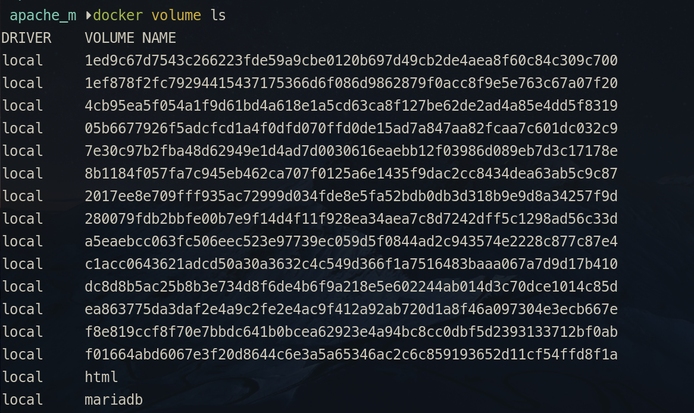

#### 创建一个 volume
```shell
docker volume create volume名
```
> 创建出来的 volume 实际是被存放在 **/var/lib/docker/volumes/** 目录下。
> **/var/lib/docker** 这个目录其实就是 Docker 安装目录。 

#### 查看指定 volume 的详细信息：
```shell
docker volume inspect volume名
```
示例：
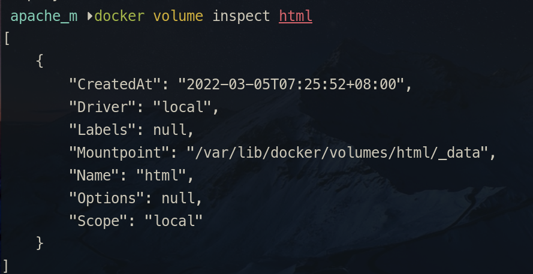
> 可以见到，volume 名实际是在 volumes 这个 存放 volume 的根目录下，建立了同名的目录用来存放些名的 volume。

#### 删除一个 volume
```shell
docker volume rm volume名
```
> volume 的名称可以通过	`dokcer volumes ls` 命令查询。

#### 清理无主 volume
```shell
docker volume prune
```
> 删除或清理 volume ，必须相关的容器不存在，也就是说没有容器再使用这些 volume，不然是清理不成功的。  
> 所以要清理 volume 前得先 `docker rm 容器`，只是 `docker stop` 还不行，必须先删除容器，才能清理 volume。

---

### mount 使用

`run` 时使用 `--mount` 参数创建 volume：
```shell
docker run -d --name d_apache-2.4 -p 8085:80 --mount source=html,destination=/usr/local/apache2/htdocs httpd:2.4.52-bullseye
```
> [!tip] mount 详解 
> **--mount** 选项中 所以有参数有仅只能使用「**,**」分隔，不能有其他，连空格都不能有。  
> 因为 **--mount** 后面那一串全面都是 --mount 这个「key-value」对，是用「**,**」来区分的，如果混入其他字符，会使「**键值对**」分割取值赋值时发生异常。  
> `source` 参数是 volume 的名称，**destination** 参数是容器中要「映射」的路径。  
> --mount 实际还有一个参数对：type=[volume]|[bind]，如果不指定「**type**」，默认是「**type=volume**」。  
> 如果 --mount 的 **type=volume**，「**source**」的值只能是名称，不能是路径。  
> **type=volume** 实际 **挂载** 目录路径是 docker 安装目录下 **volumes** 目录下。

如果 --mount 的 **type=bind**，那么 **source** 的值就能指定路径，如下例：
```shell
docker run -d --name d_apache-2.4 -p 8085:80 --mount type=bind,source=$(pwd)/html,destination=/usr/local/apache2/htdocs httpd:2.4.52-bullseye
```
> type=bind，source 指定路径后，destination 中的容器被「映射」的路径中的内容就会被「覆盖」或称为「隐藏」了。

如果 **source** 为空，那 docker 会自动随机生成一个字符串作为这个 volume 的名称：
```shell
docker run -d --name d_apache_2.4 -p 8085:80 --mount destination=/usr/local/apache2/htdocs httpd:2.4.52-bullseye
```


### volume 使用

* 指定宿主绝对路径： 
> 语法：`-v 宿主绝对路径:容器路径` 方式进行 「挂载」
```shell
docker run -d --name d_apache-2.4 -p 8085:80 -v $(pwd)/html:/usr/local/apache2/htdocs httpd:2.4.52-bullseye
```

> [!tp]
> -v 选项后的参数使用「:」 分隔。  
> 冒号 **左边** 的实参是宿主机的目录路径，**必须** 使用「**绝对路径**」。  
> 冒号 **右** 边的实参是容器中要「映射」的目录路径。  
> 这种方式的 **挂载**，与 --mount type=bind 方式实现的效果完全一致。副作用也一样，就是宿主机会「覆盖」掉容器的内容。  
> 如果宿主机路径不存在，docker 会自动帮你创建相应的目录。  

---

* 指定宿主相对路径：
```shell
docker run -d --name d_apache-2.4 -p 8085:80 -v html:/usr/local/apache2/htdocs httpd:2.4.52-bullseye
```
> -v 中宿主机路径如果用的是相对路径，则不会指定为自定义路径，而是在 docker 安装目录下 **volumes** 目录下创建相应的目录。
> 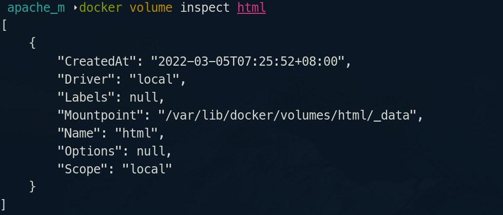
> 这与 --mount type=volume 使用完全一样。

* 宿主机不给名称或路径：
> **冒号** 左边不给出任何值，docker 将会在 **volumes** 目录下随机创建一个目录，目录名也是随机生成的一个字符串，如下：
> 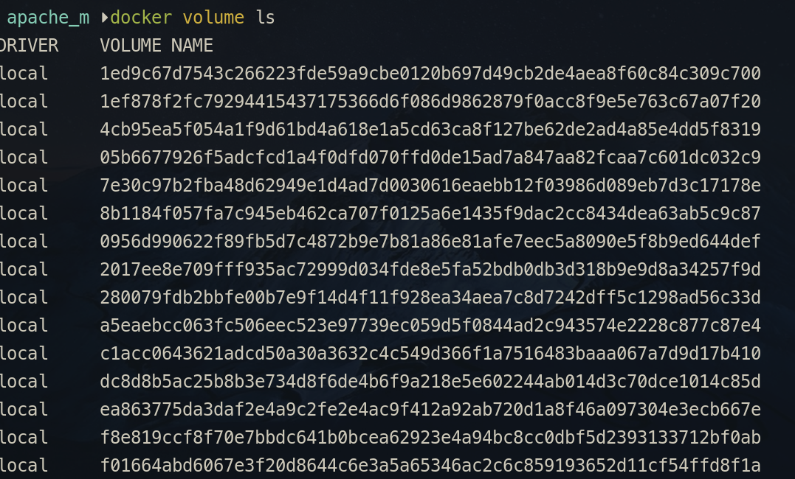

#### 挂载总结

无论是使用 `--mount` 还是 `-volume`，只要是宿主机路径如果是绝对路径，就是指定自定义目录为挂载目录。 这类挂载被称为「指定路径挂载」。 这种挂载，一般情况，除非事先将容器要映射的路径中的数据从容器里复制到宿主机要挂载的路径下，正常情况，宿主机的目录会「覆盖」掉容器，所以像 nginx、apache、mysql 等，如果要把容器中配置相关的数据，通过挂载方式持久化到宿主机上，一般会先 run 一个没有挂载的容器，然后通过 `docker cp ` 命令将配置数据复制到将要挂载的目录中，不然有可能容器虽然创建成功了，但连启动都启动不了。

> [!tip]
> 当然有部分镜像有特殊设计，当你挂载某些目录时，它会自动复制该目录文件到要挂载的宿主机目录中，如 MySQL 的数据目录就是其中一个。可以看下 MySQL 的 Dockerfile 文件中有一句代码：
> 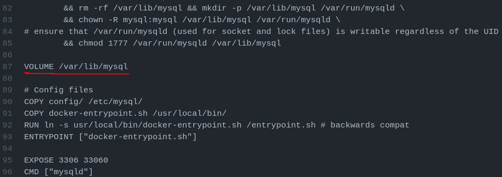
> 就是因为这句代码，使用得挂载 MySQL 的数据目录时，会自动将容器内的数据复制到指定要挂载的目录中。
> 除了像 MySQL 数据目录这种情况外，指定路径的挂载，容器内的数据都会被「覆盖」，且不会在覆盖前复制到宿主机中，所以得手动复制。

<span id="docker_volume_namedvolume">**具名挂载**</span>

无论是使用 **--mount** 还是 **-volume**，只要是宿主机路径如果是相对路径，就是在 docker 安装目录下的子目录 **volumes** 中创建相应的挂载目录。 此类挂载被称为「**具名挂载**」。

<span id="docker_volume_anonvolume">**匿名挂载**</span>

无论是使用 **--mount** 还是 **-volume**，只要宿主机的参数（--mount source 不指定或 -v 的冒号左边值）缺失，那 Docker 会自动生成一个随机字符串来作为此 volume 的名称，这被称为「**匿名挂载**」。

「**具名挂载**」和「**匿名挂载**」都是将挂载数据交由 Docker 来「托管」，所以只能指定托管的名称，不能指定数据存放的路径，默认存放在 docker 安装目录下的 volumes 子目录中（volumes 目录，顾名思义就是专门上用来管理 volume 的 ）。而这种托管，是将容器中的路径下的数据复制到 volumes 目录下，所以这种两种挂载，容器内容没有被「覆盖」。

---

## <span id="dk_network">网络</span>

libnetwork 中容器网络模型（Container Networking Model，CNM），可以让其上层使用网络功能的容器最大程度地忽略底层具体实现。

容器网络模型包括三种基本元素：

* 沙盒（Sandbox）：代表窗口（网络命名空间）
* 接入点（Endpoint）：代表网络上可以挂载容器的接口，会分配 IP 地址。
* 网络（Network）：可以连通多个接入点的一个子网。

**CNM 生命周期**：
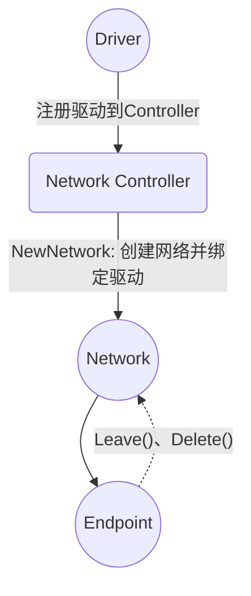
如图所示：
1. 注册驱动到网络控制器
2. 网络控制器创建网络
3. 在创建的网络上创建接口
4. 把容器连接到接口上

删除操作正好相反，先把容器从接入口上卸载，然后删除接入口和网络即可。

### Docker 网络模式

Docker 默认是拥有三种网络模式。

Docker 默认情况，容器使用的是「**桥接模式**」。

**桥接模式**：bridge

Docker 默认用 Linux 网桥和 IPtables 实现的单机网络。

```shell
docker run -d -p [宿主机ip]:[宿主机端口]:[容器端口] --name [容器名字][镜像名称]
```
> 如果不指定宿主机 ip 的话，默认使用 0.0.0.0。  
> 如果连宿主机的端口也省略，就表明宿主机的端口与容器端口一致

还可以进行多端口映射：
```shell
docker run -d -p [宿主机端口1]:[容器端口1] -p [宿主机端口2]:[容器端口2] --name [容器名
称][镜像名称]
```

**Host 模式**：   
使用 `--net=host` 来指定。

Host 模式并没有为容器创建一个隔离的网络环境。而之所以称之为「Host 模式」，是因为该模式下的 Docker 容器会和 host 宿主机共享一个网络 namespace，故 Docker 容器可以和宿主机一样，使用宿主机的 ech0，实现和外界的通信。

Host 模式下，Docker 容器的特点：
* 容器没有隔离的 network namespace
* 容器的 IP 地址同 Docker host 的 IP 地址
* 容器中的服务的端口号有可能与宿主机上已经使用的端口号冲突
* host 模式能够和其他模式共存

**None 模式**：

none 无指定网络，窗口内不指定局域网 ip host，不为 Docker 容器构造任何网络环境，不会为容器创建网络接口，
一旦 Docker 容器采用了 none 网络模式，那么容器内部就只能使用 loopback 网络设备，不会再有其他的网络资源。
容器只能使用 127.0.0.1 的宿主机网络。

---

### <span id="dk_network_vbridge">虚拟网桥</span>

当 Docker 启动时，会自动在宿主机上创建一个 **docker0** 虚拟网桥。
它会在挂载到它的网口之间进行转发。
> Docker 随机分配一个本地未占用的私有网段中的一个地址给 docker0 接口。  
> 此后启动的容器内的网口也会自动分配一个同一网段的地址。  
> docker0 网桥在内核层连通了其他物理或虚拟网卡，这就将所有容器和宿主机都放到同一个物理网络中。

当创建一个 Docker 窗口时，同时会创建了一对 「veth pair」 接口（**v** 应该是 virtual；**eth** 是网络接口（ethernet）；**veth pair** 就是「虚拟网络接口对」）。
这对接口一端在容器内，即 **eth0**；另一端在本地并被挂载到 docker0 网桥，名为称以 「veth」开头。
通过这种方式，宿主机可以跟容器通信，容器之间也可以相互通信。


**docker0** 这个网桥可以通过 `sudo brctl show` 命令查询。
> 如果系统没有，请安装。Debian 系的，可以使用 `sudo apt-get install bridge-utils` 来安装。  
> 关于 [网桥](../Linux/Linux_Note.md#linux_network_bridge)

brctl 查询结果大概如下：
```shell
bridge name	bridge id		STP enabled	interfaces
docker0		8000.0242d0f8c584	no		
```
 
> 通过 `docker network ls` 命令同样也能查询，不过没有使用 `brctl` 查询信息更详细。  
> 如需要更详细信息，就能动用 `docker network inspect` 命令了。

---

#### <span id="dk_network_define_bridge">自定义网桥</span>

由于 Docker 默认的网络不能固定 ip 地址，所以必须得创建自定义虚拟网桥，才能进行固定 ip 分配。
对于网桥的操作，可以通过 `docker network` 命令完成，也可以通过 Linux 系统网络相关的工具完成。

##### 通过 非 Docker 命令来创建网桥
1. 停止 docker 服务
```shell
sudo systemctl stop docker
```
> 这种方式必须在 Docker 服务停止前提下进行。

2. 删除旧的网桥
> 使用 `ip link set xxx down` 命令禁用指定设备  
> 使用 `brctl delbr xxx` 命令来删除指定网桥
```shell
sudo ip link set dev docker0 down
sudo brctl delbr docker0
```

3. 创建一个网桥
> 使用 `brctl addbr ` 命令来创建网桥  
> 使用 `ip addr add ` 命令来为网桥添加 ip  
> 使用 `ip link set up` 命令来启用这个网桥
```shell
sudo brctl addbr bridge0
sudo ip addr add xxx/24 dev bridge0
sudo ip link set dev bridge0 up
```

4. 查看确认网桥创建并启动
```shell
ip addr show 网桥名
```

5. 配置 Docker 配置文件
在 /etc/docker/daemon.json 文件中添加以下内容：
```json
"bridge": "网桥名",
```
> 这个配置可将 Docker 默认桥接到创建的网桥上。

还能通过以下方式桥接到创建的网桥上：
```shell
echo 'DOCKER——OPTS="-b=网桥名"' >> /etc/default/docker
```

6. 重启 Docker 服务
```shell
sudo systemctl start docker
```

##### 通过 Docker network 命令来创建网桥

```shell
docker network create -d bridge 网桥名称 
```
> docker 允许创建 3 种类型的自定义网格：bridge、overlay、MACVLAN  
> 通过 -d（--driver）设置网络类型，默认值为「bridge」。 实际就是「CNM 生命周期」中「驱动」。

使用 `create -d bridge` 这种方式创建的网桥，Docker 会自动为其分配网关（Gateway）和子网（Subnet）。

这种自动分配都是以 **172** 网段开始的（另外，自动分配的掩码长度是 16，所以在 Subnet 项会看到「x.x.x.x/16」），如创建一个网桥 172.18.0.0（默认 docker 自带的那个网桥是 172.17.0.0），再创一个应该就是 172.19.0.0。

如果不想用自动分配的网段可以使用 `-subnet` 参数指定。格式：如 **172.17.1.0/16** 。

指定网段示例：
```shell
docker network create --subnet x.x.x.x/xx -d bridge 网桥名称
```
> 如果添加了 `--subnet` 参数，此网桥的网关就不会被设置，得使用 `--gateway` 参数手动指定。

指定网段及网关示例：
```shell
docker network create --subnet 172.20.0.0/16 --gateway 172.20.0.1 -d bridge 网桥名
```

如果要想使自定义网桥能在 Linux 系统 `ifconfig` 或 `brctl` 等网络工具中显示出来，就得使用 `-o` 参数指定 `com.docker.network.bridge.name` 这个选项的值。

`-o` 或 `--opt` 即给网桥添加可选项。  

查看 docker 的默认网桥，会看到以下信息：
 ```json
"Options": {
		"com.docker.network.bridge.default_bridge": "true",
		"com.docker.network.bridge.enable_icc": "true",
		"com.docker.network.bridge.enable_ip_masquerade": "true",
		"com.docker.network.bridge.host_binding_ipv4": "0.0.0.0",
		"com.docker.network.bridge.name": "docker0",
		"com.docker.network.driver.mtu": "1500"
       },
```
`-o` 参数指定的值便是这些地东西。

而通过 `brctl` 等系统网络工具查看网络信息时，出现的默认网桥「docker0」便是通过 `com.docker.network.bridge.name` 的值决定的。

所以如果想让操作系统的网格工具能查询到 docker 中自定义的网桥，就可以通过 `-o com.docker.network.bridge.name=名称` 这种方式指定。

指定 `com.docker.network.bridge.name` 示例：
```shell
docker network create --subnet 172.21.0.0/16 --gateway 172.21.0.1 -o com.docker.network.bridge.name=网桥名 -d bridge 网桥名 
```

---

### SNAT 与 DNAT

使用 `sudo iptables -nL` 来查询当前宿主机系统 ip。

使用 `sudo iptables -t nat -nL` 来查询宿主机 **NAT** 的规则。查询结果大概如下：
```shell
Chain POSTROUTING (policy ACCEPT)
target     prot opt source               destination         
MASQUERADE  all  --  172.17.0.0/16        0.0.0.0/0           
MASQUERADE  tcp  --  172.17.0.2           172.17.0.2           tcp dpt:3306
```
> 第一行结果：源地址在 172.17.0.0/16 网段。  
> MASQUERADE 表示能动态从网卡获取地址。 **MASQUERADE**，地址伪装，算是 **snat** 的一种特例，可以实现自动化的 snat。
> 关于 iptables 及 Linux 网络相关的资料请查询 [Linux 网络](../Linux/Linux_Note.md#linux_network)。

---

---

### <span id="dk_network_custom_ip">自定义固定 IP</span>

要自定义固定 ip，只能在 [自定义虚拟网桥](#dk_network_define_bridge) 中进行，不然会报以下错误：
```shell
docker: Error response from daemon: user specified IP address is supported on user defined networks only.
```

---

### <span id="dk_network_command">网络相关的常用命令</span>

从 1.7 版本始， Docker 把网络与存储以插件化形式剥离。而剥离出来的网络项目为 libnetwork 项目。

在 libnetwork 支持下，Docker 网络相关操作都作为 network 的子命令出现。

* 网络列表：
```shell
docker network ls
```

* 创建 **bridge** 网络：
```shell
docker network create 网络名
```

* 创建一个 **overlay** 网络：
使用 `-d` 参数指定 Docker 网络类型，有 bridge 和 overlay。如果不指定就是默认的 bridge。
**overlay** 网络类型用于 Swarm mode。
```shell
docker network create -d overlay 网络名
```
> bridge 只能指定一个子网。  
> overlay 网络支持多个子网络，使用 `--subnet` 选项来创建子网。

* 删除和清空无主网络：
```shell
# 删除网络
docker network rm 网络名


# 清空无主网络
docker network prune
```
> `docker network rm` 这种方式无法删除默认虚拟网桥，会报以下错误：  
> ```shell
> bridge is a pre-defined network and cannot be removed
> ```

* 连接和断开连接网络：
```shell
# 连接网络
docker network connect 网络名

#断开连接
docker network disconnect 网络名
```

---

#### docker inspect 查询网络相关信息的用法

* 查询网络的详细信息：
```shell
docker network inspect 网络名
```
> 如果使用 `docker network inspect 网桥` 查询网桥信息 ，会显示该网桥中哪些正在运行中的容器使用的 IP，这样可以在创建新容器时指定 IP 就不容易重复冲突了！所以使用自定义网桥创建容器前，先查询下该网桥网段中哪些 IP 已经被占用了。

##### 查询容器 IP

查询所有容器名称及 IP,使用的是默认网桥:
```shell
docker inspect --format='{{.Name}} - {{range .NetworkSettings.Networks}}{{.IPAddress}}{{end}}' $(docker ps -aq)
```

查询自定义网桥下已指定的 IP 有哪些,也就是全部容器占了哪些 IP.
```shell
docker inspect $(docker ps -aq) | grep IPv4Address
```
显示结果:
```shell
"IPv4Address": "172.20.0.8"
"IPv4Address": "172.20.0.30"
"IPv4Address": "172.20.0.10"
"IPv4Address": "172.20.0.9"
```

使用 `docker inspect` 语法:
```shell
docker inspect -f '{{.Name}} - {{.NetworkSettings.Networks.vbridge01.IPAMConfig.IPv4Address}}' $(docker ps -aq)
```
> `vbridge01` 这是自定义的网桥名

显示结果类似:
```shell
/d_php81 - 172.20.0.8
/d_mysql8 - 172.20.0.30
/d_apache - 172.20.0.10
/d_nginx - 172.20.0.9
```

可以将以上的代码写成个 shell 函数放到 `.bashrc` 或 `.bash_profile` 等配置文件中,方便随时调用查看 ip 占用的情况。

`NetworkMode` 的值跟后面的 IP 地址查询相关，所以先了解这项值的意思：
> `NetworkMode` 在 json 中的层级是：`HostConfig.NetworkMode`。所以查询 `NetworkMode` 得如下这么查：
> ```shell
>	docker inspect -f '{{.HostConfig.NetworkMode}}' 容器名
> ```

* `default` 用的是默认网桥，IP 所以得查 `NetworkSettings.Networks.bridge.IPAddress`
	> 所以直接就是 bridge
* `host` 模式下 `IPAddress` 是没有值，因为它用的是 host 连接
* `NetworkMode` 的值不是 `host` 也不是 `default` ，那就是自定义网桥，所以 `NetworkSettings.Networks` 中 `IPAddress` 在容器没有运行时是没有值的，而容器的 IP 值是放在：
```json
"网桥名"{
	"IPAMConfig"{
		"IPv4Address":"xxx"
	}
}
```
> `IPv4Address` 才是容器被指派的 IP 值。

可以知道，`IPAddress` 这个值是容器运行时的值，因为默认使用默认网桥，而使用默认网桥创建容器，是不能指定 IP 的，这 IP 是动态指派的，所以 IPAddress 实际只有运行时才出现。所以在使用默认网桥的容器，是没有 `IPAMConfig.IPv4Address` 这货的，这货是专门存放那些使用自定义网桥，并创建容器时指定的 IP 值。 

取 `IPv4Address`：
```shell
docker inspect -f '{{range .NetworkSettings.Networks}}{{.IPAMConfig.IPv4Address}}{{end}}' 容器名 
```
查询所有容器的 IPv4Address：
```shell
docker inspect -f '{{.Name}}: {{range .NetworkSettings.Networks}}{{.IPAMConfig.IPv4Address}}{{end}}' $(docker ps -aq)
```
> 加上 `{{.Name}}` ，把容器名称也显示出来

把这代码写成个 shell 函数放在 `.bash_profile` 中，就能方便随时查看已有容器的 ip 占用情况了！
```shell
function docker_ipv4_allcontainers(){
	docker inspect -f '{{.Name}}: {{range .NetworkSettings.Networks}}{{.IPAMConfig.IPv4Address}}{{end}}' $(docker ps -aq)
}
```

##### 查询容器端口

核心思想跟上面的取 ip 类似。

同样的，如果是自定义网桥下取 端口，得查询 `HostConfig.PortBinddings` 节点的中的值，其子节点会列出，相关端口的映射关系：
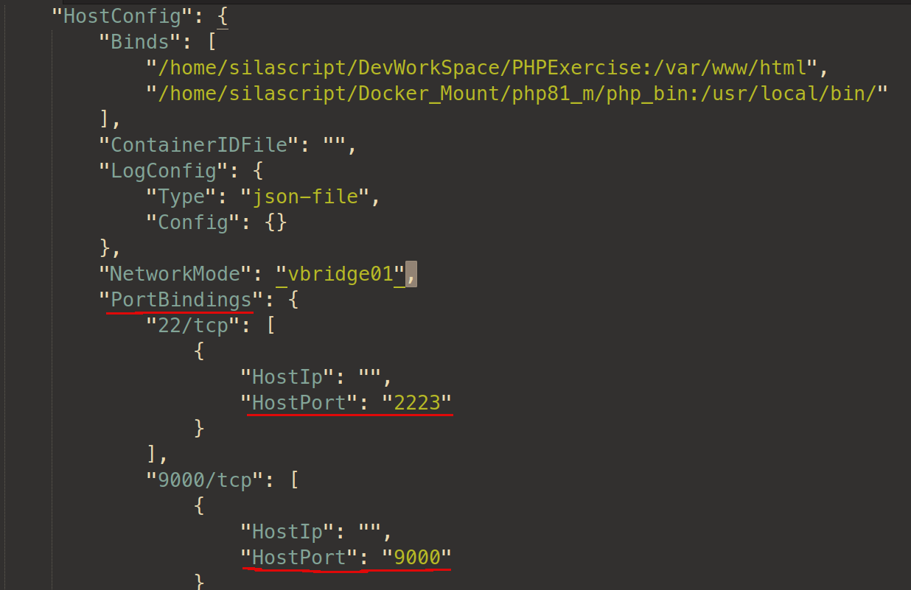

因为 `PortBinddings` 节点与 `HostPort` 节点间还有一个节点,那是容器内的端口,这个端口不同容器是不一样的,所以得用个变量取下,动态地指定,所以 `docker inspect` 的模板使用就如下:

```shell
docker inspect --format='{{range $conf := .HostConfig.PortBindings}}{{(index $conf 0).HostPort}} {{end}}' 容器名
```

查询所有窗口已用的端口:
```shell
docker inspect --format='{{range $conf := .HostConfig.PortBindings}}{{(index $conf 0).HostPort}} {{end}}' $(docker ps -aq)
```

包装下可以写成个函数放到 `.bash_profile` 文件中，方便平时查询：
```shell
function docker_ports_allcontainers(){
	docker inspect --format='{{range $conf := .HostConfig.PortBindings}}{{(index $conf 0).HostPort}} {{end}}' $(docker ps -aq)
}
```

把容器名也加上：
```shell
function docker_ports_allcontainers(){
	docker inspect --format='{{.Name}} - {{range $conf := .HostConfig.PortBindings}}{{(index $conf 0).HostPort}} {{end}}' $(docker ps -aq)
}
```

---

### <span id="dk_dkf">Dockerfile 编写</span>

**各基础镜像大小**
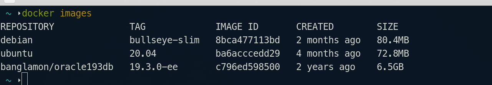

简单示例：安装一个 vim
```dockerfile
# FROM archlinux
# FROM ubuntu:20.04 
# FROM debian:bullseye-slim
# FROM debian:bullseye
# FROM debian:11.2-slim
FROM centos:7.9.2009
MAINTAINER silascript

# RUN pacman -Sy --noconfirm vim
# RUN apt-get update && apt-get install -y --no-install-recommends vim
RUN yum install -y vim

CMD ["vim"]

```

#### <span id="dk_dkf_commands">Docker 构建镜像常用命令</span>

语法：
1. `dokcer build -t [镜像名]:[版本号] [Dockerfile 所在目录]`
> 不用指定 Dockfile 文件，默认使用当前目录下默认叫「Dockfile」的 Dockfile 文件作为构建文件。

2. `dokcer build -t [镜像名]:[版本号] [Dockerfile 所在目录]`
> 这种方式是指定 Dockerfile 文件的所在的目录

3. `dokcer build [-f] [指定 Dockerfile 文件] -t [镜像名]:[版本号] [Dockerfile 所在目录]`
> 这是指定非默认名称的 Dockerfile 文件

示例：
```shell
docker build -f Dockerfile.debian -t mysql8:0.1 .
```
> **-f** 指定 Dockfile 文件  
> **-t** 镜像名和 tag。镜像名必须是小写字母  
> **.** 当前目录

---

## <span id="dk_softc_demo">各软件容器使用示例</span>

### 示例 1：安装及运行 Nginx:

```sh
docker run -d --name d_nginx -p 8899:80 nginx:stable
```

将宿主机的目录挂载到容器内:
> 在执行以下操作前，应先 run 一个没有挂载目录的 nginx，然后将 default.conf 和 nginx.conf 这两个配置文件复制到宿主机目录中。  
> 复制容器中的文件使用 **cp** 命令，语法：**docker cp 容器名称: 容器中文件路径 宿主机存放路径**  
> 示例：
> ```shell
> docker cp d_nginx:/etc/nginx/conf.d/default.conf Docker_Mount/nginx_m/conf.d
> docker cp d_nginx:/etc/nginx/nginx.conf Docker_Mount/nginx_m/conf/
> ```
```shell
docker run --name d_nginx -d -p 8899:80 -v /home/silascript/Docker_Mount/nginx_m/etc/conf.d:/etc/nginx/conf.d -v /home/silascript/Docker_Mount/nginx_m/html:/usr/share/nginx/html -v /home/silascript/Docker_Mount/nginx_m/log:/var/log/ngixn nginx:stable
```

<span id="dk_nginx_config">nginx 配置文件：</span>  
在 con.d 目录中的配置文件，default.conf 优先级更高。  
如果要自定义配置文件，可能会不生效，最好把 default.con “backup”下。

```conf
location ~ \.php$ {
   # root           html;
   # fastcgi_pass   127.0.0.1:9000;
   fastcgi_pass   172.17.0.2:9000;
   fastcgi_index  index.php;
   # fastcgi_param  SCRIPT_FILENAME  $document_root$fastcgi_script_name;
   fastcgi_param  SCRIPT_FILENAME  /var/www/html/$fastcgi_script_name;
   include        fastcgi_params;
}

```

指定自定义网桥和 ip 生成容器：
```shell
docker run --name d_nginx --network 网桥名 --ip 172.20.0.9 -d -p 8899:80 -v /home/silascript/Docker_Mount/nginx_m/etc/conf.d:/etc/nginx/conf.d -v /home/silascript/DevWorkSpace/PHPExercise:/usr/share/nginx/html -v /home/silascript/Docker_Mount/nginx_m/log:/var/log/ngixn nginx:stable
```

---

### <span id="dk_softc_demo_php">示例 2 ：PHP </span>
```shell
docker run --name php81 -p 9000:9000 -v /home/silascript/Docker_Mount/nginx_m/html:/var/www/html -d php:8.1.5-fpm-bullseye
```

检测某容器的 IP:
语法：**docker inspect 窗口名/id |grep '"IPAddress"'**
示例：
```shell
docker inspect php81 |grep '"IPAddress"'

```

检测 PHP-FPM 是否开启：
使用 `docker exec` 命令进入 PHP 容器，执行以下命令：
```shell
ps -ef|grep php
```

> 如果没有 `ps` 命令，请安装 **procps**（以 Debian 系为例：`apt install procps`）

指定自定义网桥和指定 ip 生成容器：
```shell
docker run --name php81 --network 网桥名 --ip x.x.x.x  -p 9000:9000 -v /home/silascript/DevWorkSpace/PHPExercise:/var/www/html -d php:8.1.5-fpm-bullseye

```
示例：
```shell
docker run -d --name d_php81 --network vbridge01 --ip 172.20.0.8 -p 9000:9000 -p 2223:22 -v /home/silascript/DevWorkSpace/PHPExercise:/var/www/html php:8.1.5-fpm-bullseye
```
> 映射两个端口，9000 是 fpm，映射 22 是为了开启 ssh 用的。

案例：要将 php 执行文件映射到宿主机，让诸如 VSCode 等宿主机上的软件能调用（VSCode 有个插件 [PHP Intelephense](https://marketplace.visualstudio.com/items?itemName=bmewburn.vscode-intelephense-client) [](https://github.com/bmewburn/vscode-intelephense)，它就有个配置项 `php.validate.executablePath` 需要调用 php 的可执行文件）。

这种需要，就需要将 容器中 php 可执行文件所在的目录挂载出去，但 Docker 的特性，直接挂载如果宿主机目录本为空，那这空目录就会「覆盖」掉容器目录，所以还是按惯例，先「run」一个将 php 可执行文件所在目录「托管」给 Docker，然后复制这托管目录中所有文件到未来要挂载的指定目录，再进行第二次「run」，这一次就可以指定挂载目录了。具体操作如下：

1. 先 run 一个容器：
```shell
docker run -d --name d_php81 --network vbridge01 --ip 172.20.0.8 -p 9000:9000 -p 2223:22 -v /home/silascript/DevWorkSpace/PHPExercise:/var/www/html -v php_bin:/usr/local/bin/ php:8.1.5-fpm-bullseye
```
> 其中 `-v php_bin:/usr/local/bin/` 这个设置，就是将容器中 `/usr/local/bin` 目录「托管」给 Docker。  
> 其实 连 **php_bin** 这个名字都可以不用，不过给个名字方便查询存放数据目录信息。详情请查看 [具名挂载](#docker_volume_namedvolume) 和 [匿名挂载](#docker_volume_anonvolume)。  
> 当然，更懒的，连 `-v php_bin:/usr/local/bin/` 这个选项都可以省。那到复制时，就使用 `docker cp` 命令来复制。

2. 复制 php 可执行文件所在的目录
如上面使用「具名挂载」方式，先使用 `docker volume ls` 命令查询刚挂载的 volume 是否存在。然后使用 `docker volume inspect volume名称` 来查询挂载信息，查出 volume 真实存放的路径，一般是 `/usr/lib/docker/volumes/voluem名称/_data` （如果是「匿名挂载」，volume 名称那个目录就是一串 docker 生成的字符串，所以由此可以认为「匿名挂载」是一种特殊的「具名挂载」），查到路径了，那就将路径目录中所有文件复制到未来要挂载的自定义目录中。
> 如果是未挂载目录，那就只能使用 `docker cp` 命令来复制了。

3. 再 run 一个容器：
```shell
docker run -itd --name d_php81 --network vbridge01 --ip 172.20.0.8 -p 9000:9000 -p 2223:22 -v /home/silascript/DevWorkSpace/PHPExercise:/var/www/html -v /home/silascript/Docker_Mount/php81_m/php_bin:/usr/local/bin/ php:8.1.5-fpm-bullseye
```
> 经过上一步复制操作，`-v /home/silascript/Docker_Mount/php81_m/php_bin:/usr/local/bin/` 这个选项中 `php_bin` 这个目录中已经有了 `/usr/local/bin/` 目录所有文件，所以挂载上，就不会因为宿主目录空而出错了。

经过这三步操作，就把 php 可执行文件所在的目录挂载到宿主目录了。

如果为了方便，可以把 宿主目录中的 php 可执行文件，作软连接到 `/usr/local/bin` 目录下，这样，方便调用，如下：
```shell
ln -s ~/Docker_Mount/php81_m/php_bin/php /usr/local/bin/d_php81 
```

这种方式，避免了，「托管式」挂载权限问题。因为「托管」给 Docker，实际存放的路径是在 `/usr/lib/docker/volumes/` 这个目录下的，放在这里，访问调用是需要 root 权限的。而挂载到用户指定目录中，就避免了权限的问题 -- 因为权限问题，即使把 `/usr/lib/docker/volumes/...` 这个具体路径配置给 [PHP Intelephense](https://marketplace.visualstudio.com/items?itemName=bmewburn.vscode-intelephense-client) [](https://github.com/bmewburn/vscode-intelephense) 插件，这插件照样调用不了 php 可执行程序，原因就是权限问题。 

---

#### 安装 xdebug

```
pecl install xdebug
```

添加到配置文件
```shell
docker-php-ext-enable xdebug
```

使用 `php -m` 命令查看是否安装成功。

---

### 示例 3：Apache

简单创建容器：
```shell
docker run -itd -p 8088:80 --name apache_2.4.52 httpd:2.4.52-bullseye
```

指定网桥及 ip 创建容器：
```shell
docker run -d --name d_apache --network 网桥名 --ip x.x.x.x -p 8085:80 -v /home/silascript/Docker_Mount/apache_m/conf:/usr/local/apache2/conf -v /home/silascript/DevWorkSpace/PHPExercise:/usr/local/apache2/htdocs httpd:2.4.52-bullseye
```

> apache 默认目录结构：
> 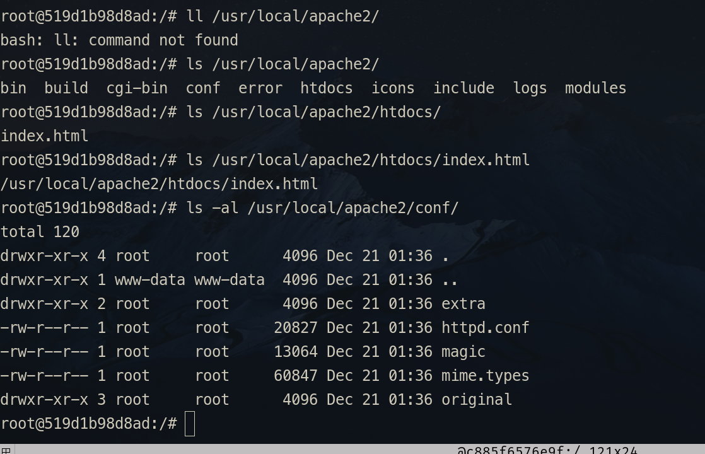
> Apache 根目录：/usr/local/apache2/
> Apache 页面发布目录：/usr/local/apache2/htdocs/
> Apache 配置文件目录：/usr/local/apache2/conf/
> 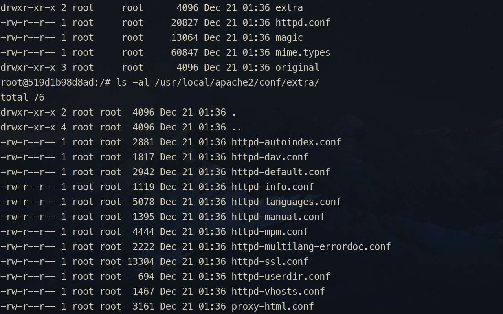
> Apache 扩展配置文件目录：/usr/local/apache2/extra/
> 扩展配置文件目录中 **httpd-vhosts.conf** 这个配置文件是用来配置 **虚拟目录** 的。

~~Apache 详细配置请参考：[Linux下安装配置Apache](../PHP/Linux下安装配置Apache.md)~~

#### <span id="dk_apache_config">Apache 配置</span>

使用 PHP-FPM 方式调用 PHP 引擎解析 PHP 页面：

1. 加载相应的模块
```cnf
LoadModule proxy_module modules/mod_proxy.so
LoadModule proxy_fcgi_module modules/mod_proxy_fcgi.so
```

2. 接收 php 页面请求时，交给 PHP 引擎解析，而不是下载
```cnf
AddType application/x-httpd-php .php
AddType application/x-httpd-php-source .phps
```

~~3. 如果 **PHP-FPM** 使用的是 **TCP socket**，要在 httpd.conf 末尾加上：~~
~~```conf~~
~~<FilesMatch \.php$>~~
	~~SetHandler "proxy:fcgi://php-fpm的ip:9000"~~
~~</FilesMatch>~~
~~```~~
~~> 那 IP 是 PHP-FPM 的地址。可以通过 `docker inspect 容器名称或ID | grep "IPAddress"` 这个命令来查看。~~

3. 通过调 **PHP-fpm** 来为 Apache 解析 PHP：
	有四种方式
	* SetHandler
		没配成功
	* ProxyPassMatch
		需要使用 **VirtualHost**
	* ProxyPass
		与 **ProxyPassMatch** 类似，也是在 **VirtualHost** 中使用
	* Mod_Rewrite
		不支持持久链接

与 PHP-fpm 通信又分两种方式：**TCP** 和 **Socket**。

以 TCP 方式为例：

* ProxyPassMatch 方式配置：
	1. 需要开启 `mod_proxy` 和 `mod_proxy_fcgi` 这两个模块
		```conf
		# 把这两行前的注释去掉就能加载这俩模块了
		LoadModule proxy_module modules/mod_proxy.so
		LoadModule proxy_fcgi_module modules/mod_proxy_fcgi.so	
		```
		> **mod_proxy** 模块主要作用是进行 url 转发，即具有代理功能。  
		> **mod_proxy_fcgi** 模块看名字，就知道这货得依赖上面那个代理模块，如是上面那个模块未加载，页面都访问不了。
		> 而 **mod_proxy_fcgi** 顾名思义，是跟 fastcgi 相关的，所以要与 PHP-fpm 通信就得加载此模块。  
		> 如果不开启「**mod_proxy_fcgi**」模块，会报以下错误：  
		> Internal Server Error  
		> The server encountered an internal error or misconfiguration and was unable to complete your request.
		> Please contact the server administrator at you@example.com to inform them of the time this error occurred, and the actions you performed just before this error.
		>More information about this error may be available in the server error log.
	
	2. 配置虚拟目录
	```conf
	<VirtualHost *:80>
		# ServerAdmin liang@com.cn
		DocumentRoot "/usr/local/apache2/htdocs"
		ServerName localhost
		# <Directory "/usr/local/apache2/htdocs">
		# Options None
		# Require all granted
		# </Directory>
		ProxyRequests Off
		ProxyPassMatch ^/(.*\.php)$ fcgi://172.17.0.2:9000/var/www/html/$1
	</VirtualHost>
	```	
	> 这个节点可以直接放在 httpd.conf 这个配置文件中。  
	> 也可以把它放在 httpd.conf 文件同级 extra 目录下专门上用来配虚拟目录的配置文件：**httpd-vhosts.conf** 文件中。  
	> 如果在 **httpd-vhosts.conf** 这个配置文件中配的话，得开启虚拟目录功能：  
	> 在 httpd.conf 文件中找到以下代码：  
	> ```conf
	>  # 去掉前面的注释，就能把 httpd_vhosts.conf 这个配置文件「include」进来了
	>  Include conf/extra/httpd-vhosts.conf 
	> ```
	> **为了 httpd.conf 这个主配置文件代码简洁，建议使用 httpd_vhosts.conf 文件来配置虚拟目录。** 
	> 
	> `fcgi://xxx:9000` 这是 PHP-fpm 的 IP 和端口。这个 IP 和端口 是在 PHP 容器中 `/etc/php-fpm.d/www.conf` 文件中设置的 -- `listen = xxxx:9000`。  
	> `/var/www/html/` 这个是 PHP 容器中页面发布目录（绝对路径）。不要配成 Apache 的页面发布路径，否则会发生 `File not found.` 错误。  
    > `DocumentRoot "/usr/local/apache2/htdocs"` 这是指定的是 Apache 的页面发布目录的路径。千万不要填成 PHP 的。不然静态页面就会访问不到了。  
	> **$1** 这里指的是前面 `(.*\.php)` 这个变量。这个变量可以不加。  
	> 可以这么理解，VirtualHost 里配的页面发布目录就是 Apache 的，只是遇到了 php 文件时，通过调用 PHP-fpm 来处理这些 php 文件。而 **ProxyPassMatch** 可以看成是一个「**拦截器**」，拦截 **.php** 页面，然后交由 PHP-fpm 来解析。

* ProxyPass 方式配置：

	同样需要 **VirtualHost**，配置代码如下：

	```conf
	<VirtualHost *:80>
    ServerName localhost
	DocumentRoot "/usr/local/apache2/htdocs"
		<LocationMatch ^(.*.php)$>
			ProxyPass fcgi://172.17.0.2:9000/var/www/html/
			ProxyErrorOverride on
		</LocationMatch>
	</VirtualHost>

	```
 
    > [!tip]
	> 跟 **ProxyPassMatch** 非常像，其实就是把 **ProxyPassMatch** 标签化成了 `<LocationMatch>` 而已。  
	> 同样注意的是 **DocumentRoot** 的值千万不要填成 PHP 的。不然静态页面就访问不到了，就算 PHP 容器发布页面目录与 Apache 发布目录都挂载到同一个宿主机目录，也是访问出问题 -- 权限问题。  

---

#### Apache 与 Nginx 共用文件目录及一个 PHP 引擎 方案

1. 创建 PHP 容器
```shell
docker run -d --name d_php81 -p 9000:9000 -v /home/silascript/DevWorkSpace/PHPExercise:/var/www/html php:8.1.3-fpm-bullseye
```

检查 PHP-fpm 的设置。如 php-fpm 的监听端口。
> 在 `/etc/php-fpm.d/www.conf` 这个文件中，其中有 `listen xxx:9000` 代码，就是设置 php-fpm 的监听端口的。

2. 创建 Nginx 容器
```shell
docker run -d --name d_nginx -p 8899:80 -v /home/silascript/Docker_Mount/nginx_m/etc/conf.d:/etc/nginx/conf.d -v /home/silascript/Docker_Mount/nginx_m/log:/var/log/nginx -v /home/silascript/DevWorkSpace/PHPExercise:/usr/share/nginx/html nginx:stable

```
> php 容器与 nginx 容器的页面发布目录挂载到同一个宿主机目录：
> ```shell
>  /home/silascript/DevWorkSpace/PHPExercise:/var/www/html 
>  /home/silascript/DevWorkSpace/PHPExercise:/usr/share/nginx/html 
> ```

> 创建完 nginx 容器后，[配置nginx](#dk_nginx_config)。
> 到这里先测试下，nginx + php 是否可用。

3. 创建 Apache 容器
```shell
docker run -d --name d_apache -p 8085:80 -v /home/silascript/Docker_Mount/apache_m/conf:/usr/local/apache2/conf -v /home/silascript/DevWorkSpace/PHPExercise:/usr/local/apache2/htdocs httpd:2.4.52-bullseye
```
> 同样将发布页面目录「bind」到同一个宿主目录。
> 测试下，如果发生如下错误信息：  
> Service Unavailable  
>  The server is temporarily unable to service your request due to maintenance downtime or capacity problems. Please try again later.  
> 有可能是 php 容器的 IP 变了，需要修改 Apache 的配置文件 --[apache 配置](#dk_apache_config)。

4. 新建个 PHP 页面进行测试
```php
<?php
phpinfo();
?>
```
> 就显示下 PHP 的安装信息。

还是更 **推荐使用 Nginx**，而且使用 PHP-fpm 方式解析 PHP 页面。Apache 配置实在是太麻烦了！

---

### <span id="dk_softc_demo_mysql">示例 4：MySQL/Mariadb</span>

```shell
# 不指定挂载目录
# -e MYSQL_ROOT_PASSWORD 这个选项不能省，不然容器创建成功也启动不了
docker run -d -p 3366:3306 -e MYSQL_ROOT_PASSWORD=123456 --name mariadb10.8 mariadb:10.8.2

# 指定挂载数据目录
docker run --name mariadb10.8 -p 3366:3306 -v /home/silascript/Docker_Mount/mariadb_m/data:/var/lib/mysql -e MYSQL_ROOT_PASSWORD=123456 -d mariadb:10.8.2

```

> [!tip] mysql 相关相关的目录、文件路径
> 配置文件目录：/etc/mysql
>
> 数据存放目录：/var/lib/mysql
>
> mariadb 的链接地址：
> /usr/bin/mysql -> mariadb

mysql 与其他镜像区别的是，mysql 的数据目录，使用了「**bing mount**」方式挂载，容器中的数据目录中数据会自动复制到指定的宿主机指定的目录中。可以看 mysql 的 Dockerfile 文件中有句代码，就知道为什么 MySQL 会有这个特殊点了：
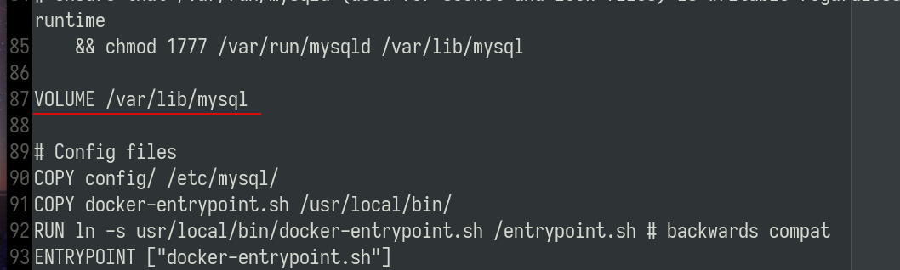

如生成一个什么目录都不挂载的 mysql 容器：
```shell
docker run -d --name d_mysql8 -p 3356:3306 -e MYSQL_ROOT_PASSWORD=123456 mysql:8.0.28-debian
```
通过 `docker volume ls` 命令可以看到一个 「**匿名挂载**」的 volume：
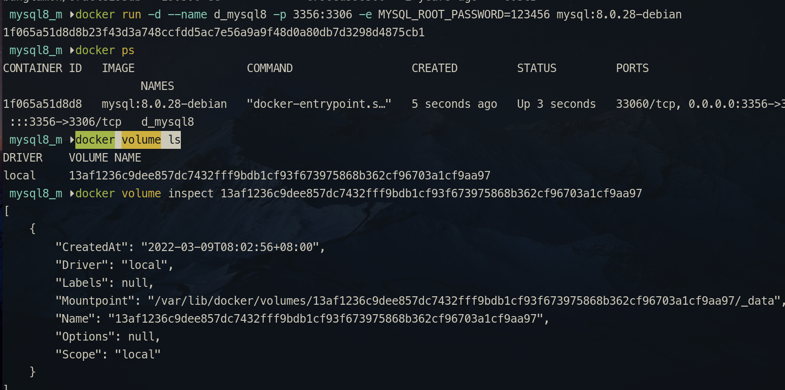
> 通过 `docker volume inspect 匿名挂载名` 命令查看挂载的 volume 的详细信息。 

直接查看那个 **Mountpoint** 的那个目录存放着什么：
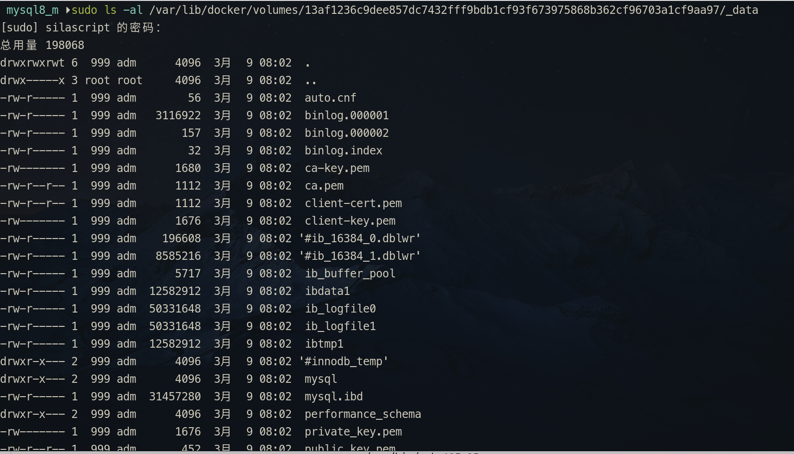
> 很明显，存放的就是 mysql 的数据文件。可见之前在 Dockerfile 文件中那一句 `VOLUME /var/lib/mysql` 代码就是让 mysql 容器创建后，将数据目录设为挂载点。

Docker MySQL 挂载方案：
因为 MySQL 的数据目录即便是「bind mount」类型的挂载，都会将容器数据复制到指定目录，所以这个目录可以直接指定。
但 MySQL 的配置目录没有这样的「特性」，所以得做些操作实现将容器数据复制到宿主机的挂载目录。
大概步骤：
1. 创建一个「匿名」或「具名」挂载容器。
```shell
docker run -d --name d_mysql8 -e MYSQL_ROOT_PASSWORD=123456 -v mysql8_data:/var/lib/mysql mysql:8.0.28-debian
```
> 最好「具名挂载」，这样容易找点。
2. 使用 `docker volume inspect xxx` 查看刚「托管」给 Docker 挂载的目录的路径
> 什么看到 `"Mountpoint": "/var/lib/docker/volumes/xxx/_data` 类似的路径
3. 将 `Mountpoint` 的路径中的数据复制到将来要挂载的目录中
4. 停止容器和删除容器并清理托管的 volume
5. 新建一个指定挂载宿主机路径为 volume

```shell
docker run -d --name d_mysql8 -p 3356:3306 -e MYSQL_ROOT_PASSWORD=123456 -v /home/silascript/Docker_Mount/mysql8_m/config:/etc/mysql -v /home/silascript/Docker_Mount/mysql8_m/data:/var/lib/mysql mysql:8.0.28-debian
```
> 因为之前已经将配置文件数据已经复制到要挂载的目录中，这样就不会因为宿主机目录为空，而使容器启动不了了。
> 至于数据目录因为 MySQL 的存放数据库的目录，因为 MySQL 的「特性」会自动复制数据到要挂载的目录，所以能直接挂载到指定路径。
> 这个方案的 **核心** 就是解决配置文件目录的挂载问题。

> 如果要指定网桥及 ip，可以用以下方式创建 MySQL 容器：
> ```shell
> docker run -d --name d_mysql8 --network 网桥名 --ip x.x.x.x -p 3356:3306 -e MYSQL_ROOT_PASSWORD=123456 -v /home/silascript/Docker_Mount/mysql8_m/config:/etc/mysql -v /home/silascript/Docker_Mount/mysql8_m/data:/var/lib/mysql mysql:8.0.28-debian
> ```

#### MySQL 内存优化

conf.d 目录下 **docker.cnf** 文件中 `[mysqld]` 下添加以下代码：

```conf
[mysqld]
performance_schema_max_table_instances=400
table_definition_cache=400
table_open_cache=256
performance_schema = off
```
> 内存占用优化挺明显的。  
> `performan_schema` 关不关可根据需要。这货是 5.7 及以上版本才默认开启的。

---

MySQL 其他设置及操作请参考：
* [MySQL笔记](../mysql/MySQL_Note.md)
* [MySQL常用操作](../mysql/MySQL常用操作.md)
* [linux下安装mysql](../mysql/linux下安装mysql.md)

---

### 示例 5：安装 CentOS

创建 CentOS 容器：

```shell
docker run -itd --name d_centos8 centos:centos8.4.2105
```
> [!tip] -it 参数
> 最简单的创建一个 CentOS 容器
> `-it` 这参数得加上，如果只是像其他镜像那样只有 `-d` 创建容器是成功，但启动不了容器
> 因为 CentOS 启动，需要开启一个伪终端

CentOS 开启 SSH 服务

* **run** 容器时加入 **--privileged=true** 参数
    > [!tip]	
	> 使用 --privileged=true 参数，可以使容器内的 root 用户真正拥有 root 权限。
	> 没有此参数的容器内的 root 用户只是外部的一个普通用户权限。
	> 以下代码使用在 CentOS 7
	> 
	> ```shell
	> docker run --name d_centos7  --privileged=true -p 10022:22 -d centos:7 /usr/sbin/ini
	> ```
	> 22 端口得映射，这是 ssh 访问的端口  
	> 如果是 CentOS 8，得使用以下代码创建容器，**systemctl** 才能正常使用。 
	> 如果 CentOS  8 没有使用以下代码开创建容器，可能会报以下这些错误信息 ：
	> ```shell
	> System has not been booted with systemd as init system (PID 1). Can't operate.
	> Failed to connect to bus: Host is down.
	> ```
	```shell
	docker run -itd --name d_centos8 --privileged centos:centos8.4.2105 /usr/sbin/init
	```
	> CentOS 8 已被官方“寿终正寝”了。而 CentOS 7 systemctl 使用都存在 `Failed to get D-Bus connection: No such file or directory` 错误。网上所有解决方案都存在问题。建议使用 Debian 系的系统。

* 使用 **exec** 选项进入 CentOS 容器
* 在 CentOS 容器内添加 SSH 服务并进行相应的配置
	> 参考 [CentOS 开启 SSH 服务](../Linux/CentOS_Note.md#cent_cs_ssh)
* 提交镜像
	> 使用 **docker commit** 选项，生成新的镜像。
	> 类似 vmware 生成一个 **快照**，也类似 git 的 commit 操作（实际上 git 上的版本就是一个个“快照”）。
```shell
# 语法：docker commit 容器名/ID 新镜像名[:tag]
```
* 将新生成的镜像 **Run** 成容器
	> 要记得把 SSH 服务配置文件中设置的那个端口映射到宿主机

---

### 示例 6：安装 Debian

创建容器与 CentOS 一样。

```shell
	docker run -itd --name 容器名 镜像名/ID 
```
在 Debian 中开启 SSH 功能。

* 创建 Debian 容器

* **exec** 进入系统。
	> 还是先确认 **systemctl** 能不能用！
	> 如果出现 `bash: systemctl: command not found` 这个错误，就得重装 **systemd**。  
	> 重装 **systemd**：
	> ```shell
	> apt install --reinstall systemd
	> ```
	> 如果出现 `System has not been booted with systemd as init system (PID 1). Can't operate.
	> Failed to connect to bus: Host is down` 这个错误信息，那就是“**run**”的时候没给权限（--privileged 参数）。

> 迄今为止，systemctl 问题尚未解决！待更！

---

### 示例 7：安装 Ubuntu

```shell
docker run -itd --name d_ubuntu21 --network vbridge01 --ip 172.20.0.20 -p 2225:22 ubuntu:jammy
```
> 使用自定义网桥并为容器指派 ip，另外映射 22 接口，以便后续开启 `ssh` 功能。

---

## 相关链接

* [Docker & K8s 视频清单](./Docker_Videos.md)

