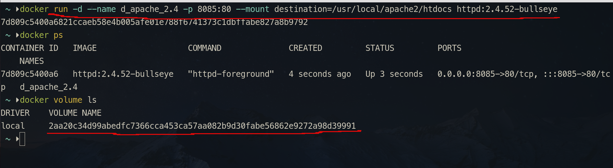

# Docker 笔记

---

## 目录

* [Docker 介绍](#dk_introduction)
	* [虚拟化技术](#dk_virtual_info)
* [Docker 架构及概念](#dk_arch)
* [安装与设置](#dk_insetup)
* [修改镜像源](#dk_mirror)
* [常用服务操作](#dk_comm_commands)
* [镜像操作](#dk_image)
* [容器操作](#dk_container)
	* [创建容器](#dk_container_create)
	* [停止容器](#dk_container_stop)
	* [进入容器](#dk_container_exec)
	* [删除容器](#dk_container_delete)
	* [查看容器](#dk_container_info)
* [Volume和挂载](#dk_volume_mount)
* [网络](#dk_network)
	* [虚拟网桥](#dk_network_vbridge)
	* [自定义固定 ip](#dk_network_custom_ip)
	* [网络相关的常用命令](#dk_network_command)
* [Docker 常用操作](#dk_comm_commands)
* [Dockerfile 编写](#dk_dkf)
  * [Docker 构建镜像常用命令](#dk_dkf_commands)
* [常用软件容器使用](#dk_examples)
* [Docker工具](#dk_tools)
* [相关笔记](#相关笔记)

---

## <span id="dk_introduction">Docker 介绍</span>

### <span id="dk_virtual_info">虚拟化技术</span>
* 硬件虚拟化
* 软件虚拟化
	* 完全虚拟化  
		虚拟机模拟完整的底层硬件环境和特权指令的执行过程，客户操作系统无须进行修改。  
		例如 VMware Workstation、VirtualBox 等。
	* 硬件辅助虚拟化
	* 部分虚拟化
	* 超虚拟化
	* **操作系统级虚拟化**  
		内核通过创建多个虚拟的操作系统实例（内核和库）来隔离不同的进程。  
		容器相关技术即在这个范畴。

传统方式是在硬件层面实现虚拟化，需要有额外的虚拟机管理应用和虚拟机操作系统层。  
Docker 容器是在操作系统层面上实现虚拟化，直接复用本地主机的操作系统，因此更加轻量级。

---

## <span id="dk_arch">Docker 架构及概念</span>

Docker 大部分操作都围绕着三大核心概念：**镜像**、**容器** 和 **仓库**

### 镜像

 **镜像**（Image）：Docker **镜像**（Image）,就相当于是一个 root 文件系统。  
	镜像类似虚拟机镜像，可以将它理解为一个只读的模板。  
	镜像是创建 Docker 容器的基础。

### 容器

 **容器**（Container）：**镜像** 和 **容器** 的关系，就如 **类** 和 **实例** 一样，又如 **程序** 和 **进程**。  
	镜像是静态的定义，容器是镜像运行时的实体。容器可以初创建、启动、停止、删除、暂停等。  
	容器可以被看作是一个简易版的 Linux 系统以及运行在其中的应用程序打包而成的盒子。

### 仓库

**仓库**（Repository）：仓库可看成一个代码控制中心，用来保存镜像。  
	仓库分为 **公开仓库** 和 **私有仓库**。  
	最大的公开仓库是官方提供的 [Docker Hub](https://hub.docker.com "hub.docker.com")。  
	当然用户也可以创建只有自己可访问的本地网络的私有仓库。

Docker 使用 C/S 架构模式，使用远程 API 来管理和创建 Docker 容器。
Docker 容器通过 Docker 镜像来创建。


---

## <span id="dk_insetup"> 安装与设置</span>

### <span id="dk_install_linux">ArchLinux 系 安装 Docker</span>
1. 安装
```shell
pacman -S docker
```
2. 将当前用户加入 docker 用户组

docker 安装完成后，docker 会自动新增一个 docker 用户组。  
为了方便，主要是为了避免权限问题，当前用户如果是非 root 用户，最好将当前用户加入这个用户组中。

```shell
sudo gpasswd -a ${USER} docker
```

> [!info] **查看** 有没有 docker 组
> 
> ```shell
> sudo cat /etc/group | grep docker
> ```
>
> 如果没有 docker 组，**添加**：
> ```shell
> sudo groupadd docker
> ```

3. 启动服务
```shell
sudo systemctl start docker
```

> [!tip] 重启
> 
> ```shell
> sudo systemctl restart docker
> ```

如果不想用 `sudo` 来执行 `docker` 命令，可以为 docker 组添加访问和执行权限：

```shell
sudo chmod a+rw /var/run/docker.sock
```

查看 docker 服务情况：

```shell
 systemctl status docker.service
```

### <span id="dk_install_win">Windows 下安装 Docker</span>

1. 安装 Docker
个人喜欢用 [Scoop](../Scoop/Scoop_Note.md) 来安装软件，所以 Docker 也不例外。

2. 注册服务
```shell
dockerd --register-service
```
 一定得在管理员身价下运行 Powershell，因为 Docker 的守护进程的权限是超级管理员权限。不然注册服务是不成功的。
 如果没有任何信息出来，就是注册成功了。

3. 开启 Docker 服务
```shell
Start-Service docker
```
同样的，没有信息，就是开启成功了！

 重启 docker 服务：
 
```shell
 Restart-Service docker
```

> [!tip] 
> 
> 如果开启 Docker 服务成功，可以使用 `dokcer images` 查看镜像命令来试下 Docker 是否正常。

Windows 下 Docker 的数据目录路径是在 `C:\ProgramData\docker`。

Windows 下 Docker 的 daemon.json 文件是放在 `C:\ProgramData\docker\config` 目录下。

---

## <span id="dk_mirror">修改镜像源</span>

使用命令来指定镜像并启动 docker：

```shell
docker --registry-mirror=https://registry.docker-cn.com daemon
```

通过配置文件添加镜像源：

修改 `/etc/docker/daemon.json` 文件：

```shell
{
	"registry-mirror":[
	"https://registry.docker-cn.com",
	"https://docker.mirrors.ustc.edu.cn"
	]
}
```

> [!tip]
> 
> 如果 `/etc/docker/` 目录下没有 `daemon.json`，可自行添加。
> 
> 有可能连 `/etc/docker/` 目录都没有，所以也得自行新建。
> 
> 配置文件可以添加多个镜像。
> 
> 还有最后那一个镜像选项后，不要留逗号。
> 
> 给 Docker 走 [代理](#代理) 也是通过配置这个文件实现的。
> 

配置完了，重载配置文件：`sudo systemctl daemon-reload` 及重启 Docker 服务：`sudo systemctl restart docker`。

Docker 镜像列表

|        镜像名         |                  镜像地址                  |
|:---------------------:|:------------------------------------------:|
|       科大镜像        |     https://docker.mirrors.ustc.edu.cn     |
|     Docker Proxy      |          https://dockerproxy.com/          |
|       网易镜像        |        https://hub-mirror.c.163.com        |
|         百度          |        https://mirror.baidubce.com         |
|         腾迅          |       https://ccr.ccs.tencentyun.com       |
| Docker 中国区官方镜像 |       https://registry.docker-cn.com       |
|       DaoCloud        |          https://hub.daocloud.io           |
|       上海交大        |  https://docker.mirrors.sjtug.sjtu.edu.cn  |
|      阿里 - 广州      | https://registry.cn-guangzhou.aliyuncs.com |
|      阿里 - 上海      | https://registry.cn-shanghai.aliyuncs.com  |
|      阿里 - 杭州      | https://registry.cn-hangzhou.aliyuncs.com  |
|      阿里 - 北京      |  https://registry.cn-beijing.aliyuncs.com  |
|      阿里 - 深圳      | https://registry.cn-shenzhen.aliyuncs.com  |
|      阿里 - 成都      |  https://registry.cn-chengdu.aliyuncs.com  |

> [!info] 各镜像说明
> 
> 中科大只能校内使用，不推荐。
> 
> Docker 官方已挂，不推荐。
> 
> 

#### 相关资料

 * [Docker Hub 镜像源 - 掘金](https://juejin.cn/post/7165806699461378085)
 * [Docker 国内镜像 - 知乎](https://zhuanlan.zhihu.com/p/347643668)
 * [dockerproxy 文档](https://dockerproxy.com/docs)

#### <span id="dk_mirror_proxy">其他 docker 代理</span>

* [dockerproxy](https://dockerproxy.com/)

###  <span id="dk_mirror_bugs">镜像问题</span>

 docker 出现 `no matching manifest for windows/amd64 10.0.18363 in the manifest list entries` 错误。

在 `daemon.json` 配置文件中添加：

```json
"experimental":true
```

然后重启服务。

run 容器时出现 `Error response from daemon: failed to start service utility VM ` 错误。

```shell
BCDEdit /set hypervisorlaunchtype auto
```

重启电脑。

### <span id="dk_mirror_proxy">代理</span>

开了 [梯子](../Ladder/Ladder_Note.md)，终端也开启了 [临时代理](../Linux/Linux_Note.md#临时代理) 了，但 Docker 在 `pull` 时，也还是不走代理，那就得对 Docker 的全局配置进行相关代理的配置。

> [!tip] 
> 
> docker 镜像由 docker daemon 管理，所以不能用修改 shell 环境变量的方法使用代理服务，而是从 systemd 角度设置环境变量。

在 `daemon.json` 配置文件中加入代理相关配置：

```json
{
  "proxies": {
    "http-proxy": "http://proxy.example.com:3128",
    "https-proxy": "https://proxy.example.com:3129",
    "no-proxy": "*.test.example.com,.example.org,127.0.0.0/8"
  }
}
```

配置完了，重载配置文件：`sudo systemctl daemon-reload` 及重启 Docker 服务：`sudo systemctl restart docker`。

#### 代理相关资料

* [Docker Proxy 镜像加速](https://dockerproxy.com/)
* [mirror.baidubce.com](https://mirror.baidubce.com/)
* [国内的 Docker Hub 镜像加速器](https://gist.github.com/y0ngb1n/7e8f16af3242c7815e7ca2f0833d3ea6)
* [怎样才能让我的 docker 走代理 - v2ex](https://v2ex.com/t/874777)
* [daemon to use a proxy](https://docs.docker.com/config/daemon/proxy/#httphttps-proxy)
* [docker 设置代理，以及国内加速镜像设置-次世代BUG池](https://neucrack.com/p/286)
* [【Docker】新手记一次为docker挂代理加速docker pull笔记 – 一桐のBlog](http://ytmc.fun:55555/?p=146)
* [如何配置docker通过代理服务器拉取镜像 | 自由行](https://www.lfhacks.com/tech/pull-docker-images-behind-proxy/)

### <span id="dk_mirror_magic">镜像网站相关的魔法</span>

[hub-mirror](https://github.com/togettoyou/hub-mirror) 这个仓库中介绍了几种「魔法」。

---

## <span id="dk_comm_commands">常用服务操作</span>

重新加载配置
```shell
sudo systemctl daemon-reload
```

重启 docker 服务

```shell
sudo systemctl restart docker
```

停止 docker 服务

```shell
sudo systemctl stop docker
```

查看 Docker 信息

> [!info] 
> 
> 这个操作得在 Docker 服务启动后才有效
> 
>```shell
> docker info
> ```

---

## <span id="dk_image">镜像操作</span>

### <span id="dk_image_search">搜索镜像</span>

Docker 搜索镜像的方式大概有 以下 2 种。

#### <span id="dk_image_search_command">使用命令</span>

```shell
docker search xxx
```

指定搜索过滤条件

```shell
# 指定只搜索官方版本的镜像
docker search ubuntu --filter is-official=true
# 或者这样 filter的值用双引号括起来
docker search ubuntu --filter "is-official=true"
# 限制搜索结果
docker search busybox --limit=10
```

```shell
docker search --filter is-official=true --filter stars=3 busybox

NAME      DESCRIPTION           STARS     OFFICIAL
busybox   Busybox base image.   325       [OK]

```

##### 搜索镜像时列出该镜像的 TAG

 ~~以下 [Shell](../Linux/Shell/Shell_Note.md) 脚本实现了列出镜像 tag 的功能：~~

```shell
#!/bin/bash
function usage() {
cat << HELP

dockertags  --  list all tags for a Docker image on a remote registry.

EXAMPLE: 
    - list all tags for ubuntu:
       dockertags ubuntu

    - list all php tags containing apache:
       dockertags php apache

HELP
}


if [ $# -lt 1 ]; then
    usage
    exit
fi

image="$1"
tags=`wget -q https://registry.hub.docker.com/v1/repositories/${image}/tags -O -  | sed -e 's/[][]//g' -e 's/"//g' -e 's/ //g' | tr '}' '\n'  | awk -F: '{print $3}'`

if [ -n "$2" ]; then
    tags=` echo "${tags}" | grep "$2" `
fi
echo "${tags}"
```

~~> [!info] 此脚本应用在国内镜像上~~
~~> 
~~> 上述脚本中，其中 `wget -q https://registry.hub.docker.com/v1/repositories/${image}/tags` ，如果使用了国内镜像，就应该相应改成国内镜像的网址。~~
~~> 
~~> 如网易：`http://hub-mirror.c.163.com/v2/library/${image}/tags/list`~~

~~下面就是使用网易镜像源获取指定镜像 TAG 值的脚本：~~

```shell
#!/bin/bash
function usage() {
cat << HELP

dockertags  --  list all tags for a Docker image on a remote registry.

EXAMPLE: 
    - list all tags for ubuntu:
       dockertags ubuntu

    - list all php tags containing apache:
       dockertags php apache

HELP
}


if [ $# -lt 1 ]; then
    usage
    exit
fi

image="$1"
tags=`curl http://hub-mirror.c.163.com/v2/library/${image}/tags/list | sed -e 's/.*\[//g' -e 's/"//g' -e 's/\]\}$//g' -e 's/,/\n/g'`

if [ -n "$2" ]; then
    tags=` echo "${tags}" | grep "$2" `
fi
echo "${tags}"
```

~~新版本的脚本：~~

```shell

# docker 查询
# 调用这函数可以传一个参数也可以传两个参数
# 第一个参数是要查询image的字符串
# 第二个参数是tag包含的字符串，可以过滤tag数据，属于可选参数
function docker_queryimagetag() {

	if [[ $# -eq 0 ]]; then
		echo -e "\e[93m必须输入一个要查询的字符串! \n \e[0m"
		return
	fi

	# image 名称
	local image="$1"

	# tag模糊查询字符串
	local tagstr="$2"

	# 查询到的tag值
	# http://hub-mirror.c.163.com/v2/library/${image}/tags/list
	# 返回一个json格式：其中有个 tags 数组
	# 使用 jq 工具来取数据
	# 获取tags数组所有数据 去掉[]及双引号
	# curl http://hub-mirror.c.163.com/v2/library/${image}/tags/list | jq -r '.tags[]'
	# 对tag再进行模糊查询
	# curl http://hub-mirror.c.163.com/v2/library/${image}/tags/list | jq -r '.tags[]| select(contains(${tagstr}))'

	# local tags=$(curl http://hub-mirror.c.163.com/v2/library/${image}/tags/list | jq -r '.tags[]')

	# 判断是参数是否大于2
	# 第2个参数是tag查询的字符串
	if [[ $# -gt 1 ]]; then
		local tags=$(curl http://hub-mirror.c.163.com/v2/library/${image}/tags/list | jq --arg tstr $tagstr -r '.tags[]| select(contains($tstr))')
	else
		# 查询所有数据
		local tags=$(curl http://hub-mirror.c.163.com/v2/library/${image}/tags/list | jq -r '.tags[]')
	fi

	# 显示
	echo "${tags}" | less

}

```

> [!important] 
> 
> 上面无论是 docker hub 的 v1 版本的 api，还是 163 的 api 都已经过时，得使用 [新版获取 Tag API](#新版获取%20Tag%20API) 去查询 tag。
> 
> * [Docker Hub API v1 (deprecated)](https://docs.docker.com/docker-hub/api/deprecated/)
> 

##### 新版获取 Tag API

新版本的 API 其实是简化了原有的 API。

* `/v2/namespaces/{namespace}/repositories/{repository}/images`
* `/v2/namespaces/{namespace}/repositories/{repository}/tags`
* `/v2/namespaces/{namespace}/repositories/{repository}/tags/{tag}`

###### 参数说明

* `{namespace}`：Docker 官方的 `namspace` 就是 `library`
* `{repository}`：就是 [镜像](#镜像) 的库名，Docker 官方的镜像库名可以通过 [ docker-library/docs](https://github.com/docker-library/docs) 这个 [GitHub](../Git/Git_Note.md#git_github) 库查询到，确实就是这个库中那些目录名。

> [!example] 
> 
> 1. `registry.hub.docker.com/v2/namespaces/library/repositories/mysql/` 
> 2. `registry.hub.docker.com/v2/namespaces/library/repositories/mysql/tags`
> 3. `registry.hub.docker.com/v2/namespaces/library/repositories/mysql/tags/5.7`
> 
> 第一个是查询 Docker Hub 官方镜像叫*mysql*所有的镜像。
> 
> 第二个是查询 Docker Hub 官方镜像 mysql 的带 tag 的镜像。返回结果是一个 json 文件。可以使用 [jq](../Linux/Linux_Note.md#jq) 这个小工具进一步过滤检索。
> 
> 第三个是查询 Docker Hub 官方镜像 mysql 的 tag 叫*5.7*的镜像。

#### <span id="dk_image_search_hub">Docker Hub</span>

 [hub.docker](https://hub.docker.com) 上搜

下载镜像：

```shell
docker pull 镜像名[:tag]
```
> [!tip]
> 
> 跟 git 的类似
>
> 示例：
>  
> ```shell
> docker pull debian:stable-20230725
> ```

### 镜像其他操作

查看已存在的镜像：

三种都可以：

* `docker image list`
* `docker image ls`
* `docker images`

删除镜像：

```shell
docker rmi 镜像名
```

### 镜像相关资料

#### 官方文档

* [official-images using docs](https://docs.docker.com/trusted-content/official-images/using/)
* [docker image search docs](https://docs.docker.com/reference/cli/docker/search/)
* [docker image pull docs](https://docs.docker.com/reference/cli/docker/image/pull/)

---

## <span id="dk_container">容器操作</span>

### <span id="dk_container_create">创建容器</span>

使用 `docker create` 命令新建一个容器。

```shell
docker create -it --name 自定义容器名 镜像名
```

常用参数：

* `-i, --interactive=true|false`：保持标准输入打开，默认为 false 
* `-t, --tty=true|false`：是否分配一个伪终端，默认为 false
* `-p, --publish`： 端口
* `--name`：指定容器的别名
* `-v|--volume [=Host-dir:]`：挂载宿主机上的文件卷到容器内
* `--ip`：指定容器的 IPv4 地址
* `--link=[<name or id>:alias]`：链接到其他容器

### <span id="dk_container_start">启动容器</span>

使用 `docker start` 命令来启动一个已经创建的容器。

```
docker start 容器名|容器ID
```

### <span id="dk_container_run">新建并启动容器</span>

如果嫌创建和启动两步走比较麻烦，可以直接 [创建](#创建容器) 并 [启动容器](#启动容器)「合并」操作，那就可以使用 `docker run` 命令。
> [!tip] 
> 
> `docker run` 命令等价于先执行 `docker create` 命令，再执行 `docker start` 命令。

`docker create` 命令的常用选项参数，在 `docker run` 命令都通用：如 `-i`、`-t`、`-p`、`-v` 等。

`docker run` 独有的常用选项参数：
`-d,detach`：在后台运行容器并将打印出容器的 ID
> [!info] 
> 
> 更多的时候，需要让 Docker 容器在后台以守护形式运行，这就要加上 `-d` 选项来实现，而 `-d` 其实就是 「Daemon」。

### <span id="dk_container_stop">停止容器</span>

1. 暂停容器
```shell
docker pause 容器名|容器ID
```
> [!tip] 
> 
> 恢复容器运行状态： `docker unpause 容器名`

2. 停止容器
```shell
docker stop 容器名|容器ID
```

> [!tip] 相关命令 
>  
> [启动容器](#dk_container_start)

### <span id="dk_container_exec">进入容器</span>

进入容器使用 `exec` 命令，常用选项：
* -d, --detach：在容器中后台执行命令
* -i, --interactive=true|false：打开标准输入接受用户输入命令，默认值为 false
* -t, --tty=true|false：分配伪终端，默认值为 false

示例：

```shell
docker exec -it 容器名/容器ID /bin/bash
```

### <span id="dk_container_delete">删除容器</span>

```shell
docker rm 容器|容器ID
```
> [!tip] 
> 
> `-f, --force=false` 强行删除容器 

### <span id="dk_container_info">查看容器</span>

#### ps

* `docker ps` 查看运行中的容器
* `docker ps -a` 查看所有的容器，包括没有运行中的容器
* `docker restart` 将正在运行的容器 [停止](#dk_container_stop) 然后再运行

#### inspect

`inspect` 命令：查看容器详细信息

```shell
docker inspect 容器名|容器ID
```

#### top

`top` 命令：查看容器内进程
```shell
docker top 容器名|容器ID
```

#### stats

`stats` 命令：查看统计信息
```shell
docker stats [容器名|容器ID]
```
> [!info] 
> 
> 可以查看当前 Docker 中容器运行情况，会显示 CPU、内存、存储等使用情况。  
> 如果不指定 **容器名** 或 ID，将显示运行中的所有容器的实时信息。

`docker stats` 常用选项：

-noe-stream：不持续输出，默认 `docker stats` 会自动更新持续实时结果。

### <span id="dk_container_cp">容器与宿主机间的文件拷贝</span>

```shell
docker cp .config/nvim/configs d_ubuntu21:/root/.vim/
docker cp .config/nvim/init.vim d_ubuntu21:/root/
docker cp d_ubuntu21:/root/.vim/configs ~/mysoft/vims/custumvimconfig/linux/vim/
```
> [!tip]
> 
> 左侧是拷贝源，右侧是目的地。哪边有 `:` 的，哪边就是容器。

---

## <span id="dk_volume_mount">Volume 和挂载</span>

**volume** 是一个命令，同时也是一个概念。
在 Docker 中 **volume** 指的是，将容器中某些目录数据交由 Docker 「托管」。

volume 是被设计用来持久化数据的，它的生命周期独立于容器，Docker 不会在容器被删除后自动删除 volume，并且也不存在垃圾回收这样的机制来处理没有任何容器引用的 volume。

### 常用命令

#### 查看所有 volume

```shell
docker volume ls
```


#### 创建一个 volume

```shell
docker volume create volume名
```

> [!info] volume
> 
> 创建出来的 volume 实际是被存放在 `/var/lib/docker/volumes/` 目录下。
> `/var/lib/docker` 这个目录其实就是 Docker 安装目录。 

#### 查看指定 volume 的详细信息

```shell
docker volume inspect volume名
```

> [!example]
> 
> 
> 可以见到，volume 名实际是在 volumes 这个 存放 volume 的根目录下，建立了同名的目录用来存放同名的 volume。

#### 删除一个 volume

```shell
docker volume rm volume名
```

> [!tip]
> 
> volume 的名称可以通过	`dokcer volumes ls` 命令查询。

#### 清理无主 volume

```shell
docker volume prune
```

> [!info] 清理 volume 条件
> 
> 删除或清理 volume ，必须相关的容器不存在，也就是说没有容器再使用这些 volume，不然是清理不成功的。  
> 所以要清理 volume 前得先 `docker rm 容器`，只是 `docker stop` 还不行，必须先删除容器，才能清理 volume。
> 
> 还有一点 `docker volume prune` 只能清理那些 [匿名挂载](#匿名挂载) 的 volume，而 [具名挂载](#具名挂载) 的 volume 是不能清理的，即便其容器已经删除。
> 
> 当然如果想强制 `prune`，可以加个参数：`-f`，就能强制清理了！

---

### mount 使用

`run` 时使用 `--mount` 参数创建 volume：

```shell
docker run -d --name d_apache-2.4 -p 8085:80 --mount source=html,destination=/usr/local/apache2/htdocs httpd:2.4.52-bullseye
```

> [!tip] mount 详解 
> **--mount** 选项中 所以有参数有仅只能使用「**,**」分隔，不能有其他，连空格都不能有。  
> 因为 **--mount** 后面那一串全面都是 --mount 这个「key-value」对，是用「**,**」来区分的，如果混入其他字符，会使「**键值对**」分割取值赋值时发生异常。  
> `source` 参数是 volume 的名称，**destination** 参数是容器中要「映射」的路径。  
> --mount 实际还有一个参数对：type=[volume]|[bind]，如果不指定「**type**」，默认是「**type=volume**」。  
> 如果 --mount 的 **type=volume**，「**source**」的值只能是名称，不能是路径。  
> **type=volume** 实际 **挂载** 目录路径是 docker 安装目录下 **volumes** 目录下。

如果 --mount 的 **type=bind**，那么 **source** 的值就能指定路径，如下例：

```shell
docker run -d --name d_apache-2.4 -p 8085:80 --mount type=bind,source=$(pwd)/html,destination=/usr/local/apache2/htdocs httpd:2.4.52-bullseye
```

> [!tip]
> 
> type=bind，source 指定路径后，destination 中的容器被「映射」的路径中的内容就会被「覆盖」或称为「隐藏」了。

如果 **source** 为空，那 docker 会自动随机生成一个字符串作为这个 volume 的名称：

```shell
docker run -d --name d_apache_2.4 -p 8085:80 --mount destination=/usr/local/apache2/htdocs httpd:2.4.52-bullseye
```



### volume 使用

#### 指定宿主绝对路径

**语法**：`-v 宿主绝对路径:容器路径` 方式进行 「挂载」

```shell
docker run -d --name d_apache-2.4 -p 8085:80 -v $(pwd)/html:/usr/local/apache2/htdocs httpd:2.4.52-bullseye
```

> [!tip]
> 
> -v 选项后的参数使用「:」 分隔。  
> 
> 冒号 **左边** 的实参是宿主机的目录路径，**必须** 使用「**绝对路径**」。  
> 
> 冒号 **右** 边的实参是容器中要「映射」的目录路径。  
> 
> 这种方式的 **挂载**，与 `--mount type=bind` 方式实现的效果完全一致。副作用也一样，就是宿主机会「覆盖」掉容器的内容。  
> 
> 如果宿主机路径不存在，docker 会自动帮你创建相应的目录。  

---

#### 指定宿主相对路径

```shell
docker run -d --name d_apache-2.4 -p 8085:80 -v html:/usr/local/apache2/htdocs httpd:2.4.52-bullseye
```

> [!info]
> 
> `-v` 中宿主机路径如果用的是相对路径，则不会指定为自定义路径，而是在 docker 安装目录下 **volumes** 目录下创建相应的目录。
> 
> 
> 
> 这与 `--mount type=volume` 使用完全一样。

#### 宿主机不给名称或路径

> [!info]
> 
> **冒号** 左边不给出任何值，docker 将会在 **volumes** 目录下随机创建一个目录，目录名也是随机生成的一个字符串，如下：
> 

#### 挂载总结

无论是使用 `--mount` 还是 `-v`（`--volume`），只要是宿主机路径如果是绝对路径，就是指定自定义目录为挂载目录。 这类挂载被称为「指定路径挂载」。 这种挂载，一般情况，除非事先将容器要映射的路径中的数据从容器里复制到宿主机要挂载的路径下，正常情况，宿主机的目录会「覆盖」掉容器，所以像 nginx、apache、mysql 等，如果要把容器中配置相关的数据，通过挂载方式持久化到宿主机上，一般会先 run 一个没有挂载的容器，然后通过 `docker cp ` 命令将配置数据复制到将要挂载的目录中，不然有可能容器虽然创建成功了，但连启动都启动不了。

> [!tip]
> 
> 当然有部分镜像有特殊设计，当你挂载某些目录时，它会自动复制该目录文件到要挂载的宿主机目录中，如 [MySQL/Mariadb](#示例%204：MySQL/Mariadb) 的数据目录就是其中一个。可以看下 MySQL 的 Dockerfile 文件中有一句代码：
> 
> 
> 
> 就是因为这句代码，使用得挂载 MySQL 的数据目录时，会自动将容器内的数据复制到指定要挂载的目录中。
> 
> 除了像 MySQL 数据目录这种情况外，指定路径的挂载，容器内的数据都会被「覆盖」，且不会在覆盖前复制到宿主机中，所以得手动复制。

##### <span id="docker_volume_namedvolume">具名挂载</span>

无论是使用 **--mount** 还是 **-volume**，只要是宿主机路径如果是「**相对路径**」，就是在 docker 安装目录下的子目录 **volumes** 中创建相应的挂载目录。 此类挂载被称为「**具名挂载**」。

##### <span id="docker_volume_anonvolume">匿名挂载</span>

无论是使用 `--mount` 还是 `-volume`，只要宿主机的参数（--mount source 不指定或 -v 的冒号左边值）缺失，那 Docker 会自动生成一个随机字符串来作为此 volume 的名称，这被称为「**匿名挂载**」。

[具名挂载](#docker_volume_namedvolume) 和 [匿名挂载](#docker_volume_anonvolume) 都是将挂载数据交由 Docker 来「托管」，所以只能指定托管的名称，不能指定数据存放的路径，默认存放在 docker 安装目录下的 `volumes` 子目录中（`volumes` 目录，顾名思义就是专门上用来管理 volume 的 ）。而这种托管，是将容器中的路径下的数据复制到 volumes 目录下，所以这种两种挂载，容器内容没有被「覆盖」。

---

## <span id="dk_network">网络</span>

libnetwork 中容器网络模型（Container Networking Model，CNM），可以让其上层使用网络功能的容器最大程度地忽略底层具体实现。

容器网络模型包括三种基本元素：

* 沙盒（Sandbox）：代表窗口（网络命名空间）
* 接入点（Endpoint）：代表网络上可以挂载容器的接口，会分配 IP 地址。
* 网络（Network）：可以连通多个接入点的一个子网。

###### CNM 生命周期


如图所示：
1. 注册驱动到网络控制器
2. 网络控制器创建网络
3. 在创建的网络上创建接口
4. 把容器连接到接口上

删除操作正好相反，先把容器从接入口上卸载，然后删除接入口和网络即可。

### Docker 网络模式

Docker 默认是拥有三种网络模式。

Docker 默认情况，容器使用的是「**桥接模式**」。

**桥接模式**：bridge

Docker 默认用 Linux 网桥和 IPtables 实现的单机网络。

```shell
docker run -d -p [宿主机ip]:[宿主机端口]:[容器端口] --name [容器名字][镜像名称]
```

> [!tip]
> 如果不指定宿主机 ip 的话，默认使用 0.0.0.0。  
> 如果连宿主机的端口也省略，就表明宿主机的端口与容器端口一致

还可以进行多端口映射：

```shell
docker run -d -p [宿主机端口1]:[容器端口1] -p [宿主机端口2]:[容器端口2] --name [容器名
称][镜像名称]
```

**Host 模式**：   
使用 `--net=host` 来指定。

Host 模式并没有为容器创建一个隔离的网络环境。而之所以称之为「Host 模式」，是因为该模式下的 Docker 容器会和 host 宿主机共享一个网络 namespace，故 Docker 容器可以和宿主机一样，使用宿主机的 ech0，实现和外界的通信。

Host 模式下，Docker 容器的特点：
* 容器没有隔离的 network namespace
* 容器的 IP 地址同 Docker host 的 IP 地址
* 容器中的服务的端口号有可能与宿主机上已经使用的端口号冲突
* host 模式能够和其他模式共存

**None 模式**：

none 无指定网络，窗口内不指定局域网 ip host，不为 Docker 容器构造任何网络环境，不会为容器创建网络接口，
一旦 Docker 容器采用了 none 网络模式，那么容器内部就只能使用 loopback 网络设备，不会再有其他的网络资源。
容器只能使用 127.0.0.1 的宿主机网络。

---

### <span id="dk_network_vbridge">虚拟网桥</span>

当 Docker 启动时，会自动在宿主机上创建一个 **docker0** 虚拟网桥。
它会在挂载到它的网口之间进行转发。
> Docker 随机分配一个本地未占用的私有网段中的一个地址给 docker0 接口。  
> 此后启动的容器内的网口也会自动分配一个同一网段的地址。  
> docker0 网桥在内核层连通了其他物理或虚拟网卡，这就将所有容器和宿主机都放到同一个物理网络中。

当创建一个 Docker 窗口时，同时会创建了一对 「veth pair」 接口（**v** 应该是 virtual；**eth** 是网络接口（ethernet）；**veth pair** 就是「虚拟网络接口对」）。
这对接口一端在容器内，即 **eth0**；另一端在本地并被挂载到 docker0 网桥，名为称以 「veth」开头。
通过这种方式，宿主机可以跟容器通信，容器之间也可以相互通信。


**docker0** 这个网桥可以通过 `sudo brctl show` 命令查询。
> [!info] 
> 
> 如果系统没有，请安装。Debian 系的，可以使用 `sudo apt-get install bridge-utils` 来安装。  
> 关于 [网桥](../Linux/Linux_Note.md#linux_network_bridge)

brctl 查询结果大概如下：

```shell
bridge name	bridge id		STP enabled	interfaces
docker0		8000.0242d0f8c584	no		
```
 
> [!info] 
> 
> 通过 `docker network ls` 命令同样也能查询，不过没有使用 `brctl` 查询信息更详细。  
> 如需要更详细信息，就能动用 `docker network inspect` 命令了。

---

#### <span id="dk_network_define_bridge">自定义网桥</span>

由于 Docker 默认的网络不能固定 ip 地址，所以必须得创建自定义虚拟网桥，才能进行固定 ip 分配。
对于网桥的操作，可以通过 `docker network` 命令完成，也可以通过 Linux 系统网络相关的工具完成。

##### 通过 非 Docker 命令来创建网桥
1. 停止 docker 服务
```shell
sudo systemctl stop docker
```
> 这种方式必须在 Docker 服务停止前提下进行。

2. 删除旧的网桥
> 使用 `ip link set xxx down` 命令禁用指定设备  
> 使用 `brctl delbr xxx` 命令来删除指定网桥
```shell
sudo ip link set dev docker0 down
sudo brctl delbr docker0
```

3. 创建一个网桥
> [!info] 
> 
> 使用 `brctl addbr ` 命令来创建网桥  
> 使用 `ip addr add ` 命令来为网桥添加 ip  
> 使用 `ip link set up` 命令来启用这个网桥
```shell
sudo brctl addbr bridge0
sudo ip addr add xxx/24 dev bridge0
sudo ip link set dev bridge0 up
```

4. 查看确认网桥创建并启动
```shell
ip addr show 网桥名
```

5. 配置 Docker 配置文件
在 `/etc/docker/daemon.json` 文件中添加以下内容：

```json
"bridge": "网桥名",
```
> [!tip]
> 
> 这个配置可将 Docker 默认桥接到创建的网桥上。

还能通过以下方式桥接到创建的网桥上：
```shell
echo 'DOCKER——OPTS="-b=网桥名"' >> /etc/default/docker
```

6. 重启 Docker 服务
```shell
sudo systemctl start docker
```

##### 通过 Docker network 命令来创建网桥

```shell
docker network create -d bridge 网桥名称 
```
> [!info] 
> 
> docker 允许创建 3 种类型的自定义网格：bridge、overlay、MACVLAN  
> 通过 -d（--driver）设置网络类型，默认值为「bridge」。 实际就是「CNM 生命周期」中「驱动」。

使用 `create -d bridge` 这种方式创建的网桥，Docker 会自动为其分配网关（Gateway）和子网（Subnet）。

这种自动分配都是以 **172** 网段开始的（另外，自动分配的掩码长度是 16，所以在 Subnet 项会看到「x.x.x.x/16」），如创建一个网桥 172.18.0.0（默认 docker 自带的那个网桥是 172.17.0.0），再创一个应该就是 172.19.0.0。

如果不想用自动分配的网段可以使用 `-subnet` 参数指定。格式：如 **172.17.1.0/16** 。

指定网段示例：

```shell
docker network create --subnet x.x.x.x/xx -d bridge 网桥名称
```
> [!info]
> 
> 如果添加了 `--subnet` 参数，此网桥的网关就不会被设置，得使用 `--gateway` 参数手动指定。

指定网段及网关示例：

```shell
docker network create --subnet 172.20.0.0/16 --gateway 172.20.0.1 -d bridge 网桥名
```

如果要想使自定义网桥能在 Linux 系统 `ifconfig` 或 `brctl` 等网络工具中显示出来，就得使用 `-o` 参数指定 `com.docker.network.bridge.name` 这个选项的值。

`-o` 或 `--opt` 即给网桥添加可选项。  

查看 docker 的默认网桥，会看到以下信息：
 ```json
"Options": {
		"com.docker.network.bridge.default_bridge": "true",
		"com.docker.network.bridge.enable_icc": "true",
		"com.docker.network.bridge.enable_ip_masquerade": "true",
		"com.docker.network.bridge.host_binding_ipv4": "0.0.0.0",
		"com.docker.network.bridge.name": "docker0",
		"com.docker.network.driver.mtu": "1500"
       },
```
`-o` 参数指定的值便是这些地东西。

而通过 `brctl` 等系统网络工具查看网络信息时，出现的默认网桥「docker0」便是通过 `com.docker.network.bridge.name` 的值决定的。

所以如果想让操作系统的网格工具能查询到 docker 中自定义的网桥，就可以通过 `-o com.docker.network.bridge.name=名称` 这种方式指定。

指定 `com.docker.network.bridge.name` 示例：
```shell
docker network create --subnet 172.21.0.0/16 --gateway 172.21.0.1 -o com.docker.network.bridge.name=网桥名 -d bridge 网桥名 
```

---

### SNAT 与 DNAT

使用 `sudo iptables -nL` 来查询当前宿主机系统 ip。

使用 `sudo iptables -t nat -nL` 来查询宿主机 **NAT** 的规则。查询结果大概如下：
```shell
Chain POSTROUTING (policy ACCEPT)
target     prot opt source               destination         
MASQUERADE  all  --  172.17.0.0/16        0.0.0.0/0           
MASQUERADE  tcp  --  172.17.0.2           172.17.0.2           tcp dpt:3306
```

> [!info] 
> 
> 第一行结果：源地址在 172.17.0.0/16 网段。 
> 
> MASQUERADE 表示能动态从网卡获取地址。 **MASQUERADE**，地址伪装，算是 **snat** 的一种特例，可以实现自动化的 snat。
> 
> 关于 iptables 及 Linux 网络相关的资料请查询 [Linux 网络](../Linux/Linux_Note.md#linux_network)。

---

### <span id="dk_network_custom_ip">自定义固定 IP</span>

要自定义固定 ip，只能在 [自定义虚拟网桥](#dk_network_define_bridge) 中进行，不然会报以下错误：

```shell
docker: Error response from daemon: user specified IP address is supported on user defined networks only.
```

---

### <span id="dk_network_command">网络相关的常用命令</span>

从 1.7 版本始， Docker 把网络与存储以插件化形式剥离。而剥离出来的网络项目为 libnetwork 项目。

在 libnetwork 支持下，Docker 网络相关操作都作为 network 的子命令出现。

* 网络列表：
```shell
docker network ls
```

* 创建 **bridge** 网络：
```shell
docker network create 网络名
```

* 创建一个 **overlay** 网络：
使用 `-d` 参数指定 Docker 网络类型，有 bridge 和 overlay。如果不指定就是默认的 bridge。
**overlay** 网络类型用于 Swarm mode。
```shell
docker network create -d overlay 网络名
```
> [!info] 
> 
> bridge 只能指定一个子网。  
> overlay 网络支持多个子网络，使用 `--subnet` 选项来创建子网。

* 删除和清空无主网络：
```shell
# 删除网络
docker network rm 网络名


# 清空无主网络
docker network prune
```
> [!info] 
> 
> `docker network rm` 这种方式无法删除默认虚拟网桥，会报以下错误：  
> ```shell
> bridge is a pre-defined network and cannot be removed
> ```

* 连接和断开连接网络：
```shell
# 连接网络
docker network connect 网络名

#断开连接
docker network disconnect 网络名
```

---

#### docker inspect 查询网络相关信息的用法

* 查询网络的详细信息：
```shell
docker network inspect 网络名
```
> [!info]
> 
> 如果使用 `docker network inspect 网桥` 查询网桥信息 ，会显示该网桥中哪些正在运行中的容器使用的 IP，这样可以在创建新容器时指定 IP 就不容易重复冲突了！
> 
> 所以使用自定义网桥创建容器前，先查询下该网桥网段中哪些 IP 已经被占用了。

> [!tip] 查询默认网桥信息
> 
> 默认网桥的名称为 `bridge`，所以直接根据这个名称查询即可：
> 
> ```shell
> docker network inspect bridge
> ```

##### 查询容器 IP

查询所有容器名称及 IP,使用的是默认网桥：

```shell
docker inspect --format='{{.Name}} - {{range .NetworkSettings.Networks}}{{.IPAddress}}{{end}}' $(docker ps -aq)
```

查询自定义网桥下已指定的 IP 有哪些,也就是全部容器占了哪些 IP：

```shell
docker inspect $(docker ps -aq) | grep IPv4Address
```

显示结果：

```shell
"IPv4Address": "172.20.0.8"
"IPv4Address": "172.20.0.30"
"IPv4Address": "172.20.0.10"
"IPv4Address": "172.20.0.9"
```

使用 `docker inspect` 语法：

```shell
docker inspect -f '{{.Name}} - {{.NetworkSettings.Networks.vbridge01.IPAMConfig.IPv4Address}}' $(docker ps -aq)
```
> [!tip] 
> 
> `vbridge01` 这是自定义的网桥名

显示结果类似：

```shell
/d_php81 - 172.20.0.8
/d_mysql8 - 172.20.0.30
/d_apache - 172.20.0.10
/d_nginx - 172.20.0.9
```

可以将以上的代码写成个 shell 函数放到 `.bashrc` 或 `.bash_profile` 等配置文件中,方便随时调用查看 ip 占用的情况。

`NetworkMode` 的值跟后面的 IP 地址查询相关，所以先了解这项值的意思：
> `NetworkMode` 在 json 中的层级是：`HostConfig.NetworkMode`。所以查询 `NetworkMode` 得如下这么查：
> ```shell
>	docker inspect -f '{{.HostConfig.NetworkMode}}' 容器名
> ```

* `default` 用的是默认网桥，IP 所以得查 `NetworkSettings.Networks.bridge.IPAddress`
	> 所以直接就是 bridge
* `host` 模式下 `IPAddress` 是没有值，因为它用的是 host 连接
* `NetworkMode` 的值不是 `host` 也不是 `default` ，那就是自定义网桥，所以 `NetworkSettings.Networks` 中 `IPAddress` 在容器没有运行时是没有值的，而容器的 IP 值是放在：
```json
"网桥名"{
	"IPAMConfig"{
		"IPv4Address":"xxx"
	}
}
```
> `IPv4Address` 才是容器被指派的 IP 值。

可以知道，`IPAddress` 这个值是容器运行时的值，因为默认使用默认网桥，而使用默认网桥创建容器，是不能指定 IP 的，这 IP 是动态指派的，所以 IPAddress 实际只有运行时才出现。所以在使用默认网桥的容器，是没有 `IPAMConfig.IPv4Address` 这货的，这货是专门存放那些使用自定义网桥，并创建容器时指定的 IP 值。 

取 `IPv4Address`：
```shell
docker inspect -f '{{range .NetworkSettings.Networks}}{{.IPAMConfig.IPv4Address}}{{end}}' 容器名 
```
查询所有容器的 IPv4Address：
```shell
docker inspect -f '{{.Name}}: {{range .NetworkSettings.Networks}}{{.IPAMConfig.IPv4Address}}{{end}}' $(docker ps -aq)
```
> 加上 `{{.Name}}` ，把容器名称也显示出来

把这代码写成个 shell 函数放在 `.bash_profile` 中，就能方便随时查看已有容器的 ip 占用情况了！
```shell
function docker_ipv4_allcontainers(){
	docker inspect -f '{{.Name}}: {{range .NetworkSettings.Networks}}{{.IPAMConfig.IPv4Address}}{{end}}' $(docker ps -aq)
}
```

##### 查询容器端口

核心思想跟上面的取 ip 类似。

同样的，如果是自定义网桥下取 端口，得查询 `HostConfig.PortBinddings` 节点的中的值，其子节点会列出，相关端口的映射关系：


因为 `PortBinddings` 节点与 `HostPort` 节点间还有一个节点,那是容器内的端口,这个端口不同容器是不一样的,所以得用个变量取下,动态地指定,所以 `docker inspect` 的模板使用就如下:

```shell
docker inspect --format='{{range $conf := .HostConfig.PortBindings}}{{(index $conf 0).HostPort}} {{end}}' 容器名
```

查询所有窗口已用的端口:
```shell
docker inspect --format='{{range $conf := .HostConfig.PortBindings}}{{(index $conf 0).HostPort}} {{end}}' $(docker ps -aq)
```

包装下可以写成个函数放到 `.bash_profile` 文件中，方便平时查询：
```shell
function docker_ports_allcontainers(){
	docker inspect --format='{{range $conf := .HostConfig.PortBindings}}{{(index $conf 0).HostPort}} {{end}}' $(docker ps -aq)
}
```

把容器名也加上：
```shell
function docker_ports_allcontainers(){
	docker inspect --format='{{.Name}} - {{range $conf := .HostConfig.PortBindings}}{{(index $conf 0).HostPort}} {{end}}' $(docker ps -aq)
}
```

> [!info] 
> 
> 查询 [容器](#容器) 已用的 ip 及端口效果如下：
>
>```shell
> # silascript @ (base) in ~ [4:31:22] 
> $ docker_ipv4_allcontainers 
> /d_php83: 172.21.0.30
> /d_mysql80: 172.21.0.20
> /d_nginx: 172.21.0.31
> /d_debian12: 172.21.0.10
>
> # silascript @ (base) in ~ [4:31:30] 
> $ docker_ports_allcontainers 
> /d_php83: 9000 
> /d_mysql80: 3356 
> /d_nginx: 8899 
> /d_debian12: 2225 
>
>```

---

### <span id="dk_dkf">Dockerfile 编写</span>

**各基础镜像大小**


简单示例：安装一个 vim
```dockerfile
# FROM archlinux
# FROM ubuntu:20.04 
# FROM debian:bullseye-slim
# FROM debian:bullseye
# FROM debian:11.2-slim
FROM centos:7.9.2009
MAINTAINER silascript

# RUN pacman -Sy --noconfirm vim
# RUN apt-get update && apt-get install -y --no-install-recommends vim
RUN yum install -y vim

CMD ["vim"]

```

#### <span id="dk_dkf_commands">Docker 构建镜像常用命令</span>

语法：
1. `dokcer build -t [镜像名]:[版本号] [Dockerfile 所在目录]`
> 不用指定 Dockfile 文件，默认使用当前目录下默认叫「Dockfile」的 Dockfile 文件作为构建文件。

2. `dokcer build -t [镜像名]:[版本号] [Dockerfile 所在目录]`
> 这种方式是指定 Dockerfile 文件的所在的目录

3. `dokcer build [-f] [指定 Dockerfile 文件] -t [镜像名]:[版本号] [Dockerfile 所在目录]`
> 这是指定非默认名称的 Dockerfile 文件

示例：
```shell
docker build -f Dockerfile.debian -t mysql8:0.1 .
```
> **-f** 指定 Dockfile 文件  
> **-t** 镜像名和 tag。镜像名必须是小写字母  
> **.** 当前目录

---

## Docker 各种状态数据查询

### 查询 [镜像](#镜像) 及 [容器](#容器) 占用多少硬盘空间

```shell
docker system df -v
```

### 查询指定 [容器](#容器) CPU 及内存占用情况

```shell
docker stats 容器ID
```

---

## <span id="dk_examples">各软件容器使用示例</span>

[Docker 示例](Docker_Examples.md)

---

## <span id="dk_tools">Docker 工具</span>

### LazyDocker

[LazyDocker](https://github.com/jesseduffield/lazydocker) 是一个终端图形化 Docker 工具。


通过操作系统的包管理器就是安装，如：`yay -S lazydocker`

---

## 相关笔记

* [Docker & K8s 视频清单](./Docker_Videos.md)
* [Docker 示例笔记](Docker_Examples.md)
* [Docker 资料清单](Docker_Material.md)

