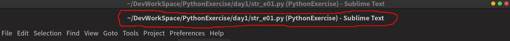
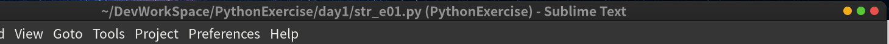

# 编辑器笔记

介绍常用的编辑器用法

---
## 目录
* [编辑器笔记](#编辑器笔记)
  * [目录](#目录)
  * [SublimeText](#sublimetext)
    * [Sublime 常用插件](#sublime-常用插件)
      * [LSP相关](#lsp相关)
    * [Sublime 相关连接](#sublime-相关连接)
  * [VSCode](#vscode)
    * [常用插件](#常用插件)
      * [本地化插件](#本地化插件)
      * [Syncing（VSCode 同步配置插件）](#syncingvscode-同步配置插件)
      * [Bookmarks](#bookmarks)
      * [Better Comments](#better-comments)
      * [Mintlify Doc Writer](#editors_vscode_extensions_mintlify_doc_writer)
      * [Snippets Ranger](#snippets-ranger)
      * [Git 相关插件](#git-相关插件)
        * [GitLens](#gitlens)
        * [Git History](#git-history)
        * [Git Graph](#git-graph)
      * [主题和文件图标](#主题和文件图标)
        * [Gruvbox](#gruvbox)
        * [Obsidian Dark](#obsidian-dark)
        * [Rainglow](#rainglow)
        * [图标](#图标)
      * [模拟 vim 插件](#模拟-vim-插件)
          * [vim 插件的问题](#vim-插件的问题)
      * [Path Intellisense](#path-intellisense)
      * [Project Manager](#project-manager)
      * [Indent Rainbow](#indent-rainbow)
      * [SVG 插件](#svg-插件)
      * [Markdown插件](#markdown插件)
        * [markdown-all-in-one](#markdown-all-in-one)
        * [Markdown Preview Enhanced](#markdown-preview-enhanced)
      * [笔记插件](#笔记插件)
        * [Foam](#foam)
      * [Python](#python)
      * [VSCode 配置 C、C++ 开发环境](#vscode-配置-cc-开发环境)
      * [前端插件](#前端插件)
        * [LiveServer](#liveserver)
        * [Vetur](#vetur)
    * [相关连接](#相关连接)
  * [Vim](#vim)

---
## <span id="editors_sublime">SublimeText</span>

[Sublime 4](https://www.sublimetext.com/blog/articles/sublime-text-4) 是 SublimeText 最新版本。

### <span id="editors_sublime_dir">目录结构</span>

Sublime 所有设置都存在在 `~/.config/sublime-text/Packages/User/` 目录下。

Sublime 全局设置：`~/.config/sublime-text/Packages/User/Preferences.sublime-settings`

Pakage Control 设置： `.config/sublime-text/Packages/User/Package\ Control.sublime-settings`

其他插件设置都放在： `.config/sublime-text/Packages/`

> [!tip] 关于插件安装位置
> 
> `.config/sublime-text/Packages/` 这个目录中的插件是解压后的的插件。
> 
> `.config/sublime-text/Installed Packages/` 这个目录中的插件，都是以插件包（后缀名都为 `sublime-package`）。如果手动把插件包放在这个目录，Sublime 会自动将包解压放到 `.config/sublime-text/Packages/` 中，重启 Sublime 后就能用了。
> 
> 当然部分插件可能会出问题，如 [本地化语言包](https://packagecontrol.io/packages/ChineseLocalizations)，虽然能加载成功，但布局上存在 bug。
> 

^34a72b

缓存：`.cache/sublime-text/`

### <span id="editors_sublime_cli">CLI</span>

SublimeText 是包含一个命令行工具 `subl`，用于处理命令行中的文件。

Linux 版中的可执行程序，是可以当成**cli**（Command Line Interface）方式来执行的。只要做个链接就行了：

`sudo ln -s /opt/sublime_text/sublime_text /usr/local/bin/subl`

> [!info]
>
> 也可以在当前用户中建立链接：
> `sudo ln -s /opt/sublime_text/sublime_text ~/.local/bin/subl`
> 

更详细的请参考：[Command Line Interface](https://www.sublimetext.com/docs/command_line.html)
> [!tip] 中方版
> [命令行 - Sublime 官方文档](https://sublime-text-document.readthedocs.io/zh/latest/command_line/)

### <span id="editors_sublime_settings">设置</span>

SublimeText 基本设置：

```json
"font_face":"MesloLGS Nerd Font Regular",
"font_size":20,
"hightlight_lien":true,
"highlight_modified_tabs":true,
"show_encoding": true,
"relative_line_numbers":true,
"caret_style": "blink",
"bold_folder_labels":true,
"indent_guide_options": ["draw_active"],
"vintage_start_in_command_mode": true,

// 关闭多出的标题栏
"gtk_client_side_window_decorations": false,
```
> 基本设置大概就是 字体、当前行高亮、缩进线、行号等 

> `"ignored_packages": ["Vintage"]` 将 `"Vintage"` 删除，就能开启 `vim` 功能。

---

### <span id="editors_sublime_plugins">Sublime 常用插件</span>

在想知道有哪些插件，有两种方式查询：
1. 通过 [packagecontrol.io](https://packagecontrol.io) 这个网站中查询。
> 本来这网站是有个中国镜像：[packagecontrol.cn](http://packagecontrol.cn) ，不过好像已经挂了。
2. 通过在 SublimeText 中，使用 `Ctrl+Shift+P`，呼出命令面板，敲入 `pacakge`，就能列出插件相关的命令。
> [!tip]
> 安装插件时，如果全新 sublime，得先装 `Package Control` 这个插件，这是安装其他插件的基础。
> 安装 `Package Control` 插件可以通过 `Ctrl+Shift+P` 命令面板中安装，与可以下载 [Package Control  包](https://packagecontrol.io/Package%20Control.sublime-package) ，放到 `~/.config/sublime-text/Installed\ Packages` 目录下。
> 
> 命令很简单，不做过多介绍了，不非就是 `install` 安装插件，`upgrade` 升级插件，`remove` 卸载插件，`list` 列出插件。  

插件库地址，还能自定义。
> 插件库默认地址：https://packagecontrol.io/channel_v3.json

通过编辑 `Package Control.sublime-settings` 文件，就能自定义插件库地址：

```json
"channels": [
    "https://packagecontrol.io/channel_v3.json",
    // "https://raw.githubusercontent.com/silascript/sublime_channel/master/channel_v3.json"

],
```

---

#### <span id="editors_sublime_plugins_syncing">同步</span>

##### <span id="editors_sublime_plugins_syncing_syncingsettings">Syncing Settings</span>

[Syncing Settings](https://packagecontrol.io/packages/Sync%20Settings) [](https://github.com/mfuentesg/SyncSettings) 是一个同步 Sublime 设置数据的小插件。它是通过 [Gist]() 来同步设置数据的！非常遗憾，这个插件已经停止维护了，不过还是可以用的。

设置非常简单，只用设置 Gist 的 ID 及 Token 就可以同步设置数据了：

```json
"gist_id":"",
"access_token":""	
```

---

#### <span id="editors_sublime_plugins_beautify">美化</span>

##### <span id="editors_sublime_plugins_beautify_afileicon">A File Icon</span>

[A File Icon](https://packagecontrol.io/packages/A%20File%20Icon) [](https://github.com/SublimeText/AFileIcon) 是一个添加文件类型图标的小插件。


##### <span id="editors_sublime_plugins_beautify_fileicons">FileIcons</span>

[FileIcons](https://packagecontrol.io/packages/FileIcons) [](https://github.com/braver/FileIcons/) 是 [A File Icon](#editors_sublime_plugins_beautify_afileicon) 的简化版。


##### <span id="editors_sublime_plugins_beautify_theme">Theme</span>

###### <span id="editors_sublime_plugins_beautify_theme_gruvbox">Gruvbox</span>

[Gruvbox](https://packagecontrol.io/packages/gruvbox) [](https://github.com/morhetz/gruvbox) 是一个带有护眼配色的 Theme。这货之前是来自 [Vim](../vim/Vim_Note.md) 或 Emac 的。


这个 Theme 特点：

* 好看，而且耐看，而且因为主色调是暗黄色，所以看起来对眼睛很友好
* 能调整 Tab、Statusbar 和 Sidebar 的字体大小

部分配置：

```json
// sidebar
"gruvbox_sidebar_font_size_10": true,  //  v  10
                                         //  |  11 (Default)
"gruvbox_sidebar_font_size_12": true,  //  |  12
"gruvbox_sidebar_font_size_13": true,  //  |  13
"gruvbox_sidebar_font_size_14": true,  //  |  14
"gruvbox_sidebar_font_size_15": true,  //  |  15
"gruvbox_sidebar_font_size_16": true,  //  v  16

// statusbar

"gruvbox_statusbar_xxs": true,  //  v  20
"gruvbox_statusbar_xs": true,   //  |  25
"gruvbox_statusbar_s": true,    //  |  30
                                  //  |  35 (Default)
"gruvbox_statusbar_l": true,    //  |  40
"gruvbox_statusbar_xl": true,   //  |  45
"gruvbox_statusbar_xxl": true,  //  v  50

"gruvbox_statusbar_font_size_10": true,  //  v  10
                                           //  |  11 (Default)
"gruvbox_statusbar_font_size_12": true,  //  |  12
"gruvbox_statusbar_font_size_13": true,  //  |  13
"gruvbox_statusbar_font_size_14": true,  //  |  14
"gruvbox_statusbar_font_size_15": true,  //  |  15
"gruvbox_statusbar_font_size_16": true,  //  v  16


// Tab 
"gruvbox_tabs_xxs": true,  //  v  33
"gruvbox_tabs_xs": true,   //  |  39
"gruvbox_tabs_s": true,    //  |  45
                             //  |  51 (Default)
"gruvbox_tabs_l": true,    //  |  57
"gruvbox_tabs_xl": true,   //  |  63
"gruvbox_tabs_xxl": true,  //  v  69

"gruvbox_tabs_font_size_7": true,   //  v  7
"gruvbox_tabs_font_size_8": true,   //  |  8
"gruvbox_tabs_font_size_9": true,   //  |  9
"gruvbox_tabs_font_size_10": true,  //  |  10
                                      //  |  11 (Default)
"gruvbox_tabs_font_size_12": true,  //  |  12
"gruvbox_tabs_font_size_13": true,  //  |  13
"gruvbox_tabs_font_size_14": true,  //  |  14
"gruvbox_tabs_font_size_15": true,  //  v  15


```

###### <span id="editors_sublime_plugins_beautify_theme_gruvboxmaterial">Gruvbox Material Theme</span>

[Gruvbox Material Theme](https://packagecontrol.io/packages/Gruvbox%20Material%20Theme) [](https://github.com/karimlevallois/gruvbox-material-sublime-text) 是 [Gruvbox](#editors_sublime_plugins_beautify_theme_gruvbox) 的修改版。据说更护眼。但这货已经 2 年没更新了 -- 当然 [Gruvbox](#editors_sublime_plugins_beautify_theme_gruvbox) 已经 4 年没更新了，哈哈！而且这货直到现在都只有「Dark」版，「Light」版本一直没出现。估计这货离弃不远了！


###### <span id="editors_sublime_plugins_beautify_theme_one">One</span>

[Theme - One](https://packagecontrol.io/packages/Theme%20-%20One)  [](https://github.com/AmjadHD/sublime_one_theme) 这算是比较新的 Theme 了 -- 毕竟介绍里写着支持 Sublime 4，可见其新鲜程度。


但这个主题的部分 Icon 与 [A File Icon](#A%20File%20Icon) 插件冲突。

###### <span id="editors_sublime_plugins_beautify_theme_guna">Guna</span>

[Guna](https://packagecontrol.io/packages/Guna) [](https://github.com/poucotm/Guna) 这是一个极富创新性的 Theme。


---

#### <span id="editors_sublime_plugins_frontend">前端相关</span> 

##### Emmet2

 #emmet

[Emmet 2](https://packagecontrol.io/packages/Emmet)  [](https://github.com/emmetio/sublime-text-plugin) 这应该是必装的。当然这是新版的 [Emmet](../Frontend/Css_Note.md#emmet) 插件（[老版Emmet插件](https://github.com/sergeche/emmet-sublime) 已经不维护了），所以叫「Emmet 2」。

装完，如果有需要可以改下快捷键：

```json
"keys": ["ctrl+e"],
"command": "emmet_expand_abbreviation"
```

> [!tip] emmet 快捷键
> 
> 如果不改快捷键，默认使用 `Tab` 或 `Enter` 来「展开」代码。

---

#### <span id="editors_sublime_plugins_sidebar">侧边栏</span>

##### <span id="editors_sublime_plugins_sidebar_enhancements">SideBarEnhancements</span>

[SideBarEnhancements](https://packagecontrol.io/packages/SideBarEnhancements) [](https://github.com/titoBouzout/SideBarEnhancements) 这插件正如名称所描述的一样，是对侧边栏的功能的增强，增加了不少的实用功能。

##### <span id="editors_sublime_plugins_sidebar_sidebartools">SideBarTools</span>

[SideBar Tools](https://packagecontrol.io/packages/SideBarTools) [](https://github.com/braver/SideBarTools) 是 [SideBarEnhancements](#SideBarEnhancements) 的轻量级重构版本。

---

#### <span id="editor_sublime_plugins_formatter">格式化</span>

源码格式化，在安装了 [LSP](#LSP%20相关) 后，很多都自带有格式化器，但有些语言的 LSP 没有带，比如 [Shell](../Linux/Shell_Note.md)，所以就得单独安装。

##### <span id="editor_sublime_plugins_formatter_sh">Shell 格式化</span>

[Sublime-Pretty-Shell](https://github.com/aerobounce/Sublime-Pretty-Shell) 是使用了 [shfmt](../Linux/Shell_Note.md#shfmt) 作为格式化工具的插件。所以本机得先安装 [ shfmt](https://github.com/mvdan/sh)。

###### 设置

Pretty-Shell 这插件没多少设置，基本都是基于 [shfmt](../Linux/Shell_Note.md#shfmt) 本身的设置。

```json
// 是否保存文件时自动格式化
// 个人喜欢手动格式化
format_on_save":false,
// & 或 | 这些操作符后是否另起一行
"binop":true,
// switchcase 是否缩进
"switchcase":true,
// 重定向操作符，> >> << 这些操作符后面加一个空格
"rediop":true,
// 大括号起始那些括号是否另起一行
"fnbrace":true
```

---

#### <span id="editors_sublime_plugins_lsp">LSP 相关</span>

[关于LSP](../vim/LSP_Complete.md#about_lsp)

Sublime 中装的 LSP 插件其实是 LSP 的 **Client**。而 **Server** 得根据需求在 Sublime 外的系统中安装。

如 vue lsp ，你得使用 `npm install -g vue-language-server` 安装 vue-language-server ，sublime 中的 `LSP-vue` 插件才能去调用这个 Server 以实现编程语言的诸如提示、分析等功能。

LSP 常用插件：

##### 通用 LSP

[通用 LSP](https://packagecontrol.io/packages/LSP) [](https://github.com/sublimelsp/LSP/)

这个插件不针对特定语言，属于基本 LSP 插件。其他特定语言 lsp 插件都在这插件之上建立的，所以如果要使用 LSP，这个插件必装。

具体语言的 LSP 得再装特定的 LSP 插件。-- 这个相当于 LSP 通用 Client，但有些语言得用特定 Client 才能调 LSP，所以这些语言对再装定的语言 LSP 插件。具体使用还得参考 [LSP配置说明](https://lsp.sublimetext.io/language_servers)。

###### 本地 Server

sublime 的 LSP 的本地 Server 是装在 `~/.cache/sublime-text/Package Storage` 下。

###### 内置提示与 LSP 重复

在使用各语言的 LSP 时，有可能会出现代码提示出现重复，可以针对特定语言进行以下设置：

```json
"disable_default_completions": true
```
> [!info] 特定语言设置
> 
> 这设置其实就是将某语言内置的代码提示禁止，只使用此语言的 LSP 做为代码提示唯一「补充源」。
> 
> 设置特定语言，在一个此语言页面中点选「Preferences」->「Settings - Syntax Specific」弹出的设置窗口中设置。

##### 文件监视器

[LSP-file-watcher-chokidar](https://github.com/sublimelsp/LSP-file-watcher-chokidar) 这个插件，能配合 [LSP](#LSP%20相关) 使用， 监视文件变化。

##### 常用 LSP 插件列表

这个 LSP 子插件有一部都自带了 LSP 实现的，所以装完这些插件，在启用这些插件时，就会在 Sublime Text 的缓存目录： `~/.cache/sublime-text/Package Storage/` 中安装相应的 [本地Server](#本地Server)。

* [LSP-json](https://github.com/sublimelsp/LSP-json) 这个插件是必装的，因为 Sublime 本身的配置文件就是 json。但这货找不到 [Node](../Node/NodeJS_Note.md)（非常诡异，在终端下启动 Sublime，就能找到正确的「PATH」,直接通过桌面启动 Sublime 就找不到。），会提示安装一个插件：[lsp_utils](https://github.com/sublimelsp/lsp_utils)，它带了个便携式的 node-- 其实就算找到外部 node，`lsp_utils` 这个依赖插件也会自动在启用 LSP-json 插件时安装的，可以打开 `View`>`Show Console` 控制台观察：

```shell
Package Control: Installing 15 missing dependencies
Package Control: Installed missing dependency wcmatch
Package Control: Installed missing dependency python-markdown
Package Control: Installed missing dependency markupsafe
Package Control: Installed missing dependency ptyprocess
Package Control: Installed missing dependency python-jinja2
Package Control: Installed missing dependency mdpopups
Package Control: Installed missing dependency wcwidth
Package Control: Installed missing dependency pyte
```

装完这些依赖，Sublime Text 会弹出窗口提示重启 Sublime Text ，重启后，菜单栏中 Tools（「工具」）菜单中「LSP」的功能就会「亮」了，能使用了。

> [!tip] PATH
> 
> 在 `View` > `Show Console`，在输入框中输入：`import os; os.environ["PATH"]`，就能看到当前 Sublime 能获取到的「PATH」值是什么了。
>
> 原因：在终端中启用 Sublime Text，Sublime Text 使用的是 `.profile` 配置文件，而通过桌面图标（DeskTop）启动 Sublime Text，这时 Sublime Text 是使用 `xprofile` 配置。这是合理但也有点奇葩的。[关于xprofile](../Linux/ArchLinux_Note.md#^eba7ef)
> 
> 解决方案：将 `.profile` 更名为 `xprofile`，其他原来引用到 `.profile` 配置文件的 shell 配置，如 `.zshrc`、`.bashrc`，都更改引用 `.xprofile`，反正使用到 Sublime Text 的 Linux 操作系统都是用了图形界面的，所以使用 `xprofile` 也是非常合情合理的，而 `.xprofile` 也是能给文本模式的终端使用的。
> 
> 
>  ^3026e5
* [LSP-html](https://github.com/sublimelsp/LSP-html)
* [LSP-CSS](https://github.com/sublimelsp/LSP-css)
* [LSP-eslint](https://github.com/sublimelsp/LSP-eslint)
* [LSP-typescript](https://github.com/sublimelsp/LSP-typescript)
* [LSP-rust-analyzer](https://github.com/sublimelsp/LSP-rust-analyzer) ^66e1d9
* [LSP-lemminx: XML support for Sublime's LSP plugin](https://github.com/sublimelsp/LSP-lemminx)
* [LSP-bash](https://github.com/sublimelsp/LSP-bash)
* [LSP-jdtls](https://github.com/sublimelsp/LSP-jdtls)
* [LSP-intelephense](https://github.com/sublimelsp/LSP-intelephense)
* [LSP-vue](https://github.com/sublimelsp/LSP-vue)
* [LSP-volar](https://github.com/sublimelsp/LSP-volar)

##### 部分 LSP 插件介绍

###### Python 相关

Sublime LSP 与 Python 相关的有以下三个插件：

1. [LSP-pylsp](https://github.com/sublimelsp/LSP-pylsp)

 配置：

```json
"settings": {
	"pylsp.plugins.ruff.enabled":true,
	"pylsp.plugins.pycodestyle.enabled":false,
	"pylsp.plugins.pylsp_black.enabled":true,
},
```

> [!info] pylsp 与 [pyright](../vim/LSP_Complete.md#pyright) 配合使用
> 
> 相关说明：[running alongside lsp-pyright](https://github.com/sublimelsp/LSP-pylsp#running-alongside-lsp-pyright)

> [!info] pylsp 与 [ruff](../vim/LSP_Complete.md#ruff) 配合使用
> 
> pylsp 也能与 ruff 配合使用。其实就是把 ruff 当成 pylsp 的 linter，当下 ruff 的功能也是只能当 linter 使用。
> 就一句设置：`pylsp.plugins.ruff.enabled`，即启用 ruff-- 默认 pylsp 使用的是 linter 是 `pycondestyle`。
> 
> 相关说明：[linters](https://github.com/sublimelsp/LSP-pylsp#linters)

> [!info] pylsp 格式化
> pylsp 默认格式化使用的是 `autopep8`，可以使用 `"pylsp.plugins.yapf.enabled"` 或 `"pylsp.plugins.pylsp_black.enabled"`，使用不同的格式策略。
> 相关说明：[formatters](https://github.com/sublimelsp/LSP-pylsp#formatters)

2. [LSP-pyright](https://github.com/sublimelsp/LSP-pyright)  

lsp-pyright 配置：

```json
"settings": {
	"python.analysis.diagnosticSeverityOverrides": {
	"reportDuplicateImport": "none",
	"reportImplicitStringConcatenation": "none",
	"reportMissingParameterType": "none",
	"reportUnboundVariable": "none",
	"reportUninitializedInstanceVariable": "none",
	"reportUnusedClass": "none",
	"reportUnusedFunction": "none",
	"reportUnusedImport": "none",
	"reportUnusedVariable": "none",
}
```

3. [LSP-ruff](https://github.com/sublimelsp/LSP-ruff)

 LSP-ruff 使用到 [ruff-lsp](https://github.com/astral-sh/ruff-lsp)，所以先装 ruff-lsp。

```shell
pip install ruff-lsp
```

> [!tip] 
> 
> 可以使用 pipx 安装，这样不会「污染」pip。而如果是在 [conda](../Python/Python_Note.md#python_conda) 中使用 [pipx](../Python/Python_Note.md#python_pipx) 安装，那就更好了，因为在 conda 中的 pipx 是能够在各虚拟环境中共享的，因为无论你在 conda 中哪个虚拟环境中使用 pipx 安装程序，它们都会在 `.local/bin` 目录建立「软链接」！

###### LSP-CSS

[LSP-CSS](https://github.com/sublimelsp/LSP-css) 配置：

打开一个 CSS 文件，然后打开 `Settings - Syntax Specific` 设置，在右边窗口添加以下代码：

```json
{
	// 禁止Sublime内置CSS补全功能
	"disable_default_completions": true
}
```

> [!info]
> 
> 这句代码，同样适用于其他语言（比如 html），只要出现 LSP 补全与 Sublime 内置补全的情况出现，就可以先打开相关文件，然后在 `Syntax Specific` 设置里禁掉这个语言的内置补全。
>

##### LSP-bash

[LSP-bash](https://packagecontrol.io/packages/LSP-bash) [](https://github.com/sublimelsp/LSP-bash) 是写 bash shell 很好的 lsp。这插件使用到 [bash-language-server](https://github.com/bash-lsp/bash-language-server)，所以得安装下：`npm i -g bash-language-server`。

##### Markdown

###### markmark

Sublime 要使用 markmark 这个 LSP，是没有对应的特定 LSClient，而是使用 [通用LSP](#通用LSP) 这个插件与 [markmark](https://github.com/nikku/markmark) 这个 LSP 来实现。 #lsp 

安装 markmark：

```shell
npm install -g markmark
```

###### LSP-marksman

 #lsp #marksman

[LSP-marksman](https://github.com/sublimelsp/LSP-marksman)  [](https://github.com/sublimelsp/LSP-marksman) 这插件不用自己配置 Client 了。

---

### <span id="editors_sublime_plugins_terminal">终端插件</span>

#### Terminus

[Terminus](https://packagecontrol.io/packages/Terminus) [](https://github.com/randy3k/Terminus) 是一个终端插件。这个终端插件，是在编辑区开启一个终端视图。非常方便使用终端进行代码运行测试。而有一些 lsp 插件提供的运行代码功能，也是依赖此插件，如 [lsp-rust-analyzer](#^66e1d9)。

这插件还有内置一堆的 Theme，真是很细腻啊！

配置示例：

```json
{
	"256color": true,
	"theme": "ayu-mirage"
}
```

> [!tip]
> 
> 如果要使用那些 Theme，最好把 256 色开启，不然有可能有部分 Theme 中的一些字符因为颜色显示出问题。

#### Terminal

[Terminal](https://packagecontrol.io/packages/Terminal)  [](https://github.com/SublimeText/Terminal) 这也是一个终端插件，与 [Terminus](#Terminus) 不同的是，另开一个窗口调出当前操作系统默认终端。可以说这两个终端插件各有千秋。

---

### <span id="editors_sublime_plugins_docs">文档相关插件</span>

#### DoxyDoxygen

[DoxyDoxygen](https://github.com/20Tauri/DoxyDoxygen) 是一个自动生成文档注释的插件，它支持大部分主流编程语言。

---

### <span id="editors_sublime_plugins_vim">vim 相关插件</span>

虽然 Sublime 原生有 vim 功能，但与原生的 vim 相比，还是弱了点，所以得上点插件增强 vim 功能。

#### NeoVintageous

[NeoVintageous](https://github.com/NeoVintageous/NeoVintageous) 模拟了 vim 大部分功能，比 sublime 原生的 vim 功能更强。

所以在对 sublime 配置时，可以将 sublime 原生 vim 及以前那些 vim 增强插件屏蔽掉，因为这完全可以使用这个插件替代了 ([VintageES](https://packagecontrol.io/packages/VintageES) 这个算是比较出名的 vi 插件，也在其介绍中也推荐了 NeoVintageous)：

```json
"ignored_packages": [
	"Six",
	"Vintage",
	"Vintageous",
],
```

> [!info]
> `Vintage` 这个是 Sublime 原生的模拟 vi 功能模块。
> 
> [Six](https://github.com/guillermooo/Six) [](https://github.com/guillermooo/Six)（Six 是 Vintageous 的继承者）。
> 
> [Vintageous](https://packagecontrol.io/packages/Vintageous) 是之前非常常用的 vi 增强插件。 

**NeoVintageous** 这插件最牛的还在于，它模拟了不少 vim 经典插件，如 [Surround](../vim/vim_plugin.md#Surround)、sneak、Highlighted Yank 等，这有点像 [VSCode](VSCode_Note.md) 的内置 vim 功能的设计了！

---

### <span id="editors_sublime_errors">Sublime 问题解决</span>

在 [Linux](../Linux/Linux_Note.md) 下，默认 Sublime 会显示多一行「标题栏」，如下：


如想隐藏掉这多出的一栏，得在配置中加上如下代码：
```json
"gtk_client_side_window_decorations": false
```

重启 Sublime。效果如下：


> [!info] 此问题相关链接
> 
> * [sublimetext - Sublime Text 4 隐藏标题栏 - IT工具网](https://www.coder.work/article/7752096)

---

### <span id="editors_sublime_links">Sublime 相关连接</span>

* [Crack](https://gist.github.com/maboloshi/feaa63c35f4c2baab24c9aaf9b3f4e47)
* [Creack Gist](https://gist.github.com/maboloshi/feaa63c35f4c2baab24c9aaf9b3f4e47?permalink_comment_id=4675177)

---

## <span id="editors_vscode">VSCode</span>

VSCode 主要有几个版本：

[VSCode](https://code.visualstudio.com) 微软官方版本。

[VSCodium](https://vscodium.com) 社区驱动的完全开源版本，其扩展源使用的是 [Open-VSX](https://www.gitpod.io/blog/open-vsx/)。

> Open-VSX 与 VSCode Market 区别是，VSCode Market 有部分扩展是专有的，而 Open-VSX 则是完全开源的。

### <span id="editors_vscode_notes">VSCode 相关笔记</span>

* [VSCode 笔记](VSCode_Note.md)
* [VSCode 插件笔记](VSCode_Extensions_Note.md)

---

### <span id="editors_about_links">相关连接</span>

---

## <span id="editors_vim">Vim</span>

神级编辑器！

具体介绍和使用请参数以下笔记：

* [Vim常用操作](../vim/vim常用操作.md)
* [neovim配置](../vim/vim及neovim配置.md)
* [Neovim_Note](../vim/Neovim_Note.md)
* [Vim Plugin](../vim/vim_plugin.md)
* [Vimscript 笔记](../vim/Vimscript_Note.md)
* [LSP_Complete](../vim/LSP_Complete.md)

---

## <span id="editors_scite">SciTE</span>

[SciTE](https://scintilla.org/) 是一个简单而强大的文本编辑器。这款编辑器，原来只是用来作为 [Scintilla](https://www.scintilla.org/) 示例软件用的。所以这编辑器只能算个「半成品」。界面古老，配置麻烦 -- 相对于 [SublimeText](#SublimeText)、[Vim](#Vim) 或 [VSCode](#VSCode) 等而言。
> [!info]
> 像配置配色，它甚至没有给出具有语义性的配置项。
>
> 如下面：
> ```properties
> style.*.32 # 背景或前景色
> style.*.34 # 括号匹配
> style.*.35 # 括号不匹配
> ```
> 竟然用数字来区别各模块的样式，窥一斑而见全豹，可见这编辑器之简陋。

### 配置

示例：
```properties
code.page=65001
output.code.page=65001


# 字体设置
#font.base=font:cascadia mono pl,size:20
#font.small=font:cascadia mono pl,size:18
#font.comment=font:cascadia mono pl,size:16

font.base=font:Meslo LG S,size:20
font.small=font:Meslo LG S,size:18
font.comment=font:Meslo LG S,size:16


# font.monospace=font:Meslo LG S,size:20
# font.monospace=font:cascadia mono pl,size:20
# font.monospace=font:DejaVu Sans Code Book,size:18

font.code.comment.box=$(font.comment)
font.code.comment.line=$(font.comment)
font.code.comment.doc=$(font.comment)
font.code.comment.nested=$(font.comment)

# font.text=font:Meslo LG S Regular,size:18

# 关闭时，提示保存
are.you.sure=1

# minimize.to.tray=1

# 显示工具栏
toolbar.visible=1
# 工具栏图标
toolbar.usestockicons=1

line.margin.visible=1
# 行号列宽度
line.margin.width=3+
# 显示状态栏
statusbar.visible=1

# 标题栏显示信息
# 0:文件名 1:全路径 2:文件名和目录名
title.full.path=2

# tab宽度
tabsize=4
# 缩进宽度
indent.size=4

# 缩进线
view.indentation.guides=1
# 高亮缩进线
highlight.indentation.guides=1

# 括号检查
braces.check=1
braces.sloppy=1

# 高亮
# 当前单词高亮
highlight.current.word=1
highlight.current.word.indicator=style:compositionthin,colour:#fe8019

# 光标
caret.width=2
# 光标所在行背景色
caret.line.back=#d4d8df


# 自动补全
autocompleteword.automatic=1


# 配色
#black=#ebeef3

style.*.32=$(font.base),fore:#353e46
style.*.32=$(font.base),back:#ebeef3

# 括号匹配
style.*.34=fore:#6eb87b,bold,back:#ebeef3
# 括号不匹配
style.*.35=italics,back:#ebeef3
```

---

## <span id="editors_notepad3">NotePad3</span>

[NotePad3](https://www.rizonesoft.com/downloads/notepad3/) [](https://github.com/rizonesoft/Notepad3) 是在 [Notepad2](https://www.flos-freeware.ch/notepad2.html) 基础上进行升级开发的 Windows「独占」的轻量级文本编辑器。它可以认为是 [NotePad2-mod](https://xhmikosr.github.io/notepad2-mod/) [](https://github.com/XhmikosR/notepad2-mod) 的分支（NotePad2-mod 在 2018 年后就停更了）。它跟 NotePad2 一样基于 [Scintilla](#SciTE) 开发的。

> [!tip] 相关
> 
> 跟 NotePad3 类似的 NotePad2 的「借尸还魂」作品还有 [zufuliu版本的Notepad2](https://github.com/zufuliu/notepad2)。

---

## <span id="editors_geany">Geany</span>

[Geany](https://www.geany.org/) 是一个挺强大的文本编辑器，可以视它为一个轻量级「IDE」。

### Geany 插件

Geany 支持很多插件：[https://plugins.geany.org/](https://plugins.geany.org/)

---

## 相关笔记

* [VSCode笔记](VSCode_Note.md)
* [Vim笔记](../vim/Vim_Note.md)

