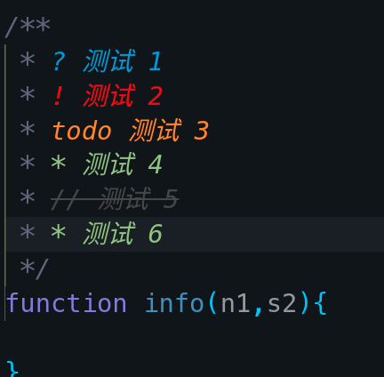
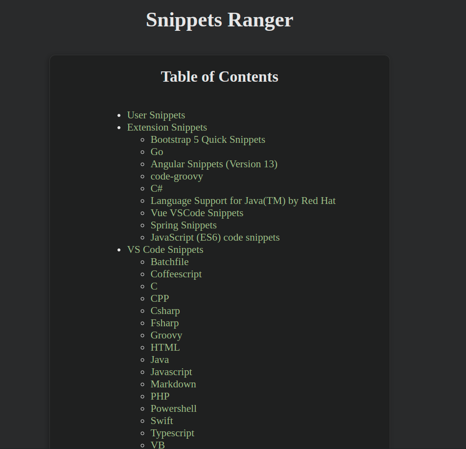
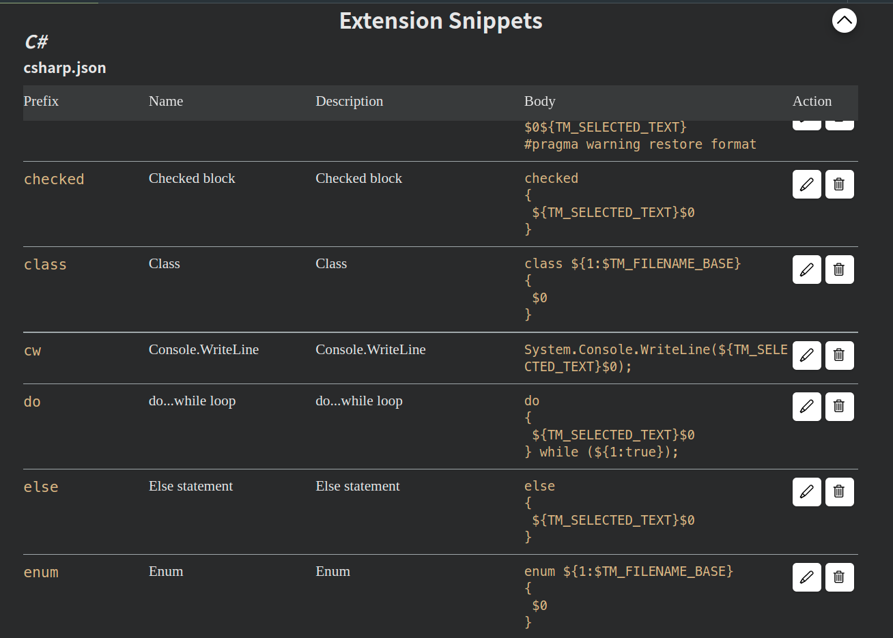

---
aliases:
  - 
tags:
  - editor
  - sublime
  - vscode
  - vim
  - scite
  - lsp
created: 2023-01-30 11:19:11
modified: 2023-07-6 9:03:28
---

# 编辑器笔记

介绍常用的编辑器用法

---
## 目录
* [编辑器笔记](#编辑器笔记)
  * [目录](#目录)
  * [SublimeText](#sublimetext)
    * [Sublime 常用插件](#sublime-常用插件)
      * [LSP相关](#lsp相关)
    * [Sublime 相关连接](#sublime-相关连接)
  * [VSCode](#vscode)
    * [VSCode 目录结构](#vscode-目录结构)
    * [常用插件](#常用插件)
      * [本地化插件](#本地化插件)
      * [Syncing（VSCode 同步配置插件）](#syncingvscode-同步配置插件)
      * [Bookmarks](#bookmarks)
      * [Better Comments](#better-comments)
      * [Mintlify Doc Writer](#editors_vscode_extensions_mintlify_doc_writer)
      * [Snippets Ranger](#snippets-ranger)
      * [Git 相关插件](#git-相关插件)
        * [GitLens](#gitlens)
        * [Git History](#git-history)
        * [Git Graph](#git-graph)
      * [主题和文件图标](#主题和文件图标)
        * [Gruvbox](#gruvbox)
        * [Obsidian Dark](#obsidian-dark)
        * [Rainglow](#rainglow)
        * [图标](#图标)
      * [模拟 vim 插件](#模拟-vim-插件)
          * [vim 插件的问题](#vim-插件的问题)
      * [Path Intellisense](#path-intellisense)
      * [Project Manager](#project-manager)
      * [Indent Rainbow](#indent-rainbow)
      * [SVG 插件](#svg-插件)
      * [Markdown插件](#markdown插件)
        * [markdown-all-in-one](#markdown-all-in-one)
        * [Markdown Preview Enhanced](#markdown-preview-enhanced)
      * [笔记插件](#笔记插件)
        * [Foam](#foam)
      * [Python](#python)
      * [VSCode 配置 C、C++ 开发环境](#vscode-配置-cc-开发环境)
      * [前端插件](#前端插件)
        * [LiveServer](#liveserver)
        * [Vetur](#vetur)
    * [相关连接](#相关连接)
  * [Vim](#vim)

---
## <span id="editors_sublime">SublimeText</span>

[Sublime 4](https://www.sublimetext.com/blog/articles/sublime-text-4) 是 SublimeText 最新版本。

SublimeText 基本设置：

```json
"font_face":"MesloLGS Nerd Font Regular",
"font_size":20,
"hightlight_lien":true,
"highlight_modified_tabs":true,
"show_encoding": true,
"relative_line_numbers":true,
"caret_style": "blink",
"bold_folder_labels":true,
"indent_guide_options": ["draw_active"],
"vintage_start_in_command_mode": true,
```
> 基本设置大概就是 字体、当前行高亮、缩进线、行号等 

> `"ignored_packages": ["Vintage"]` 将 `"Vintage"` 删除，就能开启 `vim` 功能。

---

### <span id="editors_sublime_plugins">Sublime 常用插件</span>

在想知道有哪些插件，有两种方式查询：
1. 通过 [packagecontrol.io](https://packagecontrol.io) 这个网站中查询。
> 本来这网站是有个中国镜像：[packagecontrol.cn](http://packagecontrol.cn) ，不过好像已经挂了。
2. 通过在 SublimeText 中，使用 `Ctrl+Shift+P`，呼出命令面板，敲入 `pacakge`，就能列出插件相关的命令。
> 命令很简单，不做过多介绍了，不非就是 `install` 安装插件，`upgrade` 升级插件，`remove` 卸载插件，`list` 列出插件。  

插件库地址，还能自定义。
> 插件库默认地址：https://packagecontrol.io/channel_v3.json

通过编辑 `Package Control.sublime-settings` 文件，就能自定义插件库地址：
```json
"channels": [
    "https://packagecontrol.io/channel_v3.json",
    // "https://raw.githubusercontent.com/silascript/sublime_channel/master/channel_v3.json"

],
```

---

#### <span id="editors_sublime_plugins_lsp">LSP 相关</span>

[关于LSP](../vim/LSP_Complete.md#about_lsp)

Sublime 中装的 LSP 插件其实是 LSP 的 **Client**。而 **Server** 得根据需求在 Sublime 外的系统中安装。

如 vue lsp ，你得使用 `npm install -g vue-language-server` 安装 vue-language-server ，sublime 中的 `LSP-vue` 插件才能去调用这个 Server 以实现编程语言的诸如提示、分析等功能。

LSP 常用插件：

[通用 LSP](https://packagecontrol.io/packages/LSP)

这个插件不针对特定语言，属于基本 LSP 插件。其他特定语言 lsp 插件都在这插件之上建立的，所以如果要使用 LSP，这个插件必装。

具体语言的 LSP 得再装特定的 LSP 插件。-- 这个相当于 LSP 通用 Client，但有些语言得用特定 Client 才能调 LSP，所以这些语言对再装定的语言 LSP 插件。具体使用还得参考 [LSP配置说明](https://lsp.sublimetext.io/language_servers)。

---

### <span id="editors_sublime_links">Sublime 相关连接</span>

* [Crack](https://gist.github.com/maboloshi/feaa63c35f4c2baab24c9aaf9b3f4e47)

---

## <span id="editors_vscode">VSCode</span>

VSCode 主要有几个版本：

[VSCode](https://code.visualstudio.com) 微软官方版本。

[VSCodium](https://vscodium.com) 社区驱动的完全开源版本，其扩展源使用的是 [Open-VSX](https://www.gitpod.io/blog/open-vsx/)。

> Open-VSX 与 VSCode Market 区别是，VSCode Market 有部分扩展是专有的，而 Open-VSX 则是完全开源的。

---

### <span id="editors_vscode_directory">VSCode 目录结构</span>

VSCode：

`~/.config/Code` 设置目录

`~/.vscode` 插件存放目录

VSCodium：

`~/.config/VSCodium` 设置目录

`~/.vscode-oss/vscodium` 插件存放目录

> 如果要重置 VSCode 或 VSCodium，就需要清理这两个目录。
>
> 如果只清 `~/.config/Code` 或 `~/.config/VSCodium` 这个设置目录，启动 VSCode 或 VSCodium ，插件还是存在的。

如果想让插件什么都放在 VSCode 根目录下，所以作以下操作：
1. 从官网下载安装包，解压就能用的那个
2. 解压到想要安装的路径下。
3. 先不要启动 VSCode，在 VSCode 根目录下手动新建 `data` 目录，这个目录是存在用户数据及插件安装目录。如果想临时文件也放在这个目录中，所以在 `data` 目录下再新建一个 `tmp` 目录，用于存放临时文件。
4. 启动 VSCode，这样 VSCode 就会将用户数据、插件等放到 `data` 目录中了，这样文件将 VSCode 作成「便携包」。

---

### <span id="editors_vscode_extensions">常用插件</span>

以下插件都以 [Open-VSX](https://open-vsx.org) 市场的插件为例，微软那个 [Marketplace](https://marketplace.visualstudio.com/vscode) 的一样。

VSCode 或 VSCodium 新版本内置的功能已实现部分插件功能，所以网上部分插件推荐应该已经过时了。

#### <span id="editors_vscode_extensions_local">本地化插件</span>
VSCode 的语言包。

[vscode-language-pack-zh-hans](https://open-vsx.org/extension/MS-CEINTL/vscode-language-pack-zh-hans)

---

#### <span id="editors_vscode_extensions_syncing">Syncing（VSCode 同步配置插件）</span> 

[Syncing](https://open-vsx.org/extension/nonoroazoro/syncing) [](https://github.com/nonoroazoro/vscode-syncing
) 这是一个款同步 VSCode 配置的插件。

这个插件是使用到 [Gist](https://gist.github.com) 来存放 VSCode 的配置文件。

使用这个插件，得先新建一个 gist 和 一个 token。

* 新建一个 gist
> [gist 具体操作](../Git/Git_Note.md#git_github_gist)

* 生成 token
生成一个 token，在生成 token 时，勾选 **scopes** 为 **gist**，如果不想麻烦，就把 token 的生命周期为 **No Expiration**。（[token 具体操作](../Git/Git_Note.md#git_github_token)）

* syncing 设置

`ctrl+shift+p` 唤出 Syncing 配置文件：
```json
{
    "id": "", 
    "token": "", 
    "http_proxy": "",
    "auto_sync": false
}
```
`id` gist 的 id；`token` 刚新建的 token

设置完全 `id` 和 `token`，就能同步配置了。

---

#### <span id="editors_vscode_extensions_bookmarks">Bookmarks</span>

[Bookmarks](https://open-vsx.org/extension/alefragnani/Bookmarks) [](https://github.com/alefragnani/vscode-bookmarks) 是在代码某一行做标记的插件。

Bookmarks 快捷键：
| 快捷键 | 功能 |
| :---: | :---: |
| Ctrl+Alt+K | 创建或消除书签 |
| Ctrl+Alt+J | 跳转到前一个书签|
| Ctrl+Alt+L | 跳转到后一个书签 |

---

#### <span id="editors_vscode_extensions_bettercomments">Better Comments</span>

[Better Comments](https://open-vsx.org/extension/aaron-bond/better-comments) [](https://github.com/aaron-bond/better-comments)

有 6 种增强的注释样式：



---

#### <span id="editors_vscode_extensions_mintlify_doc_writer">Mintlify Doc Writer</span>

[Mintlify Doc Writer](https://marketplace.visualstudio.com/items?itemName=mintlify.document) [](https://github.com/mintlify/writer) 是一个自动生成文档注释的插件。


这插件不能能生成英文文档注释，还能通过设置，生成中文文档注释，真的很香的插件。

---

#### <span id="editors_vscode_extensions_snippetsranger">Snippets Ranger</span>

[Snippets Ranger](https://open-vsx.org/extension/robole/snippets-ranger) [](https://github.com/robole/vscode-snippets-ranger) 这是一个 snippet 管理插件。

这个插件除了新建添加自己的 snippet 这个常规功能外，最最重要的是它能用一种更直观的方式查看当前 vscode/vscodium 中已经存在的哪些 snippet。

而且它将这些 snippet 分了两大类，一类是内置的，另一类是插件提供的，如下图：



点击各项还能查看具体 snippet 有哪些功能：



---

#### <span id="editors_vscode_extensions_git">Git 相关插件</span>

##### <span id="editors_vscode_extensions_git_gitlens">GitLens</span>


[GitLens](https://gitlens.amod.io/) 是 VSCode 重要的 Git 插件，增强了 VSCode 的 Git 的功能 --VSCode 自带的 git 功能非常基础。而这个插件能让 VSCode 显示每一行代码的作者以及提交时间。

##### <span id="editors_vscode_extensions_git_githistory">Git History</span>

[Git History](https://open-vsx.org/extension/donjayamanne/githistory) [](https://github.com/DonJayamanne/gitHistoryVSCode) Git 历史插件。

此插件能查看提交历史。

##### <span id="editors_vscode_extensions_git_gitgraph">Git Graph</span>

[Git-Graph](https://open-vsx.org/extension/mhutchie/git-graph) [](https://github.com/mhutchie/vscode-git-graph.git) Git 提交记录图形化插件。

---

#### <span id="editors_vscode_extensions_theme">主题和文件图标</span>

VSCode 有很多漂亮的 Theme 和 icon，可以根据自己喜好添加。

##### <span id="editors_vscode_extensions_theme_gruvbox">Gruvbox</span>
个人喜欢 Gruvbox 系列的。

[gruvbox-material](https://open-vsx.org/extension/sainnhe/gruvbox-material)  [](https://github.com/sainnhe/gruvbox-material-vscode) 这个 Theme 挺不错的，是融合 Gruvbox 和 Material 风格的主题。


---

##### <span id="editors_vscode_extensions_theme_obsidian">Obsidian Dark</span>

[Obsidian-Dark](https://open-vsx.org/extension/Hamza-Aziane/obsidian-dark) [](https://github.com/Hamza-Aziane/obsidian-dark) 这个主题，个人觉得也挺不错的。


---

##### <span id="editors_vscode_extensions_theme_rainglow">Rainglow</span>

[Rainglow](https://open-vsx.org/extension/daylerees/rainglow) [](https://github.com/rainglow/vscode) 这是一个 theme 集合，包含了 300 多个语法本色和 主题。 喜欢没事换 theme 的人可以用下这个主题包。

如果想修改状态栏样式可以参考以下代码：
```json
"workbench.colorCustomizations": {
    "statusBar.background": "#333",
    "statusBar.foreground": "#fff",
    "statusBar.noFolderBackground": "#333",
    "statusBar.noFolderForeground": "#fff"
}
```

---

##### <span id="editors_vscode_extensions_theme_icon">图标</span>

VSCode 除了能添加主题外，还能添加 Icon，这个图标一般应用在 SideBar 中文件或目录显示，也应用在打开的页面其标签的 title 中，还能应用在文件「面包屑导航」（Breadcrumbs）中。

个人喜欢 [material-icon-theme](https://open-vsx.org/extension/PKief/material-icon-theme) [](https://github.com/PKief/vscode-material-icon-theme) 这个 icon 包。


---

####  <span id="editors_vscode_extensions_vim">模拟 vim 插件</span>

VSCode 中可以通过安装 vim 插件来进行 vim 类似的操作。

模拟 vim 插件有很多，我个人使用的是以下这款 [VSCodeVim](https://open-vsx.org/extension/vscodevim/vim) [](https://github.com/VSCodeVim/Vim) 插件。

vim 插件功能

vim 插件除了「模拟」了 vim 的基本功能外，还「模拟」了部分 vim 常用插件的功能。主要有 [easymotion](https://github.com/easymotion/vim-easymotion)、[surround]() 和 [Sneak](https://github.com/justinmk/vim-sneak) 三个 vim 插件功能。

**easymotion** 与 **sneak** 功能类似，就是可以让使用者在页面「跳来跳去」，就像下图演示的那样，所以其他文本编辑器对于这个功能插件模仿者，除了叫 「\*\*motion」外，就是叫「\*\*jump」。


easymotion 更出名此，就大致说下常用的使用技巧。

默认情况下，easymotion 快揵键都是 \<leader> 起头的，而默认 \<leader> 是 **\\**。而配合 vim 本身的 `j`、`k`、`h``l` 等就能实现行级、行内等方式跳转，这是对原生的 vim 移动的重要补充。

easymotion 常用功能列表：

| 功能  |  快捷键  |
|:---:| :---: |
| 行级向上跳转 | \<leader>\<leader> k |
| 行级向下跳转  | \<leader>\<leader> j |
| 行内向前  | \<leader>\<leader> h |
| 行内向后 | \<leader> \<leader> l |
| 按单词向后跳 | \<leader>\<leader> w |
| 按单词向前跳 | \<leader>\<leader> b|
| 搜索式跳 | \<leader>\<leader> s 输入要搜索的字符|

###### vim 插件的问题

卡顿

在 Widndows 下的 VSCodium 下装了 vim 插件，在使用过程中出现卡顿的情况。

这其实不单是 vim 插件的问题，是 Windows 版本的 VSCodium 的问题，即使不用此插件，在保存文件时，Windows 版本的 VSCodium 也是存在卡顿的现象。

在 Windows 下，VSCode 却没有出现这种情况。同样的，在 Linux 下使用 VSCodium 也没有出现卡顿的情况。

可见在 Windows 下 VSCodium 可以暂时是「废」了，还是用「亲儿子」VSCode 吧。

vim 插件，使用时的卡顿，一般出现在编辑完文件，保存后，「Normal」模式与「Insert」模式切换的时候。估计这是由保存诱发的多原因造成的卡顿。

VSCode/VSCodium 默认开启了 `occurrences Highlight` 这个功能时候，这个功能是光标停在当前单词上，编辑器就会将本页面所有该单词全部高亮。这个功能没什么用，至少不应该做为常用选项开启，即便是不卡的 VSCode 及 Linux 版本的 VSCodium 下，开启此功能，会使页面一直「重绘」，发生「页面」跳动的现象，对于使用体验来讲也不是很好，再说这功能会诱使 Windows 下 VSCodium 原本卡顿的现象更为明显，所以建议最好关闭此功能。

另外，`easymotion` 这个功能也有可能造成 vim 插件卡，所以没办法只能关闭。

还有 [GitLens](#editors_vscode_extensions_git_gitlens) 插件中的 `Current Line` 功能（就是在编辑区行行代码后显示 git 信息），同样可能引发 vim 插件卡顿，所以这也得关闭。

总而言之，只有是编辑区图形重绘功能的插件，都有可能引起 vim 插件卡。

---

#### <span id="editors_vscode_extensions_Path-Intellisense">Path Intellisense</span>

[Path Intellisense](https://open-vsx.org/extension/christian-kohler/path-intellisense) [](https://github.com/ChristianKohler/PathIntellisense) 是个自动识别文件路径的插件。

---

#### <span id="editors_vscode_extensions_projectm">Project Manager</span>

[Project Manager](https://open-vsx.org/extension/alefragnani/project-manager) [](https://github.com/alefragnani/vscode-project-manager) 项目管理插件。

---

#### <span id="editors_vscode_extensions_indentrainbow">Indent Rainbow</span> 

[Indent Rainbow](https://open-vsx.org/extension/oderwat/indent-rainbow) [](https://github.com/oderwat/vscode-indent-rainbow) 彩色缩进线。


`light` 模式，缩进不是默认 `块式`（上图右），而是线的（上图左）。

```json
"indentRainbow.indicatorStyle": "light",
  // we use a simple 1 pixel wide line
  "indentRainbow.lightIndicatorStyleLineWidth": 1,
  // the same colors as above but more visible
  "indentRainbow.colors": [
    "rgba(255,255,64,0.3)",
    "rgba(127,255,127,0.3)",
    "rgba(255,127,255,0.3)",
    "rgba(79,236,236,0.3)"
  ],

```

---

#### <span id="editors_vscode_extensions_svg">SVG 插件</span>

[SVG](https://open-vsx.org/extension/jock/svg) [](https://github.com/lishu/vscode-svg2) 插件，有自动完成 SVG 代码、能预览 SVG 图片、快速取色等功能。

---

#### <span id="editors_vscode_extensions_markdown">Markdown 插件</span>

markdown 插件有很多，而 VSCode、VSCodiume 本身内置了 markdown 基础功能。

所以需要自行安装的插件就基于几种功能：表格辅助、预览等。

以下两个插件就可以满足了 Markdown 大部分功能需求了。

##### <span id="editors_vscode_extensions_markdown-all-in-one">markdown-all-in-one</span>

[Markdown-All-in-One](https://open-vsx.org/extension/yzhang/markdown-all-in-one) [](https://github.com/yzhang-gh/vscode-markdown) 是一个强大的 Markdown 插件。 编写 Markdown 该有的功能都有了！


##### <span id="editors_vscode_extensions_markdown-preview-enhanced">Markdown Preview Enhanced</span>

[Markdown Preview Enhanced](https://open-vsx.org/extension/shd101wyy/markdown-preview-enhanced) [](https://github.com/shd101wyy/vscode-markdown-preview-enhanced) 是一个 Markdown 预览插件。

常用操作：
* `ctrl+k v`：在侧边显示预览
* `ctrl+shift-v`：预览
> 侧边预览的快捷键与 vim 插件冲突

> [!bug] 预览插件存在的问题
> 
> 这个预览插件，对于「锚点」跳转存在一定的问题，主是问题发生在中英混排标题时，特别是存在空格及英文大写字母情况下，问题详解请参考 [关于锚点](../Markdown/Markdown_Note.md#关于锚点)。

---

#### <span id="editors_vscode_extensions_note">笔记插件</span>

##### <span id="editors_vscode_extensions_note_foam">Foam</span>

[Foam](https://open-vsx.org/extension/foam/foam-vscode)[](https://github.com/foambubble/foam) 是一个支持双向链接的笔记插件。

Foam 常用功能及命令

* Foam: Show Graph：打开知识图谱页面


---

#### <span id="editors_vscode_extensions_python">Python</span>

VSCodium 原装只内置了 `Python Language Basics`，这个内置插件只有语法高亮等基础功能。想要更强的功能推荐装 [Python](https://open-vsx.org/extension/ms-python/python) [](https://github.com/Microsoft/vscode-python) 这个插件。

装此插件时，同时装了三个插件：
* [jupyter](https://open-vsx.org/extension/ms-toolsai/jupyter) 
* [jupyter-keymap](https://open-vsx.org/extension/ms-toolsai/jupyter-keymap) 
* [jupyter-renderers](https://open-vsx.org/extension/ms-toolsai/jupyter-renderers)

---

#### <span id="editors_vscode_cpp_devenv">VSCode 配置 C、C++ 开发环境</span>

操作系统得先安装 LLVM、Clang 等工具。

Arch 系：
```shell
sudo pacman -S llvm clang lld lldb libc++
```
> 其他 Linux 系统可使用自已的包管理器安装 **llvm**、**clang**、**lld**、**lldb** 及 **libc++** 程序及组件。

装完那些程序后，检测下是不是安装成功：

* 检测 LLVM
```shell
llvm-dis --version
```
* 检测 lld
```shell
lld --version
```
* 检测 lldb
```shell
lldb --version
```
* 检测 clang
```shell
clang --version
```
* 检测 clang++
```shell
clang++ --version
```
* 检测 clangd
```shell
clangd --version
```

安装 VSCode 相关插件：

* [clangd](https://open-vsx.org/extension/llvm-vs-code-extensions/vscode-clangd) [](https://github.com/clangd/vscode-clangd) 如果要使用 Clang 来作语言服务，这个插件是必装的。

* [code runner](https://open-vsx.org/extension/formulahendry/code-runner) [](https://github.com/formulahendry/vscode-code-runner) 这个是代码运行插件，能跑 C、C++、Java、Python 等众多语言。

---

#### <span id="editors_vscode_extensions_frontend">前端插件</span>

VSCode 最初出来的时候，主要是用在前端开发的，所以 VSCode 积累了大量的前端开发的插件。

而这些前端插件主要是围绕着 Html、CSS、Javascript 及各种前端框架的补全、检测、调试、格式化等功能而设的。

VSCode 已经内置了大名鼎鼎的 [Emmet](https://emmet.io) （[Emmet Wiki](https://zh.wikipedia.org/wiki/Emmet)），有了这货，很多前端插件都可以省了。

---

##### <span id="editors_vscode_extensions_frontend_LiveServer">LiveServer</span> 

[LiveServer](https://open-vsx.org/extension/ritwickdey/LiveServer) [](https://github.com/ritwickdey/vscode-live-server) 是让 VSCode 开启一个静态服务器，用于测试前端页面。


此插件在状态栏显示状态：


---

##### <span id="editors_vscode_extensions_frontend_vetur">Vetur</span>

[Vetur](https://open-vsx.org/extension/octref/vetur) [](https://github.com/vuejs/vetur) 是 Vue 的插件。

这插件包含两个组件：

* [Vue LSP](https://github.com/vuejs/vetur/tree/master/server)
 VSCode 中的 只是 VLS 的 client，要想使用 语言服务，得安装 Vue LSP。
 ```shell
 npm install vls -g
 ```
> Vue LSP 但能在 VSCode 使用，也能让其他编辑器使用，如 vim 等。  
> 关于 [LSP](../vim/LSP_Complete.md#about_lsp)

* vti  Terminal 接口

---

### <span id="editors_about_links">相关连接</span>

---

## <span id="editors_vim">Vim</span>

神级编辑器！

具体介绍和使用请参数以下笔记：

* [Vim常用操作](../vim/vim常用操作.md)
* [neovim配置](../vim/vim及neovim配置.md)
* [neovim相关](../vim/neovim相关.md)
* [Vim Plugin](../vim/vim_plugin.md)
* [Vimscript 笔记](../vim/vimscript_note.md)
* [LSP_Complete](../vim/LSP_Complete.md)

---

## <span id="editors_scite">SciTE</span>

[SciTE](https://scintilla.org/) 是一个简单而强大的文本编辑器。这款编辑器，原来只是用来作为 [Scintilla](https://www.scintilla.org/) 示例软件用的。所以这编辑器只能算个「半成品」。界面古老，配置麻烦 -- 相对于 [SublimeText](#SublimeText)、[Vim](#Vim) 或 [VSCode](#VSCode) 等而言。
> [!info]
> 像配置配色，它甚至没有给出具有语义性的配置项。
>
> 如下面：
> ```properties
> style.*.32 # 背景或前景色
> style.*.34 # 括号匹配
> style.*.35 # 括号不匹配
> ```
> 竟然用数字来区别各模块的样式，窥一斑而见全豹，可见这编辑器之简陋。

### 配置

示例：
```properties
code.page=65001
output.code.page=65001


# 字体设置
#font.base=font:cascadia mono pl,size:20
#font.small=font:cascadia mono pl,size:18
#font.comment=font:cascadia mono pl,size:16

font.base=font:Meslo LG S,size:20
font.small=font:Meslo LG S,size:18
font.comment=font:Meslo LG S,size:16


# font.monospace=font:Meslo LG S,size:20
# font.monospace=font:cascadia mono pl,size:20
# font.monospace=font:DejaVu Sans Code Book,size:18

font.code.comment.box=$(font.comment)
font.code.comment.line=$(font.comment)
font.code.comment.doc=$(font.comment)
font.code.comment.nested=$(font.comment)

# font.text=font:Meslo LG S Regular,size:18

# 关闭时，提示保存
are.you.sure=1

# minimize.to.tray=1

# 显示工具栏
toolbar.visible=1
# 工具栏图标
toolbar.usestockicons=1

line.margin.visible=1
# 行号列宽度
line.margin.width=3+
# 显示状态栏
statusbar.visible=1

# 标题栏显示信息
# 0:文件名 1:全路径 2:文件名和目录名
title.full.path=2

# tab宽度
tabsize=4
# 缩进宽度
indent.size=4

# 缩进线
view.indentation.guides=1
# 高亮缩进线
highlight.indentation.guides=1

# 括号检查
braces.check=1
braces.sloppy=1

# 高亮
# 当前单词高亮
highlight.current.word=1
highlight.current.word.indicator=style:compositionthin,colour:#fe8019

# 光标
caret.width=2
# 光标所在行背景色
caret.line.back=#d4d8df


# 自动补全
autocompleteword.automatic=1


# 配色
#black=#ebeef3

style.*.32=$(font.base),fore:#353e46
style.*.32=$(font.base),back:#ebeef3

# 括号匹配
style.*.34=fore:#6eb87b,bold,back:#ebeef3
# 括号不匹配
style.*.35=italics,back:#ebeef3
```

---

## <span id="editors_geany">Geany</span>

[Geany](https://www.geany.org/) 是一个挺强大的文本编辑器，可以视它为一个轻量级「IDE」。

### Geany 插件

Geany 支持很多插件：[https://plugins.geany.org/](https://plugins.geany.org/)

