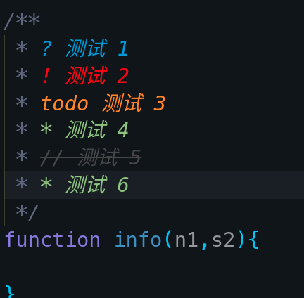
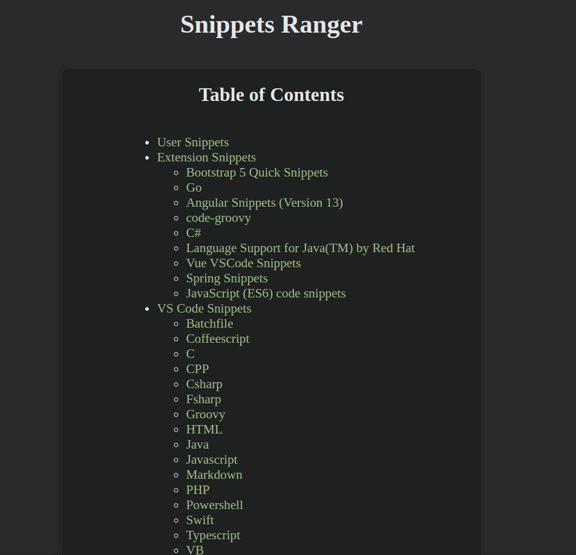
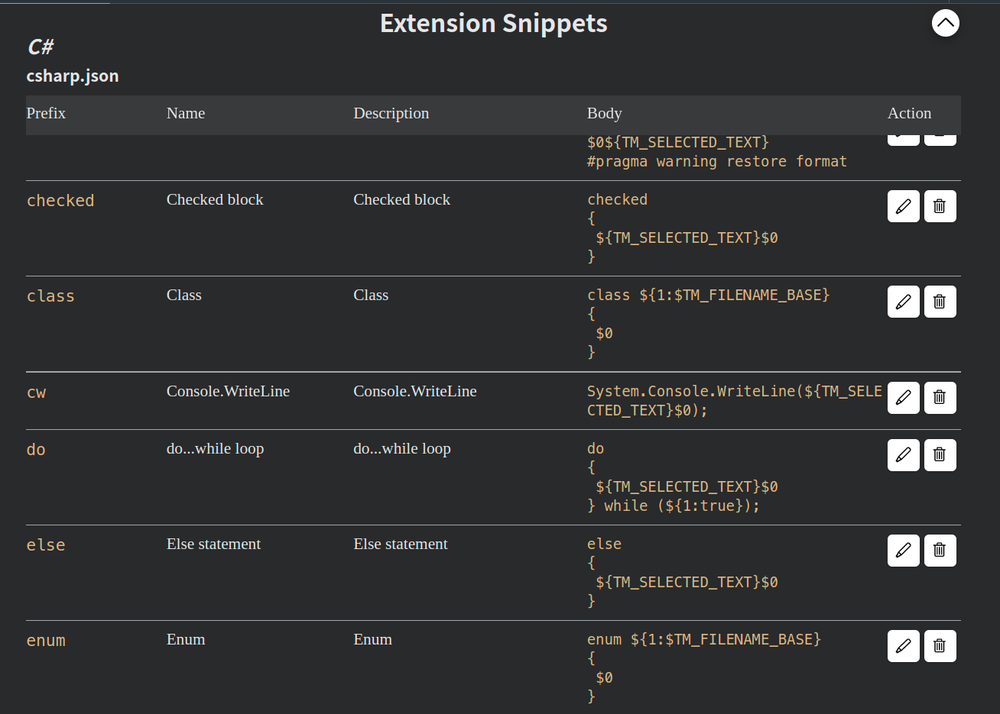

# VSCode 插件笔记

---

## <span id="vscode_extensions">常用插件</span>

以下插件都以 [Open-VSX](https://open-vsx.org) 市场的插件为例，微软那个 [Marketplace](https://marketplace.visualstudio.com/vscode) 的一样。

VSCode 或 VSCodium 新版本内置的功能已实现部分插件功能，所以网上部分插件推荐应该已经过时了。

### <span>使用命令操作插件</span>

安装插件：

```shell
/opt/VSCode/bin/code --install-extension vscodevim.vim
```

### <span id="vscode_extensions_local">本地化插件</span>

VSCode 的语言包。

[vscode-language-pack-zh-hans](https://open-vsx.org/extension/MS-CEINTL/vscode-language-pack-zh-hans)

---

### <span id="vscode_extensions_syncing">Syncing（VSCode 同步配置插件）</span> 

[Syncing](https://open-vsx.org/extension/nonoroazoro/syncing) [](https://github.com/nonoroazoro/vscode-syncing
) 这是一个款同步 VSCode 配置的插件。

这个插件是使用到 [Gist](https://gist.github.com) 来存放 VSCode 的配置文件。

使用这个插件，得先新建一个 gist 和 一个 token。

* 新建一个 gist
> [gist 具体操作](../Git/Git_Note.md#git_github_gist)

* 生成 token
生成一个 token，在生成 token 时，勾选 **scopes** 为 **gist**，如果不想麻烦，就把 token 的生命周期为 **No Expiration**。（[token 具体操作](../Git/Git_Note.md#git_github_token)）

* syncing 设置

`ctrl+shift+p` 唤出 Syncing 配置文件：

```json
{
    "id": "", 
    "token": "", 
    "http_proxy": "",
    "auto_sync": false
}
```

`id` gist 的 id；`token` 刚新建的 token

设置完全 `id` 和 `token`，就能同步配置了。

---

### <span id="vscode_extensions_bookmarks">Bookmarks</span>

[Bookmarks](https://open-vsx.org/extension/alefragnani/Bookmarks) [](https://github.com/alefragnani/vscode-bookmarks) 是在代码某一行做标记的插件。

Bookmarks 快捷键：

|   快捷键   |       功能       |
|:----------:|:----------------:|
| Ctrl+Alt+K |  创建或消除书签  |
| Ctrl+Alt+J | 跳转到前一个书签 |
| Ctrl+Alt+L | 跳转到后一个书签 |

---

### <span id="vscode_extensions_bettercomments">Better Comments</span>

[Better Comments](https://open-vsx.org/extension/aaron-bond/better-comments) [](https://github.com/aaron-bond/better-comments)

有 6 种增强的注释样式：



---

### <span id="vscode_extensions_mintlify_doc_writer">Mintlify Doc Writer</span>

[Mintlify Doc Writer](https://marketplace.visualstudio.com/items?itemName=mintlify.document) [](https://github.com/mintlify/writer) 是一个自动生成文档注释的插件。


这插件不能能生成英文文档注释，还能通过设置，生成中文文档注释，真的很香的插件。

---

### <span id="vscode_extensions_snippetsranger">Snippets Ranger</span>

[Snippets Ranger](https://open-vsx.org/extension/robole/snippets-ranger) [](https://github.com/robole/vscode-snippets-ranger) 这是一个 snippet 管理插件。

这个插件除了新建添加自己的 snippet 这个常规功能外，最最重要的是它能用一种更直观的方式查看当前 vscode/vscodium 中已经存在的哪些 snippet。

而且它将这些 snippet 分了两大类，一类是内置的，另一类是插件提供的，如下图：



点击各项还能查看具体 snippet 有哪些功能：



---

### <span id="vscode_extensions_git">Git 相关插件</span>

#### <span id="vscode_extensions_git_gitlens">GitLens</span>


[GitLens](https://gitlens.amod.io/) 是 VSCode 重要的 Git 插件，增强了 VSCode 的 Git 的功能 --VSCode 自带的 git 功能非常基础。而这个插件能让 VSCode 显示每一行代码的作者以及提交时间。

#### <span id="vscode_extensions_git_githistory">Git History</span>

[Git History](https://open-vsx.org/extension/donjayamanne/githistory) [](https://github.com/DonJayamanne/gitHistoryVSCode) Git 历史插件。

此插件能查看提交历史。

#### <span id="vscode_extensions_git_gitgraph">Git Graph</span>

[Git-Graph](https://open-vsx.org/extension/mhutchie/git-graph) [](https://github.com/mhutchie/vscode-git-graph.git) Git 提交记录图形化插件。

---

### <span id="vscode_extensions_theme">主题和文件图标</span>

VSCode 有很多漂亮的 Theme 和 icon，可以根据自己喜好添加。

#### <span id="vscode_extensions_theme_gruvbox">Gruvbox</span>
个人喜欢 Gruvbox 系列的。

[gruvbox-material](https://open-vsx.org/extension/sainnhe/gruvbox-material)  [](https://github.com/sainnhe/gruvbox-material-vscode) 这个 Theme 挺不错的，是融合 Gruvbox 和 Material 风格的主题。


---

#### <span id="vscode_extensions_theme_obsidian">Obsidian Dark</span>

[Obsidian-Dark](https://open-vsx.org/extension/Hamza-Aziane/obsidian-dark) [](https://github.com/Hamza-Aziane/obsidian-dark) 这个主题，个人觉得也挺不错的。


---

#### <span id="vscode_extensions_theme_rainglow">Rainglow</span>

[Rainglow](https://open-vsx.org/extension/daylerees/rainglow) [](https://github.com/rainglow/vscode) 这是一个 theme 集合，包含了 300 多个语法本色和 主题。 喜欢没事换 theme 的人可以用下这个主题包。

如果想修改状态栏样式可以参考以下代码：

```json
"workbench.colorCustomizations": {
    "statusBar.background": "#333",
    "statusBar.foreground": "#fff",
    "statusBar.noFolderBackground": "#333",
    "statusBar.noFolderForeground": "#fff"
}
```

---

#### <span id="vscode_extensions_theme_icon">图标</span>

VSCode 除了能添加主题外，还能添加 Icon，这个图标一般应用在 SideBar 中文件或目录显示，也应用在打开的页面其标签的 title 中，还能应用在文件「面包屑导航」（Breadcrumbs）中。

##### <span id="vscode_extensions_theme_icon_material">Material-icon</span>

个人喜欢 [material-icon-theme](https://open-vsx.org/extension/PKief/material-icon-theme) [](https://github.com/PKief/vscode-material-icon-theme) 这个 icon 包。


##### <span id="vscode_extensions_theme_icon_catppuccin">Catppuccin icons</span>

[Catppuccin icons](https://marketplace.visualstudio.com/items?itemName=Catppuccin.catppuccin-vsc-icons) [](https://github.com/catppuccin/vscode-icons) 这是配合 [Catppuccin 主题]() 使用的图标套件。


##### <span id="vscode_extensions_theme_icon_catppuccin_perfect">Catppuccin Perfect icons</span>

[Catppuccin Perfect icons](https://marketplace.visualstudio.com/items?itemName=thang-nm.catppuccin-perfect-icons) [](https://github.com/thang-nm/Catppuccin-Perfect-Icons) 是 [Catppuccin icons](#editors_vscode_extensions_theme_icon_catppuccin) 的衍生品。


---

###  <span id="vscode_extensions_vim">模拟 vim 插件</span>

VSCode 中可以通过安装 vim 插件来进行 vim 类似的操作。

模拟 vim 插件有很多，我个人使用的是以下这款 [VSCodeVim](https://open-vsx.org/extension/vscodevim/vim) [](https://github.com/VSCodeVim/Vim) 插件。

vim 插件功能

vim 插件除了「模拟」了 vim 的基本功能外，还「模拟」了部分 vim 常用插件的功能。主要有 [easymotion](https://github.com/easymotion/vim-easymotion)、[surround]() 和 [Sneak](https://github.com/justinmk/vim-sneak) 三个 vim 插件功能。

**easymotion** 与 **sneak** 功能类似，就是可以让使用者在页面「跳来跳去」，就像下图演示的那样，所以其他文本编辑器对于这个功能插件模仿者，除了叫 「\*\*motion」外，就是叫「\*\*jump」。


easymotion 更出名，因为就 easymotion 功能就大致说下常用的使用技巧。

默认情况下，easymotion 快揵键都是 \<leader> 起头的，而默认 \<leader> 是 **\\**。而配合 vim 本身的 `j`、`k`、`h``l` 等就能实现行级、行内等方式跳转，这是对原生的 vim 移动的重要补充。

easymotion 常用功能列表：

|     功能     |                快捷键                 |
|:------------:|:-------------------------------------:|
| 行级向上跳转 |         \<leader>\<leader> k          |
| 行级向下跳转 |         \<leader>\<leader> j          |
|   行内向前   |         \<leader>\<leader> h          |
|   行内向后   |         \<leader> \<leader> l         |
| 按单词向后跳 |         \<leader>\<leader> w          |
| 按单词向前跳 |         \<leader>\<leader> b          |
|   搜索式跳   | \<leader>\<leader> s 输入要搜索的字符 |

###### vim 插件的问题

卡顿

在 Widndows 下的 VSCodium 下装了 vim 插件，在使用过程中出现卡顿的情况。

这其实不单是 vim 插件的问题，是 Windows 版本的 VSCodium 的问题，即使不用此插件，在保存文件时，Windows 版本的 VSCodium 也是存在卡顿的现象。

在 Windows 下，VSCode 却没有出现这种情况。同样的，在 Linux 下使用 VSCodium 也没有出现卡顿的情况。

可见在 Windows 下 VSCodium 可以暂时是「废」了，还是用「亲儿子」VSCode 吧。

vim 插件，使用时的卡顿，一般出现在编辑完文件，保存后，「Normal」模式与「Insert」模式切换的时候。估计这是由保存诱发的多原因造成的卡顿。

VSCode/VSCodium 默认开启了 `occurrences Highlight` 这个功能时候，这个功能是光标停在当前单词上，编辑器就会将本页面所有该单词全部高亮。这个功能没什么用，至少不应该做为常用选项开启，即便是不卡的 VSCode 及 Linux 版本的 VSCodium 下，开启此功能，会使页面一直「重绘」，发生「页面」跳动的现象，对于使用体验来讲也不是很好，再说这功能会诱使 Windows 下 VSCodium 原本卡顿的现象更为明显，所以建议最好关闭此功能。

另外，`easymotion` 这个功能也有可能造成 vim 插件卡，所以没办法只能关闭。

还有 [GitLens](#editors_vscode_extensions_git_gitlens) 插件中的 `Current Line` 功能（就是在编辑区行行代码后显示 git 信息），同样可能引发 vim 插件卡顿，所以这也得关闭。

总而言之，只有是编辑区图形重绘功能的插件，都有可能引起 vim 插件卡。

---

### <span id="vscode_extensions_Path-Intellisense">Path Intellisense</span>

[Path Intellisense](https://open-vsx.org/extension/christian-kohler/path-intellisense) [](https://github.com/ChristianKohler/PathIntellisense) 是个自动识别文件路径的插件。

---

### <span id="vscode_extensions_projectm">Project Manager</span>

[Project Manager](https://open-vsx.org/extension/alefragnani/project-manager) [](https://github.com/alefragnani/vscode-project-manager) 项目管理插件。

---

### <span id="vscode_extensions_indentrainbow">Indent Rainbow</span> 

[Indent Rainbow](https://open-vsx.org/extension/oderwat/indent-rainbow) [](https://github.com/oderwat/vscode-indent-rainbow) 彩色缩进线。


`light` 模式，缩进不是默认 `块式`（上图右），而是线的（上图左）。

```json
"indentRainbow.indicatorStyle": "light",
  // we use a simple 1 pixel wide line
  "indentRainbow.lightIndicatorStyleLineWidth": 1,
  // the same colors as above but more visible
  "indentRainbow.colors": [
    "rgba(255,255,64,0.3)",
    "rgba(127,255,127,0.3)",
    "rgba(255,127,255,0.3)",
    "rgba(79,236,236,0.3)"
  ],

```

---

### <span id="vscode_extensions_svg">SVG 插件</span>

[SVG](https://open-vsx.org/extension/jock/svg) [](https://github.com/lishu/vscode-svg2) 插件，有自动完成 SVG 代码、能预览 SVG 图片、快速取色等功能。

---

### <span id="vscode_extensions_markdown">Markdown 插件</span>

markdown 插件有很多，而 VSCode、VSCodiume 本身内置了 markdown 基础功能。

所以需要自行安装的插件就基于几种功能：表格辅助、预览等。

以下两个插件就可以满足了 Markdown 大部分功能需求了。

#### <span id="vscode_extensions_markdown-all-in-one">markdown-all-in-one</span>

[Markdown-All-in-One](https://open-vsx.org/extension/yzhang/markdown-all-in-one) [](https://github.com/yzhang-gh/vscode-markdown) 是一个强大的 Markdown 插件。 编写 Markdown 该有的功能都有了！


#### <span id="vscode_extensions_markdown-preview-enhanced">Markdown Preview Enhanced</span>

[Markdown Preview Enhanced](https://open-vsx.org/extension/shd101wyy/markdown-preview-enhanced) [](https://github.com/shd101wyy/vscode-markdown-preview-enhanced) 是一个 Markdown 预览插件。

常用操作：
* `ctrl+k v`：在侧边显示预览
* `ctrl+shift-v`：预览
  >[!tip] 
  >
  > 侧边预览的快捷键与 vim 插件冲突

> [!bug] 预览插件存在的问题
> 
> 这个预览插件，对于「锚点」跳转存在一定的问题，主是问题发生在中英混排标题时，特别是存在空格及英文大写字母情况下，问题详解请参考 [关于锚点](../Markdown/Markdown_Note.md#关于锚点)。

---

### <span id="vscode_extensions_note">笔记插件</span>

#### <span id="vscode_extensions_note_foam">Foam</span>

[Foam](https://open-vsx.org/extension/foam/foam-vscode)[](https://github.com/foambubble/foam) 是一个支持双向链接的笔记插件。

Foam 常用功能及命令

* Foam: Show Graph：打开知识图谱页面


---

### <span id="vscode_extensions_devenv_python">Python 开发环境</span>

VSCodium 原装只内置了 `Python Language Basics`，这个内置插件只有语法高亮等基础功能。想要更强的功能推荐装 [Python](https://open-vsx.org/extension/ms-python/python) [](https://github.com/Microsoft/vscode-python) 这个插件。

装此插件时，同时装了三个插件：
* [jupyter](https://open-vsx.org/extension/ms-toolsai/jupyter) 
* [jupyter-keymap](https://open-vsx.org/extension/ms-toolsai/jupyter-keymap) 
* [jupyter-renderers](https://open-vsx.org/extension/ms-toolsai/jupyter-renderers)

#### VSCode-Python

[VSCode-Python](https://marketplace.visualstudio.com/items?itemName=ms-python.python) [](https://github.com/Microsoft/vscode-python) 是 [Python](../Python/Python_Note.md) 主要插件。

#### Python Debugger

[Python Debugger](https://marketplace.visualstudio.com/items?itemName=ms-python.debugpy) [](https://github.com/microsoft/vscode-python-debugger) [Python](../Python/Python_Note.md) Debug 插件。

#### 

[Python Environment Manager](https://marketplace.visualstudio.com/items?itemName=donjayamanne.python-environment-manager) 是 [Python环境](../Python/Python_Note.md#python_virtualenvironments) [](https://github.com/DonJayamanne/vscode-python-manager) 管理插件。


---

### <span id="vscode_extensions_devenv_java">Java 开发环境</span>

#### RedHat-Java

[RedHat-Java](https://marketplace.visualstudio.com/items?itemName=redhat.java)  [](https://github.com/redhat-developer/vscode-java) 这是 RedHat 出的 Java 的插件。这是在 [oracle-java插件](#oracle-java) 出来之前，最好的 vscode 上最主要并具备「官方」背景的 Java 插件。

这个插件是 VSCode 中众多 [Java](../Java/Java_Note.md) 插件的「**基础**」插件。

简单配置：

```json
"java.configuration.runtimes": [
	{
		"name": "JavaSE-17",
		"path": "/home/silascript/.sdkman/candidates/java/17.0.12-tem",
	},
	{
		"name": "JavaSE-21",
		"path": "/home/silascript/.sdkman/candidates/java/current",
		"default": true
	},
],

"java.jdt.ls.java.home": "/home/silascript/.sdkman/candidates/java/current"
```

Runtime 名称列表：[runtime name](https://github.com/redhat-developer/vscode-java/blob/master/package.json#L793)

#### Oracle-Java

[Oracle-Java](https://marketplace.visualstudio.com/items?itemName=Oracle.oracle-java) [](https://github.com/oracle/javavscode) 是 Oracle 官方出的 Java 插件。
> [!info] 
> 
> Oracle 这个插件出得太晚，[VSCode](VSCode_Note.md) 上 [Java](../Java/Java_Note.md) 相关插件，大部分都是 [RedHat-Java](#RedHat-Java) 生态圈的。

配置 JDK：

```json
// Oracle Java 插件
"jdk.jdkhome": "/home/silascript/.sdkman/candidates/java/current",
```

#### Project Manager for Java

[Project Manager for Java](https://marketplace.visualstudio.com/items?itemName=vscjava.vscode-java-dependency) [](https://github.com/Microsoft/vscode-java-dependency) 微软出的 Java 项目管理插件。


此插件需要依赖 [RedHat-Java](#RedHat-Java) 插件。

#### Maven for Java

[Maven for Java](https://marketplace.visualstudio.com/items?itemName=vscjava.vscode-maven)[](https://github.com/microsoft/vscode-maven) 是 微软开发的 [Maven](../Java/Maven/Maven_Note.md) 插件。

#### Debugger for Java

[Debugger for Java](https://marketplace.visualstudio.com/items?itemName=vscjava.vscode-java-debug) [](https://github.com/Microsoft/java-debug) 是一个 微软开发的 [Java](../Java/Java_Note.md) 运行及 debug 插件。

装了这插件后，在代码页面，可执行方法（如 `main` 方法）上会显示 `Run|Debug` 字样，可以快捷运行或 Debug 方法。
> [!tip] 
> 
> 在右上角上也会显示运行及调试 Java 的「三角形」标志。

> [!important] 
> 
> 这个插件依赖 [RedHat-Java](#RedHat-Java) 插件。

#### Java Test Runner

[Java Test Runner](https://marketplace.visualstudio.com/items?itemName=vscjava.vscode-java-test) [](https://github.com/Microsoft/vscode-java-test) 是 Java 测试插件，同样也是微软的作品。

> [!important] 
> 
> 这个插件依赖 [RedHat-Java](#RedHat-Java) 及 [Debugger for Java](#Debugger%20for%20Java) 两个插件

#### Spring Boot Extension Pack

[Spring Boot Extension Pack](https://marketplace.visualstudio.com/items?itemName=vmware.vscode-boot-dev-pack) [](https://github.com/spring-projects/sts4) 这是一个插件集合包，它包括了：

* [Spring Initializr java](#Spring%20Initializr%20java)
* [Spring Boot Dashboard](#Spring%20Boot%20Dashboard)
* [Spring Boot Tools](#Spring%20Boot%20Tools)

#### Spring Boot Tools

[Spring Boot Tools](https://marketplace.visualstudio.com/items?itemName=vmware.vscode-spring-boot)  [](https://github.com/spring-projects/sts4) 是一个 [SpringBoot](../Java/Spring/SpringBoot_Note.md)**语言服务器**（[LSP](../Protocols/LSP_Note.md)）插件。

> [!important] 
> 
> 这个插件是基于 [RedHat-Java](#RedHat-Java) 插件的。

#### Spring Initializr java

[Spring Initializr java](https://marketplace.visualstudio.com/items?itemName=vscjava.vscode-spring-initializr) [](https://github.com/Microsoft/vscode-spring-initializr) 是一个轻量级用于生成 [SpringBoot](../Java/Spring/SpringBoot_Note.md) 项目的插件。


功能：

* Generate a Maven/Gradle Spring Boot project
* Customize configurations for a new project (language, Java version, group id, artifact id, boot version and dependencies)
* Search for dependencies
* Quickstart with last settings
* Edit Spring Boot dependencies of an existing Maven Spring Boot project

#### Spring Boot Dashboard

[Spring Boot Dashboard](https://marketplace.visualstudio.com/items?itemName=vscjava.vscode-spring-boot-dashboard)  [](https://github.com/Microsoft/vscode-spring-boot-dashboard) 是 [SpringBoot](../Java/Spring/SpringBoot_Note.md) 的插件。

功能：

* View Spring Boot apps in workspace
* Start / Stop a Spring Boot app
* Debug a Spring Boot app
* Open a Spring Boot app in browser
* List beans/endpoint mappings
* View bean dependencies


> [!important] 
> 
> Spring Boot Dashboard 依赖 [Debugger for Java](#Debugger%20for%20Java) 及 [Spring Boot Tools](#Spring%20Boot%20Tools) 插件。

#### Gradle for java

[Gradle for java](https://marketplace.visualstudio.com/items?itemName=vscjava.vscode-gradle) [](https://github.com/microsoft/vscode-gradle) 同样是微软出的 Gradle 插件。

这个插件兼容 [RedHat-Java](#RedHat-Java) 插件。

#### XML Language Support by Red Hat

[XML Language Support by Red Hat](https://marketplace.visualstudio.com/items?itemName=redhat.vscode-xml)  [](https://github.com/redhat-developer/vscode-xml)Redhat 出的 XML 插件，新版本不再需要依赖 [Java](../Java/Java_Note.md) 了。 

#### MybatisX

[MybatisX](https://marketplace.visualstudio.com/items?itemName=yangbaopan.vscode-java-ibatisx) [](https://github.com/Carson-yy/vscode-mybatis)

---

### <span id="vscode_devenv_cpp">C、C++ 开发环境</span>

操作系统得先安装 LLVM、Clang 等工具。

Arch 系：

```shell
sudo pacman -S llvm clang lld lldb libc++
```
> [!info] 
> 
> 其他 Linux 系统可使用自已的包管理器安装 **llvm**、**clang**、**lld**、**lldb** 及 **libc++** 程序及组件。

装完那些程序后，检测下是不是安装成功：

* 检测 LLVM
```shell
llvm-dis --version
```
* 检测 lld
```shell
lld --version
```
* 检测 lldb
```shell
lldb --version
```
* 检测 clang
```shell
clang --version
```
* 检测 clang++
```shell
clang++ --version
```
* 检测 clangd
```shell
clangd --version
```

安装 VSCode 相关插件：

* [clangd](https://open-vsx.org/extension/llvm-vs-code-extensions/vscode-clangd) [](https://github.com/clangd/vscode-clangd) 如果要使用 Clang 来作语言服务，这个插件是必装的。

* [code runner](https://open-vsx.org/extension/formulahendry/code-runner) [](https://github.com/formulahendry/vscode-code-runner) 这个是代码运行插件，能跑 C、C++、Java、Python 等众多语言。

---

### <span id="vscode_extensions_frontend">前端插件</span>

VSCode 最初出来的时候，主要是用在前端开发的，所以 VSCode 积累了大量的前端开发的插件。

而这些前端插件主要是围绕着 Html、CSS、Javascript 及各种前端框架的补全、检测、调试、格式化等功能而设的。

VSCode 已经内置了大名鼎鼎的 [Emmet](https://emmet.io) （[Emmet Wiki](https://zh.wikipedia.org/wiki/Emmet)），有了这货，很多前端插件都可以省了。

---

#### <span id="vscode_extensions_frontend_LiveServer">LiveServer</span> 

[LiveServer](https://open-vsx.org/extension/ritwickdey/LiveServer) [](https://github.com/ritwickdey/vscode-live-server) 是让 VSCode 开启一个静态服务器，用于测试前端页面。


此插件在状态栏显示状态：


---

#### <span id="vscode_extensions_frontend_vetur">Vetur</span>

[Vetur](https://open-vsx.org/extension/octref/vetur) [](https://github.com/vuejs/vetur) 是 Vue 的插件。

这插件包含两个组件：

* [Vue LSP](https://github.com/vuejs/vetur/tree/master/server)
 VSCode 中的 只是 VLS 的 client，要想使用 语言服务，得安装 Vue LSP。
 ```shell
 npm install vls -g
 ```
> [!tip] 
> 
> Vue LSP 但能在 VSCode 使用，也能让其他编辑器使用，如 vim 等。  
> 关于 [LSP](../vim/Vim_LSP_Complete.md#about_lsp)

* vti  Terminal 接口

#### <span id="vscode_extensions_frontend_open-in-default-browser">Open In Default Browser</span>

[Open In Default Browser](https://github.com/peakchen90/vscode-open-in-default-browser) 是一个使用默认 [浏览器](../Browsers/Browser_Note.md) 打开页面的插件。


---

### <span id="vscode_extensions_error">错误检测</span>

#### <span id="vscode_extensions_error_errorlens">ErrorLens</span>

[ErrorLens](https://marketplace.visualstudio.com/items?itemName=usernamehw.errorlens) [](https://github.com/usernamehw/vscode-error-lens) 是一个实时检测语法错误的小插件。


---

### <span id="vscode_extensions_format">格式化</span>

#### Prettier

[Prettier](../Format/Prettier_Note.md) 是一个格式化器。

在 [VSCode](VSCode_Note.md) 也有着相应的插件：[prettier-vscode](https://marketplace.visualstudio.com/items?itemName=esbenp.prettier-vscode) [](https://github.com/prettier/prettier-vscode)。

装完这插件后，默认情况使用这插件格式化时，如果项目中没有相应的配置文件，会搜寻用户目录下的 [全局配置](../Format/Prettier_Note.md#全局配置) 文件，即 `.prettierrc` 或 `.prettierrc.json`。

---

### <span id="vscode_extensions_misc">杂项</span>

#### Code-Spell-Checker

[Code-Spell-Checker](https://marketplace.visualstudio.com/items?itemName=streetsidesoftware.code-spell-checker) [](https://github.com/streetsidesoftware/vscode-spell-checker) 是一个拼写检查插件。


---

## 相关资料

* [在Visual Studio Code中使用 Code Runner 编译C/C++程序 - NaCl技术分享](https://nacldragon.top/2023/mingw-VSCode/)
* [VSCode中插件Code Spell Checker - IT皮皮蟹 - 博客园](https://www.cnblogs.com/AAFlyingFish/p/14559446.html)
* [相见恨晚！解决很难发现的 bug ——单词拼写错误，一款 vscode 插件 code spell checker - 掘金](https://juejin.cn/post/7370008254720639015)
* [Oracle发布支持Vscode的Java插件 - 极道](https://www.jdon.com/69168.html)
* [vscode开发java环境配置，很细 - 掘金](https://juejin.cn/post/7386916905008054287)
* [vscode推荐的Java插件](https://blog.51cto.com/u_16213343/7450444)

---

## <span id="vscode_about_notes">其他相关笔记</span>

* [VSCode 笔记](VSCode_Note.md)
* [文本编辑器笔记](Editors_Note.md)
* [Prettier 笔记](../Format/Prettier_Note.md)

