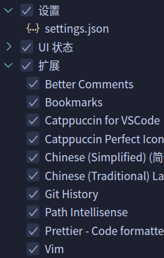

# VSCode 笔记

---

## 目录

* [插件](#插件)
* [快捷键](#快捷键)

---

## 插件

[常用插件](Editors_Note.md#VSCode#常用插件)

---

## 快捷键

* `Ctrl+Shift+p`：打开命令面板
* `Ctrl+p`：查找并打开文件
* `Ctrl+Alt+-`：Go Back 跳回之前的文件
* `Ctrl+Shift+t`：恢复刚关闭的文件

官方给的快捷键帮助文档：

* [Windows 版本](https://code.visualstudio.com/shortcuts/keyboard-shortcuts-windows.pdf)
* [Linux](https://code.visualstudio.com/shortcuts/keyboard-shortcuts-linux.pdf)

### 快捷键小问题

1. `Ctrl+J` 无法切换终端面板
> [!tip] 
> 
> vim 的快捷键占用了。VScode 中 vim 的 `Ctrl+J` 是光标移动到下一行。
>
> 建议将切换终端面板的快捷键设为 `Ctrl+meta+J`（`mata` 或者叫 `超键`，就是 `Win` 键）

### 快捷键资料

* [vscode + vim 操作备忘录 - 星落的日志](https://dkpluto.com/index.php/archives/3/)

---

## <span id="vscode_directory">VSCode 目录结构</span>

VSCode：

`~/.config/Code` 设置目录

`~/.vscode` 插件存放目录

VSCodium：

`~/.config/VSCodium` 设置目录

`~/.vscode-oss/vscodium` 插件存放目录

> 如果要重置 VSCode 或 VSCodium，就需要清理这两个目录。
>
> 如果只清 `~/.config/Code` 或 `~/.config/VSCodium` 这个设置目录，启动 VSCode 或 VSCodium ，插件还是存在的。

如果想让插件什么都放在 VSCode 根目录下，所以作以下操作：

1. 从官网下载安装包，解压就能用的那个
2. 解压到想要安装的路径下。
3. 先不要启动 VSCode，在 VSCode 根目录下手动新建 `data` 目录，这个目录是存在用户数据及插件安装目录。如果想临时文件也放在这个目录中，所以在 `data` 目录下再新建一个 `tmp` 目录，用于存放临时文件。
4. 启动 VSCode，这样 VSCode 就会将用户数据、插件等放到 `data` 目录中了，这样文件将 VSCode 作成「便携包」。

---

## <span id="vscode_config">配置</span>

### <span id="vscode_config_settings">Settings</span>

VSCode 的 Settings 显示模式分为 图形界面的**UI** 和 **Json**两种。一般设置时可以使用图形界面的 UI，而复杂的设置，就建议切换成 Json 模式。

VSCode 中的 Settings 是分为 [全局 Settings](#vscode_config_settings_applicationsettings) 的和自定义 [Profile](#Profile) 的 Settings。

#### <span id="vscode_config_settings_applicationsettings">全局 Settings</span>

这里「全局 settings」，也称为「**Application Settings**」或称为「**User Settings**」，「全局用户 Settings」。

如下图可见，在 `~/.config/Code/User/` 目录下的那个 settings 是「全局」settings，同时这个 settings 也是 [默认Profile](#vscode_config_profile_default) 的 settings。


#### <span id="vscode_config_settings_applicationsettings_open">打开全局 Settings</span>

打开这个 Settings，也是有点「技巧」的。

这里有两种情况：

1. 当前的 Prfile 是 [默认 Profile](#vscode_config_profile_default)

	如果**当前 Profile** 为 [默认 Profile](#vscode_config_profile_default) 时，不用想直接点击「设置」（Settings），或者使用 `Ctrl+Shift+P` 命令面板，敲入 `Open User Settings(UI)` 或 `Open User Settings(Json)`，就能呼出这个 Settings。
	> [!tip] User Settings
	> 
	> 请注意是「User Settings」不是「Default Settings」。因为这里说的「全局」指的都是「用户 Settings」，而非「Default Settings」是「只读」，不能修改，它只相当于一个 Settings 的「模板」或「指南」存在，其他 Settings 都参考这个默认 Settings 来配置。
	> 
	> 还要注意点击「设置」（Settings）或使用 `Open User Settings` 打开的 Settings 不一定就是全局 Settings，因为如果当前 Profile 不是 [默认Profile](#editors_vscode_config_profile_default)，这个操作，就会打开当前 Profile 的 Settings。
	>
	>> [!tip] 如何确定当前 Settings
	>> 如果确定是不是全局 Settings，应切换为 Json 模式，这样就能显示出这个 Settings 的具体存储位置。如果是在 `~/.config/Code/User` 下的，那就是全局的，如果是在 `~/.config/Code/User/profiles/xxx/` 下的，那就是某个自定义的 Profile 的 Settings。
2. 当前 Profile **非默认 Profile**

	如果当前 Profile 处于非 [默认 Profile](#vscode_config_profile_default) 时，那点击「设置」或者使用 `Open User Settings` 命令呼出的 Settings 其实是当前 Profile 的 Settings。这时就得使用 `Open Application Settings` 命令来呼出 [默认 Profile](#vscode_config_profile_default) 下的全局 Settings。
 > [!tip] 
 > 
 > 当然不嫌麻烦的话，可以已打开的自定义 Profile 的 Setting （Json 模式）时，使用「面包屑导航」找到 `~/.config/Code/User/` 下的全局 Settings 并打开。

#### <span id="scode_config_settings_applicationsettings_applyToAllProfiles">全部 Profile 共用设置</span>

在全书局 Settings 中可以将一些配置设定成所有 [Profile](#Profile) 的 Settings 都共用的。

这是通过 `workbench.settings.applyToAllProfiles` 这个选项来设置，而这属性的值是一个数组，所以使用中括号 `[]` 进行引用。

`workbench.settings.applyToAllProfiles` 这个属性不是直接将相关设置放在其中，所以是将设置项的**key**放置其中，而这些设置项还是得在 `workbench.settings.applyToAllProfiles` 外，全局 Settings 中预先设置好。如下面的代码：

```json
{
	"workbench.startupEditor": "none",
	"workbench.colorTheme": "Catppuccin Macchiato",
	"workbench.iconTheme": "catppuccin-perfect-macchiato",
	"catppuccin.accentColor": "teal",
	
	// 窗口样式
	"window.menuBarVisibility": "toggle",
	"window.titleBarStyle": "custom",
	"window.zoomLevel": 1,
	
	// vim
	"vim.easymotion": true,
	"vim.highlightedyank.enable": true,
	"vim.showMarksInGutter": true,
	"vim.smartRelativeLine": true,
	
	// 字体
	
	"editor.fontFamily": "'Meslo LG S', 'JetBrains Mono', 'Fira Code', 'Cascadia Mono PL', 'Droid Sans Mono', 'monospace'",
	"editor.fontSize": 20,
	"editor.fontWeight": "350",
	"debug.console.fontSize": 18,
	"terminal.integrated.fontFamily": "'CaskaydiaCove Nerd Font Mono','Cascadia Mono PL'",
	
	// minimap
	"editor.minimap.maxColumn": 80,
	"editor.minimap.autohide": true,
	
	// 格式化
	
	"[json]": {
		"editor.defaultFormatter": "esbenp.prettier-vscode"
	},
	
	"[javascript]": {
		"editor.defaultFormatter": "esbenp.prettier-vscode"
	},
	
	"[jsonc]": {
		"editor.defaultFormatter": "esbenp.prettier-vscode"
	},
	
	"prettier.useTabs": true,
	
	// 将哪些配置应用到所有Profile中
	
	"workbench.settings.applyToAllProfiles": [
		"editor.fontSize",
		"editor.fontFamily",
		"editor.fontWeight",
		"debug.console.fontSize",
		"terminal.integrated.fontFamily",
		"editor.minimap.maxColumn",
		"editor.minimap.autohide",
		"window.zoomLevel",
		"vim.easymotion",
		"vim.highlightedyank.enable",
		"vim.showMarksInGutter",
		"vim.smartRelativeLine",
		"prettier.useTabs"
	]
	
}
```

> [!info] 
> 
> 可以看出 `workbench.settings.applyToAllProfiles` 其实就是相关设置项「引用池」。

而这些放置在 `workbench.settings.applyToAllProfiles` 中设置项，在其他 Profile 的 Settings 中就不用再设置，即便再设置，也会出现 `xx` 提示。

> [!tip] applyToAllProfiles 配置位置
> 
> `workbench.settings.applyToAllProfiles` 只能在全局 User Settings 中设定。
> 
> 如果在非全局 Profile 的 Settings，即不是在 User Settings（Application Settings） 中设置 `workbench.settings.applyToAllProfiles`，VSCode 会提示 `This setting has an application scope and can be set only in the user settings file.` 的提示。

---

### <span id="vscode_config_profile">Profile</span>

「code-profile」是 [VSCode](https://code.visualstudio.com/) 0.75 版本开始提供的非常好用的新功能。

Profile 新特性，能够使在不同「工作流」（场景）使用不同的配置，我们就能根据当前实际需求，启用或安装不同插件，这样就解决了 VSCode 插件装得过多，占用资源大的缺点了。

Profile 新功能还支持将配置「导入」和「导出」，非常适合将各个配置单独导出到本地保存，或将本地保存的配置文件导入到 VSCode 中。而且导出和导入功能还支持向 [github](https://github.com)。

Profile 是包括了 [Settings](#vscode_config_settings)、插件、snippet 等部分的配置。



#### <span id="vscode_config_profile_default">默认 Profile</span>

在没有创建任何 Profile 时，默认使用的是「默认 Profile」，这个 Profile 使用的是 [全局Settings](#vscode_config_settings_applicationsettings)。

「默认 Profile」与其他 Profile 一样可以导出，但不出导入。从外部导入一个 Profile，试图「覆盖」这个「默认认 Profile」是不允许的。
> [!tip] Default Profile 导入
> 
> 在导入 Profile 时，在「创建 Profile」（Create Profile）时，会让你给导入后 Profile 起外名，这个名字不能是「**Default**」，因为「默认 Profile」就是这个名字，而「默认 Profile」是不支持被导入的 Profile 「覆盖」和替换的。
> 
> 
> 

因为「默认 Profile」不支持外部导入「覆盖」，可以使用 [Syncing](#Syncing（VSCode%20同步配置插件）) 这个同步插件保存「默认 Profile」的 Settings。
> [!info] 手动「同步」Default Profile
> 
> 如果不使用同步插件同步「默认 Profile」，那「手动」设置。
> 
> 先「导入」外部 Profile，当然不能命名成「Defualt」，那就另起一个名。然后打开这个 Profile 的 Settings-- 用 Json 模式打开，复制其中的内容到 Default 的 Settings 中。

#### <span id="vscode_config_profile_create">创建 Profile</span>

创建 Profile 可以在别的 Profile 基础上创建。如在内置的那几个 Profile 上创建。也可以通过已存在的自定义 Profile 上创建。

> [!bug] 通过非内置 Profile 创建 Profile
> 
> 发现这种方式创建时，存在一个小 bug，就是选择了基础 Profile 点击创建新的 Profile 后，新的 Profile 使用的是当前 Profile 为模板创建，而不是选择的那个 Profile 创建。
> 
> 也就是说，在当前 VSCode 版本 (1.81.0) 下，要通过选择已有的非内置 Profile 创建新的 Profile，只能在当前正在使用的 Profile 为模板创建。估计之后的版本会修正这个小 bug。

##### Profile 目录结构

无论通过何种方式创建一个新的 Profile，都会在 `~/.config/Code/User/profiles/` 目录下新建一个目录，目录名是一串数字构成，而这个 Profile 的 Settings、插件描述文件 `extensions.json`、snippet 都在这个目录下。如下图：


> [!info] 默认 Profile 的插件描述文件
> 
> 因为默认 Profile 比特特殊，所以它的插件描述文件是不与其他自定义 Profile 的插件一样放在自己的 Profile「专属」目录下，而是有另外存放位置。
> 
> 默认 Profile 的插件描述文件是存放 `~/.vscode/extensions/` 目录下，同样也是叫 `extensions.json` 文件。
> 

#### <span id="vscode_config_profile_import">导入 Profile</span>

导入 Profile 其实是一种变相的 [创建Profile](#vscode_config_profile_create)，因为在导入 Profile 时，最后步就是创建。

> [!tip] 不能创建 Default Profile
> 
> 之前已经提过了，不能创建 Default Profile!所以在导入时，给新创建的 Profile 命名时不能使用「**Default**」这个名称。

#### <span id="vscode_config_profile_export">导出 Profile</span>

所有的 Profile，包括 [默认Profile](#vscode_config_profile_default)，是可以导出的。

> [!info] 备份 Profile
> 
> 导出的 Profile 建议使用 [Git](../Git/Git_Note.md) 及 [Github](../Git/Git_Note.md#git_github) 来对这些 Profile 管理和备份。

#### <span id="vscode_config_profile_extensions">Profile 中的插件</span>

某 Profile 的插件描述文件是在 `~/.config/Code/User/xxx/` 下的 `extensions.json` 文件。

#### <span id="vscode_config_profile_resource">关于 Profile 的其他资料</span>

* [Profiles in Visual Studio Code](https://code.visualstudio.com/docs/editor/profiles)

---

### <span id="vscode_synchronize">同步</span>

配置完了，自然需要将配置同步到「云」上。当然可以手动导出配置然后上传到网盘上，下次再导入，但这操作有点麻烦。

所以建议使用同步方式将配置同步保存到网络上。

而同步又有两大类：
1. 使用同步插件将配置同步到 [gist](https://gist.github.com/)
	此种方式，用到的插件 [VSCode-Syncing](Editors_Note.md#editors_vscode_extensions_syncing)。

2. 使用 VSCode 内置的「同步」功能。
	使用这功能时，登录时，最好就不要用 github 登了，麻烦太多。用微软 outlook 方式，当然没有 outlook，微软也非常贴心，可以让你使用 githut 帐号授权给 outlook，反正 github 都是微软的，「左口袋到右口袋」，没有区别。
	
	试用过这「同步」功能后，很爽，它除了拥有与插件 [VSCode-Syncing](Editors_Note.md#editors_vscode_extensions_syncing) 一样的，将原有 settings 备份，还能将所有你设置的 [Profile](#code-profile) 设置也备份了，这样下次换设备什么，就能从「云」上将备份的 Profile 设置同步下来，真是非常方便！
	从某种意义内置的「同步」功能已经可以替换 [VSCode-Syncing](Editors_Note.md#editors_vscode_extensions_syncing) 插件了。

	网上网友的分享，也证明官方的同步方案是挺「香」，但还是存在一个问题：不同操作系统的差异性，官方同步不能像 [VSCode-Syncing](Editors_Note.md#editors_vscode_extensions_syncing) 插件那样，不同平台下各自设不同的 [gist](https://gist.github.com/) 来适配相应的平台。但无论如何，整体而已，官方内置的「同步」功能确实非常优秀。

> [!tip] 关于同步的各种网络资料
> 
> * [VSCode同步扩展插件的3种方法](https://segmentfault.com/a/1190000039769766)
> * [VSCode官方的配置同步方案](https://juejin.cn/post/7066622158184644621)

---

### 个人配置

* [VSCode Profile Github Repo](https://github.com/silascript/VSCode_Settings)
* [VSCode Settings Syncing Gist for Linux](https://gist.github.com/silascript/fd1d5111ce372d3f313eae6064c173c3)
* [VSCode Settings Syncing Gist for Windows](https://gist.github.com/silascript/690b9a6eefe395a0f0f6cba397f06c3c)

---

##  <span id="vscode_cli">关于 CLI</span>

在 VSCode 根目录下有一个 `bin` 目录，其中就有一个 `code` 的执行程序。用这个可以完成一些命令行操作。

### <span id="vscode_cli_extension_manager">CLI 插件管理器</span>

列出已安装的插件：

```shell
code --list-extensions

// 列出已安装插件并显示其版本号
code --list-extensions --show-versions

```

安装插件：

```shell
code --install-extension publisher.extension
```

> [!info] 插件 ID
> 
> 在使用命令行安装插件时，要指定插件的 ID，完整的插件 ID 是：`publisher.extension`，即「发布者.插件名」。
> 
> 插件的 ID 可以在 [VSCode 插件市场](https://marketplace.visualstudio.com/) 具体的插件页面中，右下角有一个「**More Info**」面板，其中的「**Unique Identifier**」这一属性查询得到。

已安装过的插件不会再安装，并有诸如：`Extension 'vscodevim.vim' v1.25.2 is already installed.` 这样的提示。

> [!info] 
> 
> 使用 `code --install-extension` 命令安装插件，只安装在 [默认 Profile](#默认%20Profile) 下。

### <span id="vscode_cli_docs">相关文档</span>

* [The Visual Studio Code command-line interface](https://code.visualstudio.com/docs/editor/command-line)

---

## 其他相关笔记

* [VSCode 插件笔记](VSCode_Extensions_Note.md)
* [文本编辑器笔记](Editors_Note.md)

