# 字体笔记

介绍各类字体

---

## 目录

* [基本概念](#基本概念)
	* [字重](#字重)
* [中文字体](#fonts_zh)
	* [CJK](#fonts_zh_cjk)
	* [GB18030](#fonts_zh_gb18030)
	* [思源字体](#fonts_zh_notofont)
	* [更纱黑体](#fonts_zh_sarasa)
* [编程字体](#fonts_program)

---

## 基本概念

### 字体大小

#### 字体单位

#### 号

字号是印刷所使用的长度单位，用于表示字形的大小。字号越小，字体越大。

1858 年美国传教士姜别利在上海的美华书馆主持印刷工作，他根据美国当时活字的大小指定了汉字大小的标准并编号。

#### 级

字级同样也是印刷字体所使用的一个长度单位，用于表示字形的大小。

1 级等于 0.25 mm，即 1/4 毫米。

字级这个单位实际属于公制单位系统。

「级」单位源于日本的照相排版系统，单位为「Q」，取英文「Quarter」（四分之一），而 Q 的发音与日语的「級」（きゅう）相同，因为日本汉字写作「級」。中国国产照相排版机中采用「级」的罗马字拼写 kyu 而将单位记作「K」。

#### 点

 #磅  #p

点（point），pt，同样是印刷所使用的长度单位，用于表示字型的大小，也用于余白等其他版面构成要素的长度。

「点」最最出现在欧洲，欧洲大陆主要采用「**迪多点**」（Didot's point）。

1886 年，美国印刷界同意统一使用「约翰逊派卡」（Johnson pica）为共通单位。这个规定下的点被称为「美式点」（American point，ap）。

1 美式点 = 1/12 picas = 0.3514 mm

6 约翰派卡 = 72 美式点 = 0.99624 标准英寸

美式点后来在中国、日本也得到普及。

> [!info] 
> 
> 当代最通行的是广泛应用于桌面排版软件，如微软的 Word、Adobe 的 InDesign 等软件采用的就是与「美式点」近似 DTP 点，1 DTP pt = 1/72 英寸 = 0.3527777 mm。
> 

中国传统字体排印上的字号单位是「[号](#号)」，之后「点」制活字传入中国，而后采用「点」「[号](#号)」兼容并行的体制，但各地活字厂商的活字尺寸不尽相同，[号](#号)、点、毫米等单位之间也有不同换算。另外，由于「点」基于英制，用公制单位换算时只能采用近似数值。

中国也将「点」俗称为「磅」，缩写为 `P` 或`p`。

1958 年，中国文化部出版事业管理局为了统一活字的标准曾公布《关于活字及字模规格化的决定（草案）》，里面直接规定「每点为 0.35 毫米」，铅字的高度规定为 23.32 毫米。

#### 单位换算

1 磅 = 127/360 mm = 0.352777 mm

1 英寸 = 72 磅 = 25.4 mm

1 级 = 0.25 mm

##### 字号单位对照

| **中文字号** | **英文字号（磅）** | **毫米** | **像素** |
|:------------:|:------------------:|:--------:|:--------:|
|     初号     |        42pt        | 14.82mm  |   56px   |
|     小初     |        36pt        | 12.70mm  |   48px   |
|     一号     |        26pt        |  9.17mm  |  34.7px  |
|     小一     |        24pt        |  8.47mm  |   32px   |
|     二号     |        22pt        |  7.76mm  |  29.3px  |
|     小二     |        18pt        |  6.35mm  |   24px   |
|     三号     |        16pt        |  5.64mm  |  21.3px  |
|     小三     |        15pt        |  5.29mm  |   20px   |
|     四号     |        14pt        |  4.94mm  |  18.7px  |
|     小四     |        12pt        |  4.23mm  |   16px   |
|     五号     |       10.5pt       |  3.70mm  |   14px   |
|     小五     |        9pt         |  3.18mm  |   12px   |
|     六号     |       7.5pt        |  2.56mm  |   10px   |
|     小六     |       6.5pt        |  2.29mm  |  8.7px   |
|     七号     |       5.5pt        |  1.94mm  |  7.3px   |
|     八号     |        5pt         |  1.76mm  |  6.7px   |

### 字重

---

## 中文字体

### CJK

中日韩统一表意文字

#### CJK 各区字数

#cjk/字数

|                                  **字符集**                                   | **字数** | **Unicode 编码** | **合计** |
|:-----------------------------------------------------------------------------:|:--------:|:----------------:|:--------:|
|    [基本汉字](https://www.qqxiuzi.cn/zh/hanzi-unicode-bianma.php?zfj=jbhz)    | 20902 字 |    4E00-9FA5     | 20902 字 |
| [基本汉字补充](https://www.qqxiuzi.cn/zh/hanzi-unicode-bianma.php?zfj=jbhzbc) |  90 字   |    9FA6-9FFF     | 20992 字 |
|      [扩展A](https://www.qqxiuzi.cn/zh/hanzi-unicode-bianma.php?zfj=kza)      | 6592 字  |    3400-4DBF     | 27584 字 |
|      [扩展B](https://www.qqxiuzi.cn/zh/hanzi-unicode-bianma.php?zfj=kzb)      | 42720 字 |   20000-2A6DF    | 70304 字 |
|      [扩展C](https://www.qqxiuzi.cn/zh/hanzi-unicode-bianma.php?zfj=kzc)      | 4154 字  |   2A700-2B739    | 74458 字 |
|      [扩展D](https://www.qqxiuzi.cn/zh/hanzi-unicode-bianma.php?zfj=kzd)      |  222 字  |   2B740-2B81D    | 74680 字 |
|      [扩展E](https://www.qqxiuzi.cn/zh/hanzi-unicode-bianma.php?zfj=kze)      | 5762 字  |   2B820-2CEA1    | 80442 字 |
|      [扩展F](https://www.qqxiuzi.cn/zh/hanzi-unicode-bianma.php?zfj=kzf)      | 7473 字  |   2CEB0-2EBE0    | 87915 字 |
|      [扩展G](https://www.qqxiuzi.cn/zh/hanzi-unicode-bianma.php?zfj=kzg)      | 4939 字  |   30000-3134A    | 92854 字 |
|      [扩展H](https://www.qqxiuzi.cn/zh/hanzi-unicode-bianma.php?zfj=kzh)      | 4192 字  |   31350-323AF    | 97046 字 |

### GB18030

> GB 18030，全称《信息技术 中文编码字符集》，是中华人民共和国国家标准所规定的变长多字节字符集。其对 GB 2312-1980 完全向后兼容，与 GBK 基本向后兼容，并支持 Unicode（GB 13000）的所有码位。

#### 版本

GB 18030-2000，兼容 Unicode 3.0 [CJK](#CJK)（即扩展 A 区），共收 **27,533** 个汉字；2000 年 3 月 17 日发布、2000 年 7 月 1 日实施。
> [!tip] 
> 
> 这字数连「康熙字典」的 47043 个字的数量都没达到。
>> [!quote] 
>> 
>> * [《康熙字典》到底收了多少漢字？ - 康熙字典論壇 - 康熙字典与倉頡之友](https://www.chinesecj.com/forum/forum.php?mod=viewthread&tid=195768)

GB 18030-2005，更新至 Unicode 3.1 [CJK](#CJK)（即扩展 B 区），并刊载少数民族包括朝鲜文、蒙古文（包括满文、托忒文、锡伯文、阿礼嘎礼文）、德宏傣文、藏文、维吾尔文／哈萨克文／柯尔克兹文和彝文的文字。共有 **70,244** 个汉字；2005 年 11 月 8 日发布、2006 年 5 月 1 日实施。

GB 18030-2022，更新至 Unicode 11 中日韩统一表意文字（增补了基本区的 66 个字，并在扩展 A、B 区的基础上增加了扩展 C、D、E、F 区），新增康熙部首，以及滇东北苗文、傈僳文、西双版纳新傣文、西双版纳老傣文、德宏傣文等少数民族文字以及蒙古文 BIRGA 符号，共收录汉字 **87,887** 个和汉字部首 228 个，比上一版增加录入了 1.7 万余个生僻汉字；于 2022 年 7 月 19 日发布、2023 年 8 月 1 日实施

### 相关资料

* [CJK 资料](Font_Material.md#CJK)

---

### 传承字形

传承字形也称为「旧字形」。

* [傳承字形標準化文件](https://github.com/ichitenfont/inheritedglyphs)

---

### 思源字体

[思源字体](https://fonts.google.com/noto/fonts) 是 Adobe 和 Google 领导开发的开源字体家族。 #font/noto

「思源」一词来自成语「饮水思源」。

思源字体安装包名称解释：

* HW 英文和数字是半角
* VF 可变自重字体 Variable Fonts
* SC 简体中文
* CN 简体中文中国 他和 SC 在有些字的笔画细节上有不同
* J 日语 K 韩语 HC 繁体香港 TC 繁体台湾

格式：
* .otf 常见字体格式
* .ttf 常见字体格式，可以是单个字体，也可以是多字重合一字体
* .ttc Super OTC 所有五种语言和所有七种粗细，以及常规和粗体的 HW 版 ，45 合一字体。
* .ttc OTC 五种语言合一，相比 Super OTC，按七种字重分成了 7 个字体文件，五种语言五合一字体

思源分为「黑体」和「宋体」两种。

Google 版黑体的叫 「Noto Sans CJK」，Adobe 版黑体叫「Source Han Sans」，字形两者完全一样，只是字体和字重的称呼不同而已。

Google 版宋体的叫「Noto Serif CJK」，Adobe 版宋体叫「Source Han Serif」，与黑体一样，Google 版和 Adobe 版只是称呼不同。

当然各地区的汉字标准是有区别的，所以思源字体也分地区不同，有不同的字型。

* [思源黑体](https://fonts.google.com/noto/fonts?noto.region=CN)  

各版思源黑体差异：

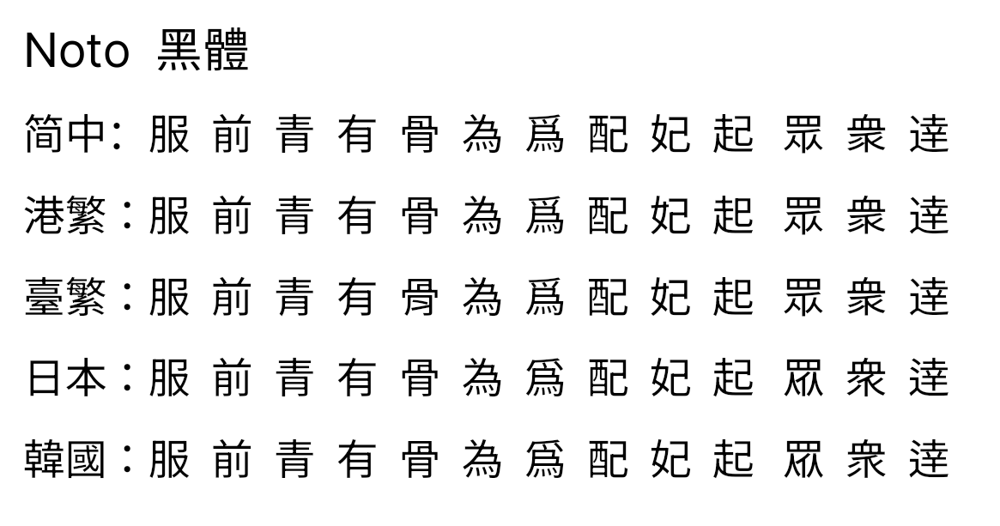

* [思源宋体](https://fonts.google.com/noto/fonts?noto.region=CN) 

各版思源宋体差异：

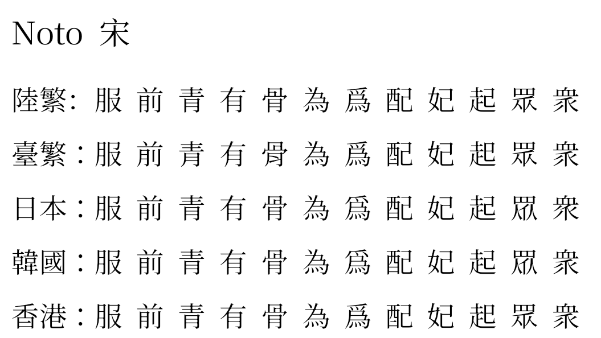

---

#### 思源的各种衍生字体

因为思源字体是开源字体，所以出现了各式各样的衍生字体。

##### 秋空黑体

[秋空黑体](https://github.com/ChiuMing-Neko/ChiuKongGothic) 是「一款基於思源黑體，同時整合異體字選擇器功能的中文印刷體風格字體」。

这是一款支持 [传承字形](#fonts_zh_inheritedglyphs) 的字体。

##### 秋空明朝

[秋空󠄁明󠄁朝󠄁](https://github.com/ChiuMing-Neko/ChiuKongMincho) 「是一款以思源明體 V2 為基礎進行二次修改而成，使用傳統印刷體筆形設計」。

这是一款支持 [传承字形](#fonts_zh_inheritedglyphs) 的字体。

#### 文津宋体

[文津宋体](https://github.com/takushun-wu/WenJinMincho) 基于 [思源](#fonts_zh_notofont) 宋体，可免费商用的宋体大字符集字体。

##### 遍黑体

[遍黑体](https://github.com/Fitzgerald-Porthmouth-Koenigsegg/Plangothic_Project) 是以中国大陆字形为标准的对中日韩统一表意文字扩展区进行字形补充的项目。

> [!important] 
> 
> 此字体支援扩展 B 区至扩展 J 区的全部汉字。

##### 源音黑体

[源音黑体](https://github.com/MoneMizuno/Genne-Gothic) 是修改于思源黑体的字体。主要是将一些字型改为旧字形。

##### 源样黑体

[源样黑体](https://github.com/ButTaiwan/genyog-font) 是以思源韩版的字符为主，加配繁中置中标点而成的。

> [!info] 
> 
> 韩版思源的字符都是旧字形。思源衍生字体如果是倾向旧字形，一般都从思源韩版中取字符。

##### 源石黑体

[genseki](https://github.com/ButTaiwan/genseki-font)

源石与源样区别在笔画上，源石的笔画有「喇叭口」特征，看起来更传统。

##### 昭源字体

[昭源字体](https://chiron-fonts.github.io) 是基于思源香港版修改而成的。

昭源字体同样分为黑体和宋体两种：

* 昭源黑体 
* 昭源宋体  

昭源宋

对比 1：

思源宋：
昭源宋：

对比 2：

思源宋：
昭源宋：

##### 有爱黑体

[有爱黑体](https://github.com/nowar-fonts/Nowar-Sans)

##### 源样明体

[源样明体](https://github.com/ButTaiwan/genyo-font)

##### 源流明体

[源流明体](https://github.com/ButTaiwan/genryu-font) 是将思源宋体宽度压缩了下，并对笔画作了细微处理。

##### 源云明体

[源云明体](https://github.com/ButTaiwan/genwan-font) 是将「源流明体」的笔画做了朦胧处理，使其有墨晕或过曝的效果。

---

#### 字体对比

几种黑体及宋体衍生字体对比：

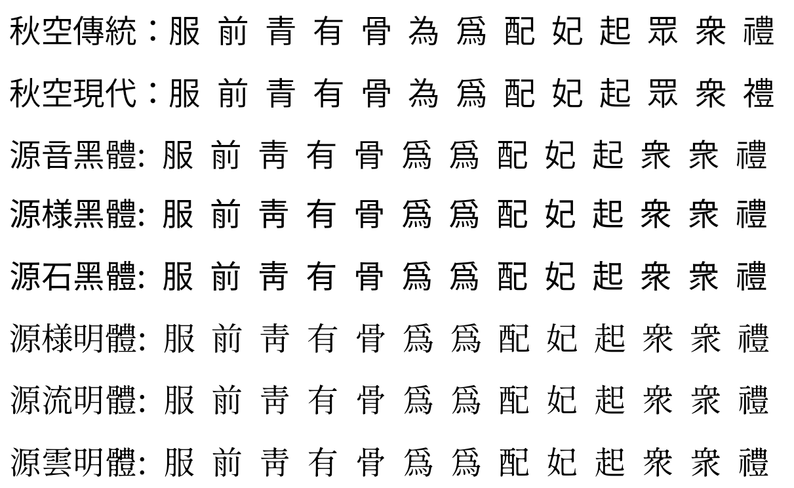

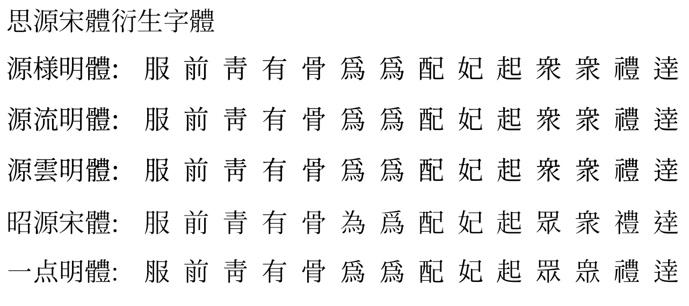

真服了，这些那几款有「泥古」倾向的字体，「配」和「妃」两字全「挂」了 -- 估计是思源韩国版的「配」和「妃」本就是「己」字，所以基于韩国版本而制作的追求复古的衍生字体，在这两字都不太「古」！

当然，「配」这字到底是「己」，还是「巳」，亦或是「已」，其实存在争议。下面就稍微分析下这个字。
> 「妃」其实是源于「配」，「古无轻唇」，陈梁之前，中国古汉语是没有「轻唇音」的（轻唇音即唇齿音），有的只有「重唇」，「重」即「重」（chong），重就是双，「重唇」即「双唇」。在南北朝陈、梁之前的古汉语只有双唇音：[p]、[p']、[b]、[m] -- 而大规律使用轻唇音 [f]、[v] 那得是五代后。「妃」就是「配」，所以《左传》一开头：「惠公元妃孟子」，这里的「元妃」的「妃」应读双唇音，即「元配」。

「配」，本义为酒的颜色。《说文解字》：「酒色也」。「酉」本义为「酒」，那右边那就一定是「色」了。

「配」右边实则是「色」字省了「人」字头。俗话老说「色字头上一把刀」，其实这个说法是错误的，「绝」字头上确实是一把「刀」，但「色」字头上并不是「刀」，而是「人」字。「色」，「顔气也。从人从卪」（《说文解字》），下面那个「巴」，其实是「卩」，即「節」。「色」，就是「人節」。所谓「節」，本义是「竹節」--「竹約也」，后引申为「符節」。「符節」，是古代君王向军官、外交官授予一定的权限的凭证，一般是符節一半君王拿着，一半臣子拿着。而「色」这个「人節」，跟「符節」类似，而「说文」中所说的「颜气」中的「颜」指的是额头附近的部位，俗话老说的「印堂发黑」，「印堂」就是这个「颜」的部位，而这部位的气色反映了一个人的身体状态，正如《说文解字.注》中的「顏者兩眉之閒也心達於气」，「颜」与「心」就如「符節」的那两半一样，就这是「人節」含义。

由此而见，「配」的右边实质是「卩」，不过这字「变形」后跟「巳」长得一样。所以「配」右边应该是「巳」。

秦简牍中的「色」：

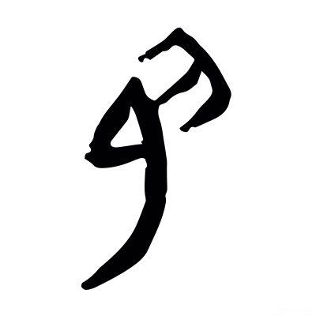

但问题是，「配」字历史上右边有写成「己」也有写成「巳」。

《说文》：

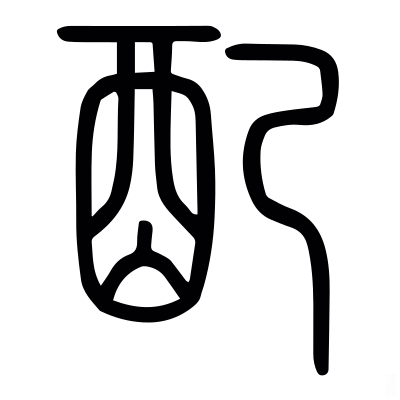

金文：

西周早中期：

西周晚期：

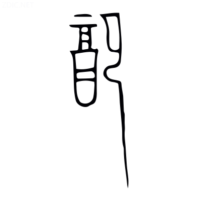

春秋：
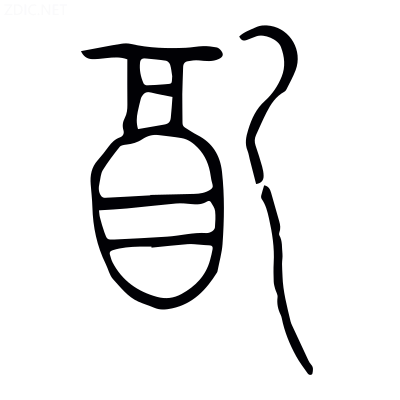
战国：
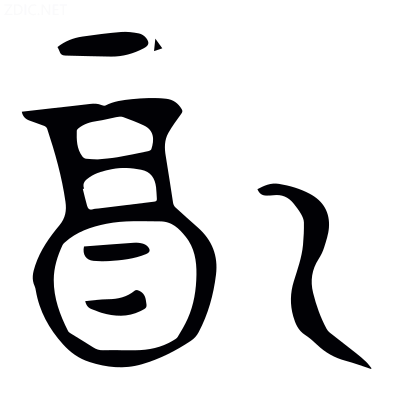

楚简帛：

> 以上「色」和「配」字的图片均来自 [汉典网](https://www.zdic.net)

《康熙字典》：

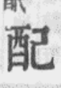

澤存堂本的《广韵》：

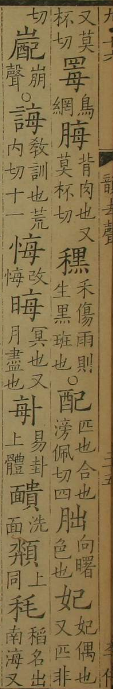

鉅宋本《广韵》：

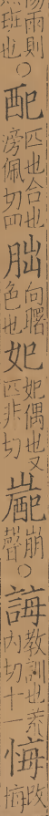

《中原音韵》：

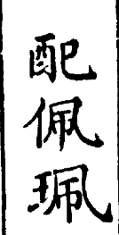
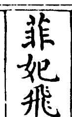

《洪武正韵》：

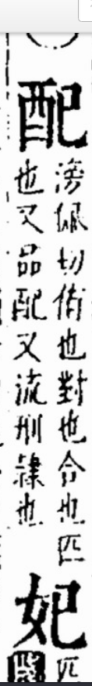

很明显古代字书、韵书，有取「己」有取「巳」，甚至有像《洪武正韵》的「长脖子」的「已」。
>《洪武正韵》那个「配」和「妃」就有点搞笑了，说是「巳」，但没「闭口」，说是「已」，那竖弯勾的「脖子」有点长了。  
> 当然从源头角度，「已」是从「巳」分化出来的，「巳」「已」同源。  
> 但问题「配」只是长的像「巳」，实质人家是「卩」，所以就算写成与「巳」同源的「已」，也是有问题的。--《洪武正韵》有点耍机灵了，弄个模棱两可的写法。

---

##### 更纱黑体

[更纱黑体](https://github.com/be5invis/Sarasa-Gothic) 是将 思源黑体与 [Iosevka](https://github.com/be5invis/Iosevka) 合并而成的字体。

字体名称解释：

| 名称 | 样式 |
| :---: | :---: |
| unhinted | 无微调字体 |
| ttf | TrueType 字体格式 |
| ttc |	TrueType 字体集文件格式 |

第一个名称：

| 名称 | 样式 |
| :---: | :---: |
| gothic | 引号为全宽 |
| ui | 引号为窄的 |
| mono | monospace 破折号为全宽 等宽字体 |
| term | 连字、破折号为半宽 |
| fixed	| 不连字、且破折号为半宽 |

第二个名称：

| 名称 | 样式 |
| :---: | :---: |
| cl | Classical orthography 古典字形 |
| sc | 简体字形 |
| tc| 繁体字形 |
| j	| 日文字形 |
| k	| 韩文字形 |
| hc | 香港字形 |

附加名称：
* slab			超厚笔划字形

第三个名称：

| 名称 | 样式 |
| :---: | :---: |
| regular	|	常规 |
| italic	|	斜体 |
| extralight|	超细 |
| light		|	细体 |
| semibold	|	半粗 |
| bold		|	粗体 |
| extralightitalic | 超细斜体 |
| lightitalic	 |	细斜体 |
| semibolditalic |	半粗斜体 |
| bolditalic | 粗斜体 |

更纱黑体各版差异：

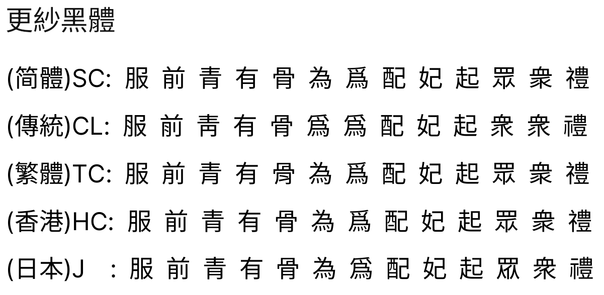

---

##### 梦源字体

[梦源字体](https://github.com/Pal3love/dream-han-cjk)

---

##### 未来荧黑

[未来荧黑](https://github.com/welai/glow-sans)

---

### 一點明體

[GitHub - ichitenfont/I.Ming: I.Ming ( I.明體 / 一点明朝体 / 一點明體 ) · GitHub](https://github.com/ichitenfont/I.Ming) 是一款支持 [传承字形](#fonts_zh_inheritedglyphs) 的字体。

其字体制作依据是 [《傳承字形標準化文件》](https://github.com/ichitenfont/inheritedglyphs)。

可以说它是《傳承字形標準化》这个项目的示范性字体！

### 京华老宋体

[京华老宋体](https://github.com/cntrump/imitation_typeface_fonts) 是一款仿铅印字体。

版本更新到 3.0，还细分了不同版本：

1. 原版 京華老宋体
2. 京華老宋体 -GB 印通表字形
3. 京華老宋体 -GJ 古籍表字形
4. 京華老宋体 -I. 檢校表推薦形
5. 京華老宋体 -MN 折中印刷字形
6. 京華老宋体 -LT 原版鉛字字形

### 華英明朝

[華英明朝](https://github.com/GuiWonder/HuayingMincho) 是一款 IPAmj 明朝的衍生字体。

分为四种版本：

* 舊印體：字形接近旧版 Windows 新细明体
* 傳承體：参考《康熙字典》等经典旧字形资料
* 舊典體：接近《康熙字典》
* 繁體

### 上元明朝

[上元明朝](https://github.com/GuiWonder/LanternMing) 一个衍生自醍醐明朝和花园明朝的旧字形字体。

### 文鼎 PL 字体

文鼎 PL 公众授权字型（Public License Font），共有六套：

**1999 版本**：四套提供予社会大众免费下载，开放用于商业或营利性质之目的：

* 文鼎 PL 细上海宋
* 文鼎 PL 中楷：
	* AR PL UKai CN
	* AR PL UKai HK
	* AR PL UKai TW
	* AR PL UKai MBE
* 文鼎 PL 简报宋
* 文鼎 PL 简中楷

**2010 版本**：二套提供予社会大众免费下载，使用限于非商业或非营利性质之目的：

* 文鼎 PL 明体 U20-L
* 文鼎 PL 报宋 2GBK

#### UKai-ExtC

[UKai-ExtC](https://github.com/extc/UKai-ExtC) 这是一个把 UKai HK 与 UKai-ExtC 的合集。

> [!quote] 
> 
> 是开源中文字体 **AR PL UKai**（文鼎楷体）的一个扩展衍生版本，主要用于在开源和 Linux 系统中提供包含 Unicode 扩展字符（如 CJK 扩展区 A/B 等冷僻字）的楷书支持。

因为它是以 UKai HK 为底，所以是以文鼎 PL 中楷的香港版主体，补入了中国内地的通用字，所以如果某字是香港内地同码异型，最终显示的是香港版本，如「骨」,测试如下：

### 寒蝉字体

#### 寒蝉活字

[寒蟬活字](https://github.com/Warren2060/ChillMovableType) 是一款模拟油墨印刷效果的字体项目。

这个项目字体家族分别有：

* 寒蟬活黑體
* 寒蟬活宋體
* 寒蟬活仿宋
* 寒蟬活楷體：基于 [寒蝉正楷](#寒蝉正楷) 修改的
* 寒蟬活仿楷

#### 寒蝉正楷

[寒蝉正楷](https://github.com/Warren2060/Chillkai) 是将台湾全字库正楷体中的西文优化而成的一款字体。

### 霞鶩文楷

[霞鹜文楷](https://github.com/lxgw/LxgwWenkai) 是基于日本 Klee One 衍生的楷体字体。主要是在 Klee One 上添加简体字。

这是一个字体家族，其中包括多个版本：

* [霞鹜文楷 GB](https://github.com/lxgw/LxgwWenkaiGB)：调整字形，使其符合「通规」规范。其包含 GB18030-2022 实现级别 2 范围的汉字，估计大概 2~3 万多字。
* [霞鶩文楷 TC](#霞鶩文楷%20TC)：繁体及旧字形
* [芫荽](https://github.com/ButTaiwan/iansui)：采用台标
* [芫茜雅楷](https://github.com/ItMarki/jyunsaikaai)：采用香港标准

#### 霞鶩文楷 TC

[霞鶩文楷 TC](https://github.com/lxgw/LxgwWenkaiTC) 是 [霞鶩文楷](https://github.com/lxgw/LxgwWenkai) 的繁体版，其字形参考了[傳承字形標準化文件](https://github.com/ichitenfont/inheritedglyphs)。

### 汇文

[Site Unreachable](https://zhuanlan.zhihu.com/p/12669052378) 是一个复刻老字体的字体家族。

包括了四种字体：

* 汇文明朝
* 汇文仿宋
* 汇文正楷
* 汇文港黑

### 天珩字库

[天珩字库](http://cheonhyeong.com) 是一个包括宋、楷、黑的字体家族。

> [!important] 
> 
> 因为这个字库只是整理，属于「拼好字」，而此库的字体用到了很多厂商字体，所以使用这个字库的字体，有非常高的侵权风险！

#### 天珩标楷

天珩字库 - 标楷是按照香港标准。

### 朱雀仿宋

[朱雀仿宋](https://github.com/TrionesType/zhuque) 是一款开源的仿宋字体。

---

## 编程字体

常用的编程字体：

* [Dejavu](#fonts_program_dejavu)
* [Mesol](#fonts_program_mesol)
* [Cascadia](#fonts_program_cascadia)
* [Fira](#fonts_program_firacode)
* [JetBrains Mono](#fonts_program_jetbrains-mono)
* [Source code pro](#fonts_program_source-code-pro)
* [Plex Mono](#fonts_program_plex)

大写对比：

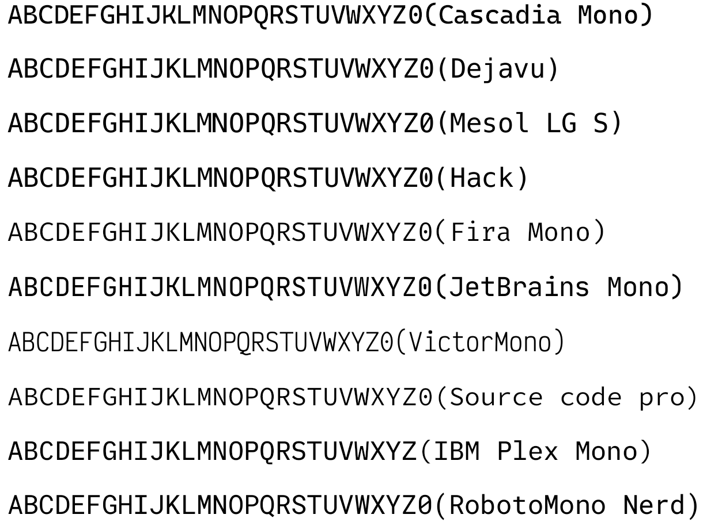

小写对比：

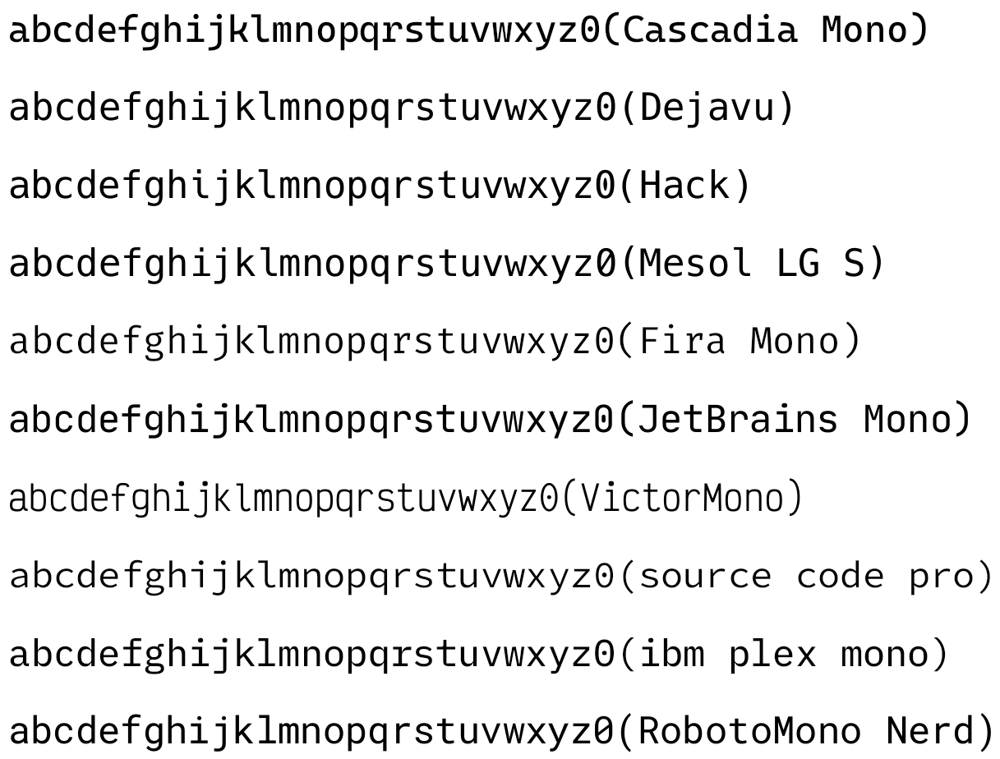

### Dejavu

[DejaVu](https://dejavu-fonts.github.io)  是一套改造自 Bitstream Vera 字体，扩展了 Unicode 所含的字符。

---

### Mesol

说 Mesol，得先提另一个字体：「Menlo」。 

「Menlo」这字体是苹果自己弄了个 DejaVu Sans Mono 的衍生字体，首次出现在 Mac OS X Snow Leopard 系统，是其内建字体之一。

Menlo 调整：
* 0 样式

 DejaVu 的 「0」是「dotted zero」--「0」中间是个「.」，Menlo 改成 「slashed zero」，即 「0」中间是斜杠。

* 「星号」的位置 

DejaVu 的 「星号」是偏中上的，Menlo 将其改到居中位置。

> [DejaVu 与 Menlo 的区别](http://www.leancrew.com/all-this/2009/10/the-compleat-menlovera-sans-comparison/)

[Meslo LG](https://github.com/andreberg/Meslo-Font) 正是源于 Menlo。算是粉丝模仿开源版，并调整了行间距。

其实可以把 Mesol 看成 [DejaVu](#fonts_program_dejavu) 衍生字体，只不过用了跟 Menlo 相似的字符调整策略 -- 主要就是「星号」的居中调整。
> 要区分是 DejaVu 还是 Menlo 或 Mesol，主要就是看「星号」的位置。

---

### Sarasa mono

[sarasa mono](https://github.com/be5invis/Sarasa-Gothic)（更纱黑体），懒人福音。

这是思源字体 +[Iosevka](https://typeof.net/Iosevka/)  而成的字体。

#### 字体名含义

* `slab`：数字和字母的笔画末端加入衬线
* `Mono`：等宽

##### 字重

* `regular`：标准字形
* `semibold`：半粗
* `bold`：粗体
* `light`：细体

##### 汉字字形

* `cl`：即 `classical`，汉字的旧字形
* `HC`：香港字形
* `J`：日本字形
* `K`：韩国字形
* `SC`：简体中文字形
* `TC`：繁体中文，台湾地区字形

|  风格  | 等宽 | 弯引号 | 破折号 | 连字 |
|:------:|:----:|:------:|:------:|:----:|
| Gothic |  否  |  全宽  |  全宽  |  否  |
|   UI   |  否  |  半宽  |  全宽  |  否  |
|  Mono  |  是  |  半宽  |  全宽  |  是  |
|  Term  |  是  |  半宽  |  半宽  |  是  |
| Fixed  |  是  |  半宽  |  半宽  |  否  |

---
### FiraCode

[FiraCode](https://github.com/tonsky/FiraCode) 是 Mozilla 的开源字体，最大特点是支持「连字」。

---
### Cascadia

[Cascadia](https://github.com/microsoft/cascadia-code) 是微软 2019 年打造的开源字体，同样支持「连字」。

个人觉得 Cascadia 这字体有点「油腻」。

Cascadia Code 版本差异：

| 名称 | 包括连字 | 包括 Powerline 字形 |
| :---: | :---: | :---: |
| Cascadia Code | 是 | 否 |
| Cascadia Mono | 否 | 否 |
| Cascadia Code PL | 是 | 是 |
| Cascadia Mono PL  | 否 | 是 |

---
### Source Code Pro 

[Source Code Pro](https://github.com/adobe-fonts/source-code-pro) 是 Adobe 打造的专门用于编程的开源字体。

---
### JetBrains Mono

[JetBrains Mono](https://www.jetbrains.com/lp/mono/#how-to-install)  JetBrains 专门为编程打造的开源字体。

---
### Plex Mono

[Plex Mono](https://github.com/IBM/plex) 是 IBM 开发的一款开源字体家族 Plex 中等宽字体。

---

### CodingFont

[CodingFont](https://www.codingfont.com) 是一个在线预览编程字体的网站。

---

## 各种字体工具

[字体汉字计数软件](https://github.com/NightFurySL2001/CJK-character-count)

---

## 相关笔记

* [字体资料清单](Font_Material.md)

