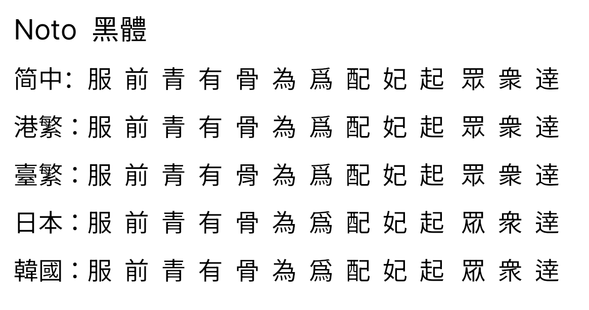
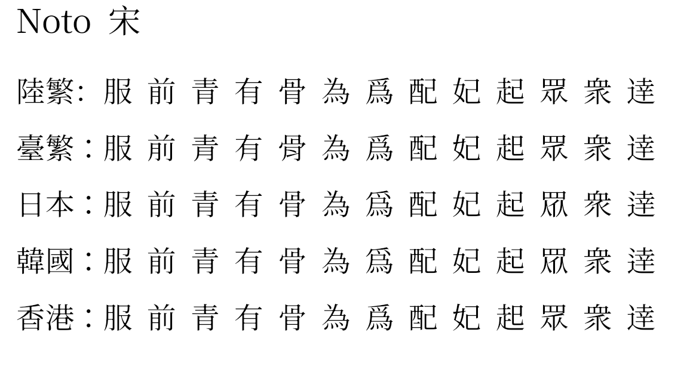
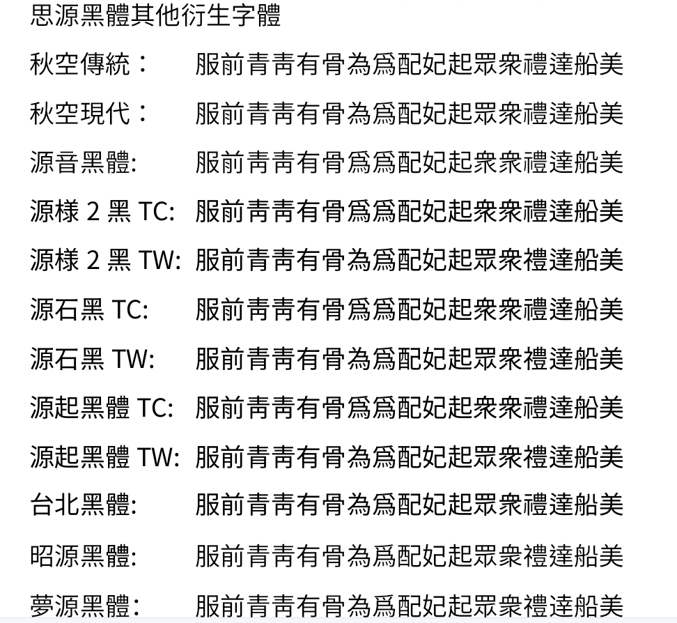
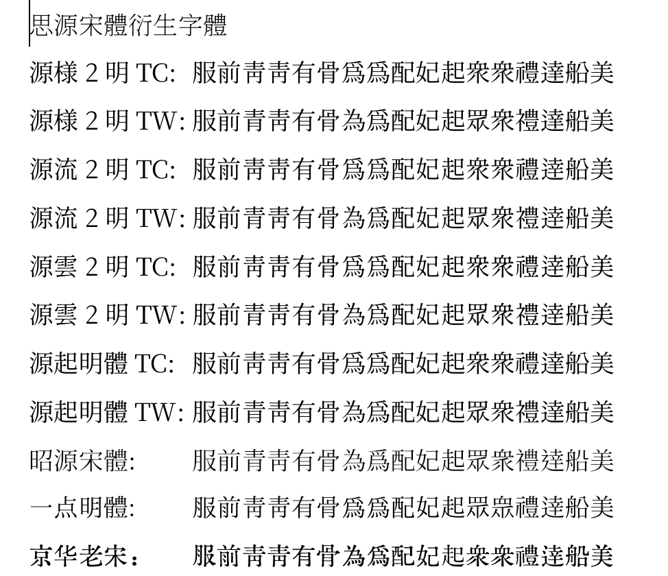
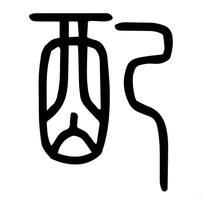

# 字体笔记

介绍各类字体

---

## 目录

* [中文字体](#fonts_zh)
	* [CJK](#fonts_zh_cjk)
	* [GB18030](#fonts_zh_gb18030)
	* [思源字体](#fonts_zh_notofont)
	* [更纱黑体](#fonts_zh_sarasa)
* [编程字体](#fonts_program)

---

## 中文字体

### CJK

#### CJK 各区字数

#cjk/字数

|                                  **字符集**                                   | **字数** | **Unicode 编码** | **合计** |
|:-----------------------------------------------------------------------------:|:--------:|:----------------:|:--------:|
|    [基本汉字](https://www.qqxiuzi.cn/zh/hanzi-unicode-bianma.php?zfj=jbhz)    | 20902 字 |    4E00-9FA5     | 20902 字 |
| [基本汉字补充](https://www.qqxiuzi.cn/zh/hanzi-unicode-bianma.php?zfj=jbhzbc) |  90 字   |    9FA6-9FFF     | 20992 字 |
|      [扩展A](https://www.qqxiuzi.cn/zh/hanzi-unicode-bianma.php?zfj=kza)      | 6592 字  |    3400-4DBF     | 27584 字 |
|      [扩展B](https://www.qqxiuzi.cn/zh/hanzi-unicode-bianma.php?zfj=kzb)      | 42720 字 |   20000-2A6DF    | 70304 字 |
|      [扩展C](https://www.qqxiuzi.cn/zh/hanzi-unicode-bianma.php?zfj=kzc)      | 4154 字  |   2A700-2B739    | 74458 字 |
|      [扩展D](https://www.qqxiuzi.cn/zh/hanzi-unicode-bianma.php?zfj=kzd)      |  222 字  |   2B740-2B81D    | 74680 字 |
|      [扩展E](https://www.qqxiuzi.cn/zh/hanzi-unicode-bianma.php?zfj=kze)      | 5762 字  |   2B820-2CEA1    | 80442 字 |
|      [扩展F](https://www.qqxiuzi.cn/zh/hanzi-unicode-bianma.php?zfj=kzf)      | 7473 字  |   2CEB0-2EBE0    | 87915 字 |
|      [扩展G](https://www.qqxiuzi.cn/zh/hanzi-unicode-bianma.php?zfj=kzg)      | 4939 字  |   30000-3134A    | 92854 字 |
|      [扩展H](https://www.qqxiuzi.cn/zh/hanzi-unicode-bianma.php?zfj=kzh)      | 4192 字  |   31350-323AF    | 97046 字 |

### GB18030

> GB 18030，全称《信息技术 中文编码字符集》，是中华人民共和国国家标准所规定的变长多字节字符集。其对 GB 2312-1980 完全向后兼容，与 GBK 基本向后兼容，并支持 Unicode（GB 13000）的所有码位。

#### 版本

GB 18030-2000，兼容 Unicode 3.0 中日韩统一表意文字（即扩展 A 区），共收 **27,533** 个汉字；2000 年 3 月 17 日发布、2000 年 7 月 1 日实施。

GB 18030-2005，更新至 Unicode 3.1 中日韩统一表意文字（即扩展 B 区），并刊载少数民族包括朝鲜文、蒙古文（包括满文、托忒文、锡伯文、阿礼嘎礼文）、德宏傣文、藏文、维吾尔文／哈萨克文／柯尔克兹文和彝文的文字。共有 **70,244** 个汉字；2005 年 11 月 8 日发布、2006 年 5 月 1 日实施。

GB 18030-2022，更新至 Unicode 11 中日韩统一表意文字（增补了基本区的 66 个字，并在扩展 A、B 区的基础上增加了扩展 C、D、E、F 区），新增康熙部首，以及滇东北苗文、傈僳文、西双版纳新傣文、西双版纳老傣文、德宏傣文等少数民族文字以及蒙古文 BIRGA 符号，共收录汉字 **87,887** 个和汉字部首 228 个，比上一版增加录入了 1.7 万余个生僻汉字；于 2022 年 7 月 19 日发布、2023 年 8 月 1 日实施

### 相关资料

* [中文字符集 Unicode 编码范围](https://www.qqxiuzi.cn/zh/hanzi-unicode-bianma.php)
* [GB 18030-2022 公安人口信息专用字库补充汉字 - 知乎](https://zhuanlan.zhihu.com/p/620620630)
* [GB18030-2022强制标准之我见 - 知乎](https://zhuanlan.zhihu.com/p/641324854#:~:text=GB18030-2005%E6%A0%87%E5%87%86%E6%98%AF%E5%9C%A82000%E6%A0%87%E5%87%86%E7%9A%84%E5%9F%BA%E7%A1%80%E4%B8%8A%E5%A2%9E%E5%8A%A0%E7%BB%9F%E4%B8%80%E8%A1%A8%E6%84%8F%E6%96%87%E5%AD%97%E6%89%A9%E5%B1%95B%E5%8C%BA%E7%9A%8442711%E5%AD%97%E3%80%82,2022%E5%B9%B47%E6%9C%8819%E6%97%A5%E5%8F%91%E5%B8%83%E7%9A%84GB18030-2022%E6%A0%87%E5%87%86%EF%BC%8C%E5%AE%8C%E5%85%A8%E5%85%BC%E5%AE%B92005%E6%A0%87%E5%87%86%EF%BC%8C%E5%B9%B6%E5%9C%A8%E5%85%B6%E5%9F%BA%E7%A1%80%E4%B8%8A%E5%A2%9E%E5%8A%A0%E6%89%A9%E5%B1%95C%E3%80%81D%E3%80%81E%E3%80%81F%E5%8C%BA1.7%E4%B8%87%E5%A4%9A%E5%AD%97%EF%BC%8C%E5%B0%86%E4%BA%8E2023%E5%B9%B48%E6%9C%881%E6%97%A5%E6%AD%A3%E5%BC%8F%E5%AE%9E%E6%96%BD%E3%80%82)
* [gb18030-2022 标准 - 哔哩哔哩](https://www.bilibili.com/read/cv24614582/)
* [unicode哪个版本完整的包括了gb18030-2022的内容？ - 知乎](https://www.zhihu.com/question/597434803)
* [Unicode 15.0 标准已发布 - 掘金](https://juejin.cn/post/7143859529220882439)
* [如何看待GB18030强制标准与通用汉字规范表的关系? - 知乎](https://www.zhihu.com/question/401240131)
* [CJK 统一汉字扩充 I （修订版）（Unicode® 15.1.0） - 知乎](https://zhuanlan.zhihu.com/p/643930520)

---

### 思源字体

[思源字体](https://fonts.google.com/noto/fonts) 是 Adobe 和 Google 领导开发的开源字体家族。 #font/noto

「思源」一词来自成语「饮水思源」。

思源字体安装包名称解释：

* HW 英文和数字是半角
* VF 可变自重字体 Variable Fonts
* SC 简体中文
* CN 简体中文中国 他和 SC 在有些字的笔画细节上有不同
* J 日语 K 韩语 HC 繁体香港 TC 繁体台湾

格式：
* .otf 常见字体格式
* .ttf 常见字体格式，可以是单个字体，也可以是多字重合一字体
* .ttc Super OTC 所有五种语言和所有七种粗细，以及常规和粗体的 HW 版 ，45 合一字体。
* .ttc OTC 五种语言合一，相比 Super OTC，按七种字重分成了 7 个字体文件，五种语言五合一字体

思源分为「黑体」和「宋体」两种。

Google 版黑体的叫 「Noto Sans CJK」，Adobe 版黑体叫「Source Han Sans」，字形两者完全一样，只是字体和字重的称呼不同而已。

Google 版宋体的叫「Noto Serif CJK」，Adobe 版宋体叫「Source Han Serif」，与黑体一样，Google 版和 Adobe 版只是称呼不同。

当然各地区的汉字标准是有区别的，所以思源字体也分地区不同，有不同的字型。

* [思源黑体](https://fonts.google.com/noto/fonts?noto.region=CN)  

各版思源黑体差异：

* [思源宋体](https://fonts.google.com/noto/fonts?noto.region=CN) 

各版思源宋体差异：

---

#### 思源的各种衍生字体

因为思源字体是开源字体，所以出现了各式各样的衍生字体。

##### 源音黑体

[源音黑体](https://github.com/MoneMizuno/Genne-Gothic) 是修改于思源黑体的字体。主要是将一些字型改为旧字形。

##### 源样黑体

[源样黑体](https://github.com/ButTaiwan/genyog-font) 是以思源韩版的字符为主，加配繁中置中标点而成的。
> 韩版思源的字符都是旧字形。思源衍生字体如果是倾向旧字形，一般都从思源韩版中取字符。

##### 源石黑体

[genseki](https://github.com/ButTaiwan/genseki-font)

源石与源样区别在笔画上，源石的笔画有「喇叭口」特征，看起来更传统。

##### 昭源字体

[昭源字体](https://chiron-fonts.github.io) 是基于思源香港版修改而成的。

昭源字体同样分为黑体和宋体两种：
* 昭源黑体 

* 昭源宋体  

思源宋

昭源宋

##### 有爱黑体

[有爱黑体](https://github.com/nowar-fonts/Nowar-Sans)

##### 源样明体

[源样明体](https://github.com/ButTaiwan/genyo-font)

##### 源流明体

[源流明体](https://github.com/ButTaiwan/genryu-font) 是将思源宋体宽度压缩了下，并对笔画作了细微处理。

##### 源云明体

[源云明体](https://github.com/ButTaiwan/genwan-font) 是将「源流明体」的笔画做了朦胧处理，使其有墨晕或过曝的效果。

---

#### 字体对比

几种黑体及宋体衍生字体对比：

真服了，这些那几款有「泥古」倾向的字体，「配」和「妃」两字全「挂」了 -- 估计是思源韩国版的「配」和「妃」本就是「己」字，所以基于韩国版本而制作的追求复古的衍生字体，在这两字都不太「古」！

当然，「配」这字到底是「己」，还是「巳」，亦或是「已」，其实存在争议。下面就稍微分析下这个字。
> 「妃」其实是源于「配」，「古无轻唇」，陈梁之前，中国古汉语是没有「轻唇音」的（轻唇音即唇齿音），有的只有「重唇」，「重」即「重」（chong），重就是双，「重唇」即「双唇」。在南北朝陈、梁之前的古汉语只有双唇音：[p]、[p']、[b]、[m] -- 而大规律使用轻唇音 [f]、[v] 那得是五代后。r「妃」就是「配」，所以《左传》一开头：「惠公元妃孟子」，这里的「元妃」的「妃」应读双唇音，即「元配」。

「配」，本义为酒的颜色。《说文解字》：「酒色也」。「酉」本义为「酒」，那右边那就一定是「色」了。

「配」右边实则是「色」字省了「人」字头。俗话老说「色字头上一把刀」，其实这个说法是错误的，「绝」字头上确实是一把「刀」，但「色」字头上并不是「刀」，而是「人」字。「色」，「顔气也。从人从卪」（《说文解字》），下面那个「巴」，其实是「卩」，即「節」。「色」，就是「人節」。所谓「節」，本义是「竹節」--「竹約也」，后引申为「符節」。「符節」，是古代君王向军官、外交官授予一定的权限的凭证，一般是符節一半君王拿着，一半臣子拿着。而「色」这个「人節」，跟「符節」类似，而「说文」中所说的「颜气」中的「颜」指的是额头附近的部位，俗话老说的「印堂发黑」，「印堂」就是这个「颜」的部位，而这部位的气色反映了一个人的身体状态，正如《说文解字.注》中的「顏者兩眉之閒也心達於气」，「颜」与「心」就如「符節」的那两半一样，就这是「人節」含义。

由此而见，「配」的右边实质是「卩」，不过这字「变形」后跟「巳」长得一样。所以「配」右边应该是「巳」。

秦简牍中的「色」：

但问题是，「配」字历史上右边有写成「己」也有写成「巳」。

《说文》：

金文：

西周早中期：

西周晚期：

春秋：

战国：

楚简帛：

> 以上「色」和「配」字的图片均来自 [汉典网](https://www.zdic.net)

《康熙字典》：

澤存堂本的《广韵》：

鉅宋本《广韵》：

《中原音韵》：

《洪武正韵》：

很明显古代字书、韵书，有取「己」有取「巳」，甚至有像《洪武正韵》的「长脖子」的「已」。
>《洪武正韵》那个「配」和「妃」就有点搞笑了，说是「巳」，但没「闭口」，说是「已」，那竖弯勾的「脖子」有点长了。  
> 当然从源头角度，「已」是从「巳」分化出来的，「巳」「已」同源。  
> 但问题「配」只是长的像「巳」，实质人家是「卩」，所以就算写成与「巳」同源的「已」，也是有问题的。--《洪武正韵》有点耍机灵了，弄个模棱两可的写法。

---

##### 更纱黑体

[更纱黑体](https://github.com/be5invis/Sarasa-Gothic) 是将 思源黑体与 [Iosevka](https://github.com/be5invis/Iosevka) 合并而成的字体。

字体名称解释：

| 名称 | 样式 |
| :---: | :---: |
| unhinted | 无微调字体 |
| ttf | TrueType 字体格式 |
| ttc |	TrueType 字体集文件格式 |

第一个名称：

| 名称 | 样式 |
| :---: | :---: |
| gothic | 引号为全宽 |
| ui | 引号为窄的 |
| mono | monospace 破折号为全宽 等宽字体 |
| term | 连字、破折号为半宽 |
| fixed	| 不连字、且破折号为半宽 |

第二个名称：

| 名称 | 样式 |
| :---: | :---: |
| cl | Classical orthography 古典字形 |
| sc | 简体字形 |
| tc| 繁体字形 |
| j	| 日文字形 |
| k	| 韩文字形 |
| hc | 香港字形 |

附加名称：
* slab			超厚笔划字形

第三个名称：

| 名称 | 样式 |
| :---: | :---: |
| regular	|	常规 |
| italic	|	斜体 |
| extralight|	超细 |
| light		|	细体 |
| semibold	|	半粗 |
| bold		|	粗体 |
| extralightitalic | 超细斜体 |
| lightitalic	 |	细斜体 |
| semibolditalic |	半粗斜体 |
| bolditalic | 粗斜体 |

更纱黑体各版差异：

---

##### 梦源字体

[梦源字体](https://github.com/Pal3love/dream-han-cjk)

---

##### 未来荧黑

[未来荧黑](https://github.com/welai/glow-sans)

---
## 编程字体

常用的编程字体：

* [Dejavu](#fonts_program_dejavu)
* [Mesol](#fonts_program_mesol)
* [Cascadia](#fonts_program_cascadia)
* [Fira](#fonts_program_firacode)
* [JetBrains Mono](#fonts_program_jetbrains-mono)
* [Source code pro](#fonts_program_source-code-pro)
* [Plex Mono](#fonts_program_plex)

大写对比：

小写对比：

### Dejavu

[DejaVu](https://dejavu-fonts.github.io)  是一套改造自 Bitstream Vera 字体，扩展了 Unicode 所含的字符。

---

### Mesol

说 Mesol，得先提另一个字体：「Menlo」。 

「Menlo」这字体是苹果自己弄了个 DejaVu Sans Mono 的衍生字体，首次出现在 Mac OS X Snow Leopard 系统，是其内建字体之一。

Menlo 调整：
* 0 样式

 DejaVu 的 「0」是「dotted zero」--「0」中间是个「.」，Menlo 改成 「slashed zero」，即 「0」中间是斜杠。

* 「星号」的位置 

DejaVu 的 「星号」是偏中上的，Menlo 将其改到居中位置。

> [DejaVu 与 Menlo 的区别](http://www.leancrew.com/all-this/2009/10/the-compleat-menlovera-sans-comparison/)

[Meslo LG](https://github.com/andreberg/Meslo-Font) 正是源于 Menlo。算是粉丝模仿开源版，并调整了行间距。

其实可以把 Mesol 看成 [DejaVu](#fonts_program_dejavu) 衍生字体，只不过用了跟 Menlo 相似的字符调整策略 -- 主要就是「星号」的居中调整。
> 要区分是 DejaVu 还是 Menlo 或 Mesol，主要就是看「星号」的位置。

---

### Sarasa mono

[sarasa mono](https://github.com/be5invis/Sarasa-Gothic)（更纱黑体），懒人福音。

这是思源字体 +[Iosevka](https://typeof.net/Iosevka/)  而成的字体。

---
### FiraCode

[FiraCode](https://github.com/tonsky/FiraCode) 是 Mozilla 的开源字体，最大特点是支持「连字」。

---
### Cascadia

[Cascadia](https://github.com/microsoft/cascadia-code) 是微软 2019 年打造的开源字体，同样支持「连字」。

个人觉得 Cascadia 这字体有点「油腻」。

Cascadia Code 版本差异：

| 名称 | 包括连字 | 包括 Powerline 字形 |
| :---: | :---: | :---: |
| Cascadia Code | 是 | 否 |
| Cascadia Mono | 否 | 否 |
| Cascadia Code PL | 是 | 是 |
| Cascadia Mono PL  | 否 | 是 |

---
### Source Code Pro 

[Source Code Pro](https://github.com/adobe-fonts/source-code-pro) 是 Adobe 打造的专门用于编程的开源字体。

---
### JetBrains Mono

[JetBrains Mono](https://www.jetbrains.com/lp/mono/#how-to-install)  JetBrains 专门为编程打造的开源字体。

---
### Plex Mono

[Plex Mono](https://github.com/IBM/plex) 是 IBM 开发的一款开源字体家族 Plex 中等宽字体。

---

### CodingFont

[CodingFont](https://www.codingfont.com) 是一个在线预览编程字体的网站。

---

## 各种字体工具

[字体汉字计数软件](https://github.com/NightFurySL2001/CJK-character-count)

---

## 其他链接

* [thisfaner](https://www.thisfaner.com/p/font-collection/)
* [天珩的小站](http://cheonhyeong.com/)
* [Free-Chinese-Fonts](http://zenozeng.github.io/Free-Chinese-Fonts/)
* [遍黑体项目](https://github.com/Fitzgerald-Porthmouth-Koenigsegg/Plangothic-Project)
* [开心宋](https://www.guoxuedashi.net/zidian/bujian/)

