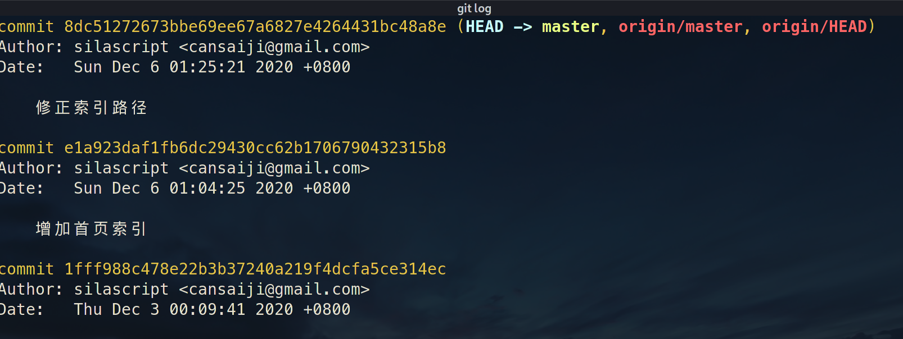
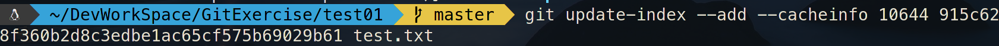
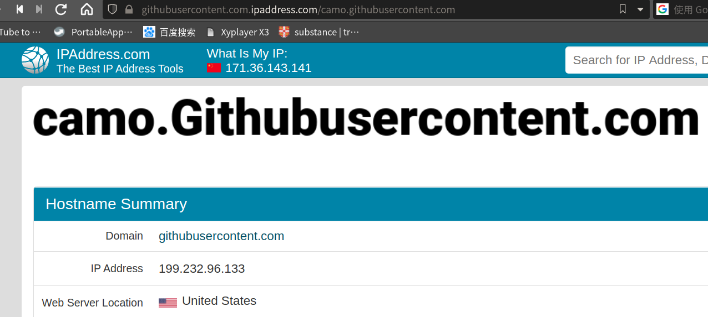

# Git 笔记

---

## 目录

* [Git 基本操作](#git_basic)
* [Github 使用](#git_github)
	* [Github 加速](#git_github_acceleration)
		* [改 Host 文件](#git_github_host)
			* [Host 小工具](#git_github_host_tools)
		* [Github 镜像](#git_github_mirrors)
	* [Gist](#git_github_gist)
	* [Token](#git_github_token)

---

## <span id="git_basic">Git 基本操作</span>

### 基本配置

```shell
git config --global user.name "用户名"
git config --global user.email "邮箱"

```

### 基本流程操作

#### 提交大概流程

1. **初始化**:

```shell
git init
```

2. **向暂存区添加新修改**:

> ```shell
> git add 要添加的文件
> ```
>
> 如果添加所有文件可使用:
>
> ```shell
> git add .
> ```

3. **提交到本地版本库**:

```shell
git commit -m "提交注释"
```

4. **提交到远程版本库**:

```shell
git push
```

push命令完整语法:

```shell
git push 远程名 本地分支:远程分支

#关联远程仓库
git push --set-upstream 远程名 本地分支:远程分支
```

如出现`更新被拒绝，因为远程仓库包含您本地尚不存在的提交。`这样的错误时，可以选择「强推」：

```shell
git push origin +master
```

#### 从远程获取数据

* **从远程版本库克隆到本地**:

```shell
git clone 地址 [本地版本库名称]
```

* **从远程版本库获取数据到本地**:

```shell
git fetch 地址
```

**fetch** 命令并不会自动合并或修改你当前的工作

如果要自动合并远程数据到本地，应使用**pull**命令:

```shell
git pull
```

pull完整语法:

```shell
git pull 远程名 本地分支:远程分支


```

#### <span id="git_rm">rm 操作</span>

解除暂存区的缓存，工作区文件保持不动：

```shell
git rm --cached 文件
```

这里的 `rm` 不是真的删除该文件，而是将此文件从 git 的管理范围移除，也就是说 git 管不到这文件了。

这个操作正好与 `add` 操作相反，add 是将工作区的文件添加进暂存区中，而 `rm` 操作是将暂存区的文件从暂存区中移除。

如果的目录，最好加个`-r` 这样能把目录中的子目录也一并删除。

示例：`git rm -r --cached 目录`

#### <span id="git_tag">tag 操作</span>

查看所有tag：

```shell
git tag 
```

添加tag：

```shell
git tag -a tag名称
```

添加并指定tag信息：

```shell
git tag -a tag名称 -m "tag信息"
```

示例：

```shell
git tag -a v1.12 -m "1.12版本"shell
```

删除tag：

```shell
git tag -d tag名称
```

查看tag状态：

```shell
git show tag名称
```

提交所有未提交的tag：

```shell
git push origin --tags
```

---

### <span id="git_branch">分支</span>

#### <span id="git_branch_config_global_defaultbranch">配置默认分支</span>

```shell
git config --global init.defaultBranch <名称>
```

设置完默认分支后，可以查看 `~/.gitconfig` 配置文件，可以看到如下的内容：

```
[init]
   defaultBranch = main
```

#### <span id="git_branch_showbranch">显示当前分支</span>

```shell
git branch
```

如果本地仓库只进行了`git add` 操作，从未有 `git commit` 操作，将不会生成任何分支。

而第一次 `git commit` 后生成默认分支，原来未设置全局默认分支名称前，默认分支都叫「master」。

如果你的仓库`git init` 在你，设置全局默认分支名称之前，那你 `commit` 后生成的分支仍叫 「master」。

#### <span id="git_branch_chockout">切换分支</span>

```shell
git checkout 分支名
```

#### <span id="git_branch_midify">修改分支名</span>

```bash
git branch -M 名称
```

---

### 常用辅助操作

#### 查看版本当前状态

```shell
git status
```


#### 查看提交日志

```shell
git log
```



#### 查看当前分支

```shell
git branch
```


更多的分支操作请参考：[分支操作](#git_branch)

#### 查看暂存区

```shell
git ls-files -s
```


---

### <span id="git_remote">远程相关</span>

#### 查看远程库信息

```shell
git remote show 远程版本库名称
```


查看远程仓库信息：

```shell
git remote -v 
```

#### 修改远程仓库地址

方法三种：

1. 使用remote set-url 选项

```shell
git remote 仓库名 set-url 远程仓库地址
```

2. 先删后加

```shell
git remote rm 远程仓库名
git remote add 远程仓库名 远程仓库地址
```

`git remote add` 这种方式关联远程仓库，远程仓库必须为空，不然 `push` 会出问题，除非你「强推」。

3. 直接修改config文件

在目录下有一个.git目录，是存放git相关的数据，其中有一个config文件，是存储一git相关配置，其中就有远程仓库地址，将其修改即可。

#### 非空本地库与非空远程库关联

本地库`commit` 完了，再关联远程库：

```shell
git remote add 远程库名称 远程库地址
```

试着使用 `git push -u origin main` 看能不能 `push` 成功，由于远程库非空，所以不可能成功，会有如下错误提示：

```
提示：更新被拒绝，因为远程仓库包含您本地尚不存在的提交。这通常是因为另外
提示：一个仓库已向该引用进行了推送。再次推送前，您可能需要先整合远程变更
提示：（如 'git pull ...'）。
提示：详见 'git push --help' 中的 'Note about fast-forwards' 小节。
```

处理这种问题，就得使用以下命令：

```shell
git pull --rebase origin main
```

> 使用 ` git pull --rebase  ` 命令前提是工作区干净。

经过这个特殊的 `pull`，因为远程和本地都是非空，所以肯定是出现冲突，一般来说，新建的远程，可能是因为 `README.md` 文件或授权文件而冲突。

`git rebase`，顾名思义，就是*重新定义*（re）*起点*（base）的作用，即重新定义分支的版本库状态。

`git pull --rebase` 执行过程中会将本地当前分支里的每个提交（commit）取消掉，然后把将本地当前分支更新为最新的 `origin` 分支。

`git pull --rebase` 执行后如果有合并冲突，使用以下三种方式处理这些冲突：

* `git rebase --abort` 会放弃合并，回到rebase操作之前的状态，之前的提交的不会丢弃
* `git rebase --skip` 则会将引起冲突的 `commit` 丢弃掉
* `git rebase --continue` 合并冲突，结合 `git add 文件` 命令一起用与修复冲突，提示开发者，一步一步地有没有解决冲突

第三种最常用，`git rebase --continue` 就可以线性的连接本地分支与远程分支，无误之后就回退出，回到主分支上。

执行完`git rebase --continue` 后，就能正常 `git push`了，这时本地仓库就与远程仓库正常「关联」起来了。

---

## Git 底层命令

#### 基本概念

Git 的核心部分是一个简单的键值对数据库(key-value data store)。 你可以向该数据库插入任意类型的内容,它会返回一个键值,通过该键值
可以在任意时刻再次检索(retrieve)该内容。

#### 重要部件

* **objects**目录: 存储所有数据内容

* **refs**目录:    存储指向数据(分支)的提交对象的指针

* **HEAD**文件:  指示目前被检出的分支

* **index**文件:  保存暂存区信息


#### Git对象

###### 常用命令

**hash-object**

> **-w** 选项指示 **hash-object** 命令存储数据对象;若不指定此选项,则该命令仅返回对应的键值。 **-w** 后跟要生成hash值的源目标。
>
> **--stdin** 选项则指示该命令从标准输入读取内容;若不指定此选项,则须在命令尾部给出待存储文件的路径。 该命令输出
> 一个长度为**40**个字符的校验和。 这是一个 SHA-1 哈希值——一个将待存储的数据外加一个头部信息
> (header)一起做 SHA-1 校验运算而得的校验和。

示例:

```shell
echo "hello world" | git hash-object --stdin
```

结果:


如果没有使用**-w** 选项，则在**objects**目录中不会生成相应的子目录.如下图:


而使用**-w** 选项后，则会在**objects**目录中生成相应的子目录及文件，其目录名为hash值最高**2**位，剩下**38**位为文件名，如下图:


又如：


**cat-file**

> **cat-file** 命令从 Git 那里取回数据。
>
> **-p** 选项可指示该命令自动判断内容的类型,并为我们显示格式友好的内容。
>
> 前提是存在相应hash object。既**hash-object**命令执行时，使用了**-w**选项，即将生成的hash object对象存储进**objects**目录。
>
> 如果hash object对象没找到则会报异常，如下图所示:
>
> 
>
> **-t** 选项,可以让 Git 告诉我们其内部存储的任何对象类型

示例:

```shell
git cat-file -p 3b18e512dba79e4c8300dd08aeb37f8e728b8dad
```

结果:


#### 树对象



---

## Git 问题

clone 出现 `SSL certificate problem: certificate has expired` 错误。

```shell
 git config --global http.sslVerify false
```

---

## <span id="git_github">GitHub使用</span>

### <span id="git_github_acceleration">Github加速</span>

Github 因为众所周知的原因非常的慢，所以得通过一些「小手段」来提速。

方式无非就几种：

* 改 host 文件
* 镜像网站
* 代理

#### <span id="git_github_host">改 Host 文件</span>

Github 访问慢可以使用重设 Host 映射解决。

步骤:

1. 检测可用的ip

		`````````
		 ````````
		  ```````
		   ``````
		    `````
		     ````
		      ```
		       > 有两个常用网站可以检测
		       >
		       > * <http://ping.chinaz.com>
		       >
		       > 
		       >
		       > * <https://www.ipaddress.com>
		       >
		       > 
		      ```
		     ````
		    `````
		   ``````
		  ```````
		 ````````
		`````````

检测出的 ip，最好自己 **ping**一下，选速度比较快的几个。

2. 设置 Host 文件

> 在 linux 下 Host 文件路径是 `/etc/hosts`
>
> **修改 Host 文件**，需要 root 权限
>
> host 映射格式: **"ip 地址"**
>
> 例子：
>
> ```ini
> 140.82.113.4 github.com
> ```

需要重新设置 Host 的地址:

> * github.com
>
> * gist.github.com
>
> * github.githubassets.com
>
> * raw.githubusercontent.com
>
> * camo.githubusercontent.com
>
> * avatars0.githubusercontent.com
>
> * avatars1.githubusercontent.com
>
> * avatars2.githubusercontent.com
>
> * avatars3.githubusercontent.com
>
> * user-images.githubusercontent.com
>
> * github-cloud.s3.amazonaws.com
>
> * assets-cdn.github.com

***.githubusercontent.com** 这几个地址跟图片相关,如果 github 能访问但图片加载慢或加载不出来，就得配这几个地址了！

##### <span id="git_github_host_tools">Host 小工具</span>

手动改 Host 略显麻烦，可以使用一些工具进行自动化完成。

1. github hosts ip 映射库: [GitHub520](https://github.com/521xueweihan/GitHub520)

2. hosts管理小工具: [SwitchHosts](https://github.com/oldj/SwitchHosts)

		`````````
		 ````````
		  ```````
		   ``````
		    `````
		     ````
		      ```
		       SwitchHosts与GitHub520配合使用，能够方便快速使用最新的ip映射github相关的网址s
		      ```
		     ````
		    `````
		   ``````
		  ```````
		 ````````
		`````````

###### 相关 host 地址

* [Github520 host 文件地址](https://raw.githubusercontent.com/521xueweihan/GitHub520/main/hosts)
* [GitHub520 host 文件加速地址](https://raw.hellogithub.com/hosts)

---

#### <span id="git_github_mirrors">Github 镜像</span>

换ip有时只有解决访问github网站问题，而clone操作仍会卡住，那么这就使用国内github的镜像网站来替换了。

命令如下：

```shell
git config --global url."https://hub.fastgit.xyz/".insteadOf https://github.com/
```

注意：地址一定不能省略最后的**"/"**

取消设置:

```shell
git config --global --unset url.https://github.com/.insteadof
```

国内镜像：

> 所有的镜像都是暂时性的，你不知道哪天就挂了！

* ~~[github.com.cnpmjs.org](https://github.com.cnpmjs.org/)~~
* ~~[hub.fastgit.org](https://hub.fastgit.org)~~
* [hub.fastgit.xyz](https://hub.fastgit.xyz)
	* [fastgit文档](https://doc.fastgit.org)
* [gitclone.com](https://gitclone.com)
* ~~[hub.gitfast.tk](https://hub.gitfast.tk)~~
* ~~[hub.おうか.tw](https://hub.xn--p8jhe.tw)~~
* ~~[hub.連接.台灣](https://hub.xn--gzu630h.xn--kpry57d)~~
* [nuaa](https://hub.nuaa.cf/)
* [gitslow](https://hub.gitslow.tk/)

---

#### 旁门左道的加速 git

使用 [steam++](https://steampp.net/) 来加速 git 访问。


速度真的可以啊！而且这个软件是全平台的，Windows、mac 和 Linux 都支持。

类似的还有网易的 [UU加速器](https://uu.163.com/)，不过 **UU加速器**没有 Linux 版本。

---

---

### <span id="git_github_gist">Gist</span>

新建 gist：

1. 点击 **Your gists** 进入 gist页面
2. 点 **+** 添加
3. 输入 gist 名称和描述

### <span id="git_github_token">Token</span>

新建一个 token：

1. settings
2. Developer settings
3. Personal access tokens
4. Generate new token

> 在新建 token 页面，选择 token 的生命周期 Expiration\
> 勾选 使用范围（**Select scopes**）\
> 点击 **Generate token** 按钮，这就生成一个新的 token
