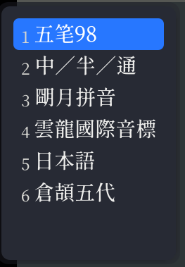

---
aliases:
  - 
tags:
  - rime
  - yaml
  - ime
created: 2023-08-18 19:44:52
modified: 2023-08-23 11:51:03
---
# Rime 笔记

[Rime](https://rime.im) 是一个输入法引擎。

[Rime 的简介和历史](https://github.com/rime/home/wiki/Introduction)

---
## 目录
* [安装](#rime_install)
* [打字操作](#rime_input)
* [设置](#rime_config)

---
## <span id="rime_install">安装</span>

### Linux 下安装

Linux 下安装 Rime 有基于「IBus」框架和「Fcitx」框架两种。

基于 IBus 框架：

#### ArchLinux
```shell
pacman -S ibus-rime
```

#### Ubuntu
```shell
sudo apt-get install ibus-rime
```

---
## <span id="rime_input">打字操作</span>

### 方案切换

通用使用 `Ctrl+~` 或 `F4` 来切换输入法方案。如下图：



可以使用 `Ctrl+~` 来向下选择输入方案，也可以使用方向键选择。

---
## <span id="rime_config">设置</span>

ibus-rime 的配置文件存在目录是在：`~/.config/ibus/rime/`

* `default.custom.yaml`：核心配置、全局配置
* `weasel.custom.yaml`、`squirrel.custom.yaml`：平台相关配置
> [!tip] linux 平台
> [Linux](../Linux/Linux_Note.md) 平台有两套实现：ibus 和 fcitx。
> 所以对应的 rime 就是 **ibus-rime** 和 **fcitx-rime**
* <方案标识>.custom.yaml：对预设输入方案的配置
* <名称>.dict.yaml：词典

> [!tip]
> rime 中的配置文件都是 [YAML](../YAML/YAML_Note.md) 格式，所以配置时要严格遵循 YAML 语法。

### vim 输入法切换

解决 vim 或其他支持 vim 模式的编辑器中，输入法切换的麻烦，可以使用 `app_options` 选项中针对指定软件 vim 模式的配置。

在平台配置文件，诸如 `weasel.custom.yaml` 或 `squirrel.custom.yaml` 中配置以下配置：

```yaml
app_opsions:
	com.apple.Terminal: # 终端  
		ascii_mode: true  
		vim_mode: true  
	com.googlecode.iterm2:  
		ascii_mode: true  
		vim_mode: true  
	com.microsoft.VSCode: # Visual Studio Code  
		ascii_mode: true  
		ascii_punct: true # 中文状态输出英文标点(半角)  
		vim_mode: true  
	md.obsidian:  
		ascii_mode: true  
		vim_mode: true
```

> [!tip] 关于「app_options」
> [ibus-rime不支持 `app_options`](https://github.com/rime/ibus-rime/issues/96)！所以在 linux 下使用的 rime「无缘」这个配置功能了。真是悲剧！

---

## 输入法列表

### 汉语输入法

* [rime-wubi98](https://github.com/lotem/rime-wubi98 "五筆98版 Rime 輸入方案")
* [arzyu/rime-wubi98](https://github.com/arzyu/rime-wubi98)
* [shrekuu/rime-wubi98](https://github.com/shrekuu/rime-wubi98)
* [ThreeDefenders/my-wubi-98](https://github.com/ThreeDefenders/my-wubi-98 "在lotem/rime-wubi98基础上修改的")

### 日语输入法

* [日语输入法](https://github.com/gkovacs/rime-japanese)
* [Rime-KappaJP](https://github.com/momijineko/Rime-KappaJP "Rime 河童日本語五筆字型入力方法")

### 音标

* [rime英语音标输入方案。](https://github.com/mapleafly/rime-ipa-english)
* [IPA / 國際音標輸入方案](https://github.com/rime/rime-ipa)
* 

---

## 相关联接

* [官方说明书](https://github.com/rime/home/wiki/UserGuide)
* [Plum](https://github.com/rime/plum)

