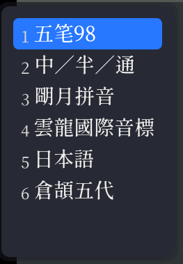

# Rime 笔记

[Rime](https://rime.im) 是一个输入法引擎。

[Rime 的简介和历史](https://github.com/rime/home/wiki/Introduction)

---
## 目录
* [安装](#rime_install)
* [打字操作](#rime_input)
* [设置](#rime_config)
* [输入方案](#输入方案)

---
## <span id="rime_install">安装</span>

### Linux 下安装

Linux 下安装 Rime 有基于「IBus」框架和「Fcitx」框架两种。

基于 IBus 框架：

#### ArchLinux

```shell
pacman -S ibus-rime
```

#### Ubuntu

```shell
sudo apt-get install ibus-rime
```

#### ibus 相关命令

重启 ibus 服务：

```shell
ibus restart
```

---

## 常用操作

### 特殊符号输入

[特殊字符](#特殊字符) 输入，可以查看 `symbols.yaml` 的定义就好了。

* 拼音字母：`/py`
* 注音符号：`/zy`
* 星座符号：`/xz`
* 罗马数字：`/lm`

### 输入码输出

如果想让输入的码输出，而非汉字输入，可以使用 `Ctrl+Return`或`Shift+Return` 实现。

---

## 概念

### 方案

「**方案**」就是包括码表在内的一套输入方案。

## <span id="rime_input">打字操作</span>

### 方案切换

通用使用 `Ctrl+~` 或 `F4` 来切换输入法方案。如下图：



可以使用 `Ctrl+~` 来向下选择输入方案，也可以使用方向键选择。

---
## <span id="rime_config">设置</span>

ibus-rime 的配置文件存在目录是在：`~/.config/ibus/rime/`

* `default.custom.yaml`：核心配置、全局配置
* `weasel.custom.yaml`、`squirrel.custom.yaml`：平台相关配置
> [!tip]
> 
> [Linux](../Linux/Linux_Note.md) 平台有两套实现：ibus 和 fcitx。
> 所以对应的 rime 就是 **ibus-rime** 和 **fcitx-rime**
* <方案标识>.custom.yaml：对预设输入方案的配置
* <名称>.dict.yaml：词典

> [!tip]
> 
> rime 中的配置文件都是 [YAML](../YAML/YAML_Note.md) 格式，所以配置时要严格遵循 YAML 语法。

`default.custom.yaml` 配置是针对所有输入 [方案](#方案) 的自定义配置文件。

而针对单独 [方案](#方案) 而配置文件，其文件名：`x.custom.yaml`，这里的 `x` 就是 `xxx.scheme.yaml` 方案描述文件那个方案名称。

如 `wubi98.schema.yaml`，如果要对这个方案做自定义配置，那配置文件就应该为 `wubi98.custom.yaml`。

无论是 `default.custom.yaml` 还是各方案自定义配置文件，其实都是给默认配置「打补丁」，所以 `yaml` 文件的根都是 `patch`。

> [!note] 参考资料
> 
> * [weasel issues 6](https://github.com/rime/weasel/issues/6)
> * [定制指南](https://github.com/rime/home/wiki/CustomizationGuide)

### 常用配置

#### 繁简转换

其实就是配 `simplication`，`reset` 为 `1` 就开启繁体转简体，如果设为 `0`，就不开启。

> [!tip] 
> 
> 开启繁转简，在候选菜单中所有码表中的繁体都显示为简体，如五笔 98 为例：繁体的「書」的五笔码为 `vfjf`，如果开启繁转简，候选菜单只会显示简体的「书」。

```yaml
patch:
  switches:
   - name: simplification
    reset: 1                # 增加這一行：默認啓用「繁→簡」轉換。
    states: [ 漢字, 汉字 ]
```

#### 特殊字符

特殊字符默认是放在 `symbols.yaml` 文件中。

如果想要在某输入方案中使用默认的特殊字符，得对 `xxx.schema.yaml` 或 `xxxx.custom.yaml` 文件进行配置以下两处配置：

1. 启用特殊符号
```yaml
  punctuator:
    import_preset: symbols
```
2. 配置识别器 `recognizer` 中的模式 `patterns`：
   
```yaml
recognizer:
  patterns:
    punct: "^/[a-z]+$"
```

> [!tip] 
> 
> `patterns` 中，`punct` 就是配置 `punctuator` 的触发模式，使用的是「正则表达式」。
> 
> 例子中 `^/[a-z]+$` 的意思是：以 `/` 符号就触发特殊符号输入。

以 `wubi98.custom.yaml` 文件为例：

```yaml
patch:
  switches:
  - name: ascii_mode
    reset: 0
    states: [ 中文, 英文 ]
  - name: full_shape
    states: [ 半角, 全角 ]
  - name: extended_charset
    states: [ 通用, 增廣 ]
  - name: ascii_punct
    states: [ 。，, ．， ]
  - name: simplification
    reset: 0
    states: [ 漢字, 汉字 ]
  punctuator:
    import_preset: symbols
  recognizer:
    import_preset: default
    patterns:
      reverse_lookup: "^z[a-z]*$"
      punct: "^/[a-z]+$"
```

### vim 输入法切换

解决 vim 或其他支持 vim 模式的编辑器中，输入法切换的麻烦，可以使用 `app_options` 选项中针对指定软件 vim 模式的配置。

在平台配置文件，诸如 `weasel.custom.yaml` 或 `squirrel.custom.yaml` 中配置以下配置：

```yaml
app_opsions:
	com.apple.Terminal: # 终端  
		ascii_mode: true  
		vim_mode: true  
	com.googlecode.iterm2:  
		ascii_mode: true  
		vim_mode: true  
	com.microsoft.VSCode: # Visual Studio Code  
		ascii_mode: true  
		ascii_punct: true # 中文状态输出英文标点(半角)  
		vim_mode: true  
	md.obsidian:  
		ascii_mode: true  
		vim_mode: true
```

> [!tip] 关于「app_options」
> [ibus-rime不支持 `app_options`](https://github.com/rime/ibus-rime/issues/96)！所以在 linux 下使用的 rime「无缘」这个配置功能了。真是悲剧！

### rime 的一些小问题

#### 莫名激活缩放功能

默认情况，使用 **Ctrl+\`** 快捷键用来切换不同 [方案](#方案切换) 的。但在某些软件中使用这个快捷键切换方案，会使得另一些软件的缩放功能被激活。

在 [SublimeText](../Editors/Editors_Note.md#editors_sublime) 和 gedit 中，进行 [方案切换](#方案切换) 操作，就会使得各浏览器、目录窗口的缩放功能被激活，如果这时在浏览器或目录窗口中，滚动鼠标中键，那就不是页面的上下滚动，而且是页面的放大缩小，只有再按一次 `Ctrl+``，缩放功能才关闭。

推测出现这种情况，大概是因为浏览器、目录窗口等缩放功能本就是使用是长按 `Ctrl` 键配合鼠标中键的滚动可实现缩放的，所以当 rime使用 `Ctrl+``切换方案时，有可能其中有什么bug，使得浏览器及目录窗口认为你在按着`Ctrl` 键不放，所以这时你滚动鼠标中键，就成了页面缩放了。

这个情况，在 [VSCode](../Editors/VSCode_Note.md)、[Obsidian](../NoteSoft/Obsidian/Obsidian_Note.md) 中并没有发生。而且在浏览器输入框内使用 `Ctrl+`` 切换方案，也同样没有发生缩放功能被激活的状态。

> [!bug] 
> 
> [很奇怪的现象 · Issue #1533 · rime/home · GitHub](https://github.com/rime/home/issues/1533)

`F4` 快捷键与 **Ctrl+\`** 快捷键作用一样，所以尽量使用 `F4` 快捷键 -- 而且**Ctrl+\`** 快捷键也与如 [VSCode](../Editors/VSCode_Note.md) 的调出终端快捷键冲突，所以尽量避免使用 **Ctrl+\`**。

当然禁用这个快捷键是最好的选择。`.config/ibus/rime/default.yaml` 配置文件中，`switcher` 节点中，`hotkeys` 节点下，`- Control+grave`，这个就是 **Ctrl+\`** 快捷键的配置，将其注释就可以了（yaml 文件使用 `#` 来注释）。

---

## 东风破

[東風破](https://github.com/rime/plum) （Plum）是一个快速安装 [输入方案](#输入方案) 的小工具。

### 常用操作

安装输入方案：

```shell
bash rime-install 输入法名称
```

更新 Plum 本体：

```shell
bash rime-install plum
```

---

## 输入方案

### 汉语输入方案

#### 五笔

* [rime-wubi98](https://github.com/lotem/rime-wubi98 "五筆98版 Rime 輸入方案") 
  > [!info] 
  > 
  >`wubi98.dict.yaml` 文件大小 `1.8 MB`
* [arzyu/rime-wubi98](https://github.com/arzyu/rime-wubi98) 
  > [!info] 
  > 
  > `wubi98.dict.yaml` 文件大小 `1.07 MB`
* [shrekuu/rime-wubi98](https://github.com/shrekuu/rime-wubi98) 
  > [!info] 
  > 
  > `wubi98.dict.yaml` 文件大小 `800 KB`
* [ThreeDefenders/my-wubi-98](https://github.com/ThreeDefenders/my-wubi-98 "在lotem/rime-wubi98基础上修改的")
  > [!info] 
  > 
  > `wubi98.dict.yaml` 文件大小 `1.81 MB`
* [yanhuacuo/98wubi-unicode: 98五笔超大字符集码表](https://github.com/yanhuacuo/98wubi-unicode)

#### 仓颉

* [rime-cangjie: 【倉頡】輸入方案](https://github.com/rime/rime-cangjie)
* [Jackchows/Cangjie5](https://github.com/Jackchows/Cangjie5)
* [rime-aca/rime-cangjie6: 蒼頡檢字法](https://github.com/rime-aca/rime-cangjie6)
* [LEOYoon-Tsaw/Cangjie6: 蒼頡檢字法](https://github.com/LEOYoon-Tsaw/Cangjie6)
* [RIME 倉頡輸入法方案集成](https://github.com/cangjie-system/rime-cangjie-integrated)

### 日语输入方案

* [日语输入法](https://github.com/gkovacs/rime-japanese)
* [Rime-KappaJP](https://github.com/momijineko/Rime-KappaJP "Rime 河童日本語五筆字型入力方法")

### 音标及拼音

#### 国际音标

* [rime英语音标输入方案。](https://github.com/mapleafly/rime-ipa-english)
* [ipa_xsampa](https://github.com/rime/rime-ipa)

安装国际音标：

```shell 
bash rime-install ipa
```

包括了两种输入方案：

* x-sampa
* 雲龍 IPA

启用输入方案，只需在 `default.custom.yaml`，添加相应的`schema` 项就好了：

```yaml
patch:
  schema_list:
    - schema: wubi98
    - schema: luna_pinyin
    - schema: cangjie5
    - schema: cangjie5_express
    - schema: cangjie6
    - schema: cangjie6_express
    - schema: japanese
    - schema: ipa_xsampa
    - schema: ipa_yunlong
```

> [!info] 
> 
> * x-sampa 的 schema 名叫：`ipa_xsampa`
> * 雲龍 IPA 的 schema 名叫：`ipa_yunlong`

#### 拼音

* [地球拼音](https://github.com/rime/rime-terra-pinyin)
* [朙月拼音](https://github.com/rime/rime-luna-pinyin)

#### 地球拼音

使用 [东风破](#东风破) 安装：

```shell
bash rime-install terra-pinyin
```

此方案可以输入声调。只用在音节末尾加上 `-` `/` `<` `\` 就能输入汉语拼音的四个声调了。

##### 输出拼音

按 `Ctrl+Return`或`Shift+Return` 输出已編輯的拼音。因为此输入方案自身是支持声调的，所以输出的拼音字母是带声调的。

> [!tip] 
> 
> 省略声调或韵母时，于字词旁显示其完整拼音标注。 按 `Ctrl+Shift+Return` 送出高亮选中字词的完整拼音。

#### 朙月拼音

使用 [东风破](#东风破) 安装：

```shell
bash rime-install luna-pinyin
```

> [!important] 
> 
> 此方案不支持输入声调。

##### 输出拼音

按 `Control+Return`或`Shift+Return` 输出已編輯的拼音，但因为这个输入方案本身不支持声调，所以输出的拼音是不带声调的，其实如果使用这个输入方案输出拼音字母，不如按`Shift` 键切成英文模式，还更方便。所以如果要使用输出带声调的拼音字母，建议使用[地球拼音](#地球拼音)。

---

## 相关笔记

* [输入法笔记](IME_Note.md)
* [输入法资料清单](IME_Material.md)
* [Linux 笔记](../Linux/Linux_Note.md)

---

## 相关链接

* [官方说明书](https://github.com/rime/home/wiki/UserGuide)
* [Plum](https://github.com/rime/plum)
* [五笔小筑](https://wubi98.gitee.io/)
* [98五笔资源库](http://98wb.ysepan.com/)
* [sheepduke/rime-config](https://github.com/sheepduke/rime-config)
* [awesome-rime:基于 Rime 生态的输入法方案与配置资源集合项目 - AtomGit](https://gitcode.com/GitHub_Trending/aw/awesome-rime)

