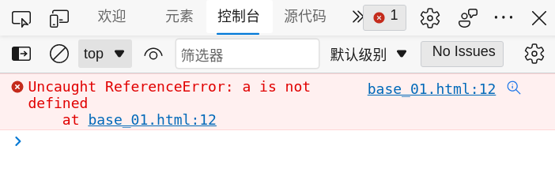
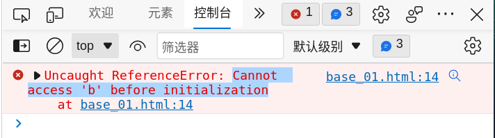
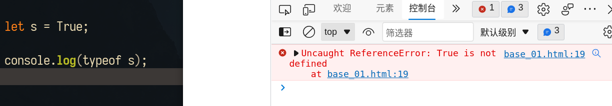

---
aliases:
  - 
tags:
  - javascript
  - js
created: 2023-01-31 11:31:14
modified: 2023-05-26 11:03:27
---
# JavaScript 笔记

## 目录

* [基础语法](#jsn_basic)
  * [变量](#jsn_basic_variable)
* [数据类型](#jsn_datatype)
  * [Undefined](#jsn_datatype_undefined)
  * [Null](#jsn_datatype_null)
  * [Boolean](#jsn_datatype_boolean)
  * [Number](#jsn_datatype_number)
    * [值的范围](#jsn_datatype_number_range)
    * [NaN](#jsn_datatype_number_NaN)
* [面向对象](#jsn_oop)
* [DOM 笔记](./DOM_Note.md)

---

### <span id="jsn_basic">基础语法</span>

#### <span id="jsn_basic_variable">变量</span>

有 3 个关键字可以声明变量：**var**、**const** 和 **let**。

**var** 在 ECMAScript 的所有版本中都可以使用。

**const** 和 **let** 只能在 ECMAScript 6 及更晚的版本中使用。

**var** 与 **let** 区别：
1. **var** 作用域是函数级；**let** 是块作用域（块作用域是函数作用域的子集）。

示例：
```javascript
{
  let a = 30;
}

console.log(a);
```
以上代码会报以下错误：



2. **var** 声明的变量存在「**声明提升**」（hoist），在使用 var 声明变量之前使用此变量，var 会将此变量自动提升到函数作用域的顶部；**let** 声明的变量不存在「**声明提升**」，在使用 let 声明的变量之前必须先声明此变量。在 **let** 声明之前的执行瞬间被称为「暂时性死区」（temporal dead zone），在此阶段引用任何后面才声明的变量都抛出 ReferenceError。

示例：
```javascript
console.log(b);

let b = 20;

```
以上代码会报以下错误：



3. **let** 声明的变量，不能被再次声明（**var** 可以重复声明相同的变量），即便其中一个声明是使用了 **var** 声明。
4. **let** 与 **var** 不同还在于，使用 **let** 在全局作用域中声明的变量不会成为 **window** 对象的属性（**var** 声明的变量则会）。

**const** 与 **let** 区别：

  **const** 的行为与 **let** 基本相同，唯一一个重要的区别是用它声明变量时必须同时初始化变量，且尝试修改 **const** 声明的变量会导致运行时错误。

ECMAScript6 增加 **let** 和 **const** 从客观上为这门语言更精确地声明作用域和语义提供了更好的支持。

### <span id="jsn_datatype">数据类型</span>

ECMAScript 变量可以包含两种不同类型的数据：原始值和引用值。

**原始值**（primitive value）就是简单数据。
**引用值**（reference value）则是由多个值构成的对象。

**简单数据类型（原始类型）**：
* Undefined
* Null
* Boolean
* Number
* String
* Symbol

#### <span id="jsn_datatype_undefined">Undefined 类型</span>

变量声明未初始化，就相当于给变量赋予了「Undefined」值。

永远不要显式地给某个变量设置「undifined」值。字面值 **undifined** 主要用于比较，而且在 ECMA-262 第 3 版之前是不存在的。

增加这个特殊值的目的就是为了正式明确空对象指针（null）和未初始化变量的区别。

**注意：**
> 无论已声明未初始化，还是连声明都没声明的变量，使用 **typeof** 返回都是「undifined」。
>
> 虽然逻辑上是对的，但严格来讲这两种变量存在根本性差异。
>
> 建议保持声明变量时同时初始化变量的好习惯，这样即使使用 **typeof** 返回「undifined」，也能分辨出变量是未声明，而不是声明了未初始化。

#### <span id="jsn_datatype_null">Null 类型</span>

Null 类型只有一个值，即特殊值 **null**。

逻辑上讲，**null** 值表示一个空对象指针，这也是使用 typeof 传一个 null，会返回「object」的原因。

**undifined** 是从 **null** 值派生而来的，因为 ECMA-262 将它们定义为表面上相等。

但两者用途完全不一样。

永远不要显式地将变量值设置为 **undefined**，但定义将来要保存对象值的变量时，可以使用 **null** 来初始化。这样可以保持 **null** 是空对象指针的语义，并进一步将其与 **undefined** 区分开来。

#### <span id="jsn_datatype_boolean">Boolean 类型</span>

Boolean 类型有两个字面值： **true** 和 **false**。

**注意**：布尔值的字面量 true 和 false 是区分大小写的，True 和 False 或其他大小混写形式是有效的标识符，但不是布尔值。



不同类型与布尔类型转换规则：

| 数据类型 | 转换为 true 的值 | 转换为 false 的值 |
| :---: | :---: | :---: |
| Boolean | true | false |
| String | 非空字符串 | "" （空字符串）|
| Number | 肯零数值 （包括无穷值）| 0、NaN |
| Object | 任意对象 | null |
| Undefined | N/A （不存在）| undefined |

#### <span id="jsn_datatype_number">Number 类型</span>

八进制字面量，必须是零（0）起头。

十六进制字面量，以「0x」起头。十六进制数字中字母大小写均可。

要定义浮点数，数值中必须包含小数点，而且小数点后面必须至少有一个数字。<br>
为了更高效利用内存空间，ECMAScript 总是想方设法把值转换成整数，如果小数虚后面没有数字，数值就会变成整数。

##### <span id="jsn_datatype_number_range">值的范围</span>：
  * 最小值：Number_MIN_VALUE
  * 最大值：Number_MAX_VALUE

  如果某个计算得到的数值结果走出了 JavaScript 可以表示的范围，这个数值会自动转换为一个特殊的 **Infinity**（无穷）值。<br>
负无穷大则是以 「**-Infinity**」表示。<br>

使用 **Number.NEGATIVE_INFINITY** 和 **Number_POSITIVE_INFINITY** 获取正、负 Infinity（这两个属性的值就是 -Infinity 和 Infinity）。

确定一个数值是否在数值范围，即非 **Infinity**，可以使用 **isFinite()** 函数来检测。

##### <span id="jsn_datatype_number_NaN">NaN</span>

NaN 的意思是 "Not a Number"，「不是数值」。用来表示本来要返回数值的操作失败。比如「除 0」操作。

ECMAScript 提供了 **isNaN()** 函数，用来判断传入的参数是否「不是数值」。<br>
该函数会尝试把传入的参数转换为数值。如涌转换为数值的值都会导致这个函数返回 **true**。

### <span id="jsn_oop">面向对象</span>

---

## <span id="jsn_aboutlinks">相关链接</span>

* [JS视频清单](./JS_Videos.md)

