# Eclipse 笔记

---

## <span id="java_eclipse">Eclipse 相关</span>

[Eclipse](https://www.eclipse.org/) 最初是由 [IBM](https://www.ibm.com/) 开发的下一代 IDE，2001 年 11 月 IBM 将其贡献给开源社区，由 Eclipse 基金会管理。

### 一些概念

#### 视图

视图：View 是 Eclipse 中各个显示区域，如编辑区、「Package Explorer」区等。

视图列表可以通过菜单「Window」-->「Show View」查看。

#### 透视图

透视图：Perspective 其实是 Eclipse UI 布局，即按工作需求，将多个 [视图](#视图) 的不同组合形式。

可以通过 Eclipse 右上角那个按钮「Open Perspective」 来查看各种透视图。

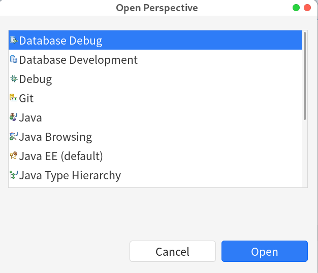

---

### Eclipse 目录结构

#### <span id="java_eclipse_plugindirectory">插件目录</span>

#### <span id="java_ecipse_workspace">工作空间</span>

#### Linux 下的 Eclipse 公共目录

[Linux_Note](../Linux/Linux_Note.md) 系统下，用户根下有一个 `.eclipse` 的目录，这是所有 eclipse 的共享目录。

### 创建 Eclipse 桌面图标

可以参考 [使用 desktop](../Linux/Linux_Note.md#linux_soft_install_desktop) 这个笔记来创建 Eclipse 的桌面图标。

示例：

```desktop
[Desktop Entry]

Name=Eclipse Committers 2023
Comment=Eclipse Committers 2023
Type=Application

Exec=/opt/JavaIDE/eclipse_com_2023/eclipse
Icon=/opt/JavaIDE/eclipse_com_2023/icon.xpm

Categories=Development;IDE

Terminal=false
StartupNotify=true

```

> [!tip] desktop 文件存在位置
> 可以在 `/usr/share/applications` 目录下创建，也可以在当前用户目录下的 `.local/share/applications` 目录下创建。

> [!tip] 记得刷新
> 
> ```shell
> # 刷用户目录
> update-desktop-database .local/share/applications
> # 刷根目录
> sudo update-desktop-database /usr/share/applications
>```

---

### <span id="java_eclipse_settings">Eclipse 设置</span>

1. 代码揭示
在「Editor」 -「 Content Assist」 -「Auto activation triggers for Java」中添加 26 字母：`abcdefghijklmnopqrstuvwxyzABCDEFGHIJKLMNOPQRSTUVWXYZ`

#### 字体和颜色

Eclipse 基础的字体和基本的颜色设置基本集中在「General」- 「Appearance」-「Color and Fonts」- 「Basic」选项下：

* `Text Font`：基础字体，主要是代码
* `Text Editor Block Selection Font`：选中代码字体，一般设置字体时将 [字重](../../Fonts/Fonts_Note.md#字重) 设置为「粗体」。
* `Dialog Font`：菜单上的字体

* `Content Assist background color`：代码提示窗口背景色
* `Content Assist foreground color`：代码提示窗口前景色

* `Information background color`：代码信息窗口背景色
* `Information foreground color`：代码信息窗口前景色

另外，「General」- 「Appearance」-「Color and Fonts」- 「Java」选项下：

* `javadoc background`：[Java](../Java_Note.md) 文档背景色，默认是使用「Basic」下 `Information background color`
* `Javadoc text color`：[Java](../Java_Note.md) 文档前景色，默认是使用「Basic」下 `Information foreground color`

#### 网络

##### 代理

「General」-「Network Connecctions」-「Proxy entries」选项，可以配置代理。

如果使用 [Clash](../../Ladder/Ladder_Note.md#Clash) 等梯子，可以配置下代理端口号。

将「Port」改成相应的端口号，再将「Provider」都改成手动「Manual」就可以了使用代理更新 Eclise 了。

#### Server

##### Tomcat 适配

如果在 「**Server**」新建 Server 时，没有 [Tomcat](../Tomcat/Tomcat_Note.md) 适配器，可以到 「**Install New Software**」 中的 [Eclipse 官方扩展](#Eclipse%20官方扩展) 中 「**Web, XML, Java EE and OSGi Enterprise Development**」 分类里找 「**JST Sever Adapters Extensions(Apache Tomcat)**」 这个扩展安装：

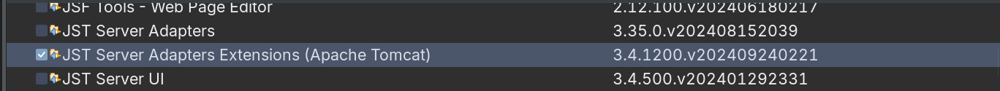

---

### <span id="java_eclipse_hotkeys">Eclipse 快捷键</span>

#### 窗口操作

`Ctrl+M`：最大化当前视图，看焦点在哪里哪里就最大化。

`Ctrl+W`：关闭当前窗口

`Ctrl+Shift+W`：关闭所有窗口

`Ctrl+F6`：编辑区下一个标签页

`Ctrl+Shift+F6`：编辑区上一个标签页

`Ctrl+F7`：下一个 [视图](#视图)，如将焦点从编辑区移到「Package Explorer」区就可以使用这个快捷键。 ^488e15

`F12`：激活编辑区，即将焦点从别的 [视图](#视图) 移回编辑区，这就不用 使用 [Ctrl+F7](#^488e15) 一个个视图跳了。

`Ctrl+Shift+F7`：上一个 [视图](#视图)，与上面的操作类似。

`Ctrl+F10`：显示 [视图](#视图) 菜单。

`Ctrl+F8`：下一个 [透视图](#透视图)

`Ctrl+Shift+F8`：上一个 [透视图](#透视图)

##### 注释

`Ctrl+/`：单行注释或取消注释

`Ctrl+Shift+/`：多行注释

`Ctrl+Shift+\`：取消行注释

`Shift+Alt+J`：给类或方法添加文档注释

##### 查找

`Ctrl+O`：显示当前类中方法和属性的大纲，支持搜索指定的方法、属性等

`Ctrl+T`：显示光标所在类的继承树结构

`Ctrl+Shift+T`：查找类，可以使用「*」、「？」等通配符。

`Ctrl+Shift+G`：查找类、方法和属性的引用。

`Ctrl+K`：搜索选中的单词，并向下跳转，如果光标跳到了结果最尾项，再按 `Ctrl+K` 会往回跳到结果首项。

`Ctrl+Shift+L`：显示所有 Eclipse 快捷键列表。

##### 代码或文本操作

`Ctrl+Shift+F`：格式化代码

`Ctrl+P`：光标跳转到上次编辑的位置。

`Crrl+Shift+P`：定位匹配符号，如 `{}`、`[]` 和 `()` 这些括号。

`Home`：跳转行首。

`End`：跳转么行尾。

`Ctrl+L`：跳转到某行。快捷键会弹出一个输入框，可以输入要跳转行的行号。

`Shift+Enter`：新建下一行，不用把光标移到行末再回车了。如果 Eclipse 装了 [Vrapper](#Vrapper) 插件，就可以使用 `o`（小写）来新建下一行。

`Ctrl+Shift+Enter`：新建上一行，不用把光标移到行首回车。如果 Eclipse 装了 [Vrapper](#Vrapper) 插件，就可以使用 vim 的 `O`（大写）来新建上一行。

`Ctrl+D`：删除当前行

`Alt+UP` 或 `Alt+Down`：将当前行的代码往上移或往下移

`Ctrl+Alt+UP` 或 `Ctrl+Alt+Down`：复制当前行到上一行或下一行

`Alt+Enter`：显示选中的当前项目或文件的属性

`Ctrl+1`：快速修复，对于未导包的类处理时非常有用，它可以快速导入所有依赖项。

`Ctrl+Shift+数字区的/`：折叠所有注释及代码

##### getter 和 setter 生成

2. `Shift+Alt+S`，呼出「Source」菜单 如果装了 [Vrapper](#Vrapper) 插件并装了 [Java extensions](#^491eb0) 子扩展，那就可以使用 `gm` 快捷键呼出「Source」菜单。
3. 按 `r`，呼出 getter 和 setter 配置菜单
4. 选择要生成 getter 和 setter 的属性，全选： `Alt+A`；取消所有： `Alt+D`；选择所有的 getter：`Alt+G`；选择所有 setter：`Alt+L`。
5. 回车或 `Alt+R`（如果 `Generate` 按钮失去焦点，就按 `Alt+R`）生成 getter 和 setter 。

##### 生成构造方法

6. `Shift+Alt+S`，呼出「Source」菜单，跟 [getter 和 setter 生成](#getter%20和%20setter%20生成) 完全一样
7. 按 `o`，呼出构造方法配置菜单
8. 选择构造方法所需的属性，如果全选就 `Alt+A`，取消所有选择就按 `Alt+D`
9. 回车或 `Alt+G`（如果 `Generate` 按钮失去焦点，就按 `Alt+G`）确认生成构造方法

---

### <span id="java_eclipse_plugins">Eclipse 常用插件</span>

#### Marketplace

Marketplace 是 Eclipse 的插件市场，通过它可以更方便地搜索和安装插件。

#### Eclipse 官方扩展

[https://download.eclipse.org/releases/latest](https://download.eclipse.org/releases/latest)

#### JustJ

[Eclipse JustJ](https://projects.eclipse.org/projects/technology.justj) 是一组开源的 Eclipse 插件，其内置了各个版本、各个平台的 [JRE](../Java_Note.md#JRE)。

---

#### jeeeyuls-eclipse-themes

[jeeeyul_theme](https://marketplace.eclipse.org/content/jeeeyuls-eclipse-themes) 是一个 Eclipse 界面主题插件。

#### 安装

在「Install New Software」里「Add」`http://eclipse.jeeeyul.net/update/`。

> [!tip] 
> 
> [Alternative Install · jeeeyul/eclipse-themes Wiki · GitHub](https://github.com/jeeeyul/eclipse-themes/wiki/Alternative-Install)

#### 配置

自用的自定义浅色主题：

```css

/*
 在内置的Light主题上修改
 主要修正 Package Explorer组件中浅色主题下项目名的前景色显示问题
*/

/* 主界面 */
Composite,
Composite > *{
	background-color: #EBEEF3;
 	color:#222;
}

/* 标签页 */
CTabItem:selected {

	color: '#org-eclipse-ui-workbench-ACTIVE_TAB_TEXT_COLOR';
}


.MPartStack ,.MPart{

	font-size:16px;
	color:#000;
	swt-tabNormalShadow-color:none;
}


.MPartStack *, .MPart *{
 background-color: #EBEEF3;
 color:#333;
}


.MPartStack {

	/* tab background */
	jtab-header-background : #d2dfec #c3d2e0 100%;
	jtab-border-color : #97a5b3 #97a5b3 100%;
	
	
	/* selected tabs */
	jtab-selected-tab-background: #ffffff #ffffff 100%;
	jtab-selected-border-color: #97a5b3 #97a5b3 100%;
	/*jtab-selected-text-shadow-color: none;*/

	/* unselected tabs */
	jtab-unselected-tabs-background: none;
	
	jtab-unselected-border-color: none;
	jtab-unselected-text-shadow-color: none;
	
	/* hover tabs */
	jtab-hover-color : #222;
	jtab-hover-tabs-background: none;
	
	jtab-hover-border-color: none;
	jtab-hover-text-shadow-color: none;
	
	jtab-chevron-color: #000000;
}


/* 面板active*/
.MPartStack.active{

  	jtab-header-background : #d2dfec #c3d2e0 100%;
	jtab-border-color : #97a5b3 #97a5b3 100%;
	background : #ffffff;
	jtab-selected-text-shadow-color: none;

}


/* 面板下的组件 */
.MPartStack.active > CTabItem,
.MPartStack.active > CTabItem CLabel {
    background-color: '#org-eclipse-ui-workbench-ACTIVE_TAB_BG_END'; /* HACK for background of CTabFolder inner Toolbars */
    color: '#org-eclipse-ui-workbench-ACTIVE_TAB_UNSELECTED_TEXT_COLOR';
}

/* Package Explorer 面板区 */
CTabFolder Tree,CTabFolder Canvas{
	background-color:#ebeef3;
    font-size: 16px;
    color:#000;
}


/* 表格、树型组件 */
Table,Tree,RegistryFilteredTree {
    background-color: #ebeef3;
    color: #333;
}

Table,Tree {
	/*表格头*/
	swt-header-color: #333;
	swt-header-background-color: #d2dee9;
}

/* 表格化Property 相关 */
TabbedPropertyTitle {
  swt-backgroundGradientStart-color:  #cbd9e7;
	swt-backgroundGradientEnd-color:    #cbd9e7;
}

TabbedPropertyList {
	swt-tabAreaBackground-color : #eee;
	swt-tabBackground-color: #eaeaea;
	color : #333;

}


/*内存状态栏*/
HeapStatus {
	background-color: #4F5355;
	color: #EEEEEE;
}
```

#### e4-spies

[e4 spies](https://marketplace.eclipse.org/content/e4-spies) 这个可能获取 Eclipse 界面各组件的 CSS ID，配合 [jeeeyuls-eclipse-themes](#jeeeyuls-eclipse-themes) 插件中的 CSS 样式，可以设置 Eclipse 界面样式。

#### colortheme

[colortheme](https://marketplace.eclipse.org/content/eclipse-color-theme) 这个与上面那个不同，这是插件是针对编辑区的配色插件。 Eclipse 市场中的 color-theme 插件地址已经失效。 请到 [这个页面](https://eclipse-color-theme.github.io/update/) ，其中有个链接： [download this update site as a zip archive](https://eclipse-color-theme.github.io/update/eclipse-color-theme-update-site.zip)，下载这个压缩包。将其中的 `features` 和 `plugins` 两个目录提取出来放到一个你自定义名称的目录中，如「color-theme」，将这个包括有 `features` 和 `plugins` 的目录放到 Eclipse 安装目录下的 `dropins` 目录中，重启 Eclipse ，这个插件就能生效了！

可以到：[eclise color-theme](https://eclipse-color-themes.web.app) 网站下配色。

#### Bracketeer

[Bracketeer](https://marketplace.eclipse.org/content/bracketeer-java-jdt) 是一个使用注释方式标识出匹配大括号的插件。Eclipse 插件市场中的 Bracketeer 插件的地址已经失效了，应自行通过 「Install new Software」 这个方式添加插件安装地址。~~安装地址：[https://chookapp.github.io/ChookappUpdateSite/](https://chookapp.github.io/ChookappUpdateSite/)~~
> [!tip] 
> 
> Bracketeer 的地址也已经失效，因为 Bracketeer2.x 版本已经在插件市场上架了，之前的老版本应该要淘汰了。

#### Eclipse explorer

[Eclipse explorer](https://marketplace.eclipse.org/content/eclipse-explorer)  [](https://github.com/Jamling/eclipse-explorer/releases) 是打开项目本地目录的插件。同样的，插件市场的地址也是失效了，得到 github 中下载。同 color-theme 一样，下载下的包是不能直接丢到 `dropins` 目录的，得把 `features` 和 `plugins` 目录提取出来。

> [!tip] explorer
> [Eclipse Explorer](https://marketplace.eclipse.org/content/eclipse-explorer) 这插件又在插件市场上架了。并且手动丢包到 `dropins` 目录方式，好像失效了 -- 至少在 Linux 上失效。
> 
> 安装地址为：[https://www.ieclipse.cn/PDESite/updates/](https://www.ieclipse.cn/PDESite/updates/)

#### Jcolon

[Jcolon](https://mystilleef.github.io/eclipse4-jcolon/) [](https://github.com/mystilleef/eclipse4-jcolon) 是一款自动补分号的插件。真是自动，不需要按快捷键。

#### EditBox

[EditBox](https://marketplace.eclipse.org/content/editbox) 是一款显示代码范围的插件。


如果不想使用插件市场安装，可以到 [sourceforge](http://editbox.sourceforge.net/updates/) 下载 `features` 和 `plugins` 两目录下的 `jar` 文件，把这两目录放到一个目录中，如 `editbox`，然后把这个目录放在 Eclipse 安装目录下 `dropins` 目录中，重启 Eclipse，就能生效。

有时使用 `dropins` 这种方式会失效，那就可以使用使用 `Install New Software` 方式来安装插件。

> editbox 安装地址：[http://editbox.sourceforge.net/updates](http://editbox.sourceforge.net/updates)

#### relative-line-number

[relative-line-number](https://marketplace.eclipse.org/content/relative-line-number-ruler) 相对行号。

##### 设置

10. 将 Eclipse 内置的行号功能关闭。

> [!tip]
> 
> `General`->`Editors`->`Text Editors`->`Show line numbers`

11. `Relative Number Ruler` 设置项中，勾选 `Show absolute value for current line number`，这样能显示光标所在行的绝对行号！

#### freemarker

[freemarker](https://marketplace.eclipse.org/content/freemarker-ide) freemarker 插件。这插件 github 地址：[https://github.com/ddekany/jbosstools-freemarker](https://github.com/ddekany/jbosstools-freemarker) 。

这个插件是从 [JBossTools Freemarker](https://github.com/jbosstools/jbosstools-freemarker) 插件中分支出来的，因为原版的插件在 JBoss Tools 4.5.3 时就已经被移除了，估计是 Freemarker 用得人太少，已经算是过时的技术了，所以 JBoss 就把这货从 JBoss Tools 中移除掉。

事实上这插件也已经有 2 年多没更新了，估计停止维护也不远了，现在还是能用的。不过估计随着 Eclipse 继续版本迭代，不兼容性迟早会出现，到时候是真的就用不了了！

#### SQL DAL Maker

[SQL DAL Maker](https://github.com/panedrone/sqldalmaker) 数据链接层生成插件

#### mybatipse

[mybatipse](https://marketplace.eclipse.org/content/mybatipse) [](https://github.com/mybatis/mybatipse/) MyBatis 插件。

  mybatis 中 xml、java 文件的各种功能增强，如自动完成、相关 sql 关联等，使用 mybatis 必装的插件。

#### MyBatis-Generator

[mybatis-generator](https://marketplace.eclipse.org/content/mybatis-generator) MyBatis 生成插件。

#### Vrapper

[Vrapper](https://marketplace.eclipse.org/content/vrapper/) 是一个在 Eclipse 上模拟 [vim](../vim/Vim_Note.md) 的插件。

这插件有几个子扩展，是 vim 下常用的插件模拟。

推荐安装大名鼎鼎的 [Surround](../vim/vim_plugin.md#Surround)。

另外，作为 Java 开发，也建议把 「Java extensions」这个扩展也勾选安装上。其实这个折展就是为 Eclipse 两个右键菜单添加 vim 式的快捷键： ^491eb0
* `gr` Eclipse 「refactor」（重构）菜单
* `gm`：Eclipse 「source」菜单

Vrapper 更详细使用请参考 [Vrapper Documentation](https://vrapper.sourceforge.net/documentation/?topic=introduction)。

---

#### Data Tools Platform

Data Tools Platform 是一套数据库管理插件组，能在 Eclipse 中进行数据库相关的操作。

这套插件，应该说是插件系列，有多个插件可选，下面简单介绍各插件的大概的功能：

##### Data Tools Platform Connectivity

勾选「**Data Tools Platform Connectivity**」后，会根据依赖装两组插件：

* **Data Tools Platform Connectivity**
* **Data Tools Platform SQL Development Tools**

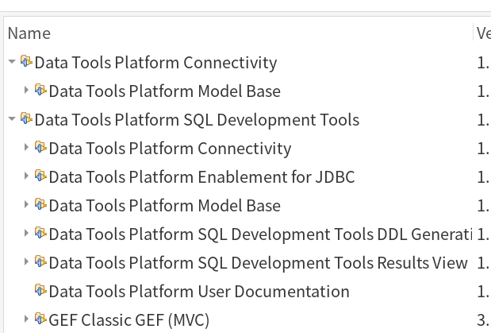

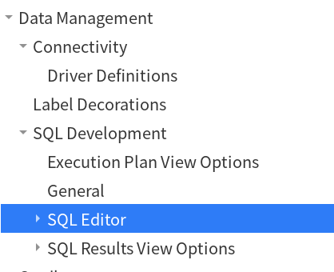

> [!info] 
> 
> 从图中可以看出，只装「**Data Tools Platform Connectivity**」就能实现数据库连接、SQL 等数据库管理的基础功能，其实对于只是「临时」连下数据库，作些简单的数据操作而言，这实际已经够用的了！
> 
> 不过，实际上，还是没法用的，因为连接这个功能，需要数据库的「连接驱动」，而只装「**Connectivity**」插件，只有通用 [JDBC](../Java_Servlet_Note.md#JDBC) 可选，所以得安装相应数据库连接驱动的支持。

##### Data Tools Platform Enablement

Data Tools Platform Enablement 是一个对各大数据库连接支持的插件。

勾选「**Data Tools Platform Enablement for MySQL**」后安装相应插件后，就会在新建链接时出现以下的选项：
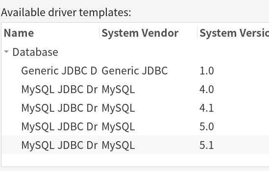

> [!tip] Enablement for MySQL
> 
> 在未装「**Data Tools Platform Enablement for MySQL**」时，只有「**Generic JDBC**」这个，装了这插件后就多了 [MySQL](../../DataBase/mysql/MySQL_Note.md) 相关连接驱动可选。

##### SQL Development Tools Data Functions

「**SQL Development Tools Data Functions**」主要功能是在数据库 Model 及 DDL 相关的。

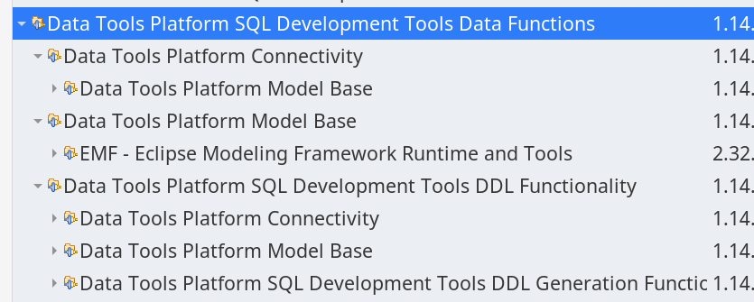

##### SQL Query Builder

「**SQL Query Builder**」 这个插件依赖 [SQL Parsers](#SQL%20Parsers) 插件，拟勾选「**SQL Query Builder**」时，会连 [SQL Parsers](#SQL%20Parsers) 插件也一起装了。

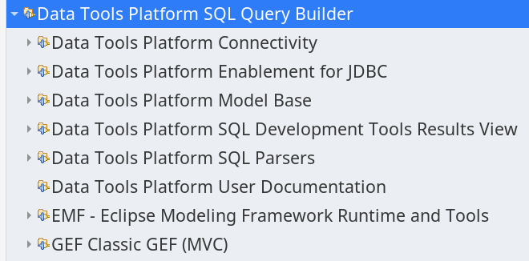

##### SQL Parsers

SQL Parsers 这是跟 Model 相关的，应该是模型转换器。

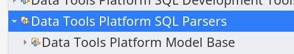

##### Open Data Access Designer

「**Open Data Access Designer**」 依赖 「**Open Data Access Designer Core**」，而「**Open Data Access Designer Core**」又依赖「**Open Data Access Designer Runtime**」，所以只用勾选「**Open Data Access Designer**」就可以将其他两个一起装了。

##### 对于 Eclipse 中使用数据库管理的总结

因为 [Data Tools Platform](#Data%20Tools%20Platform) 这套插件有点多，如果不知道装哪些，可以装 [Dali Java Persistence Tools](#Dali%20Java%20Persistence%20Tools) 这个插件，此插件是一个「持久化」插件，其中一个功能可以将数据库的表生成 Java 类，非常的方便，而这插件依赖了 DTP 部分基础插件。

实话 [Data Tools Platform](#Data%20Tools%20Platform) 这插件实在有点老，建议还是使用 [DBeaver](../DataBase/DataBase_Note.md#DBeaver) 的 [插件版](#DBeaver) 本来替代。

---

#### DBeaver

DBeaver 插件版是 [DBeaver](../DataBase/DataBase_Note.md#DBeaver) 的插件形式。

这比 [Data Tools Platform](#Data%20Tools%20Platform) 系列插件强太多，建议使用些插件替代。

此插件安装地址：[https://dbeaver.io/update/latest/](https://dbeaver.io/update/latest/)，可以通过添加这个址安装，当然也可以通过 [Marketplace](#Marketplace) ：[https://marketplace.eclipse.org/content/dbeaver](https://marketplace.eclipse.org/content/dbeaver) 来安装。

DBeaver 插件版也独立安装版功能一致，具体信息可以参考 [DBeaver 介绍](../DataBase/DataBase_Note.md#DBeaver)。

---

#### Dali Java Persistence Tools

[Dali Java Persistence Tools](https://projects.eclipse.org/projects/webtools.dali) 这是一个持久化插件。同样是跟数据库相关的，所以装它时，会将 [Data Tools Platform](#Data%20Tools%20Platform) 相关的插件也一并装了。

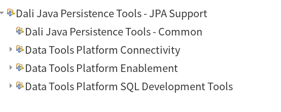

#### JBoss-Tools

[JBoss](https://www.jboss.org) 出的一套 Java 开发的插件包。

[JBoss-Tools](https://tools.jboss.org) 安装方式：

1. 通过 [Marketplace](#Marketplace) 安装
2. 也可以到 [官网](https://tools.jboss.org/downloads/) 下载插件包在本地安装。
3. 添加安装 URL 来安装。
> [!info] 
> 
> * 4.29.1： [https://download.jboss.org/jbosstools/photon/stable/updates/](https://download.jboss.org/jbosstools/photon/stable/updates/)
> * 4.30.x：[https://download.jboss.org/jbosstools/photon/snapshots/updates/](https://download.jboss.org/jbosstools/photon/snapshots/updates/)

##### 常用组件

###### Tomcat Integration

默认 Eclipse 的 Server 的适配器中没有 Tomcat，而 JBoss Tools 插件包中有一个「**JBoss Tools Apache Tomcat Integration**」插件，便是增加 [Tomcat](../Tomcat/Tomcat_Note.md) 的适配器。

装完这个插件后，在 Add 一个新的 Server 时，在适配器列表中就能看到 Tomcat 了：

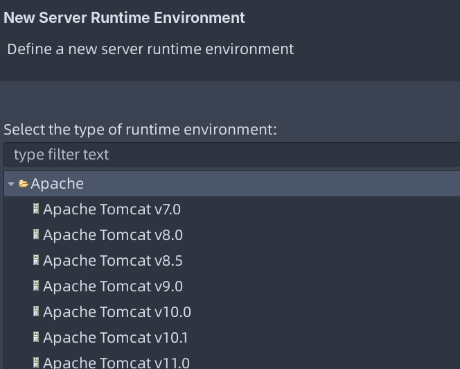

##### Server LaunchBar

「**JBoss Tools Server LaunchBar Integration** 」为工具栏添加 Server 运行整合工具：


#### Spring Tool Suite

[Spring](https://spring.io) 的开发套件。

除了可以通过下载 Spring 官方集成好的 Spring Tool Suite IDE，还可以在 Eclipse 里自己手动安装插件。

STS 三种安装方式：

1. 下载 STS 的离线安装压缩包，通过「Install New Package」中添加包的方式进行本地安装
2. 同样是通过「Install New Package」，不过这次是添加 STS 的 url 地址的方式安装
> [!info] 
> 
> 最新几个版本的**URL**：
>
> *  Eclipse 4.38: https://cdn.spring.io/spring-tools/release/update/e4.38/
> * Eclipse 4.36:  https://cdn.spring.io/spring-tools/release/TOOLS/sts4/update/e4.36/
> * Eclipse 4.35:  https://cdn.spring.io/spring-tools/release/TOOLS/sts4/update/e4.35/
>   
>   更多内容请参考：[Installation · spring-projects/spring-tools Wiki · GitHub](https://github.com/spring-projects/spring-tools/wiki/Installation#install-spring-tools-into-an-existing-eclipse-via-a-p2-repo)
>   
>   
>   最新的 Spring-Tools URL： https://cdn.spring.io/spring-tools/release/update/latest/
>   
1. 通过 [Marketplace](#Marketplace) 安装

> [!tip] 
> 
> 更多的安装细节请参考：[官方文档](https://github.com/spring-projects/sts4/wiki/Installation)

---

### Eclipse 各版本与 JDK 对应关系

> [!info] Eclipse 版本代号
> 从 2018 年 9 月开始，Eclipse 每 3 个月发布一个版本，并且版本僅不再延续天文星体名称，直接使用年份跟月份。

| 版本代号 |     代号名称     |  平台版本  |      发行日期       | 需要 JDK 版本 | 其他信息 |
|:--------:|:----------------:|:----------:|:-------------------:|:-------------:|:--------:|
|    IO    |   木卫一，伊奥   |    3.1     | 2005 年 6 月 28 日  |      N/A      |   N/A    |
| Callisto | 木卫四，卡里斯托 |    3.2     | 2006 年 6 月 26 日  |    JDK 1.4    |   N/A    |
|  Europa  |  木卫二，欧罗巴  |    3.3     | 2007 年 6 月 27 日  |    JDK 1.5    |   N/A    |
| Ganymed  | 木卫三，盖尼米得 |    3.4     | 2008 年 6 月 25 日  |    JDK 1.5    |   N/A    |
| Galileo  |      伽利略      |    3.5     | 2009 年 6 月 24 日  |    JDK 1.5    |   N/A    |
|  Helios  |      太阳神      |    3.6     | 2010 年 6 月 23 日  |    JDK 1.5    |   N/A    |
|  Indigo  |       靛蓝       |    3.7     | 2011 年 6 月 22 日  |    JDK 1.5    |   N/A    |
|   Juno   |       朱诺       | 3.8 及 4.2 | 2012 年 6 月 27 日  |    JDK 1.5    |   N/A    |
|  Kepler  |      开普勒      |    4.3     | 2013 年 6 月 26 日  |    JDK 1.6    |   N/A    |
|   Luna   |       月神       |    4.4     | 2014 年 6 月 24 日  |    JDK 1.6    |   N/A    |
|   Mars   |       火星       |    4.5     | 2015 年 6 月 24 日  |    JDK 1.7    |   N/A    |
|   Neon   |      霓虹灯      |    4.6     | 2016 年 6 月 22 日  |    JDK 1.8    |   N/A    |
|  Oxygen  |       氧气       |    4.7     | 2017 年 6 月 28 日  |    JDK 1.8    |   N/A    |
|  Photon  |       光子       |    4.8     | 2018 年 6 月 27 日  |    JDK 1.8    |   N/A    |
| 2018-09  |       N/A        |    4.9     | 2018 年 9 月 19 日  |    JDK 1.8    |   N/A    |
| 2018-10  |       N/A        |    4.10    | 2018 年 12 月 19 日 |    JDK 1.8    |   N/A    |
| 2019-03  |       N/A        |    4.11    | 2019 年 3 月 20 日  |    JDK 1.8    |   N/A    |
| 2019-06  |       N/A        |    4.12    | 2019 年 6 月 19 日  |    JDK 1.8    |   N/A    |
| 2019-09  |       N/A        |    4.13    | 2019 年 9 月 18 日  |    JDK 1.8    |   N/A    |
| 2019-12  |       N/A        |    4.14    |    2019 年 12 月    |    JDK 1.8    |   N/A    |
| 2020-03  |       N/A        |    4.15    | 2020 年 3 月 18 日  |    JDK 1.8    |   N/A    |
| 2020-06  |       N/A        |    4.16    |    2020 年 6 月     |    JDK 1.8    |   N/A    |
| 2020-09  |       N/A        |    4.17    | 2020 年 9 月 16 日  |    JDK 11     |   N/A    |
| 2020-12  |       N/A        |    4.18    | 2020 年 12 月 16 日 |    JDK 11     |   N/A    |
| 2021-03  |       N/A        |    4.19    | 2021 年 3 月 18 日  |    JDK 11     |   N/A    |
| 2021-06  |       N/A        |    4.20    | 2021 年 6 月 16 日  |    JDK 11     |   N/A    |
| 2021-09  |       N/A        |    4.21    | 2021 年 9 月 15 日  |    JDK 11     |   N/A    |
| 2021-12  |       N/A        |    4.22    | 2021 年 12 月 8 日  |    JDK 11     |   N/A    |
| 2022-03  |       N/A        |    4.23    | 2022 年 3 月 16 日  |    JDK 11     |   N/A    |
| 2022-06  |       N/A        |    4.24    | 2022 年 6 月 15 日  |    JDK 11     |   N/A    |
| 2022-09  |       N/A        |    4.25    | 2022 年 9 月 14 日  |    JDK 17     |   N/A    |
| 2022-12  |       N/A        |    4.26    | 2022 年 12 月 7 日  |    JDK 17     |   N/A    |
| 2023-03  |       N/A        |    4.27    | 2023 年 3 月 15 日  |    JDK 17     |   N/A    |
| 2023-06  |       N/A        |    4.28    | 2023 年 6 月 14 日  |    JDK 17     |   N/A    |
| 2023-09  |       N/A        |    4.29    | 2023 年 9 月 14 日  |    JDK 17     |   N/A    |
| 2023-12  |       N/A        |    4.30    |    2023 年 12 月    |    JDK 17     |   N/A    |
| 2024-03  |       N/A        |    4.31    |    2024 年 3 月     |    JDK 17     |   N/A    |
| 2024-06  |       N/A        |    4.32    |    2024 年 6 月     |    JDK 17     |   N/A    |
| 2024-09  |       N/A        |    4.33    |    2024 年 9 月     |    JDK 17     |   N/A    |
| 2024-12  |       N/A        |    4.34    |    2024 年 12 月    |    JDK 17     |   N/A    |
| 2025-03  |       N/A        |    4.35    |    2025 年 3 月     |    JDK 17     |   N/A    |
| 2025-06  |       N/A        |    4.36    |    2025 年 6 月     |    JDK 17     |   N/A    |
| 2025-09  |       N/A        |    4.37    |    2025 年 9 月     |    JDK 17     |   N/A    |
| 2025-12  |       N/A        |    4.38    |    2025 年 12 月    |    JDK 17     |   N/A    |

> [!tip] 32 位与 64 位
> 
> Eclipse 必须与 JRE 相一致，32 位 JRE 只能装 32 位版本的 Eclipse，64 位 JRE 装 64 位 Eclipse。
> 

> [!summary] 
> 
> * **Eclipse 4.25 及以上** 需要 [JDK17](#JDK17)。
> * **Eclipse 4.17 至 4.24** 需要 [JDK11](#JDK11)。
>* **Eclipse 4.6 至 4.18** 需要 [JDK8](#JDK8)。
> * **Eclipse 4.6 以下** 需要 **JDK 7** 或更低版本
>   
> 详细信息：
> 
> * [Eclipse/Installation - Eclipsepedia](https://wiki.eclipse.org/Eclipse/Installation/)
> * [Simultaneous\_Release.md at main · eclipse-simrel/.github · GitHub](https://github.com/eclipse-simrel/.github/blob/main/wiki/Simultaneous_Release.md)
> 

---

## Eclipse 界面

界面相关的 [CSS](../../Frontend/CSS_Note.md) 放在 `plugins/org.eclipse.ui.themes_xxx/css` 目录下：

```shell
$ ll org.eclipse.ui.themes_1.2.2700.v20250122-1423/css 
Permissions Size User       Group      Date Modified    Name
drwxr-xr-x     - silascript silascript 2025-03-06 17:43 .
drwxr-xr-x     - silascript silascript 2025-03-06 17:43 ..
drwxr-xr-x     - silascript silascript 2025-03-06 17:43 common
drwxr-xr-x     - silascript silascript 2025-03-06 17:43 dark
.rw-r--r--  4.3k silascript silascript 2025-01-23 07:03 e4-dark_linux.css
.rw-r--r--  3.8k silascript silascript 2025-01-23 07:03 e4-dark_mac.css
.rw-r--r--  2.8k silascript silascript 2025-01-23 07:03 e4-dark_mac1013.css
.rw-r--r--  6.8k silascript silascript 2025-01-23 07:03 e4-dark_win.css
.rw-r--r--  1.2k silascript silascript 2025-01-23 07:03 e4_basestyle.css
.rw-r--r--  1.8k silascript silascript 2025-01-23 07:03 e4_classic.css
.rw-r--r--  7.1k silascript silascript 2025-01-23 07:03 e4_default_gtk.css
.rw-r--r--  6.1k silascript silascript 2025-01-23 07:03 e4_default_mac.css
.rw-r--r--  6.3k silascript silascript 2025-01-23 07:03 e4_default_win.css
.rw-r--r--   869 silascript silascript 2025-01-23 07:03 high-contrast.css
drwxr-xr-x     - silascript silascript 2025-03-06 17:43 light

```

---

## Eclipse 问题

### 找不到 jre

> [!tip] 
> 
> 可以将在软件安装目录下建一个软链接指向 jdk 中的 jre（如像 [JDK11](../Java_Note.md#JDK11)+ 的没有预装 **jre**，请用上面的命令生成 **jre**）
>
> 下面以 **DBeaver** 为例:
>
> ```shell
> sudo ln -s /opt/JDK/jdk11/jre /opt/dbeaver/jre
> ```

> [!info] 
> 
> Eclipse 运行需要的模块:
>
> * `java.base`
> * `java.desktop`
> * `java.logging`
> * `java.xml`
> * `java.naming`
> * `java.net.http`,
> * `java.sql`
> * `java.sql.rowset`
>

### Tomcat 配置出问题

> [!info] 
> 
> 配置 tomcat 时，提示“eclipse tomcat unknown version of tomcat was specified”
>
> 因为配置 tomcat 需要访问 tomcat 目录下的 lib 库,而访问此目录需要相应的权限
>
> 所以得修改 lib 目录的权限:
>
> ```shell
> chmod -R 777 apache-tomcat-xxx/lib
> ```

无独有偶，[VSCode](https://code.visualstudio.com/) 下，使用 [Tomcat to Java](https://marketplace.visualstudio.com/items?itemName=adashen.vscode-tomcat) 插件，添加 Tomcat ，可能会添加失败，报 `Please make sure you select a valid Tomcat Directory.` 错误，同样也是权限问题。

示例：

```shell
sudo chmod -R 755 tomcat-9.0.62
```

#### 启动 Tomcat 后 404


> [!info] 
>
> 要选第二项，就是将项目复制一份到 tomcat 安装目录下的 `wtpwebapps` 目录中进行发布

#### Tomcat 配置

新建完 Server 后，相要配置 Profile：

> [!tip] 
> 
> 启动 Tomcat 后，`webapp` 指定错误出现 [404](#启动%20Tomcat%20后%20404) 问题，那就得配置下 Server 的 Profile。

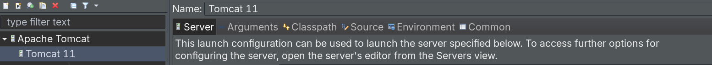

双击后，如果出现 `Could not launch in profiling mode because no profilers are configured.` 错误。

而且下方面板中没有「Servers」选项卡，如下所示：

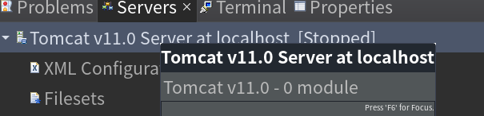

证明当前 [视图](#视图) 不是「Java EE」切实，应切换到「Java EE」视图再进行 Profile 的配置操作。

---

## 相关文档

* [Eclipse 官方帮助文档](https://help.eclipse.org)

---

## 相关笔记

* [Java 笔记](../Java_Note.md)
* [Java 资料清单](../Java_Material.md)
* [Tomcat 笔记](../Tomcat/Tomcat_Note.md)

