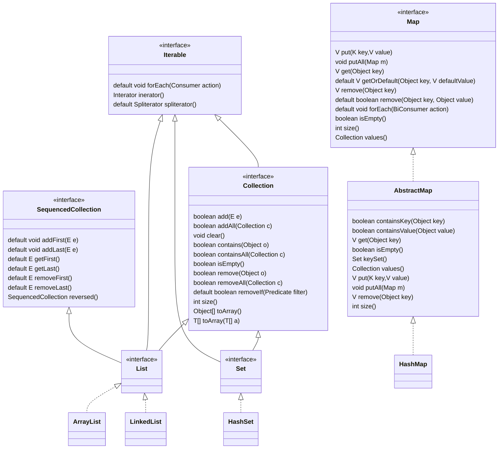

# Java 基础语法笔记

---

## 目录

* [数组](#数组)
* [集合](#集合)

---

## base 模块

`java.base` 模块，定义 Java SE 平台的基础 API。

这模块分两个包：

* `java`：Java 语言基础 API，包括 `java.io`、`java.nio`、`java.lang`、`java.util` 、`java.net` 等子包。
* `javax`：有三个子包：`javax.crypto`、`javax.net` 和 `javax.security`。

---

## 数组

---

## 集合

[Java](Java_Note.md) 集合相关的接口和类，是放在 `java.base` 这个「模块」（module）中 `java.util` 包（Package）下。

`Collection` 接口是 `Iterable` 接口的子接口，也就是意味着 `Collection` 接口及其「子孙」接口都拥有「迭代」能力。

### List

从 [JDK21](Java_Note.md#JDK21) 开始，`List` 接口多了一个父接口：`SequencedCollection`。

`List` 接口提供了四种用于按位置（索引）访问列表元素的方法。

* `get(int index)`：通过索引返回元素
* `getFirst()`：返回 List 中第一个元素，这是 [JDK21](Java_Note.md#JDK21) 新加的
* `getLast()`：返回 List 中最后一个元素，这是 [JDK21](Java_Note.md#JDK21) 新加的

### Set

`Set` 是直接与数学中的集合概念对应的接口。

> [!info] 
> 
> As implied by its name, this interface models the mathematical *set* abstraction.

> [!tip] 
> 
> [Python](../Python/Python_Note.md) 中的 [集合](../Python/Python_Syntax.md#集合) 就称为 `set`。

`Set` 接口特性：

* 无序
* 元素不重复

### Map

---

## 反射

#refelect

Java 在运行状态下，动态获取类或对象的信息及动态调用对象方法的功能称为 Java 反射机制。

Java 反射机制能够知道类的基本结构，这种对 Java 类结构的探知能力，称为 Java 类的「自审」。

反射相关的类和接口：

* `ClassLoader`：类加载器类
* `Class`：类的类
* `Constructor`：构造器类
* `Field`：类的成员变量类
* `Method`：类的方法类
* `Modifier`：访问权限类

反射 API 是放在 `java.lang.reflect` 包中。

### 反射应用

通过反射获取类的信息分两步：

1. 获取 [Class](#Class%20类) 对象
2. 通过 [Class](#Class%20类) 对象获取信息

#### Class 类

`Class` 类，反射所有的操作均是围绕此类来生成的。

Java 反射机制获取一个类的 Class 对象，有三种获取方式：

* 使用对象的 `getClass()` 方法
* 通过类的 `class` 属性
* 通过 `Class` 类的静态方法 `forName()`

---

## 相关笔记

* [Java 笔记](Java_Note.md)
* [Java IO 笔记](Java_IO_Note.md)
* [Java Log 笔记](Java_Log_Note.md)
* [Java Web 笔记](Java_Servlet_Note.md)
* [i++和++i分析](i++和++i分析.md)
* [Java 资料清单](Java_Material.md)

