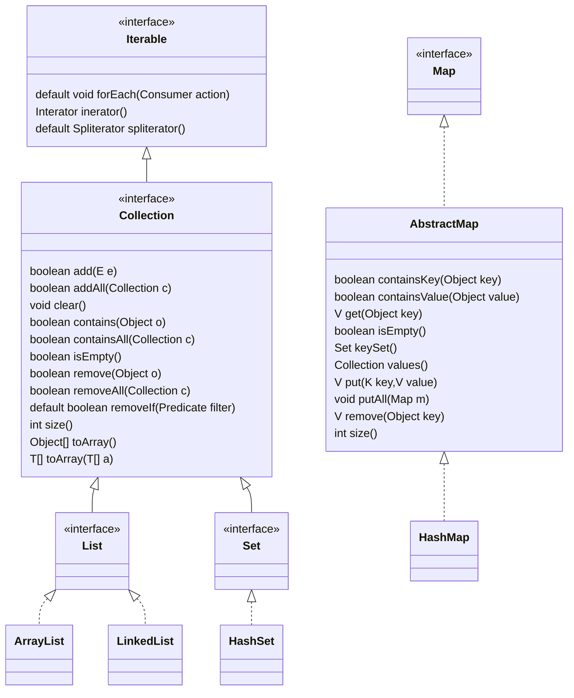

# Java 基础笔记

---

## 目录

* [数组](#数组)
* [集合](#集合)

---

## base 模块

`java.base` 模块，定义 Java SE 平台的基础 API。

这模块分两个包：

* `java`：Java 语言基础 API，包括 `java.io`、`java.nio`、`java.lang`、`java.util` 、`java.net` 等子包。
* `javax`：有三个子包：`javax.crypto`、`javax.net` 和 `javax.security`。

## 数组

## 集合

[Java](Java_Note.md) 集合相关的接口和类，是放在 `java.base` 这个「模块」（module）中 `java.util` 包（Package）下。

`Collection` 接口是 `Iterable` 接口的子接口，也就是意味着 `Collection` 接口及其「子孙」接口都拥有「迭代」能力。

### List

### Set

### Map

---

## 相关笔记

* [Java 笔记](Java_Note.md)
* [Java IO 笔记](Java_IO_Note.md)
* [Java Log 笔记](Java_Log_Note.md)
* [Java Web 笔记](Java_Servlet_Note.md)
* [i++和++i分析](i++和++i分析.md)
* [Java 资料清单](Java_Material.md)

