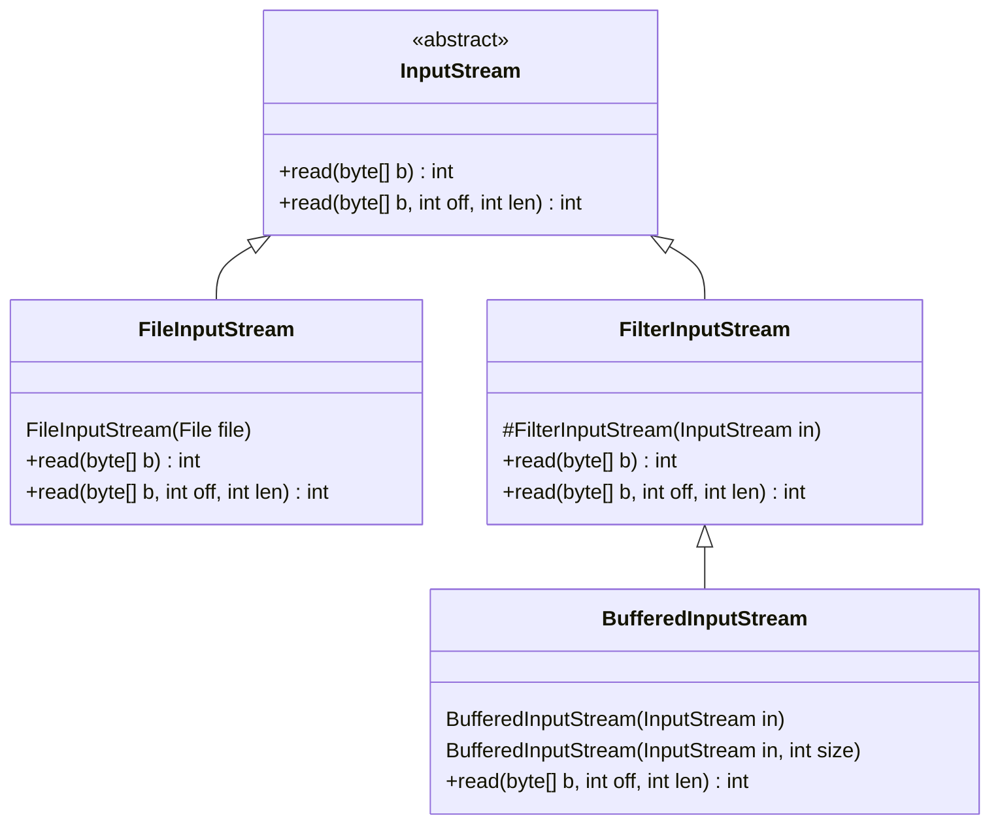
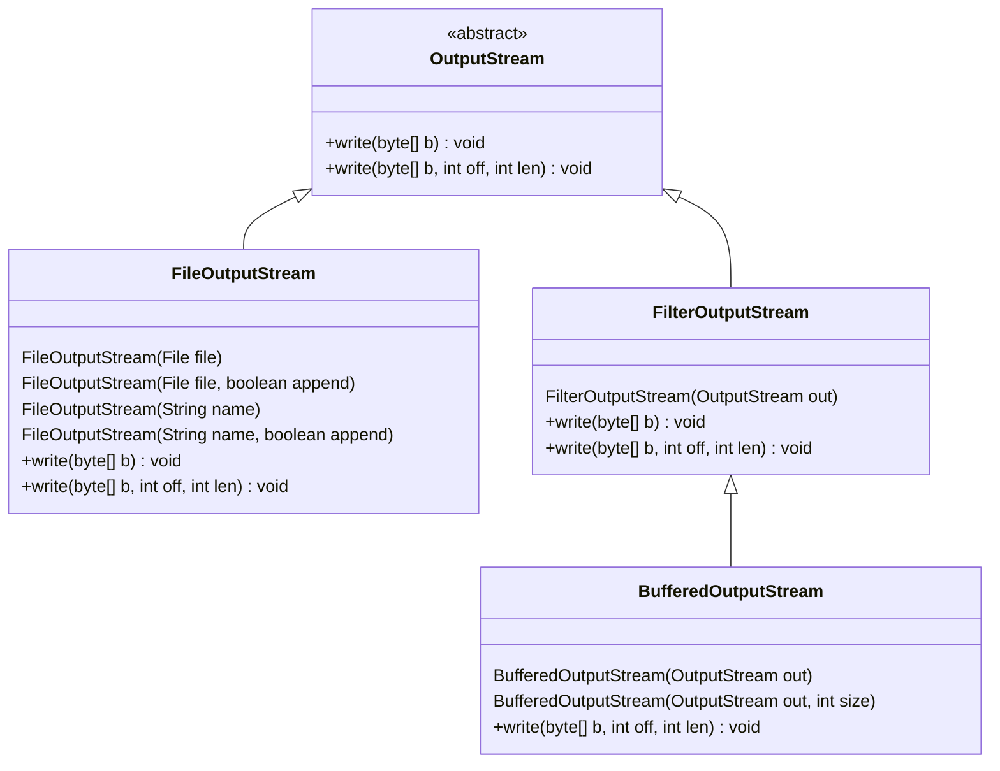
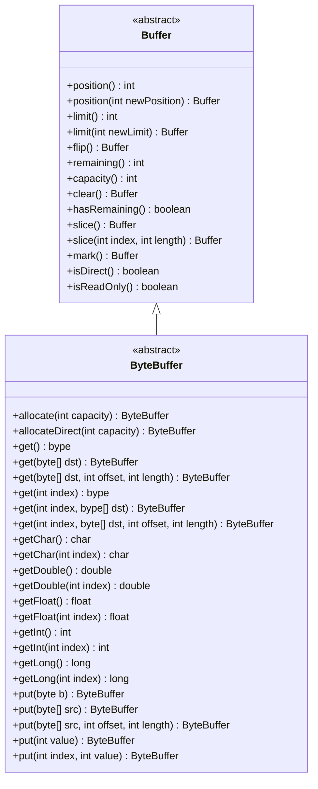

# Java IO 笔记

---

## <span id="javaio_model">IO 模型</span>

Unix/[Linux](../Linux/Linux_Note.md) 下有 5 种 IO 模型：

* Blocking IO  
* Nonblocking IO  
* IO multiplexing  
* Signal driven IO  
* Asynchronous IO

### <span id="javaio_model_concept">一些概念</span>

### <span id="javaio_model_bio">BIO</span>

BIO（BLocking IO）顾名思义是一种阻塞型 IO 模型。

### <span id="javaio_model_nio">NIO</span>

NIO（Nonblocking IO ） 非阻塞 IO 模型。

### <span id="javaio_model_links">相关资料</span>

* [看一遍就理解：IO模型详解 - 掘金](https://juejin.cn/post/7036518015462015006)
* [5种网络IO模型（有图，很清楚） - 知乎](https://zhuanlan.zhihu.com/p/54580385)
* [一文读懂网络 IO 模型原理 - 掘金](https://juejin.cn/post/7287791555623190568)

## <span id="javaio_io">传统 IO</span>

java 传统 io 使用的是 [BIO](#BIO) 模型。

### IO 相关类图

#### InputStream 类图



#### OutputStream 类图



### <span id="javaio_io_file">File</span>

Java 构造一个 `File` 对象，即使传入的文件或目录不存在，代码也不会出错，因为这个对象只是 Java 在内存中构建的一个对象。

因为构造一个 `File` 对象，并不会导致任何磁盘操作，而只有当调用 `File` 对象的某些方法的时候，才真正进行 IO 操作。

#### 常见问题

##### 关于 File 的空指针异常

示例：

```java
try{
	// 
	File d01 = new File(File_E01.class.getResource("t02.txt").getPath());
	// File d01 = new File("t02.txt");
	
	// 获取对象的路径
	System.out.println(d01.getPath());
	// 获取对象的父级路径
	System.out.println(d01.getParent());

} catch (NullPointerException e) {

	logger.severe("NullPointerException! 文件对像为Null!\n" + e.getMessage());
}
```

可以看文档知道，`File` 类在构建时有可能会抛空指针异常（`Throws: NullPointerException - If the pathname argument is null`），前提是那个 pathname 的字符串为 `null`。

但实际上，除非故意传个 null 值给 File 的构造方法，基本不可能让 File 「new 空」。即便如上面示例一样，使用 `类.class.getResource("xxx").getPath()` 这种方式，获取地址值。而上面示例却有可能会触发抛出空指针异常。触发的原因不是 File 的构造方法，而是 `类.class.getResource("xxx").getPath()` 这里触发的。

当执行到 `类.class.getResource("xxx")` 这里时，如果 `getResource()` 的参数是一个不存在的路径，那 `getResource()` 就会返回个 null，null 是不能继续 `getPath()` 的，所以触发了空指针异常的抛出。所以在这种方式构建 File 对象，空指针异常抛出在路径字符串「获取」时就有可能触发了，File 的构造方法根本没机会再触发空指针异常。

还有 `类.class.getResource("xxx").getPath()` 这代码中的 `getPath()` 方法是不会返回 Null 值，它最多只会返回一个空字符串（`Returns: the path part of this `URL`, or an empty string if one does not exist`）。

#### <span id="javaio_io_file_path">路径相关</span>

获取文件路径的方式有多种：

##### 方式 1 

```java
IO_E01.class.getResource("t01.txt").getPath()
// 结果与getPath()是一致的，但toString()一般用于调试
//File_E01.class.getResource("t01.txt").toString()

File_E01.class.getResource("").getPaht() // 返回的是File_E01类所在的目录路径

```

##### 方式 2 

```java
System.out.println(this.getClass().getResource(""));
System.out.println(this.getClass().getResource("/"));
System.out.println(this.getClass().getResource("t01.txt"));
System.out.println(this.getClass().getResource("/t01.txt"));

// 结果
// file:/home/silascript/DevWorkSpace/JavaExercise/io_exercise/
// file:/home/silascript/DevWorkSpace/JavaExercise/io_exercise/
// file:/home/silascript/DevWorkSpace/JavaExercise/io_exercise/t01.txt
// file:/home/silascript/DevWorkSpace/JavaExercise/io_exercise/t01.txt

```

##### 方式 3

```java
System.out.println(this.getClass().getClassLoader().getResource(""));
System.out.println(this.getClass().getClassLoader().getResource("t01.txt"));
System.out.println(this.getClass().getClassLoader().getResource("/"));
System.out.println(this.getClass().getClassLoader().getResource("/t01.txt"));

// 结果
// file:/home/silascript/DevWorkSpace/JavaExercise/io_exercise/
// file:/home/silascript/DevWorkSpace/JavaExercise/io_exercise/t01.txt
// null
// null

```

> [!tip]
> `this.getClass().getClassLoader().getResource(路径字符串)`，使用这个方式获取文件地址，不能以 `/`（根路径）开始，不然返回值只能是 `null` 。
> 
> 因为 `getClass().getClassLoader()` 这已经是表示 `/` 目录。

> [!info] 相关链接
>
> * [java获取文件路径总结\_inputstream获取文件路径-CSDN博客](https://blog.csdn.net/qq_38747892/article/details/126751734)
> * [Java中的getResource()方法，及路径相关问题](https://cloud.tencent.com/developer/article/1901321)

### <span id="javaio_io_iterate">遍历</span>

File 类中有两组方法：`list()` 和 `listFiles()` 用来遍历。

`list()` 的返回值是字符串数组，即文件或目录的名称。

`listFiles()` 的返回值是 File 类型的数组，即返回的是 File 的对象。

这两组方法的重载方法，都能接收 [FileFilter](#javaio_io_filter_filefilter) 和 [FilenameFilter](#javaio_io_filter_filenamefilter) 这两种 [过滤器](#javaio_io_filter)。

### <span id="javaio_io_filter">过滤器</span>

#### <span id="javaio_io_filter_filterinputstream">FilterInputStream</span>

`FilterInputStream` 是所有过滤输入流的所有类的父类。

观察 [InputStream 类图](#InputStream%20类图)，发现 `FilterInputStream` 的构造方法是 `protected` 的。也就是说除了其自身还有及子类外的第三方要创建它，是不能通过 `new FilterInputStream()` 来创建的，只能通过其子类，如 [BufferedInputStream](#字节缓冲流) 等子类来创建。

#### <span id="javaio_io_filter_filteroutputstream">FilterOutputStream</span>

`FilterOutputStream` 是所有过滤输出流的所有类的父类。

#### <span id="javaio_io_filter_filefilter">FileFilter</span>

FileFilter 文件过滤器。

在 [JDK8](#JDK8) 后，FileFilter 接口被标记为 [函数式接口](#函数式接口)，所以可以使用 [Lambda](Java_Note.md#java_lambda) 语法去快速实现这个接口。

FileFilter 接口只有一个方法：`boolean accept(File pathname)`。参数只有一个，即传入一个要过滤的目录 File 对象。

> [!example] 示例
> 
> ```java
> public class File_E03 {
> 
>	static Logger logger = Logger.getLogger("File_E03");
>
>	public static void main(String[] args) {
>
>		try {
>
>			// 当前类所在的目录
>			File dir01 = new File(File_E03.class.getResource("").getPath());
>
>			// 获取所有java文件
>			// listFiles() 方法得到的是File的数组
>			File[] files = dir01.listFiles((f) -> f.getPath().endsWith(".java"));
>
>			// 遍历
>			for (File f_temp : files) {
>				System.out.println("文件名：" + f_temp.getName());
>				System.out.println("文件绝对路径：" + f_temp.getAbsolutePath());
>				System.out.println("文件路径：" + f_temp.getPath());
>
>				System.out.println("---------------------------------------");
>			}
>
>		} catch (NullPointerException e) {
>
>			logger.severe(e.getMessage());
>
>		}
>
>	} 
> }
> 
> 
> ```
> 

#### <span id="javaio_io_filter_filenamefilter">FilenameFilter</span>

FilenameFilter 文件名过滤器。

在 [JDK8](Java_Note.md#JDK8) 后，FilenameFilter 接口被标记为 [函数式接口](Java_Note.md#函数式接口)，所以可以使用 [Lambda](Java_Note.md#java_lambda) 语法去快速实现这个接口。

这接口有且只有一个方法：`accept(File dir, String name)`。

> [!example] 列出某目录下所有 java 文件
>
> ```java
> public class File_E02 {
>
>	static Logger logger = Logger.getLogger("File_E02");
>
>	public static void main(String[] args) {
>
>		try {
>
>
>			// 当前类所在目录
>			File f01 = new File(File_E02.class.getResource("").getPath());
>
>			// 列出此目录下所有后缀名为".java"的文件
>			String[] files = f01.list((dir, fname) -> {
>				return fname.endsWith(".java");
>			});
>			
>			 // 遍历文件名数组
>			for (String fn_temp : files) {
>
>				File f = new File(f01, fn_temp);
>
>				if (f.isFile()) {
>					System.out.println("文件名：" + f.getName());
>					System.out.println("文件绝对路径：" + f.getAbsolutePath());
>					System.out.println("文件路径：" + f.getPath());
>				} else {
>					System.out.println("子目录：" + f);
>				}
>				System.out.println("-----------------------------");
>			}
>
>		} catch (NullPointerException e) {
>
>			logger.severe(e.getMessage());
>		}
>
>	}
>
> } 
> 
> ```
> 因为 FilenameFilter 接口已经被标记为函数式接口，所以示例代码中使用了 lambda 来定义这接口的实现。
> 

### <span id="javaio_io_bytestream">字节流</span>

#### 常用示例

```java
package io_exercise;

import java.io.FileInputStream;
import java.io.IOException;
import java.io.InputStream;

public class IO_E01 {

	public static void main(String[] args) {
	
		try (InputStream inputStr = new FileInputStream(
				// 获取要读取的文件
				IO_E01.class.getResource("t01.txt").getPath())) {
	
			// 用来装每次读取到的字符
			// 字符数组大小决定每次读了多少字符
			var bbuf = new byte[1024];
	
			// 实际读取的字符数
			var hasRead = 0;
	
			while ((hasRead = inputStr.read(bbuf)) > 0) {
				System.out.println(new String(bbuf, 0, hasRead));
			}
	
		} catch (IOException e) {
			e.printStackTrace();
		}
	
	}
}
```

> [!tip] 关闭流
> 
> 在 [JDK1.7（即JDK7）](Java_Note#JDK) 之前的版本，需要手动关闭流，所以常常在 `finally` 代码块中执行 `inputStr.close()` 的代码。
> 
> 但从 1.7 开始，流接口已经实现了 `AutoCloseable` 接口，顾名思义，io 流已经可以「自动」关闭了，无须再手动写关闭流的代码了。

### <span id="javaio_io_bytestream_fileinputstream">FileInputStream</span>

`FileInputStream` 是 [字节流](#javaio_io_bytestream) 抽象类 `InputStream` 的子类。

#### FileInputStream 与 InputStream 区别
 
 `InputStream` 是字节流的抽象基类，它可以从任意的数据源中读取字节数据，包括内存、网络、文件等；
 
 `FileInputStream` 顾名思义，它只能从文件读取字节数据。

对比下两者部分源码对比：

--- start-multi-column:
```column-settings
Number of Columns: 2
Largest Column: standard
```

FileInputStream

```java
private native int readBytes(byte[] b, int off, int len) throws IOException;
    
@Override
public int read(byte[] b) throws IOException {
	long comp = Blocker.begin();
	try {
		return readBytes(b, 0, b.length);
	} finally {
		Blocker.end(comp);
	}
}
```

--- end-column --- 

InputStream

```java
public int read(byte[] b) throws IOException {
	return read(b, 0, b.length);
}
```

--- end-multi-column

可发现，`FileInputStream` 的 `read(byte[] b)` 方法调了一个 native 方法

### <span id="javaio_io_bytestream_fileouputstream">FileOutputStream</span>

`FileOutputStream` 比较重要的方法：`write(byte[] b, int off, int len)`。

#### FileInputStream 和 FileOutputStream 示例

```java
public class File_E05 {

	static Logger logger = Logger.getLogger("File_E05");

	public static void main(String[] args) {

		// 要读取的文件
		File fin = new File(File_E05.class.getResource("t01.txt").getPath());
		// 要输出的文件
		File fout = new File(File_E05.class.getResource("").getPath() +
				File.separator + "t01_backup.txt");

		try (FileInputStream fis = new FileInputStream(fin);
				FileOutputStream fos = new FileOutputStream(fout)) {

			byte[] buffer = new byte[10];

			int len = 0;

			while ((len = fis.read(buffer)) > 0) {

				String cpStr = new String(buffer);
				// 打印下
				System.out.print(cpStr);

				// 写出
				fos.write(buffer, 0, len);

			}

		} catch (FileNotFoundException fnfe) {
			logger.severe(fnfe.getMessage());
		} catch (IOException ioe) {
			logger.severe(ioe.getMessage());
		} catch (NullPointerException npe) {
			logger.severe(npe.getMessage());
		} catch (Exception e) {
			logger.severe(e.getMessage());
		}

	}
}

```

### <span id="javaio_io_bytestream_bufferstream">字节缓冲流</span>

`BufferedInputStream` 与 `BufferedOutputStream` 称为字节缓冲流。使用内置的缓冲区对读取或输出的数据进行缓冲，以此减少直接读取数据源的次数。

`BufferedInputStream` 和 `BufferedOutputStream` 是 [FilterInputStream](#javaio_io_filter_filterinputstream) 与 [FilterOutputStream](#javaio_io_filter_filteroutputstream) 的子类。

字节缓冲流默认的缓冲区大小是**8M**。这个数值可能通过重载的构造方法进行设置：`public BufferedInputStream(InputStream  in, int size)`。这个数值最好是 2 的 n 次幂。

> [!info] BufferedInputStream 源码
> 
> `private static final int DEFAULT_BUFFER_SIZE = 8192;`

这两类在对象实例化时，需要传入 [FileInputStream](#javaio_io_bytestream_fileinputstream) 和 [FileOutputStream](#javaio_io_bytestream_fileouputstream) 实例对象。

而其 `read()` 方法与 `write()` 方法用法与 `FileInputStream` 与 `FileOutputStream` 大同小异。

#### BufferedInputStream 与 BufferedOutputStream 示例

```java
// 类所在的目录路径
String current_path = File_E06.class.getResource("").getPath();

// 要读取的文件
File in_file = new File(current_path +
		File.separator + "t01.txt");

// 要输出的文件
File out_file = new File(current_path +
		File.separator + "t01_backup.txt");

// 读取数据字节缓存
byte[] buff = new byte[64];

int len = 0;

try (FileInputStream fis = new FileInputStream(in_file);
		BufferedInputStream bis = new BufferedInputStream(fis);
		FileOutputStream fos = new FileOutputStream(out_file);
		BufferedOutputStream bos = new BufferedOutputStream(fos)) {

	// 读取
	while ((len = bis.read(buff)) > 0) {
	
	// 输出
	bos.write(buff, 0, len);

}
```

---

## <span id="javaio_nio">NIO</span>

`java.nio` 是 [JDK 1.4](Java_Note.md#JDK) 就已经提供的。

### <span id="javaio_nio_buffer">Buffer</span>

`Buffer` 是 [NIO](#javaio_nio) 的核心。nio 的 API 都是围绕着 `Buffer` 而设计的。



