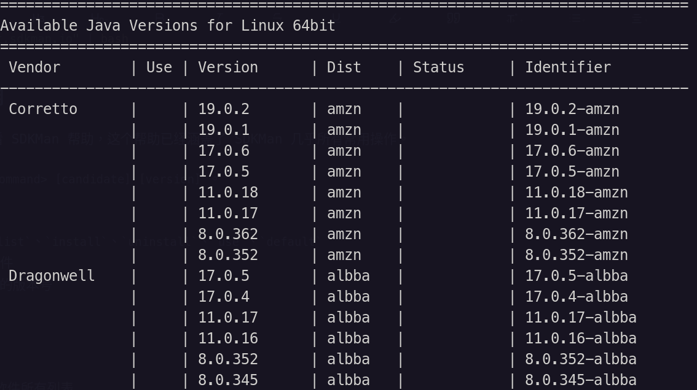

# Java 笔记

---

## 目录

* [JDK](#java_jdk)
	* [Open JDK](#OpenJDK)
* [JRE](#java_jre)
* [JVM](#java_jvm)
* [Java相关的配置](#java_config)
* [Eclipse相关](#java_eclipse)
* [SDKMan](#java_sdkman)
* [IO 相关](#java_io)
* [函数编程相关](#java_functaional)

---

## <span id="java_jdk">JDK</span>

不同的版本有不同的 JDK，不同厂商也有不同的 JDK。而非 [Oracle](https://www.oracle.com/) 的 JDK 均源于「OpenJDK」。

### OpenJDK

> [!info] 关于 OpenJDK
> OpenJDK 是由 **OpenJDK Community 、Oracle、IBM** 领导，连同 Alibaba，Amazon，Ampere，Azul，BellSoft，Canonical，Fujitsu，Google，Huawei，Intel，Java Community，JetBrains，London Java Community，Microsoft，Red Hat，SAP，SouJava，SUSE，Tencent，Twitter ，VMWare 等第三方共同开发、维护的 Java SE 开源参考实现。

[OpenJDK](https://openjdk.org) 与 Oracke JDK 区别：

* Oracle JDK 只发布二进行版本；OpeanJDK 只发源码
* Oracle JDK 包含了 OpenJDK 少量没有的功能
* 从 Java SE7 开始往后的版本，所有 JDK 都源于 OpenJDK。所以从某种意义上讲，Oracle JDK 也是 OpenJDK 的一个发生版。
* Oracle JDK 持有 Java 商标；其他 OpenJDK 不能使用 Java 商标。
* 授权不同：OpeanJDK 允许免费商用，而 Oracle JDK 只能个人研究使用，商用收费（从 JDK8u211 这版本开始）

广义上的「OpenJDK」指的是非 Oracle JDK 之外所有厂商源于 OpenJDK 源码自行定制编译发布的 OpenJDK 发行版。

狭义上的「OpenJDK」专指 **Oracle OpenJDK**，所以 OpenJDK 官网指向可下载的二进制文件其实是 Oracle OpenJDK 地址，它其实就是 Oracle 版的 OpenJDK 发行版。也就是说，Oracle 除了原有的 JDK 版，还有一个 OpenJDK 版本 -- 情况跟 RHEL 与 CenterOS 关系一样。

发行版的 OpenJDK 大部分都是可以 **免费商用** 的，商用付费的代表是 Oracle JDK 和 IBM、RedHat 的 OpenJDK。

而不同的厂商会根据 OpenJDK 源自行定制编译自己的二进制发行版本。下面就介绍几个：

#### Oracle OpenJDK

上面已经说了，**狭义** 上的 OpenJDK 就是指「Oracle's OpeanJDK」。

官网：[https://openjdk.org](https://openjdk.org)。

各大版本：
* [OpenJDK 11](https://jdk.java.net/java-se-ri/11)
* [OpenJDK 17](https://jdk.java.net/java-se-ri/17)

#### Eclipse Temurin 

[Adopt JDK](https://adoptium.net) 原来是 OpenJDK 中社区 JDK 中比较重要的一个发行版。后来 **AdoptOpenJDK** 加入到了 [Eclipse](https://www.eclipse.org/org/) 基金会旗下的 [Adoptium](https://adoptium.net) 工作组（「Adoptium Working Group」），后更名为「Temurin JDK」。[Temurin](https://adoptium.net/temurin/) 是「Adoptium」其中一个项目（Project），专门提供生产环境的 JRE 或 JDK 及相关技术。

官网也从 [https://adoptopenjdk.net](https://adoptopenjdk.net) 迁移到 [https://adoptium.net](https://adoptium.net)。

Temurin JDK 清华镜像：[https://mirror.tuna.tsinghua.edu.cn/Adoptium/](https://mirror.tuna.tsinghua.edu.cn/Adoptium/)

大部分 Open JDK 都能使用 [SDKMan](#SDKMan) 安装。

#### 微软 OpenJDK

没想到吧，微软也有发 OpenJDK。

> [!inof] 微软与 [Eclipse](#Eclipse%20相关)
> 
> 2021 年 8 月，微软宣布将成为 Eclipse 基金会的战略成员，并且加入其董事会。
> 
> 早在 2016 年，微软就以解决方案成员的身份加入了 Eclipse 基金会，并在当时提供了一套开发工具和服务。
> 
> 可见微软的「魔爪」已经伸向 Java 系的领域。事实是 [Visual Studio](https://visualstudio.microsoft.com/) 在 「VS2015」版本时，在其安装选项中就有 JDK 选项，当时还是针对 [Android](https://developer.android.google.cn/)。但现在看来，微软的野心可不止这么窄。从 [dotnet core](https://dotnet.microsoft.com/) [](https://github.com/dotnet/core) 到收购 [Github](https://github.com)，微软近年对于原来非微软传统领域，特别是开源领域的涉足越来越多。

官网：[https://www.microsoft.com/openjdk](https://www.microsoft.com/openjdk)

源码地址：[https://github.com/microsoft/openjdk](https://github.com/microsoft/openjdk)

---

### JDK8 

新的版本 JDK8 的部分命令更改。

`java` 及 `javac` 查看版本信息的 ` --version` 选项已经没有了，只剩下 `-version` 方式可查看 jdk8 的版本信息。

所以在新版本 jdk8 中查看版本信息只能使用：`java -version` 和 `javac -version`。

但离奇的是，在 [JDK11](#JDK11) 及 [JDK17](#JDK17) 仍保持 `--version` 这种用法。猜测是想要把 java 8 跟后继的版本「区隔」开，而且给那些仍使用 java8 的「钉子户」程序员一个好像 java8 用不了的「错觉」。

> [!info] 关于 version 选项
> 
> 通过 java 的帮助可以知道两种 `version` 是有一点区别的。
> 
> `-version` 将产品版本输出到错误流并退出
> 
>  `--version` 将产品版本输出到输出流并退出

#### 新特性

##### 默认方法

「默认方法」：又称为「**扩展方法**」，使用 `default` 关键字进行修饰。

默认方法**必须**有方法的实现，即**必须有方法体**。

但访问时，不能通过接口直接访问默认方法，必须通过接口的实现类的实例进行访问：

```java
对象名.默认方法()
```

##### 静态方法

Java8 开始允许在接口中定义静态方法，此方法使用 `static` 关键字修饰。

接口中的静态方法，与 [默认方法](#默认方法) 一样，必须要有方法体。

静态方法既可以通过接口名进行访问，也可以通过接口实现类的实例进行访问：

```java
接口名.静态方示名()
```

##### 函数接口

「[函数接口](Java_Funcational_Note.md#Functional%20Interface) 」是 JDK8 最重要的特性。

[lambda](#lambda)、[方法引用](#方法引用)、[optional](#optional) 等特性都是围绕着函数接口而制定的新功能。

##### lambda

##### 方法引用

##### optional

##### Stream API

##### Base64

##### 并行数组

### JDK11

### JDK17

### JDK21

---

##  <span id="java_jre">JRE</span>

Java Runtime Environment：Java 运行时环境。

JRE 是运行 Java 程序的必备环境，包含 JVM 和类库，确保 Java 程序在不同平台上顺利执行。

Java 的 JRE（Java Runtime Environment）用于运行 Java 应用程序。它包含以下主要组件：

1. Java 虚拟机（[JVM](#JVM)） 
   * 负责执行 Java 字节码，确保 Java 程序跨平台运行。
2. Java 类库（Java Class Library）
   * 提供标准库，支持文件操作、网络通信、数据结构等功能。
3. 其他支持文件 
   * 包括配置文件、资源文件等，确保 Java 程序正常运行。

### 主要功能

* **运行 Java 程序**：JRE 提供执行 Java 应用程序所需的环境。
* **跨平台支持**：通过 [JVM](#JVM) 实现「一次编写，到处运行」。

### 与 JDK 的区别

* **JRE**：仅用于运行 Java 程序。
* **JDK**：包含 JRE 及开发工具（如编译器、调试器），用于开发和编译 Java 程序。

---

## <span id="java_jvm">JVM</span>

JVM Java 虚拟机。

---

## <span id="java_config">Java 相关的配置</span>

### Java11 生成 JRE

进入 jdk 安装目录后执行以下命令：

```shell
sudo ./bin/jlink --module-path jmods --add-modules java.desktop --output jre
```

>[!info] 
>
> 把 jmodes 目录所有模块都生成 [JRE](#JRE)：
>
> ```shell
> sudo ./bin/jlink --module-path jmods --add-modules ALL-MODULE-PATH --output jre
> ```

---

## <span id="java_eclipse">Eclipse</span>

[Eclipse 笔记](IDE/Java_IDE_Eclipse.md)

---

## <span id="java_sdkman">SDKMan</span>

[SDKMan](https://sdkman.io/) 是一个 Linux 系统中对 java 相关的软件管理器。它能够对软件安装、卸载、版本切换。

### SDKMan 安装

执行以下命令：

```shell
curl -s "https://get.sdkman.io" | bash
```

sdkman 安装目录是在 `~/.sdkman/` 下，装完云看到 `.sdkman` 下有没有 `bin` 目录，因为国外网站的关系，有可能在安装过程，因为网络环境而事实上没真正安装成功，如果是这样，在 `.sdkman` 目录上是缺少 bin 目录的。

### 配置环境变量

往 `.bashrc` 或 `.bash_profile` 或 `.profile` 文件，把 sdkman 的路径加进去：

```config
export SDKMAN_DIR="/home/silascript/.sdkman"
```

或者：

```shell
source "/Users/sky/.sdkman/bin/sdkman-init.sh"
```

这会自动将相关的配置加入到相应的配置文件，有可能是 `.bashrc`，也有可能是 `.zshrc`（如果用 zsh）。反正去看下吧，大概是以下这一段代码：

```config
export SDKMAN_DIR="$HOME/.sdkman"
[[ -s "$HOME/.sdkman/bin/sdkman-init.sh" ]] && source "$HOME/.sdkman/bin/sdkman-init.sh"
```

> [!tip] 配置文件经验
> 
> 反正这段代码根据你自己习惯，可以移动到适合的 rc 或 profile 文件中。
> 
> 我个人是放在 `.profle` 中，所有语言的环境变量配置我都放在 `.profile` 中，然后我又用 zsh，我就在 `.zshrc` 中 `source` 下 `.profile`，这样能保持 `.zhsrc` 文件不至于太多非 zsh 的配置信息，而且集中放在 `.profile` 中也能集中管理。

### SDKman 使用

使用 `sdk help` 能查看 SDKMan 帮助，这个帮助已经涵盖了 SDKMan 几乎所有常用操作。

SDKMane 语法 `sdk <command> [candidate] [version]`。

* `command`：命令
	* 最常用的命令：`list`、`install`、`uninstall`、`use`、`default`
* `candidate`：目标软件
* `version`：目标软件的版本号

#### list 命令

`list` 命令是用来浏览软件所有列表

`sdk list`：什么软件名都不带的，就是列出 SDKMan 可以装哪些软件，使用 `J`、`K` 上下滚动，`q` 离开列表浏览模式。

`sdk list 软件名`：列出此软件所有版本。

以 `sdk list java` 为例：


可以从截图看出列出了 SDKMan 包含的 JDK 版本信息。

`Status` 栏的信息一般是表明这个版本是已安装（「installed」），亦或是本地包（「local only」）。

`Use` 栏是表示此软件使用情况。`>` 表示当前正在使用，`*` 表示已经安装，`+` 表示本地安装包。

`Version` 栏是版本号。 

`Dist` 栏是版本发行商。

`Identifier` 栏是标识符，用于安装时指定的。就是 `sdk <command> [candidate] [version]` 命令语法中最后那个 `version` 的值。

#### install 命令

---

## <span id="java_exception">异常</span>

---
## <span id="java_io">IO 相关</span>

[Java IO 笔记](Java_IO_Note.md)

---

## <span id="java_functional">Lambda 相关</span>

[Java 函数式编程](Java_Funcational_Note.md)

---

## 字节码

### 操作数栈

### 局部变量表

### int 类型入栈指令

#### 常量入栈

* 当 int 取值为 **-1~5** 采用 `iconst` 指令
* 当 int 取值为 **-128~127** 采用 `bipush` 指令
* 当 int 取值为 **-32768~32767** 采用 `sipush` 指令
* 当 int 取值为 **-2147473648~2147483647** 采用 `ldc` 指令

#### 局部变量表入栈

如果是从 [局部变量表](#局部变量表) 中入栈的，一般使用**load**指令。

* `iload_1`：将局部变量表中第一个 int 型变量「加载」至栈顶
* `fload_1`：将局部变量表中第一个 float 型变量「加载」至栈顶
* `dload_1`：将局部变量表中第一个 double 型变量「加载」至栈顶
* `aload_1`：将局部变量表中第一个引用类型的变量「加载」至栈顶

### 相关资料

* [两张图让你快速读懂JVM字节码指令 - 知乎](https://zhuanlan.zhihu.com/p/412472914)

---

## <span id="java_commands">java 命令使用</span>

### <span id="java_commands_javac">javac</span>

命令一般格式：`javac xxx.java` ，即可编译 java 代码。

常用选项：

`javac -g xxx.java` 在编译 java 代码时加上 `-g` 选项，可以在使用 `javap` 命令时显示「局部变量表」的信息。 
```shell
LocalVariableTable:
	Start  Length  Slot  Name   Signature
	  0       7     0  args   [Ljava/lang/String;
	  2       5     1     i   I
	  4       3     2     j   I
```

### <span id="java_commands_javap">javap</span>

`javap` 是 jdk 自带的反编译工具。

一般常用的选项有三个：
* `-v` 不仅会输出行号、局部变量表信息、反编译汇编代码，还会输出当前类用到的常量池等信息
* `-l` 会输出行号和局部变量表信息
* `-c` 会对当前 class 字节码进行反编译生成汇编代码

示例：

源码：

```java
public class Test05{
    public static void main(String[] args){

        int i=2;
        int j=0;

        i=j;

    }
}

```

使用的大致步骤：

4. 先使用 `javac -g Test05.java` 来编译，如上述所讲的，如果不加 `-g` 来编译，使用 `javap` 时，将不会显示「局部变量表」的信息。

5. 使用 `javap -v Test05` 后显示的内容：

```shell

javap -v Test05   
Classfile /home/silascript/DevWorkSpace/JavaExercise/Test05.class
  Last modified 2022年7月10日; size 411 bytes
  MD5 checksum 26a137d802c1bb7d139bee1102f4eeed
  Compiled from "Test05.java"
public class Test05
  minor version: 0
  major version: 55
  flags: (0x0021) ACC_PUBLIC, ACC_SUPER
  this_class: #2                          // Test05
  super_class: #3                         // java/lang/Object
  interfaces: 0, fields: 0, methods: 2, attributes: 1
Constant pool:
   #1 = Methodref          #3.#20         // java/lang/Object."<init>":()V
   #2 = Class              #21            // Test05
   #3 = Class              #22            // java/lang/Object
   #4 = Utf8               <init>
   #5 = Utf8               ()V
   #6 = Utf8               Code
   #7 = Utf8               LineNumberTable
   #8 = Utf8               LocalVariableTable
   #9 = Utf8               this
  #10 = Utf8               LTest05;
  #11 = Utf8               main
  #12 = Utf8               ([Ljava/lang/String;)V
  #13 = Utf8               args
  #14 = Utf8               [Ljava/lang/String;
  #15 = Utf8               i
  #16 = Utf8               I
  #17 = Utf8               j
  #18 = Utf8               SourceFile
  #19 = Utf8               Test05.java
  #20 = NameAndType        #4:#5          // "<init>":()V
  #21 = Utf8               Test05
  #22 = Utf8               java/lang/Object
{
  public Test05();
    descriptor: ()V
    flags: (0x0001) ACC_PUBLIC
    Code:
      stack=1, locals=1, args_size=1
         0: aload_0
         1: invokespecial #1                  // Method java/lang/Object."<init>":()V
         4: return
      LineNumberTable:
        line 1: 0
      LocalVariableTable:
        Start  Length  Slot  Name   Signature
            0       5     0  this   LTest05;

  public static void main(java.lang.String[]);
    descriptor: ([Ljava/lang/String;)V
    flags: (0x0009) ACC_PUBLIC, ACC_STATIC
    Code:
      stack=1, locals=3, args_size=1
         0: iconst_2
         1: istore_1
         2: iconst_0
         3: istore_2
         4: iload_2
         5: istore_1
         6: return
      LineNumberTable:
        line 5: 0
        line 6: 2
        line 8: 4
        line 11: 6
      LocalVariableTable:
        Start  Length  Slot  Name   Signature
            0       7     0  args   [Ljava/lang/String;
            2       5     1     i   I
            4       3     2     j   I
}
SourceFile: "Test05.java"

```

---

## 基础深入

### 赋值

```java
public class Demo_1{


	public static void main(String[] args){

		int i =0;

		i=15;

		System.out.println(i);

	}
	

}
```

能 [javac](#javac) 及 [javap](#javap) 命令查看部分字节码：

```
  public static void main(java.lang.String[]);
    descriptor: ([Ljava/lang/String;)V
    flags: (0x0009) ACC_PUBLIC, ACC_STATIC
    Code:
      stack=2, locals=2, args_size=1
         0: iconst_0地
         1: istore_1
         2: bipush        15
         4: istore_1
         5: getstatic     #7                  // Field java/lang/System.out:Ljava/io/PrintStream;
         8: iload_1
         9: invokevirtual #13                 // Method java/io/PrintStream.println:(I)V
        12: return
      LineNumberTable:
        line 6: 0
        line 8: 2
        line 10: 5
        line 15: 12
      LocalVariableTable:
        Start  Length  Slot  Name   Signature
            0      13     0  args   [Ljava/lang/String;
            2      11     1     i   I
}


```

`int=5;` 这个赋值语句对应的字节码是：
```
2: bipush        15
4: istore_1
```

> [!info] 关键字节码解析
> 
> `bipush` 是入栈指令，int 的值范围不同，有不同的 [入栈指令](#int%20类型入栈指令)。
> 
> 所谓「入栈」，即将值压入 [操作数栈](#操作数栈)。
> 
> 最后 `istore` 指令，是将刚入栈的数值「出栈」保存进 [局部变量表](#局部变量表) 对应的位置。
> 
> 经过上述两步，`i=5;` 这个赋值操作才算完成。

---

## 相关文档

* [Java17中文文档 - 全栈行动派](https://doc.qzxdp.cn/jdk/17/zh/api/index.html)

---

## 相关笔记

* [Java 视频清单](./Java_Videos.md)
* [Java 资料清单](Java_Material.md)
* [Kotlin 笔记](Kotlin/Kotlin_Note.md)
* [Java IO 笔记](Java_IO_Note.md)
* [Java Apache 笔记](Java_Apache_Note.md)
* [Java Web 笔记](Java_Servlet_Note.md)
* [Java 日志框架 笔记](Java_Log_Note.md)

