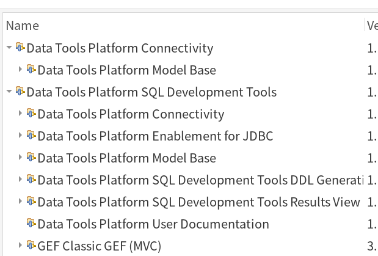
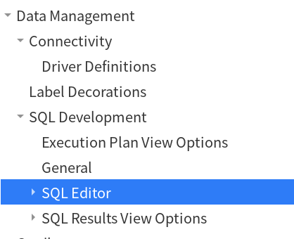
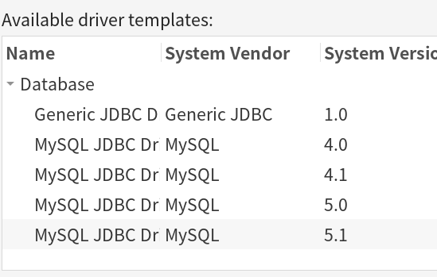
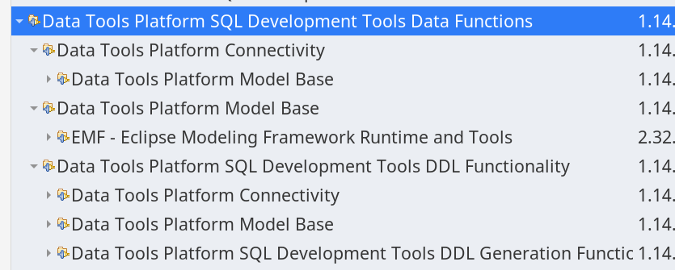
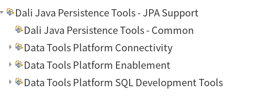
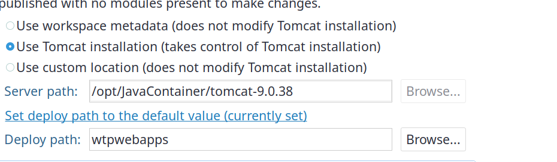

---
aliases:
  - 
tags:
  - PL
  - java
  - jdk
  - Eclipse
  - dbeaver
created: 2023-01-13, 12:27:45
modified: 2023-01-30, 9:15:30
---

# Java 笔记

---
## 目录

* [JDK](#java_jdk)
	* [Open JDK](#OpenJDK)
* [Java相关的配置](#java_config)
	* [Eclipse相关](#java_eclipse)
* [SDKMan](#java_sdkman)
* [Lambda 相关](#java_lambda)

---

## <span id="java_jdk">JDK</span>

不同的版本有不同的 JDK，不同厂商也有不同的 JDK。而非 [Oracle](https://www.oracle.com/) 的 JDK 均源于「OpenJDK」。

### OpenJDK

> [!info] 关于 OpenJDK
> OpenJDK 是由 **OpenJDK Community 、Oracle、IBM** 领导，连同 Alibaba，Amazon，Ampere，Azul，BellSoft，Canonical，Fujitsu，Google，Huawei，Intel，Java Community，JetBrains，London Java Community，Microsoft，Red Hat，SAP，SouJava，SUSE，Tencent，Twitter ，VMWare 等第三方共同开发、维护的 Java SE 开源参考实现。

[OpenJDK](https://openjdk.org) 与 Oracke JDK 区别：

* Oracle JDK 只发布二进行版本；OpeanJDK 只发源码
* Oracle JDK 包含了 OpenJDK 少量没有的功能
* 从 Java SE7 开始往后的版本，所有 JDK 都源于 OpenJDK。所以从某种意义上讲，Oracle JDK 也是 OpenJDK 的一个发生版。
* Oracle JDK 持有 Java 商标；其他 OpenJDK 不能使用 Java 商标。
* 授权不同：OpeanJDK 允许免费商用，而 Oracle JDK 只能个人研究使用，商用收费（从 JDK8u211 这版本开始）

广义上的「OpenJDK」指的是非 Oracle JDK 之外所有厂商源于 OpenJDK 源码自行定制编译发布的 OpenJDK 发行版。

狭义上的「OpenJDK」专指 **Oracle OpenJDK**，所以 OpenJDK 官网指向可下载的二进制文件其实是 Oracle OpenJDK 地址，它其实就是 Oracle 版的 OpenJDK 发行版。也就是说，Oracle 除了原有的 JDK 版，还有一个 OpenJDK 版本 -- 情况跟 RHEL 与 CenterOS 关系一样。

发行版的 OpenJDK 大部分都是可以 **免费商用** 的，商用付费的代表是 Oracle JDK 和 IBM、RedHat 的 OpenJDK。

而不同的厂商会根据 OpenJDK 源自行定制编译自己的二进制发行版本。下面就介绍几个：

#### Oracle OpenJDK

上面已经说了，**狭义** 上的 OpenJDK 就是指「Oracle's OpeanJDK」。

官网：[https://openjdk.org](https://openjdk.org)。

各大版本：
* [OpenJDK 11](https://jdk.java.net/java-se-ri/11)
* [OpenJDK 17](https://jdk.java.net/java-se-ri/17)

#### Eclipse Temurin 

[Adopt JDK](https://adoptium.net) 原来是 OpenJDK 中社区 JDK 中比较重要的一个发行版。后来 **AdoptOpenJDK** 加入到了 [Eclipse](https://www.eclipse.org/org/) 基金会旗下的 [Adoptium](https://adoptium.net) 工作组（「Adoptium Working Group」），后更名为「Temurin JDK」。[Temurin](https://adoptium.net/temurin/) 是「Adoptium」其中一个项目（Project），专门提供生产环境的 JRE 或 JDK 及相关技术。

官网也从 [https://adoptopenjdk.net](https://adoptopenjdk.net) 迁移到 [https://adoptium.net](https://adoptium.net)。

Temurin JDK 清华镜像：[https://mirror.tuna.tsinghua.edu.cn/Adoptium/](https://mirror.tuna.tsinghua.edu.cn/Adoptium/)

大部分 Open JDK 都能使用 [SDKMan](#SDKMan) 安装。

#### 微软 OpenJDK

没想到吧，微软也有发 OpenJDK。

> [!inof] 微软与 [Eclipse](#Eclipse%20相关)
> 2021 年 8 月，微软宣布将成为 Eclipse 基金会的战略成员，并且加入其董事会。
> 
> 早在 2016 年，微软就以解决方案成员的身份加入了 Eclipse 基金会，并在当时提供了一套开发工具和服务。
> 可见微软的「魔爪」已经伸向 Java 系的领域。事实是 [Visual Studio](https://visualstudio.microsoft.com/) 在 「VS2015」版本时，在其安装选项中就有 JDK 选项，当时还是针对 [Android](https://developer.android.google.cn/)。但现在看来，微软的野心可不止这么窄。从 [dotnet core](https://dotnet.microsoft.com/) [](https://github.com/dotnet/core) 到收购 [Github](https://github.com)，微软近年对于原来非微软传统领域，特别是开源领域的涉足越来越多。

官网：[https://www.microsoft.com/openjdk](https://www.microsoft.com/openjdk)

源码地址：[https://github.com/microsoft/openjdk](https://github.com/microsoft/openjdk)

---

### JDK8 

新的版本 JDK8 的部分命令更改。

`java` 及 `javac` 查看版本信息的 ` --version` 选项已经没有了，只剩下 `-version` 方式可查看 jdk8 的版本信息。

所以在新版本 jdk8 中查看版本信息只能使用：`java -version` 和 `javac -version`。

但离奇的是，在 [JDK11](#JDK11) 及 [JDK17](#JDK17) 仍保持 `--version` 这种用法。猜测是想要把 java 8 跟后继的版本「区隔」开，而且给那些仍使用 java8 的「钉子户」程序员一个好像 java8 用不了的「错觉」。

> [!info] 关于 version 选项
> 通过 java 的帮助可以知道两种 `version` 是有一点区别的。
> 
> `-version` 将产品版本输出到错误流并退出
> 
>  `--version` 将产品版本输出到输出流并退出

### JDK11

### JDK17

---

## <span id="java_config">Java 相关的配置</span>

---

### Java11 生成 JRE

进入 jdk 安装目录后执行以下命令：

```shell
sudo ./bin/jlink --module-path jmods --add-modules java.desktop --output jre
```

>把 jmodes 目录所有模块都生成 jre:
>
>```shell
>sudo ./bin/jlink --module-path jmods --add-modules ALL-MODULE-PATH --output jre
>```
>
>

---

## <span id="java_sdkman">SDKMan</span>

[SDKMan](https://sdkman.io/) 是一个 Linux 系统中对 java 相关的软件管理器。它能够对软件安装、卸载、版本切换。

### SDKMan 安装

执行以下命令：
```shell
curl -s "https://get.sdkman.io" | bash
```

### SDKman 使用

使用 `sdk help` 能查看 SDKMan 帮助，这个帮助已经涵盖了 SDKMan 几乎所有常用操作。

SDKMane 语法 `sdk <command> [candidate] [version]`。

* `command`：命令
	* 最常用的命令：`list`、`install`、`uninstall`、`use`、`default`
* `candidate`：目标软件
* `version`：目标软件的版本号

#### list 命令

`list` 命令是用来浏览软件所有列表

`sdk list`：什么软件名都不带的，就是列出 SDKMan 可以装哪些软件，使用 `J`、`K` 上下滚动，`q` 离开列表浏览模式。

`sdk list 软件名`：列出此软件所有版本。

以 `sdk list java` 为例：


可以从截图看出列出了 SDKMan 包含的 JDK 版本信息。

`Status` 栏的信息一般是表明这个版本是已安装（「installed」），亦或是本地包（「local only」）。

`Use` 栏是表示此软件使用情况。`>` 表示当前正在使用，`*` 表示已经安装，`+` 表示本地安装包。

`Version` 栏是版本号。 

`Dist` 栏是版本发行商。

`Identifier` 栏是标识符，用于安装时指定的。就是 `sdk <command> [candidate] [version]` 命令语法中最后那个 `version` 的值。

#### install 命令

---

### <span id="java_eclipse">Eclipse 相关</span>

[Eclipse](https://www.eclipse.org/) 最初是由 [IBM](https://www.ibm.com/) 开发的下一代 IDE，2001 年 11 月 IBM 将其贡献给开源社区，由 Eclipse 基金会管理。

#### 一些概念

##### 视图

视图：View 是 Eclipse 中各个显示区域，如编辑区、「Package Explorer」区等。

视图列表可以通过菜单「Window」-->「Show View」查看。

##### 透视图

透视图：Perspective 其实是 Eclipse UI 布局，即按工作需求，将多个 [视图](#视图) 的不同组合形式。

可以通过 Eclipse 右上角那个按钮「Open Perspective」 来查看各种透视图。


---

#### Eclipse 目录结构

##### <span id="java_eclipse_plugindirectory">插件目录</span>

##### <span id="java_ecipse_workspace">工作空间</span>

##### Linux 下的 Eclipse 公共目录

[Linux_Note](../Linux/Linux_Note.md) 系统下，用户根下有一个 `.eclipse` 的目录，这是所有 eclipse 的共享目录。

---

#### <span id="java_eclipse_hotkeys">Eclipse 快捷键</span>

##### 窗口操作

`Ctrl+M`：最大化当前视图，看焦点在哪里哪里就最大化。

`Ctrl+W`：关闭当前窗口

`Ctrl+Shift+W`：关闭所有窗口

`Ctrl+F6`：编辑区下一个标签页

`Ctrl+Shift+F6`：编辑区上一个标签页

`Ctrl+F7`：下一个 [视图](#视图)，如将焦点从编辑区移到「Package Explorer」区就可以使用这个快捷键。 ^488e15

`F12`：激活编辑区，即将焦点从别的 [视图](#视图) 移回编辑区，这就不用 使用 [Ctrl+F7](#^488e15) 一个个视图跳了。

`Ctrl+Shift+F7`：上一个 [视图](#视图)，与上面的操作类似。

`Ctrl+F10`：显示 [视图](#视图) 菜单。

`Ctrl+F8`：下一个 [透视图](#透视图)

`Ctrl+Shift+F8`：上一个 [透视图](#透视图)

##### 注释

`Ctrl+/`：单行注释或取消注释

`Ctrl+Shift+/`：多行注释

`Ctrl+Shift+\`：取消行注释

`Shift+Alt+J`：给类或方法添加文档注释

##### 查找

`Ctrl+O`：显示当前类中方法和属性的大纲，支持搜索指定的方法、属性等

`Ctrl+T`：显示光标所在类的继承树结构

`Ctrl+Shift+T`：查找类，可以使用「*」、「？」等通配符。

`Ctrl+Shift+G`：查找类、方法和属性的引用。

`Ctrl+K`：搜索选中的单词，并向下跳转，如果光标跳到了结果最尾项，再按 `Ctrl+K` 会往回跳到结果首项。

`Ctrl+Shift+L`：显示所有 Eclipse 快捷键列表。

##### 代码或文本操作

`Ctrl+Shift+F`：格式化代码

`Ctrl+P`：光标跳转到上次编辑的位置。

`Crrl+Shift+P`：定位匹配符号，如**{}**、**[]**和**()**这些括号。

`Home`：跳转行首。

`End`：跳转么行尾。

`Ctrl+L`：跳转到某行。快捷键会弹出一个输入框，可以输入要跳转行的行号。

`Shift+Enter`：新建下一行，不用把光标移到行末再回车了。如果 Eclipse 装了 [Vrapper](#Vrapper) 插件，就可以使用 `o`（小写）来新建下一行。

`Ctrl+Shift+Enter`：新建上一行，不用把光标移到行首回车。如果 Eclipse 装了 [Vrapper](#Vrapper) 插件，就可以使用 vim 的 `O`（大写）来新建上一行。

`Ctrl+D`：删除当前行

`Alt+UP` 或 `Alt+Down`：将当前行的代码往上移或往下移

`Ctrl+Alt+UP` 或 `Ctrl+Alt+Down`：复制当前行到上一行或下一行

`Alt+Enter`：显示选中的当前项目或文件的属性

`Ctrl+1`：快速修复，对于未导包的类处理时非常有用，它可以快速导入所有依赖项。

`Ctrl+Shift+数字区的/`：折叠所有注释及代码

##### getter 和 setter 生成

1. `Shift+Alt+S`，呼出「Source」菜单 如果装了 [Vrapper](#Vrapper) 插件并装了 [Java extensions](#^491eb0) 子扩展，那就可以使用 `gm` 快捷键呼出「Source」菜单。
2. 按 `r`，呼出 getter 和 setter 配置菜单
3. 选择要生成 getter 和 setter 的属性，全选： `Alt+A`；取消所有： `Alt+D`；选择所有的 getter：`Alt+G`；选择所有 setter：`Alt+L`。
4. 回车生成 getter 和 setter 如果 `Generate` 按钮失去焦点，就按 `Alt+G`。

##### 生成构造方法

1. `Shift+Alt+S`，呼出「Source」菜单，跟 [getter 和 setter 生成](#getter%20和%20setter%20生成) 完全一样
2. 按 `o`，呼出构造方法配置菜单
3. 选择构造方法所需的属性，如果全选就 `Alt+A`，取消所有选择就按 `Alt+D`
4. 回车确认生成构造方法

---

#### <span id="java_eclipse_plugins">Eclipse 常用插件</span>

##### Marketplace

Marketplace 是 Eclipse 的插件市场，通过它可以更方便地搜索和安装插件。

---

##### jeeeyuls-eclipse-themes

[jeeeyul_theme](https://marketplace.eclipse.org/content/jeeeyuls-eclipse-themes) 是一个 Eclipse 界面主题插件。

##### colortheme

[colortheme](https://marketplace.eclipse.org/content/eclipse-color-theme) 这个与上面那个不同，这是插件是针对编辑区的配色插件。 Eclipse 市场中的 color-theme 插件地址已经失效。 请到 [这个](https://eclipse-color-theme.github.io/update/) 页面，其中有个链接： [download this update site as a zip archive](https://eclipse-color-theme.github.io/update/eclipse-color-theme-update-site.zip)，下载这个压缩包。将其中的 `features` 和 `plugins` 两个目录提取出来放到一个你自定义名称的目录中，如「color-theme」，将这个包括有 `features` 和 `plugins` 的目录放到 Eclipse 安装目录下的 `dropins` 目录中，重启 Eclipse ，这个插件就能生效了！

##### Bracketeer

[Bracketeer](https://marketplace.eclipse.org/content/bracketeer-java-jdt) 是一个使用注释方式标识出匹配大括号的插件。Eclipse 插件市场中的 Bracketeer 插件的地址已经失效了，应自行通过 「Install new Software」 这个方式添加插件安装地址。安装地址：[https://chookapp.github.io/ChookappUpdateSite/](https://chookapp.github.io/ChookappUpdateSite/)

##### Eclipse explorer

[Eclipse explorer](https://marketplace.eclipse.org/content/eclipse-explorer)  [](https://github.com/Jamling/eclipse-explorer/releases) 是打开项目本地目录的插件。同样的，插件市场的地址也是失效了，得到 github 中下载。同 color-theme 一样，下载下的包是不能直接丢到 `dropins` 目录的，得把 `features` 和 `plugins` 目录提取出来。

> [!tip] explorer
> [Eclipse Explorer](https://marketplace.eclipse.org/content/eclipse-explorer) 这插件又在插件市场上架了。并且手动丢包到 `dropins` 目录方式，好像失效了 -- 至少在 Linux 上失效。
> 
> 安装地址为：[https://www.ieclipse.cn/PDESite/updates/](https://www.ieclipse.cn/PDESite/updates/)

##### Jcolon

[Jcolon](https://mystilleef.github.io/eclipse4-jcolon/) [](https://github.com/mystilleef/eclipse4-jcolon) 是一款自动补分号的插件。真是自动，不需要按快捷键。

##### EditBox

[EditBox](https://marketplace.eclipse.org/content/editbox) 是一款显示代码范围的插件。


如果不想使用插件市场安装，可以到 [sourceforge](http://editbox.sourceforge.net/updates/) 下载 `features` 和 `plugins` 两目录下的 `jar` 文件，把这两目录放到一个目录中，如 `editbox`，然后把这个目录放在 Eclipse 安装目录下 `dropins` 目录中，重启 Eclipse，就能生效。

有时使用 `dropins` 这种方式，可以使用使用 `Install New Software` 方式来安装插件。

> editbox 安装地址：[http://editbox.sourceforge.net/updates](http://editbox.sourceforge.net/updates)

##### relative-line-number

[relative-line-number](https://marketplace.eclipse.org/content/relative-line-number-ruler) 相对行号。

##### freemarker

[freemarker](https://marketplace.eclipse.org/content/freemarker-ide) freemarker 插件。这插件 github 地址：[https://github.com/ddekany/jbosstools-freemarker](https://github.com/ddekany/jbosstools-freemarker) 。

这个插件是从 [JBossTools Freemarker](https://github.com/jbosstools/jbosstools-freemarker) 插件中分支出来的，因为原版的插件在 JBoss Tools 4.5.3 时就已经被移除了，估计是 Freemarker 用得人太少，已经算是过时的技术了，所以 JBoss 就把这货从 JBoss Tools 中移除掉。

事实上这插件也已经有 2 年多没更新了，估计停止维护也不远了，现在还是能用的。不过估计随着 Eclipse 继续版本迭代，不兼容性迟早会出现，到时候是真的就用不了了！

##### SQL DAL Maker

[SQL DAL Maker](https://github.com/panedrone/sqldalmaker) 数据链接层生成插件

##### mybatipse

[mybatipse](https://marketplace.eclipse.org/content/mybatipse) [](https://github.com/mybatis/mybatipse/) MyBatis 插件。

  mybatis 中 xml、java 文件的各种功能增强，如自动完成、相关 sql 关联等，使用 mybatis 必装的插件。

##### MyBatis-Generator

[mybatis-generator](https://marketplace.eclipse.org/content/mybatis-generator) MyBatis 生成插件。

##### Vrapper

[Vrapper](https://marketplace.eclipse.org/content/vrapper/) 是一个在 Eclipse 上模拟 [vim](../vim/Vim_Note.md) 的插件。

这插件有几个子扩展，是 vim 下常用的插件模拟。

推荐安装大名鼎鼎的 [Surround](../vim/vim_plugin.md#Surround)。

另外，作为 Java 开发，也建议把 「Java extensions」这个扩展也勾选安装上。其实这个折展就是为 Eclipse 两个右键菜单添加 vim 式的快捷键： ^491eb0
* `gr` Eclipse 「refactor」（重构）菜单
* `gm`：Eclipse 「source」菜单

Vrapper 更详细使用请参考 [Vrapper Documentation](https://vrapper.sourceforge.net/documentation/?topic=introduction)。

---

##### Data Tools Platform

Data Tools Platform 是一套数据库管理插件组，能在 Eclipse 中进行数据库相关的操作。

这套插件，应该说是插件系列，有多个插件可选，下面简单介绍各插件的大概的功能：

###### Data Tools Platform Connectivity

勾选「**Data Tools Platform Connectivity**」后，会根据依赖装两组插件：

* **Data Tools Platform Connectivity**
* **Data Tools Platform SQL Development Tools**





从图中可以看出，只装「Data Tools Platform Connectivity」就能实现数据库连接、SQL 等数据库管理的基础功能，其实对于只是「临时」连下数据库，作些简单的数据操作而言，这实际已经够用的了！不过，实际上，还是没法用的，因为连接这个功能，需要数据库的「连接驱动」，而只装「Connectivity」插件，只有通用 JDBC 可选，所以得安装相应数据库连接驱动的支持。

###### Data Tools Platform Enablement

Data Tools Platform Enablement 是一个对各大数据库连接支持的插件。

勾选「Data Tools Platform Enablement for MySQL」后安装相应插件后，就会在新建链接时出现以下的选项：


> [!tip] Enablement for MySQL
> 在未装「Data Tools Platform Enablement for MySQL」时，只有「Generic JDBC」这个，装了这插件后就多了 MySQL 相关连接驱动可选。

###### SQL Development Tools Data Functions

「SQL Development Tools Data Functions」主要功能是在数据库 Model 及 DDL 相关的。



###### SQL Query Builder

「SQL Query Builder」 这个插件依赖 [SQL Parsers](#SQL%20Parsers) 插件，拟勾选「SQL Query Builder」时，会连 [SQL Parsers](#SQL%20Parsers) 插件也一起装了。


###### SQL Parsers

SQL Parsers 这是跟 Model 相关的，应该是模型转换器。


###### Open Data Access Designer

「Open Data Access Designer」 依赖 「Open Data Access Designer Core」，而「Open Data Access Designer Core」又依赖「Open Data Access Designer Runtime」，所以只用勾选「Open Data Access Designer」就可以将其他两个一起装了。

###### 对于 Eclipse 中使用数据库管理的总结

因为 [Data Tools Platform](#Data%20Tools%20Platform) 这套插件有点多，如果不知道装哪些，可以装 [Dali Java Persistence Tools](#Dali%20Java%20Persistence%20Tools) 这个插件，此插件是一个「持久化」插件，其中一个功能可以将数据库的表生成 Java 类，非常的方便，而这插件依赖了 DTP 部分基础插件。

实话 [Data Tools Platform](#Data%20Tools%20Platform) 这插件实在有点老，建议还是使用 [DBeaver](DataBase_Note.md#DBeaver) 的 [插件版](#DBeaver) 本来替代。

---

##### DBeaver

DBeaver 插件版是 [DBeaver](DataBase_Note.md#DBeaver) 的插件形式。

这比 [Data Tools Platform](#Data%20Tools%20Platform) 系列插件强太多，建议使用些插件替代 **DTP**。

此插件安装地址：[https://dbeaver.io/update/latest/](https://dbeaver.io/update/latest/)，可以通过添加这个址安装，当然也可以通过 [Marketplace](#Marketplace) ：[https://marketplace.eclipse.org/content/dbeaver](https://marketplace.eclipse.org/content/dbeaver) 来安装。

DBeaver 插件版也独立安装版功能一致，具体信息可以参考 [DBeaver 介绍](DataBase_Note.md#DBeaver)。

---

##### Dali Java Persistence Tools

[Dali Java Persistence Tools](https://projects.eclipse.org/projects/webtools.dali) 这是一个持久化插件。同样是跟数据库相关的，所以装它时，会将 [Data Tools Platform](#Data%20Tools%20Platform) 相关的插件也一并装了。



---

#### Eclipse 各版本与 JDK 对应关系

> [!info] Eclipse 版本代号
> 从 2018 年 9 月开始，Eclipse 每 3 个月发布一个版本，并且版本僅不再延续天文星体名称，直接使用年份跟月份。

| 版本代号 |     代号名称     |  平台版本  |      发行日期       | 需要 JDK 版本 | 其他信息 |
|:--------:|:----------------:|:----------:|:-------------------:|:-------------:|:--------:|
|    IO    |   木卫一，伊奥   |    3.1     | 2005 年 6 月 28 日  |      N/A      |   N/A    |
| Callisto | 木卫四，卡里斯托 |    3.2     | 2006 年 6 月 26 日  |    JDK 1.4    |   N/A    |
|  Europa  |  木卫二，欧罗巴  |    3.3     | 2007 年 6 月 27 日  |    JDK 1.5    |   N/A    |
| Ganymed  | 木卫三，盖尼米得 |    3.4     | 2008 年 6 月 25 日  |    JDK 1.5    |   N/A    |
| Galileo  |      伽利略      |    3.5     | 2009 年 6 月 24 日  |    JDK 1.5    |   N/A    |
|  Helios  |      太阳神      |    3.6     | 2010 年 6 月 23 日  |    JDK 1.5    |   N/A    |
|  Indigo  |       靛蓝       |    3.7     | 2011 年 6 月 22 日  |    JDK 1.5    |   N/A    |
|   Juno   |       朱诺       | 3.8 及 4.2 | 2012 年 6 月 27 日  |    JDK 1.5    |   N/A    |
|  Kepler  |      开普勒      |    4.3     | 2013 年 6 月 26 日  |    JDK 1.6    |   N/A    |
|   Luna   |       月神       |    4.4     | 2014 年 6 月 24 日  |    JDK 1.6    |   N/A    |
|   Mars   |       火星       |    4.5     | 2015 年 6 月 24 日  |    JDK 1.7    |   N/A    |
|   Neon   |      霓虹灯      |    4.6     | 2016 年 6 月 22 日  |    JDK 1.8    |   N/A    |
|  Oxygen  |       氧气       |    4.7     | 2017 年 6 月 28 日  |    JDK 1.8    |   N/A    |
|  Photon  |       光子       |    4.8     | 2018 年 6 月 27 日  |    JDK 1.8    |   N/A    |
| 2018-09  |       N/A        |    4.9     | 2018 年 9 月 19 日  |    JDK 1.8    |   N/A    |
| 2018-10  |       N/A        |    4.10    | 2018 年 12 月 19 日 |    JDK 1.8    |   N/A    |
| 2019-03  |       N/A        |    4.11    | 2019 年 3 月 20 日  |    JDK 1.8    |   N/A    |
| 2019-06  |       N/A        |    4.12    | 2019 年 6 月 19 日  |    JDK 1.8    |   N/A    |
| 2019-09  |       N/A        |    4.13    | 2019 年 9 月 18 日  |    JDK 1.8    |   N/A    |
| 2019-12  |       N/A        |    4.14    |    2019 年 12 月    |    JDK 1.8    |   N/A    |
| 2020-03  |       N/A        |    4.15    | 2020 年 3 月 18 日  |    JDK 1.8    |   N/A    |
| 2020-06  |       N/A        |    4.16    |    2020 年 6 月     |    JDK 1.8    |   N/A    |
| 2020-09  |       N/A        |    4.17    | 2020 年 9 月 16 日  |    JDK 11     |   N/A    |
| 2020-12  |       N/A        |    4.18    | 2020 年 12 月 16 日 |    JDK 11     |   N/A    |
| 2021-03  |       N/A        |    4.19    | 2021 年 3 月 18 日 |    JDK 11     |   N/A    |
| 2021-06  |       N/A        |    4.20    | 2021 年 6 月 16 日 |    JDK 11     |   N/A    |
| 2021-09  |       N/A        |    4.21    | 2021 年 9 月 15 日 |    JDK 11     |   N/A    |
| 2021-12  |       N/A        |    4.22    | 2021 年 12 月 8 日 |    JDK 11     |   N/A    |
| 2022-03  |       N/A        |    4.23    | 2022 年 3 月 16 日 |    JDK 11     |   N/A    |
| 2022-06  |       N/A        |    4.24    | 2022 年 6 月 15 日 |    JDK 11     |   N/A    | 
| 2022-09  |       N/A        |    4.25    | 2022 年 9 月 14 日 |    JDK 11     |   N/A    | 
| 2022-12  |       N/A        |    4.26    | 2022 年 12 月 7 日 |    JDK 11     |   N/A    | 

> [!tip] 32 位与 64 位
> Eclipse 必须与 JRE 相一致，32 位 JRE 只能装 32 位版本的 Eclipse，64 位 JRE 装 64 位 Eclipse。

---

#### Eclipse 基础的各种软件找不到 jre

>可以将在软件安装目录下建一个软链接指向 jdk 中的 jre（如像 java11+ 的没有预装 **jre**，请用上面的命令生成 **jre**）
>
>下面以 **DBeaver** 为例:
>
>```shell
>sudo ln -s /opt/JDK/jdk11/jre /opt/dbeaver/jre
>```

>Eclipse 运行需要的模块:
>
>java.base,java.desktop,java.logging,java.xml,java.naming,java.net.http,java.sql,java.sql.rowset
>
>

#### Tomcat 配置出问题

>配置 tomcat 时，提示“eclipse tomcat unknown version of tomcat was specified”
>
>因为配置 tomcat 需要访问 tomcat 目录下的 lib 库,而访问此目录需要相应的权限
>
>所以得修改 lib 目录的权限:
>
>```shell
>chmod -R 777 apache-tomcat-xxx/lib
>```

无独有偶，[VSCode](https://code.visualstudio.com/) 下，使用 [Tomcat to Java](https://marketplace.visualstudio.com/items?itemName=adashen.vscode-tomcat) 插件，添加 Tomcat ，可能会添加失败，报 `Please make sure you select a valid Tomcat Directory.` 错误，同样也是权限问题。

示例：
```shell
sudo chmod -R 755 tomcat-9.0.62
```

#### 启动 Tomcat 后 404

>
>
>要选第二项，就是将项目复制一份到 tomcat 安装目录下的 wtpwebapps 目录中进行发布

---

## <span id="java_lambda">Lambda 相关</span>

---

## <span id="java_commands">java 命令使用</span>

### <span id="java_commands_javac">javac</span>

命令一般格式：`javac xxx.java` ，即可编译 java 代码。

常用选项：

`javac -g xxx.java` 在编译 java 代码时加上 `-g` 选项，可以在使用 `javap` 命令时显示「局部变量表」的信息。 
```shell
LocalVariableTable:
	Start  Length  Slot  Name   Signature
	  0       7     0  args   [Ljava/lang/String;
	  2       5     1     i   I
	  4       3     2     j   I
```

### <span id="java_commands_javap">javap</span>

`javap` 是 jdk 自带的反编译工具。

一般常用的选项有三个：
* `-v` 不仅会输出行号、局部变量表信息、反编译汇编代码，还会输出当前类用到的常量池等信息
* `-l` 会输出行号和局部变量表信息
* `-c` 会对当前 class 字节码进行反编译生成汇编代码

示例：

源码：

```java
public class Test05{
    public static void main(String[] args){
    

        int i=2;
        int j=0;

        i=j;


    }
}

```

使用的大致步骤：
1. 先使用 `javac -g Test05.java` 来编译，如上述所讲的，如果不加 `-g` 来编译，使用 `javap` 时，将不会显示「局部变量表」的信息。

2. 使用 `javap -v Test05` 后显示的内容：

```shell

javap -v Test05   
Classfile /home/silascript/DevWorkSpace/JavaExercise/Test05.class
  Last modified 2022年7月10日; size 411 bytes
  MD5 checksum 26a137d802c1bb7d139bee1102f4eeed
  Compiled from "Test05.java"
public class Test05
  minor version: 0
  major version: 55
  flags: (0x0021) ACC_PUBLIC, ACC_SUPER
  this_class: #2                          // Test05
  super_class: #3                         // java/lang/Object
  interfaces: 0, fields: 0, methods: 2, attributes: 1
Constant pool:
   #1 = Methodref          #3.#20         // java/lang/Object."<init>":()V
   #2 = Class              #21            // Test05
   #3 = Class              #22            // java/lang/Object
   #4 = Utf8               <init>
   #5 = Utf8               ()V
   #6 = Utf8               Code
   #7 = Utf8               LineNumberTable
   #8 = Utf8               LocalVariableTable
   #9 = Utf8               this
  #10 = Utf8               LTest05;
  #11 = Utf8               main
  #12 = Utf8               ([Ljava/lang/String;)V
  #13 = Utf8               args
  #14 = Utf8               [Ljava/lang/String;
  #15 = Utf8               i
  #16 = Utf8               I
  #17 = Utf8               j
  #18 = Utf8               SourceFile
  #19 = Utf8               Test05.java
  #20 = NameAndType        #4:#5          // "<init>":()V
  #21 = Utf8               Test05
  #22 = Utf8               java/lang/Object
{
  public Test05();
    descriptor: ()V
    flags: (0x0001) ACC_PUBLIC
    Code:
      stack=1, locals=1, args_size=1
         0: aload_0
         1: invokespecial #1                  // Method java/lang/Object."<init>":()V
         4: return
      LineNumberTable:
        line 1: 0
      LocalVariableTable:
        Start  Length  Slot  Name   Signature
            0       5     0  this   LTest05;

  public static void main(java.lang.String[]);
    descriptor: ([Ljava/lang/String;)V
    flags: (0x0009) ACC_PUBLIC, ACC_STATIC
    Code:
      stack=1, locals=3, args_size=1
         0: iconst_2
         1: istore_1
         2: iconst_0
         3: istore_2
         4: iload_2
         5: istore_1
         6: return
      LineNumberTable:
        line 5: 0
        line 6: 2
        line 8: 4
        line 11: 6
      LocalVariableTable:
        Start  Length  Slot  Name   Signature
            0       7     0  args   [Ljava/lang/String;
            2       5     1     i   I
            4       3     2     j   I
}
SourceFile: "Test05.java"

```

