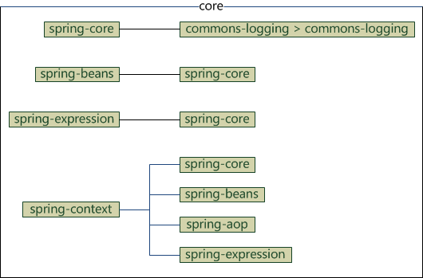
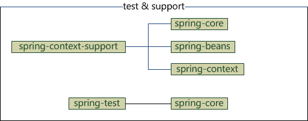

# Spring 笔记 1

## Spring jar 包及 maven 相关

使用 maven 时，引入 Spring 依赖时，不同的包有其不同的依赖，  这应该注意，以免重复引用。

**Spring Context 包的依赖：**
* spring-core
* spring-beans
* spring-aop
* spring-express

**Spring Context Support 包的依赖：**
* spring-core
* spring-beans
* spring-context

**Spring Beans 包的依赖：**
* spring-core

**Spring Core 包的依赖：**
* spring-jcl

**Spring AOP 包的依赖：**
* spring-core
* spring-beans

**Sping Web 包的依赖：**
* spring-core
* spring-beans

**Spring Web MVC 包的依赖：**
* spring-core
* spring-context
* spring-beans
* spring-aop
* spring-expression
* spring-web

**Spring JDBC 包的依赖：**
* spring-core
* spring-beans
* spring-tx

**Spring TX 包的依赖：**
* spring-core
* spring-beans

从上面的包依赖，可以看出，spring 各组件基础依赖都是 core、beans 和 context，而 **Spring Context** 包又包含了 core 和 beans，所以如果做 Spring 非 web 应用时，只用在 maven 的 pom 文件中添加 **Spring Context** 的包就可以了。  

如果使用 web 就多加个 web 包，如果是使用 **Spring MVC** 框架，那因为 **Spring MVC** 包已经包含了 **Spring Context** 及其依赖包，所以 maven 的 pom 文件只用添加一个 Spring MVC 依赖就可以。

