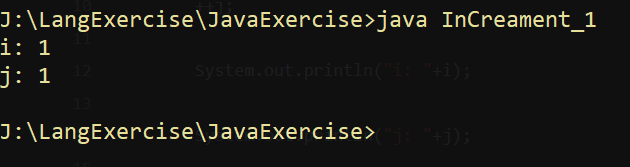
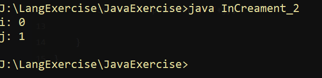
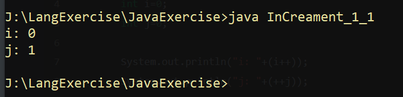
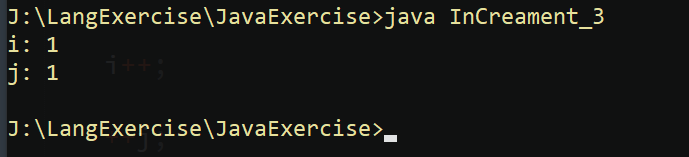
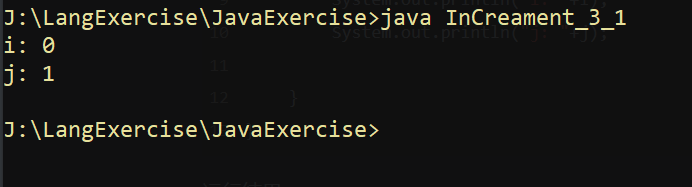
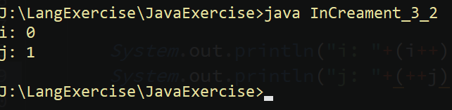

# 												**i++和++i**

---


## int类型前后++

### int无赋值++

#### 例子1:

```java
public class InCreament_1{
	public static void main(String[] args) {
		
		int i=0;
		int j=0;

		i++;
		++j;

		System.out.println("i: "+i);
		System.out.println("j: "+j);

	}
}
```

运行结果:



​	使用javap分析:

```
public class InCreament_1 {
  public InCreament_1();
    Code:
       0: aload_0
       1: invokespecial #1                  // Method java/lang/Object."<init>":()V
       4: return

  public static void main(java.lang.String[]);
    Code:
       0: iconst_0
       1: istore_1
       2: iconst_0
       3: istore_2
       4: iinc          1, 1
       7: iinc          2, 1
      10: getstatic     #2                  // Field java/lang/System.out:Ljava/io/PrintStream;
      13: new           #3                  // class java/lang/StringBuilder
      16: dup
      17: invokespecial #4                  // Method java/lang/StringBuilder."<init>":()V
      20: ldc           #5                  // String i:
      22: invokevirtual #6                  // Method java/lang/StringBuilder.append:(Ljava/lang/String;)Ljava/lang/StringBuilder;
      25: iload_1
      26: invokevirtual #7                  // Method java/lang/StringBuilder.append:(I)Ljava/lang/StringBuilder;
      29: invokevirtual #8                  // Method java/lang/StringBuilder.toString:()Ljava/lang/String;
      32: invokevirtual #9                  // Method java/io/PrintStream.println:(Ljava/lang/String;)V
      35: getstatic     #2                  // Field java/lang/System.out:Ljava/io/PrintStream;
      38: new           #3                  // class java/lang/StringBuilder
      41: dup
      42: invokespecial #4                  // Method java/lang/StringBuilder."<init>":()V
      45: ldc           #10                 // String j:
      47: invokevirtual #6                  // Method java/lang/StringBuilder.append:(Ljava/lang/String;)Ljava/lang/StringBuilder;
      50: iload_2
      51: invokevirtual #7                  // Method java/lang/StringBuilder.append:(I)Ljava/lang/StringBuilder;
      54: invokevirtual #8                  // Method java/lang/StringBuilder.toString:()Ljava/lang/String;
      57: invokevirtual #9                  // Method java/io/PrintStream.println:(Ljava/lang/String;)V
      60: return
```

从第**4**行和第**7**行的指令，可以看到无论是++在前还是在后，都是调了iinc，此指令是jvm专门针对int类型“优化”的自增指令。此自增是直接对局部变量表(有的地方也翻译为"本地变量表")中数据自增，这就是所谓的"先自增后赋值"或"诸多赋值后自增"中的自增，自增是局部变量表中的数据自增。

第**25**行和第**50**行中 **iload_1**和**iload_2**两个指令,是从局部变量表将数据加载进操作数栈中，这样才能让println()方法调用将数据显示出来,而因为上面iinc指令直接对局部变量表自增了，所以无论i++还是++i，最后都是显示**1**。

----------------------------------------------------------------------------------------------

### int 赋值++

#### 例子2:

```java
public class InCreament_2{
	public static void main(String[] args) {
		
		int i=0;
		int j=0;


		i=i++;
		j=++j;

		System.out.println("i: "+i);
		System.out.println("j: "+j);

	}
}
```


运行结果:




javap分析:


```
public class InCreament_2 {
  public InCreament_2();
    Code:
       0: aload_0
       1: invokespecial #1                  // Method java/lang/Object."<init>":()V
       4: return

  public static void main(java.lang.String[]);
    Code:
       0: iconst_0
       1: istore_1
       2: iconst_0
       3: istore_2
       4: iload_1
       5: iinc          1, 1
       8: istore_1
       9: iinc          2, 1
      12: iload_2
      13: istore_2
      14: getstatic     #2                  // Field java/lang/System.out:Ljava/io/PrintStream;
      17: new           #3                  // class java/lang/StringBuilder
      20: dup
      21: invokespecial #4                  // Method java/lang/StringBuilder."<init>":()V
      24: ldc           #5                  // String i:
      26: invokevirtual #6                  // Method java/lang/StringBuilder.append:(Ljava/lang/String;)Ljava/lang/StringBuilder;
      29: iload_1
      30: invokevirtual #7                  // Method java/lang/StringBuilder.append:(I)Ljava/lang/StringBuilder;
      33: invokevirtual #8                  // Method java/lang/StringBuilder.toString:()Ljava/lang/String;
      36: invokevirtual #9                  // Method java/io/PrintStream.println:(Ljava/lang/String;)V
      39: getstatic     #2                  // Field java/lang/System.out:Ljava/io/PrintStream;
      42: new           #3                  // class java/lang/StringBuilder
      45: dup
      46: invokespecial #4                  // Method java/lang/StringBuilder."<init>":()V
      49: ldc           #10                 // String j:
      51: invokevirtual #6                  // Method java/lang/StringBuilder.append:(Ljava/lang/String;)Ljava/lang/StringBuilder;
      54: iload_2
      55: invokevirtual #7                  // Method java/lang/StringBuilder.append:(I)Ljava/lang/StringBuilder;
      58: invokevirtual #8                  // Method java/lang/StringBuilder.toString:()Ljava/lang/String;
      61: invokevirtual #9                  // Method java/io/PrintStream.println:(Ljava/lang/String;)V
      64: return
}
```


i=i++对应的指令是

```
4: iload_1
5: iinc          1, 1
8: istore_1
```

第**4**行指令：从**局部变量表**中 load  变量 i 的数据到**操作数栈**中，因为还没对**局部变量表中** i 的变量进行自增，所以 load 到**操作数栈** i 的值为 **0**。

第**5**行指令： 对**局部变量表** i 变量自增，这时局部变量表中 i 的值为 1。

第 **8** 行指令：将**操作数栈** 中 i 变量出栈保存到**局部变量表**中 i 变量中。而这时操作数栈的i值是0，即将0保存进局部变量表，所以之前自增后的i又被数据"覆盖"变成0。所以最后在第**29**行iload_1指令，将局部变量表中i值加载进栈顶，让println()方法调用显示，最后就如上面的结果一样，i=i++的结果是0。


j=++j对应指令是

```
9: iinc          2, 1
12: iload_2
13: istore_2
```

第**9**行iinc指令：先对局部变量表j的数据自增

第**12**行iload_2指令: 是将局部变量表的数据加载进操作数栈，这时局部变量表j的数据是1，加载进栈顶，这时操作数栈j的数据是1

第**13**行指令istore_2指令: 将操作数栈的数据保存进局部变量表，这时局部变量表j的数据仍为1

所以最后在第**54**行的**iload_2**指令，从局部变量表将j数据加载进操作数栈栈顶，让println()方法调用时，显示j的结果是1。

i=i++与j=++j两条语句在指令分析上，最大区别，就是**iinc** 这个指令是先执行还是后执行。**++**在前，那就先对局部变量表进行自增，**++** 在后，就先从局部变量表加载数据到操作数栈后再对局部变量表中的变量进行自增。而因为局部变量表自增的时机不同，就出现 **i=i++** 与 **j=++j** 两条语句执行结果差异。而常见的说法：「先自增再赋值，先赋值后自增」，原理就在这里！

----------------------------------------------------------------

### 在别的方法中调用

#### 例子3:

```java
public class InCreament_1_1{
	public static void main(String[] args) {
			
		int i=0;
		int j=0;

		System.out.println("i: "+(i++));
		System.out.println("j: "+(++j));


	}
}
```


运行结果:




javap分析:

```
public class InCreament_1_1 {
  public InCreament_1_1();
    Code:
       0: aload_0
       1: invokespecial #1                  // Method java/lang/Object."<init>":()V
       4: return

  public static void main(java.lang.String[]);
    Code:
       0: iconst_0
       1: istore_1
       2: iconst_0
       3: istore_2
       4: getstatic     #2                  // Field java/lang/System.out:Ljava/io/PrintStream;
       7: new           #3                  // class java/lang/StringBuilder
      10: dup
      11: invokespecial #4                  // Method java/lang/StringBuilder."<init>":()V
      14: ldc           #5                  // String i:
      16: invokevirtual #6                  // Method java/lang/StringBuilder.append:(Ljava/lang/String;)Ljava/lang/StringBuilder;
      19: iload_1
      20: iinc          1, 1
      23: invokevirtual #7                  // Method java/lang/StringBuilder.append:(I)Ljava/lang/StringBuilder;
      26: invokevirtual #8                  // Method java/lang/StringBuilder.toString:()Ljava/lang/String;
      29: invokevirtual #9                  // Method java/io/PrintStream.println:(Ljava/lang/String;)V
      32: getstatic     #2                  // Field java/lang/System.out:Ljava/io/PrintStream;
      35: new           #3                  // class java/lang/StringBuilder
      38: dup
      39: invokespecial #4                  // Method java/lang/StringBuilder."<init>":()V
      42: ldc           #10                 // String j:
      44: invokevirtual #6                  // Method java/lang/StringBuilder.append:(Ljava/lang/String;)Ljava/lang/StringBuilder;
      47: iinc          2, 1
      50: iload_2
      51: invokevirtual #7                  // Method java/lang/StringBuilder.append:(I)Ljava/lang/StringBuilder;
      54: invokevirtual #8                  // Method java/lang/StringBuilder.toString:()Ljava/lang/String;
      57: invokevirtual #9                  // Method java/io/PrintStream.println:(Ljava/lang/String;)V
      60: return
}
```


println()方法中的i++的对应的指令:

```
19: iload_1
20: iinc          1, 1
```

而另一个println()方法中对应的指令:

```
47: iinc          2, 1
50: iload_2
```

这时"先自增"或"后自增"的特性才显现出来。

i++，先是从局部变量表load数据到操作数栈，然后才将局部变量表中的i的数据自增为1，而println()方法调的是操作数栈的数据，而这时的操作数栈i的数据为0，所以结果显示i为0。

++j，第**47**、**50**行指令可以看出先对局部变量表中j的数据自增为1，然后才将局部变量表的数据load进操作数栈，最后println()方法调操作数栈数据，所以j的结果显示为1。

这与例2的赋值语句情况是一样的。

-------

### 总结

上面三个例子，可以看出"先自增后赋值"或"先赋值后自增"的说法是具有迷惑和误导性的。++无论在前还是在后，单独存在是没有意义的，必须有赋值或与其他语句一起使用，"先自增"或"后自增"的特性才会显现出来。

----

## long类型的前后++

---

### long无赋值++

#### 例子4:

```java
public class InCreament_3{
	public static void main(String[] args) {
		long i=0L;
		long j=0L;

		i++;

		++j;

		System.out.println("i: "+i);
		System.out.println("j: "+j);


	}
}
```

运行结果:



跟例子1结果完全一样。

javap分析:

```
Compiled from "InCreament_3.java"
public class InCreament_3 {
  public InCreament_3();
    Code:
       0: aload_0
       1: invokespecial #1                  // Method java/lang/Object."<init>":()V
       4: return

  public static void main(java.lang.String[]);
    Code:
       0: lconst_0
       1: lstore_1
       2: lconst_0
       3: lstore_3
       4: lload_1
       5: lconst_1
       6: ladd
       7: lstore_1
       8: lload_3
       9: lconst_1
      10: ladd
      11: lstore_3
      12: getstatic     #2                  // Field java/lang/System.out:Ljava/io/PrintStream;
      15: new           #3                  // class java/lang/StringBuilder
      18: dup
      19: invokespecial #4                  // Method java/lang/StringBuilder."<init>":()V
      22: ldc           #5                  // String i:
      24: invokevirtual #6                  // Method java/lang/StringBuilder.append:(Ljava/lang/String;)Ljava/lang/StringBuilder;
      27: lload_1
      28: invokevirtual #7                  // Method java/lang/StringBuilder.append:(J)Ljava/lang/StringBuilder;
      31: invokevirtual #8                  // Method java/lang/StringBuilder.toString:()Ljava/lang/String;
      34: invokevirtual #9                  // Method java/io/PrintStream.println:(Ljava/lang/String;)V
      37: getstatic     #2                  // Field java/lang/System.out:Ljava/io/PrintStream;
      40: new           #3                  // class java/lang/StringBuilder
      43: dup
      44: invokespecial #4                  // Method java/lang/StringBuilder."<init>":()V
      47: ldc           #10                 // String j:
      49: invokevirtual #6                  // Method java/lang/StringBuilder.append:(Ljava/lang/String;)Ljava/lang/StringBuilder;
      52: lload_3
      53: invokevirtual #7                  // Method java/lang/StringBuilder.append:(J)Ljava/lang/StringBuilder;
      56: invokevirtual #8                  // Method java/lang/StringBuilder.toString:()Ljava/lang/String;
      59: invokevirtual #9                  // Method java/io/PrintStream.println:(Ljava/lang/String;)V
      62: return
}
```


其中i++对应的指令如下:

```
4: lload_1
5: lconst_1
6: ladd
7: lstore_1
```

因为long类型没有编译器对int类型那样的"特殊照顾"，所以只能老老实实add。

大致步骤

1.lload_1--从局部变量表位置1中取出i的数据加载进操作数栈

2.将一个long类型的常量压入操作数栈栈顶

3.使用ladd指令将前两个元素出栈并相加，最后将相加的结果重新入栈

4.使用lstore指令将栈顶的相加结果保存入局部变量表i变量对应的位置

而++j对应的是第**8**~第**11**行指令，与上面的i++完全一样。

这就是long类型的++。

---


### long赋值++

#### 例子5

```java
public class InCreament_3_1{
	public static void main(String[] args) {
		long i=0L;
		long j=0L;

		i=i++;
		j=++j;

		System.out.println("i: "+i);
		System.out.println("j: "+j);

	}
}
```

运行结果:



与例子2结果完全一样

javap分析:

```
Compiled from "InCreament_3_1.java"
public class InCreament_3_1 {
  public InCreament_3_1();
    Code:
       0: aload_0
       1: invokespecial #1                  // Method java/lang/Object."<init>":()V
       4: return

  public static void main(java.lang.String[]);
    Code:
       0: lconst_0
       1: lstore_1
       2: lconst_0
       3: lstore_3
       4: lload_1
       5: dup2
       6: lconst_1
       7: ladd
       8: lstore_1
       9: lstore_1
      10: lload_3
      11: lconst_1
      12: ladd
      13: dup2
      14: lstore_3
      15: lstore_3
      16: getstatic     #2                  // Field java/lang/System.out:Ljava/io/PrintStream;
      19: new           #3                  // class java/lang/StringBuilder
      22: dup
      23: invokespecial #4                  // Method java/lang/StringBuilder."<init>":()V
      26: ldc           #5                  // String i:
      28: invokevirtual #6                  // Method java/lang/StringBuilder.append:(Ljava/lang/String;)Ljava/lang/StringBuilder;
      31: lload_1
      32: invokevirtual #7                  // Method java/lang/StringBuilder.append:(J)Ljava/lang/StringBuilder;
      35: invokevirtual #8                  // Method java/lang/StringBuilder.toString:()Ljava/lang/String;
      38: invokevirtual #9                  // Method java/io/PrintStream.println:(Ljava/lang/String;)V
      41: getstatic     #2                  // Field java/lang/System.out:Ljava/io/PrintStream;
      44: new           #3                  // class java/lang/StringBuilder
      47: dup
      48: invokespecial #4                  // Method java/lang/StringBuilder."<init>":()V
      51: ldc           #10                 // String j:
      53: invokevirtual #6                  // Method java/lang/StringBuilder.append:(Ljava/lang/String;)Ljava/lang/StringBuilder;
      56: lload_3
      57: invokevirtual #7                  // Method java/lang/StringBuilder.append:(J)Ljava/lang/StringBuilder;
      60: invokevirtual #8                  // Method java/lang/StringBuilder.toString:()Ljava/lang/String;
      63: invokevirtual #9                  // Method java/io/PrintStream.println:(Ljava/lang/String;)V
      66: return
}
```

i=i++对应指令如下:

```
    4: lload_1
    5: dup2
    6: lconst_1
    7: ladd
    8: lstore_1
    9: lstore_1
```
步骤:
    1. 从局部变量表加载i数据进操作数栈
    2. 复制栈顶数据并入栈，栈顶数据为0
    3. 常量0入栈，栈顶数据为0
    4. add栈顶二数并将结果压栈，栈顶数据为1
    5. 将栈顶数据出栈保存进局部变量表中，栈顶数据为0，局部变量表中i的值为1
    6. 再将栈顶数据出栈保存进局部变量表，因此时栈顶数据为0，所以此时局部变量表中i的值变为0

j=++j;对应指令如下:

```
 lload_3
      10: lload_3
      11: lconst_1
      12: ladd
      13: dup2
      14: lstore_3
      15: lstore_3
```


---


## 直接在print方法中调用


运行结果:

