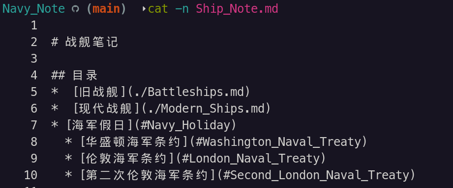
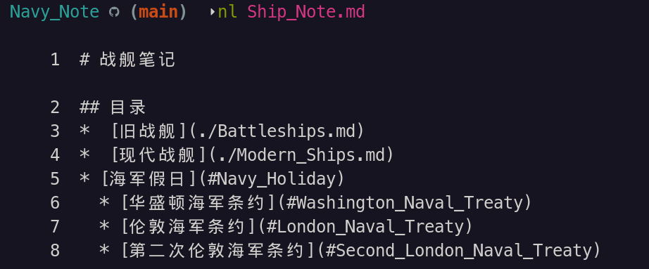
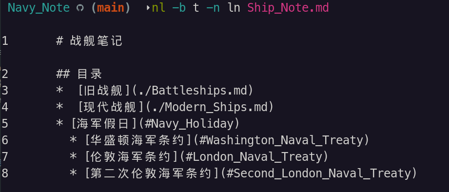
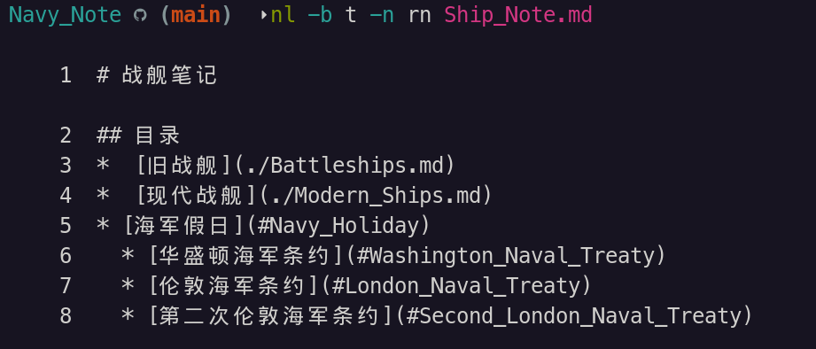
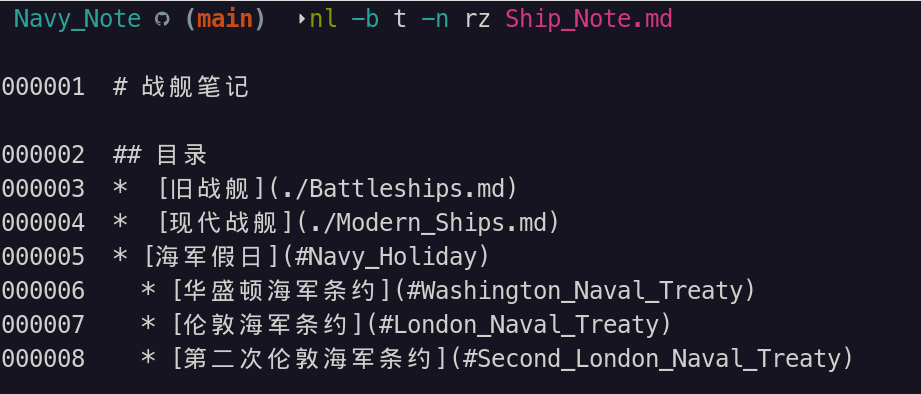
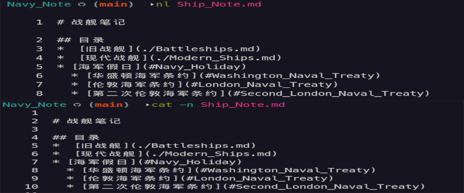
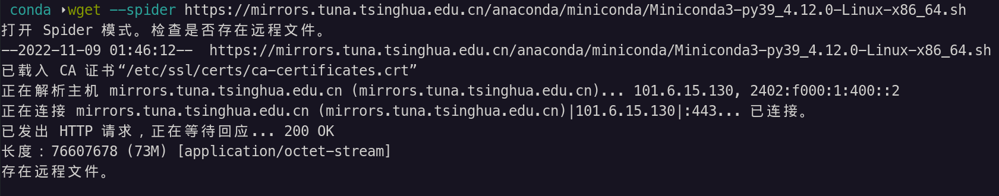

# Linux 笔记

---
## 目录

* [配置文件](#linux_configs)

* [打包压缩](#linux_tarc)
  * [Tar 命令](#linux_tarc_tar)
  * [压缩工具](#linux_tarc_comptools)
    * [gzip](#linux_tarc_comptools_gzip)
    * [bzip2](#linux_tarc_comptools_bzip)
    * [compress](#linux_tarc_comptools_compress)
    * [XZ](#linux_tarc_comptools_xz)
* [文本处理](#linux_textprocessing)
	* [文本处理常用命令](#linux_textprocessing_commands)
	* [正则表达式](#linux_textprocessing_regex)
	* [grep](#linux_textprocessing_regex)
	* [sed](#linux_textprocessing_sed)
	* [awk](#linux_textprocessing_awk)
* [字体](#linux_font)
* [网络](#linux_network) ^dee618
  * [Linux 网络相关命令](#linux_network_command)
    * [ip](#linux_network_command_ip)
    * [curl](#linux_network_command_curl)
* [SSH 相关](#linux_ssh)
    * [安装与设置](#linux_ssh_insconf)
    * [SSH 各种问题](#linux_ssh_bugs)
* [Shell相关](#linux_shell)

* [部分软件安装设置](#linux_soft_installsetup)
  * [使用 desktop](#linux_soft_install_desktop)
---

## <span id="linux_configs">配置文件</span>

* profile 文件

  profile（`/etc/profile`） 文件用于设置系统级的环境变量和启动程序，在这个文件下配置会对所有用户生效。
  
  `~/.profile` 这是用户级别的环境变量配置文件。

  大多数发行版使用的是`~/.profile` 。因为`~/.profile` 文件可以被所有 Shell 读取，而 `~/.bash_profile` 仅能被 **Bash Shell** 读取。

* bashrc

  bashrc 只会被 bash shell 调用。

  bashrc 文件分为两种级别：
    * 系统级：`/etc/bashrc`
    * 用户级：`~/.bashrc`

  bashrc 是交互式非登录 Shell 时被执行。

* bash_profile 文件

  bash_profile 文件是作为交互式登录 Shell 被调用情况下，被读取执行。

在登录 Shell 的 bash 环境时，会依序执行以下三个文件其中一个：
* `~/.bash_profile`
* `~/.bash_login`
* `~/.profile`

 根据使用者账号，于其 `homt` 目录内读取 `~/.bash_profile` ；

 读取失败则会读取 `~/.bash_login` ；

 再次读取失败则读取 `~/.profile` 
 > 这三个文件设定基本无差别，仅读取上有优先关系

> 路径末尾不能以 **\/** 结尾，否则将导致整个 PATH 变量出错。

---

## <span id="linux_tarc">打包压缩</span>

Linux 下打包和压缩是分两部分的。

### <span id="linux_tarc_tar">Tar 命令</span>

Linux 下最常用的打包程序就是 tar。

tar 本身只能用来打包，不具备压缩能力。但 tar 可以与 gzip、bzip2等压缩工具结合一起来用。

tar 包以 **.tar** 为后缀名。

tar 常用选项和参数：

* -f（--file）：指定存档或设备中的文件（默认是 「-」，表示 标准输入/输出）
* -v （--verbose）：显示文件处理过程
* -t （--list）：查看存档中的文件列表
* -C （--directory）：提取存档到指定目录
* -c （--create）：创建一个新的存档，即「压缩」
* -x （--extract）：从存档提取文件，即「解压」
* -r （--append）：将文件附加到存档结尾，即增加文件到包中
* -u （--update）：仅将较新的文件附加到存档中，即更新
> -u 只会添加 mtime 初修改过的文件；-r 直接添加，不检查 mtime。

---

### <span id="linux_tarc_comptools">压缩工具</span>

#### <span id="linux_tarc_comptools_gzip">gzip</span>

gzip 是 GNU 组织开发的一个压缩程序，后缀名为 **.gz** 。

与 gzip 相对的解压的程序是 gunzip。

与 tar 配合使用，通过 **-z** 参数来调用。

使用示例：
```shell
# 打包并使用 gzip 压缩
tar -czvf xxx.tar.gz *.jpg

# 解压
tar -xzvf xxx.tar.gz

# 查看包内文件
tar -tzf xxx.tar.gz

# 如果加上v 可以看到包内文件的如权限等详细信息
tar -czvf xxx.tar.gz
tar -xzvf xxx.tar.gz

```

#### <span id="linux_tarc_comptools_bzip">bzip2</span>

**bzip2** 是一个压缩能力更强的压缩程序，后缀名为 **.bz2**。

与 bzip2 相对的解压程序是 **bunzip2**。

与 tar 配合使用，通过 **-j** 参数来调用。

使用示例：
```shell
tar -cjf xxx.tar.bz2 *.jpg

# 解压
tar -xjf xxx.tar.bz2

# 如果加上v 可以看到包内文件的如权限等详细信息
tar -cjvf xxx.tar.gz
tar -xjvf xxx.tar.gz
```

#### <span id="linux_tarc_comptools_compress">compress</span>

**compress** 也是一个压缩程序，不过用得比较少，后缀名为 **.Z**。

与 compress 相对的解压程序是 **uncompress**。

与 tar 配合使用，通过 **-Z** 参数来调用。

使用示例：
```shell
tar -cZf xxx.tar.Z *.jpg

# 解压
tar -xZf xxx.tar.Z

# 如果加上v 可以看到包内文件的如权限等详细信息
tar -cZvf xxx.tar.Z
tar -xZvf xxx.tar.Z
```

#### <span id="linux_tarc_comptools_xz">XZ Utils</span>

[XZ Utils](http://tukaani.org/xz/) 是使用 「LZMA」算法的无损数据压缩的压缩程序。

因为早期 xz 与 tar 没有整合，所以压缩和解压得分「两步走」。

常用选项：
* `-z,--compress`：压缩文件并删除被压缩文件
* `-d,--decompress`：解压并删除压缩包
* `-k,--keep`：压缩或解压时保留源文件
* `-0...9`：设置压缩等级，0~9，不设置默认为 6
* `-v`：压缩和解压过程详细信息

示例：

* 压缩
```shell
# 先 tar
tar -cvf xxx.tar xxx
# 压缩
xz -z xxx.tar

```
* 解压
```shell
# 解压 xz
xz -d xxx.tar.xz
# 如果保留压缩包
xz -dk xxx.tar.xz

# 解压 tar包
tar -xvf xxx.tar

```

与 tar 配合使用，通过 **-J** 参数来调用。
> 低版本的 tar 不支持，就得先 tar 再使用

示例：
```shell
# 压缩
tar -Jcf xxx.tar.xz *.jpg

# 解压
tar -Jxf xxx.tar.xz

```

---

## <span id="linux_textprocessing">文本处理</span>

### <span id="linux_textprocessing_commands">文本处理常用命令</span>

#### <span id="linux_textprocessing_commands_cat">cat</span>

`cat` 命令是由第一行开始显示文件内容。

常用选项及参数：
* `-A`：可列出一些特殊字符而不是空白而已
* `-b`：列出行号，仅针对非空白行做行号显示，空白行不标行号
* `-E`：结尾的断行字符 **$** 显示出来
* `-n`：打印出行号，连空白行也会有行行号
* `-T`：将 **tab** 键以 **\^I** 显示出来
* `-v`：列出一些看不出来的特殊字符

`cat -n` 这是将行号也一并打印出来。


#### <span id="linux_textprocessing_commands_tac">tac</span>

`tac` 命令是从最后一行开始显示，`tac` 是 `cat` 的倒着写。

#### <span id="linux_textprocessing_commands_nl">nl</span>

`nl` 添加行号打印

`nl` 选项和参数：

| 选项和参数 | 功能 |
| :---: | :---: |
| -b, --body-numbering=样式    |    使用 <样式> 对正文的行进行编号 |
 |  -d, --section-delimiter=CC |      使用 CC 作为逻辑页分隔符 |
 | -f, --footer-numbering=样式  |   使用 <样式> 对页脚的行进行编号 |
 | -h, --header-numbering=样式  |   使用 <样式> 对页眉的行进行编号 |
 | -i, --line-increment=数值    |   设置每一行行号的自动递增值 |
 | -l, --join-blank-lines=数值  |   将 <数值> 行连续的空行视为一行 |
 | -n, --number-format=格式     |   按照指定 <格式> 插入行号 |
 | -p, --no-renumber            |   在切换至下一节时不重置行号值 |
 | -s, --number-separator=字符串   | 在可能出现的行号后添加 <字符串> |
 | -v, --starting-line-number=数值 |   每一节第一行的行号 |
 | -w, --number-width=数值 |       设置行号的宽度为 <数值> 列 |

样式列表：

| 样式参数 | 功能 |
| :---: | :---: |
| a |  对所有行编号 |
| t | 仅对非空行编号 |
| n |  不对任何行编号 |
| pBRE | 仅对匹配基本正则表达式 BRE 的行编号 |

示例：

```shell
# 默认什么参数都不加
nl Ship_Note.md
```


```shell
# 只有非空行显示行号
nl -b t Ship_Note.md
```

```shell
# 所有行都不显示行号
nl -b n Ship_Note.md
```

```shell
# 所有行都显示行号，包括空行
nl -b a Ship_Note.md
```

行号格式：
| 参数 | 对齐方式 | 有无前导 0 |
|:---: |:---: |:---: |
| ln | 左对齐 | 无前导 0 |
| rn | 右对齐 | 无前导 0 |
| rz | 右对齐 | 有前导 0 |

示例：
```shell
nl -b t -n ln Ship_Note.md
```


```shell
nl -b t -n rn Ship_Note.md
```


```shell
nl -b t -n rz Ship_Note.md
```


效果相似命令对比：

与 `nl` 命令相似，但 `cat -n` 是连空行也一并加上行号，而 `nl` 默认不加任何参数或选项，行号是忽略空行。如下图：



#### <span id="linux_textprocessing_commands_more">more</span>

[cat](#linux_textprocessing_commands_cat)、[tac](#linux_textprocessing_commands_tac) 和 [nl](#linux_textprocessing_commands_nl) 这三个命令都是把文件一次性打印在屏幕上。想要一页页的翻动查看，就使用 `more` 命令和 [less](#linux_textprocessing_commands_less) 命令。

more 命令一些按键操作：
* 空格（space）： 向下翻一页
* Enter： 向下一行
* `/`： 向下搜索「字符串」
* `:f`： 显示出文件名及目前显示的行数
* q： 退出 more，不再显示该文件内容
* b 或 ctrl-b： 往回翻页，只对文件有用

`more` 命令中的搜索：
`/` 后输入要搜索的内容，按回车就开始向下搜索，按 `n` 就会跳转到下一个搜索结果。


#### <span id="linux_textprocessing_commands_less">less</span>

#### <span id="linux_textprocessing_commands_head">head</span>

#### <span id="linux_textprocessing_commands_tail">tail</span>

#### <span id="linux_textprocessing_commands_tr">tr</span>

#### <span id="linux_textprocessing_commands_wc">wc</span>

`wc` 命令用于统计指定文本的行数、字数、字节数，格式：`wc [参数] 文本`。

| 参数 | 功能 |
| :---: | :---: |
|  -l    |  统计行数     |
|  -w   |    统计字数  |
|   -c   |     统计字节数 |

如果任何参数都不给，就是依次显示行数、字数和字节数的统计结果。

#### <span id="linux_textprocessing_commands_stat">stat</span>

`stat` 命令用于查看文件的具体不住信息和埋单信息，格式为：`stat 文件名称`。

### <span id="linux_textprocessing_regex">正则表达式</span>

### <span id="linux_textprocessing_grep">grep</span>
grep 全称是 「global search regular expression and print out the line」，翻译过来就是**全局搜索正则表达式并把行打印出来**。

grep 是一个程序族，包括了 **grep**、**egrep** 和 **fgrep**。

Linux 中使用的 GNU 版本的 grep ，可以直接通过 `-G`、`-E` 和 `-F` 命令选项来使用 grep、egrep 和 fgrep 的功能。

### <span id="linux_textprocessing_sed">sed</span>

### <span id="linux_textprocessing_awk">awk</span>

---

## <span id="linux_font">字体</span>

安装字体：
1. 使用字体安装程序点击安装
> 也可以直接将字体文件复制到 `/usr/share/fonts` 目录下  
> 如果是 ttf 字体，应复制在 `/usr/share/fonts/TTF` 目录下  
> 也可以直接把字体文件复制到 `~/.local/share/fonts` 目录， 这是仅当前用户可用的字体

2. 刷新
```shell
fc-cache -fv
```

查看字体：
```shell
# 查看中文字体
fc-list :lang=zh
```

---

## <span id="linux_network">网络</span>

### <span id="linux_networkd">一些网络概念</span>


相关笔记列表：

* [Network_Note](../Network/Network_Note.md)
* [Http_Note](../Network/Http_Note.md)


#### 以太

**以太**是一种虚拟的物质，英文 Ether的音译，一般可以理解为一种看不见摸不着的物质。

最早提出「以太」概念是亚里士多德。

随着科学发展，「以太」理论也逐渐被科学界抛弃。

虽然以太理论已经基本被淘汰，但「以太」这词在使用中并未消亡，「以太网」就是其一。

以太网是一种计算机局域网技术，而IEEE 802.3 标准则是以太网技术被广泛应用之后制定的以太网技术标准。

以太网是目前应用最普遍的局域网技术。

也就是因为有此原因，所以 Linux 系统中网络接口都使用 「eth」为名称。

#### <span id="linux_network_bridge">网桥</span>

简单说，网桥就是连通两个本来处于隔离的网络的一个「桥梁」。

---

### <span id="linux_network_command">Linux 中网络相关命令和工具</span>

#### <span id="linux_network_command_ip">IP 概念</span>

`ip` 命令 是用来查询或维护网络相关的工具。

包括**路由**（Routing）、**网络设备**（Device）、**策略路由**（Policy Routing）以及**隧道**（Tunnel）。

##### ip 常用命令

* `ip link`：显示网络设备
* `ip addr` ：查看网络地址  这个命令是把网络设置及网络地址、掩码都显示出来。比 `ip link` 多显示一些信息。
* `ip linke show 网络设备名称`：显示指定网络设备的信息。
* `ip link set 网络设备 up`：启用网络设备
* `ip link set 网络设备 down`：禁用网络设备

#### <span id="linux_network_command_downloader">命令下载工具</span>

##### <span id="linux_network_command_downloader_curl">curl</span>

[curl](https://curl.se) [](https://github.com/curl/curl) 是一个用来对服务器发起请求并把响应输出到标准输出的工具。所以单纯把它当成一个下载器，有点小瞧它了。

###### curl 常用操作

```shell
# 什么参数选项都不要，就是向指定地址发送一个 get 请求
# 然后将服务器响应的内容打印在屏幕上
curl http://www.baidu.com
```

```shell
# 除了打印出响应内容外，还将 head 部分出打印出来
curl -i url
```


```shell
# 将服务器响应保存成文件`a.html`
curl -o a.html http://xxx.com
```

```shell
# 注意这是 大 O，与上面的小 o 需要自已定义保存文件名不一样
# 将服务器响应保存成文件，以请求的最后部分当成文件名
curl -O http://www.com/a.html
```

```shell
# 指定代理
curl -x [protocol://]host[:port] Use this proxy
```


```shell
# 指定请求方式 : GET POST 等
# 一般来说，请求 GET 和 POST 都能向服务器发出获取数据的请求
# 但 HTTP 协议在制定时，默认给了这些方式相应的语义，从这个请求的名称就能看出
# GET 请求是向服务器发出获取数据的请求；而 POST 请求，是将数据提交到服务器的请求
# 示例
curl -X POST
```

```shell
# 指定参数，或提交数据
curl -d 
```


```shell
# 只显示文档的 head 部分
curl -I url
```


##### <span id="linux_network_command_downloader_wget">wget</span>

 [wget](https://www.gnu.org/software/wget/) 跟 [curl](https://curl.se) 类似的命令行下载器。

 wget 与 [curl](#linux_network_command_curl) 不一样，它主要就是用于下载。

###### wget 主要操作

```shell
# 无参 直接下载文件
wget http://xxx.com
```
  由无参这种**默认**方式，wget 是直接下载文件，就能看出 wget 重点是放在下载上的。

 ```shell
 # 大O 下载并重命令文件
 # 相当于 curl 的小o参数的操作
 wget -O rename.zip http://xxxx.com/xxx.xxx
```

```shell
# 断点下续传
# 使用 wget -c 重新启动下载中断的文件
wget -c http://xxx.com
```

 `-c` 和 `-O` 组合使用下载示例：
 ```shell
 wget -c -O miniconda_py39_4.12.0.sh https://mirrors.tuna.tsinghua.edu.cn/anaconda/miniconda/Miniconda3-py39_4.12.0-Linux-x86_64.sh
```

```shell
# --limit-rate= 使用来限速的
wget --limit-rate=400k URL
```

```shell
# 检测连接
wget –-spider URL
```
示例：


```shell
# 用于下载一个网站的多个资源
# -r 是递归下载
wget -r URL
# 与递归下载配合使用，限定只下载指定类型的文件
# -A 或 --accept= 后跟限定的文件类型，即文件扩展名列表，名扩展名使用逗号分隔
wget -r -A 扩展名 URL

# 与 -A 或 --accept 相反，--reject= 是拒绝下载指定类型文件，后面同样跟的是扩展名列表，同样使用逗号分隔
wget -r --reject=pdf,exe URL

# -l 或 --level=数字 指定递归深度，0 为不限制
wget -r -l 1 URL

# 示例：
# 只递归一层 只下载 扩展名为 azw3 的文件
wget -r -l 1 -A azw3 http://xxxxx

```

##### <span id="linux_network_command_downloader_aria2">aria2</span>

[aria2](http://aria2.github.io)[](https://github.com/aria2/aria2) 是一款非常强大的下载工具。

看它的一长串的定语，就知道它的强大：「多平台」、「支持多协议」、「支持多来尖」。

aria2 可以从多个来源、多个协议下载资源，最大程序上利用了你的带宽。

aria2 有着非常小的资源占用，在关闭磁盘缓存的情况下，物理内存占用通常为 4M，BT下载，CPU 占有率约为 6%。

aria2 特点：
* 高速、自动多线程下载；断点续传
* 内存占用少
* 多平台，支持 Windows、Linux、OSX、Android 等操作系统
* 模块化；分段下载引擎，文件整合速度快
* 支持 PRC 界面远程
* 全面支持 BtiTorrent 协议

##### <span id="linux_network_command_downloader_aria2_operate">aria2 常用操作</span>

最简单的使用，就是什么参数或选项都不加：
```shell
# 直接在命令行下载，下载完成自动退出，跟 wget 的工作方式类似
aria2c URL
```

设置连接数量：
```shell
# 下载连接的数量 默认为 5
-s, --split=N 
```

断点续传：
```shell
# 继续下载一个仅部分分完成的文件
-c, --continue[=true|false] 
```

指定文件保存的文件名：
```shell
-o, --out=FILE
```

后台下载：
```shell
-D,–-deamon=true
```

下载速度限制：
```shell
# 单文件下载速度限制 
# 单位 K 或 M
--max-download-limit=速度
# 全局
# 单位 K 或 M
--max-overall-download-limit=速度
```

```shell
# 0 意味着不限制。
# 可附加 K 或 M（1K=1024，1M=1024K）
-u, --max-upload-limit=速度
```

文件预分配方式：
```shell
# 文件预分配方式, 可选：none, prealloc, trunc, falloc, 默认:prealloc
# 预分配对于机械硬盘可有效降低磁盘碎片、提升磁盘读写性能、延长磁盘寿命。
# 机械硬盘使用 ext4（具有扩展支持），btrfs，xfs 或 NTFS（仅 MinGW 编译版本）等文件系统建议设置为 falloc
# 若无法下载，提示 fallocate failed.cause：Operation not supported 则说明不支持，请设置为 none
# prealloc 分配速度慢, trunc 无实际作用，不推荐使用。
# 固态硬盘不需要预分配，只建议设置为 none ，否则可能会导致双倍文件大小的数据写入，从而影响寿命。
--file-allocation=方式
```

列出 BT 种子的内容：
```shell
aria2c -S **.torrent
```

开启 RPC：
```shell
aria2c --enable-rpc --rpc-listen-all
```

###### <span id="linux_network_command_downloader_aria2_config">Aria2 配置</span>

默认用户配置文件放在：`~/.aria2/aria2.conf`
也可以通过命令行 `aria2 --conf-path` 命令指定配置文件路径。
示例：
```shell
aria2c --conf-path="/etc/aria2/aria2.conf"
```

Aria2 除了使用命令行临时配置，还可以将配置写进配置文件 `aria2.conf`。

常用配置：
```
# 磁盘缓存, 0 为禁用缓存，默认:16M
# 磁盘缓存的作用是把下载的数据块临时存储在内存中，然后集中写入硬盘，以减少磁盘 I/O ，提升读写性能，延长硬盘寿命。
# 建议在有足够的内存空闲情况下适当增加，但不要超过剩余可用内存空间大小。
# 此项值仅决定上限，实际对内存的占用取决于网速(带宽)和设备性能等其它因素。
disk-cache=64M

# 文件预分配方式, 可选：none, prealloc, trunc, falloc, 默认:prealloc
# 预分配对于机械硬盘可有效降低磁盘碎片、提升磁盘读写性能、延长磁盘寿命。
# 机械硬盘使用 ext4（具有扩展支持），btrfs，xfs 或 NTFS（仅 MinGW 编译版本）等文件系统建议设置为 falloc
# 若无法下载，提示 fallocate failed.cause：Operation not supported 则说明不支持，请设置为 none
# prealloc 分配速度慢, trunc 无实际作用，不推荐使用。
# 固态硬盘不需要预分配，只建议设置为 none ，否则可能会导致双倍文件大小的数据写入，从而影响寿命。
file-allocation=none

# 文件预分配大小限制。小于此选项值大小的文件不预分配空间，单位 K 或 M，默认：5M
no-file-allocation-limit=64M

# 断点续传
continue=true

# 文件预分配大小限制。小于此选项值大小的文件不预分配空间
# 单位 K 或 M，默认：5M
no-file-allocation-limit=64M

# GZip 支持，默认:false
http-accept-gzip=true

```

网上大神配置模板，可以参考着配：[https://github.com/P3TERX/aria2.conf/blob/master/aria2.conf](https://github.com/P3TERX/aria2.conf/blob/master/aria2.conf)

###### <span id="linux_network_command_downloader_aria2_ui">Aria2 UI 工具</span>

[aria2](#linux_network_command_downloader_aria2) 本身没有 UI ，这使得一些依赖图形界面的用户用起来不太方便，然后就出现各种基于 aria2 的带图形界面的下载器。 

下面介绍几款，用得比较多的基于 aria2 的下载器。

**Motrix**

[Motrix](https://motrix.app) 是一款开源的支持多平台的，基于 [aria2](#linux_network_command_downloader_aria2) 的下载工具。

它支持 HTTP、FTP、BT、磁力链、百度网盘等资源，界面简洁，开箱即用。

**AriaNg**
[AiraNg](https://github.com/mayswind/AriaNg) 基于 Aria2 Web 前端。同样也是开源的。


---

### IPtables 

IPtables 中可以做各种网络地址转换，网络地址转换主要有两种：**SNAT** 和 **DNAT**。

**SNAT** 是 「source networkaddress translation」的缩写，即「源地址目标转换」。

**DNAT** 是 「destination networkaddress translation」的缩写，即「目标网络地址转换」。

---

## <span id="linux_ssh">SSH</span>

### <span id="linux_ssh_insconf">安装和设置SSH</span>

以 debian 系为例

#### 安装：

```shell
apt-get update
apt-get upgrade

apt-get install openssh-server
```

#### 设置：

对`/etc/ssh/sshd_config` 文件进行设置。

* 开启端口：`Port 22`

* 监听地址：`ListenAddress 0.0.0.0`

* 添加 `PermitRootLogin yes` 使用 root 登录的权限

* 将`PermitTTY` 设为 `yes`

* 将 `UsePAM` 设为 `no`

#### 重启
```shell
service ssh restart
```
> 查看 ssh 是否已开启，可以使用 `ssh -V` 命令。

#### 连接

使用 ssh 命令连接到远程服务器：

```shell
ssh 用户名@ip -p 端口
```

### <span id="linux_ssh_bugs">SSH 各种问题</span>

`Host key verification failed` 错误

解决方法：

方法1： 直接将 `.ssh/known_hosts` 文件删除即可。

方法2： 修改 `/etc/ssh/ssh_config` 配置文件中，设置 `StrictHostKeyChecking` 的值

默认情况下，`StrictHostKeyChecking=ask` 。出现提示，如果连接和 key 不匹配，给出提示，并拒绝登录。

`StrictHostKeyChecking=no` 是最不安全的级别。如果连接 server 的 key 在本地不存在，那么就自动添加到文件中（默认是 `.ssh/known_hosts` 文件中），并且给出一个警告。

`StrictHostKeyChecking=yes` 是最安全级别。如果连接与 key 不匹配，就拒绝连接，不会提示详细信息。

### <span id="linux_ssh_tools">SSH 工具</span>

#### <span id="linux_ssh_tools_putty">Putty</span>

这是款古老的 SSH 工具。

优点：小巧、免费。
缺点：设置不太人性化

#### <span id="linux_ssh_tools_electerm">Electerm</span>

[Electerm](https://electerm.html5beta.com) [](https://github.com/electerm/electerm) 开源免费，而且 win、mac 和 linux 平台都能用。

其实 [Electerm](https://electerm.html5beta.com) 是能当终端使用的。

颜值还非常高：


#### <span id="linux_ssh_tools_tabby">Tabby</span>

[Tabby](https://tabby.sh) [](https://github.com/Eugeny/tabby) 同样是一款Win、Linux 和 Mac 都能用的开源 SSH 工具。之前的名字叫 「Terminus」。

其实这货更像是一个终端，只是集成了 SSH 功能。

这颜值比[Electerm](https://electerm.html5beta.com) 更高，功能更强。就是字体设置不太方便，还得手动输入字体名。

这货还能装插件，太过分了！

有一大堆的配色方案可选，真的非常过分了！

搭配插件，tabby 的配置能使用 gist 进行同步。

#### <span id="linux_ssh_tools_finalshell">FinalShell</span>

[FinalShell](https://www.hostbuf.com) 是一款 Win、Linux 和 Mac 都能用的 ssh 工具。

优点：功能强、设置顺手，所有平台都能用

缺点：耗内存、启动有点慢

---

## <span id="linux_shell">Shell 相关</span>

具体请查看[Shell 笔记](./Shell_Note.md)

---

## <span id="linux_soft_installsetup">部分软件安装设置</span>

---

### <span id="linux_soft_install_desktop">使用 desktop</span>

1. 新建 `desktop` 文件
在/usr/share/applications/目录中新建一个后缀名为desktop的文件
> 也可以在 .local/share/applications 目录新建 desktop 文件

2. 编辑 `desktop` 文件
> [Desktop Entry] (这里大小写敏感，写错一个就不会显示)  
> Type=Application 类型  
> Name=名称  
> Name[zh_CN]=简中名称  
> Name[zh_TW]=繁中名称  
> Comment=鼠标放在图标上时的提示文字  
> Comment[zh_CN]=与上类似不过是简体中文  
> Comment[zh_TW]=繁中的提示文字  
> Icon=图标路径  
> Exec=可执行文件的路径  
> Categories=程序的分类标签，多个标签使用;号分隔(Application;IDE;Development;Editor)  
> Terminal=false 是否使用启用终端  
> StartupNotify=true 

---

### <span id="linux_soft_install_komodo">Komodo Edit 安装</span>

1. 下载
```shell
wget https://downloads.activestate.com/Komodo/releases/12.0.1/Komodo-Edit-12.0.1-18441-linux-x86_64.tar.gz
```

2. 解压
```shell
tar -zxvf xxx.tar.gz
```

3. 安装

转到新解压的目录，开始安装：
```shell
sudo ./install.sh -I /opt/KomodoEdit
```

4. 添加 PATH 变量 

`.bashrc` 或 `.bash_profile` 文件中添加
```shell
export PATH=$PATH:/opt/KomodoEdit/bin
```
source `.bashrc` 或 `.bash_profile` 

5. 如果需要在终端中调，可以添加软链：
```shell
sudo ln -s /opt/KomodoEdit/bin/komodo /usr/local/bin/komodo
```

