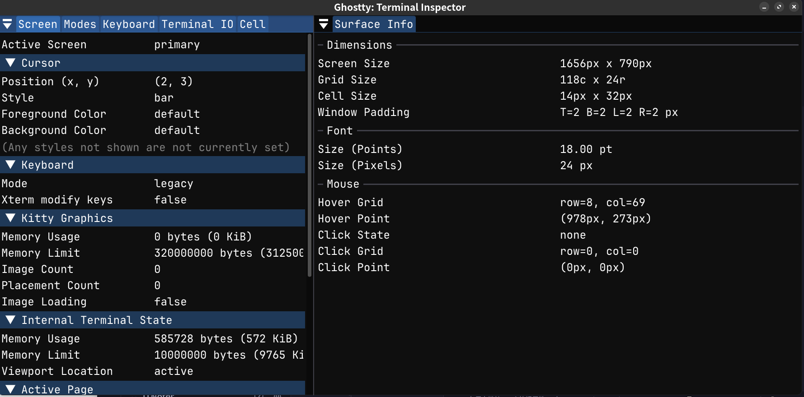
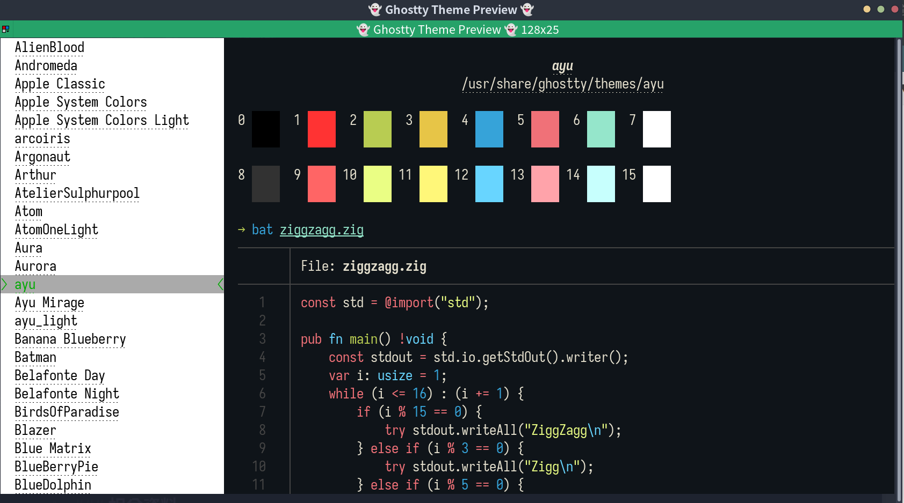

# 终端笔记

---

[Linux](Linux_Note.md) 有很多终端模拟器，现介绍几款。

## Terminator

[GitHub - gnome-terminator](https://github.com/gnome-terminator/terminator) 是一个功能非常强大的终端。

### 安装

```shell
yay -S terminator
```

### 相关目录

* `~/.config/terminator`：Terminator 配置目录。
* `~/.config/terminator/plugins`：Terminator 插件存放目录。

### 配置

#### 窗口大小

编辑 `~/.config/terminator/config` 这个文件。

```config
[layouts]
  [[default]]
    [[[window0]]]
      type = Window
      parent = ""
      size = 1600,800
```

`size` 就是窗口大小。

### Theme

[terminator-themes](https://github.com/EliverLara/terminator-themes) 这是一个 Terminator 的配色集合。

#### 安装 terminator-themes 插件

1. `git clone https://github.com/EliverLara/terminator-themes`
2. 将 `plugin` 中的 `terminator-themes.py` 文件复制到 `~/.config/terminator/plugins` 目录。
3. 在 Terminator 的插件选项中，勾选 `TerminatorThemes` 选项。
4. 重启 Terminator，右键菜单就看到 `Themes` 的选项，进去就能看到不同的 Theme 选项了。
5. 在 `布局` 选项中，`Terminal child1` 的 `配置` 选择已经安装的 Theme 为默认配色。
  > [!tip]
  > 
  > 如果不做这步，一重启 Terminator，配置又回到 default 配置。

### 相关文档资料

* [文档](https://terminator-gtk3.readthedocs.io/en/latest/index.html)

---

## Ghostty

[Ghostty](https://github.com/ghostty-org/ghostty) 是一个使用 Zig 语言编写的终端。


### 常用快捷键

* `Ctrl+Shift+T`：新开一个标签页
* `Ctrl+Shift+N`：新开一个窗口
* `Ctrl+,`：打开配置文件
* `Ctrl+Shift+,`：重载配置文件
* `Ctrl+Shift+I`：打开 [Teminal Inspect](#Teminal%20Inspect)

> [!tip] 
> 
> `ghostty +list-actions`：查看相关行为，用于快捷键绑定

### 配置

Ghostty 配置目录在 `~/.config/ghostty`，而配置文件在此目录中的 `config` 文件：

```shell
$ ll .config/ghostty
Permissions Size User       Group      Date Modified    Name
drwxr-xr-x     - silascript silascript 2025-02-27 03:27 .
drwx------     - silascript silascript 2025-02-27 03:27 ..
.rw-r--r--  1.5k silascript silascript 2025-02-27 03:27 config
```

> [!info] 
> 
> 使用 `ghostty +show-config --default --docs` 命令，可以查看配置文档。
> 
> 当然，也可以到 [Ghostty Docs](https://ghostty.org/docs) 查看文档。

Ghostty 的配置文件使用「键值对」格式。

#### 配置相关操作

* 打开配置文件，可以使用 `Ctrl+,` 快捷键。
* 改完配置文件保存后，可以「重载配置」，快捷键为 `Ctrl+Shift+,`。

### Teminal Inspect

Teminal Inspect 功能能查看当前 Ghostty 各种参数，如 [窗口大小](#窗口大小) 什么的。

快捷键：`Ctrl+Shift+I`



#### 窗口界面

`background-opacity`：背景透明度，和其他终端类似，设置范围 `0~1`。

`window-width`、`window-height`：初始窗口大小，是单位是「单元格」，可以使用 [Teminal Inspect](#Teminal%20Inspect) 来查看。

#### 主题

Ghostty 内置了大师的主题。可以使用 `ghostty +list-themes` 命令查看内置的主题列表。



配置主题：`theme = 主题名称`

#### 字体

使用 `ghostty +list-fonts` 命令列出可用字体。

`font-family`：首选字体
`font-size`：字体大小

#### 光标

`adjust-cursor-thickness`：光标粗细

#### 快捷键绑定

语法：`keybind = 具体的快捷键 = action`

示例：`keybind = ctrl+shift>w=close_window`

> [!important] 
> 
> 因为 Ghostty 的配置是以「键值对」存在，所以键 `=` 右边的值部分最好不能有空格，如果有空格得用 `"` 双引号来括起来。而像快捷键绑定这种配置，因为「值」部分还有一个 `=` 那就更不能有空格了，不然会出现「歧义」。

### 相关资料

* [Ghostty 终端配置指南](https://blog.axiaoxin.com/post/ghostty-config-guide/#ghostty-%E4%B8%BB%E9%A2%98%E5%92%8C%E9%A2%9C%E8%89%B2%E9%85%8D%E7%BD%AE)
* [Ghostty 终端默认快捷键列表 - 阿小信的博客](https://blog.axiaoxin.com/post/ghostty-default-keybinds/)
* [前端 - Ghostty 终端默认快捷键列表 - 个人文章 - SegmentFault 思否](https://segmentfault.com/a/1190000045923449)

---

## 相关笔记

* [Linux 笔记](Linux_Note.md)

