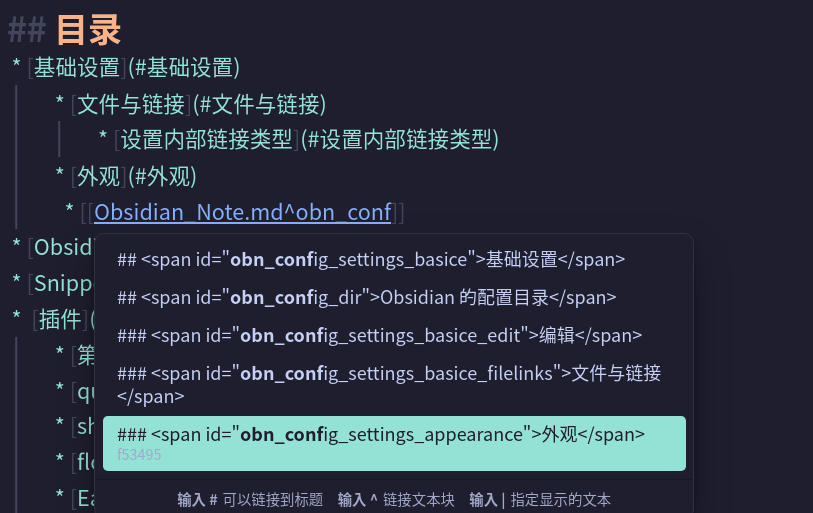
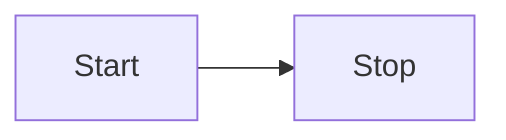
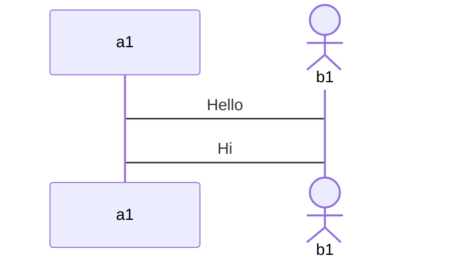
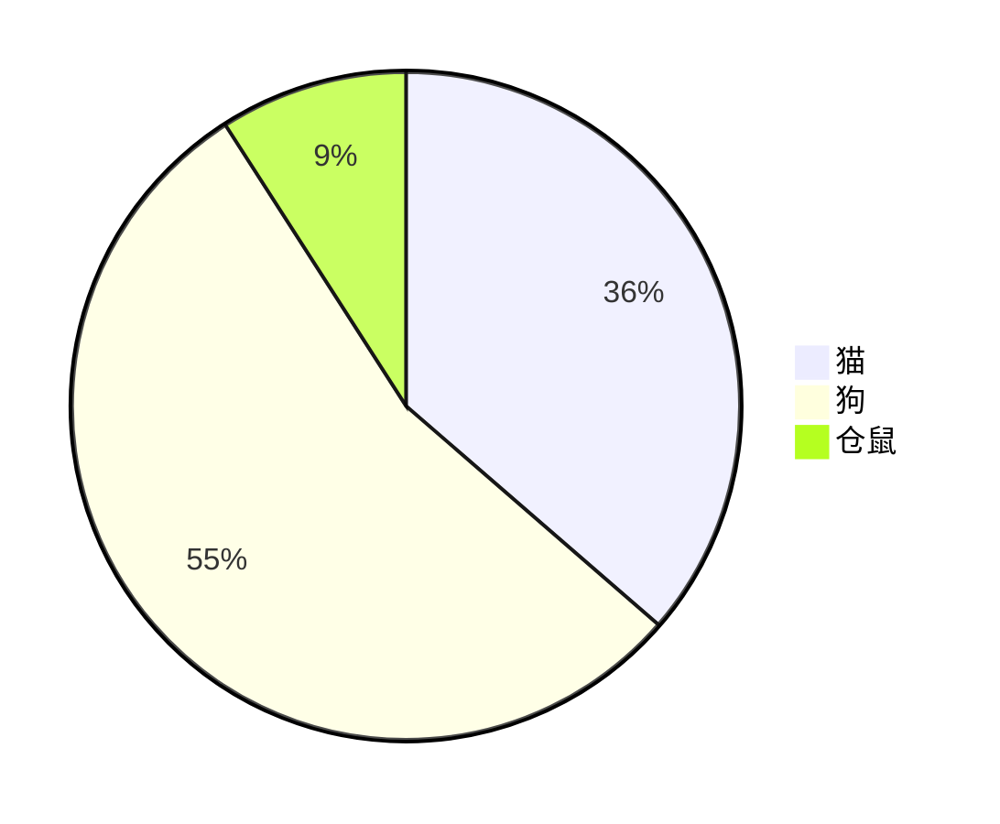
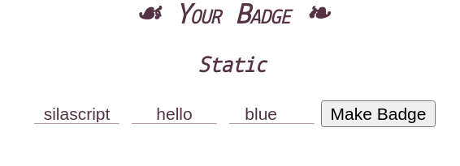
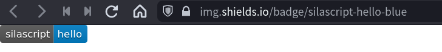

# Markdown 笔记

轻量级标记语言。比 html 简单多了，非常适合不会 html 的人写文档。

Markdown 比 doc 等文档更开放，更易于发布。

---

## 目录
* [基础](#md_basic)
  * [关于锚点](#关于锚点)
* [高级](#md_advance)
	* [画图](#md_advance_draw)
	* [Markdown相关教程](#Markdown相关教程)
* [扩展](#md_extra)
	* [使用 Font Awesome](#md_extra_fontawesome)
	* [徽章相关](#md_extra_badge)
* [相关工具](#md_tools)
	* [Markdown 编辑器](#md_tools_mdeditors)
		* [Obsidian](#md_tools_mdeditors_obsidian)
		* [Joplin](#md_tools_mdeditors_joplin)
---

## <span id="md_basic">基础</span>

### 标题

使用`#` 号来表示标题。标题共有 6 个级别，分别以对于数量的 `#` 来表示。

```markdown
# 一级标题
## 二级标题
### 三级标题
#### 四级标题
##### 五级标题
###### 六级标题

```


### <span id="md_anchor">关于锚点</span>

> [!example] 示例1：
> 
> ```markdown
>	* [基础设置](#基础设置)
>		* [文件与链接](#文件与链接)
>			* [设置内部链接类型](#设置内部链接类型)
>		* [外观](#外观)
>	* [Obsidian 配置目录](#obn_config_dir)
>	```
>	
> ```markdown
>	## <span id="obn_config_settings_basice">基础设置</span>
>		### <span id="obn_config_settings_basice_filelinks">文件与链接</span>
>			#### 设置内部链接类型
>			### <span id="obn_config_settings_appearance">外观</span>
>		##  <span id="obn_config_dir">Obsidian 的配置目录</span>
> ```
> 
> 
> 这个例子使用了两种方式对「锚点」的定义与引用。
> 1. 使用 `<span>` 这个行内标签，并且使用 `id` 属性为其定义「锚点」值。
> 2. 什么都没加，直接就是原生的 Markdown 语法 `#` 符号定义标题。 
> 
> 而引用「锚点」时，同样也使用了两种方式：
> 1. 对于部分使用了 `id` 指定「锚点」值的标题，使用 `#标题` 方式来引用「锚点」。
> 2. 对于标准 Markdown 语法，即使用 `#标题` 方式定义标题来说，只能使用 `#标题` 方式来引用「锚点」。
>
> 来看下在[Obsidian](../Obsidian/Obsidian_Note.md) 及 [github](https://github.com) 上的效果：
> 1. Obsidian 中使用 `<span id>` 这种方式定义的锚点，并在引用时使用 `#id` 的方式引用，Obsidian 找不到锚点。
> 2. github 上无论哪种方式引用「锚点」都能实现链接跳转。
>   
> 顺便看下，[github](https://github.com) 渲染成 html 后，html 源码成了什么：
> 
> ```html
>	<li><a href="#%E5%9F%BA%E7%A1%80%E8%AE%BE%E7%BD%AE">基础设置</a></li>
>	<li><a href="#%E6%96%87%E4%BB%B6%E4%B8%8E%E9%93%BE%E6%8E%A5">文件与链接</a></li>
>	<li><a href="#%E8%AE%BE%E7%BD%AE%E5%86%85%E9%83%A8%E9%93%BE%E6%8E%A5%E7%B1%BB%E5%9E%8B">设置内部链接类型</a></li>
>	<li><a href="#%E5%A4%96%E8%A7%82">外观</a></li>
>	<li><a href="#obn_config_dir">Obsidian 配置目录</a></li>
> ```  
>
> 可以发现，`<span>`  在经过 [github](https://github.com) 渲染转换之后，生成的是 `<a>` 标签。
> 
>  使用 `id` 属性定义的「锚点」并使用 `#id` 方式引用的「锚点」，在经过渲染转换后，是非常标准的 html 「锚点」引用语法。
>  
>  但使用 `#标题` 方式引用「锚点」，[github](https://github.com) 就将中文标题「encoding」 了，可读性变差，但功能还是能实现的，这就是为什么 [github](https://github.com) 下两种方式都能实现跳转功能。
>
>  如果想要在 [Obsidian](../Obsidian/Obsidian_Note.md) 中使用指定锚点 `id` 值来引用「锚点」，可以使用 `^`  符号来引用：
> 
>> [!example] 示例1.1
>>  
>> 而出来是 ` [外观](Obsidian_Note.md#^f53495)` 这种效果，[Obsidian](../Obsidian/Obsidian_Note.md) 生成一个值来引用这个「锚点」,虽然不像之前使用 `#id` 方式引用出现 `unable to find ` 问题，同样也是没在预览窗口实现「锚点」内容的「完全」预览（说预览不完全是因为，它只预览出标题，但没有预览出标题「周围」的内容，这也体现了 Obsidian `#` 与 `^` 两种引用链接方式的不同），但是能够实现「锚点」跳转。
>>> [!bug] 问题
>>> `#^` 这种方式的引用在 [Obsidian_Note](../Obsidian/Obsidian_Note.md) 中跳转没问题，但在 [github](https://github.com/) 中就不能实现「锚点」跳转功能了，因为生成的链接的那个「值」是 Obsidian 自己特有的。 

> [!bug] 空格问题
> 如果标题中存在空格，在使用 `#标题` 方式引用时，Obsidian 中预览及跳转都没问题，但在 [github](https://github.com/) 是未能跳转成功的。

> [!summary] 总结
> 现阶段，既要能在 Obsidian 中跳转成功，又能在 [github](https://github.com/) 中跳转成功，只能使用 `#标题` 方式。
>  

---

## <span id="md_advance">高级</span>


---

## <span id="md_tutorial_links">Markdown相关教程</span>

* [obsidian 论坛  成雙醬 的Markdown 教程](https://forum-zh.obsidian.md/t/topic/435)
* [https://www.markdown.cn](https://www.markdown.cn)
* [Github Markdown 规范](https://gfm.docschina.org/zh-hans/)

---

### <span id="md_advance_draw">画图</span>

在 Markdown 中绘图，使用的 [Mermaid](https://github.com/mermaid-js/mermaid) 这个工具。 

最重要的是，[github](https://github.com)  官方已原生支持！

Mermaid 是一种基于 Javascript 的通过代码创建图表的工具，其使用类似于 Markdown 的语法。

在 Markdown 中使用 Mermaid 是通过代码块来实现的，只需在代码块的语言指定中指定为 `mermaid` 就能在 Markdown 中使用 Mermaid 来展示各类图表。

#### Mermaid 图形种类
* 流程图：使用 `flowchart` 或 `graph` 关键字
* 序列图：使用 `sequenceDiagram` 关键字
* 甘特图：使用 `gantt` 关键字
* 类图：使用 `classDiagram` 关键字
* 饼状图：使用 `pie` 关键字
* 状态图：使用 `stateDiagram` 关键字
* 用户旅程图：使用 `journey` 关键字

#### Mermaid 常用语法

##### mermain 中连接线的类型

| 类型 | 描述 |
| :---: | :---: |
| -> | 无箭头实线 |
| --> | 无箭头虚线 |
| ->> | 带箭头实线 |
| -->> | 带箭头虚线 |
|  -x | 十字箭头的实线 |
| --x | 十字箭头的虚线 |
| -) | 开放箭头的实线 |
| --) | 开放箭头的虚线 |

##### 流程图
mermaid 有两种流程图：flowchart 流程图和 graph 流程图。

###### flowchart 流程图

flowchart 流程图的风格偏传统流程图。

优点：显示效果比较朴素并可以较方便的调节引导线方向和流程图布局。

缺点：语法过分复杂

使用 `flowchart` 声明这个图是 flowchart 类型的图。

然后跟着这个图的方向。
* T：Top
* B：Buttom
* D：Down
* L：Left
* R：Right

所以两两组合就指定了这个图的方向：
* TB 或  TD：从上到下
* BT：从下到上（没有 “DT”，只能是 `BT`）
* LR：从左到右
* RL：从右到左

语句可以加 `;`，也可以省略。


###### graph 流程图
graph 流程图相较 flowchart 最大优点 **语法简单**。

##### 时序图

时序图也称为序列图。

mermaid 中 时序图使用 `sequenceDiagram` 来声明。

节点有两种：
* `participant`：默认样式
* `actor`：显示一个小人

使用 `as` 关键字来为节点起「别名」。

简单示例：


##### 甘特图

##### 饼状图

简单示例：



> 更多更详细的 Mermaid 的[文档](https://mermaid-js.github.io/mermaid/#/) 。

---

## <span id="md_extra">扩展</span> 

### <span id="md_extra_fontawesome">使用 Font Awesome 来加图标</span>
Font Awesome 使用步骤：

1. 引入css
在 markdown 文件最后引入 Font Awesome 文件。
```html
<head>
<link rel="stylesheet" href="https://cdn.bootcdn.net/ajax/libs/font-awesome/6.1.0/css/all.min.css">

</head>
```
> 可以找下国内的 CDN。  
> 常用 CDN：  
> [bootcdn](https://www.bootcdn.cn)

2. 插入符号 

示例：

> 各版本的写法有区别

5.x

<i class="fab fa-weibo"></i> `<i class="fab fa-weibo"></i>`

6.x

<i class="fa-brands fa-weibo"></i> `<i class="fa-brands fa-weibo"></i>`

<i class="fa-brands fa-weixin"></i> `<i class="fa-brands fa-weixin"></i>`

##### 调节符号尺寸

示例：

把微信的符号调大

<!-- <i class="fa-brands fa-weixin fa-2x"></i> `<i class="fa-brands fa-weixin fa-2x"></i>` -->
<i class="fab fa-weixin fa-2x"></i> `<i class="fab fa-weixin fa-2x"></i>`

尺寸参数有下列这些：

* fa-2xs <i class="fab fa-weixin fa-2xs"></i>
* fa-xs <i class="fab fa-weixin fa-xs"></i>
* fa-sm <i class="fab fa-weixin fa-sm"></i>
* fa-lg <i class="fab fa-weixin fa-lg"></i>
* fa-xl <i class="fab fa-weixin fa-xl"></i>
* fa-2xl <i class="fab fa-weixin fa-2xl"></i>
* fa-2x 至 fa-10x
	* fa-2x <i class="fab fa-weixin fa-2x"></i> 
	* fa-3x <i class="fab fa-weixin fa-3x"></i> 
	* fa-4x <i class="fab fa-weixin fa-4x"></i> 
	* fa-5x <i class="fab fa-weixin fa-5x"></i> 
	* fa-6x <i class="fab fa-weixin fa-6x"></i> 
	* fa-7x <i class="fab fa-weixin fa-7x"></i> 
	* fa-8x <i class="fab fa-weixin fa-8x"></i> 
	* fa-9x <i class="fab fa-weixin fa-9x"></i> 
	* fa-10x <i class="fab fa-weixin fa-10x"></i> 

| 相对尺寸 | 字体尺寸 | 同等像素值 |
|:--------:|:--------:|:----------:|
|  fa-2xs  | 0.625em  |    10px    |
|  fa-xs   |  0.75em  |    12px    |
|  fa-sm   | 0.875em  |    14px    |
|  fa-lg   |  1.25em  |    20px    |
|  fa-xl   |  1.5em   |    24px    |
|  fa-2xl  |   2em    |    32px    |

符号默认大小是 16px。

##### 让符号转动 
只要加入`fa-span` 就可以让符号转起来。

示例：

<i class="fab fa-weixin fa-spin"></i> `<i class="fab fa-weixin fa-spin"></i>`

具体的符号列表及写法请参数：[Font Awesome 符号列表](https://fontawesome.com/icons)

---

### <span id="md_extra_badge">徽章相关</span>

进入[shields.io](http://www.shields.io/) ，在输入框中输入 「lable」、「messge」和颜色，点击「Make Badge」，网站就能帮你生成一个徽章。



新生成的徽章：


地址栏中的地址就是就个徽章的网址。你可以嵌入你的页面中。就如像下面这样：

 ``
> 跟图片写法一致。

以上演示制作的徽章是是静态的。[shields.io](http://www.shields.io/) 还能生成动态的徽章。具体玩法，网站有介绍。

除了[shields.io](http://www.shields.io/) 外，还有其他类似的网站也能制作徽章，使用方式大同小异。 

徽章制作网站列表：
* [shields.io](http://www.shields.io/)
* [badgen](https://badgen.net)
* [forthebadge](https://forthebadge.com)
* [badge.fury](https://badge.fury.io)

---

## <span id="md_tools">相关工具</span>

### <span id="md_tools_mdeditors">Markdown 编辑器</span>

#### <span id="md_tools_mdeditors_typora">Typora</span>

收费了！不介绍了！

#### <span id="md_tools_mdeditors_obsidian">Obsidian</span>

[Obsidian](https://obsidian.md) 这款编辑器，个人觉得完全可以替代 Typora。从功能上更强于 Typora 。

Obsidian 设置更丰富，而且更自由，更换配色主题比 Typora 方便多了！

Obsidian 是windows、macos 和 Linux 三平台都支持的编辑器。Linux 下它依赖 electron，有 Snap 版和 Appimage 版本。

Obsidian 具体使用请参考：[Obsidian 笔记](../Obsidian/Obsidian_Note.md)

#### <span id="md_tools_mdeditors_joplin">Joplin</span>

[Joplin](https://joplinapp.org) 这款编辑器，全平台支持，有桌面版、手机版，甚至命令行版--这有点过分了。但个人感觉没有 Obsidian 这么惊艳！

<head>
	<!-- <script defer src="https://cdn.bootcdn.net/ajax/libs/font-awesome/5.15.4/js/all.min.js"></script> -->
	<!-- <script defer src="https://cdn.bootcdn.net/ajax/libs/font-awesome/5.15.4/js/v4-shims.min.js"></script> -->
	<link rel="stylesheet" href="https://cdn.bootcdn.net/ajax/libs/font-awesome/5.15.4/css/all.css" >
</head>
