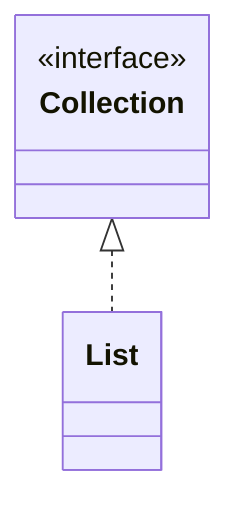
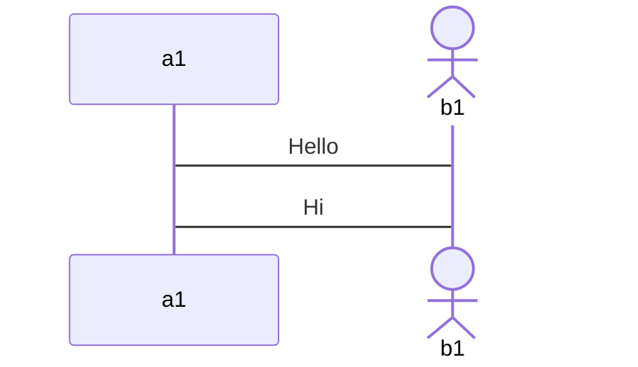
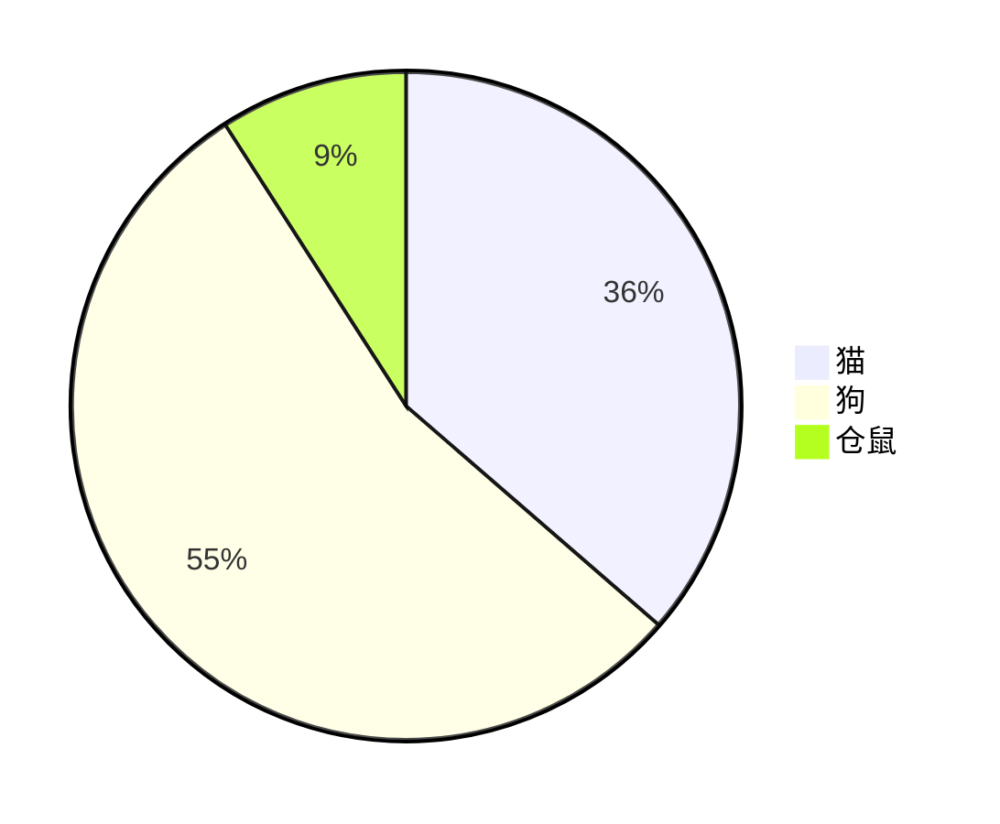

# Mermaid 笔记

---

## 简介

在 Markdown 中绘图，使用的 [Mermaid](https://github.com/mermaid-js/mermaid) 这个工具。 

最重要的是，[github](https://github.com) 官方已原生支持！

Mermaid 是一种基于 Javascript 的通过代码创建图表的工具，其使用类似于 Markdown 的语法。

在 Markdown 中使用 Mermaid 是通过代码块来实现的，只需在代码块的语言指定中指定为 `mermaid` 就能在 Markdown 中使用 Mermaid 来展示各类图表。

## Mermaid 图形种类

* 流程图：使用 `flowchart` 或 `graph` 关键字
* 序列图：使用 `sequenceDiagram` 关键字
* 甘特图：使用 `gantt` 关键字
* 类图：使用 `classDiagram` 关键字
* 饼状图：使用 `pie` 关键字
* 状态图：使用 `stateDiagram` 关键字
* 用户旅程图：使用 `journey` 关键字

## Mermaid 常用语法

### mermaid 中连接线的类型

| 类型 | 描述 |
| :---: | :---: |
| -> | 无箭头实线 |
| --> | 无箭头虚线 |
| ->> | 带箭头实线 |
| -->> | 带箭头虚线 |
|  -x | 十字箭头的实线 |
| --x | 十字箭头的虚线 |
| -) | 开放箭头的实线 |
| --) | 开放箭头的虚线 |

### 类图

类图使用 `classDiagram` 关键字声明。跟写 [Java](../Java/Java_Note.md) 的类很类似。

#### 类图关系线

<table>
<tr align="center">
<td>关系</td>
<td>左值</td>
<td>右值</td>
<td>描述</td>
</tr>
<tr align="center">
<td>继承</td>
<td><code><|--</code></td>
<td><code>--|></code></td>
<td>类继承另一个类或接品继承另一个接口</td>
</tr>
<tr align="center">
<td>实现</td>
<td><code><|..</code></td>
<td><code>..|></code></td>
<td>类实现接口</td>
</tr>
<tr align="center">
<td>关联</td>
<td><code><--</code></td>
<td><code>--></code></td>
<td>表示一种「拥有」关系   A 类作为 B 类的成员变量   若 B 类也使用的 A 类作为成员变量则为双向关联</td>
</tr>
<tr align="center">
<td>依赖</td>
<td><code><..</code></td>
<td><code>..></code></td>
<td>表示一种「使用」关系   参数依赖、局部变量、静态方法/变量依赖</td>
</tr>
<tr align="center">
<td>聚合</td>
<td><code>o--</code></td>
<td><code>--o</code></td>
<td>聚合是一种强关联关系   在代码语法上与关联无法区分</td>
</tr>
<tr align="center">
<td>组合</td>
<td><code>*--</code></td>
<td><code>--*</code></td>
<td>组合也是一种强关联关系   比聚合关系还要强</td>
</tr>
</table>

#### 类图访问修饰符

| 符号 |                    作用域                     |        含义        |
|:----:|:---------------------------------------------:|:------------------:|
|  +   |                  方法、字段                   |      `public`      |
|  -   |                  方法、字段                   |     `private`      |
|  #   |                  方法、字段                   |    `protected`     |
|  ~   |                  方法、字段                   | `package/friendly` |
|  $   |                  方法、字段                   |      `static`      |
|  *   |                     方法                      |     `abstract`     |
|  ~~  | 类型 (字段类型、返回类型、class/interface 等) |       `泛型`       |

#### 类图示例

### 流程图

mermaid 有两种流程图：[flowchart 流程图](#flowchart) 和 [graph 流程图](#graph)。

#### flowchart

`flowchart` 流程图的风格偏传统流程图。

优点：显示效果比较朴素并可以较方便的调节引导线方向和流程图布局。

缺点：语法过分复杂

使用 `flowchart` 声明这个图是 flowchart 类型的图。

然后跟着这个图的方向。
* T：Top
* B：Bottom
* D：Down
* L：Left
* R：Right

所以两两组合就指定了这个图的方向：
* TB 或 TD：从上到下
* BT：从下到上（没有 “DT”，只能是 `BT`）
* LR：从左到右
* RL：从右到左

语句可以加 `;`，也可以省略。

#### graph

`graph` 流程图相较 [flowchart](#flowchart) 最大优点 **语法简单**。

### 时序图

时序图也称为序列图。

mermaid 中 时序图使用 `sequenceDiagram` 来声明。

节点有两种：
* `participant`：默认样式
* `actor`：显示一个小人

使用 `as` 关键字来为节点起「别名」。

简单示例：

### 甘特图

### 饼状图

简单示例：

> [!info] 
> 
> 更多更详细的 Mermaid 的 [文档](https://mermaid-js.github.io/mermaid/#/) 。

---

## 相关笔记

* [Markdown 笔记](Markdown_Note.md)
* [Mermaid 资料清单](Mermaid_Material.md)