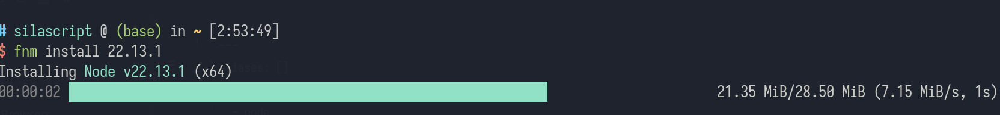

# NodeJS 笔记

---

## 目录

* [安装和配置](#node_insetings)
    * [安装](#node_install)
    * [配置](#node_settings)
* [版本管理](#版本管理)
	* [nvm](#nvm)
	* [fnm](#fnm)
	* [nodenv](#nodenv)
 
---

## <span id="node_insetings">安装和配置</span>

### npm

#### 常用命令

##### 安装包

本地安装

```shell
npm install 包名
```

全局安装

```shell
npm install 包名 -g
```

安装指定版本

```shell
npm install 包名@1.11.0
```

安装某版本中最新版

```shell
npm install 包名@1
```

### <span id="node_install">安装</span>

* [NodeJS 官网](https://nodejs.org/)
	* [NodeJS 官网中文](https://nodejs.org/zh-cn)
* [NodeJS 中文网](http://nodejs.cn/)

Windows 下安装，可以下安装包，也可以下压缩包，解压后，手动配置环境变量。

> [!tip] 
> 
> 推荐下载「LTS」，长期维护版，更稳定。

### <span id="node_settings">配置</span>

`config` 命令，顾名思义就是用来配置 node。

`npm config list`：列出当前配置项，用来查看是否配置成功了。

#### 配置全局目录及缓存目录

全局目录：`npm config set prefix "~/nodejs/node_global/"`  ^node_global ^21bf6e

缓存目录：`npm config set cache "~/nodejs/node_cache/"`

> [!tip] 缓存相关的命令
> 
> 清理：`npm cache clean --force`

这两项还是得配，特别是 [全局目录](#^21bf6e) 必须得配，不然当你更新时它会跑到 node 的安装目录下的 `node_modules` 更新，如果你的 node 装在根目录，那有可能报 [npm 下载权限不足](#npm%20下载权限不足) 的错误。

当使用 `npm config set` 命令设置一个配置项后，会在当前用户目录下生成一个 `.npmrc ` 配置文件。

#### 设置国内镜像

`npm config set registry https://registry.npmmirror.com`

> [!tip] 
> 
> ~~`http://registry.npm.taobao.org`~~ 这个镜像域名已经过期。
> 
> * [npm淘宝镜像最新官方指引（2023.08.31） - 知乎](https://zhuanlan.zhihu.com/p/653480874)

#### eclectron 配置

在 `.npmrc` 文件中添加环境变量：

~~`export ELECTRON_MIRROR=http://npm.taobao.org/mirrors/electron/`~~

`export ELECTRON_MIRROR=https://npmmirror.com/mirrors/electron/`

> [!info] 
> 
> 这里同样得注意淘宝的镜像过时问题。

参考资料：[NodeJS资料： Electron](NodeJS_Material.md#Electron)

`.npmrc` 配置示例：

```npmrc
prefix=~/nodejs/node_global/
cache=~/nodejs/node_cache/
registry=https://registry.npmmirror.com
ELECTRON_MIRROR=https://npmmirror.com/mirrors/electron/
```

> [!info] 
> 
> [https://registry.npmmirror.com/binary.html](https://registry.npmmirror.com/binary.html) 不同的二进制包放在不同目录。
> 
> 配置语法：`https://npmmirror.com/mirrors/二进制包的名称/`

#### 问题

##### 证书

2014 年后，npm 不再支持自签名证书，所以有可能会报相关的错误。

如：`Error: request to https://registry.npm.taobao.org/bash-language-server failed, reason: certificate has expired`。

如果出现这个可以使用取消严格 ssl 检查的设置：`npm config set strict-ssl false`

##### npm 下载权限不足

这个错误出现，往往是忘记设 [全局目录](#^21bf6e)，而 npm 更新会跑 node 的安装目录中的 `node_modules` 子目录寻找要更新的模块，而如果 node 的安装目录正好是在根目录，那自然会出现访问权限问题，这样就会报出 下载权限不足的错误。

其实观察错误也能推测出来，如下报错信息，明显可见，npm 是跑到的 `/` 根目录更新了：

```shell
npm ERR!   path: '/opt/NodeJS/node-v20/lib/node_modules/corepack',
npm ERR!   dest: '/opt/NodeJS/node-v20/lib/node_modules/.corepack-o8GX3Rw6'
```

> [!info] 相关资料
> 
> * [npm下载权限不足问题解决 - nobody阿欣 - 博客园](https://www.cnblogs.com/lixin-nobody/p/14051905.html)

#### 配置环境变量

示例：

```shell
NODE_HOME=/opt/NodeJS/node-v22
NODE_PATH=$HOME/nodejs/node_global/bin
PATH=$PATH:$NODE_PATH:$NODE_HOME/bin
```

> [!info] 
> 
> 1. `NODE_HOME` 是 Node 的安装根目录。
> 2. `NODE_PATH` 是全局模块，就是上面 `npm config` 配置的 [全局目录](#配置全局目录及缓存目录) 下的 `bin` 目录
> 3. 把上述两个变量加入 `PATH` 路径中，source 相关 `rc` 或 `profile`，或者重启电脑，让其生效，配置就完成了。
> 

---

## 版本

Node 的版本是有发布计划的：[Node.js Release Working Group](https://github.com/nodejs/release#release-schedule)。

### LTS

「偶数版本」都是 LTS 版，或者将是 LTS 版，其生命周期是 3 年，并且这些版本都有代码名称（codename）。

### 非 LTS

非 LTS 版本生命周期一般只有半年，带有实验性质。

---

## 版本管理

NodeJS 下有多款版本管理工具：

* [nvm](#nvm)
* [fnm](#fnm)
* [nodenv](#nodenv)

### nvm

[nvm](https://github.com/nvm-sh/nvm) 是在 [Linux](../Linux/Linux_Note.md) 下使用 [Shell](../Linux/Shell/Shell_Note.md) 写一款 NodeJS 版本管理工具。

> [!tip] 
> 
> Windows 版：[nvm-windows](https://github.com/coreybutler/nvm-windows)。

---

### fnm

[fnm](https://github.com/Schniz/fnm) 这是使用 [Rust](../Rust/Rust_Note.md) 写的 NodeJS 版本管理工具。跟 [Ruby](../Ruby/Ruby_Note.md) 那个 [Frum](../Ruby/Ruby_Note.md#Frum) 类似的东西。

fnm 有两特点：
1. 特点就是快
2. 跨平台。不像 [nvm](#nvm) 是 [Linux](../Linux/Linux_Note.md) 的，后来为了适配 Windows 又另外弄出一个 [nvm-windows](https://github.com/coreybutler/nvm-windows)。


#### 安装

[Linux](../Linux/Linux_Note.md) 下可以使用各自的包管理器安装。以 [ArchLinux](../Linux/ArchLinux_Note.md) 为例：

```shell
yay -S fnm
```

Windows 下推荐使用 [Scoop](../Scoop/Scoop_Note.md) 来安装：

```powershell
scoop install fnm
```

#### 配置

安装完了就可以使用 `fnm` 命令调用。但想要切换版本，就需要在相关配置文件中配置。

> [!tip] 
> 
> 如果在 [切换版本](#切换版本) 时出现 `We can't find the necessary environment variables to replace the Node version.` 这个错误提示，并在终端中使用 `node` 命令时，是找不到这个命令的，就证明相关环境还没配置好。

##### Linux  

在 `.bashrc`、`.zshrc` 等配置文件中添加以下代码：

```shell
eval "$(fnm env --use-on-cd)"
```

> [!info] 
> 
> `fnm env --use-on-cd` 开启了 `fnm` 的自动版本切换功能，使得在不同的项目目录间切换时，无需手动输入 `fnm use` 命令来切换 Node.js 版本，方便开发和管理。

> [!quote] 官方说明
> 
> [GitHub - Schniz/fnm: 🚀 Fast and simple Node.js version manager, built in Rust](https://github.com/Schniz/fnm?tab=readme-ov-file#shell-setup)

###### 配置安装包镜像

默认 `FNM_NODE_DIST_MIRROR`：[https://nodejs.org/dist](https://nodejs.org/dist)

阿里云镜像：

```shell
export FNM_NODE_DIST_MIRROR=https://npmmirror.com/mirrors/node/
# 这个其实是不用配的，npm的配置应该在npmrc中registry项配的
# export NPM_CONFIG_REGISTRY=https://npmmirror.com/mirrors/npm/
```

腾讯云镜像：
 
```shell
export FNM_NODE_DIST_MIRROR=https://mirrors.cloud.tencent.com/nodejs-release/
# 这个其实是不用配的，npm的配置应该在npmrc中registry项配的
# export NPM_CONFIG_REGISTRY=https://mirrors.cloud.tencent.com/npm/
```

##### Windows

PowerShell，在 `Microsoft.PowerShell_profile.ps1` 中添加以下代码：

```pwsh
fnm env --use-on-cd | Out-String | Invoke-Expression
```

> [!info] 
> 
> 不同的 PowerShell 版本有不同目录：
> 
> * `~\Documents\WindowsPowerShell\Microsoft.PowerShell_profile.ps1`
> * `~\Documents\PowerShell\Microsoft.PowerShell_profile.ps1` 

#### 全局模块

另外，如果要调全局模块，还是得配 `NODE_PATH` 的：

```shell

# nodejs
# 使用fnm对Node进行版本管理
eval "$(fnm env --use-on-cd)"

# nodejs
# 根据不同版本自行修改路径
# NODE_HOME=/opt/NodeJS/node-v20
# NODE_HOME=/opt/NodeJS/node-v22

# 全局模块目录
NODE_PATH=$HOME/nodejs/node_global/bin
# 使用fnm等版本管理工具就不用将nodejs安装目录放进PATH路径中了
# 防止node安装目录中的npm放在PATH前面，所以将NODE_PATH加在原有PATH之前
PATH=$NODE_PATH:$PATH
# PATH=$PATH:$NODE_PATH:$NODE_HOME/bin

```

`whereis` 命令查看 `node` 及 `npm`[相关目录](#相关目录)：

> [!info] 
> 
> ```shell
> # silascript @ (base) in ~ [4:04:52] 
> $ whereis npm
npm: /home/silascript/nodejs/node_global/bin/npm /home/silascript/.local/share/fnm/node-versions/v22.13.1/installation/bin/npm
> 
> # silascript @ (base) in ~ [4:04:59] 
> $ whereis node
> node: /home/silascript/.local/share/fnm/node-versions/v22.13.1/installation/bin/node
>
> ```
> 可以看到，不用再配 `NODE_HOME` 了，不用把 node 的安装目录手动加进 `PATH` 路径，fnm 已经帮你完成这些配置。
>
>> [!important] 
>> 
>> 注意一点，[全局模块](#全局模块)中的`npm`应保证其在node安装目录中那个自带的`npm`之前，因为[全局模块](#全局模块)的`npm`版本更新，而且能随时更新。

#### 相关目录

nodejs 版本安装在 `~/.local/share/fnm` 目录下的 `node-versions` 目录中：

```shell
$ ll .local/share/fnm 
Permissions Size User       Group      Date Modified    Name
drwxr-xr-x     - silascript silascript 2025-02-17 20:47 .
drwx------     - silascript silascript 2025-02-17 23:20 ..
drwxr-xr-x     - silascript silascript 2025-02-17 20:47 aliases
drwxr-xr-x     - silascript silascript 2025-02-17 20:47 node-versions

```

已安装的版本存放在 `node-versions` 目录下，以其版本号为目录名的子目录中：

```shell
# silascript @ (base) in ~ [3:30:52] 
$ ll .local/share/fnm/node-versions 
Permissions Size User       Group      Date Modified    Name
drwxr-xr-x     - silascript silascript 2025-02-18 03:06 .
drwxr-xr-x     - silascript silascript 2025-02-17 20:47 ..
drwxr-xr-x     - silascript silascript 2025-02-18 03:06 .downloads
drwxr-xr-x     - silascript silascript 2025-02-18 02:54 v22.13.1
drwxr-xr-x     - silascript silascript 2025-02-18 03:06 v23.8.0

# silascript @ (base) in ~ [3:34:00] 
$ ll .local/share/fnm/node-versions/v22.13.1/installation 
Permissions Size User       Group      Date Modified    Name
drwxr-xr-x     - silascript silascript 2025-02-18 02:54 .
drwxr-xr-x     - silascript silascript 2025-02-18 02:54 ..
drwxr-xr-x     - silascript silascript 2025-02-18 02:54 bin
.rw-r--r--  454k silascript silascript 2025-01-21 08:55 CHANGELOG.md
drwxr-xr-x     - silascript silascript 2025-02-18 02:54 include
drwxr-xr-x     - silascript silascript 2025-02-18 02:54 lib
.rw-r--r--  140k silascript silascript 2025-01-21 08:55 LICENSE
.rw-r--r--   40k silascript silascript 2025-01-21 08:55 README.md
drwxr-xr-x     - silascript silascript 2025-02-18 02:53 share

```

#### 常用参数及选项

```shell
list-remote  List all remote Node.js versions [aliases: ls-remote]
list         List all locally installed Node.js versions [aliases: ls]
install      Install a new Node.js version [aliases: i]
use          Change Node.js version
env          Print and set up required environment variables for fnm
unalias      Remove an alias definition
default      Set a version as the default version
current      Print the current Node.js version
uninstall    Uninstall a Node.js version [aliases: uni]

```

##### 使用示例

###### 列出可安装的版本

```shell
list-remote
```

或

```shell
ls-remote
```

如果是 [LTS](#LTS) 版本，版本号后会有「代号名」：

```shell
v22.11.0 (Jod)
v22.12.0 (Jod)
v22.13.0 (Jod)
v22.13.1 (Jod)
v22.14.0 (Jod)
v23.0.0
v23.1.0
v23.2.0
v23.3.0
v23.4.0
v23.5.0
v23.6.0
v23.6.1
v23.7.0
v23.8.0
```

###### 列出已装的版本

```shell
fnm list
```

或者：

```shell
fnm ls
```

示例：

```shell
$ fnm list           
* v22.13.1 default
* system
```

> [!info]
> 
> #默认版本
> 
> 版本号后的 `default` 是默认版本，无论使用 `fnm use` 命令 [切换](#切换版本) 到什么版本，有 `default` 标识的就是默认版本

###### 列出当前版本

使用 `fnm current` 命令就能显示当前的版本了。

示例：

```shell
$ fnm current
v23.8.0
```

###### 安装

```shell
fnm install 版本号
```



安装时还能指定安装源：

```shell
fnm install 版本号 --node-dist-mirror=https://npmmirror.com/mirrors/node
```

安装最新的 [LTS](#LTS) 版本：

```shell
fnm install --lts
```

###### 切换版本

```shell
fnm use 版本号
```

示例：

```shell
$ fnm use 23.8.0
Using Node v23.8.0
```

切换成功后，使用 `list` 命令 [列出已装的版本](#列出已装的版本)，高亮的版本既是当前版本：

```shell
$ fnm list      
* v22.13.1 default
* v23.8.0
* system

```

###### 切换默认版本

```shell
fnm default 版本号
```

示例：

```shell
# silascript @ (base) in ~ [3:27:10] 
$ fnm default 23.8.0

# silascript @ (base) in ~ [3:27:19] 
$ fnm list          
* v22.13.1
* v23.8.0 default
* system
```

###### 卸载版本

```shell
fnm uninstall 版本号
```

---

### nodenv

[GitHub - nodenv/nodenv: Manage multiple NodeJS versions.](https://github.com/nodenv/nodenv) 这个同样是使用 [Shell](../Linuxl/Shell_Note.md) 写的。

> [!info] 
> 
> 看名字，就知道跟 [Ruby](../Ruby/Ruby_Note.md) 那个 [rbenv](../Ruby/Ruby_Note.md#rbenv) 有所渊源。它确实是从 rbenv 分叉出来的 Node.js 的版本管理工具。

---

## 相关笔记

* [NodeJS资料](NodeJS_Material.md)
* [NodeJS 视频清单](NodeJS_Videos.md)
