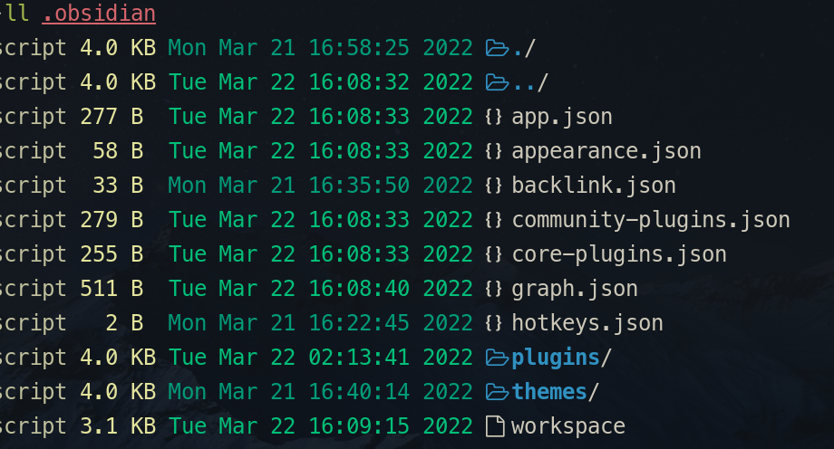
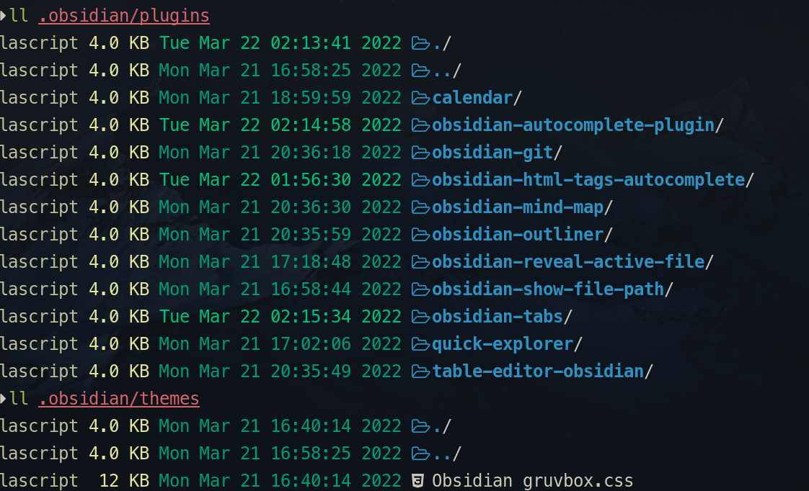
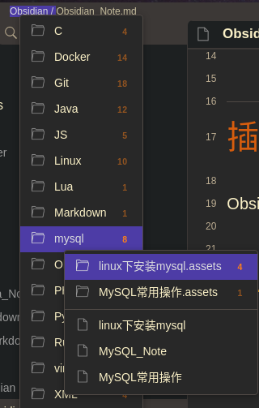
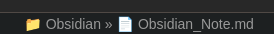
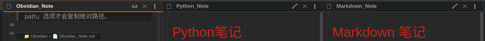
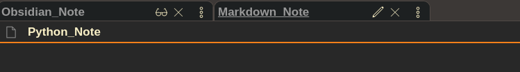
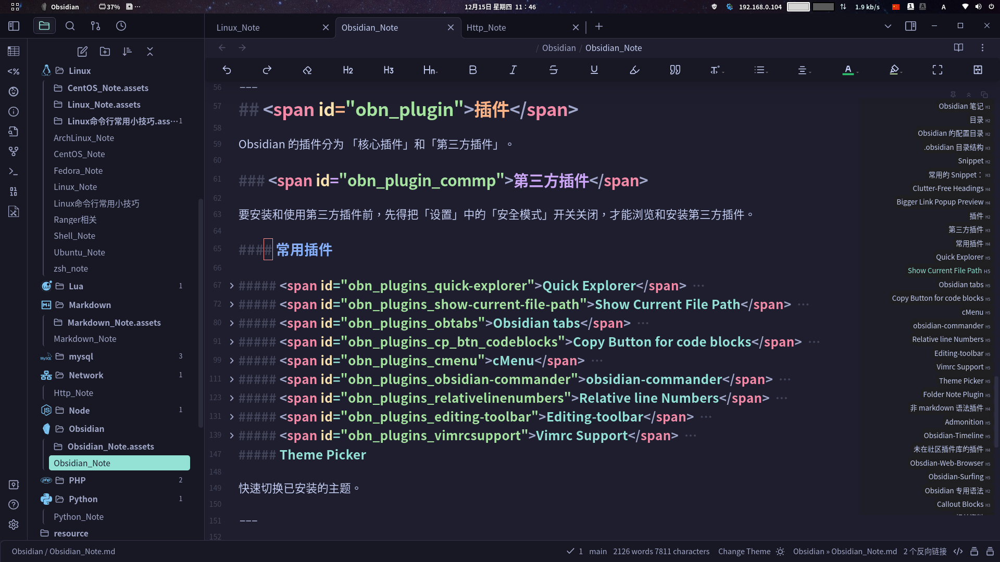

# Obsidian 笔记

---

## 目录

* [基础设置](#基础设置)
	* [文件与链接](#文件与链接)
		* [设置内部链接类型](#设置内部链接类型)
		* [外观](#外观)
* [Obsidian 配置目录](#obn_config_dir)
* [Snippet](#obn_snippet)
* [主题](#obn_themes)
* [基本用法](#obn_basic)
	* [常用默认快捷键](#obn_default_hotkeys)
* [插件](#obn_plugin)
	* [第三方插件](#obn_plugins_commp)
		* [常用插件](#常用插件)
			* [Batter Command Palette](#obn_plugins_commp_better_command_palette) 
			* [Quick Switcher++](#obn_plugins_commp_quickswitcher_plus) 
			* [Another Quick Switcher](#obn_plugins_commp_another_quickswitcher) 
			* [quick explorer](#obn_plugins_commp_quick-explorer)
			* [show current file path](#obn_plugins_commp_show-current-file-path)
			* [Better Word Count](#obn_plugins_commp_better_word_count)
			* [Linter](#obn_plugins_commp_linter)
			* [floating-toc](#obn_plugins_obsidian-floating-toc-plugin)
			* [Easy Typing](#obn_plugins_commp_easy-typing)
			* [Better Link Inserter](#obn_plugins_commp_better_link_inserter)
			* [Colorful Tag](#obn_plugins_commp_colorful_tag)
	* [绘图相关](#obn_plugins_commp_draw)
		* [Mermaid Tools](#obn_plugins_commp_draw_mermaid_tools)
	* [Git 相关](#obn_plugins_commp_git)
	* [杂项插件](#obn_plugins_misc)
		* [PowerMode](#PowerMode)
	* [非 markdown 语法插件](#obn_plugins_notmarkdown)
	* [未在社区插件库的插件](#obn_plugins_outside_community)
* [Obsidian 专用语法](#obn_syntax)
	* [Callout Blocks](#obn_syntax_calloutblocks)

---

## <span id="obn_config_settings_basice">基础设置</span>

基础设置是非插件化，对 Obsidian 最原始的设置。

### <span id="obn_config_settings_basice_edit">编辑</span>

「默认视图」选择「阅读模式」（Reading View）。

「默认编辑模式」选择「源码模式」，这样编辑更准确些，而且不用即时渲染还能节省性能，提高编辑的流畅度。

> [! tip] 实时预览
> 
> 「实时预览模式」效果跟 [Typora](https://typora.io/) 默认的类似，就是一边编辑，编辑器一边给你渲染出发布的页面效果。

### <span id="obn_config_settings_basice_filelinks">文件与链接</span>

「文件与链接」选项的设置，主是对链接各种设置。

#### 设置内部链接类型

默认「内部链接类型」是「尽可能简短形式」，就是不管链接目标文件是否在当前目录，都以不加目录路径（即没有绝对路径，也没有相对路径），这样链接如果是当前目录当前文件内部链接还没什么问题，如果链接目标是目录的文件时，虽然在 Obsidian 中能够链接到，但这在实际 Markdown 使用会出现问题，会出现找不到链接情况。为了更符合 Markdown 使用习惯，应将链接类型改为「**基于当前目录的相对路径**」，这样它就是根据目标链接文件是否在当前目录而使用 **相对路径** 链接策略。

#### 不使用 Wiki 链接

为了使文档更符合 Markdown 规范，将「使用 Wiki 链接」选项给关闭，仅使用 Markdown 标准的 `[]()` 这种语法

### <span id="obn_config_settings_appearance">外观</span>

^f53495

「外观」设置，主要是对 [主题](#obn_themes) 、「字体」等设置。

「外观」设置中还能使用 [CSS 代码片段](#obn_snippet) 进行外观上更详细而深入的配置。

「显示标签页标题栏」选项关闭。
「窗口边框样式」设为「Obsidian 风格」，默认是「隐藏」，由于有时标签页多，而有时又要移动 Obsidian 窗口时，鼠标就会没地方拖动，所以最好把标题栏「释放」出来方便拖动。

---

##  <span id="obn_config_dir">Obsidian 的配置目录</span>

### 全局配置

以 [Linux_Note](../../Linux/Linux_Note.md) 为例，obsidian 的全局配置是放在 `~/.config/obsidian` 目录下。

其中主配置文件 `obsidian.json`，这配置文件主要是 [vault](#vault) 的列表。

#### `obsidian.json` 示例

```json
{
	"vaults": {
		"589cfccbc0bf7269": {
			"path": "/home/silascript/MyNotes/ITNotes",
			"ts": 1703889683501,
			"open": true
		},
		"114389328d4119d4": {
			"path": "/home/silascript/MyNotes/Test_Vault",
			"ts": 1694958814348
		},
		"17847b20f8611fd5": {
			"path": "/home/silascript/MyNotes/LiteratureNotes",
			"ts": 1696215287552
		},
		"5631927d12119c66": {
			"path": "/home/silascript/MyNotes/MyLogs",
			"ts": 1706289161508
		},
		"f6171a93157953aa": {
			"path": "/home/silascript/MyNotes/Test_Vault/test01",
			"ts": 1706348850187
		}
	},
	"frame": "custom",
	"disableGpu": true,
	"updateDisabled": true
}
```

> [!info] 
> 
> 每个 [vault](#vault) 节点中，以 vault 的 id 为「key」。这个 key，在 `~/.config/obsidian/` 目录下，还有个同名的 `json` 配置文件，
> 
> `path` 属性是 vault 的路径，`open` 是指明这个 vault 当前是否打开状态。

### vault

在 Obsidian 的 **vault**，就是所谓的「库」，其根目录下，Obsidian 会生成一个配置目录 `.obsidian`。

> [!tip]
> 
> 如果 `.obsidian` 目录已存在，将不会再生成，只有 vault 根目录下没有 `.obsidian` 目录，ob 才会生成此配置目录。

### .obsidian 目录结构

* `Obsidian` 是使用 json 文件来配置的。
* `app.json`：主配置文件
* `appearance.json`：外观配置文件，其实就是用了什么字体及使用了哪个 [主题](#主题)

	> [!info] 
	> 
	> * `accentColor`：界面某些组件强调色
    > * `baseFontSize`：字体大小
    > * `interfaceFontFamily`：界面字体
    > * `textFontFamily`：正文字体
    > * `monospaceFontFamily`：等宽字体
    > * `cssTheme`：主题
	>>
	>> [!example]
	>> 
	>> ```json
	>> {
    >> "accentColor": "#0e6fd8",
    >> "baseFontSize": 20,
    >> "interfaceFontFamily": "ChiuKong Gothic CL,更紗黑體 UI CL",
    >> "textFontFamily": "ChiuKong Gothic CL,更紗黑體 CL",
    >> "monospaceFontFamily": "等距更紗黑體 CL,DejaVu Sans Mono",
    >> "theme": "obsidian",
    >> "cssTheme": "Minimal"
    >> }
    >> ```
* `core-plugins.json`：核心插件配置文件
* `community-plugins.json`：第三方插件列表文件。

   > [!note] 
   > 
   > 这文件中的数据，只有插件被「启用」后，才会加入此文件列表中。如果没有一个第三方插件被启用，这文件中的数据为空。
* `graph.json`：图表相关的配置文件（像什么链接、关系图谱等）
* `hotkeys.json`：快捷键配置文件



* `plugins`： 目录是存放插件的目录。每个插件都以独立的目录存放。

* `themes`：主题样式。存的是各 theme 目录及一些 css 文件。



#### theme 目录

每个 theme（主题）都是以目录形式存放在 theme 目录中。

而每个主题目录中，至少有两个文件：`manifest.json` 和 `theme.css`

```shell
$ ll MyNotes/ITNotes/.obsidian/themes/AnuPpuccin 
Permissions Size User       Group      Date Modified    Name
drwxr-xr-x     - silascript silascript 2023-08-22 18:29 .
drwxr-xr-x     - silascript silascript 2024-02-02 03:58 ..
.rw-r--r--   150 silascript silascript 2023-11-25 03:15 manifest.json
.rw-r--r--  330k silascript silascript 2023-11-25 03:15 theme.css
```

其中 `manifest.json` 中的 `name` 的属性值，就是这个主题目录的目录名，这跟 [插件](#插件目录结构) 一样。

```shell
$ cat MyNotes/ITNotes/.obsidian/themes/AnuPpuccin/manifest.json
{
  "name": "AnuPpuccin",
  "version": "1.4.5",
  "minAppVersion": "0.16.0",
  "author": "Anubis",
  "authorUrl": "https://github.com/AnubisNekhet"
}

```

---

## <span id="obn_snippet">Snippet</span>

1. 将相应的 css 文件放到当前库下.obsidian 目录中的 **snippets** 目录下。
2. 在 obsidian 的 「外观」（Appearance）设置选项中，「CSS 代码片段」（CSS Snippets）选项，点下刷新，就能加载出可用的 Css
 Snippets ，根据需要启用相应的 CSS Snippet，该 Snippet 的功能就能生效了。

> [!tip] Mysnippet
> 
> snippet 可以与插件 [MySnippets](#MySnippets) 配合使用。

### 常用的 Snippet：

#### Clutter-Free Headings

[clutter-free-headings](https://github.com/deathau/obsidian-snippets#clutter-free-headings) 可以让标题那些「#」符号以「H1」~「H6」方式显示。

#### Bigger Link Popup Preview

[Bigger Link Popup Preview](https://github.com/kmaasrud/awesome-obsidian/blob/master/code/css-snippets/bigger-link-popup-preview.css) 这个 Snippet 可以加大预览窗口大小。

#### minimal-theme-css-snippets

[minimal-theme-css-snippets](https://github.com/replete/obsidian-minimal-theme-css-snippets) 这是一个与 [Minimal](#Minimal) 主题相关的 CSS Snippet 集合。

---

## <span id="obn_themes">主题</span>

「外观」选项中，「主题」，点「管理」，就能浏览到社区主题，根据自己需要切换。

有些主题还对一些组件做了进一步的设置，而这得依赖 [Style settings](#obn_plugins_style-settings) 这个插件，所以建议也把这个插件也装上。

介绍几个好看的主题。

### <span id="obn_themes_anuppuccin">AnuPpuccin</span>

[AnuPpuccin](https://github.com/AnubisNekhet/AnuPpuccin) 是我用过显示 [Front matter](#obn_advanced_frontmatter) 的 [tag](#obn_advanced_frontmatter_tag) 比较正常的一个主题。而且配合 [Style settings](#obn_plugins_style-settings) 插件能做更多细节的美化设置。


这主题一些特色的功能：

* 「Rainbow folder」彩虹目录
* 「File Browser」中有个「Enable folder icons for collapse indicators」选项，可以给目录添加有颜色的目录图标
* 「Active line highlight」 高亮当前行
* 「Callouts」能对 Callout 样式做更细致的美化设置
* 「Headings」 标题颜色进行设置 
* 「Layout」 能将界面布局设成 **卡片式**
* 「Tabs」对标签页风格样式作设置
> [!tip] 新建标签按钮设置
> 
> 默认时候，新建标签按钮都是放在右侧，如果将「Diable new tab button right alignment」这个选项开启，那新建标签页按钮就会跑到最后的一个标签后后面，这方便点击新建标签页。

### <span id="obn_themes_catppuccin">Catppuccin</span>

[Catppuccin](https://github.com/catppuccin/obsidian) 这也是一个非常好看的主题，同样也配合 [Style settings](obn_plugins_style-settings) 插件做到更多细节的美化设置。

### <span id="obn_themes_shibainu">Shiba-inu</span>

[Obsidian-shiba-inu-theme](https://github.com/faroukx/Obsidian-shiba-inu-theme) 这个主题也非常好看，同样的也能配置 [Style Settings](#obn_plugins_style-settings) 实现更多的美化细节设置。


### <span id="obn_themes_bluetopaz">Blue Topaz</span>

[Blue Topaz](https://github.com/whyt-byte/Blue-Topaz_Obsidian-css) 这也是一个牛主题，同样也配合 [Style settings](obn_plugins_style-settings) 进行美化设置。

详细用法可以参考：[Blue Topaz 主题用法示例](https://kknwfe6755.feishu.cn/docs/doccn67RYLVN4IQZiJTwviIdnog#7Vvw7B)

[Blue-topaz-examples](https://github.com/cumany/Blue-topaz-examples) 这是一个示例库。

### <span id="obn_themes_minimal">Minimal</span>

[Minimal](https://github.com/kepano/obsidian-minimal) 是一款有点「朴素」的主题。

它支持 [Style-Settings](obn_plugins_style-settings)，而且大部分设置都在 Style-Settings 中实现。但大部分设置都没有预设，得用户自己一个个设。所以有一款插件将这「缺陷」补上了：[Minimal Settings](#obn_plugins_minimal_settings)。

### <span id="obn_themes_flexoki">Flexoki</span>

[Flexoki](https://github.com/kepano/flexoki-obsidian) 是一款简洁的主题配色。


### <span id="obn_themes_underwater">UnderWater</span>

[Underwater](https://github.com/Seniblue/Underwater) 这个主题配色也非常不错，内置了 everforest、[Catppuccin](#Catppuccin) 、Nord 等流行配色。配合 [Style Settings](#Style%20Settings) 插件使用更佳。


---

## <span id="obn_basic">基础用法</span>

### <span id="obn_default_hotkeys">常用默认快捷键</span>

|     快捷键     |                      功能                      |
|:--------------:|:----------------------------------------------:|
|       F2       |                   文件重命名                   |
|     Ctrl+,     |                    打开设置                    |
|     Ctrl+g     |                  打开关系图谱                  |
|     Ctrl+o     | 打开 [快速切换](#obn_basic_quickswitcher) 面板 |
|     Ctrl+p     |                  打开命令面板                  |
|     Ctrl+e     |       当前文件页面编辑模式与阅读模式切换       |
|     Ctrl+w     |                 关闭当前标签页                 |
|     Ctrl+f     |                 在当前文件搜索                 |
|  Ctrl+Shift+f  |                  所有文件搜索                  |
|     Ctrl+k     |                  插入一个链接                  |
|     Ctrl+t     |                   新建标签页                   |
|     Ctrl+n     |                    新建笔记                    |
|     Ctrl+/     |                 注释或取消注释                 |
|     Ctrl+B     |                 加粗或取消加粗                 |
|    Ctrl+Tab    |                   标签页切换                   |
| Ctrl+ 鼠标中键 |                  字体放大缩小                  |

> [!bug] 标签页切换问题
>
> 而经过测试，由 [Automatically Reveal Active File](https://github.com/shichongrui/obsidian-reveal-active-file) 这个插件会引发焦点失去的问题的！
>  
> 当使用 `Ctrl+Tab` 切换编辑区标签页时，标签是切换成功了，但焦点却从编辑区跳回侧边栏文件列表标签上。这个问题只会出现在切换前，「文件列表」处于可视状态下，如果是侧边栏其他标签，如「搜索」标签处于可视标签，但焦点是在编辑区某标签上，这时对编辑区作标签切换操作，焦点是不会「回到」侧边栏上，只有「文件列表」标签处于可视状态时，切换完后，焦点自动跳回文件列表标签。这应该是那个插件引起的，因为这个插件的功能就如它的简介中说的那样，是要在文件列表中显示当前文件。
> > 「This plugin will automatically reveal the active file in the navigation when you open a file.」。

---

### <span id="obn_basic_command_palette">命令面板</span>

使用 `Ctrl+P` 可以打开「命令面板」。

---

### <span id="obn_basic_quickswitcher">快速切换</span>

使用 `Ctrl+o` 就可以打开「快速切换」面板。

在「快速切换」面板中有以下几个快捷键：

* 「回车」就是在当前标签页打开，
* `Ctrl+回车`：在新标签页打开
* `Ctrl+Alt+回车`：在新面板打开
* `Shift+回车`：创建
* `ESC`：退出

---

### <span id="obn_basic_keboard_operation">全键盘操作</span>

作为程序员，尽可能地使用键盘，而非鼠标。在使用 Obsidian 时，也贯彻这个精神。为了达到接受全键盘操作 Obsidian，得作以下设置。

1. 开启 Obsidian 的 vim 模式
2. 设置常用快捷键
3. 尽可能使用 [命令面板](#obn_basic_command_palette) 和 [快速切换](#ob_basic_quickswitcher)

#### 标签页切换操作

使用 `Ctrl+Tab` 快捷键进行标签页切换。标签页不单止编辑区中的打开的各文档，而可以是侧边栏，文件列表、搜索等标签。

设置并使用「将焦点切换至编辑区」快捷键，就能从其他区域，将焦点跳转回编辑区。

> [!tip] 焦点切回编辑区
> 
> 我个人将此快捷键设置为 `Ctrl+M`。

设置并使用「显示文件列表」快捷键，就能将焦点从比如编辑区跳转到侧边栏，对文件列表或搜索标签进行下一步的标签页切换操作。

> [!tip] 焦点切回文件列表
> 
> 我个人将此快捷键设置为 `Ctrl+Shift+M` (`Ctrl+Shift+H` 有可能与 [osdlyrics](https://github.com/osdlyrics/osdlyrics) 这个音乐播放器歌词插件的快捷键冲突，我在 Linux 上使用到这货)

#### 侧边栏的开关

这两个侧边栏都有相应的命令，都能通过「命令面板」操作，也都能设置快捷键，进行更快速的快捷键操作。

左侧边栏就是文件列表、搜索那一块，对应的命令是：「折叠/展开左侧边栏」。 我个人设置为 `Ctrl+Win+L`。

右侧边栏就是大纲等那一块，对应的命令是：「折叠/展开右侧边栏」。个人设置为 `Ctrl+Win+J`。

侧边栏相关快捷键设置：

|                      命令功能                       |    快捷键    |
|:---------------------------------------------------:|:------------:|
|                      文件列表                       | Ctrl+Shift+M |
|                        搜索                         | Ctrl+Shift+F |
|                 Git Source Control                  | Ctrl+Shift+G |
| Show Outline 或者 [Quiet Outline](#Quiet%20Outline) | Ctrl+Shift+U |

#### 其他自定义快捷键

|     命令功能     | 快捷键 |
|:----------------:|:------:|
| 折叠/展开 当前行 | Ctrl+Z | 

---

## <span id="obn_plugin">插件</span>

Obsidian 的插件分为 [核心插件](#obn_plugins_core) 和 [第三方插件](#obn_plugins_commp)。

### <span id="obn_plugins_core">核心插件</span>

#### <span id="obn_plugins_core_templater">模板</span>

使用核心插件「模板」时，先创个目录用来装模板文件，在模板设定里指定模板文件存放目录。

然后编写需要的模板文件。

##### 模板编写

模板实际还是 [Markdown](../../Markdown/Markdown_Note.md) 文件。

###### 时间表示

`{{date}}`：表示日期，默认使用模板设置的默认日期格式，即 **YYYY-MM-DD**。如有需要，可以修改「日期格式」选项中的日期格式。
> [!info] 日期格式在模板文件中指定
> 
> 如果在模板文件中不使用默认日期格式，可以使用以下语法进行指定：
> * `{{date:YYYY}}`：使用四位数字年份
>  * `{{date:MMM}}`：使用英文月份简写，如「**Mar**」
> * `{{date:Do}}`：表示英文序数词类型的日期，如「**10th**」
>   
>   总而言之，`:` 后跟着是日期格式化字符串。

`{{time}}`：表示时间。

> [!info] 时间格式
> 
> 如日期格式可以使用格式化字符串指定，时间格式也能如此。
>
> * `{{time:HH}}`：使用 24 小时制双位数表示小时，即不足两位「补零」。
> * `{{time:h}}`：使用 12 小时制单位数表示小时，即不会「补零」。

日期与时间格式化表示，可以参考 [Moment.js](https://momentjs.com/docs/#/displaying/format/) 相关文档。

##### 模板相关文档

* [模板 - Obsidian 中文帮助](https://publish.obsidian.md/help-zh/%E6%8F%92%E4%BB%B6/%E6%A8%A1%E6%9D%BF)

#### <span id="obn_plugins_core_daily">日记</span>

##### 使用模板创建日记

要使用 [模板](#obn_plugins_core_templater) 创建日记，得在日记设置里指定「日记模板位置」，即指定使用哪个模板文件来创建日记。

#### <span id="obn_plugins_core_resource">核心插件相关资料</span>

* [每日笔记、日程管理、工作复盘——这是我钻研出的 Obsidian 八般武艺 - 少数派](https://client.sspai.com/post/72385#!)

---

### <span id="obn_plugins_commp">第三方插件</span>

要安装和使用第三方插件前，先得把「设置」中的「安全模式」开关关闭，才能浏览和安装第三方插件。

插件安装，同样因为众所周知的原因，访问起来存在一定的困难性，因为它用的是 [github](https://github.com/)。

各种解决访问 github 的方案：[Github加速](../../Git/Git_Note.md#Github加速)

#### 插件目录结构

`plugins` 目录中各插件都以目录形式存放，其中由 `manifest.json` 和 `main.js` 两个**必要**文件及 `styles.css` 和 `data.json`**非必要可选**文件构成。所以如果手动下载安装插件，可以直接把这三个文件「丢」到 `plugins` 目录，就算安装成功了！

> [!tip] 
> 
> 装完插件后，除上插件本身的那三个文件外，会自动生成一个 `data.json` 文件，这是 obsidian 自动生成的，所以不用理。

当然 `plugins` 目录如果未关闭「安全模式」及通过插件市场安装至少一个插件，这个目录是不存在的，所以如果采取手动下载安装方式，先 `mkdir` 下 `plugins` 目录。
 
插件目录的目录名是由 `manifest.json` 中的 `id` 的值决定的，如：
 
```json
{
	"id": "floating-toc",
	"name": "floating toc",
	"version": "2.4.7",
	"minAppVersion": "0.14.0",
	"description": "This is a floating Toc plugin that  hovers a table of content  containing a header level on the notes sidebar.",
	"author": "Cuman ",
 	"authorUrl": "https://github.com/cumany/obsidian-floating-toc-plugin",
	"isDesktopOnly": false
}
 ```

这个插件的插件目录名就叫 `floating-foc`。

#### 常用插件

##### <span id="obn_plugins_commp_better_command_palette">Better Command Palette</span>

[Better Command Palette](https://github.com/AlexBieg/obsidian-better-command-palette) 是一个增强版的命令面板插件。

这个插件对内置 [命令面板](#obn_basic_command_palette) 功能进行了增强。

这看插件提供的增强版命令面板使用 `Ctrl+Shift+P` 快捷键呼出。

这插件的特色：

###### 合并快速切换功能

在这个增强版命令面板中，可以使用 `/` 命令实现原来得使用 `Ctrl+o` 快捷键进行的 [快速切换](#obn_basic_quickswitcher) 功能。

> [!tip] 注意
> 这个在增强版命令面板中的 `/` 命令不是内置的 `/` 命令，内置的命令是在编辑区，并处于编辑状态时才触发的编辑快速命令。
> 当然它也不是 vim 模式下那个搜索命令。

命令面板与「快速切换」功能合并了，这就与 [VSCode_Note](../../Editors/VSCode_Note.md) 等命令面板非常接近了。

###### 快速查找 tag 相关的文档

在这个增强版命令面板中，敲入 `#` 符号，就能触发搜索 tag 功能，在 `#` 之后继续输入 tag 名称，就能搜索出标记了此 tag 的所有文档。

---

##### <span id="obn_plugins_commp_quickswitcher_plus">Quick Switcher plus</span>

[Quick Switcher plus](https://github.com/darlal/obsidian-switcher-plus) 这是一个对内置的 [快速切换](#obn_basic_quickswitcher) 功能的增强插件。

内置「快速切换」只能搜索文件。而这个插件可以搜索标题等。

建议把 `Ctrl+Shift+o` 快捷键绑到标准模式上，方便进一步操作。

在 Quick Switch plus 面板存在几种搜索模式，不同的模式有不同的搜索切换方式。

###### 标题模式
输入 `#` 来触发标题械。 标题模式搜索下，会全文搜索指定的标题。

###### 符号导航模式
输入 `@` 来触发 符号导航。符号导航（「Symbol Navigation」）中的「符号」 包括标题、链接、Hashtag、[Callout](#obn_syntax_calloutblocks) 等。

---
##### <span id="obn_plugins_commp_another_quickswitcher">Another Quick Switcher</span>

[Another Quick Switcher](https://github.com/tadashi-aikawa/obsidian-another-quick-switcher) 与 [Quick Switcher plus](#Quick%20Switcher%20plus) 插件类似，都是对原生的 [快速切换](#快速切换) 功能的增强。这个相较于 [Quick Switcher plus](#Quick%20Switcher%20plus) 更偏向于「搜索」，连命令都叫「xx Search」。

---

##### <span id="obn_plugins_commp_omnisearch">Omnisearch</span>

[Omnisearch](https://github.com/scambier/obsidian-omnisearch) 是搜索增强插件。

功能：

* 支持搜索 PDF 文件
* 能将搜索结果插入 `[[]]` 链接中
* 支持 **vim** 方式的导航操作

---

##### <span id="obn_plugins_commp_keyboard_analyzer">Keyboard-Analyzer</span>

[Keyboard-Analyzer](https://github.com/cogscides/obsidian-keyboard-analyzer) 是一个以图谱方式查看快捷键设置的插件。

通过这个插件的图谱，可以快速查看指定按键设置了哪个相关的快捷键。

---

##### <span id="obn_plugins_commp_hovereditor">Hover-Editor</span>

[nothingislost](https://github.com/nothingislost/obsidian-hover-editor) 是一个悬浮编辑窗口插件。它能使光标所在链接处显示的链接内容能够可编辑（默认 obsidian 中，鼠标放在链接上只能弹出预览窗口 -- 顾名思义预览就是无法编辑）。

> [!note] 
> 
> 这个插件不但能使预览窗口可编辑，还「修正」了 Obsidian 一个一直没修复的 Bug，就是不支持 [Html](../../Frontend/Html_Note.md) 标签作的链接，这插件，在 html 标签作的锚点链接，能正常弹出预览窗口并正常显示链接内容。可见 Obsidian 原生功能的 Bug 是有多「蠢」了！

---

##### <span id="obn_plugins_commp_wordsplitting_ch">Word Splitting for Simplified Chinese</span>

[cm-chs-path](https://github.com/aidenlx/cm-chs-patch) 这个插件是增强中文分词能力。

> [!info] 官方描述
> 
> 增加 Obsidian 内置编辑器的 (简体) 中文分词支持，使得编辑模式的双击可以选中中文，以及在 Vim 模式下可以按中文分词移动光标。

这插件支持 vim 模式。

如果开启「使用结巴分词」选项，这插件可能用到 [结巴分词](../../Python/Python_Note.md#结巴分词)。实话，用插件内置的分词引擎已经够用了，没必要再使用结巴分词引擎了。

---

##### <span id="obn_plugins_commp_quick-explorer">Quick Explorer</span>
这个插件，是在界面标题栏中显示，当前路径，并且可以快速浏览文件。



##### <span id="obn_plugins_commp_show-current-file-path">Show Current File Path</span>
此插件是在底部状态栏上显示当前文件名，点击能够复制文件的路径名。
> 默认情况，点击复制的是相对路径，只有在这个插件的设置中，打开了「Copy absolute path」选项才会复制绝对路径。



---
##### <span id="obn_plugins_commp_better_word_count">Better Word Count</span>

[Better Word Count](https://github.com/lukeleppan/better-word-count) 是一个增强型的统计字数的插件。

使用这插件前，先把内置的字数统计功能给关闭了。

---

##### <span id="obn_plugins_commp_quiet_outline">Quiet Outline</span>

[Quiet Outline](https://github.com/guopenghui/obsidian-quiet-outline) 是一个功能更强的 outline 插件。


---

##### <span id="obn_plugins_commp_templater">Templater</span>

[Templater](https://github.com/SilentVoid13/Templater) 是一个强大的第三方模板插件，比核心那个 [模板](#模板) 插件强不少。

> [!tip]
> 
> 要启用 Templater 插件，得先把核心模板插件给关了。

详细笔记：[Templater](Obsidian_Plugins_Note.md#Templater)

具体使用及语法，请参考：[Templater 文档](https://silentvoid13.github.io/Templater/)。

###### 其他资料

* [Obsidian 插件：Templater 可以替代核心模板插件的效率神器](https://pkmer.cn/Pkmer-Docs/10-obsidian/obsidian%E7%A4%BE%E5%8C%BA%E6%8F%92%E4%BB%B6/templater-obsidian/)
* [模板相关视频](Obsidian_Videos.md#模板相关)

---

##### <span id="obn_plugins_commp_linter">Linter</span>

[Linter](https://github.com/platers/obsidian-linter) 是一款格式化 Markdown 文件的插件。

###### 常用设置

「Content」 选项卡：

1. 「Emphasis Style」斜体书写风格。有三种选项：`consistent`、`asterisk`、`underscore`。
2. 「Strong Style」 粗体书写风格。同样有三种选项：`consistent`、`asterisk`、`underscore`。
3. 「Unordered List Style」无序列表书写风格 ，有四种。
这几个选项设置，个人一般使用 `asterisk`，就是星号。

「Spacing」 选项卡：

1. 「Heading blank lines」 设置标题前后的空行，默认是在标题后空一行。
2. 「Space between Chinese Japanese or Korean and English or numbers」，这选项是数字与汉字英文等间加空格。这功能是参考了 [中文文案排版指北](https://github.com/sparanoid/chinese-copywriting-guidelines) 这个中文 Markdown 文档排版建议方案文档来弄的！

「YAML」 选项卡：

1. 「Format Tags in YAML」格式化 [tag][#obn_advanced_frontmatter_tag]，将 [YAML front matter](#obn_advanced_frontmatter) 中的 **#**符号去除。 如果不想设置这个设置，可以安装 [Frontmatter Tag Suggest](#obn_plugins_tagsuggest) 插件，在输入并选定 tag 候选项时就直接去除**#**符号了。
2. 「Insert YAML attributes」添加缺少的属性，可以在属性文本框中加入属性，方便格式化时添加。
3. 「YAML Timestamp」 这是添加时间戳的，可以添加建档时间及修改时间，时间格式也可自行设定。

	> [!tip] 时间戳格式
	> 
	> `YYYY-MM-D HH:mm:ss` 或 `YYYY-MM-D h:mm:ss`
	> 
	> `D`：月中天数，01~31
	> `H`：24 小时制；`h`：12 小时制；
	> 
	> `HH`：两位显示，不足两位数前补零；`hh`：同样两位显示；
	> 
	> 具体格式请参考：[Format - momentjs.com](https://momentjscom.readthedocs.io/en/latest/moment/04-displaying/01-format/)

1. 「YAML tags section style」 可以对 tag 风格进行格式化，可以在以下这些格式化风格可选
	* multi-line 多行 
		> [!example] 示例
		> ```yaml
		> - markdown
		> - test
		> ```
	* single-line 单行 示例： `[markdown, test]`
	* single string to single-line 单行字符串转成单行
		> [!example] 示例
		> 「single string」 单行字符串 是没有中括号的
		>  `markdown test`
	* single string to multi-line 单行字符串转成多行
	* single-line space delimited 单行以空格分隔
		> [!example] 示例
		>  `[markdown test]`
	* single string space delimited 单行字符串以空格分隔
		> [!example] 示例
		>  `markdown test`
	* single string comma delimited 单行字符串以逗号分隔
		> [!example] 示例
		> `markdown, test`
 
		> [!tip] tag 样式转换
		> 标准 YAML 是多行，所以如果想使用多行，那就将「Default yaml array section style」设置为「multi-line」,并且 将「format yaml tags section」选项也开启，最后在「YAML tags section style」中选择「multi-line」。如果当前 yaml tag 是单行字符串，想要通过 Linter 转成多行，那就选「single string to multi-line」。
		> Linter 可以配合 tag 揭示插件 [Front matter Tag Suggest](#obn_plugins_tagsuggest) 使用。一般在使用 **Front matter tag Suggest** 插件时，tag 是呈现「单行空格」形式，如果要转成标准 YAML 的多行样式，那 Linter 的选项就得选择「single string to multi-line」，如果要保持原状那就是选择「single string space delimited」。

Linter 插件还可以配合 [Commander](#obn_plugins_obsidian-commander) 插件，在侧边栏上添加一个按钮，方便格式化当前文件。

---

##### <span id="obn_plugins_commp_table">Table 相关插件</span>

###### <span id="obn_plugins_commp_table_generator">Table Generator</span>

[Table Generator](https://github.com/quorafind/obsidian-table-generator) 是一款快速生成 Markdown 表格的插件。


同样，这插件也配合 [Commander](#obn_plugins_obsidian-commander) 插件，在侧边栏添加新建表格的按钮，方便添加表格。

###### <span id="obn_plugins_commp_advanced_tables">Advanced Tables</span>

[Advanced Tables](https://github.com/tgrosinger/advanced-tables-obsidian) 是一个编辑 Markdown 表格的插件。


###### <span id="obn_plugins_commp_obsidian_table_editor">Obsidian Table Editor</span>

[Obsidian Table Editor](https://github.com/ganesshkumar/obsidian-table-editor) 是一个 Markdown 表格编辑器。

这插件会给出一个编辑区面板，能方便输入数据及排版表格，等表格都编辑完成，直接复制到 Markdown 页面中即可。

###### <span id="obn_plugins_commp_obsidian_table_tsorting">Obsidian Table Sorting Plugin</span>

[obsidian-table-sorting](https://github.com/kraibse/obsidian-table-sorting) 这是一个给表格排序的插件。


---

##### <span id="obn_plugins_commp_obtabs">~~Obsidian tabs~~</span>
[Obsidian tabs](https://github.com/gitobsidiantutorial/obsidian-tabs) 这插件能让多个面板变成单面板多标签的形态。

Obsidian 更新到 1.0 版本后，这个插件就没什么用了，因为多标签的功能已经成了内置功能。

使用 **Obsidian tabs** 前：



使用 **Obsidian tabs** 后：



---

##### <span id="obn_plugins_commp_crease">Crease</span>

[Crease](https://github.com/liamcain/obsidian-creases) 这是一个非常实用的插件，它能快速根据标题折叠 Markdown 文件。


---

##### <span id="obn_plugins_commp_cp_btn_codeblocks">Copy Button for code blocks</span>

[Copy Button for code blocks](https://github.com/jdbrice/obsidian-code-block-copy) 是一个在代码区添加一个复制按钮的插件。这插件异常的实用，非常推荐安装。


---

##### <span id="obn_plugins_commp_codeblock_enhancer">Code Block Enhancer</span>

[Code Block Enhancer](https://github.com/nyable/obsidian-code-block-enhancer) 跟 [Copy Button for code blocks](#obn_plugins_cp_btn_codeblocks) 相似，都是对代码块的增强。

---

##### <span id="obn_plugins_commp_beetter_codeblock"> Better CodeBlock</span>

[Better CodeBlock](https://github.com/stargrey/obsidian-better-codeblock) 类似与 [Copy Button for code blocks](#Copy%20Button%20for%20code%20blocks) 和 [Code Block Enhancer](#Code%20Block%20Enhancer) 类似，都是对代码框显示增强型插件。但它与主题兼容性好像更好一些，在 [Code Block Enhancer](#Code%20Block%20Enhancer) 中有时使用 [Callout Blocks](#Callout%20Blocks) 功能时，会使得部分代码被行数列遮挡。而这个插件默认将代码的语言名放在代码框右侧，就避免了代码框显示「变形」的问题 -- 更重要的是，如行数列及代码语言名称，是否显示都能自行设定，另外还有字体颜色及高亮设置，这就非常人性化了。


---

#### <span id="obn_plugins_bettercommenttoggle">obsidian-better-comment-toggle</span>

[obsidian-better-comment-toggle](https://github.com/MrGVSV/obsidian-better-comment-toggle) 一个增强注释的插件。


---

##### <span id="obn_plugins_commp_better_file_link">Better File Link</span>

[Better File Link](https://github.com/marcjulianschwarz/obsidian-file-link) 是一个增强了添加链接功能的插件，它可能通过点击添加文件按钮进到目录中添加相应的文件，增加了添加连接的流畅性。

---

##### <span id="obn_plugins_commp_cmenu">cMenu</span>

[cMenu](https://github.com/chetachiezikeuzor/cMenu-Plugin) 这个插件是在编辑区添加一些快捷功能按钮。


这插件能使编辑文档时，提高其编辑的流畅度。

这插件除了预设的功能按钮，还能根据自己的需求，自定义配置自己的按钮。

---

##### <span id="obn_plugins_commp_obsidian-commander">Commander</span>

[obsidian-commander](https://github.com/phibr0/obsidian-commander) 是一个自定义命令插件。


这插件的自由度非常高，可以在很多位置自定义命令。

可以在标题栏、状态栏、右键菜单、页眉及侧边栏添加自定义命令。

---

##### <span id="obn_plugins_commp_relativelinenumbers">Relative line Numbers</span>

相对行号插件，有两个：

###### Relative Line Numbers Plugin

[obsidian-relative-line-numbers](https://github.com/nadavspi/obsidian-relative-line-numbers) 是一个显示相对行号的插件


这插件使用时最好关闭原生行号功能，这样显示会合理些。

###### relativenumber

[relativenumber](https://github.com/thisdotrob/obsidian-relativenumber-plugin) 这个与上面的 [Relative Line Numbers](#Relative%20Line%20Numbers%20Plugin) 功能类似。从 github 上源码更新频率，这款没有上面那款勤。

---

##### <span id="obn_plugins_commp_cursorlocation">cursor-location</span>

[obsidian-cursor-location-plugin](https://github.com/spslater/obsidian-cursor-location-plugin) 这个插件能够在状态栏显示当前光标所在行的**行号**。

> [!tip]
> 此插件只能编辑模式下才能生效。

---

##### <span id="obn_plugins_commp_editing-toolbar">Editing-toolbar</span>

[obsidian-editing-toolbar](https://github.com/cumany/obsidian-editing-toolbar) 是一个在编辑区显示常用 Markdown 组件的工具栏。 这个插件最初是 [cMenu](#obn_plugins_cmenu) 的魔改版本，后来才更名为「editing toolbar」。


---

##### <span id="obn_plugins_commp_heti">heti</span>

[obsidian-heti](https://github.com/moeyua/obsidian-heti) 是一款中文排版增强插件。


这插件比较适合那种中文书籍阅读笔记，而如果是 IT 类等中英文夹杂的笔记，就有点不太适合。

---

##### <span id="obn_plugins_commp_style-settings">Style Settings</span>

[Style Settings](https://github.com/mgmeyers/obsidian-style-settings) 是一款对主题进一步细化调整美化的插件。很多优秀的主题，诸如 [Blue-Topaz](https://github.com/whyt-byte/Blue-Topaz_Obsidian-css) 、[Catppucin](https://github.com/catppuccin/obsidian) 都会适配这个插件。

---

#### <span id="obn_plugins_commp_styletext">Style Text</span>

[Style Text](https://github.com/juanjoarranz/style-text-obsidian-plugin) 是一个自定义字体风格并在文本快速应用的插件。


##### <span id="obn_plugins_commp_obsidian-floating-toc-plugin">Obsidian-floating-toc-plugin</span>

[obsidian-floating-toc-plugin](https://github.com/cumany/obsidian-floating-toc-plugin) 是一个将当前 Markdown 文件大纲悬浮地在笔记侧边显示，是个非常实用的插件，极力推荐！

这个插件就解决本应是 Obsidian 内置的功能：一个能够跳转的文件大纲自动生成 -- 像大名鼎鼎的 [Typora](https://typora.io/) 就天生拥有这个功能。



---
##### <span id="obn_plugins_commp_scroll_to_top">Scroll to top</span>

[Scroll to top](https://github.com/cloudhao1999/obsidian-scroll-to-top-plugin) 这是一个在当前文档上添加跳转文档头部及底部快捷按钮的插件，非常实用。这插件还实现了 [Style Setting](#obn_plugins_style-settings) 的细调。


---
##### <span id="obn_plugins_commp_remember_cursor_position">Remember cursor position</span>

[Remember cursor position](https://github.com/dy-sh/obsidian-remember-cursor-position) 切换文档重开时，记住光标所在的位置。

---
##### <span id="obn_plugins_commp_lapel">Lapel</span>

[Lapel](https://github.com/liamcain/obsidian-lapel) 这插件可以在行号列显示标题的级别。


---

##### <span id="obn_plugins_commp_htmltags_autocomplete">Html Tags AutoComplete</span>

[Html Tags AutoComplete](https://github.com/bicarlsen/obsidian_html_tags_autocomplete) 这是一个自动补全 Html 标签的小插件。

这插件除了 Html 标签补全功能外，能还标签间跳转的功能，提高了在文档中输入 html 时的书写流畅度。

---

##### <span id="obn_plugins_commp_theme-picker">Theme Picker</span>

[Theme Picker](https://github.com/kenset/obsidian-theme-picker) 在状态上实现快速切换已安装的主题功能。这个插件另外还附带快速进行深色与浅色间切换功能。


---
##### <span id="obn_plugins_commp_folder_icon">Icon-Folder</span>

[Icon-Folder](https://github.com/FlorianWoelki/obsidian-icon-folder) 这个插件是给文件夹加图标的，让目录更具辨识度。
> [tip]
> 
> 这插件更名了：[obsidian-iconize](https://github.com/FlorianWoelki/obsidian-iconize)

---

##### <span id="obn_plugins_commp_file_color">File Color</span>

[File Color](https://github.com/ecustic/obsidian-file-color) 这个插件是可以文件上色。

此插件能兼容 [Icon-Folder](obn_plugins_folder_icon) 插件的。

---

##### <span id="obn_plugins_commp_pangu">obsidian-pangu</span>

[Obsidian Pangu](https://github.com/Natumsol/obsidian-pangu) 是一个为 Markdown 文件中数字英文添加空格。

这个功能在 [Linter](#obn_plugins_linter) 这插件中有了，所以 Pangu 这插件可以不装。

---

##### Folder Note Plugin

这是一个目录插件。可以在点击 SideBar 中的目录时，在面板上展现目录下的所有内容。

##### <span id="obn_plugins_commp_easy-typing">Easy Typing</span>

[Easy Typing](https://github.com/Yaozhuwa/easy-typing-obsidian) 这是一个非常强悍的排版插件。真的非常强悍，没用，单看他的 [README](https://github.com/Yaozhuwa/easy-typing-obsidian/blob/master/changelog.md) 文档就吓到我了！

具体功能参考：[Easy Typing 中文文档](https://github.com/Yaozhuwa/easy-typing-obsidian/blob/master/README_ZH.md)

---
##### <span id="obn_plugins_commp_calendar">Calendar</span>

[Calendar](https://github.com/liamcain/obsidian-calendar-plugin) 一个简单的日历插件。


---

##### <span id="obn_plugins_commp_file_info_panel">File Info Panel</span>

[File Info Panel](https://github.com/CattailNu/obsidian-file-info-panel-plugin) 这插件是统计当前文档各种信息。


---

##### <span id="obn_plugins_commp_recent_files"> Recent Files</span>

[Recent Files](https://github.com/tgrosinger/recent-files-obsidian) 这插件可以列出最近编辑的文件。

---

##### <span id="obn_plugins_commp_jumptolink">Jump To Link</span>

[Jump To Link](https://github.com/mrjackphil/obsidian-jump-to-link) 这个插件类似于 [vim](../../vim/Vim_Note.md) 中 [easymotion](../../vim/vim_plugin.md#easymotion) 插件，实现页面内跳转。

此插件主要有几个命令，可以使用「命令面板」调出。

###### Jump  to Link

链接跳转。使用 `Ctrl+'` 快捷键，或从「命令面板」中搜索出并选中「Jump to Link」 选项后，当前页面可视范围中的所有链接都会被字母标识，只要按相应的字母，就会打开相应的链接 -- 如果想要在新标签页打开此链接，就多按个 `Shift` 键。

###### Jump to Anywhere

这个命令模式，顾名思义，这功能可以跳转到页面可视范围任一位置。同样的也得标识，而标识的指定可以跳转的位置，由给定的正则表达式确定。默认是标识至少有三个字母的英文单词，这个规则是可以在插件设置中「Jump To Anywhere」输入框中设置的。默认快捷键为 `Ctrl+;`。

---

##### <span id="obn_plugins_commp_better_link_inserter">Better Link Inserter</span>

[Better Link Inserter](https://github.com/salmund/obsidian-better-link-inserter) 是增强添加链接的插件。


---

##### <span id="obn_plugins_commp_auto_link_title">Auto Link Title</span>

[Auto Link Title](https://github.com/zolrath/obsidian-auto-link-title) 是一个自动添加链接的标题。

---

##### <span id="obn_plugins_commp_tagsuggest">Frontmatter Tag Suggest</span>

[Frontmatter Tag Suggest](https://github.com/jmilldotdev/obsidian-frontmatter-tag-suggest) 是一个输入 tag 时的智能揭示插件。

原始 Obsidian 在填写 tags 时，是先输入一个**#** 符号，然后软件就会列出 tag 候选列表让你选择，你选好了后，最终得到的是结果是：第一个 tag 前都加了一个**#**符号，而这个**#**符号在 YAML 语法中是注释标识符，所以是不符合规范的。解决方案有两个：一个是使用 [Linter](#obn_plugins_linter) 插件，通过插件设置选项，可以在格式化文档时去除**#**符号；另一个方案就是使用这个插件，使用了这个插件后，只要是在 `tags:` 后输入就不用敲**#**也能有 tag 候选提示，这样最终结果就已经没有**#**符号。

装了这插件后，[Linter](#obn_plugins_linter) 插件中的去除**#**就成了一个备用设置，可设可不设了！

---

##### <span id="obn_plugins_commp_metaedit">MetaEdit</span>

[GitHub - chhoumann/MetaEdit: MetaEdit for Obsidian](https://github.com/chhoumann/MetaEdit) 是一个 [meta](#obn_advanced_frontmatter) 编辑器。如果说 [Tag Suggest](#obn_plugins_tagsuggest) 插件只是对 Meta 中的 Tab 进行操作，那 MetaEdit 就是对整个 meta 区的编辑管理。

---

##### <span id="obn_plugins_commp_colorful_tag">Colorful Tag</span>

[Colorful Tag](https://github.com/rien7/obsidian-colorful-tag) 这是一个方便给 [Front matter](#obn_advanced_frontmatter) 中的 [tag](#obn_advanced_frontmatter_tag) 美化的插件。

---
##### <span id="obn_plugins_commp_tag_wrangler">Tag Wrangler</span>

[Tag Wrangler](https://github.com/pjeby/tag-wrangler) tag 整理插件。

比较常用的功能就是对 Tag 进行「批量重命名」，这对于笔记比较多的的库非常的实用。

---

##### <span id="obn_plugins_commp_minimal_settings">Minimal Settings</span>

[Minimal Settings](https://github.com/kepano/obsidian-minimal-settings) 这是对 [Minimal](#Minimal) 主题的设置。

其中预设了多种配色，这样用户不用在 [Style Settings](#Style%20Settings) 完全「DIY」了。

---

##### <span id="obn_plugins_commp_mysnippets">MySnippets</span>

[MySnippets](https://github.com/chetachiezikeuzor/MySnippets-Plugin) 这是一个 Obsidian 的 Snippets 的管理工具，他可以启用、关闭、新建 Snippet。

---

#### <span id="obn_plugins_commp_draw">绘图相关</span>

##### <span id="obn_plugins_commp_draw_mermaid_tools">Mermaid Tools</span>

[Mermaid Tools](https://github.com/dartungar/obsidian-mermaid) 是一个支持 [Mermaid](https://mermaid-js.github.io) 的插件，能够在 Markdown 文档中快速添加 Mermaid 图形组件。


---

#### <span id="obn_plugins_commp_vim">vim 相关</span>

##### <span id="obn_plugins_commp_vim_yankhl">vim-yank-hightlight</span>

[vim-yank-highlight ](https://github.com/aleksey-rowan/obsidian-vim-yank-highlight) vim 复制高亮插件。

##### <span id="obn_plugins_commp_vim_rcsupport">Vimrc Support</span>

[vimrc support](https://github.com/esm7/obsidian-vimrc-support) 是一个增加了内置的 vim 功能的插件。

不过这插件有点鸡肋，完全比不上在 vscode 上使用 vim 的插件的体验，而且配置麻烦。

---

#### <span id="obn_plugins_commp_complete">补全相关</span>

##### <span id="obn_plugins_commp_complete_variousc">various-complements-plugin</span>

[various-complements-plugin](https://github.com/tadashi-aikawa/obsidian-various-complements-plugin) 是一个功能非常强大的补全插件。

##### <span id="obn_plugins_commp_complete_completr">completr</span>

[Completr ](https://github.com/tth05/obsidian-completr) 也是一个补全插件，不过功能简单，主要用来补全 [Callout Blocks](#Callout%20Blocks) 等的。

> [!info] 相关资料
> 
> * [Various Complements 强大自动补全快捷输入工具](https://pkmer.cn/Pkmer-Docs/10-obsidian/obsidian%E7%A4%BE%E5%8C%BA%E6%8F%92%E4%BB%B6/various-complements/)
> 
> * [Completr 自动补全插件 - 知乎](https://zhuanlan.zhihu.com/p/665102896)
> 
> * [Completr 自动联想补全插件](https://pkmer.cn/Pkmer-Docs/10-obsidian/obsidian%E7%A4%BE%E5%8C%BA%E6%8F%92%E4%BB%B6/obsidian-completr/)

---

#### <span id="obn_plugins_commp_git">Git 相关</span>

##### <span id="obn_plugins_commp_git_obsidiangit">Obsidian Git</span>

[Obsidian Git](https://github.com/denolehov/obsidian-git) 这个插件是让 Obsidian 拥有常用 Git 功能的插件。

Ctrl+P 呼出命令面板，搜索 「Obsidian Git:Open source control view」，这就在右侧边面板添加了 Git 的管理面板，它能方便对 当前 Git 库进行版本管理，比如 `git add` 及 `git commit`。个人习惯，会将这面板拖到左边。

---

#### <span id="obn_plugins_commp_diary">日记相关</span>

##### <span id="obn_plugins_commp_diary_periodicnotes">Periodic-Notes</span>

[obsidian-periodic-notes](https://github.com/liamcain/obsidian-periodic-notes) 是一个日记创建管理插件。

> [!info] 相关资料
> 
> [Obsidian 插件：Periodic Notes 日记增强插件，管理周期性笔记](https://pkmer.cn/Pkmer-Docs/10-obsidian/obsidian%E7%A4%BE%E5%8C%BA%E6%8F%92%E4%BB%B6/obsidian-periodic-notes/)

##### <span id="obn_plugins_commp_diary_dustcalendar">Dust-calendar</span>

[dust-obsidian-calendar](https://github.com/a-nano-dust/dust-obsidian-calendar) 是一款符合中国使用习惯的日历插件。


这插件不但显示带有农历的日历，而且还有创建日记、周记、月记等功能。


---

#### <span id="obn_plugins_commp_notmarkdown">非 markdown 语法插件</span>

##### Admonition

添加提示块。

语法：ad- 类型

```ad-note
note 类型
```

---

##### Multi-Column-markdown

[Multi-column](https://github.com/ckRobinson/multi-column-markdown) 这个插件可以实现「双栏布局」显示效果。


这个插件本质主要是扩展了标准 [Markdown](../../Markdown/Markdown_Note.md) 语法中分隔线语法。

语法：

`start-multi-column: id`：布局开始，可以给个 id 用于标识

使用 `column-settings`：来进行布局的设置：

`number of columns`：是分栏的数量，`largest column`：分栏的大小

`--- end-column ---`：是分栏分隔

`end-multi-column`：布局结尾

> [!info] 相关资料
> 
> * [Obsidian | 人人都会做Obsidian分栏，超级方便，无需CSS代码 - 知乎](https://zhuanlan.zhihu.com/p/503562540)

---

##### Obsidian-Timeline

[obsidian-timeline](https://github.com/George-debug/obsidian-timeline) 是一个非 markdown 语法实现「时间轴」插件。

语法很简单：
~~~markdown

```timeline
[line-3, body-2]
+ 时间
+ 标题
+ 内容

```
~~~

示例：

~~~markdown
```timeline
[line-4, body-4]
+ 1494 年
+ 明朝弘治七年。
+ 西班牙和葡萄牙达成瓜分世界的托尔德西里亚斯条约。 

弗朗索瓦·拉伯雷（Francois Rabelais，1494 年 2 月 4 日~1553 年 4 月 9 日） 出生。

+ 1533 年 
+ 明世宗嘉靖十二年
+ 俄罗斯伊凡四世继位，伊凡四世是第一位沙皇。

蒙田（1533 年~1592 年）出生。


+ 1622 年 
+ 天启二年
+ 朱由检封信王。

莫里哀（Molière，1622 年 1 月 15 日~1673 年 2 月 17 日） 出生。
	
```
~~~


`[line-4, body-4]` 这个是指定显示风格。

---

### <span id="obn_plugins_misc">杂项插件</span>

#### PowerMode

[obsidian-power-mode](https://github.com/zhouhua/obsidian-power-mode) 就是那个曾经在 [文本编辑器](../../Editors/Editors_Note.md) 圈子流行过一个「小玩意」插件，就是在输入时，加点「特效」，以改善输入的「无聊度」。


#### <span id="obn_plugins_outside_community">未在社区插件库的插件</span>

要安装未在社区插件库上架的插件，得先安装 [obsidian42-brat](https://github.com/TfTHacker/obsidian42-brat) 这个插件。

**obsidian42-brat** github 地址： [https://github.com/TfTHacker/obsidian42-brat](https://github.com/TfTHacker/obsidian42-brat)。

使用 **obsidian42-brat** 安装插件：

1. 安装写并启用 **obsidian42-brat** 后，就能在其选项页面看到 `Add Bate plugin` 按钮，点击此按钮，就会弹出一个输入框，把你要安装的插件的 [github](https://github.com) 地址放进去，他就会帮你下载安装。
2. 下载安装完成，它会提示你启用这个插件。
3. 跟通过社区插件库安装的插件完全一样，通过 **obsidian42-brat** 下载安装好的插件，同样会在插件列表中显示出来（因为它们都是下载到 `.obsidian/plugins` 目录中保存的），只要启用它，这个插件就可能用了。

> 注意： **obsidian42-brat** 只能用于安装插件，如果要卸载通过它安装的插件，如果在 **obsidian42-brat** 选项页面中删除某插件，事实上这个插件并没有真正被卸载，在 obsidian 的第三方插件列表中还能找得到它，所以要真正卸载此插件，还是得到 obsidian 第三方插件列表中点击卸载才能真正卸载干净。

下面就介绍几款常用未上架插件社区的插件：

##### <span id="obn_plugin_brat_webbrowser">Obsdian-Web-Browser</span>

[obsidian-web-browser](https://github.com/Trikzon/obsidian-web-browser) 这个插件是能在 obsidian 中打开网页，即把 obsidian 变成一个浏览器！ 好爽啊！

**obsidian-web-browser** github 地址：[https://github.com/Trikzon/obsidian-web-browser](https://github.com/Trikzon/obsidian-web-browser) 。

##### <span id="obn_plugin_brat_surfing">Obsidian-Surfing</span>

[Obsidian-Surfing](https://github.com/Quorafind/Obsidian-Surfing) 同样也是一个浏览器插件，这个插件是上面那个 [obsdian-web-browser](#obn_plugin_brat_webbrowser) 插件的修改版本，其功能更为强大。

**Obsidian-Surfing**  github 地址：[https://github.com/Quorafind/Obsidian-Surfing](https://github.com/Quorafind/Obsidian-Surfing) 。

---

## <span id="obn_pkmer">PKMer</span>

[PKMer\_PKMer](https://pkmer.cn) 是一个 Obsidian 的社区。它提供了插件的速度下载等丰富的功能。

### <span id="obn_pkmer_widget">PKMer 的挂件</span>

[PKMer 挂件集市](https://pkmer.cn/products/widget/widgetMarket/) 提供了丰富的挂件。

---

## <span id="obn_basic">Obsidian 基础用法</span>

### Tag

「标签」是 Obsidan 中很有意思的一个功能。

#### 笔记级 Tag

「笔记级 Tag」或叫「文档级 Tag」是定义在 [Front matter](#Front%20matter%20中的%20Tag) 中的 `tag` 属性。这是为一个笔记文档添加 Tag。

#### 块级 Tag

顾名思义，块级 Tag 就是为一段文字添加 tag。 #tag/blockTag

定义语法：`空格#xxx`

> [!tip] 
> 
> `#` 前面，即与要标识的段落，那个空格一定得有，即段落与 tag 之间必须使用空格区隔，不然这个 tag 就不会生效，obsidian 就只会将 `#` 后的文字当成普通文本处理。这与 [Block ID](#Block%20ID) 相同，可见 Obsdian 设计一致性。
> 
> 另外，tag 后空格，即离开这个 tag 的范围，后面输入的文字将不是这个 tag 的一部分。

块级标签比 [块引用](#块引用) 更自由：
1. 可以使用多个标签对一个段文字进行标识。
2. 标签不一定非得放在一个段落最后，可以出现在文字的任何位置。

### 引用

#### 块引用

在 Obsidian 中，每个段落都被称为「**块**」（Block）。 

而每个**块**在 OB 中都能被其他引用，这就是所谓的 「块引用」（Block Reference）。这种用法，是非 [Markdown](../../Markdown/Markdown_Note.md) 语法的，连 GFM 风格也不存在，甚至是 [Html](../../Frontend/Html_Note.md) 本身都不存在的东西，因为它只是一个「脚标」。 ^block-reference

##### Block ID

###### 定义 Block ID

当在文档中引用其他段落时，会自动为引用源的 [块](#^block-reference) 生成一个唯一标识，这个标识就是块 ID，Block ID。 ^block-reference-auto

当然，Block ID 也可以手动定义。Block ID 语法： `空格^xxx`。`^` 后的字符就是自定义的 id，最好有一定的语义性，当然得保证「唯一性」。 ^block-reference-manual

> [!info] 
> 
> 这个空格是定义一个 block ID 非常重要的关键。没有这空格，Block ID 的定义将不会生效，即 Block ID 不会缩成一个角标样式，而只是普通的文字。

需要注意的是，id 值**中不能有空格和下划线**，整个 id 值中不能有空格或下划线，最后也不能有，不然 Obsidan 因为这些空格或下划线，将整个 ID 认为是普通文字。所以如果使用多个单词来定义这 ID，又为了这些单词间有一定的间隔，可以试下「大小驼峰」或连字符 `-` 的方式。 所以「块引用」只有放在段落最后，它之后不能有别的东西，因为输入任何非空格或下划线的文字都会被当成这 ID 的一部分，而如果加空格区隔，又会使前面定义的 Block ID 「失效」。如果考虑到未来可能需要引用到某段文字，可以使用块引用，不然可以考虑使用 [Tag](#Tag) 方式来标识某段文字。

实话，「块引用」的限制比 [Tag](#Tag) 要多，不过块引用可以将文档实际地链接起来，而 [Tag](#Tag) 会更「链接」上会显得更为的松散。 #block/reference

###### 引用 Block ID

引用一个块，其语法是：`[文字](#^blockid)`。根普通的 [Markdown 标题](../../Markdown/Markdown_Note.md#md_basic_title) 引用很像，都使用 `#` 开头，不过后面跟了 `^`，然后才是 [Block ID](#Block%20ID)。 #block/reference  

> [!tip] 
> 
> 实际上可以将 obsidian 中的块引用当成对标准 [Markdown](../../Markdown/Markdown_Note.md)`#` 引用的扩展。

---

## <span id="obn_advanced">Obsidian 高级用法</span>

### <span id="obn_advanced_frontmatter">YAML front matter</span>

Front matter 是放在文档形状的属性住处。这是这个文档的「元数据」。

Front matter 以 `---` 开头和结束。

示例：
```yaml
---
key: value
key2: value2
key3: [one, two, three]
key4:
- 4
- 5
- 6
---
```

Obsdian 原生有三个属性：[`tags`](#obn_advanced_frontmatter_tag)、`aliases` 以及 `cssclass`。

#### <span id="obn_advanced_frontmatter_tag">Front matter 中的 Tag</span>

`tags` 为属性名。以冒号 `:` 分隔属性及值，两者间使用一个空格分隔。

`tags` 的值可以为一个也可以为多个。如果多个，可以有两种形式表示：
1. 中括号阵列形式。[值 1，值 2，值 3]
2. 列表形式。以 `-` 为各列表项的标识符。如上面示例中 `key4` 属性。

---

## <span id="obn_syntax">Obsidian 专用语法</span>

### <span id="obn_syntax_calloutblocks">Callout Blocks</span>

Obsidian 的 「Callout Blocks」 语法实质是对原生 Markdown 引用语法的扩展，让引用块显示得更美观。

Callout Blocks 语法：
```markdown
> [!类型] 标题
> 正文
```

示例：

> [!note] 示例 1
> 示例 1 正文

> [!help] 示例 2
> 示例 2 正文

如果想要 Callout Blocks 设置引用块默认展开或折叠效果，可以通过使用 `+` 和 `-` 来实现折叠效果的开启或关闭，`-` 是折叠，`+` 展开，语法如下：

```markdown
> [!类型]+ 标题 

> [!类型]- 标题
```

示例：

> [!tip]+ 示例 3
> 示例 3 这是默认展开 

> [!tip]- 示例 4
> 示例 4 这是默认折叠 

Callout Blocks 的「**类型**」其实就是些 **图标** 及 **颜色** 样式，能够让引用块更具有「语义性」。

Callout Blocks 预置类型：

* `note`
> [!note]

* `info`
> [!info]

* `abstract` 或 `summary`、`tldr`
> [!abstract]

* `todo`
>[!todo]

* `tip` 或 `hint`、`important`
> [!tip] 

* `success` 或 `check`、`done`
> [!success]

* `question` 或 `help`、`faq`
> [!help]

* `warning` 或 `caution`、`attention`
> [!waring]

* `failure` 或 `fail`、`missing`
> [!fail]

* `danger` 或 `error`
> [!danger]

* `bug`
> [!bug]

* `example`
> [!example]

* `quote` 或 `cite`
> [!quote]

如果「标题」不写，那默认就会使用「类型」名称作为标题名。

> [!tip]
> [github](https://github.com) 支持有图标显示，语法与 obsidian 的 callout 完全一致的只有：**note**、**tip**、**important**、**warning**。
> 
> 具体请参考：[基本撰写和格式语法 - GitHub 文档](https://docs.github.com/zh/get-started/writing-on-github/getting-started-with-writing-and-formatting-on-github/basic-writing-and-formatting-syntax#referencing-issues-and-pull-requests)

另外，Callout Blocks 还能可以进行嵌套，如下例：

> [!help] 示例 5
> > [!todo] 示例 5.1
> > > [!example] 示例 5.1.1

更多内容请参考：[callout blocks 官方文档](https://help.obsidian.md/How+to/Use+callouts)

---

## 其他工具

### Obsidian-CLI

[obsidian-cli](https://github.com/Yakitrak/obsidian-cli) 是一个 Obsidian 的命令行工具。

> [!tip]
> 
> 在 [Manjaro](https://manjaro.org/) 或 [ArchLinux](../../Linux/ArchLinux_Note.md) 中，是叫 `obs-bin` 这个名字。

obs-cli 大致使用：

设置默认 vault：

```shell
# 只需要给一个指定的 vault 的根路径就可以设置默认vault了
obs set-default ~/MyNotes/ITNotes
```

#### obs-cli 常用参数

```shell
Available Commands:
  completion    Generate the autocompletion script for the specified shell
  create        Creates note in vault
  delete        Delete note in vault
  help          Help about any command
  move          Move or rename note in vault and updated corresponding links
  open          Opens note in vault
  print-default prints default vault name and path
  search        Searches note in vault
  set-default   Sets default vault
```

---

##  Obsidian 相关资料

* [Obsidian 部分插件笔记](Obsidian_Plugins_Note.md)
* [Obsidian 常用插件清单](Obsidian_Plugins_List.md)
* [Obsidian视频清单](Obsidian_Videos.md)
* [awesome-obsidian](https://github.com/kmaasrud/awesome-obsidian)
* [obsidian-snippets](https://github.com/deathau/obsidian-snippets)
* [Obsidian文档咖啡豆版](https://coffeetea.top)
* [Markdown 笔记](../../Markdown/Markdown_Note.md)

