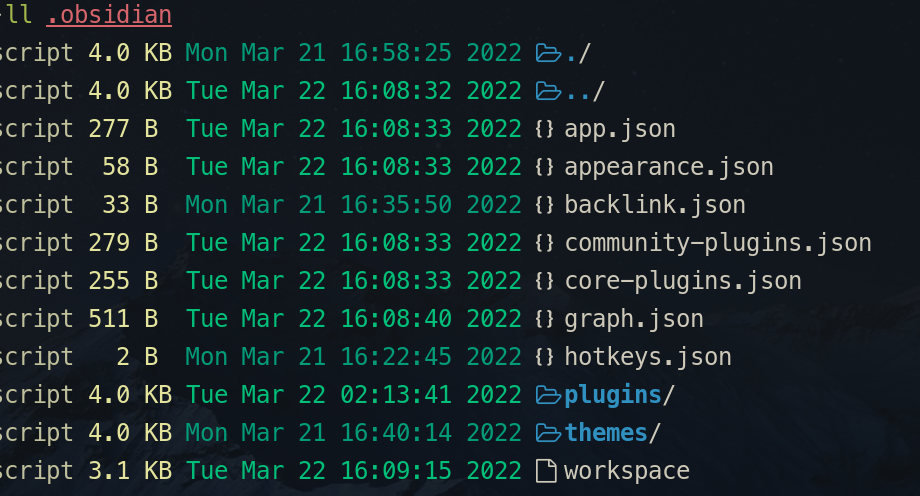
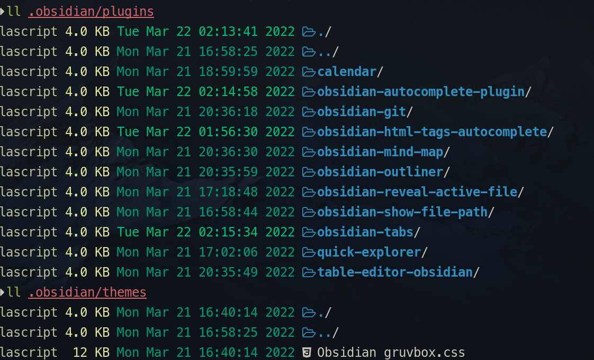
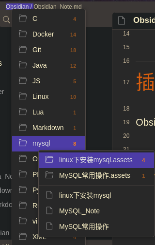
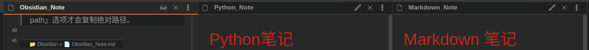
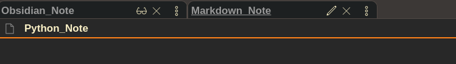
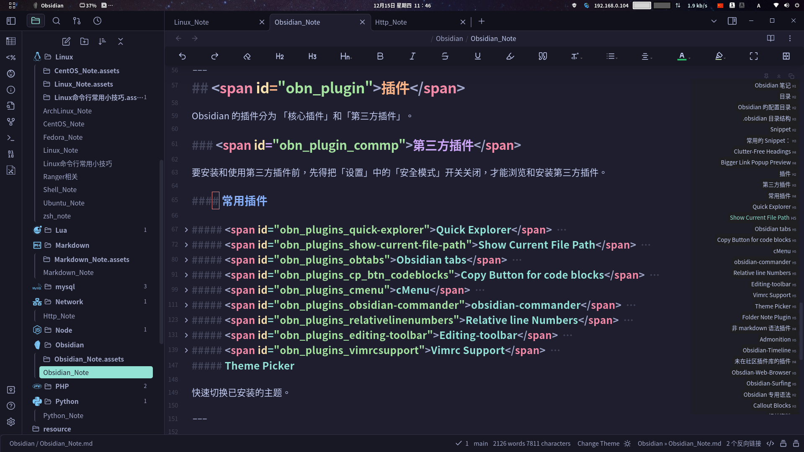

# Obsidian 笔记

---

## 目录
* [基础设置](#基础设置)
	* [文件与链接](#文件与链接)
		* [设置内部链接类型](#设置内部链接类型)
		* [外观](#外观)
* [Obsidian 配置目录](#obn_config_dir)
* [Snippet](#obn_snippet)
*  [插件](#obn_plugin)
	* [第三方插件](#obn_plugins_commp)
	* [quick explorer](#obn_plugins_quick-explorer)
	* [show current file path](#obn_plugins_show-current-file-path)
	* [floating-toc](#obn_plugins_obsidian-floating-toc-plugin)
	* [Easy Typing](#obn_plugins_easy-typing)
	* [非 markdown 语法插件](#obn_plugins_notmarkdown)
* [Obsidian 专用语法](#obn_syntax)
	* [Callout Blocks](#obn_syntax_calloutblocks)

---

## <span id="obn_config_settings_basice">基础设置</span>

基础设置是非插件化，对 Obsidian 最原始的设置。

### <span id="obn_config_settings_basice_edit">编辑</span>

「默认视图」选择「阅读模式」（Reading View）。

「默认编辑模式」选择「源码模式」，这样编辑更准确些，而且不用即时渲染还能节省性能，提高编辑的流畅度。
> [! tip] 实时预览
> 「实时预览模式」效果跟 [Typora](https://typora.io/) 默认的类似，就是一边编辑，编辑器一边给你渲染出发布的页面效果。

### <span id="obn_config_settings_basice_filelinks">文件与链接</span>

「文件与链接」选项的设置，主是对链接各种设置。

#### 设置内部链接类型

默认「内部链接类型」是「尽可能简短形式」，就是不管链接目标文件是否在当前目录，都以不加目录路径（即没有绝对路径，也没有相对路径），这样链接如果是当前目录当前文件内部链接还没什么问题，如果链接目标是目录的文件时，虽然在 Obsidian 中能够链接到，但这在实际 Markdown 使用会出现问题，会出现找不到链接情况。为了更符合 Markdown 使用习惯，应将链接类型改为「**基于当前目录的相对路径**」，这样它就是根据目标链接文件是否在当前目录而使用**相对路径**链接策略。

#### 不使用 Wiki 链接
为了使文档更符合 Markdown 规范，将「使用Wiki链接」选项给关闭，仅使用 Markdown 标准的 `[]()` 这种语法

### <span id="obn_config_settings_appearance">外观</span>

^f53495

「外观」设置，主要是对[主题](#obn_themes) 、「字体」等设置。

「外观」设置中还能使用 [CSS 代码片段](#obn_snippet)进行外观上更详细而深入的配置。

---

##  <span id="obn_config_dir">Obsidian 的配置目录</span>

在 Obsidian的 **vault**，就是所谓的「库」，其根目录下，Obsidian 会生成一个配置目录 **.obsidian**。

### .obsidian 目录结构

* Obsidian 是使用 json 文件来配置的。
* app.json：主配置文件
* appearance.json：外观配置文件
* core-plugins.json：核心插件配置文件
* community-plugins.json：第三方插件配置文件
* graph.json：图表相关的配置文件（像什么链接、关系图谱等）
* hotkeys.json：快捷键配置文件



* plugins： 目录是存放插件的目录。每个插件都以独立的目录存放。
* themes：主题样式。存的是一些 css 文件。



---

## <span id="obn_snippet">Snippet</span>

1. 将相应的 css 文件放到当前库下.obsidian 目录中的 **snippets** 目录下。
2. 在 obsidian 的 「外观」（Appearance）设置选项中，「CSS 代码片段」（CSS Snippets）选项，点下刷新，就能加载出可用的 Css
 Snippets ，根据需要启用相应的 CSS Snippet，该 Snippet 的功能就能生效了。

### 常用的 Snippet：

#### Clutter-Free Headings

[clutter-free-headings](https://github.com/deathau/obsidian-snippets#clutter-free-headings)可以让标题那些「#」符号以「H1」~「H6」方式显示。

#### Bigger Link Popup Preview

[Bigger Link Popup Preview](https://github.com/kmaasrud/awesome-obsidian/blob/master/code/css-snippets/bigger-link-popup-preview.css) 这个 Snippet 可以加大预览窗口大小。

---

## <span id="obn_themes">主题</span>

---

## <span id="obn_plugin">插件</span>

Obsidian 的插件分为 「核心插件」和「第三方插件」。

### <span id="obn_plugins_commp">第三方插件</span>

要安装和使用第三方插件前，先得把「设置」中的「安全模式」开关关闭，才能浏览和安装第三方插件。

插件安装，同样因为众所周知的原因，访问起来存在一定的困难性，因为它用的是 [github](https://github.com/)。

各种解决访问 github 的方案：
* [Github加速](../Git/Git_Note.md#Github加速)

#### 常用插件

##### <span id="obn_plugins_quick-explorer">Quick Explorer</span>
这个插件，是在界面标题栏中显示，当前路径，并且可以快速浏览文件。



##### <span id="obn_plugins_show-current-file-path">Show Current File Path</span>
此插件是在底部状态栏上显示当前文件名，点击能够复制文件的路径名。
> 默认情况，点击复制的是相对路径，只有在这个插件的设置中，打开了「Copy absolute path」选项才会复制绝对路径。


---

##### <span id="obn_plugins_obtabs">~~Obsidian tabs~~</span>
[Obsidian tabs](https://github.com/gitobsidiantutorial/obsidian-tabs) 这插件能让多个面板变成单面板多标签的形态。

Obsidian 更新到 1.0 版本后，这个插件就没什么用了，因为多标签的功能已经成了内置功能。

使用 **Obsidian tabs** 前：



使用 **Obsidian tabs** 后：



---

##### <span id="obn_plugins_cp_btn_codeblocks">Copy Button for code blocks</span>

[Copy Button for code blocks](https://github.com/jdbrice/obsidian-code-block-copy) 是一个在代码区添加一个复制按钮的插件。这插件异常的实用，非常推荐安装。


---

##### <span id="obn_plugins_cmenu">cMenu</span>

[cMenu](https://github.com/chetachiezikeuzor/cMenu-Plugin) 这个插件是在编辑区添加一些快捷功能按钮。


这插件能使编辑文档时，提高其编辑的流畅度。

这插件除了预设的功能按钮，还能根据自己的需求，自定义配置自己的按钮。

---

##### <span id="obn_plugins_obsidian-commander">obsidian-commander</span>

[obsidian-commander](https://github.com/phibr0/obsidian-commander) 是一个自定义命令插件。


这插件的自由度非常高，可以在很多位置自定义命令。

可以在标题栏、状态栏、右键菜单、页眉及侧边栏添加自定义命令。

---

##### <span id="obn_plugins_relativelinenumbers">Relative line Numbers</span>

[obsidian-relative-line-numbers](https://github.com/nadavspi/obsidian-relative-line-numbers) 是一个显示相对行号的插件


---

##### <span id="obn_plugins_editing-toolbar">Editing-toolbar</span>

[obsidian-editing-toolbar](https://github.com/cumany/obsidian-editing-toolbar) 是一个在编辑区显示常用 Markdown 组件的工具栏。 这个插件最初是  [cMenu](#obn_plugins_cmenu)  的魔改版本，后来才更名为「editing toolbar」。


---

##### <span id="obn_plugins_style-settings">Style Settings</span>

[Style Settings](https://github.com/mgmeyers/obsidian-style-settings) 是一款对主题进一步细化调整美化的插件。很多优秀的主题，诸如  [Blue-Topaz](https://github.com/whyt-byte/Blue-Topaz_Obsidian-css) 、[Catppucin](https://github.com/catppuccin/obsidian) 都会适配这个插件。

---

##### <span id="obn_plugins_obsidian-floating-toc-plugin">Obsidian-floating-toc-plugin</span>

[obsidian-floating-toc-plugin](https://github.com/cumany/obsidian-floating-toc-plugin)  是一个将当前 Markdown 文件大纲悬浮地在笔记侧边显示，是个非常实用的插件，极力推荐！

这个插件就解决本应是 Obsidian 内置的功能：一个能够跳转的文件大纲自动生成--像大名鼎鼎的 [Typora](https://typora.io/) 就天生拥有这个功能。



---

##### <span id="obn_plugins_vimrcsupport">Vimrc Support</span>

[vimrc support](https://github.com/esm7/obsidian-vimrc-support) 是一个增加了内置的 vim 功能的插件。

不过这插件有点鸡肋，完全比不上在 vscode 上使用 vim的插件的体验，而且配置麻烦。

---

##### <span id="obn_plugins_theme-picker">Theme Picker</span>

[Theme Picker](https://github.com/kenset/obsidian-theme-picker) 在状态上实现快速切换已安装的主题功能。这个插件另外还附带快速进行深色与浅色间切换功能。


##### Folder Note Plugin

这是一个目录插件。可以在点击SideBar 中的目录时，在面板上展现目录下的所有内容。

##### <span id="obn_plugins_easy-typing">Easy Typing</span>

[Easy Typing](https://github.com/Yaozhuwa/easy-typing-obsidian) 这是一个非常强悍的排版插件。真的非常强悍，没用，单看他的[README](https://github.com/Yaozhuwa/easy-typing-obsidian/blob/master/changelog.md)文档就吓到我了！

具体功能参考：[Easy Typing 中文文档](https://github.com/Yaozhuwa/easy-typing-obsidian/blob/master/README_ZH.md)

---

#### <span id="obn_plugins_notmarkdown">非 markdown 语法插件</span>

##### Admonition

添加提示块。

语法：ad-类型

```ad-note
note 类型
```

---

##### Obsidian-Timeline

[obsidian-timeline](https://github.com/George-debug/obsidian-timeline) 是一个非 markdown 语法实现「时间轴」插件。

语法很简单：
~~~markdown

```timeline
[line-3, body-2]
+ 时间
+ 标题
+ 内容

```
~~~

示例：

~~~markdown
```timeline
[line-4, body-4]
+ 1494 年
+ 明朝弘治七年。
+ 西班牙和葡萄牙达成瓜分世界的托尔德西里亚斯条约。 

弗朗索瓦·拉伯雷（Francois Rabelais，1494 年 2 月 4 日~1553 年 4 月 9 日） 出生。

+ 1533 年 
+ 明世宗嘉靖十二年
+ 俄罗斯伊凡四世继位，伊凡四世是第一位沙皇。

蒙田（1533 年~1592 年）出生。


+ 1622 年 
+ 天启二年
+ 朱由检封信王。

莫里哀（Molière，1622 年 1 月 15 日~1673 年 2 月 17 日） 出生。
	
```
~~~


`[line-4, body-4]` 这个是指定显示风格。

---

#### <span id="obn_plugins_outside_community">未在社区插件库的插件</span>

要安装未在社区插件库上架的插件，得先安装 [obsidian42-brat](https://github.com/TfTHacker/obsidian42-brat) 这个插件。

**obsidian42-brat** github 地址： [https://github.com/TfTHacker/obsidian42-brat](https://github.com/TfTHacker/obsidian42-brat)。

使用 **obsidian42-brat** 安装插件：

1. 安装写并启用 **obsidian42-brat** 后，就能在其选项页面看到 `Add Bate plugin` 按钮，点击此按钮，就会弹出一个输入框，把你要安装的插件的 [github](https://github.com) 地址放进去，他就会帮你下载安装。
2. 下载安装完成，它会提示你启用这个插件。
3. 跟通过社区插件库安装的插件完全一样，通过 **obsidian42-brat** 下载安装好的插件，同样会在插件列表中显示出来（因为它们都是下载到 `.obsidian/plugins` 目录中保存的），只要启用它，这个插件就可能用了。

> 注意： **obsidian42-brat** 只能用于安装插件，如果要卸载通过它安装的插件，如果在 **obsidian42-brat** 选项页面中删除某插件，事实上这个插件并没有真正被卸载，在 obsidian 的第三方插件列表中还能找得到它，所以要真正卸载此插件，还是得到 obsidian 第三方插件列表中点击卸载才能真正卸载干净。

下面就介绍几款常用未上架插件社区的插件：

##### <span id="obn_plugin_brat_webbrowser">Obsdian-Web-Browser</span>

[obsidian-web-browser](https://github.com/Trikzon/obsidian-web-browser) 这个插件是能在 obsidian 中打开网页，即把 obsidian 变成一个浏览器！ 好爽啊！

**obsidian-web-browser** github 地址：[https://github.com/Trikzon/obsidian-web-browser](https://github.com/Trikzon/obsidian-web-browser) 。

---

##### <span id="obn_plugin_brat_surfing">Obsidian-Surfing</span>

[Obsidian-Surfing](https://github.com/Quorafind/Obsidian-Surfing) 同样也是一个浏览器插件，这个插件是上面那个[obsdian-web-browser](#obn_plugin_brat_webbrowser) 插件的修改版本，其功能更为强大。

**Obsidian-Surfing**  github 地址：[https://github.com/Quorafind/Obsidian-Surfing](https://github.com/Quorafind/Obsidian-Surfing) 。

---

## <span id="obn_syntax">Obsidian 专用语法</span>

### <span id="obn_syntax_calloutblocks">Callout Blocks</span>

Obsidian 的 「Callout Blocks」 语法实质是对原生 Markdown 引用语法的扩展，让引用块显示得更美观。

Callout Blocks 语法：
```markdown
> [!类型] 标题
> 正文
```

示例：

> [!note] 示例1
> 示例1 正文

> [!help] 示例2
> 示例2 正文

如果想要 Callout Blocks 设置引用块默认展开或折叠效果，可以通过使用 `+` 和 `-` 来实现折叠效果的开启或关闭，`-`是折叠，`+` 展开，语法如下：

```markdown
> [!类型]+ 标题 

> [!类型]- 标题
```

示例：

> [!tip]+ 示例3
> 示例3 这是默认展开 

> [!tip]- 示例4
> 示例4 这是默认折叠 

Callout Blocks 的「**类型**」其实就是些**图标**及**颜色**样式，能够让引用块更具有「语义性」。

Callout Blocks 预置类型：

* `note`
> [!note]

* `info`
> [!info]

* `abstract` 或 `summary`、`tldr`
> [!abstract]

* `todo`
>[!todo]

* `tip` 或 `hint`、`important`
> [!tip] 

* `success` 或 `check`、`done`
> [!success]

* `question` 或 `help`、`faq`
> [!help]

* `warning` 或 `caution`、`attention`
> [!waring]

* `failure` 或 `fail`、`missing`
> [!fail]

* `danger` 或  `error`
> [!danger]

* `bug`
> [!bug]

* `example`
> [!example]

* `quote` 或 `cite`
> [!quote]

如果「标题」不写，那默认就会使用「类型」名称作为标题名。

另外，Callout Blocks 还能可以进行嵌套，如下例：

> [!help] 示例5
> > [!todo] 示例 5.1
> > > [!example] 示例 5.1.1

更多内容请参考：[callout blocks 官方文档](https://help.obsidian.md/How+to/Use+callouts)

---

##  相关资料
* [awesome-obsidian](https://github.com/kmaasrud/awesome-obsidian)
* [obsidian-snippets](https://github.com/deathau/obsidian-snippets)
* [Markdown 笔记](../Markdown/Markdown_Note.md)

