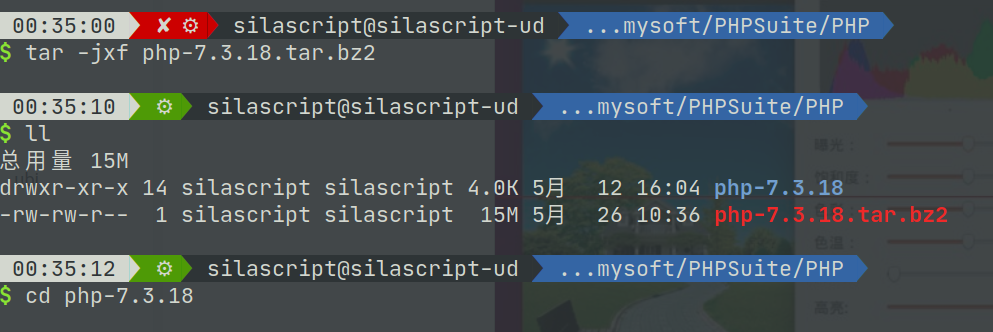

# Linux下PHP安装

---

## 目录
* [php 安装](#linux_php_install)
* [Docker 下安装 PHP](#linux_php_docker)


---

## <span id="linux_php_install">PHP安装</span>


### 从源码安装

#### 1. 从官网下载压缩包 解压，进入解压的源码目录中

如下图：




#### 2. 配置

```shell
    ./configure --prefix=/usr/local/PHP/php7.3 --exec-prefix=/usr/local/PHP/php7.3 --bindir=/usr/local/PHP/php7.3/bin --with-config-file-path=/usr/local/PHP/php7.3/etc --with-apxs2=/usr/local/apache2.4/bin/apxs --enable-mysqlnd --with-mysqli --with-pdo-mysql --enable-exif --enable-mbstring --with-openssl --enable-session 
	
```

###### PHP各版本对于mysql驱动的不同设置

PHP从5.4开始内置了MySQL驱动mysqlnd:

php-src/ext/mysqlnd/

php-src/ext/mysql/

php-src/ext/mysqli/

php-src/ext/pdo_mysql/

关系:mysql,mysqli,pdo_mysql这3套PHP操作MySQL的编程接口底层都依赖PHP内置的MySQL驱动mysqlnd.

PHP5.3这样启用mysqlnd支持:
```shell
--with-mysql=mysqlnd
--with-mysqli=mysqlnd
--with-pdo-mysql=mysqlnd
```

**PHP5.4后留空则默认启用mysqlnd**:
```shell
--with-mysql
--with-mysqli
--with-pdo-mysql
```

**PHP7开始不再支持--with-mysql**


#### 3. make

#### 4. make install


### 使用phpize来编译和安装php的扩展


#### phpize在php安装目录中的bin目录下

到php的源码目录下extensions（扩展）目录，phpize必须在想要编译安装的扩展的目录中

###### 大致步骤：

1. 在相应的扩展源码目录中敲入phpize命令

   如果没有错误phpize在此扩展源码中生成相应的configure文件

   使用configure命令进行编译前配置

```shell
./configure --with-php-config=/usr/local/php/bin/php-config  #配置时 要将php-config的路径附上
```

`--with-php-config` 用来指定php-config的路径，php-config是php安装目录中bin目录中的一个跟php配置相关的程序


**如果是mysql扩展，得再加其他配置选项**

php-5.3.x: 

```shell
./configure --with-mysql=mysqlnd \ --with-mysqli=mysqlnd \ --with-pdo-mysql=mysqlnd \ 
```


php-5.4+

php 5.4及以上编译时可以不加mysqlnd 默认即为mysqlnd

PHP7 正式移除了 `mysql` 扩展

[编译安装PHP的参数 --with-mysql --with-mysqli --with-apxs2默认路径](https://www.cnblogs.com/meiling12/p/6096789.html)

编译安装PHP时指定如下几个参数说明：
```shell
--with-apxs2=/usr/local/apache/bin/apxs # 整合apache，apxs功能是使用mod_so中的LoadModule指令，加载指定模块到apache，要求apache要打开SO模块
--with-config-file-path=/usr/local/php/etc # 指定php.ini位置
--with-MySQL=/usr/local/mysql # mysql安装目录，对mysql的支持
--with-mysqli=/usr/local/mysql/bin/mysql_config # mysqli扩展技术不仅可以调用MySQL的存储过程、处理MySQL事务，而且还可以使访问数据库工作变得更加稳定。
```
 
> 以上参数指定的都是我们编译安装apache,mysql的路径位置，如果在环境只编译安装PHP，apache和mysql用系统自带yum安装rpm相关的包；

这时在编译安装PHP的时候指定的默认路径如下：

```shell
--with-apxs2=/usr/sbin/apxs
--with-config-file-path=/etc
--with-mysql=/usr
--with-mysqli=/usr/bin/mysql_config
```


> 若用which apxs查找不到路径的话，可能是没有安装http-devel这个包，安装一下就好。

 

3. make
4. make install


---

## <span id="linux_php_docker">Docker 下安装 PHP</span>

如果想快速安装使用 php，可以考虑使用 Docker。

Docker 下如何安装 PHP，请参考：[Docker 安装 PHP](../Docker/Docker_Note.md#dk_softc_demo_php)


