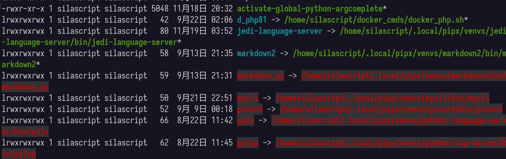

# Python 笔记

---

## 目录

* [安装和常用](#安装和常用)
* [pip](#python_pip)
	* [更新](#更新)
	* [pip 换源](#pip%20换源)
* [conda](#python_conda)
	* [conda 安装](#python_conda_install)
	* [conda 换源](#python_conda_chsources)
	* [conda 常用命令](#python_conda_commands)
	* [conda 环境](#python_conda_environment)
* [Python 语法](#python_syntax)
* [文档](#python_resource)
	* [相关文档](#python_resource_doc)
	* [相关网站](#python_resource_links)
* [相关笔记](#相关笔记)

---

## <span id="python_install">安装</span>

### 历史

[Python简史 - Vamei - 博客园](https://www.cnblogs.com/vamei/archive/2013/02/06/2892628.html)

### 安装

官网：[www.python.org](https://www.python.org)

下载页面：[www.python.org/downloads](https://www.python.org/downloads)

#### 版本

关于 Python 版本更新及维护计划，可以查看：[Status of Python versions](https://devguide.python.org/versions/)。

> [!tip]
> 
> Python 没有官方的 LTS 版本（Long-Term Support，长期支持），Python 每一个主版本的从**release**到**EOF**，整个生命周期是 5 年。

---

## <span id="python_pip">pip</span>

### 更新

```python
# 列出可以更新的包
pip list --outdated

# 更新指定的包
pip install --upgrade xxx

# 更新pip
pip install --upgrade pip
# 或 使用python -m 来更新pip
python -m pip install --upgrade pip


```

### 重装 pip

```shell

# 查看pip
pip show pip

# 卸载
python -m pip uninstall pip

# 重装
python -m ensurepip


```

> [!info] 关于 `command not found: pip`
> 
> 在 [conda](#conda) 中重装 pip，有可能出现找不到 pip 的情况。
> 
> 那极有可能是使用的 `python -m pip uninstall pip` 来装，而不是使用 `conda install pip` 命令来装。
> 
> 在 conda 环境中，使用 python 安装的 pip，执行命令是 `pip3`，不是 `pip`，所以在 conda 环境中就有可能发现 pip 找不到的情况。
> 
> 如果在 conda 环境中重装 pip，先使用 `conda install pip` 安装；然后再使用 `python -m ensurepip` 及 `python -m pip install --upgrade pip` 来「修复」。
> 
>> [!info] 相关资料
>> 
>> * [问题及解决](Python_Material.md#问题及解决)
>> * [pip](Python_Material.md#pip)
>>   

### pip 换源

#### 临时换源并安装指定包

```python
pip install -i https://pypi.tuna.tsinghua.edu.cn/simple 包名
```

清华的镜像源每五分钟更新一次，大而全，推荐大家使用。
国内其他源:

* 清华：<https://pypi.tuna.tsinghua.edu.cn/simple>
* 阿里云：<http://mirrors.aliyun.com/pypi/simple/>
* 中国科技大学 <https://pypi.mirrors.ustc.edu.cn/simple/>
* 华中理工大学：<http://pypi.hustunique.com/>
* 山东理工大学：<http://pypi.sdutlinux.org/>
* 豆瓣：<http://pypi.douban.com/simple/>

#### 永久性换源

1. 第一种方式：

```shell
# 清华源
pip config set global.index-url https://pypi.tuna.tsinghua.edu.cn/simple
# 阿里源
pip config set global.index-url https://mirrors.aliyun.com/pypi/simple/
# 腾讯源
pip config set global.index-url http://mirrors.cloud.tencent.com/pypi/simple
# 豆瓣源
pip config set global.index-url http://pypi.douban.com/simple/

```

2. 第二种方式：

直接修改 pip 配置文件
pip 的配置文件是放在 `.pip` 目录下的 **pip.conf** 文件中 (windows 是 pip.ini 文件)

示例：

```config
[global]
index-url = https://pypi.tuna.tsinghua.edu.cn/simple
```

> [!tip]
> 
> 现在的 pip，配置文件 **pip.conf** 是放在 `~/.config/pip/` 目录中。在 [conda](#python_conda) 中配置 pip 也是放在这个目录中。
> 

### pip 搜索

由于 `pip search` 命令不能用，所以使用「pip-search」这个包来实现搜索功能。

```shell
# 安装 pip-search
pip install pip-search

# 使用 pip-search
# 使用这货时，得敲 pip_search 命令，而不是 pip-search
pip_search 要搜索的包

```

### pip 问题

#### 虚拟环境外使用 pip

新版本的 linux 发生版，避免 Python 包管理器与系统底层冲突，所以禁止 `pip install`。只能在「虚拟环境」中使用 `pip`。如果执行 `pip install xxx`，会报 `externally managed environment` 错误提示。

当然不怕死的，可以使用 `--break-system-packages` 这个选项，硬装。

### pip 小工具

#### pipdeptree

`pipdeptree` 这个工具可以显示 pip 中各模块依赖「关系树」。有了这工具，删除模块时就可以更有「自信」了。

因为它是有入口程序，所以它是可以使用 [pipx](#pipx) 安装的。

```shell
pip install pipdeptree
```

##### pipdeptree 使用

* `pipdeptree`：查看所有包依赖关系
* `pipdeptree -p <package_name>`：可以查看特定包的依赖关系
* `pipdeptree -r -p <package_name>`： 可以查看哪些包依赖于特定包

#### pip-autoremove

`pip-autoremove` 这工具在删除某模块时，把依赖的模块也一起「清理」了！

```shell
pip install pip-autoremove
```

---

## <span id="python_virtualenvironments">虚拟环境</span>

Python 有多种多样的虚拟环境，如 `Virtualenv`、自带的 `venv`，著名的 `pipenv`，还有最最流行的 [conda](#conda)。

### virtualenv

[Virtualenv](https://virtualenv.pypa.io/en/latest/) 是 python2 到 python3 都能使用的一个虚拟环境。

### venv

从 python3.3 开始，就自带了一个虚拟环境：venv。

### Poetry

#### 相关资料

* [Poetry 资料](Python_Material.md#poetry)

### pipenv

#### 相关资料

* [虚拟环境](Python_Material.md#虚拟环境)

---

## <span id="python_conda">conda</span>

[Conda](https://docs.conda.io/en/latest/index.html) [] (https://github.com/conda/conda) 分为 annaconda 和 miniconda 两个。

anaconda 是包含了一些常用包，并且有图形用户界面，属于比较完善的环境管理工具。

[miniconda](https://docs.conda.io/en/latest/miniconda.html) 是 anaconda 的精简版本，仅包含 conda 主程序和基本包，没有用户界面。

### <span id="python_conda_install">conda 安装</span>

miniconda 对于一般需求而言装这个就够用了。

到 [miniconda 官网](https://docs.conda.io/en/latest/miniconda.html) 下载相应平台安装文件。

以 Linux 为例，miniconda Linux 版本其实就是一个「大」 shell 脚本文件。

嫌官网速度慢，可以到清华镜像站下：[https://mirrors.tuna.tsinghua.edu.cn/anaconda/miniconda](https://mirrors.tuna.tsinghua.edu.cn/anaconda/miniconda) 。

也可以使用 [wget](https://www.gnu.org/software/wget/) [](https://github.com/mirror/wget) 进行下载。
```shell
# -c 是能实现断点续传
wget -c https://repo.anaconda.com/miniconda/Miniconda3-latest-Linux-x86_64.sh
# -O 是能下载到用户目录后重命令文件
wget -c -O https://repo.anaconda.com/miniconda/Miniconda3-latest-Linux-x86_64.sh
```

更详细的 wget 的使用，可以参考 [wget 介绍](../Linux/Linux_Note.md#linux_network_command_downloader_wget)。

使用 `sudo sh xxxxx.sh` 命令来安装 miniconda。
> [!tip] sh 执行权限
> 执行安装脚本时，最好还是加上 `sudo`，因为如果你要将 miniconda 安装在如 `/opt/miniconda` 目录下时，`miniconda` 这个自定义的 miniconda 安装目录如果不存在，安装脚本在安装到指定 [安装目录](#^774c11) 这一步骤时，会提示安装目录不存在，需要创建，这时就需要在 `opt` 下创建 `miniconda` 子目录。但 miniconda 安装脚本是不允许事先先建好个安装目录的，这个安装目录必须根据用户指定设置后，由脚本自行创建，如果指定了事先存在的安装目录，就会出现 `ERROR: File or directory already exists: '/opt/miniconda3'` 这样的提示，而由脚本自行创建，那就需要 root 权限，这同样也是为什么 miniconda 安装脚本默认安装路径是用户根下了，因为安装在用户根下不需要 root 权限就能创建安装目录，所以需要将 miniconda 安装到非用户目录下时，就得在执行安装脚本时使用 `sudo` 来执行。
^1f5cab

安装脚本执行过程： ^2156b8
1. 看许可并同意
2. 指定安装路径
> [!tip] 默认路径及指定路径
> 默认安装路径会是在 `/home/用户名/miniconda3`。可以自行指定路径。但如果想要将 miniconda 安装在非用户目录下，就需要在执行 miniconda 安装脚本时使用 `sudo`，以此来让安装脚本拥有 [root权限](#^1f5cab)，以便顺利创建 minconda 的安装目录。 ^774c11
3. 初始化
> [!info] 初始化做了什么
> ```shell
> Do you wish the installer to initialize Miniconda3
> by running conda init? [yes|no]
> [no] >>> yes
> no change     /opt/miniconda3/condabin/conda
> no change     /opt/miniconda3/bin/conda
> no change     /opt/miniconda3/bin/conda-env
> no change     /opt/miniconda3/bin/activate
> no change     /opt/miniconda3/bin/deactivate
> no change     /opt/miniconda3/etc/profile.d/conda.sh
> no change     /opt/miniconda3/etc/fish/conf.d/conda.fish
> no change     /opt/miniconda3/shell/condabin/Conda.psm1
> no change     /opt/miniconda3/shell/condabin/conda-hook.ps1
> no change     /opt/miniconda3/lib/python3.10/site-packages/xontrib/conda.xsh
> no change     /opt/miniconda3/etc/profile.d/conda.csh
> modified      /root/.bashrc
>
> ```
> 其实就是装了些基础包及配置了下环境变量。

#### <span id="python_conda_install_path">关于环境变量</span>

```config
__conda_setup="$('/home/silascript/miniconda3/bin/conda' 'shell.zsh' 'hook' 2> /dev/null)"
if [ $? -eq 0 ]; then
    eval "$__conda_setup"
else
    if [ -f "/home/silascript/miniconda3/etc/profile.d/conda.sh" ]; then
        . "/home/silascript/miniconda3/etc/profile.d/conda.sh"
    else
        export PATH="/home/silascript/miniconda3/bin:$PATH"
    fi
fi
unset __conda_setup
```

在 `.profile` 或指定 shell 配置文件，如 zsh 的 `.zshrc` 中，加入以上配置，那终端启动一个 shell，这时就自动处于 conda 的一个虚拟环境中 -- 默认是处于 Base 环境，conda 就「接管」了 Python。

> [!info]
> 
> 这不是单纯的像 `export PATH=$PATH:"$HOME/miniconda3/bin"`，这样将 bin 目录加入 Path 路径，这种添加环境变量的方式，不能进行 `activate` 激活切换环境。

> [!tip] 不同配置文件中配置 conda 的区别
> 
> 如果是配在 `.profile` 或 `xprofile` 中，激活或注释取消这种「接管」，需要重启或注销重新登录系统才能生效，而在 `.zshrc` 这种针对某个 shell 的配置文件中配置，就能 `source` 此配置文件后，立即生效！

---

### <span id="python_conda_chsources">conda 换源</span>

#### 生成 conda 配置文件

以清华源为例：

刚装完的 conda，是没有 `.condarc` 配置文件的，可以执行以下命令，生成 `.condarc` 文件：

```shell
conda config --set show_channel_urls yes
```

使用命令方式添加源：

```shell
conda config --add https://mirrors.tuna.tsinghua.edu.cn/anaconda/pkgs/main
```

在生成的 `.condarc` 文件中手动追加以下配置：

```text
channels:
  - https://mirrors.tuna.tsinghua.edu.cn/anaconda/pkgs/main
  - https://mirrors.tuna.tsinghua.edu.cn/anaconda/pkgs/r
  - https://mirrors.tuna.tsinghua.edu.cn/anaconda/pkgs/msys2
custom_channels:
  conda-forge: https://mirrors.tuna.tsinghua.edu.cn/anaconda/cloud
  msys2: https://mirrors.tuna.tsinghua.edu.cn/anaconda/cloud
  bioconda: https://mirrors.tuna.tsinghua.edu.cn/anaconda/cloud
  menpo: https://mirrors.tuna.tsinghua.edu.cn/anaconda/cloud
  pytorch: https://mirrors.tuna.tsinghua.edu.cn/anaconda/cloud
  pytorch-lts: https://mirrors.tuna.tsinghua.edu.cn/anaconda/cloud
  simpleitk: https://mirrors.tuna.tsinghua.edu.cn/anaconda/cloud
```

> [!info] 关于 condarc 注意点
> 
>> [!info]
>> 
>> ```yaml
>> channels:
>>   - defaults
>> default_channels:
>>   - https://mirrors.tuna.tsinghua.edu.cn/anaconda/pkgs/main
>>   - https://mirrors.tuna.tsinghua.edu.cn/anaconda/pkgs/r
>>   - https://mirrors.tuna.tsinghua.edu.cn/anaconda/pkgs/msys2
>>
>> ```
> `channels` 节点下那个 `defaults` 是引用 `default_channels` 这个节点定义的 channel 的。强调引用名称叫 `defaults`，不要少了**s**！
> 
>> [!info] 
>> 
>> ```yaml
>> Channels:
>>   - defaults
>>   - https://repo.anaconda.com/pkgs/main
>>
>>``` 
>
> 
> 网上一些教程，那些主 channel，是 `free` 的，这个 channel 的 python 太老了，不要用了，换成 `main`。-- [anaconda](https://www.anaconda.com/) 官方从 4.7 版本就已经移除了 free 这个 channel 了。
>
>> [!qoute]
>> 
>> [remove free channel](https://www.anaconda.com/blog/why-we-removed-the-free-channel-in-conda-4-7)
> 
>> [!info] 相关资料
>> 
>> [Conda](Python_Material.md#Conda)

> [!info] 关于 channel 配置
> 
> 观察发现清华源的配置中，`custom_channels` 中各类包都是 [mirrors.tuna.tsinghua.edu.cn/anaconda/cloud](https://mirrors.tuna.tsinghua.edu.cn/anaconda/cloud) 这个地址，所以可以使用 `channel_alias`「精简」下。另外，channels 各源在检索时是有优先级的，依次从上到下逐一检索，所以鉴于 conda-forge 的包又全又新，可以根据需要将其优先级提高仅限于 main。
> 

 完整配置可如下：

```yaml
channels:
  - https://mirrors.tuna.tsinghua.edu.cn/anaconda/pkgs/main
  - https://mirrors.tuna.tsinghua.edu.cn/anaconda/cloud/conda-forge
  - https://mirrors.tuna.tsinghua.edu.cn/anaconda/pkgs/r
  - https://mirrors.tuna.tsinghua.edu.cn/anaconda/pkgs/msys2
channel_alias: https://mirrors.tuna.tsinghua.edu.cn/anaconda/cloud
show_channel_urls: true
```

> [!tip] 清缓存
> 
> 切换 channel 后，使用 `conda clean -i` 或 `conda clean -a` 来清理缓存。
> 
> 配完源，使用 `conda update --all` 更下，看能显示出刚配的**channel**，如果没有，就是配置文件存在问题。

##### channel

channel，通道，顾名思义，就是软件或叫模块的来源。

* `pkgs/main`：python 最基础的包
* `pkgs/r`：提供 R 语言使用的包
* `pkgs/msys2`：windows 下 msys2 相关的包

* `Conda-Forge`：由社区维护的最常用的 Channel，包含的包很全，更新也非常即时

`conda install python` 安装 python，会连带以下包：

```shell
  ca-certificates    anaconda/pkgs/main/linux-64::ca-certificates-2024.7.2-h06a4308_0 
  libgcc-ng          conda-forge/linux-64::libgcc-ng-14.1.0-h69a702a_1 
  libuuid            anaconda/pkgs/main/linux-64::libuuid-1.41.5-h5eee18b_0 
  openssl            anaconda/pkgs/main/linux-64::openssl-3.0.15-h5eee18b_0 
  pip                anaconda/pkgs/main/linux-64::pip-24.2-py312h06a4308_0 
  setuptools         anaconda/pkgs/main/linux-64::setuptools-72.1.0-py312h06a4308_0 
  wheel              anaconda/pkgs/main/linux-64::wheel-0.43.0-py312h06a4308_0 
```

#### 恢复官方默认源

```shell
conda config --remove-key channels
```

#### 常用镜像

[Anaconda 软件仓库镜像使用帮助 - MirrorZ Help](https://help.mirrors.cernet.edu.cn/anaconda/)

### <span id="python_conda_uninstall">conda 卸载</span>

查看 conda 环境：

```shell
conda info --envs
```

将环境一个个地 `remove`（删除到只剩个 base 就行了）：

```shell
conda remove -n 环境名称 --all
```

删除 `.profle`、`.xprofile`、`.bashrc` 或 `.zshrc` 等配置文件中 conda 相关的 配置。

删除相应目录及配置文件：
* `rm -rf ~/.conda`
* `rm -rf ~/.condarc`

> [!info] 相关资料
> 
> * [linux卸载conda环境\_千锋教育](http://www.mobiletrain.org/about/BBS/150422.html)
> 

---

### <span id="python_conda_commands">conda 常用命令</span>

#### <span id="python_conda_commands_config">配置</span>

##### 命令配置

`conda config` 是 conda 配置命令。此组命令可以在终端中对 conda 进行配置。

* `conda config --show`：查看当前配置
* `conda config --show-sources`：查看当前配置所有源
* `conda config --set changeps1 true`：开启显示环境名称功能 #环境名
* `conda config --set changeps1 false`：关闭显示环境名称功能 ^4d4740
* `conda config --add channels`：添加 channel
* `conda config --remove channels`：移除 channel
* `conda config --show channels`：查看现有 channel
* `conda config --set channel_priority strict`：设置 channel 解析优先级

config 相关参数可以使用 `conda config --help` 查看。

##### 手动配置

conda 所有配置，都是在 `.condarc` 配置文件中保存，所以可以手动对 `.condarc` 文件进行编辑，同样可以达到配置 conda 的目的。

#### <span id="python_conda_commands_remove">删除</span>

* `conda clean --all`：清理缓存和未使用的软件包
* `conda remove 环境名`：[删除环境](#删除环境)

#### <span id="python_conda_commands_create">创建</span>

创建命令 `create` 用于 [创建环境](#python_conda_environment_create)。更详细参数或选项可以通过 `conda create -h` 来查看。

#### <span id="python_conda_commands_list">List</span>

`conda list` 命令默认是列表出当前环境中包。 ^b4c89c

而如果什么环境都没有 [启动](#启动环境)，那就会列出默认的 [base 环境](#base%20环境) 中的包。

#### <span id="python_conda_commands_env">env</span>

`conda env` 是针对 [环境](#环境) 的命令。

> [!tip] conda env list
> 
> `conda env list` 不能与 `conda list env` 混淆。
> 
> `conda env list` 是列出有哪些环境；而 `conda list env` 这种语法根本就是错误的，要 [列出某环境中的包](#环境包列表)，得使用 `conda list -n 环境名` 这样的命令。

---

### <span id="python_conda_environment">conda 环境</span>

#### base 环境

[安装](#^2156b8) 完 conda 后，conda 就自带了一个叫「base」的环境，这下环境是装在 conda 安装目录下的 `env` 子目录中。

#### <span id="python_conda_environment_create">创建环境</span>

创建环境使用到了 [创建](#python_conda_commands_create) 命令：`conda create -n myenv`

> [!info] 命令解释
> 
> 使用 `-n` 参数来创建环境，实参的值就是自行指定的「环境名称」
> 
> 创建的环境会保存在用户目录下的 `.conda/envs` 目录下的同名目录中，如示例中的 *myenv* 环境，就会放在 `.conda/envs/myenv` 中。
> 
> 创建环境时，如不指定 Python 的版本，默认安装最新的 Python 版本。

创建时指定 Python 版本号及安装的包，其语法：`conda create -n your _env_name package_name python=X.X`

示例：
`conda create -n myenv numpy matplotlib python=3.8`

只指定 Python 版本，在创建环境时，也连带 [pip](#pip) 等也一并安装了。

#### <span id="python_conda_environment_removeqn">删除环境</span>

删除环境使用到了 [删除](#python_conda_commands_remove) 命令：`conda remove -n 环境名称 --all`
> [!info] 命令解释
> `--all` 指的是删除这个环境中所有的包

#### <span id="python_conda_enviroment_copy">复制环境</span>

复制环境语法：

```shell
conda create -n 新环境名 --clone 旧环境名
```

> [!tip] 复制环境
> 复制环境实质还是一种 [创建环境](#创建环境) 的「变体」。所以同样使用到 [创建](#创建) 命令。
> 	与普通创建环境不同，多了个 `--clone` 参数选项，用于指定复制自哪个已有的 [环境](#python_conda_environment)。

---

#### <span id="python_conda_environment_activate">启动环境</span>

启动环境：`conda activate 环境名`

> [!tip] 指定 shell 类型
> 
> 第一次启动环境时，会有提示让你指定使用的 shell 类型：`conda init shell类型`。然后重启 Terminal，这时才会启动环境成功。而一次启动环境就不用再指定 Shell 类型了。

^d508bb

> [!tip] 关闭启动 base 环境
> 
> 默认情况，在 `init` 时 [指定shell类型](#^d508bb) 重启 [终端](../Linux/Linux_Note.md#终端) 后，每次启打开 [终端](../Linux/Linux_Note.md#终端)，都会自动启动 [base 环境](#base%20环境)，这会影响到正常的 Terminal 的使用，有点烦，所以为了解决这问题，就需要关闭自动启动 base 环境。可以使用以下这个命令实现：
> 
> `conda config --set auto_activate_base false`
> 
> 执行完全命令后，可以查看下 `.condarc` 文件，应该可以看到 `auto_activate_base: false` 这个配置项存在，这就证明关闭了自动启动 base 环境。

---

#### <span id="python_conda_environment_deactivate">退出环境</span>

退出当前环境，使用：`conda deactivate` 命令。

#### <span id="python_conda_environment_revision">重置环境</span>

使用 `conda list --revision` 查看可以「回滚」哪些版本。

每个版本后有个数字作为版本号。

使用 `conda install --revision 数字版本号` 来「回滚」，如 `conda install --revision 0`。最后就是确认「回滚」（`Proceed ([y]/n)? `），回滚就完成了！

#### <span id="python_conda_environment_list">环境列表</span>

要查看当前 conda 中有哪些环境，可以使用 `conda env list` 或 `conda info --env` 来查看。

另外也可以通过以下命令查看所有的虚拟环境：

```shell
conda info --envs
#也可以用缩写形式：
conda info -e
```

#### <span id="python_conda_environment_packagelist">环境包列表</span>

每一个环境其实就是各种「Package」的集合，所以一个环境中根本需求会有不同的包。那查看当前环境都装了哪个包，就可以使用 `conda list -n 环境名`。

如果在没有启动任何环境情况下，只输入 `conda list`，那 conda 会列出 [base 环境](#base%20环境) 下的包。
> [!tip]
> [base 环境](#base%20环境) 是 conda 的默认环境，即便它没有被启动，它也拥有相当的「特权」。
> 
> 在没有启动任何环境时，`conda list` 等效于 `conda list -n base`。
> 
> 即 `conda list -n 环境名`，这个语法能使用任何环境上，即便没有 [启动环境](#启动环境)，也能查看指定环境中安装了哪些包。

conda 能装什么包，可以通过 [anaconda官网](https://anaconda.org/) 查询。

#### <span id="python_conda_environment_export">导入导出环境</span>

导出环境：

```shell
conda env export > environment.yml
```

使用 `yml` 创建环境：

```shel
conda env create -n env_name -f environment.yml
```

#### <span id="python_conda_environment_package">conda 中的包</span>

#### 搜索包

搜索某模块可选版本，以 python 为例：

```shell
conda search --full --name python
```

#### 安装

安装语法：`conda install 包名`

如果要指定包的版本可以使用：`conda install 包名=版本号`

使用 `install` 语法，无论当前 [环境](#环境) 是否已经安装该包，都会为该环境安装上此包。

`install` 语法在不同情景下，有不同的理解：

* 如果已经安装了，就相当于重装安装去替代原有的
* 如果已安装的版本高于将要安装的版本，相当于「降级」
* 如果已安装的版本低于将要安装的版本，就相当于升级
> [!info] 
> 当然如果只是单纯是想要升级，也可以直接使用 [升级](#升级) 语法。

> [!important] 
> 
> 整体而言，`install` 语法就不是简单从字面上只是安装，而更准确应该是「更换」。

更换当前环境下某模块版本，仍以 python 为例：

```shell
conda install python=3.11.5
```

##### 指定 channel

语法：`conda install -c <channel> <software>`

> [!tip] 
> 
> `-c` 参数是指定使用哪个 [channel](#channel)，不使用此参数，默认使用 `default`。
> 
> 这在使用 `conda search ` 搜索时，结果最后一栏就是这个 channel 了。如下示例显示：
> 
> ```shell
> Loading channels: done
> # Name                       Version           Build  Channel             
> python                        3.11.0 h10a6764_1_cpython  conda-forge         
> python                        3.11.0 h582c2e5_0_cpython  conda-forge         
> python                        3.11.0      h7a1cb2a_2  anaconda/pkgs/main  
> python                        3.11.0      h7a1cb2a_3  anaconda/pkgs/main  
> python                        3.11.0 ha86cf86_0_cpython  conda-forge         
> python                        3.11.0 he550d4f_1_cpython  conda-forge         
> python                        3.11.1 h2755cc3_0_cpython  conda-forge         
> python                        3.11.2 h2755cc3_0_cpython  conda-forge         
> python                        3.11.2      h7a1cb2a_0  anaconda/pkgs/main  
> python                        3.11.3 h2755cc3_0_cpython  conda-forge         
> python                        3.11.3      h7a1cb2a_0  anaconda/pkgs/main  
> python                        3.11.3      h955ad1f_1  anaconda/pkgs/main  
> python                        3.11.4      h7a1cb2a_0  anaconda/pkgs/main  
> python                        3.11.4      h955ad1f_0  anaconda/pkgs/main  
> python                        3.11.4 hab00c5b_0_cpython  conda-forge         
> python                        3.11.5      h7a1cb2a_0  anaconda/pkgs/main  
> python                        3.11.5      h955ad1f_0  anaconda/pkgs/main  
> python                        3.11.5 hab00c5b_0_cpython  conda-forge         
> python                        3.11.6 hab00c5b_0_cpython  conda-forge         
> python                        3.11.7      h955ad1f_0  anaconda/pkgs/main  
> python                        3.11.7 hab00c5b_0_cpython  conda-forge         
> python                        3.11.7 hab00c5b_1_cpython  conda-forge         
> python                        3.11.8      h955ad1f_0  anaconda/pkgs/main  
> python                        3.11.8 hab00c5b_0_cpython  conda-forge         
> python                        3.11.9      h955ad1f_0  anaconda/pkgs/main  
> python                        3.11.9 hb806964_0_cpython  conda-forge         
> python                       3.11.10 hc5c86c4_0_cpython  conda-forge         
> python                       3.11.10 hc5c86c4_1_cpython  conda-forge         
> python                       3.11.10 hc5c86c4_2_cpython  conda-forge         
> python                       3.11.10 hc5c86c4_3_cpython  conda-forge         
> python                       3.11.10      he870216_0  anaconda/pkgs/main  
> python                       3.11.11 h9e4cc4f_1_cpython  conda-forge         
> python                       3.11.11      he870216_0  anaconda/pkgs/main  
> ```

示例 安装或升级 python 到指定版本，并指定使用的 [channel](#channel) 为 `conda-forge`：

```shell
conda install python=3.12.10 -c conda-forge
```

##### 升级

升级模块到最新版本，以 python 为 例：

```shell
conda update python
```

> [!info] 相关资料
> 
> [Conda 使用](Python_Material.md#Conda%20使用)

#### 强行升级

有时使用 `conda update --all` 或 `conda update conda` 升级时，会出现以下错误：

```shell
RemoveError: 'archspec' is a dependency of conda and cannot be removed from
conda's operating environment.
RemoveError: 'boltons' is a dependency of conda and cannot be removed from
conda's operating environment.
RemoveError: 'packaging' is a dependency of conda and cannot be removed from
conda's operating environment.
RemoveError: 'tqdm' is a dependency of conda and cannot be removed from
conda's operating environment.
```

这种错误，有可能是使用 [pip](#pip) 安装或更新了，再使用 conda 更新，就会出现「冲突」。

解决方法：

简单粗暴，「强制升级」：

```shell
conda update --force conda
```

> [!note] 相关资料
>
> [问题及解决](Python_Material.md#问题及解决) 

### <span id="python_conda_pip">conda 中的 pip</span>

先使用 `which pip` 来确认现在用的是哪个哪个环境的 pip。如果当前虚拟环境没装，就使用 `conda install pip` 装下。

使用当前环境中的 pip 配置国内源，跟非虚拟环境一样：

```shell
pip config set global.index-url https://pypi.tuna.tsinghua.edu.cn/simple
```

最后配置文件都是 `~/.config/pip/pip.conf`，也就是说 conda 中的 pip 配置是同用的。

> [!tip] 关于模块安装路径
> 
> 在 conda 中使用 pip 安装模块，其模块是安装在 `~/minicoda/envs/虚拟环境/bin/` 目录下的，所以只在 `activate` 此环境才能使用。
> 
> 而且这里的优先级高于 `.local/bin` 下，即高于非 conda 环境下或使用 [pipx](#python_pipx) 安装的同名模块。

### Conda 问题

#### 错误 1

```shell
Error while loading conda entry point: conda-libmamba-solver (libarchive.so.20: cannot open shared object file: No such file or directory)

CondaValueError: You have chosen a non-default solver backend (libmamba) but it was not recognized. Choose one of: classic
```

或者

```shell
Error while loading conda entry point: conda-libmamba-solver (libxml2.so.2: cannot open shared object file: No such file or directory)
```

这些错误的原因都是相同的，就是这些包必须来自同一通道。

解决方案：

```shell
conda install --solver=classic conda-forge::conda-libmamba-solver conda-forge::libmamba conda-forge::libmambapy conda-forge::libarchive
```

```shell
conda update conda --solver=classic
conda install mamba -n base -c conda-forge
```

#### 错误 2

```shell
CondaHTTPError: HTTP 000 CONNECTION FAILED for url <https://mirrors.pku.edu.cn/anaconda/cloud/conda-forge/linux-64/repodata.json>
```

连接超时，原因不明。据说将 `https` 改成 `http` 就能改善连接慢的的问题。

> [!info] 
> 
> 也有可能的原因是包损坏，所以使用 `conda clean --packages --tarballs` 清理损坏的包，可能就会正常了。

#### 错误 3

[conda](#conda) 进行 `conda update --all` 时，有时会出现以下提示信息：

```shell
==> WARNING: A newer version of conda exists. <==
    current version: 24.9.1
    latest version: 24.9.2

Please update conda by running

    $ conda update -n base -c defaults conda
```

即便根据提示执行 `conda update -n base -c defaults conda` 代码同样还是会提示有更新的版本，那么可以通过指定版本号来「升级」（`install`） [conda](#conda) 本身：

```shell
conda install -n base -c defaults conda=版本号
```

---

## <span id="python_pipx">pipx</span>

[pipx](https://github.com/pypa/pipx) 是一个自动建立虚拟环境来使用 Python 应用的工具。

pipx 与其他相近工具的比较：[pipx comparisons](https://pypa.github.io/pipx/comparisons/)

> [!info] pipx 安装条件
> 
> pipx 需要 Python 3.6+ 才可以使用

`pipx --help`，可查看 pipx 相关信息：

```shell
Virtual Environment location is /home/silascript/.local/pipx/venvs.
Symlinks to apps are placed in /home/silascript/.local/bin.

optional environment variables:
  PIPX_HOME             Overrides default pipx location. Virtual Environments will be installed to
                        $PIPX_HOME/venvs.
  PIPX_BIN_DIR          Overrides location of app installations. Apps are symlinked or copied here.
  PIPX_DEFAULT_PYTHON   Overrides default python used for commands.
  USE_EMOJI             Overrides emoji behavior. Default value varies based on platform.

```

> [!info] 关于 pipx 两个重要的目录
> 
> 一个是 pipx 的为应用建立的虚拟环境目录，默认是在 `~/.local/pipx/venvs`。
> 
> 就算是在 [conda](#python_conda) 中使用其虚拟环境的 pip 安装的 pipx，这个 pipx 所装的模块，仍是存放在 `~/.local/pipx/venvs/` 目录下。
> 
> 另一个是 pipx 中应用执行的 `bin` 文件「链接文件」所在的目录，默认是在 `~/.local/bin` 下，这其实是跟 pip 一样的。
> 
> 同样的，在 [conda](#python_conda) 的虚拟环境中使用的 pipx 装的模块的可执行程序，同样也是放在 `~/.local/bin/`。而这个程序只是一个 `link` 文件。（在 `~/.local/bin/` 目录中的那些可执行程序，其实都是些链接，它们都指向 `.local/pipx/venvs/` 目录下各模块，也就说在 conda 中使用 pipx 安装模块，这些模块安装根目录都是 `.local/pipx/venvs/`，而执行链接都是 `~/.local/bin/` 目录，pipx 有非常强的「共享性」。）
> 
> 另外，在 `~/.local/bin/` 下建立链接文件的好处还有，就是如果需要重装 pipx，并且在重装前肯定移除 `~/.local/pipx` 目录，在重装 pipx 后，又得把各模块再重装一次，，这时存在一个难题，就是该重装哪些模块，除非之前另外有记录，不然是有点麻烦的。但因为 `~/.local/bin/` 下「残留」有之前安装过的模块链接，而且因为 `~/.local/pipx/` 目录的移除，使得这些链接出现「指向」错误而在终端中「显红」，这就给该重装哪些模块提供了提示。
>
> 如下图中，那些标红的，都是之前装的，后来 `~/.local/pipx` 目录被移除后，残留的链接。
> 
> 
>
> 
> 也就说，在 [conda](#python_conda) 中各虚拟环境用 pipx 装的相同模块，其可执行程序会出现同名冲突，会报：「already seems to be installed. 」的揭示，因为这个可执行程序是个 Link 文件，它可以指向不同虚拟环境，如果不同虚拟环境下装相同的模块，后来生成的这个模拟可执行的 Link 文件就会覆盖之前装的。
> 
> 同样的也就意味着，不同虚拟环境下使用 pipx 装的模块，只要有一个虚拟环境装了，就可以在其他虚拟环境中使用，除非，这个在虚拟环境将此模块删除，或此虚拟环境本身就被删除。
> 
> 
> 所以得出一个重要的结论：pipx 装的模块在当前用户下，「全局性」更强，适合安装一些跨虚拟环境的模拟，如各种 [LSP](../vim/Vim_LSP_Complete.md)。
> 
> 同时，因为 pipx 这种「穿透性」，也就意味着 pipx 没太大必要在 [conda](#python_conda) 的虚拟环境中安装那些非「全局性」的模块。

> [!tip] pipx 安装模块要求
> 
> pipx 只能装那些有「cli」的模块，对于那些纯库类型的模块，像 pynvim，就不能装。

### 安装 pipx

pipx 可以使用 [pip](#pip) 来安装的：

```shell
pip install pipx
# 或者
python -m pip install --user pipx
```

将 `pipx` 添加到 PATH 中，方便任何地方访问它：

```shell
pipx ensurepath
```

> [!tip] 相关资料
> 
> [pipx](Python_Material.md#pipx) 

如果在 [conda](#conda) 中不使用 [pip](#pip) 安装 pipx，可以直接使用 `conda install` 来安装，但前提是先将 conda-forget 在 conda 的 channel 中配置上了。不确定能不能用 conda 直接装，可以先搜索下：`conda search --full --name pipx`，如果能搜到，就通过 `conda install pipx` 进行安装。

安装过程相关信息：

```shell
added / updated specs:
    - pipx

The following packages will be downloaded:

    package                    |            build
    ---------------------------|-----------------
    argcomplete-1.12.3         |     pyhd3eb1b0_0          35 KB  https://mirrors.tuna.tsinghua.edu.cn/anaconda/pkgs/main
    click-8.1.7                |  py311h06a4308_0         221 KB  https://mirrors.tuna.tsinghua.edu.cn/anaconda/pkgs/main
    colorama-0.4.6             |  py311h06a4308_0          36 KB  https://mirrors.tuna.tsinghua.edu.cn/anaconda/pkgs/main
    importlib-metadata-4.11.3  |  py311h06a4308_0          42 KB  https://mirrors.tuna.tsinghua.edu.cn/anaconda/pkgs/main
    importlib_metadata-4.11.3  |       hd3eb1b0_0          12 KB  https://mirrors.tuna.tsinghua.edu.cn/anaconda/pkgs/main
    packaging-23.1             |  py311h06a4308_0         100 KB  https://mirrors.tuna.tsinghua.edu.cn/anaconda/pkgs/main
    pipx-1.2.1                 |     pyhd8ed1ab_0          48 KB  conda-forge
    userpath-1.7.0             |     pyhd8ed1ab_0          17 KB  conda-forge
    zipp-3.11.0                |  py311h06a4308_0          21 KB  https://mirrors.tuna.tsinghua.edu.cn/anaconda/pkgs/main
    ------------------------------------------------------------
                                           Total:         532 KB

The following NEW packages will be INSTALLED:

  argcomplete        anaconda/pkgs/main/noarch::argcomplete-1.12.3-pyhd3eb1b0_0 
  click              anaconda/pkgs/main/linux-64::click-8.1.7-py311h06a4308_0 
  colorama           anaconda/pkgs/main/linux-64::colorama-0.4.6-py311h06a4308_0 
  importlib-metadata anaconda/pkgs/main/linux-64::importlib-metadata-4.11.3-py311h06a4308_0 
  importlib_metadata anaconda/pkgs/main/noarch::importlib_metadata-4.11.3-hd3eb1b0_0 
  packaging          anaconda/pkgs/main/linux-64::packaging-23.1-py311h06a4308_0 
  pipx               conda-forge/noarch::pipx-1.2.1-pyhd8ed1ab_0 
  userpath           conda-forge/noarch::userpath-1.7.0-pyhd8ed1ab_0 
  zipp               anaconda/pkgs/main/linux-64::zipp-3.11.0-py311h06a4308_0 


Proceed ([y]/n)? 
```

使用 conda 直接安装 pipx，使用 `conda list` 查看包信息，可以看到该环境下的 [pip](#pip) 和 pipx 是同一级的：

```shell
pip                       23.3            py311h06a4308_0    https://mirrors.tuna.tsinghua.edu.cn/anaconda/pkgs/main
pipx                      1.2.1              pyhd8ed1ab_0    conda-forge
```

> [!info] 不同安装方式存在异同
> 
> 1. 该环境下的 [[#pip]] 下（使用 `pip list` 命令查看）,同样存在 pipx，这与在该环境下使用 `pip install pipx` 结果基本相同。
> 
> 2. 使用 `conda install pipx` 方式安装，其卸载也连同相关的依赖组件一并卸载，所以而使用 pip 安装的 pipx，在卸载时，只会卸载 pipx，其依赖不同一同卸载。
> 
> 3. 如果使用 `python -m pip install --user pipx` 命令安装，该环境下使用 `conda list` 是没有 pipx 的，只能在 `pip list` 查看到。
> 
> **推荐使用 `conda install pipx` 方式安装 pipx**。

> [!important] 
> 
> 如果 conda 某环境更新 python 版本，那 pipx 最好使用 `pipx reinstall-all` 命令重新安装相应的模块，不然进行 `pipx upgrade-all` 时会报 `FileNotFoundError: [Errno 2] No such file or directory` 类似的错误。

### 安装模块

[pip](#pip) 和 `pipx` 默认都是从 [pypi](https://pypi.org/) 上安装包。

使用 pipx 安装模块或应用，跟 [pip](#pip) 差不多。

```shell
pipx install 应用名
```

使用 github 源码安装：

> [!example] 示例
> 
> ```shell
> pipx install git+https://github.com/psf/black.git
> ```

安装指定版本的模块：

```shell
pipx install package==version
```

#### PypiSearch

这个模块可以认为是 [pipx](#pipx) 必装的模块。

因为 [pypisearch](https://github.com/shidenko97/pypisearch) 这个模块功能是**搜索**模块。

```shell
pipx install pypisearch
```

安装完 [pypisearch](https://github.com/shidenko97/pypisearch) 后，就可以使用其搜索模块：

```shell
pypisearch 模块名
```

### 查询模块信息

列出已安装的所有模块：

```shell
pipx list
```

查看某模块的虚拟环境用了哪些包：

```shell
pipx runpip 模块名 list
```

### 运行

```shell
pipx run 模块名
```

### 升级

```shell
pipx upgrade 模块名
```

升级所有模块：

```shell
pipx upgrade-all
```

### 卸载

卸载域模块：

```shell
pipx uninstall 模块
```

卸载所有模块：

```shell
pipx uninstall-all
```

---

## <span id="python_uv">UV</span>

[UV](https://github.com/astral-sh/uv) 一个使用 [Rust](../Rust/Rust_Note.md) 编写的 Python 的项目工具。它包括了虚拟环境管理、项目的包依赖管理等功能。
> [!quote] 
> 
> An extremely fast Python package and project manager, written in Rust.

### 安装配置

#### 安装方式

1. 系统包管理器

以 [ArchLinux](../Linux/ArchLinux_Note.md) 为例：

```shell
yay -S uv
```

2. 使用 pip 安装

也可以使用 [pip](#python_pip) 安装：`pip install uv`

3. 使用 pipx 安装

`pipx inistall uv`

4. 在 conda 环境中安装

`conda install uv -c conda-forge`

> [!tip] 
> 
> 或者在 [conda](#python_conda) 环境中使用 `pip` 或 `pipx` 安装。

#### 配置

UV 配置分系统级别（system-level）、用户级别（user-level）、项目级别（project-level）。

项目级别配置文件优先级高于用户级别，用户级别优先级高于系统级。

系统及用户级别的配置文件必须是 `uv.toml`。

项目级别的配置文件，格式与 `pyproject.toml` 一样。

UV 的默认全局配置是放在用户目录下 `~/.config/uv/uv.toml` 文件。没有就自己新建。

> [!quote] 
> 
> uv will also discover user-level configuration at `~/.config/uv/uv.toml` (or `$XDG_CONFIG_HOME/uv/uv.toml`) on macOS and Linux, or `%APPDATA%\uv\uv.toml` on Windows; and system-level configuration at `/etc/uv/uv.toml` (or `$XDG_CONFIG_DIRS/uv/uv.toml`) on macOS and Linux, or `%SYSTEMDRIVE%\ProgramData\uv\uv.toml` on Windows.
>
> User-and system-level configuration must use the `uv.toml` format, rather than the `pyproject.toml` format, as a `pyproject.toml` is intended to define a Python *project*.
>
> If project-, user-, and system-level configuration files are found, the settings will be merged, with project-level configuration taking precedence over the user-level configuration, and user-level configuration taking precedence over the system-level configuration. (If multiple system-level configuration files are found, e.g., at both `/etc/uv/uv.toml` and `$XDG_CONFIG_DIRS/uv/uv.toml`, only the first-discovered file will be used, with XDG taking priority.)

### UV 镜像

在 `.config` 下创建相关的配置文件：

```shell
mkdir ~/.config/uv && vim ~/.config/uv/uv.toml
```

### UV 使用

#### python 版本管理

列出可用的 Python 版本：

```shell
uv python list
```

安装 Python：

```shell
uv python install 版本号
```

移除 Python：

```shell
uv python uninstall 版本号
```

固定 Python 版本：

```shell
uv python pin 版本号
```

查找已经安装的 Python 版本息：

```shell
uv python find
```

#### 脚本管理

* `uv run`：运行脚本
* `uv add --script`：为脚本添加依赖
* `uv remove --script`：移除依赖

#### 项目管理

##### 创建项目

创建或初始化项目：

```shell
uv init
```

> [!tip] 
> 
> 如果 `uv init` 后没有东西，那就是初始化当前目录。如果带上一个字符串，那就是创建一个目录然后再初始化它。

创建或初始化后的项目根目录下，会生成两个文件：

* `.python-versoin`：这个是记录当前项目 python 的版本
* `pyproject.toml`：这个文件是用来定义项目的主要依赖，包括项目名称、版本、描述、支持的 `Python` 版本等信息

创建项目时，是可以指定 python 的版本：

```shell
uv init -p python版本号
```

> [!info] 
> 
> 当然，也可以使用 `uv pytnon install xxx` 命令来安装 Python。

uv 会根据它所可以找到的 Python 环境来执行，顺序大概是：

1. 当前目录下的 `.python-version` 文件内设定的版本
2. 当前启用的虚拟环境
3. 当前目录下 `.venv` 目录内设定的虚拟环境
4. uv 自己安装的 Python
5. 系统环境设定的 Python 环境

#### 创建虚拟环境

在不指定 uv 的虚拟环境时，uv 使用的是 [临时虚拟环境](#临时虚拟环境)。

##### 临时虚拟环境

```shell
uv cache dir
```

##### 创建虚拟环境

使用 `uv venv` 命令来创建虚拟环境：

使用 `uv venv` 命令，默认情况，会在当前目录下生成 `.venv` 目录作为虚拟环境目录。

当然可以指定虚拟环境目录的名称：`uv venv p311`，这样当前目录下就会生成一个 `.p311` 的目录，这就是虚拟环境目录。

当然在创建虚拟环境时，还可以指定虚拟环境使用 Python 的版本。

 示例：
 
```shell
$ uv venv --python 3.11
Using CPython 3.11.13
Creating virtual environment at: .venv
Activate with: source .venv/bin/activate
```

---

## <span id="python_syntax">Python 语法</span>

[Python 语法](Python_Syntax.md)

---

## <span id="python_packages">常用包</span>

### <span id="python_packages_jieba">结巴分词</span>

[结巴分词](https://github.com/fxsjy/jieba) 是一个 Python 的中文分词组件。

Obsidan 中 [中文分词插件](../NoteSoft/Obsidian/Obsidian_Note.md#obn_plugins_wordsplitting_ch) 就有可能用到这个组件。

---

## <span id="python_resource">资源链接</span>

### <span id="python_resource_doc">相关文档</span>

* [Python3.x 官方中文文档](https://docs.python.org/zh-cn/3/)
* [Anaconda 中文网](https://anaconda.org.cn/)
* [conda-forge 文档](https://forge.conda.org.cn/docs/)

#### uv 文档

* [uv doc](https://docs.astral.sh/uv/)
* [uv-zh-cn](https://hellowac.github.io/uv-zh-cn/)

### <span id="python_resource_books">相关教程书籍</span>

* [Python - 100天从新手到大师  - 书栈网](https://www.bookstack.cn/read/Python-100-Days/README.md)

### <span id="python_resource_links">相关网站</span>

* [Python中文网](https://www.cnpython.com/)
* [Python123 - 编程更简单](https://python123.io)
* [Python 技术分享](https://suyin-blog.cn)

---

## 相关笔记

* [Python 资料清单](Python_Material.md)
* [Python 语法笔记](Python_Syntax.md)
* [Python 视频清单](Python_Videos.md)
* [镜像清单](../Linux/Mirror_Address.md)

