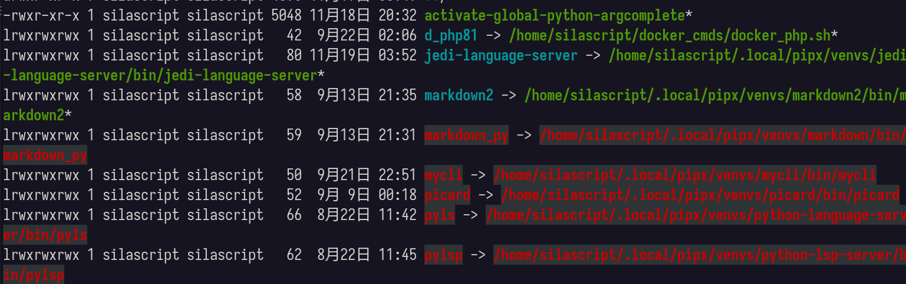

# Python 笔记

---

## 目录

* [安装和常用](#安装和常用)
* [pip](#python_pip)
	* [更新](#更新)
	* [pip 换源](#pip%20换源)
* [Python 语法](#python_syntax)
* [文档](#python_resource)
	* [相关文档](#python_resource_doc)
	* [相关网站](#python_resource_links)
* [相关笔记](#相关笔记)

---

## <span id="python_install">安装</span>

### 历史

[Python简史 - Vamei - 博客园](https://www.cnblogs.com/vamei/archive/2013/02/06/2892628.html)

### 安装

官网：[www.python.org](https://www.python.org)

下载页面：[www.python.org/downloads](https://www.python.org/downloads)

#### 版本

关于 Python 版本更新及维护计划，可以查看：[Status of Python versions](https://devguide.python.org/versions/)。

> [!tip]
> 
> Python 没有官方的 LTS 版本（Long-Term Support，长期支持），Python 每一个主版本的从**release**到**EOF**，整个生命周期是 5 年。

---

## <span id="python_pip">pip</span>

### 更新

```python
# 列出可以更新的包
pip list --outdated

# 更新指定的包
pip install --upgrade xxx

# 更新pip
pip install --upgrade pip
# 或 使用python -m 来更新pip
python -m pip install --upgrade pip


```

### 重装 pip

```shell

# 查看pip
pip show pip

# 卸载
python -m pip uninstall pip

# 重装
python -m ensurepip


```

> [!info] 关于 `command not found: pip`
> 
> 在 [Conda](Python_Conda.md) 中重装 pip，有可能出现找不到 pip 的情况。
> 
> 那极有可能是使用的 `python -m pip uninstall pip` 来装，而不是使用 `conda install pip` 命令来装。
> 
> 在 conda 环境中，使用 python 安装的 pip，执行命令是 `pip3`，不是 `pip`，所以在 conda 环境中就有可能发现 pip 找不到的情况。
> 
> 如果在 conda 环境中重装 pip，先使用 `conda install pip` 安装；然后再使用 `python -m ensurepip` 及 `python -m pip install --upgrade pip` 来「修复」。
> 
>> [!info] 相关资料
>> 
>> * [问题及解决](Python_Material.md#问题及解决)
>> * [pip](Python_Material.md#pip)
>>   

### pip 安装包

#### 根本包名安装

```shell
pip install 包名
```

#### 使用 github 地址安装

语法：

```shell
pip install git+<repo的https url>
```

> [!info] 
> 
> github 地址后面有没有 `.git` 都无所谓。

### pip 换源

#### 临时换源

* 临时换源并安装指定包

```shell
pip install -i 源地址 some-package
```

例：

```shell
pip install -i https://pypi.tuna.tsinghua.edu.cn/simple 包名
```

* 临时换源升级 `pip`

```shell
python -m pip install -i 源地址 --upgrade pip
```

清华的镜像源每五分钟更新一次，大而全，推荐大家使用。

国内其他常用源：

* 清华：<https://pypi.tuna.tsinghua.edu.cn/simple>
* 阿里云：<http://mirrors.aliyun.com/pypi/simple/>
* 中国科技大学： <https://pypi.mirrors.ustc.edu.cn/simple/>
* 南京大学：<https://mirror.nju.edu.cn/pypi/web/simple/>
* 华中理工大学：<http://pypi.hustunique.com/>
* 山东理工大学：<http://pypi.sdutlinux.org/>
* 豆瓣：<http://pypi.douban.com/simple/>

#### 永久性换源

1. 第一种方式：

```shell
# 清华源
pip config set global.index-url https://pypi.tuna.tsinghua.edu.cn/simple
# 南京大学源
pip config set global.index-url https://mirror.nju.edu.cn/pypi/web/simple
# 北大源
pip config set global.index-url https://mirrors.pku.edu.cn/pypi/web/simple
# 南阳理工源
pip config set global.index-url https://mirror.nyist.edu.cn/pypi/web/simple
# 齐鲁工业大学源
pip config set global.index-url https://pypi.qlu.edu.cn/simple
# 阿里源
pip config set global.index-url https://mirrors.aliyun.com/pypi/simple/
# 腾讯源
pip config set global.index-url http://mirrors.cloud.tencent.com/pypi/simple
# 豆瓣源
pip config set global.index-url http://pypi.douban.com/simple/

```

> [!tip] 
> 
> 配多个镜像源：`pip config set global.extra-index-url "<url1> <url2>..."`。
> 
> 源地址间使用空格间隔。
> 
> ```shell
> pip config set global.extra-index-url "https://mirror.nju.edu.cn/pypi/web/simple https://mirrors.pku.edu.cn/pypi/web/simple https://pypi.mirrors.ustc.edu.cn/simple https://mirrors.aliyun.com/pypi/simple https://mirrors.cloud.tencent.com/pypi/simple https://mirror.nyist.edu.cn/pypi/web/simple https://pypi.qlu.edu.cn/simple"
>```

示例：

```shell
$ pip config set global.extra-index-url "https://mirror.nju.edu.cn/pypi/web/simple https://mirrors.pku.edu.cn/pypi/web/simple https://pypi.mirrors.ustc.edu.cn/simple https://mirrors.aliyun.com/pypi/simple https://mirrors.cloud.tencent.com/pypi/simple https://mirror.nyist.edu.cn/pypi/web/simple https://pypi.qlu.edu.cn/simple"
Writing to /home/silascript/.config/pip/pip.conf
```
> [!tip] 
> 
> 换源成功，会有 `Writing to /home/xxx/.config/pip/pip.conf` 的提示信息，就是 `pip.conf` 配置文件被修改，如果之前没配过，就会生成一个并将配置写入。
> 

2. 第二种方式：

直接修改 pip 配置文件
pip 的配置文件是放在 `.pip` 目录下的 **pip.conf** 文件中 (windows 是 pip.ini 文件)

示例：

```config
[global]
index-url = https://pypi.tuna.tsinghua.edu.cn/simple
```

> [!tip]
> 
> 现在的 pip，配置文件 **pip.conf** 是放在 `~/.config/pip/` 目录中（旧版的是放在 `~/.pip/` 目录下）。在 [Conda](Python_Conda.md) 中配置 pip 也是放在这个目录中。
>
> 如果配多个源，各源地址间使用空格间隔，如下：
> ```txt
> [global]
> extra-index-url = https://mirror.nju.edu.cn/pypi/web/simple https://mirrors.pku.edu.cn/pypi/web/simple https://pypi.mirrors.ustc.edu.cn/simple https://mirrors.aliyun.com/pypi/simple https://mirrors.cloud.tencent.com/pypi/simple https://mirror.nyist.edu.cn/pypi/web/simple https://pypi.qlu.edu.cn/simple
>
>```

##### 换源工具

###### cnpip

[cnpip](https://github.com/caoergou/cnpip) 是一个快速切换源的小工具。

安装方式：

1. `pipx install cnpip`
2. `pip install cnpip`

功能：

* `cnpip list`：列出可用的镜像源。
* `cnpip set`：自动选择最快的镜像源
* `cnpip set 镜像名称`：选择指定镜像源
* `cnpip unset`：取消镜像源设置，恢复默认源

###### chpip

[Prodesire/chpip](https://github.com/Prodesire/chpip)，与 [cnpip](#cnpip) 很像，但这个可以自行添加源。

> [!tip] 
> 
> 注意，名字很相似啊，这个是**chpip**。
> 
> chpip 与 [cnphp](#cnphp) 根本两极端，cnphp 是只有使用内置源，而 chpip，内置源都得自行设置后才能使用。

安装方式：

```shell
pip install chpip
```

```shell
pipx install chpip
```

也可以使用特有的 [GitHub ](../Git/Git_Note.md#git_github) 方式安装：

```shell
pip install git+https://github.com/Prodesire/chpip
```

```shell
pipx install git+https://github.com/Prodesire/chpip
```

主要功能：

* `list`：列出支持的源。没什么卵用，这内置源只能看不能直接使用，得使用 `chpip set -n xxx -i xxx` 设置后才能使用。
* `show`：当前使用的源
* `-n 源名称`：切换指定名称的源

* `set -n 源名称 -i 源地址`：内置的源如果不满意，可以自行添加源。需给出**源名称**和**源地址**。

列出内置的源：

`chpip list`，这个命令是到 github 上取 `[pip.yml](https://raw.githubusercontent.com/Prodesire/chpip/main/pip.yml)` 文件，这文件中记录了一些常用的源。

添加源示例：

```shell
$ chpip set -n nju -i https://mirror.nju.edu.cn/pypi/web/simple
```

```shell
Set Python package index with name `nju` successful.

$ chpip show                                                   
  nju (https://mirror.nju.edu.cn/pypi/web/simple)
```

在 pip 配置目录 `~/.config/.pip/` 目录下会生成一个 `.chpip.yml` 文件，这就是设置的源：

```shell
$ ll .config/pip 
Permissions Size User       Group      Date Modified    Name
drwxr-xr-x     - silascript silascript 2025-08-16 20:38 .
drwx------     - silascript silascript 2025-08-16 17:10 ..
.rw-r--r--    73 silascript silascript 2025-08-16 20:38 .chpip.yml
.rw-r--r--     0 silascript silascript 2025-08-16 18:23 pip.conf
.rw-r--r--   307 silascript silascript 2025-08-16 18:19 sources.dict


$ cat .config/pip/.chpip.yml
indexes:
  nju:
    index_url: https://mirror.nju.edu.cn/pypi/web/simple
```

切换源示例：

```shell
# 就使用刚添加的南京大学的源 nju
$ chpip -n nju

# show下
$ chpip show
* nju (https://mirror.nju.edu.cn/pypi/web/simple)
  default (https://pypi.org/simple)

# 还可以查看下pip.conf是否已经添加了源
$ cat .config/pip/pip.conf  
[global]
index-url = https://mirror.nju.edu.cn/pypi/web/simple

# 切换回默认源
$ chpip -n default 

# 
$ cat .config/pip/pip.conf 
[global]
index-url = https://pypi.org/simple

```

###### PyQuickInstall

[PyQuickInstall](https://github.com/yhangf/PyQuickInstall) 与 [cnpip](#cnpip) 差不多的，能快速换源的小工具。不过这工具多了个添加源的功能。

安装方式：

1. `pip install pqi`
2. 
```shell
git clone https://github.com/yhangf/PyQuickInstall.git
python3 setup.py install
```

3. `pipx install pqi`

主要功能：

* `pqi ls`：列出所有支持的 pypi 源
* `pqi use 源名称`：改变 pypi 源
* `pqi show`：显示当前源
* `pqi add 源名称 源地址`：添加新源
* `pqi remove 源名称`：移除源

装完这工具，会有在 pip 的配置目录 `~/.config/pip` 下生成一个「字典」：

```shell
$ ll .config/pip 
Permissions Size User       Group      Date Modified    Name
drwxr-xr-x     - silascript silascript 2025-08-16 18:05 .
drwx------     - silascript silascript 2025-08-16 17:10 ..
.rw-r--r--     0 silascript silascript 2025-08-16 11:37 pip.conf
.rw-r--r--   256 silascript silascript 2025-08-16 18:05 sources.dict
```

字典的大概内容：

```shell
$ cat .config/pip/sources.dict 
���}�(�pypi��https://pypi.python.org/simple/��tuna��(https://pypi.tuna.tsinghua.edu.cn/simple��douban��!https://pypi.doubanio.com/simple/��aliyun��'https://mirrors.aliyun.com/pypi/simple/��ustc��+https://mirrors.ustc.edu.cn/pypi/web/simple�u.% 
```

> [!info] 
> 
> 源都记录在这个字典中

添加一个新源：

```shell
$ pqi add nju https://mirror.nju.edu.cn/pypi/web/simple/
nju(https://mirror.nju.edu.cn/pypi/web/simple) is add to Source list.
```

再查看字典：

```shell
$ cat .config/pip/sources.dict
��'}�(�pypi��https://pypi.python.org/simple/��tuna��(https://pypi.tuna.tsinghua.edu.cn/simple��douban��!https://pypi.doubanio.com/simple/��aliyun��'https://mirrors.aliyun.com/pypi/simple/��ustc��+https://mirrors.ustc.edu.cn/pypi/web/simple��nju��)https://mirror.nju.edu.cn/pypi/web/simple�u.%    
```

###### tpip

[tpip](https://github.com/wsy-yjys/tpip) 是在 [cnpip](#cnpip) 基础上构建的，功能也非常类似。

示例：

* 设置源

```shell
$ tpip set aliyun
# Writing to /home/silascript/.config/pip/pip.conf
# Writing to /home/silascript/.config/pip/pip.conf
# 成功设置 pip 镜像源为 'https://mirrors.aliyun.com/pypi/simple'，并添加 trusted-host 'mirrors.aliyun.com'
```

```shell
# 查看pip.conf是否设置成功
$ cat .config/pip/pip.conf
[global]
index-url = https://mirrors.aliyun.com/pypi/simple
trusted-host = mirrors.aliyun.com

```

* 取消设置，恢复默认源

```shell
$ tpip unset              
# Writing to /home/silascript/.config/pip/pip.conf
# Writing to /home/silascript/.config/pip/pip.conf
# 成功取消 pip 镜像源设置，已恢复为默认源
```

### pip 搜索

[PyPI 官网](https://pypi.org)

由于 `pip search` 命令不能用，所以使用「pip_search」（原来叫「pip-search」）这个包来实现搜索功能。

```shell
# 安装 pip-search
# pip install pip-search
# 新的版本已经将名字修改成下划线了
pip install pip_search

# 使用 pip-search
# 使用这货时，得敲 pip_search 命令，而不是 pip-search
pip_search 要搜索的包

```

> [!tip] 
> 
> 虽然安装时已经将名称修正为 `pip_search`，但安装成功后的信息仍显示旧的名称：`pip-search`：
> 
> ```shell
> $ pipx install pip_search
  > installed package pip-search 0.0.14, installed using Python 3.12.11
  > These apps are now globally available
 >   - pip_search
> done! ✨ 🌟 ✨
> ```

### pip 问题

#### 虚拟环境外使用 pip

新版本的 linux 发生版，避免 Python 包管理器与系统底层冲突，所以禁止 `pip install`。只能在「虚拟环境」中使用 `pip`。如果执行 `pip install xxx`，会报 `externally managed environment` 错误提示。

当然不怕死的，可以使用 `--break-system-packages` 这个选项，硬装。

### pip 小工具

#### pipdeptree

`pipdeptree` 这个工具可以显示 pip 中各模块依赖「关系树」。有了这工具，删除模块时就可以更有「自信」了。

因为它是有入口程序，所以它是可以使用 [pipx](#python_pipx) 安装的。

```shell
pip install pipdeptree
```

##### pipdeptree 使用

* `pipdeptree`：查看所有包依赖关系
* `pipdeptree -p <package_name>`：可以查看特定包的依赖关系
* `pipdeptree -r -p <package_name>`： 可以查看哪些包依赖于特定包

#### pip-autoremove

`pip-autoremove` 这工具在删除某模块时，把依赖的模块也一起「清理」了！

```shell
pip install pip-autoremove
```

---

## <span id="python_virtualenvironments">虚拟环境</span>

Python 有多种多样的虚拟环境，如 `Virtualenv`、自带的 `venv`，著名的 `pipenv`，还有最最流行的 [conda](#conda)。

### virtualenv

[Virtualenv](https://virtualenv.pypa.io/en/latest/) 是 python2 到 python3 都能使用的一个虚拟环境。

### venv

从 python3.3 开始，就自带了一个虚拟环境：venv。

### Poetry

#### 相关资料

* [Poetry 资料](Python_Material.md#poetry)

### pipenv

#### 相关资料

* [虚拟环境](Python_Material.md#虚拟环境)

---

## <span id="python_pipx">pipx</span>

[pipx](https://github.com/pypa/pipx) 是一个自动建立虚拟环境来使用 Python 应用的工具。

pipx 与其他相近工具的比较：[pipx comparisons](https://pypa.github.io/pipx/comparisons/)

> [!info] pipx 安装条件
> 
> pipx 需要 Python 3.6+ 才可以使用

`pipx --help`，可查看 pipx 相关信息：

```shell
Virtual Environment location is /home/silascript/.local/pipx/venvs.
Symlinks to apps are placed in /home/silascript/.local/bin.

optional environment variables:
  PIPX_HOME             Overrides default pipx location. Virtual Environments will be installed to
                        $PIPX_HOME/venvs.
  PIPX_BIN_DIR          Overrides location of app installations. Apps are symlinked or copied here.
  PIPX_DEFAULT_PYTHON   Overrides default python used for commands.
  USE_EMOJI             Overrides emoji behavior. Default value varies based on platform.

```

> [!info] 关于 pipx 两个重要的目录
> 
> 一个是 pipx 的为应用建立的虚拟环境目录，默认是在 `.local/pipx`，后来 [Linux](../Linux/Linux_Note.md) 系统应该是为了符合**FHS**规范（Filesystem Hierarchy Standard），将各软件的应用程序数据等目录调整到 `.local/share` 目录下，所以 pipx 的虚拟环境目录默认改为 `.local/share/pipx/venvs`。
> 
> 就算是在 [Conda](Python_Conda.md) 中使用其虚拟环境的 pip 安装的 pipx，这个 pipx 所装的模块，仍是存放在 `~/.local/share/pipx/venvs/` 目录下。
> 
> 另一个是 pipx 中应用执行的 `bin` 文件「链接文件」所在的目录，默认是在 `~/.local/bin` 下，这其实是跟 pip 一样的。
> 
> 同样的，在 [Conda](Python_Conda.md) 的虚拟环境中使用的 pipx 装的模块的可执行程序，同样也是放在 `~/.local/bin/`。而这个程序只是一个 `link` 文件。（在 `~/.local/bin/` 目录中的那些可执行程序，其实都是些链接，它们都指向 `.local/share/pipx/venvs/` 目录下各模块，也就说在 conda 中使用 pipx 安装模块，这些模块安装根目录都是 `.local/share/pipx/venvs/`，而执行链接都是 `~/.local/bin/` 目录，pipx 有非常强的「共享性」。）
> 
> 另外，在 `~/.local/bin/` 下建立链接文件的好处还有，就是如果需要重装 pipx，并且在重装前肯定移除 `~/.local/pipx` 目录，在重装 pipx 后，又得把各模块再重装一次，，这时存在一个难题，就是该重装哪些模块，除非之前另外有记录，不然是有点麻烦的。但因为 `~/.local/bin/` 下「残留」有之前安装过的模块链接，而且因为 `~/.local/pipx/` 目录的移除，使得这些链接出现「指向」错误而在终端中「显红」，这就给该重装哪些模块提供了提示。
>
> 如下图中，那些标红的，都是之前装的，后来 `~/.local/pipx` 目录被移除后，残留的链接。
> 
> 
>
> 
> 也就说，在 [Conda](Python_Conda.md) 中各虚拟环境用 pipx 装的相同模块，其可执行程序会出现同名冲突，会报：「already seems to be installed. 」的揭示，因为这个可执行程序是个 Link 文件，它可以指向不同虚拟环境，如果不同虚拟环境下装相同的模块，后来生成的这个模拟可执行的 Link 文件就会覆盖之前装的。
> 
> 同样的也就意味着，不同虚拟环境下使用 pipx 装的模块，只要有一个虚拟环境装了，就可以在其他虚拟环境中使用，除非，这个在虚拟环境将此模块删除，或此虚拟环境本身就被删除。
> 
> 
> 所以得出一个重要的结论：pipx 装的模块在当前用户下，「全局性」更强，适合安装一些跨虚拟环境的模拟，如各种 [LSP](../vim/Vim_LSP_Complete.md)。
> 
> 同时，因为 pipx 这种「穿透性」，也就意味着 pipx 没太大必要在 [Conda](Python_Conda.md) 的虚拟环境中安装那些非「全局性」的模块。

> [!tip] pipx 安装模块要求
> 
> pipx 只能装那些有「cli」的模块，对于那些纯库类型的模块，像 pynvim，就不能装。

### 安装 pipx

pipx 可以使用 [pip](#python_pip) 来安装的：

```shell
pip install pipx
# 或者
python -m pip install --user pipx
```

将 `pipx` 添加到 PATH 中，方便任何地方访问它：

```shell
pipx ensurepath
```

> [!tip] 相关资料
> 
> [pipx](Python_Material.md#pipx) 

如果在 [Conda](Python_Conda.md) 中不使用 [pip](#python_pip) 安装 pipx，可以直接使用 `conda install` 来安装，但前提是先将 conda-forget 在 conda 的 channel 中配置上了。不确定能不能用 conda 直接装，可以先搜索下：`conda search --full --name pipx`，如果能搜到，就通过 `conda install pipx` 进行安装。

安装过程相关信息：

```shell
added / updated specs:
    - pipx

The following packages will be downloaded:

    package                    |            build
    ---------------------------|-----------------
    argcomplete-1.12.3         |     pyhd3eb1b0_0          35 KB  https://mirrors.tuna.tsinghua.edu.cn/anaconda/pkgs/main
    click-8.1.7                |  py311h06a4308_0         221 KB  https://mirrors.tuna.tsinghua.edu.cn/anaconda/pkgs/main
    colorama-0.4.6             |  py311h06a4308_0          36 KB  https://mirrors.tuna.tsinghua.edu.cn/anaconda/pkgs/main
    importlib-metadata-4.11.3  |  py311h06a4308_0          42 KB  https://mirrors.tuna.tsinghua.edu.cn/anaconda/pkgs/main
    importlib_metadata-4.11.3  |       hd3eb1b0_0          12 KB  https://mirrors.tuna.tsinghua.edu.cn/anaconda/pkgs/main
    packaging-23.1             |  py311h06a4308_0         100 KB  https://mirrors.tuna.tsinghua.edu.cn/anaconda/pkgs/main
    pipx-1.2.1                 |     pyhd8ed1ab_0          48 KB  conda-forge
    userpath-1.7.0             |     pyhd8ed1ab_0          17 KB  conda-forge
    zipp-3.11.0                |  py311h06a4308_0          21 KB  https://mirrors.tuna.tsinghua.edu.cn/anaconda/pkgs/main
    ------------------------------------------------------------
                                           Total:         532 KB

The following NEW packages will be INSTALLED:

  argcomplete        anaconda/pkgs/main/noarch::argcomplete-1.12.3-pyhd3eb1b0_0 
  click              anaconda/pkgs/main/linux-64::click-8.1.7-py311h06a4308_0 
  colorama           anaconda/pkgs/main/linux-64::colorama-0.4.6-py311h06a4308_0 
  importlib-metadata anaconda/pkgs/main/linux-64::importlib-metadata-4.11.3-py311h06a4308_0 
  importlib_metadata anaconda/pkgs/main/noarch::importlib_metadata-4.11.3-hd3eb1b0_0 
  packaging          anaconda/pkgs/main/linux-64::packaging-23.1-py311h06a4308_0 
  pipx               conda-forge/noarch::pipx-1.2.1-pyhd8ed1ab_0 
  userpath           conda-forge/noarch::userpath-1.7.0-pyhd8ed1ab_0 
  zipp               anaconda/pkgs/main/linux-64::zipp-3.11.0-py311h06a4308_0 


Proceed ([y]/n)? 
```

使用 conda 直接安装 pipx，使用 `conda list` 查看包信息，可以看到该环境下的 [pip](#pip) 和 pipx 是同一级的：

```shell
pip                       23.3            py311h06a4308_0    https://mirrors.tuna.tsinghua.edu.cn/anaconda/pkgs/main
pipx                      1.2.1              pyhd8ed1ab_0    conda-forge
```

> [!info] 不同安装方式存在异同
> 
> 1. 该环境下的 [pip](#python_pip) 下（使用 `pip list` 命令查看）,同样存在 pipx，这与在该环境下使用 `pip install pipx` 结果基本相同。
> 
> 2. 使用 `conda install pipx` 方式安装，其卸载也连同相关的依赖组件一并卸载，所以而使用 pip 安装的 pipx，在卸载时，只会卸载 pipx，其依赖不同一同卸载。
> 
> 3. 如果使用 `python -m pip install --user pipx` 命令安装，该环境下使用 `conda list` 是没有 pipx 的，只能在 `pip list` 查看到。
> 
> **推荐使用 `conda install pipx` 方式安装 pipx**。

> [!important] 
> 
> 如果 conda 某环境更新 python 版本，那 pipx 最好使用 `pipx reinstall-all` 命令重新安装相应的模块，不然进行 `pipx upgrade-all` 时会报 `FileNotFoundError: [Errno 2] No such file or directory` 类似的错误。

### 安装模块

[pip](#python_pip) 和 `pipx` 默认都是从 [pypi](https://pypi.org/) 上安装包。

使用 pipx 安装模块或应用，跟 [pip](#python_pip) 差不多。

```shell
pipx install 应用名
```

使用 github 源码安装，跟 [pip 安装包](#pip%20安装包) 中安装 github 的包方式类似，就是在 github 的地址前加上 `git+`

> [!example] 示例
> 
> ```shell
> pipx install git+https://github.com/psf/black.git
> ```
> 
> 或者没有 `.git` 结尾也是可以的，如：
> 
> ```shell
> pipx install git+https://github.com/Prodesire/chpip
>```

安装指定版本的模块：

```shell
pipx install package==version
```

> [!example] 
> 
> [Examples - pipx](https://pipx.pypa.io/stable/examples/)

#### PypiSearch

这个模块可以认为是 [pipx](#python_pipx) 必装的模块。

因为 [pypisearch](https://github.com/shidenko97/pypisearch) 这个模块功能是**搜索**模块。

```shell
pipx install pypisearch
```

安装完 [pypisearch](https://github.com/shidenko97/pypisearch) 后，就可以使用其搜索模块：

```shell
pypisearch 模块名
```

### 查询模块信息

列出已安装的所有模块：

```shell
pipx list
```

查看某模块的虚拟环境用了哪些包：

```shell
pipx runpip 模块名 list
```

### 运行

```shell
pipx run 模块名
```

### 升级

```shell
pipx upgrade 模块名
```

升级所有模块：

```shell
pipx upgrade-all
```

### 重装

如果是升级的 python 版本，在 [升级](#升级) 其已安装的模块时，什么有提示让你重新安装这些模块，所以最好使用 `reinstall-all` 进行重装：

```shell
pipx reinstall-all
```

### 卸载

卸载域模块：

```shell
pipx uninstall 模块
```

卸载所有模块：

```shell
pipx uninstall-all
```

#### 清空模块

如果重装 conda 或另装环境，不想要之前使用 pipx 安装的模块，想要清理模块，可以进行以下步骤进行模块的清理：

 1. `~/.local/bin` 下使用 `pipx` 安装的模块都有一个链接文件，将这个链接文件删除

```shell
 $ ll .local/bin            
Permissions Size User       Group      Date Modified    Name
drwxr-xr-x     - silascript silascript 2025-08-15 20:36 .
drwx------     - silascript silascript 2024-04-21 10:50 ..
lrwxrwxrwx     - silascript silascript 2025-02-18 21:44 blackd -> /home/silascript/.local/share/pipx/venvs/black/bin/blackd
lrwxrwxrwx     - silascript silascript 2025-02-18 21:44 markdown_py -> /home/silascript/.local/share/pipx/venvs/markdown/bin/markdown_py
lrwxrwxrwx     - silascript silascript 2025-02-18 21:44 mycli -> /home/silascript/.local/share/pipx/venvs/mycli/bin/mycli
lrwxrwxrwx     - silascript silascript 2025-02-18 21:44 pipdeptree -> /home/silascript/.local/share/pipx/venvs/pipdeptree/bin/pipdeptree
lrwxrwxrwx     - silascript silascript 2025-02-18 21:44 pygmentize -> /home/silascript/.local/share/pipx/venvs/pygments/bin/pygmentize
lrwxrwxrwx     - silascript silascript 2025-02-18 21:44 pylsp -> /home/silascript/.local/share/pipx/venvs/python-lsp-server/bin/pylsp
lrwxrwxrwx     - silascript silascript 2025-08-13 10:59 python3.10 -> /home/silascript/.local/share/uv/python/cpython-3.10.18-linux-x86_64-gnu/bin/python3.10
lrwxrwxrwx     - silascript silascript 2025-08-13 02:31 python3.12 -> /home/silascript/.local/share/uv/python/cpython-3.12.11-linux-x86_64-gnu/bin/python3.12
lrwxrwxrwx     - silascript silascript 2024-02-29 20:39 subl -> /opt/sublime_text/sublime_text

```
> [!tip]
> 
> 其中那些指向的目标路径中有 `pipx/venvs` 就是 pipx 安装的模块，将这些删除掉就好了。不要删错了，那些路径中有 `uv` 的，是 [UV](#python_uv) 安装的东西。
> 
 2. `~/.local/share/pipx/venvs` 这个目录是模块实际的安装目录，将此目录清空，就能将 pipx 安装的所有模块都删除了

```shell
 $ ll .local/share/pipx/venvs 
Permissions Size User       Group      Date Modified    Name
drwxr-xr-x     - silascript silascript 2025-02-18 21:44 .
drwxr-xr-x     - silascript silascript 2024-04-07 22:51 ..
drwxr-xr-x     - silascript silascript 2025-02-18 21:44 autopep8
drwxr-xr-x     - silascript silascript 2025-02-18 21:44 black
drwxr-xr-x     - silascript silascript 2025-02-18 21:44 jedi-language-server
drwxr-xr-x     - silascript silascript 2025-02-18 21:44 markdown
drwxr-xr-x     - silascript silascript 2025-02-18 21:44 mdformat
drwxr-xr-x     - silascript silascript 2025-02-18 21:44 mycli
drwxr-xr-x     - silascript silascript 2025-02-18 21:44 pipdeptree
drwxr-xr-x     - silascript silascript 2025-02-18 21:44 pygments
drwxr-xr-x     - silascript silascript 2025-02-18 21:44 pypisearch
drwxr-xr-x     - silascript silascript 2025-02-18 21:44 python-lsp-server
drwxr-xr-x     - silascript silascript 2025-02-18 21:44 ruff
drwxr-xr-x     - silascript silascript 2025-02-18 21:44 ruff-lsp
drwxr-xr-x     - silascript silascript 2025-02-18 21:44 yapf
drwxr-xr-x     - silascript silascript 2025-02-18 21:44 you-get
```

---

## <span id="python_uv">UV</span>

[UV](https://github.com/astral-sh/uv) 一个使用 [Rust](../Rust/Rust_Note.md) 编写的 Python 的项目工具。它包括了虚拟环境管理、项目的包依赖管理等功能。
> [!quote] 
> 
> An extremely fast Python package and project manager, written in Rust.

### 安装配置

#### 安装方式

1. 使用系统包管理器安装

以 [ArchLinux](../Linux/Arch/ArchLinux_Note.md) 为例：

```shell
yay -S uv
```

> [!tip] 
> 
> 通过系统包管理器安装的 `uv`，是不能通过 `uv self update` 命令进行自身升级的。
> 
> 
> ```shell
> $ uv self update 
error: uv was installed through an external package manager, and self-update is not available. Please use your package manager to update uv.
>```

2. 使用 pip 安装

也可以使用 [pip](#python_pip) 安装：`pip install uv`

3. 使用 pipx 安装

`pipx inistall uv`

4. 在 conda 环境中安装

`conda install uv -c conda-forge`

> [!tip] 
> 
> 或者在 [Conda](Python_Conda.md) 环境中使用 `pip` 或 `pipx` 安装。

#### 配置

UV 配置分系统级别（system-level）、用户级别（user-level）、项目级别（project-level）。

项目级别配置文件优先级高于用户级别，用户级别优先级高于系统级。

系统及用户级别的配置文件必须是 `uv.toml`。

项目级别的配置文件，格式与 `pyproject.toml` 一样。

UV 的默认全局配置是放在用户目录下 `~/.config/uv/uv.toml` 文件。没有就自己新建。

> [!quote] 
> 
> uv will also discover user-level configuration at `~/.config/uv/uv.toml` (or `$XDG_CONFIG_HOME/uv/uv.toml`) on macOS and Linux, or `%APPDATA%\uv\uv.toml` on Windows; and system-level configuration at `/etc/uv/uv.toml` (or `$XDG_CONFIG_DIRS/uv/uv.toml`) on macOS and Linux, or `%SYSTEMDRIVE%\ProgramData\uv\uv.toml` on Windows.
>
> User-and system-level configuration must use the `uv.toml` format, rather than the `pyproject.toml` format, as a `pyproject.toml` is intended to define a Python *project*.
>
> If project-, user-, and system-level configuration files are found, the settings will be merged, with project-level configuration taking precedence over the user-level configuration, and user-level configuration taking precedence over the system-level configuration. (If multiple system-level configuration files are found, e.g., at both `/etc/uv/uv.toml` and `$XDG_CONFIG_DIRS/uv/uv.toml`, only the first-discovered file will be used, with XDG taking priority.)

### UV 镜像

在 `.config` 下创建相关的配置文件：

```shell
mkdir ~/.config/uv && vim ~/.config/uv/uv.toml
```

uv 有两个镜像得配。

#### UV_DEFAULT_INDEX

uv 可以像 [pip](#python_pip) 一样管理依赖，但是 uv 不会读取 pip 的配置，所以要单独设置镜像地址。

`UV_INDEX` 或 `UV_DEFAULT_INDEX` 这是配的 pypi 镜像，即执行 `uv add` 命令安装第三方包时的镜像。

`UV_INDEX` 可以配多个源，`UV_DEFAULT_INDEX` 只能有一个，是用来默认替代 pypi 源的。

这个配置可以在 `uv.toml` 中就可以直接配置，这属于用户级别的配置。当然也可以在项目中的 `pyproject.toml` 中配置。

以清华源为例，在 `uv.toml` 中配置：

```toml
[[index]]
url = "https://mirrors.tuna.tsinghua.edu.cn/pypi/web/simple"
default = true
```

如果在项目的 `pyproject.toml` 中配置：

```toml
[[tool.uv.index]]
url = "https://mirrors.tuna.tsinghua.edu.cn/pypi/web/simple"
default = true
```

除了在配置文件中配，也可以使用 `uv add` 命令时，添加入 `--default-index` 参数临时配置镜像：

```shell
uv add --default-index https://mirrors.tuna.tsinghua.edu.cn/pypi/web/simple requests
```

#### Python 安装包下载镜像

uv 下载 python 是通过 [https://github.com/indygreg/python-build-standalone](https://github.com/indygreg/python-build-standalone) 项目的 releases 进行下载。

uv 本身提供了下载镜像参数 `UV_PYTHON_INSTALL_MIRROR`，即执行 `uv python install xx` 命令时用到的镜像。这个镜像是在你的系统各种 `rc`，如 `bashrc`、`zshrc` 等中配的。

南京大学的 Python 安装包镜像：[https://mirrors.cernet.edu.cn/list/python-build-standalone](https://mirrors.cernet.edu.cn/list/python-build-standalone)

在 `bashrc`、`zshrc` 或各种 `profile` 中配置：

```shell
UV_PYTHON_INSTALL_MIRROR="https://mirrors.cernet.edu.cn/list/python-build-standalone"
```

当然可以使用命令参数 `--mirror` 临时指定镜像来安装 python，例：

```shell
uv python install 3.13 -v --mirror https://mirrors.cernet.edu.cn/list/python-build-standalone
```

当然如果南大的镜像哪天挂了，那只能使用 [GitHub](../Git/Git_Note.md#git_github) 的「各种魔法加速」了。

### UV 使用

#### python 版本管理

列出可用的 Python 版本：

```shell
uv python list
```

安装 Python：

```shell
uv python install 版本号
```

> [!info] 
> 
> 使用 `uv python install` 命令安装 python，会装在 `.local/share/uv/python` 这个目录下。而在 [创建项目](#创建项目) 时，如果没有指定 python 的版本，默认从这个目录找最新的 python 版本。

移除 Python：

```shell
uv python uninstall 版本号
```

固定 Python 版本：

```shell
uv python pin 版本号
```

查找已经安装的 Python 版本息：

```shell
uv python find
```

#### 脚本管理

* `uv run`：运行脚本
* `uv add --script`：为脚本添加依赖
* `uv remove --script`：移除依赖

#### 工具使用

这组命令是以 `uv tool` 开头，或使用 `uvx`

* `uv tool install`：全局安装工具
* `uv tool uninstall`：卸载工具
* `uv tools list`：列出已安装的工具
* `uv tools update-shell`：更新 [Shell](../Linux/Shell/Shell_Note.md)，使工具可执行文件生效。

#### 项目管理

##### 创建项目

创建或初始化项目：

```shell
uv init
```

> [!tip] 
> 
> 如果 `uv init` 后没有东西，那就是初始化当前目录。如果带上一个字符串，那就是创建一个目录然后再初始化它。
> 
> ```shell
> $ uv init testuv
> Initialized project `testuv` at `/home/silascript/DevWorkSpace/PythonExercise/testuv`
> ```

创建或初始化后的项目根目录下，会生成两个**重要文件**：

* `.python-versoin`：这个是记录当前项目 [Python](Python_Note.md) 的版本，此文件告诉 `uv` 在 [创建虚拟环境](#创建虚拟环境) 时使用的 Python 版本
* `pyproject.toml`：这个文件是用来定义项目的主要依赖，包括项目名称、版本、描述、支持的 `Python` 版本等信息

例：

```shell
# silascript @ (base) in ~/DevWorkSpace/PythonExercise/testuv on git:main x [1:39:29] 
$ ll
Permissions Size User       Group      Date Modified    Name
drwxr-xr-x     - silascript silascript 2025-08-13 01:37 .
drwxr-xr-x     - silascript silascript 2025-08-13 01:37 ..
.rw-r--r--     5 silascript silascript 2025-08-13 01:37 .python-version
.rw-r--r--    84 silascript silascript 2025-08-13 01:37 main.py
.rw-r--r--   152 silascript silascript 2025-08-13 01:37 pyproject.toml
.rw-r--r--     0 silascript silascript 2025-08-13 01:37 README.md

```

创建项目时，是可以指定 python 的版本：

```shell
uv init -p python版本号
```

示例：

```shell
uv init testuv -p 3.11
# Initialized project `testuv` at `/home/silascript/DevWorkSpace/PythonExercise/testuv`
```

uv 会根据它所可以找到的 Python 环境来执行，顺序大概是：

1. 当前目录下的 `.python-version` 文件内设定的版本
2. 当前启用的虚拟环境
3. 当前目录下 `.venv` 目录内设定的虚拟环境
4. uv 自己安装的 Python
5. 系统环境设定的 Python 环境

#### 虚拟环境

在不指定 uv 的虚拟环境时，uv 使用的是 [临时虚拟环境](#临时虚拟环境)。

##### 临时虚拟环境

```shell
uv cache dir
```

##### 创建虚拟环境

使用 `uv venv` 命令来创建虚拟环境：

使用 `uv venv` 命令，默认情况，会在**当前目录**下生成 `.venv` 目录作为虚拟环境目录。

当然可以指定虚拟环境目录的名称：`uv venv p311`，这样当前目录下就会生成一个 `.p311` 的目录，这就是虚拟环境目录。

当然在创建虚拟环境时，还可以指定虚拟环境使用 Python 的版本。

 示例：
 
```shell
$ uv venv --python 3.11
# Using CPython 3.11.13
# Creating virtual environment at: .venv
# Activate with: source .venv/bin/activate
```

> [!tip] 
> 
> 如果 `uv venv` 不显式指定 Python 版本，那会根本目录下的 `.python-version` 文件中给定的版本自动指定虚拟环境的 Python 版本
> 
> ```shell
> $ cat .python-version 
> 3.11
>
> $ uv venv 
> Using CPython 3.11.13
> Creating virtual environment at: .venv
> Activate with: source .venv/bin/activate
>
> ```
> 

`.venv/bin` 目录结构：

```shell
$ ll .venv/bin 
Permissions Size User       Group      Date Modified    Name
drwxr-xr-x     - silascript silascript 2025-08-13 03:10 .
drwxr-xr-x     - silascript silascript 2025-08-13 03:10 ..
.rw-r--r--  4.1k silascript silascript 2025-08-13 03:10 activate
.rw-r--r--  2.7k silascript silascript 2025-08-13 03:10 activate.bat
.rw-r--r--  2.7k silascript silascript 2025-08-13 03:10 activate.csh
.rw-r--r--  4.2k silascript silascript 2025-08-13 03:10 activate.fish
.rw-r--r--  3.9k silascript silascript 2025-08-13 03:10 activate.nu
.rw-r--r--  2.8k silascript silascript 2025-08-13 03:10 activate.ps1
.rw-r--r--  2.4k silascript silascript 2025-08-13 03:10 activate_this.py
.rw-r--r--  1.7k silascript silascript 2025-08-13 03:10 deactivate.bat
.rw-r--r--  1.2k silascript silascript 2025-08-13 03:10 pydoc.bat
lrwxrwxrwx     - silascript silascript 2025-08-13 03:10 python -> /home/silascript/.local/share/uv/python/cpython-3.11.13-linux-x86_64-gnu/bin/python3.11
lrwxrwxrwx     - silascript silascript 2025-08-13 03:10 python3 -> python
lrwxrwxrwx     - silascript silascript 2025-08-13 03:10 python3.11 -> python

```

> [!info] 
> 
> 可以看到，`.venv/bin` 中创建了几个 python 的链接文件 `python3.11`、`python3` 和 `python`，最终都是指向 `.local/share/uv/python` 下具体的 python 可执行文件。大致可以看到 uv 项目使用到的虚拟环境与 `uv python` 命令的关系。

---

## <span id="python_pixi">pixi</span>

[Pixi](https://pixi.sh) 是新一代的包管理器。

---

## <span id="python_syntax">Python 语法</span>

[Python 语法](Python_Syntax.md)

---

## <span id="python_packages">常用包</span>

### <span id="python_packages_jieba">结巴分词</span>

[结巴分词](https://github.com/fxsjy/jieba) 是一个 Python 的中文分词组件。

Obsidan 中 [中文分词插件](../NoteSoft/Obsidian/Obsidian_Note.md#obn_plugins_wordsplitting_ch) 就有可能用到这个组件。

---

## <span id="python_ide">IDE</span>

### <span id="python_ide_pycharm">Pycharm</span>

[Pycharm](https://www.jetbrains.com/pycharm/) 跟 [Idea](../Java/IDE/Java_IDE_Idea.md) 一样，都是 JetBrains 旗下的一款 IDE。

#### 安装

以 [Linux](../Linux/Linux_Note.md) 版本安装为例。

Pycharm 的 [Desktop](../Linux/Linux_Note.md#Desktop%20文件解析)：

```desktop
[Desktop Entry]
Version=1.0
Type=Application
Name=Pycharm 2025
Icon=pycharm.png
Exec=/opt/pycharm/bin/pycharm
Comment=The Python IDE
Categories=Development;IDE;
Terminal=false
StartupWMClass=jetbrains-pycharm
```

破解跟 Idea 类似，可以到 [https://blog.idejihuo.com](https://blog.idejihuo.com/) 找相关资源。

> [!tip]
> 
> 注意，激活时，用的是 `pycharm64.vmoptions` 这个配置文件指定激活工具路径，而非默认的 `pycharm.vmoptions`。

---

## <span id="python_resource">资源链接</span>

### <span id="python_resource_doc">相关文档</span>

* [Python3.x 官方中文文档](https://docs.python.org/zh-cn/3/)

#### pip 文档

* [Configuration - pip documentation v25.2](https://pip.pypa.io/en/stable/topics/configuration/)

##### pipx 文档

* [Install Examples - pipx](https://pipx.pypa.io/stable/examples/#pipx-install-examples)
* [Run Examples - pipx](https://pipx.pypa.io/stable/examples/#pipx-run-examples)

#### uv 文档

* [uv doc](https://docs.astral.sh/uv/)
* [uv-zh-cn](https://hellowac.github.io/uv-zh-cn/)

### <span id="python_resource_books">相关教程书籍</span>

* [Python - 100天从新手到大师  - 书栈网](https://www.bookstack.cn/read/Python-100-Days/README.md)

### <span id="python_resource_links">相关网站</span>

* [Python中文网](https://www.cnpython.com/)
* [Python123 - 编程更简单](https://python123.io)
* [Python 技术分享](https://suyin-blog.cn)

---

## 相关笔记

* [Python 资料清单](Python_Material.md)
* [Conda 笔记](Python_Conda.md)
* [Python 语法笔记](Python_Syntax.md)
* [Python 视频清单](Python_Videos.md)
* [镜像清单](../Linux/Mirror_Address.md)

