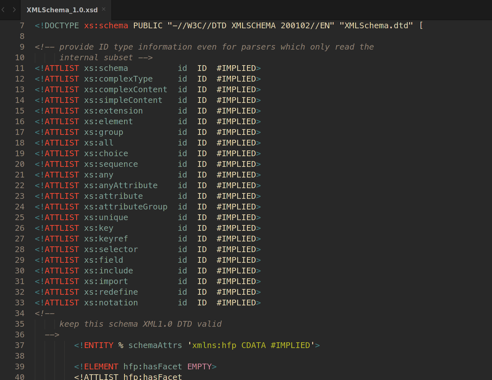

# XML DTD笔记

## 引入方式

1. <a href="#dtd_ref_in">内部DTD</a>
2. <a href="#dtd_ref_ext">外部DTD</a>
3. <a href="#dtd_ref_pub">公用DTD</a>


### <a id="dtd_ref_in">内部DTD</a>

基础语法:

```xml-dtd
<!DOCTYPE 根元素名[
        元素描述
    ]>
```


### <a id="dtd_ref_ext">外部DTD</a>

基础语法:

```xml-dtd
<!DOCTYPE 根元素名 SYSTEM "外部DTD的URI">
```


### <a id="dtd_ref_pub">公用DTD</a>

公用DTD是一种特殊的外部DTD。它是由某个权威机构制定，供特定行业或公众使用。

公用DTD通过**PUBLIC**关键字引入。

公用DTD与外部DTD区别:

1. **PUBLIC**关键字

2. 公用DTD多了个DTD标识名

   

基础语法:

```xml-dtd
<!DOCTYPE 根元素 PUBLIC "DTD标识名" "公用DTD的URI">
```

例子:




## DTD文档结构

* <a href="#dtd_declaration">DTD声明部分</a>
* <a href="#dtd_element">元素</a>
* <a href="#dtd_attlist">属性</a>
* <a href="#dtd_entity">实体</a>


#### <a id="dtd_declaration">DTD声明</a>

dtd的声明与XML声明语法相同

```xml
<?xml version="1.0" encoding="UTF-8"?>
```


---

### <a id="dtd_element">元素</a>

XML元素可以为空，可以为文本字符串，可以包含若干子元素，每个子元素又可包含若干子元素。

DTD是通过元素之间的父子关系，描述了整个文件的结构。

基础语法:

```xml-dtd
<!ELEMENT 元素名 元素类型描述>
```


---

### <a id="dtd_attlist">属性</a>

基础语法:

```xml-dtd
<!ATTLIST 属性所属元素 属性名 属性类型 [元素对属性的约束] [默认值]>
```


---

### <a id="dtd_entity">实体</a>

实体就是用一个字符串代替另一个字符串。有点像C语言中的宏。

作用：

* 代码复用
* 使用某些特殊符号
* 减少字符输入量


实体分类：

* <a href="#ent_common">普通实体</a>
* <a href="#ent_arg">参数实体</a>
* <a href="#ent_out">外部实体</a>
* <a href="#ent_out_arg">外部参数实体</a>


#### <a id="ent_common">普通实体</a>

实体定义:

```xml-dtd
<!ENTITY 实体名 "实体值">
```

引用实体:

```xml-dtd
&实体名
```


#### <a id="ent_arg">参数实体</a>

只能在DTD中使用的。

语法格式:

参数实体定义:

```xml-dtd
<!ENTITY % 实体名 "实体值">
```

参数实体定义，比普通实体多了个**%**

引用参数实体:

```xml-dtd
%实体名;
```

**注意**: 

1. 在引用参数实体时，必须**%**开始，以**;**结束。

2. 引用参数实体前，**必须**先定义参数实体，才能引用，顺序不能颠倒。


#### <a id="ent_out">外部实体</a>

外部实体的实体值不在定义实体时直接定义，而且是由URI所在的文件中定义

外部实体定义:

```xml-dtd
<!ENTITY 实体名 SYSTEM "实体值所有文件的URI">
```


外部实体中还有一种特例:**公用实体**

其语法与公用DTD类似，都使用**PUBLIC**关键字及**公用标识名**

语法格式如下:

```xml-dtd
<!ENTITY 实体名 PUBLIC "公用实体标识名" "实体值所有文件的URI">
```


#### <a id="ent_out_arg">外部参数实体</a>

外部实体同样也能定义参数实体

```xml-dtd
<!ENTITY % 实体名 SYSTEM|PUBLIC ["公用实体标识名"] "实体值所在文件的URI">
```

**SYSTEM**及**PUBLIC**用法与外部实体类似


