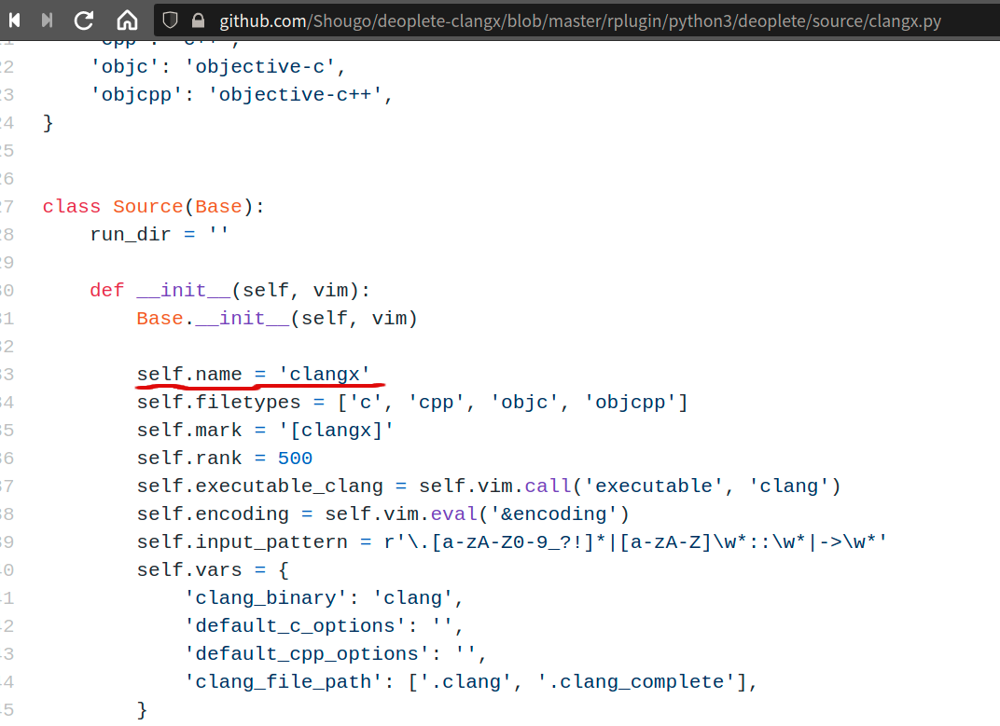
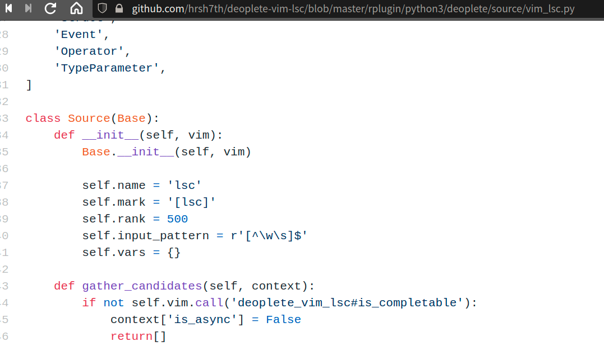

# LSP及补全相关

* [关于LSP](#about_lsp)

* [Vim LSP Client插件](#vp_lsp_client)
	* [vim-lsc](#vp_vim-lsc)
	* [vim-lsp](#vp_vim-lsp)
	* [LanguageClient-neovim](#vp_lcn)

* [Vim 补全插件](#vp_complete)
	* [neocomplete](#vp_complete_neocomplete)
	* [deoplete](#vp_complete_deoplete)
		* [使用vim-lsc为LSC](#vp_deoplete_lsc)
		* [使用vim-lsp为LSC](#vp_deoplete_lsp)
		* [使用LanguageClient](#vp_deoplete_lcn)
	* [Completor](#vp_complete_completor)
	* [ncm/ncm2](#vp_complete_ncm)
	* [asyncomplete](#vp_complete_asyncomplete)
	* [coc](#vp_complete_coc)
	* [easycomplete](#vp_complete_easycomplete)

## <span id="about_lsp">关于LSP</span>
官方定义:
>The Language Server Protocol (LSP) defines the protocol used between an editor or IDE and a language server that provides language features like auto complete, go to definition, find all references etc.

一种用于为编辑器或IDE提供，诸如自动补全、定义跳转、查找关联等语言功能的编程语言服务协议。

LSP相关网站:
* [LSP规范](https://microsoft.github.io/language-server-protocol/specifications/specification-current/) 
* [LSP官网](https://microsoft.github.io/language-server-protocol/) [](https://github.com/microsoft/language-server-protocol)
* [各家LSP实现列表](https://microsoft.github.io/language-server-protocol/implementors/servers/)

---

## <span id="lang_lsps">常用语言LSP</span>

从 LSP 官网给的[列表](https://microsoft.github.io/language-server-protocol/implementors/servers/)，能看到各种语言的 LSP 实现。 

### <span id="lang_lsps_ccpp">C/C++</span>

clangd
clangd 是 clang 的扩展工具（clang-tools-extra），新版本是在 LLVM 中,安装 LLVM 就有 clangd 了。

安装完可以执行以下命令，如果能出现版本信息就证明 clangd 能用了！
```sh
clangd --version
```

---

### <span id="lang_lsps_python">Python LSP</span>

python lsp 实现：


~~[微软的 python lsp](https://github.com/Microsoft/python-language-server) ：VSCode 中 python 提示、语法分析等功能，用的是就是这个 LSP。VSCode 中 [Python](https://marketplace.visualstudio.com/items?itemName=ms-python.python) [](https://github.com/Microsoft/vscode-python) 插件其实就是这个 LSP 的 Client。这个 LSP 一般是安装 VSCode Python 插件时，一起安装的。~~


[Pydev on VSCode ](https://www.pydev.org/vscode/index.html)： 这是 Pydev 针对 VSCode 的 python 插件。这个插件应该是既是Server 也是 Client。


之前两种 LSP 跟 插件耦合太明显，下面几款 LSP 能在各种编辑器用：

---

下面几款 Python LSP 名字都有点相近：

#### pyright

[pyright](https://github.com/microsoft/pyright) 是微软新推出的 LSP，上面那个要被微软废弃了！

#### python-language-server

[python-language-server](https://github.com/palantir/python-language-server) 这款 LSP 是基于 [jedi](https://github.com/davidhalter/jedi) 。 这款 LSP 需要 Python 版本是 **3.5+**。 这款 LSP 是 [vim-lsp](https://github.com/prabirshrestha/vim-lsp) 示例配置中 Python 的 LSP。 这款 LSP 依赖的 [jedi] 版本相对「保守」点。

python-language-server 安装：
```shell
pip install 'python-language-server[yapf]'
# 或者
pip install 'python-language-server[all]'
```
如果报 `'install_requires' must be a string or list of strings` 类似错误，请执行以下代码：
```shell
pip install -U setuptools
```


测试 python-language-server 是否安装成功：`pyls --help`。


#### jedi-language-server

[jedi-language-server](https://github.com/pappasam/jedi-language-server)  灵感源于上面那款。 这款 LSP 要求 Python 的版本是 **3.7+**。 这款 LSP 是比较新的，在 vim 下 使用效果挺不错的。

jedi-language-server 安装：
```shell
pip install -U jedi-language-server
```

#### python-langserver

~~[python-langserver](https://github.com/sourcegraph/python-langserver) 这个 LSP 已经停止维护了！~~

#### python-lsp-server

[python-lsp-server](https://github.com/python-lsp/python-lsp-server)  是一款基于 [jedi](https://github.com/davidhalter/jedi)，由 Spyder IDE 的团队在维护的 Python LSP。Spyder IDE 用的也是这个 LSP 实现。这个 LSP 是要求 Python 的版本是  **3.7+** 。

python-lsp-server 安装：
```shell
pip install "python-lsp-server[yapf]"
# 或者
pip install "python-lsp-server[all]"
```
安装出现 `'install_requires' must be a string or list of strings` 类似的错误，请执行以下代码：
```shell
pip install -U setuptools
```

测试是否安装成功：`pylsp -V`。


---


### <span id="lang_lsps_vue">Vue LSP</span>
	[VLS](https://www.npmjs.com/package/vls) [](https://github.com/vuejs/vetur/tree/master/server)
```shell
npm install vls -g
```

---

## <span id="vp_lsp_client">vim LSP Client插件</span>

LSP Language Server Protocol 为语言提供语言服务，有Server肯定就要有Client。
vim也需要一个Client去与LSP“对接”。这就是LSC--Language Server Client。
vim本身没有提供LSC(据说未来版本会逐步增加这块),所以得通过插件来实现。

LSC只是提供与LSP对接，并将LSP传来的语言服务获取补全数据。
而补全数据需要“展示”出来，如果不装补全插件，那这些数据是传给vim，使用vim本身的补全来将数据“展示”。

常用LSC插件

### <span id="vp_vim-lsc">vim-lsc</span>

[vim-lsc](https://github.com/natebosch/vim-lsc)

```vim
	" 开启lsc	
	let g:lsc_enable_autocomplete  = v:true
	" 
	set completeopt=menu,menuone,noinsert,noselect

```

配置LSP,为各语言指定使用LSP。
如下示例:c和c++用的是clangd，python用的是pyls(python-language-server)。

```vim
	let g:lsc_server_commands = {
	 \ 'c': {
	 \    'command': 'clangd --background-index',
	 \	  'suppress_stderr': v:true
	 \	},
	 \ 'cpp':{
	 \	'command':'clangd --background-index',
	 \  'suppress_stderr': v:true
	 \ },
	 \ 'python':{
	 \  'command':'pyls'
	 \ },
	 \ rust':{
     \  'command':'rls'
     \ }
	 \}	

```
**command**指定是LSP名称,就是在终端中能调出LSP那个名称。

---

### <span id="vp_vim-lsp">vim-lsp</span>
[vim-lsp](https://github.com/prabirshrestha/vim-lsp)


```vim
	
	" 关闭lsp的语法诊断
	let g:lsp_diagnostics_enabled = 0

	" 设置各语言LSP
	if executable('clangd')
		au User lsp_setup call lsp#register_server({
			\ 'name': 'clangd',
			\ 'cmd': {server_info->['clangd', '-background-index']},
			\ 'whitelist': ['c', 'cpp', 'objc', 'objcpp'],
		\ })
	endif
	
	if (executable('pyls'))
		au User lsp_setup call lsp#register_server({
		\ 'name': 'lsp-pyls',
		\ 'cmd': {server_info->['pyls']},
		\ 'allowlist': ['python']
		\ })
	endif

```


---

### <span id="vp_lcn">LanguageClient-neovim</span>

[LanguageClient-neovim](https://github.com/autozimu/LanguageClient-neovim)是用Rust语言写的一个LSC插件。
这个LSC可以为[deoplete](#vp_complete_deoplete)及[ncm2](#vp_complete_ncm)补全框架提供补全数据源。
LanguageClient为补全框架提供源的名称是**LanguageClient**。

安装:
```Vim
	Plug 'autozimu/LanguageClient-neovim', {
	\ 'branch': 'next',
	\ 'do': 'bash install.sh',
	\ }
	
```

配置:
```vim
	" 为各语言指定LSP	
	let g:LanguageClient_serverCommands = {
	\ 'c':['clangd'],
	\ 'cpp':['clangd'],
	\ 'rust': ['rls'],
	\ 'python': ['pyls'],
	\ 'ruby': ['solargraph', 'stdio'],
	\ }


```

---

## <span id="vp_complete">Vim 补全插件</span>


### <span id="vp_complete_neocomplete">neocomplete.vim<span> 

[neocomplete](https://github.com/Shougo/neocomplete.vim)

neocomplete 不兼容vim8.2。而已没再来更新新功能，只有修bug。

这插件必须是vim7.3.855以上 vim8以下的版本，而且是拥有lua特性的版本使用。

这个插件现在基本可以忽略。


### <span id="vp_complete_deoplete">deoplete</span>
[deoplete](https://github.com/Shougo/deoplete.nvim) 是 [neocomplete](#vp_complete_neocomplete) 的改进版，适配vim8+及neovim。deoplete 内置了路径补全。

虽然叫补全框架，但实际框架需要与Language Server Client插件通信，拿到补全数据，才能将数据展示出来。
所以这就涉及到也LSC插件的配置。有的补全框架，自己给了部分语言的LSC实现，有的是通过支持第三方LSC插件来实现。deoplete既有自己的LSC，也支持多种LSC插件。

deoplete 安装:
deoplete安装有两个前置条件:
1. vim8或者neovim 而且是拥有python3特性
  在vim中用以下命令检测当前vim是否拥有python3特性
  ```vim
		:echo has("python3")
  ```
2. pynvim
 安装pynvim
 ```sh
	pip3 install pynvim
 ```
如果以上两个条件满足，就可以安装deoplete插件:
```vim
	if has('nvim')
	  Plug 'Shougo/deoplete.nvim', { 'do': ':UpdateRemotePlugins' }
	else
	  Plug 'Shougo/deoplete.nvim'
	  Plug 'roxma/nvim-yarp'
	  Plug 'roxma/vim-hug-neovim-rpc'
	endif
```
deoplete 配置:
```vim
	" 启动deoplete
	let g:deoplete#enable_at_startup = 1
	" 补全延迟，默认是20毫秒
	let g:auto_complete_delay=10


```
deoplete 快捷捷映射配置:
```vim
	" 补全菜单选择映射为用Tab键(默认是Ctrl-n和Ctrl-p)
	inoremap <expr> <Tab> pumvisible() ? "\<C-n>" : "\<Tab>"
	inoremap <expr> <S-Tab> pumvisible() ? "\<C-p>" : "\<S-Tab>"
	inoremap <expr> <cr> pumvisible() ? "\<C-y>" : "\<cr>"	

```
最关键一步到了，就是配置补全源。
补全源，大体有两个，一个来自snippet，另一个就是来自LSC接口/插件的。

snippet 主流在两个 [snipmate](https://github.com/garbas/vim-snipmate) 和 [ultisnips](http://github.com/SirVer/ultisnips)。 当然 deoplete 自己也有一个 snippet 引擎：[neosnippet](https://github.com/Shougo/neosnippet.vim)。无论哪个 snippet 引擎，其 snippet 「仓库」大概都倾向使用 [vim-snippets](https://github.com/honza/vim-snippets)。


deoplete 与 snipmate 整合，可以使用 [deoplete-snipmate](https://github.com/dcampos/deoplete-snipmate) 这个插件作为连接插件。

deoplete 与 ultisnips 整合时，需要注意的，是 ultisnip 的 expand 代码的快捷键跟 deoplete 选择候选项的快捷键一样为 `Tab` 键，这样就会产生冲突，使得 候选项虽然列出了，但没法使用 `Tab` 键选择，所以最好的方案就是将 ultisnips 的 expand 代码的快捷键设成其他，这样侯选项就能选了。如以下示例，就将 ultisnips expand 代码的快捷键设为 `Ctrl+e`：
```vimscript
let g:UltiSnipsExpandTrigger = "<c-e>"
```


Shougo大神为deoplete 提供了一些语言的LSC，比如c/c++的[clangx](https://github.com/Shougo/deoplete-clangx)。
这个“亲儿子”级的LSC,是与deoplete“配合”最好的LSC，基本不用怎么配置，开箱既用。
下面以clangx为例:
1. 安装clangd clangx插件是要调clangd，所以再使用这些LSC,得把**server**先装好。
2. 安装clangx插件
```
	PLug 'Shougo/deoplete-clangx'

```
3. 为deoplete配置补全源

deoplete也给出了source的支持列表:
[补全源](https://github.com/Shougo/deoplete.nvim/wiki/Completion-Sources)
那些deoplete开头的，都是“亲儿子”。

中括号中配的是LSC的名称，这名称哪里看得到，答案源码，如之前的clangx:


如果不用deoplete“推荐”的补全源，用其他补全源如vim-lsc或vim-lsp,就得为对deoplete指定补全源。

#### <span id="vp_deoplete_lsc">使用[vim-lsc](#vp_vim-lsc)为LSC</span>
要连接多语言LSC得通过再加个“管道”，即装个与这个LSC适配的“适配器”插件。
如“适配”deoplete与vim-lsc，就需要[deoplete-vim-lsc](https://github.com/hrsh7th/deoplete-vim-lsc)。

deoplete-vim-lsc的源码:

可以看到vim-lsc的名称是**lsc**,所以上面deoplete配补全源为什么用**lsc**
与clangx这种“亲儿子”的LSC不同，使用适配器适配的多语言LSC，在deoplete配置源时，得指定把LSC的name值--这是LSC唯一标识,通过这个名称的配置，补全框架deoplete就与这个LSC整合在一起了。

使用vim-lsc时，为deoplete配补全源:
```vim
	
	" lsc就是vim-lsc的唯一标识
	" min_pattern_length 是设置最少多少个字符触发补全菜单 
	" vim-lsc默认是2个字符触发补全
	call deoplete#custom#source('lsc',
            \ 'min_pattern_length',
            \ 1)

	" 为各语言指定LSC
	" 中括号中的lsc就是vim-lsc的唯一标识
	let g:deoplete#custom#option={
		\'sources': {
		\ '_': ['buffer'],
		\ 'c': ['lsc'],
		\ 'cpp': ['lsc'],
		\ 'python': ['lsc'],
		\ 'rust': ['lsc']
		\},
	\ }


```
而vim-lsc那里也需要配置:
[vim-lsc配置](#vp_vim-lsc)

#### <span id="vp_deoplete_lsp">使用[vim-lsp](#vp_vim-lsp)为LSC</span>
如果是 deoplete 使用的是 vim-lsp，也是类似。需要装 [vim-lsp](#vp_vim-lsp)和[deoplete-vim-lsp](https://github.com/lighttiger2505/deoplete-vim-lsp)
**vim-lsp** 配置 LSC，可查看以上章节： [vim-lsp](#vp_vim-lsp)

deoplete 使用 vim-lsp 为补全源的配置如下：
```vim
	
	" 设置最少多少个字符触发补全菜单
	" vim-lsp 默认是2个字符
	call deoplete#custom#source('lsp',
            \ 'min_pattern_length',
            \ 1)

	let g:deoplete#custom#option={
		\'sources': {
		\ 'c': ['lsp'],
		\ 'cpp': ['lsp'],
		\ 'python': ['lsp'],
		\ 'rust': ['lsp'],
		\},
		\ 'smart_case': v:true
	\ }


```
跟[vim-lsc](#vp_vim-lsc)几乎一样，就是lsc的名称换成了**lsp**


#### <span id="vp_deoplete_lcn">使用[LanguageClient-neovim为LSC](#vp_lcn)为LSC</span>

LanguageClient作为deoplete的LSC跟使用[vim-lsc](#)与[vim-lsp](#)类似。
给deoplete的source 名称为**LanguageClient**。
配置如下：
```vim
	
	" 设置最少多少个字符触发补全
	" LanguageClient默认是1，就是这段代码不配就是一个字符就弹出初具一菜单
	" call deoplete#custom#source('LanguageClient',
	"        \ 'min_pattern_length',
	"        \ 2)

	let g:deoplete#custom#option={
		\'sources': {
		\ '_': ['buffer'],
		\ 'c': ['LanguageClient'],
		\ 'cpp': ['LanguageClient'],
		\ 'python': ['LanguageClient'],
		\ 'rugy': ['LanguageClient'],
		\ 'rust': ['LanguageClient']
		\}
	\ }


```

#### deoplete 相关插件

deoplete 提供的特定语言LSC插件:
* [deoplete-go](https://github.com/deoplete-plugins/deoplete-go)
* [deoplete-jedi](https://github.com/deoplete-plugins/deoplete-jedi)
* [deoplete-julia](https://github.com/JuliaEditorSupport/deoplete-julia)
* [deoplete-zsh](https://github.com/deoplete-plugins/deoplete-zsh)
* [neco-vim](https://github.com/Shougo/neco-vim)
* [deoplete-go](https://github.com/deoplete-plugins/deoplete-go)

deoplete 多语言LSC插件
* [deoplete-vim-lsp](https://github.com/lighttiger2505/deoplete-vim-lsp)
* [deoplete-vim-lsc](https://github.com/hrsh7th/deoplete-vim-lsc)
* [LanguageClient-neovim](https://github.com/autozimu/LanguageClient-neovim)
* []()
* []()

deoplete 其他“有趣”的补全源插件:
* [dictionary](https://github.com/deoplete-plugins/deoplete-dictionary)
* [deoplete-tag](https://github.com/deoplete-plugins/deoplete-tag)


---

### <span id="vp_complete_completor">Completor</span>
[Completor](https://github.com/maralla/completor.vim)是用Python写的异步补全框架。

安装:
```vim
	Plug 'maralla/completor.vim'
```

---

### <span id="vp_complete_ddc">ddc</span>

[ddc](https://github.com/Shougo/ddc.vim) 是 [deoplete](https://github.com/Shougo/deoplete.nvim) 的作者 **Shougo** 大神新的 vim 的补全插件。

这插件要求 vim 的版本是 **8.2.0662+**，可见这插件是够新的（deoplete 需要的 vim 版本是 8.1）。


---

### <span id="vp_complete_ncm">ncm/ncm2</span>
[ncm2](https://github.com/ncm2/ncm2)

国人写的补全框架。只支持[vim-lsp](#vp_vim-lsp)和[LanguageClient](#vp_lcn)两个LSC。

keymap映射极度恶心,垃圾！


```vimscript

" nvim-yarp 需 要 三 个 条 件
 " 1. vim-hug-neovim-rpc
 " 2. 系 统 装 有 python
 " 3. pynvim (pip install pynvim)
 Plug 'roxma/vim-hug-neovim-rpc'
 Plug 'roxma/nvim-yarp'

```

ncm2 配置：
```vimscript
" 缓存
autocmd BufEnter * call ncm2#enable_for_buffer()
" 补全模式
set completeopt=noinsert,menuone,noselect

" 触发补全字符数
let ncm2#complete_length = [[1, 1]]

" 补全菜单弹出延迟
let ncm2#popup_delay = 8

set shortmess+=c

```

ncm 快捷键配置：
```vimscript
	" 使用tab键来切换候选项
	inoremap <expr> <Tab> pumvisible() ? "\<C-n>" : "\<Tab>"
	inoremap <expr> <S-Tab> pumvisible() ? "\<C-p>" : "\<S-Tab>"

	inoremap <expr> <cr> pumvisible() ? "\<C-y>":"\<cr>" 
```

ncm2 有两个好用功能插件：

[ncm2-path](https://github.com/ncm2/ncm2-path) 这个路径补全功能插件太爽了，一定得加上！

[ncm2-bufword](https://github.com/ncm2/ncm2-bufword)  这是能把输入过的内容当成缓存，变成补全源加入补全候选项中。

```vimscript
	Plug 'ncm2/ncm2-bufword'
	Plug 'ncm2/ncm2-path'
```


	ncm 还对 主流 snippets 插件做了[接口插件](https://github.com/topics/ncm2-snippet)：

* [ncm2-ultisnips](https://github.com/ncm2/ncm2-ultisnips)
* [ncm2-snipmate](https://github.com/ncm2/ncm2-snipmate)
* [ncm2-neosnippet](https://github.com/ncm2/ncm2-neosnippet)


#### ncm 与 lsp 整合

ncm/ncm2 只是补全框架，而补全数据得从外部而来。如上面的与snippets 插件整合，snipmate 或 ultisnips 插件可以看作是 ncm 的补全的「数据源」之一。而补全框架主要的数据来源应该是 lsp，所以 ncm 与 lsp 整合就是这个补全框架能否为需求所定的编程语言提供补全功能的关键所在。


##### 与 vim-lsp 整合

[ncm2-vim-lsp](https://github.com/ncm2/ncm2-vim-lsp)  这个插件是用来整合[vim-lsp](https://github.com/prabirshrestha/vim-lsp) 的。
> vim-lsp 这个插件虽然叫「lsp」，但实质它是个「lsc」（Language Sever Client），它只是用于编辑器与外部的「lsp」服务链接的「客户端」接口，它本身不直接提供语言服务数据。


---


### <span id="vp_complete_asyncomplete">asyncomplete</span>
[asyncomplete](https://github.com/prabirshrestha/asyncomplete.vim)

asyncomplete 这个补全框架是完全用 vimscript 写的，所以不需要像 deoplete ncm2 依赖 Python,coc 依赖 nodejs。
	asyncomplete 这补全框架源可以用自己那堆针对某语言的 LSC，也可以用如 [vim-lsp](https://github.com/prabirshrestha/vim-lsp) 这样多语言的 LSC。
	多语言LSC插件，官方推荐是 [vim-lsp](https://github.com/prabirshrestha/vim-lsp),为此官方还写了个“适配器”：[asyncomplete-lsp](https://github.com/prabirshrestha/asyncomplete-lsp.vim)。


asyncomplete 常用的功能插件：

* [asyncomplete-file](https://github.com/prabirshrestha/asyncomplete-file.vim) 路径补全的，这是必加的。
* [asyncomplete-buffer](https://github.com/prabirshrestha/asyncomplete-buffer.vim) 把输入过的内容也以 buffer 加入补全数据源。 

* [asyncomplete-ultisnips](https://github.com/prabirshrestha/asyncomplete-ultisnips.vim) 跟 ultisnips 插件整合的插件。


---

### <span id="vp_complete_coc">coc </span>


---

### <span id="vp_complete_easycomplete">easycomplete</span>

[easycomplete](https://github.com/jayli/vim-easycomplete) 是一个纯vimscript补全框架。
此框架不像deoplete需要依赖python，也不像coc需要依赖nodejs。
此框架专注于补全，不像coc妄图「出圈」,变成一个插件管理框架,coc的「野心」太大，而且依赖NodeJS,个人非常不喜--正如此框架作者介绍中所说的“对于非前端工程师来说是非必要依赖”。

安装：
```vim
	Plug 'jayli/vim-easycomplete'
```

snip方面，依赖[ultisnips](https://github.com/SirVer/ultisnips)这个snip引擎及[vim-snippets](https://github.com/honza/vim-snippets)这个snip库。

ultisnips外部依赖Python,这有点违反easycomplete这个框架的「极简」精神：“纯 VimL 实现”。
不过应该也是没办法，很多补全框架对snipmate的支持也不太好，估计是这个snip插件虽然是线vimscript写的，得太「老」了。所以现在snip引擎是ultisnips最为流行。不过easycomplete解决了其他补全框架与ultisnips整合时，常出现的快捷键问题，即tab补全失效(一般补全框架都倾向使用tab去替代Ctrl-n/Ctrl-p这组快捷键，但ultisnips也是默认使用tab进行触发，所以就容易冲突，一般是将ultisnips触发快捷键另设,如设成Ctrl-j,才能解决这个整合小问题)

这框架可以说是开籍即用，几乎零配置。只要你系统装了相应的LSP,如pyls,就能直接使用的了--框架应该是内置了相应的LSC对与系统的LSP「对接」。

此框架内置了路径、文件补全，非常方便。
此框架应该是补全框架中的一股「清流」。


