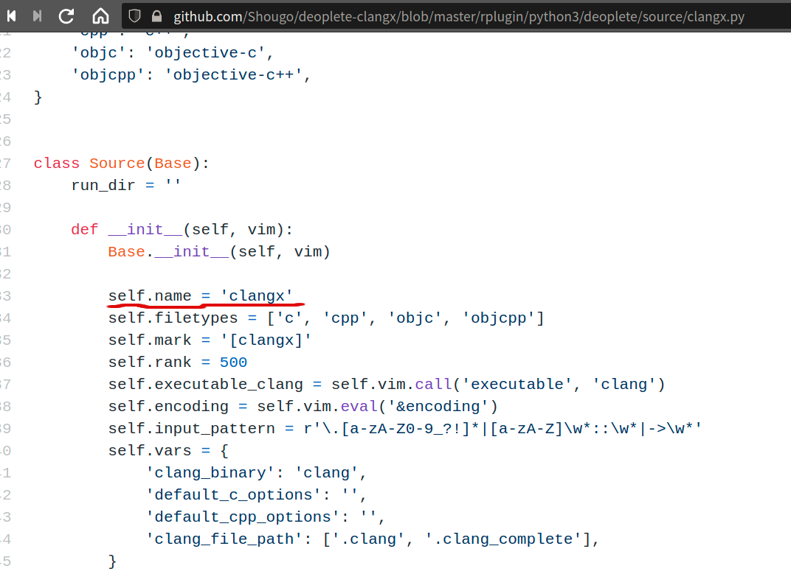

# LSP 及补全相关

---

## 目录

* [关于LSP](#about_lsp)

* [Vim LSP Client插件](#vp_lsp_client)
	* [vim-lsc](#vp_lsp_client_vim-lsc)
	* [vim-lsp](#vp_lsp_client_vim-lsp)
	* [LanguageClient-neovim](#vp_lsp_client_lcn)
	* [Yegappan](#vp_lsp_client_yegappan)
	* [vim-lsp-client](#vp_lsp_client_vimlspclient)

* [Vim 补全插件](#vp_complete)
	* [vim-auto-popmenu](#vp_complete_vim_auto_popmenu)
	* [neocomplete](#vp_complete_neocomplete)
	* [deoplete](#vp_complete_deoplete)
		* [使用vim-lsc为LSC](#vp_deoplete_lsc)
		* [使用vim-lsp为LSC](#vp_deoplete_lsp)
		* [使用LanguageClient](#vp_deoplete_lcn)
	* [Completor](#vp_complete_completor)
	* [ncm/ncm2](#vp_complete_ncm)
	* [asyncomplete](#vp_complete_asyncomplete)
	* [coc](#vp_complete_coc)
	* [easycomplete](#vp_complete_easycomplete)
	* [vimcomplete](#vp_complete_vimcomplete)
* [相关链接](#about_links)
* [相关笔记](#about_notes)
---

## <span id="about_lsp">关于 LSP</span>

[LSP笔记](../Protocols/LSP_Note.md)

---

## <span id="vp_lsp_client">vim LSP Client 插件</span>

LSP Language Server Protocol 为语言提供语言服务，有 Server 肯定就要有 Client。

vim 也需要一个 Client 去与 LSP「对接」。这就是 LSC--Language Server Client。

vim 本身没有提供 LSC(据说未来版本会逐步增加这块),所以得通过插件来实现。

LSC 只是提供与 LSP 对接，并将 LSP 传来的语言服务获取补全数据。
而补全数据需要「展示」出来，如果不装补全插件，那这些数据是传给 vim，使用 vim 本身的补全来将数据「展示」。

常用 LSC 插件

### <span id="vp_lsp_client_vim-lsc">vim-lsc</span>

[vim-lsc](https://github.com/natebosch/vim-lsc)

```vim
	" 开启lsc	
	let g:lsc_enable_autocomplete  = v:true
	" 
	set completeopt=menu,menuone,noinsert,noselect

```

配置 LSP,为各语言指定使用 LSP。
如下示例:c 和 c++ 用的是 clangd，python 用的是 pyls(python-language-server)。

```vim
	let g:lsc_server_commands = {
	 \ 'c': {},
	 \ 'cpp':{
	 \	'command':'clangd --background-index',
	 \  'suppress_stderr': v:true
	 \ },
	 \ 'python':{
	 \  'command':'pyls'
	 \ },
	 \ rust':{
     \  'command':'rls'
     \ }
	 \}	

```
**command**指定是 LSP 名称,就是在终端中能调出 LSP 那个名称。

---

### <span id="vp_lsp_client_vim-lsp">vim-lsp</span>

[vim-lsp](https://github.com/prabirshrestha/vim-lsp)

```vim
	
	" 关闭lsp的语法诊断
	let g:lsp_diagnostics_enabled = 0

	" 设置各语言LSP
	if executable('clangd')
		au User lsp_setup call lsp#register_server({
			\ 'name': 'clangd',
			\ 'cmd': {server_info->['clangd', '-background-index']},
			\ 'whitelist': ['c', 'cpp', 'objc', 'objcpp'],
		\ })
	endif
	
	if (executable('pyls'))
		au User lsp_setup call lsp#register_server({
		\ 'name': 'lsp-pyls',
		\ 'cmd': {server_info->['pyls']},
		\ 'allowlist': ['python']
		\ })
	endif

```

[SpaceVim](vim及neovim配置.md#SpaceVim) 默认用的就是 vim-lsp。

vim-lsp 的一堆命令，都是以 `Lsp` 打头的：

* `LspStatus`：这个非常常用，可以查看 LSP 运行状态，看配置是否成功。

#### <span id="vp_vim-lsp_vim-lsp-neosnippet">vim-lsp-neosnippet</span>

[vim-lsp-neosnippet](https://github.com/thomasfaingnaert/vim-lsp-neosnippet) 是一个将 [vim-lsp](#vim-lsp) 整合 [Neosnippet](vim_plugin.md#plugin_snippets_neosnippet) 的插件。

#### <span id="vp_vim-lsp-ultisnips">vim-lsp-ultisnips</span>

[vim-lsp-ultisnips](https://github.com/thomasfaingnaert/vim-lsp-ultisnips) 是一个将 [vim-lsp](#vim-lsp) 整合 [Ultisnips](vim_plugin.md#Ultisnips) 的插件。

---

### <span id="vp_lsp_client_lcn">LanguageClient-neovim</span>

[LanguageClient-neovim](https://github.com/autozimu/LanguageClient-neovim) 是用 Rust 语言写的一个 LSC 插件。

这个 LSC 可以为 [deoplete](#vp_complete_deoplete) 及 [ncm2](#vp_complete_ncm) 补全框架提供补全数据源。

LanguageClient 为补全框架提供源的名称是 `LanguageClient`。

安装：

```Vim
	Plug 'autozimu/LanguageClient-neovim', {
	\ 'branch': 'next',
	\ 'do': 'bash install.sh',
	\ }
	
```

配置：

```vim
	" 为各语言指定LSP	
	let g:LanguageClient_serverCommands = {
	\ 'c':['clangd'],
	\ 'cpp':['clangd'],
	\ 'rust': ['rls'],
	\ 'python': ['pyls'],
	\ 'ruby': ['solargraph', 'stdio'],
	\ }


```

---

### <span id="vp_lsp_client_yegappan">Yegappan</span>

[GitHub - yegappan](https://github.com/yegappan/lsp) 这个 LSC 只支持 [Vimscript 9.0](Vimscript9_Note.md) 。

---

### <span id="vp_lsp_client_vimlspclient">vim-lsp-client</span>

[vim-lspclient](https://github.com/creativenull/vim-lspclient) 是使用 [Vimscript 9.0](Vimscript9_Note.md) 写的 LSC。

```vim
Plug 'creativenull/vim-lspclient'
```

---

## <span id="vp_complete">Vim 补全插件</span>

 #vim-complete

### <span id="vp_complete_vim_auto_popmenu">vim-auto-popmenu</span>

[vim-auto-popmenu](https://github.com/skywind3000/vim-auto-popmenu) 这个插件实现了基本的补全功能。

这个插件用到的数据源来自 buffer, dict, tags。可以说这个插件是为了那些不需要装 [LSP](#about_lsp)，又想有基础的补全功能的场景使用而出的极轻量补全插件。

这插件作者还非常「贴心」地另外制作了一个词典插件：[GitHub - skywind3000/vim-dict: 没办法，被逼的，重新整理一个词典补全的数据库](https://github.com/skywind3000/vim-dict)，以弥补补全源数据过于「朴素」。这词典包括了 c、c++、java、python、go、javascript 等语言常用的词汇。

这个插件，在选定候选项，回车确认，默认情况会发生不但确认了而且自动换行的行为；这明显不是大部分人所需要的（这种需求，估计是写 [Python](../Python/Python_Note.md) 的），所以为了禁止确认后自动换行的行为发生，可以在设置里添加以下代码：
```vim
" 1：确认不换行
" 0：确认并换行
let g:apc_cr_confirm = 1
```
> [!quote] 换行的 issue
> [let \<CR\> confirm select other than create new line · Issue #4 · skywind3000/vim-auto-popmenu · GitHub](https://github.com/skywind3000/vim-auto-popmenu/issues/4) 

---

### <span id="vp_complete_neocomplete">neocomplete.vim</span> 

[neocomplete](https://github.com/Shougo/neocomplete.vim)

neocomplete 不兼容 vim8.2。而已没再来更新新功能，只有修 bug。

这插件必须是 vim7.3.855 以上 vim8 以下的版本，而且是拥有 lua 特性的版本使用。

这个插件现在基本可以忽略。

---

### <span id="vp_complete_deoplete">deoplete</span>

[deoplete](https://github.com/Shougo/deoplete.nvim) 是 [neocomplete](#vp_complete_neocomplete) 的改进版，适配 vim8+ 及 neovim。deoplete 内置了路径补全。

虽然叫补全框架，但实际框架需要与 Language Server Client 插件通信，拿到补全数据，才能将数据展示出来。
所以这就涉及到也 LSC 插件的配置。有的补全框架，自己给了部分语言的 LSC 实现，有的是通过支持第三方 LSC 插件来实现。deoplete 既有自己的 LSC，也支持多种 LSC 插件。

#### <span id="vp_complete_deoplete_install">deoplete 安装</span>

deoplete 安装有两个前置条件:

1. vim8 或者 neovim 而且是拥有 python3 特性
  在 vim 中用以下命令检测当前 vim 是否拥有 python3 特性
  ```vim
		:echo has("python3")
  ```
2. pynvim
```shell
pip3 install pynvim
```
> [!tip] pynvim
> 如果没装 pynvim，会引发 `pythonx import [pynvim|neovim]command to work` 的错误提示。

如果以上两个条件满足，就可以安装 deoplete 插件：
```vim
	if has('nvim')
	  Plug 'Shougo/deoplete.nvim', { 'do': ':UpdateRemotePlugins' }
	else
	  Plug 'Shougo/deoplete.nvim'
	  Plug 'roxma/nvim-yarp'
	  Plug 'roxma/vim-hug-neovim-rpc'
	endif
```

deoplete 配置:
```vim
	" 启动deoplete
	let g:deoplete#enable_at_startup = 1
	" 补全延迟，默认是20毫秒
	let g:auto_complete_delay=10


```

deoplete 快捷捷映射配置:
```vim
	" 补全菜单选择映射为用Tab键(默认是Ctrl-n和Ctrl-p)
	inoremap <expr> <Tab> pumvisible() ? "\<C-n>" : "\<Tab>"
	inoremap <expr> <S-Tab> pumvisible() ? "\<C-p>" : "\<S-Tab>"
	inoremap <expr> <cr> pumvisible() ? "\<C-y>" : "\<cr>"	

```

最关键一步到了，就是配置补全源。
补全源，大体有两个，一个来自 snippet，另一个就是来自 LSC 接口/插件的。

snippet 主流在两个 [snipmate](https://github.com/garbas/vim-snipmate) 和 [ultisnips](http://github.com/SirVer/ultisnips)。 当然 deoplete 自己也有一个 snippet 引擎：[neosnippet](https://github.com/Shougo/neosnippet.vim)。无论哪个 snippet 引擎，其 snippet 「仓库」大概都倾向使用 [vim-snippets](https://github.com/honza/vim-snippets)。

deoplete 与 snipmate 整合，可以使用 [deoplete-snipmate](https://github.com/dcampos/deoplete-snipmate) 这个插件作为连接插件。

deoplete 与 ultisnips 整合时，需要注意的，是 ultisnip 的 expand 代码的快捷键跟 deoplete 选择候选项的快捷键一样为 `Tab` 键，这样就会产生冲突，使得 候选项虽然列出了，但没法使用 `Tab` 键选择，所以最好的方案就是将 ultisnips 的 expand 代码的快捷键设成其他，这样侯选项就能选了。如以下示例，就将 ultisnips expand 代码的快捷键设为 `Ctrl+e`：
```vimscript
let g:UltiSnipsExpandTrigger = "<c-e>"
```

Shougo 大神为 deoplete 提供了一些语言的 LSC，比如 c/c++ 的 [clangx](https://github.com/Shougo/deoplete-clangx)。
这个“亲儿子”级的 LSC,是与 deoplete“配合”最好的 LSC，基本不用怎么配置，开箱既用。
下面以 clangx 为例:
1. 安装 clangd clangx 插件是要调 clangd，所以再使用这些 LSC,得把**server**先装好。
2. 安装 clangx 插件
```vim
	PLug 'Shougo/deoplete-clangx'
```
3. 为 deoplete 配置补全源

deoplete 也给出了 source 的支持列表:
[补全源](https://github.com/Shougo/deoplete.nvim/wiki/Completion-Sources)
那些 deoplete 开头的，都是“亲儿子”。

中括号中配的是 LSC 的名称，这名称哪里看得到，答案源码，如之前的 clangx:


如果不用 deoplete“推荐”的补全源，用其他补全源如 vim-lsc 或 vim-lsp,就得为对 deoplete 指定补全源。

#### <span id="vp_deoplete_lsc">使用 [vim-lsc](#vp_lsp_client_vim-lsc) 为 LSC</span>

要连接多语言 LSC 得通过再加个“管道”，即装个与这个 LSC 适配的“适配器”插件。
如“适配”deoplete 与 vim-lsc，就需要 [deoplete-vim-lsc](https://github.com/hrsh7th/deoplete-vim-lsc)。

deoplete-vim-lsc 的源码:

可以看到 vim-lsc 的名称是**lsc**,所以上面 deoplete 配补全源为什么用**lsc**
与 clangx 这种“亲儿子”的 LSC 不同，使用适配器适配的多语言 LSC，在 deoplete 配置源时，得指定把 LSC 的 name 值 -- 这是 LSC 唯一标识,通过这个名称的配置，补全框架 deoplete 就与这个 LSC 整合在一起了。

使用 vim-lsc 时，为 deoplete 配补全源：

```vim
	
	" lsc就是vim-lsc的唯一标识
	" min_pattern_length 是设置最少多少个字符触发补全菜单 
	" vim-lsc默认是2个字符触发补全
	call deoplete#custom#source('lsc',
            \ 'min_pattern_length',
            \ 1)

	" 为各语言指定LSC
	" 中括号中的lsc就是vim-lsc的唯一标识
	let g:deoplete#custom#option={
		\'sources': {
		\ '_': ['buffer'],
		\ 'c': ['lsc'],
		\ 'cpp': ['lsc'],
		\ 'python': ['lsc'],
		\ 'rust': ['lsc']
		\},
	\ }


```
而 vim-lsc 那里也需要配置:
[vim-lsc配置](#vp_vim-lsc)

#### <span id="vp_deoplete_lsp">使用 [vim-lsp](#vp_lsp_client_vim-lsp) 为 LSC</span>

如果是 deoplete 使用的是 vim-lsp，也是类似。需要装 [vim-lsp](#vp_vim-lsp) 和 [deoplete-vim-lsp](https://github.com/lighttiger2505/deoplete-vim-lsp)
**vim-lsp** 配置 LSC，可查看以上章节： [vim-lsp](#vp_vim-lsp)

deoplete 使用 vim-lsp 为补全源的配置如下：

```vim
	
	" 设置最少多少个字符触发补全菜单
	" vim-lsp 默认是2个字符
	call deoplete#custom#source('lsp',
            \ 'min_pattern_length',
            \ 1)

	let g:deoplete#custom#option={
		\'sources': {
		\ 'c': ['lsp'],
		\ 'cpp': ['lsp'],
		\ 'python': ['lsp'],
		\ 'rust': ['lsp'],
		\},
		\ 'smart_case': v:true
	\ }


```

跟 [vim-lsc](#vp_vim-lsc) 几乎一样，就是 lsc 的名称换成了**lsp**。

#### <span id="vp_deoplete_lcn">使用 [LanguageClient-neovim为LSC](#vp_lsp_client_lcn) 为 LSC</span>

[LanguageClient](#vp_lcn) 作为 deoplete 的 LSC 跟使用 [vim-lsc](#vp_vim-lsc) 与 [vim-lsp](#vp_vim-lsp) 类似。
给 deoplete 的 source 名称为**LanguageClient**。

配置如下：

```vim
	
	" 设置最少多少个字符触发补全
	" LanguageClient默认是1，就是这段代码不配就是一个字符就弹出初具一菜单
	" call deoplete#custom#source('LanguageClient',
	"        \ 'min_pattern_length',
	"        \ 2)

	let g:deoplete#custom#option={
		\'sources': {
		\ '_': ['buffer'],
		\ 'c': ['LanguageClient'],
		\ 'cpp': ['LanguageClient'],
		\ 'python': ['LanguageClient'],
		\ 'rugy': ['LanguageClient'],
		\ 'rust': ['LanguageClient']
		\}
	\ }


```

#### deoplete 相关插件

deoplete 提供的特定语言 LSC 插件：

* [deoplete-go](https://github.com/deoplete-plugins/deoplete-go)
* [deoplete-jedi](https://github.com/deoplete-plugins/deoplete-jedi)
* [deoplete-julia](https://github.com/JuliaEditorSupport/deoplete-julia)
* [deoplete-zsh](https://github.com/deoplete-plugins/deoplete-zsh)
* [neco-vim](https://github.com/Shougo/neco-vim)
* [deoplete-go](https://github.com/deoplete-plugins/deoplete-go)

deoplete 多语言 LSC 插件：

* [deoplete-vim-lsp](https://github.com/lighttiger2505/deoplete-vim-lsp)
* [deoplete-vim-lsc](https://github.com/hrsh7th/deoplete-vim-lsc)
* [LanguageClient-neovim](https://github.com/autozimu/LanguageClient-neovim)

deoplete 其他“有趣”的补全源插件：

* [dictionary](https://github.com/deoplete-plugins/deoplete-dictionary)
* [deoplete-tag](https://github.com/deoplete-plugins/deoplete-tag)

---

### <span id="vp_complete_completor">Completor</span>

[Completor](https://github.com/maralla/completor.vim) 是用 Python 写的异步补全框架。**有点愚蠢的插件**，不建议使用。

这插件内置了路径补全功能。

这个补全插件支持 [Ultisnips](vim_plugin.md#Ultisnips) and [Neosnippet](vim_plugin.md#Neosnippet) 两个 snippet 引擎。默认使用 [Ultisnips](vim_plugin.md#Ultisnips)。如果使用 [Neosnippet](vim_plugin.md#Neosnippet)，得再装个接口插件 [completor-neosnippet](https://github.com/maralla/completor-neosnippet)。

安装:
```vim
	Plug 'maralla/completor.vim'
```

#### 各语言补全支持

##### c

使用 clangd 来补全。

配置 clang：
```vim
let g:completor_clang_binary = '/path/to/clang'
```

或指定 LSP：
```vim
let g:completor_filetype_map.c = {'ft': 'lsp', 'cmd': 'clangd-14'}
```
> [!tip] clangd
> `clangd-14` 后面的数字是版本号，具体得查看当前 clangd 在 `/usr/bin` 目录中的可执行文件叫什么。

>[!bug]
> 设置了 `g:completor_clang_binary = '/path/to/clang'` 这后，如果设 `g:completor_filetype_map.c = {'ft': 'lsp', 'cmd': 'clangd-14'}`，补全会失效。可见此补全插件是非常愚蠢的！

##### python

使用 [jedi](#jedi) 来补全。

##### vim script

对 vimscript 语言补全，是使用了 Shougo 大神的 [neco-vim](https://github.com/Shougo/neco-vim) 的插件。为了对接此插件，completor 必须装 [completor-necovim](https://github.com/kyouryuukunn/completor-necovim) 这个接口插件。

```vim
Plug 'kyouryuukunn/completor-necovim'
Plug 'Shougo/neco-vim'
```

##### javascipt

使用 [NodeJS_Note](../Node/NodeJS_Note.md) 的模块 [tern](https://github.com/ternjs/tern) 来实现 [JS_Note](../JS/JS_Note.md) 补全。

```vim
Plug 'ternjs/tern_for_vim', { 'do': 'npm install' }
Plug 'maralla/completor.vim', { 'do': 'make js' }
```

##### typerscript

使用 [completor-typescript](https://github.com/maralla/completor-typescript) 这个插件，可以也 `tsserver` 进行对接，以实现补全功能。

##### golang

可以使用 ~~[gocode](https://github.com/nsf/gocode)~~ 来补全，但这个项目已经不维护了，官方建议使用 [gopls](https://pkg.go.dev/golang.org/x/tools/gopls)。

也可以使用 gopls 来补全：
```vim
let g:completor_filetype_map.go = {'ft': 'lsp', 'cmd': 'gopls'}
```

#### ruby

ruby 补全可以使用这个插件：[vim-ruby-autocomplete](https://github.com/Shadowsith/vim-ruby-autocomplete)

##### rust

大致在两种方式进行补全

###### 直接指定 racer 安装路径

```vim
let g:completor_racer_binary = '/path/to/racer'
```

###### 使用 LSP 来补全

```vim
let g:completor_filetype_map.rust = {'ft': 'lsp', 'cmd': 'rls'}
```

#### 总结

completor 这补全插件，在 [LSP](#关于%20LSP) 的配置上根本不太行。垃圾！

---

### <span id="vp_complete_ddc">ddc</span>

[ddc](https://github.com/Shougo/ddc.vim) 是 [deoplete](https://github.com/Shougo/deoplete.nvim) 的作者 **Shougo** 大神新的 vim 的补全插件。

这插件要求 vim 的版本是 **8.2.0662+**，可见这插件是够新的（deoplete 需要的 vim 版本是 8.1）。

这插件依赖一个插件：[denops.vim](https://github.com/vim-denops/denops.vim)。而 denops.vim 又依赖 [Deno](https://deno.com/runtime)。而 Deno 是一个「JavaScript runtime」，这跟 [Node](../Node/NodeJS_Note.md) 是类似的东西。哈哈！ddc 这个插件看来是走了 [coc](#coc) 相似的路线。

---

### <span id="vp_complete_ncm">ncm/ncm2</span>
[ncm2](https://github.com/ncm2/ncm2)

国人写的补全框架。只支持 [vim-lsp](#vp_vim-lsp) 和 [LanguageClient](#vp_lcn) 两个 LSC。

keymap 映射极度恶心,垃圾！

```vimscript

" nvim-yarp 需 要 三 个 条 件
 " 1. vim-hug-neovim-rpc
 " 2. 系 统 装 有 python
 " 3. pynvim (pip install pynvim)
 Plug 'roxma/vim-hug-neovim-rpc'
 Plug 'roxma/nvim-yarp'

```

ncm2 配置：
```vimscript
" 缓存
autocmd BufEnter * call ncm2#enable_for_buffer()
" 补全模式
set completeopt=noinsert,menuone,noselect

" 触发补全字符数
let ncm2#complete_length = [[1, 1]]

" 补全菜单弹出延迟
let ncm2#popup_delay = 8

set shortmess+=c

```

ncm 快捷键配置：
```vimscript
	" 使用tab键来切换候选项
	inoremap <expr> <Tab> pumvisible() ? "\<C-n>" : "\<Tab>"
	inoremap <expr> <S-Tab> pumvisible() ? "\<C-p>" : "\<S-Tab>"

	inoremap <expr> <cr> pumvisible() ? "\<C-y>":"\<cr>" 
```

ncm2 有两个好用功能插件：

[ncm2-path](https://github.com/ncm2/ncm2-path) 这个路径补全功能插件太爽了，一定得加上！

[ncm2-bufword](https://github.com/ncm2/ncm2-bufword) 这是能把输入过的内容当成缓存，变成补全源加入补全候选项中。

```vimscript
	Plug 'ncm2/ncm2-bufword'
	Plug 'ncm2/ncm2-path'
```

	ncm 还对 主流 snippets 插件做了[接口插件](https://github.com/topics/ncm2-snippet)：

* [ncm2-ultisnips](https://github.com/ncm2/ncm2-ultisnips)
* [ncm2-snipmate](https://github.com/ncm2/ncm2-snipmate)
* [ncm2-neosnippet](https://github.com/ncm2/ncm2-neosnippet)

#### ncm 与 lsp 整合

ncm/ncm2 只是补全框架，而补全数据得从外部而来。如上面的与 snippets 插件整合，snipmate 或 ultisnips 插件可以看作是 ncm 的补全的「数据源」之一。而补全框架主要的数据来源应该是 lsp，所以 ncm 与 lsp 整合就是这个补全框架能否为需求所定的编程语言提供补全功能的关键所在。

##### 与 vim-lsp 整合

[ncm2-vim-lsp](https://github.com/ncm2/ncm2-vim-lsp) 这个插件是用来整合 [vim-lsp](https://github.com/prabirshrestha/vim-lsp) 的。
> vim-lsp 这个插件虽然叫「lsp」，但实质它是个「lsc」（Language Sever Client），它只是用于编辑器与外部的「lsp」服务链接的「客户端」接口，它本身不直接提供语言服务数据。

---

### <span id="vp_complete_asyncomplete">asyncomplete</span>

[asyncomplete](https://github.com/prabirshrestha/asyncomplete.vim)

asyncomplete 这个补全框架是完全用 vimscript 写的，所以不需要像 deoplete ncm2 依赖 Python,coc 依赖 nodejs。

asyncomplete 这补全框架源可以用自己那堆针对某语言的 LSC，也可以用如 [vim-lsp](https://github.com/prabirshrestha/vim-lsp) 这样多语言的 LSC。

多语言 LSC 插件，官方推荐是 [vim-lsp](https://github.com/prabirshrestha/vim-lsp),为此官方还写了个「适配器」：[asyncomplete-lsp](https://github.com/prabirshrestha/asyncomplete-lsp.vim)。

asyncomplete 常用的功能插件：

* [asyncomplete-file](https://github.com/prabirshrestha/asyncomplete-file.vim) 路径补全的，这是必加的。
* [asyncomplete-buffer](https://github.com/prabirshrestha/asyncomplete-buffer.vim) 把输入过的内容也以 buffer 加入补全数据源。 

* [asyncomplete-ultisnips](https://github.com/prabirshrestha/asyncomplete-ultisnips.vim) 跟 ultisnips 插件整合的插件。

---

### <span id="vp_complete_coc">coc </span>

不评价了，使用 [NodeJS](../Node/NodeJS_Note.md) 的货，试用一次就不想再用了。

---

### <span id="vp_complete_easycomplete">easycomplete</span>

[easycomplete](https://github.com/jayli/vim-easycomplete) 是一个纯 vimscript 补全框架。
此框架不像 deoplete 需要依赖 python，也不像 coc 需要依赖 nodejs。
此框架专注于补全，不像 coc 妄图「出圈」,变成一个插件管理框架,coc 的「野心」太大，而且依赖 NodeJS,个人非常不喜 -- 正如此框架作者介绍中所说的“对于非前端工程师来说是非必要依赖”。

安装：
```vim
	Plug 'jayli/vim-easycomplete'
```

snip 方面，依赖 [ultisnips](https://github.com/SirVer/ultisnips) 这个 snip 引擎及 [vim-snippets](https://github.com/honza/vim-snippets) 这个 snip 库。

ultisnips 外部依赖 Python,这有点违反 easycomplete 这个框架的「极简」精神：“纯 VimL 实现”。
不过应该也是没办法，很多补全框架对 snipmate 的支持也不太好，估计是这个 snip 插件虽然是线 vimscript 写的，得太「老」了。所以现在 snip 引擎是 ultisnips 最为流行。不过 easycomplete 解决了其他补全框架与 ultisnips 整合时，常出现的快捷键问题，即 tab 补全失效 (一般补全框架都倾向使用 tab 去替代 `Ctrl-n`/`Ctrl-p` 这组快捷键，但 ultisnips 也是默认使用 tab 进行触发，所以就容易冲突，一般是将 ultisnips 触发快捷键另设,如设成 `Ctrl-j`,才能解决这个整合小问题)

这框架可以说是开籍即用，几乎零配置。只要你系统装了相应的 LSP,如 pyls,就能直接使用的了 -- 框架应该是内置了相应的 LSC 对与系统的 LSP「对接」。

此框架内置了路径、文件补全，非常方便。
此框架应该是补全框架中的一股「清流」。

简单设置：

```vim
# easycomplete 插件配置
var easyc_result = commands_basic.ExistPlug('jayli/vim-easycomplete')
if easyc_result == 1
	# 样式： 自带四种样式：dark, light, rider, sharp
	g:easycomplete_scheme = "sharp"

	# 使用nerd字体
	g:easycomplete_nerd_font = 1

	g:easycomplete_cursor_word_hl = 1

	# 关闭检测提示
	g:easycomplete_diagnostics_enable = 0                                                                                   
	g:easycomplete_lsp_checking = 0

endif

```

#### 问题

##### 诊断检测提示

easycomplete 会对 lsp 等进行诊断检测，会出现「`you should set diagnostic jumping map-key manully.`」之类的提示。

觉得烦的，可以将其关闭：

```vim
let g:easycomplete_diagnostics_enable = 0
let g:easycomplete_lsp_checking = 0
```

> [!info] 相关资料
> 
> * [如何关闭警告提示 · Issue #131 · jayli/vim-easycomplete · GitHub](https://github.com/jayli/vim-easycomplete/issues/131)

##### snippet 重复

使用 snippet 时，出现两个不同位置的代码片段提示，类似：


好像是 [Ultisnips](vim_plugin.md#vimplugin_snippets_ultisnips) 引起的，但未解决。

> [!info] 相关资料
> 
> * [Duplicate snippets · Issue #236 · jayli/vim-easycomplete · GitHub](https://github.com/jayli/vim-easycomplete/issues/236)
> * [Duplicated snippets when using symlink. · Issue #1341 · SirVer/ultisnips · GitHub](https://github.com/SirVer/ultisnips/issues/1341)

### <span id="vp_complete_vimcomplete">vimcomplete</span>

[vimcomplete](https://github.com/girishji/vimcomplete) 这是一个用 [Vimscript9](Vimscript9_Note.md) 写的补全框架。


---

## <span id="about_links">相关链接</span>

* [awesome-vim9: Collection of awesome vim9script plugins.](https://github.com/saccarosium/awesome-vim9)
* [verilog vim 插件推荐 - 知乎](https://zhuanlan.zhihu.com/p/563392846)

---

## <span id="about_notes">相关笔记</span>

* [Vim笔记](Vim_Note.md)
* [vim及neovim配置](vim及neovim配置.md)
* [vim插件](vim_plugin.md)
* [vim常用操作](vim常用操作.md)
* [Vim视频清单](Vim_Videos.md)
* [Vimscript笔记](Vimscript_Note.md)
* [Vimscript9笔记](Vimscript9_Note.md)