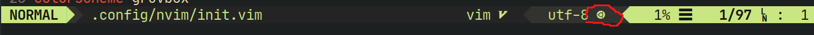
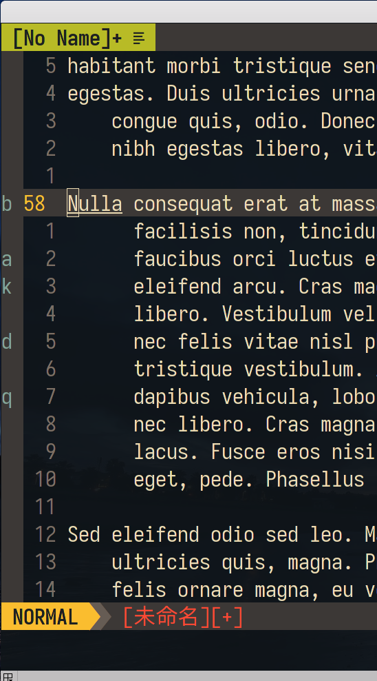
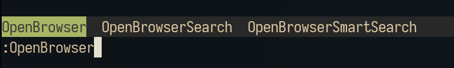
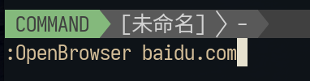
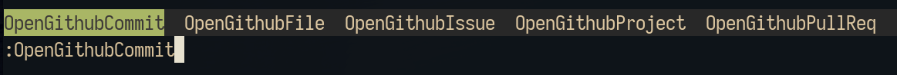

---
aliases:
  - 
tags:
  - editor
  - vim
  - plugin
  - lsp
  - markdown
  - plugin
created: 2023-01-30 11:19:11
modified: 2023-09-30 10:25:16
---
# vim 常用插件

* [Plug插件](#plug)
* [自动符号](#plugin_auto_pairs)
* [snippets插件](#plugin_snippets)
* [格式化插件](#plugin_format)
* [注释插件](#plugin_comment)
	* [nerdcommentor](#plugin_nerdcommentor)
* [状态栏插件](#plugin_statusline)
	* [airline](#plugin_sl_airline)
* [文件类型图标](#plugin_filetype_icon)
* [语法增强](#plugin_syntax)
	* [ployglot](#plugin_syn_ployglot)
		* [子插件](#plugin_syn_subplugin)
* [符号操作](#plugin_operator)

* [Git相关插件](#plugin_git)

* [预览插件](#plugin_preview)

* [小工具](#plugin_tools)
  * [高亮](#plugin_hightlight)
	* [vim-highlightedyank](#plugin_hlyank)
  * [mark 相关](#plugin_mark)
	* [vim-signature](#plugin_mk_signature)
  * [浏览器插件](#plugin_browser)
    * [open-browser](#plugin_browser_openbrowser)
    * [browser-github](#plugin_browser_github)
* [MarkDown相关](#plugin_markdown)
  * [Markdown 预览插件](#plugin_md_privew)
    * [markdown-preview](#plugin_md_privew_1)
    * [vim-markdown-preview](#plugin_md_privew_2)
    * [preview-markdown.vim](#plugin_md_privew_3)
  * [Markdown 表格相关的插件](#plugin_md_table)
   * [VIM Table Mode](#plugin_md_table_1)
   * [markdowntable](#plugin_md_table_2)
* [关于LSP及补全](#lsp_complete)

### <span id="vimplugin_plug">Plug 插件</span>

windows 下装 [Plug 插件](https://github.com/junegunn/vim-plug)

```po
md ~\AppData\Local\nvim\autoload
$uri = 'https://raw.githubusercontent.com/junegunn/vim-plug/master/plug.vim'
(New-Object Net.WebClient).DownloadFile(
  $uri,
  $ExecutionContext.SessionState.Path.GetUnresolvedProviderPathFromPSPath(
    "~\AppData\Local\nvim\autoload\plug.vim"
  )
)
```

其中 `~\AppData\Local\nvim\autoload\plug.vim`，可以自行定义下载安装 plug.vim 文件的目录，可以用官方给的，就在 `\AppData\Local\nvim\autoload` 下。如果是用 scoop 安装 neovim，可以放在 `current\share\nvim\runtime\autoload` 
 这个目录下，同样起效。

Linux vim：
```shell
curl -fLo ~/.vim/autoload/plug.vim --create-dirs \
    https://raw.githubusercontent.com/junegunn/vim-plug/master/plug.vim
```

Linux neovim：
```shell
sh -c 'curl -fLo "${XDG_DATA_HOME:-$HOME/.local/share}"/nvim/site/autoload/plug.vim --create-dirs \
       https://raw.githubusercontent.com/junegunn/vim-plug/master/plug.vim'
```

#### vim-plug 插件配置

```vim
 call plug#begin()

 Plug 'vim-airline/vim-airline'

call plug#end()
```

> 如果 begin() 中不写具体插件安装地下，windows 下会装在 `C:\Users\用户名\AppData\Local\nvim\plugged` 这个目录下。
>
> 在 `begin` 与 `end` 之间是配置各种插件

写完后，重启 nvim 后，使用 `PlugInstall` 命令来执行安装。如果不使用某插件就在配置文件中注释掉，再执行 `PlugUpdate` 命令完成移除插件。

Plug 配置插件还可以 **按需加载**:

例子:

```shell
Plug 'othree/xml.vim',{'for':'xml'}
```

```shell
Plug 'google/vim-codefmt',{'on':['FormatCode','FormatLines']}
```

常用 **按需加载**:

| `do`  | Post-update hook，某些 vim 插件在完成安装或更新后，需要执行额外的操作，可以使用 do 选项指定具体的操作或函数 |
| ----- | ------------------------------------------------------------ |
| `on`  | 按需加载: vim 命令或 `<Plug>`-mappings                         |
| `for` | 按需加载: 文件类型                                           |

### <span id="plugin_auto_pairs">自动括号匹配</span>

#### auto-pairs

[jiangmiao/auto-pairs](https://github.com/jiangmiao/auto-pairs) 这插件能自动补全匹配的括号。

```vim
Plug 'jiangmiao/auto-pairs'
```

#### vim9 版 auto-pairs

[Eliot00/auto-pairs](https://github.com/Eliot00/auto-pairs) 是 [auto-pairs](#auto-pairs) 的 vim9 适配版。

### <span id="plugin_snippets">snippets 插件</span>

#### <span id="plugin_snippets_ultisnips">Ultisnips</span>

[Ultisnips](https://github.com/SirVer/ultisnips) 是一个 snippet 引擎插件。

```shell
" snippet相关
" snippet调用引擎
Plug 'SirVer/ultisnips'
" snippet仓库
Plug 'honza/vim-snippets'
```

> [!tip]
> Ultisnips 这个插件依赖 python,而且是特定版本，特别恶心,所以慎用！
> 
> 连 [vim-snippets](#plugin_snippets_vimsnippets) 都在文档中表示：「Some people want to use snippets without having to install Vim with Python support. Yes - this sucks.」

##### ultisnips 文档

* [ultisnips的非官方中文文档](https://github.com/Linfee/ultisnips-zh-doc)
* [ultisnips-zh-doc](https://github.com/Linfee/ultisnips-zh-doc/blob/master/doc/UltiSnips_zh.txt)

---

#### <span id="plugin_snippets_snipmate">SnipMate</span>

使用另一个 snippet 引擎：**SnipMate**

**snipmate** 这个插件需要依赖其他两个插件，所需插件如下配置:

```shell
Plug 'MarcWeber/vim-addon-mw-utils'
Plug 'tomtom/tlib_vim'
Plug 'garbas/vim-snipmate'

```

#### <span id="plugin_snippets_neosnippet">Neosnippet</span>

[neosnippet](https://github.com/Shougo/neosnippet.vim) 看名字就知道是 Shougo 的作品，这是一个 snippet 引擎，定位跟 [snipmate](#plugin_snippets_snipmate) 或 [ultisnips](#plugin_snippets_ultisnips) 相同。默认使用 [neosnippet-snippets](#plugin_snippets_neosnippet_snippets) 作为 snippet 仓库。

---

#### <span id="plugin_snippets_neosnippet_snippets">neosnippet-snippets</span>

 [neosnippet-snippets](https://github.com/Shougo/neosnippet-snippets) 这是为 [Neosnippet](#plugin_snippets_neosnippet) 引擎而设的 snippet 仓库，跟 [vim-snippets](#plugin_snippets_vimsnippets) 类似。

配置：
```vim
" 使用 neosnippet-snippets 作为snippet仓库
let g:neosnippet#snippets_directory = '~/.vim/plugged/neosnippet-snippets/neosnippets'

" 把标记隐藏
if has('conceal')
  set conceallevel=2 concealcursor=niv
endif
```

> [!info] neosnippet 指定 snippets 仓库
> neosnippet 最主要配置就是指定 snippet 仓库的路径。
> 
>neosnippet 除了可以指定默认的 neosnippet-snippets 仓库外，还能指定 [vim-snippets](#plugin_snippets_vimsnippets) 为其 snippets 仓库。

```vim
" 使用Ctrl+k 触发
imap <C-k>     <Plug>(neosnippet_expand_or_jump)
smap <C-k>     <Plug>(neosnippet_expand_or_jump)
xmap <C-k>     <Plug>(neosnippet_expand_target)

smap <expr><TAB> neosnippet#expandable_or_jumpable() ?
\ "\<Plug>(neosnippet_expand_or_jump)" : "\<TAB>"

```

#### <span id="plugin_snippets_vimsnippets">vim-snippets</span>

 [vim-snippets](https://github.com/honza/vim-snippets) 是一个 snippet 仓库，它预存储了大量的不同语言的 snippet 文件。为 snippet 引擎，如 [Ultisnips](#Ultisnips) 或 [SnipMate](#SnipMate) 提供「弹药」。

vim-snippets 除了可以使用预制的 snippet 外，还能自定义 snippets 文件。

在~/.vim/目录新建一个目录 **snippets** 目录，用来存在自定义的 snippets 文件。

因为此目录位于所有插件之外，所以你自定义的 snippets 文件不会因为插件更新而被删除。

在 snippets 目录中建立你自定义的 snippets 文件，文件后缀名为 **snippets**。

例如，xml 的 snippets，就新建 **xml.snippets** 文件。

snippets 语法格式请参考 [vim-snippets](https://github.com/honza/vim-snippets)

---

### <span id="plugin_format">格式化插件</span>

#### vim-codefmt

此插件是 **google** 开发的!

```shell
Plugin 'google/vim-maktaba'
Plugin 'google/vim-codefmt'
```

vim-maktaba 这个插件得一起装，不然会报错。

vim-codefmt 使用，此插件对于 C、C++、Java 语言，依赖 clang-format，所以得先安装 clang-format,并且设置好默认的格式化配置文件。

各大语言使用的格式化工具:

* C、C++ 和 Java 用的都是 **Clang-Format**
* go 用的是 gofmt
* HTML、CSS、SASS、LESS、JSON 用的是 nodejs 的 **js-beautify**
* rust 用的是 rustfmt

关于 clang-format 请参考：[clang-format](LSP_Complete.md#clang-format)。

vim-codefmt 插件在 vim 中使用，就两个主要命令:

1. **:FormatLines**: 格式化某些行代码

2. **:FormatCode**：格式化整页代码

### <span id="plugin_comment">注释插件</span>

#### <span id="plugin_nerdcommenter">nerdcommenter</span>

[nerdcommenter](https://github.com/preservim/nerdcommenter)

简单配置：

```vim
" 注释插入空格
let g:NERDSpaceDelims = 1
" 注释插件空行
let g:NERDCommentEmptyLines = 1

" 自定义 c 语言注释
let g:NERDCustomDelimiters ={'c':{'left':'//'}}

```

nerdcommentor 默认快捷键:

注释： `<Leader>cc`

取消注释：``<Leader>cu`

`<Leader>` 默认为 `\`

> [!tip] nerdcommenter 地址更换
> 注意 此插件原来的 github 的地址为 **scrooloose/nerdcommenter**，如果原来装有的，得改下 Plug 后的字符串值为 **preservim/nerdcommenter**，然后 Clean 下再 Install。

### <span id="plugin_statusline">状态栏插件</span>

#### <span id="plugin_sl_airline">airline</span>

[vim-airline](https://github.com/vim-airline/vim-airline)

包括 airline 的样式插件

```vim
Plug 'vim-airline/vim-airline'
Plug 'vim-airline/vim-airline-themes'
```

简单配置:

```vim
let g:airline_extensions = ['branch','tabline']

" buffer文件名及路径显示格式
let g:airline#extensions#tabline#formatter = 'unique_tail_improved'

" airline样式设置
let g:airline_theme = 'dark'

" 使用powerline font
let g:airline_powerline_fonts=1

" 设置airline的theme
let g:airline_theme='dark'

```

#### <span id="plugin_sl_lightline">lightline</span>

[lightline](https://github.com/itchyny/lightline.vim) 是一个跟 [airline](#airline) 类似的状态栏插件，但它比 airline 更轻量。

---

### <span id="plugin_filetype_icon">文件类型图标</span>

[vim-devicons](https://github.com/ryanoasis/vim-devicons)



### <span id="plugin_syntax">语法高亮增强</span>

#### <span id="plugin_syn_ployglot">vim-polyglot</span>
[vim-polyglot](https://github.com/sheerun/vim-polyglot)

vim-polyglot 这个插件是插件集，它集成了众多语言相关的插件,语法高亮只是其中一个功能。
用户可以对某子插件进行自行设置。

##### <span id="plugin_syn_subplugin">部分子插件</span>

###### markdown

[vim-markdown](https://github.com/plasticboy/vim-markdown)

polyglot 中的 vim-markdown 只有高法及 **Concealing** 功能。
如果想要使用 **vim-markdown** 代码折叠，就得安装 vim-markdown 插件。

vim-markdown 折叠功能相关设置如下:

```vim
let g:vim_markdown_folding_disabled = 1 //0: 开启折叠 1: 关闭折叠
let g:vim_markdown_folding_level = 6 //折叠级别 未设置默认为1

```

其实 vim-markdown 折叠功能有点坑，折叠是折了，但展开输入内容，1 秒就重新折上~
所以还是用 vim8 内置的折叠功能或 [vim-markdown-folding](#vim-markdown-folding) 这个插件好了!

### <span id="plugin_operator">符号操作</span>

---

#### Surround

[vim-surround](https://github.com/tpope/vim-surround)

```vim
" ---------------------------------------------------------
"       surround使用
" ---------------------------------------------------------
" 添加双引号 ysiw+"
" 如果要添加tag符号，即尖括号可以使用快捷命令ysiwt
" 注意如果是ysiw<这方式，必须是左尖括号，才是成对tag
" 如果是ysiw> 使用了右尖括号,那就会变成单tag
" 替换格式: cs 符号 符号
" 如将tag符号即<>这种尖括号替换成其他符号可以使用cst快捷命令
" 删除格式: ds 符号
" 行包围符号格式: yss 符号
" 行包围添加小括号快捷命令: yssb
" 行包围尖括号得分两步：yss<或者ysst 然后输入尖括号中的内容
" 行包围尖括号道理同新加一样，分左尖括号和右尖括号，左双右单
"
" ---------------------------------------------------------
```

##### 常用命令

###### normal 模式

* `ds` ：  删除包围
* `cs` ：  修改包围
* `ys` ：  添加包围
* `yS` ：  添加包围并替换包围文本
* `yss` ：  添加一行包围
* `ySs` ：  添加包围内容独成一行
* `ySS` ：  添加包围内容独成一行
* `ysiw"` ：  单词周围加双引号
* `ysiw(` ：  单词周围加圆括号，左括号是带空格的
* `ysiw]` ： 单词周围加方括号，右括号不带空格
* `ysnw` ：  在 **n** 个单词周围加要加的符号或文本
	> [!tip]
    > 如上面的 `ysiw` 类似，`ysiw` 只是 `ysnw` 的特例，是对当前单词加东西
* `ysiWb` ：  以空格为分界加圆括号，这是不带空格的括号，大 `B` 代表不带空格的花括号
* `ysfn` ： 从光标位置到字母 **n** 加 `<span>`
* `ystn"` ： 从光标位置到字母 **n** 加 **"**

###### 可视模式

s  ： 给选中内容添加包围

S  ： 选中内容添加包围并独成一行

###### 插入模式

* `<CTRL-s>` ： 添加一个包围
* `<CTRL-s><CTRL-s>` ： 添加包围内容独成一行
* `<CTRL-g>s` ： 添加一个包围
* `<CTRL-g>S` ： 添加包围内容独成一行

---

### NerdTree

[nerdtree](https://github.com/preservim/nerdtree)

### easymotion

[vim-easymotion](https://github.com/easymotion/vim-easymotion)

#### 常用操作

(1)  **跳转到当前光标前后的位置**

`<leader><leader>w`

`<leader><leader>b`

(2) **搜索**

`<leader><leader>s`

(3) **行级跳转**

`<leader><leader>j`

`<leader><leader>k`

(4) **行内跳转**

`<leader><leader>h`

`<leader><leader>l`

### vim9-stargate

[vim9-stargate](https://github.com/monkoose/vim9-stargate) 这个是 [easymotion](#easymotion) 的 vim9 适配版。它使用的 vim9 的语法重写了

### undo tree

[undotree](https://github.com/mbbill/undotree)

```vim
" -----------------------------
"       UndoTree设置
" -----------------------------
"映射快捷键
nnoremap <leader>udt :UndotreeToggle <CR>
" 设置undo文件的存放目录(得事先mkdir)
set undofile
set undodir=~/.local/share/nvim/.undodir
```

### vim-gitgutter

[vim-gitgutter](https://github.com/airblade/vim-gitgutter)

基础配置

```vim
" -----------------------
"       GitGutter设置
" -----------------------
" 开启gitgutter
let g:gitgutter_enabled = 1

```

vim-gigutter 各种常用命令:

 `:GitGutterToggle`： 开启关闭 gutter

 `:GitGutterLineHighlightsToggle`： 开启关闭高亮相关行

### vim-fugitive

[vim-fugitive](https://github.com/tpope/vim-fugitive)

**常用命令:**

```shell
:Git commit
:Git push
```

**:Git** 后加 git 的常用命令，跟在终端下使用 git 相同，push 提交时会切出终端输入远程仓库的用户名和密码。

如果在 neovim 中使用**:Git push**不能弹出输入用户名和密码，就使用**:terminal git push**

### LoremIpsum

[loremipsum](https://github.com/vim-scripts/loremipsum)

常用命令:

```shell
:Loremipsum  " 生成默认文本
:Loremipsum 数字 " 生成指定字符数目的文本
```

### <span id="plugin_preview">预览插件</span>

[vim-livedown](https://github.com/shime/vim-livedown)

此插件使用到 nodejs 模块 livedown，所以得先安装 node 的模块:

```shell
npm install -g livedown
```

.vimrc 中加入以下代码:

```shell
Plug 'shime/vim-livedown',{'on':['LivedownPreview','LivedownToggle','LivedownKill']}
```

后面那 {'on':....} 是 Plug 的 **按需加载** 的设置

使用 python 的模块 [grip](https://github.com/joeyespo/grip)，也能预览 markdown

首先安装安装 grip

```shell
  pip install grip
```

---

### <span id="plugin_tools">小工具</span>

#### <span id="plugin_tools_startuptime">Startuptime</span>

[Startuptime](https://github.com/dstein64/vim-startuptime)


这是个一个测试 vim 各组件、插件占用启动时长的小工具。

---

#### vim-startify

[vim-startify](https://github.com/mhinz/vim-startify) 是一个 vim/neovim 启动页面的插件。

 可以手动配启动页面显示的图案
```vimscript


let g:startify_custom_header =[
		\ '  _   ___      _______ __  __  ',
		\ ' | \ | \ \    / /_   _|  \/  | ',
		\ ' |  \| |\ \  / /  | | | \  / | ',
		\ ' | . ` | \ \/ /   | | | |\/| | ',
		\ ' | |\  |  \  /   _| |_| |  | | ',
		\ ' |_| \_|   \/   |_____|_|  |_| ',
	\ ]

```

也可以使用系统的 [figlet](http://www.figlet.org) 工具生成。

安装 figlet：
```shell
pacman -S figlet
```
> [!info] 类似工具
> 与 figlet 类似的小工具，还有 `banner`、 `toilet`，哈哈，这名字有点脏，用法大同小异。

figlet 常用参数：
* `-f`：指定字体样式
* `-w`：指定输出的宽度

大概用法：
```shell
# 最简单的用法
figlet 要输出的文字
# 指定个字体
figlet -f xx 要输出的文字
# 指定输出的宽度
figlet -w 数字 要输出的文字
```

在 startify 的配置中可以调用 figlet 来生成 vim 启动页面那个图案。

直接贴出 github 上的示例：
```vimscript
let g:startify_custom_header =
       \ startify#pad(split(system('figlet -w 100 VIM2020'), '\n'))
```

---

#### <span id="plugin_mcursors">多光标</span>

##### <span id="plugin_mcursors_1">vim-visual-multi</span>

[vim-visual-multi](https://github.com/mg979/vim-visual-multi) 这个插件能使 vim 进行多光标操作。

常用操作步骤:
<kbd>Ctrl-n</kbd>：进入多光标模式，并选中当前光标所在字符。

在启动多光标模式的，继续按 <kbd>n</kbd>，能够选中相同的下一个字符。

选择完成，可以按 <kbd>i</kbd>，<kbd>a</kbd>，<kbd>I</kbd>，<kbd>A</kbd> 进入 Insert 模式，继续以下的操作。

按 <kbd>Exit</kbd> 可退出多光标模式。

---

#### <span id="plugin_hightlight">高亮</span>

##### <span id="plugin_hlyank">高亮复制</span> 

[vim-highlightedyank](https://github.com/machakann/vim-highlightedyank) 是一个实现了在复制操作时，高亮一下刚复制的文本功能的插件。

安装：
```vim
	" vim 8.0+
	Plug 'machakann/vim-highlightedyank'

	" 如果是vim 8.0以前的版本
	if !exists('##TextYankPost')
		map y <Plug>(highlightedyank)
	endif
```

高亮持续时间：
```vim
	" 默认是亮了一秒
	" 单位是毫秒
	let g:highlightedyank_highlight_duration = 1000
```

还能设置高亮的颜色：
```vim
	highlight HighlightedyankRegion cterm=reverse gui=reverse
```
> [!tip]
> 高亮颜色设置要放在 colortheme 设置之后。

#### <span id="plugin_mark">mark 相关</span>

##### <span id="plugin_mk_signature">signature</span>

[vim-signature](https://github.com/kshenoy/vim-signature) 是一个 mark 显示插件。
在侧边栏显示 mark 标记。



常用操作：

| 命令 | 说明 |
| :---: | :---: |
| mx | 添加 mark x 是该 mark 的名称 可以是大小写字母 |
| dmx | 移除当前行某个 mark x 是添加时的名称 |
| m- | 移除当前行所有 mark |

### vimspector

[vimspector](https://github.com/puremourning/vimspector)

这是一个 vim 下多语言图形界面 debug 插件!
> [!quote]
> A multi language graphical debugger for Vim

安装:

```vim
Plugin 'puremourning/vimspector'
```

---

#### <span id="plugin_browser">浏览器插件</span>

##### <span id="plugin_browser_openbrowser">open-browser</span>
[open-browser](https://github.com/tyru/open-browser.vim)

打开浏览器并跳转到指定网址。

全部命令如下图：





##### <span id="plugin_browser_github">open-browser-github</span>

快速打开 github。

[browser_github](https://github.com/tyru/open-browser-github.vim)

全部命令如下图：



---

### <span id="plugin_markdown">Markdown 相关插件</span>

#### [vim-markdown-folding](https://github.com/masukomi/vim-markdown-folding)

```vim
 let g:markdown_fold_style = 'nested' // 默认不设置是Stacked
 set foldlevel=3   //折叠级别

```

还有其他命令:

* **:set foldlevel=数字**: 设置折叠级别
* **zM**: 相当于 set foldlevel=0

#### <span id="plugin_md_privew_1">Markdown 预览插件</span>

Markdown 预览插件原理大同小异，都是通过启动一个小型［服务器］来加载渲染 Markdown 页面，从而实现预览效果。
这小型［服务器］有可能是用 Python 实现，也有可能是 NodeJS 或其他技术。

[markdown-preview](https://github.com/iamcco/markdown-preview.nvim)

这个插件是 NodeJS 实现，所以系统得装有 NodeJS 并且装上 Yarn。
常用命令：

```vim
 Start the preview
:MarkdownPreview

" Stop the preview"
:MarkdownPreviewStop
```

##### <span id="plugin_md_privew_2">vim-markdown-preview</span>

[vim-markdown-preview](https://github.com/JamshedVesuna/vim-markdown-preview)
这个插件是通过 Python 实现的,要使用此插件得先装 [Grip](#https://github.com/joeyespo/grip)(--GitHub Readme Instant Preview)

##### <span id="plugin_md_privew_3">preview-markdown.vim</span>

[preview-markdown.vim](https://github.com/skanehira/preview-markdown.vim)

此插件需要 [mrd](https://github.com/MichaelMure/mdr)(--MarkDown Renderer)
>mdr is a standalone Markdown renderer for the terminal.
因为这个插件是在 vim 内部使用 terminal 方式预览，所以对 vim 版本有限制：Vim 8.1.1401+

#### <span id="plugin_md_table">Markdown 表格相关的插件</span>

##### <span id="plugin_md_table_1">VIM Table Mode</span>

[VIM Table Mode](https://github.com/dhruvasagar/vim-table-mode) 这个插件能够简化绘制表格操作。

使用 **:TableModeToggle** 命令 或 `<Leader>tm` 快捷命令启动 Table 模式。
使用 **:TableModeDisable** 命令就能退出 Table 模式。

使用小技巧:

markdown 表格的对齐方式那个行的输入。
如果是居中对齐, markdown 表格要求是 **| :---: |**这种格式 ，<br> 
在此插件下，可以 输入
```markdown
|:-:|
```
就能快速 " 生成 " 一个 **| :---: |** 这个对齐项

##### <span id="plugin_md_table_2">markdowntable</span>

[markdowntable](https://github.com/nora75/markdowntable) 用来快速生成一个表格。

常用操作:
```vim
:TableMake 行数 列数
```

---

### <span id="lsp_complete">关于 LSP 及补全</span>

[LSP及补全](./LSP_Complete.md)

